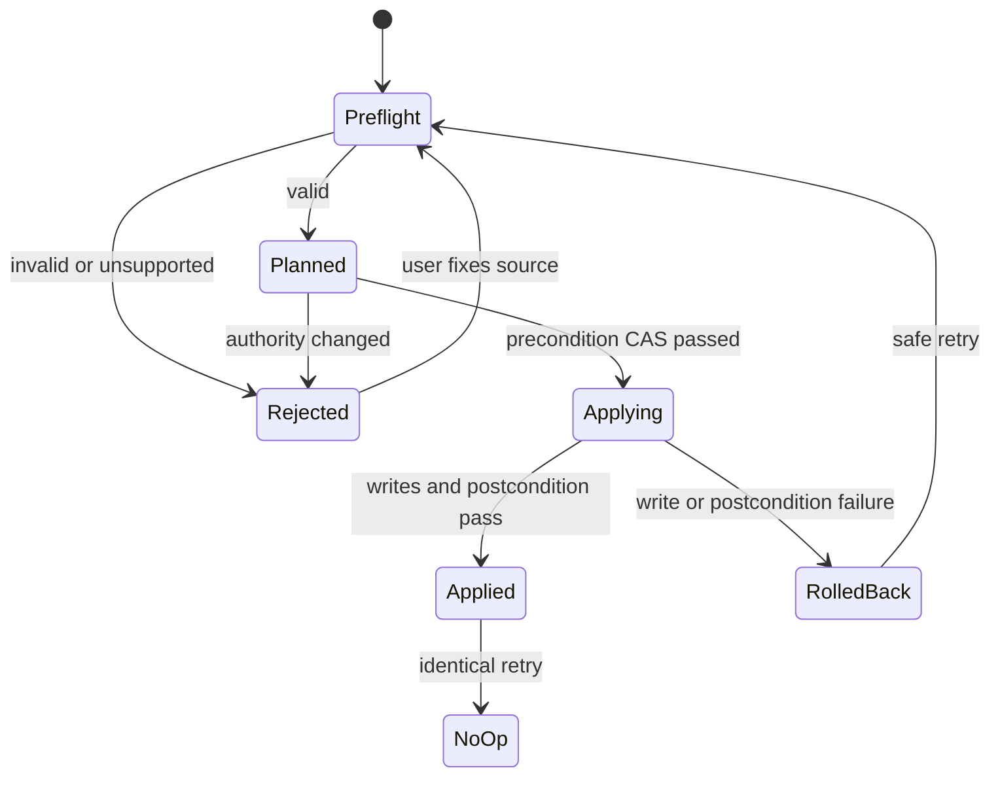
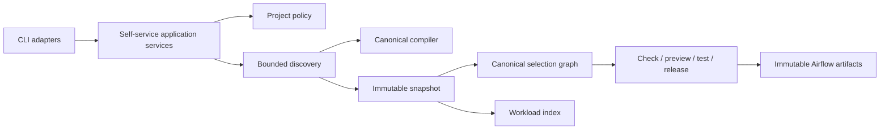

# Feature design: unified beginner initialization and domain-first discovery v1

- Status: IMPLEMENTED
- Owner: dpone maintainers / Codex integrator
- Issue: maintainer-requested self-service core review after parallel release work
- Target release: 0.73.20
- Last verified: 2026-07-26

## Approval

The maintainer explicitly requested implementation and a fresh global review of
the domain-first self-service changes. This specification narrows that work to
one additive authoring layout and one canonical discovery/selection path. It
does not change the frozen industrial Airflow architecture or create another
runtime engine.

## Executive summary

The historical flat layout is expressive, but a beginner must understand and
edit a pipeline source, a shared domain catalog, ownership, tests, and Airflow
defaults. Domain-first authoring makes ownership visible in the directory tree
and lets a new engineer create a domain-owned pipeline without editing a shared
catalog:

```text
workloads/<domain>/ownership.yaml
workloads/<domain>/pipelines/<pipeline-id>/pipeline.yaml
```

The feature preserves one editable primary pipeline source, compiles it through
the existing canonical authoring compiler, projects one ephemeral workload
index, and feeds the existing selection, check, preview, test, release, and
publish services. The measurable outcome is a five-command, credential-free
First DAG journey with no Airflow Python and no generated catalog as authority.

## Personas and customer journey

| Persona | Goal | Current pain | Success signal |
| --- | --- | --- | --- |
| New data engineer | Create a domain-owned pipeline | Must learn shared catalogs before the first DAG | Preview in at most 15 minutes without Airflow Python |
| Domain owner | Make ownership and approval explicit | Governance metadata is detached from pipeline location | One authoritative `ownership.yaml` per domain |
| Platform engineer | Apply one policy across CLI and CI | Different commands may discover different files | One deterministic snapshot and fingerprint |
| Airflow operator | Parse only immutable artifacts | Repository scanning can add parse I/O and drift | Provider behavior remains bounded and parse-safe |
| Maintainer | Preserve flat compatibility | A new layout could silently reinterpret old projects | Missing `layout` remains exactly flat mode |

The beginner journey is:

```bash
dpone init project --airflow --layout domain-first
dpone init domain crm \
  --owner-team data-crm \
  --owner-contact crm@example.com \
  --approver-team data-platform
dpone init pipeline orders_daily \
  --domain crm \
  --route mssql:clickhouse:incremental_merge \
  --from mssql_dev:dbo.orders \
  --to clickhouse_dev:analytics.orders \
  --key order_id
dpone check crm/orders_daily
dpone airflow preview orders_daily
```

All commands are credential-free. Connection references are logical. Secret
resolution, live probing, and production deployment remain platform steps.

## Scope

### In scope

- `dpone.project.v1` layout policy `flat | domain_first`.
- `dpone init domain` with explicit owner, contact, and approver.
- Domain-first `init pipeline` with `--domain`, `--route`, `--from`, `--to`,
  `--key`, and durable `--airflow | --no-airflow`.
- Exact-depth, no-follow, bounded project discovery.
- Canonical compilation of every discovered primary source.
- Project-wide pipeline-id uniqueness.
- One `dpone.workload-index.v1` projection and deterministic change impact.
- One canonical selection graph used by single and project-scoped operations.
- Read-set and namespace CAS around scaffolding/discovery.
- Flat compatibility and fail-closed mixed-layout detection.
- Structured errors, generated schemas, CLI reference, tutorial, ADR, and
  compatibility guidance.

### Non-goals

- Automatic flat-to-domain-first file migration.
- Inferring multi-workload DAGs from directory nesting.
- Repository discovery inside Airflow DAG parsing.
- Making the workload index editable or committing it as authority.
- Editing secrets, Vault paths, releases, or deployments from scaffolding.
- Adding a second route/recipe registry.
- Changing the canonical manifest IR or execution engine.

### Assumptions and constraints

- Pipeline ids are unique project-wide in v1.
- The layout root is project-relative POSIX syntax and cannot be a symlink.
- Discovery accepts only direct domain and pipeline children at documented
  depths.
- `classic`, `flow`, and `folder` remain mutually exclusive and compile through
  `AuthoringCompiler`.
- `metadata.airflow` is a boolean. Legacy sources that omit it remain enabled;
  new scaffolds persist the effective decision.
- New CLI, schemas, and errors are additive.

## Public contract

### CLI

Canonical usages are generated in
[`docs/cli-reference.md`](cli-reference.md). Initialization supports
`text | json | md`; check and preview preserve their established
`text | json` formats. These beginner commands share the following exit and
stream contract:

| Exit | stdout | stderr | Meaning |
| ---: | --- | --- | --- |
| `0` | bounded result in the command's documented format | empty | success or deterministic no-op |
| `1` | structured validation/conflict result | empty | authoring/discovery failed |
| `2` | structured configuration result | argparse syntax only | invalid request/config |
| `4` | structured safety result | empty | confinement, CAS, or policy violation |

JSON failures use `dpone.error.v1`. Scaffolding writes only after static
preflight. Repeating identical input is `no_op`; different user-owned bytes are
a conflict and are never overwritten.

`--route` and `--recipe` are mutually exclusive. Route lookup uses the same
capability/recipe authority as `dpone recipe list`. Unsupported or
unscaffoldable routes fail before filesystem writes.

`--no-airflow` persists `metadata.airflow: false`. Static check may pass, but
selection emits no DAG and `dpone airflow preview` returns
`DPONE_AIRFLOW_DISABLED`. A first preview creates no cache. If a verified
current local preview advertises only that pipeline, dpone atomically promotes
an empty immutable retirement projection before returning the error. A
multi-workload current is preserved and the result supplies the exact
project-preview exclusion command, so unrelated DAGs are never removed.

`dpone workload index`, `dpone workload impact`, and
`dpone workload promote` emit one UTF-8 JSON document to stdout. CI uses a
temporary file, compares that immutable candidate with
`dpone workload impact --baseline <accepted> --current <candidate>`, and binds
approval to both the candidate's raw-byte digest and semantic fingerprint.
Promotion captures those approved bytes under the project lock and replaces
the baseline only through digest compare-and-swap; first-baseline bootstrap is
create-only. Both inputs are bounded, project-confined, closed indexes.
`--baseline` remains mandatory; omission is argparse exit `2`, never a
valid-looking all-added report. Omitting additive `--current` preserves the
interactive compatibility mode that discovers the current project, but it is
not the atomic CI handoff because a checkout may change between commands.
Candidate mode reports `current_source: candidate`,
`discovery_status: not_run`, and separate validation status because it performs
no filesystem discovery.

### Python API

Application services are the reusable contract; command adapters stay thin.
The stable lazy exports are available from `dpone`:

```python
from dpone import (
    AirflowSelfServiceService,
    LoadedProjectSelectionGraph,
    ProjectDiscoveryService,
    ProjectDiscoverySnapshot,
    ProjectSelectionLoader,
    WorkloadIndexChangeImpact,
    build_airflow_self_service_service,
    compare_workload_indexes,
    workload_index_from_snapshot,
)
```

Roots and collaborators are injected at composition boundaries. These services
do not import CLI modules, POSIX adapters, or Airflow. The builder wires the
standard project lock; advanced embedders inject `AuthoringLockFactory`
directly. Ordinary `import dpone` remains lazy. Provider APIs remain unchanged.

### Manifest and schema

Project configuration:

```yaml
schema: dpone.project.v1
layout:
  mode: domain_first
  root: workloads
  pipeline_id_scope: project
```

Ownership:

```yaml
schema: dpone.domain-ownership.v1
domain: crm
owner:
  team: data-crm
  contact: crm@example.com
approvers:
  github_team: data-platform
```

The primary source is the only editable pipeline authority and persists:

```yaml
metadata:
  id: orders_daily
  domain: crm
  airflow: true
```

The closed `dpone.workload-index.v1` includes layout root/scope,
pipeline/domain/owner, ownership fingerprint, source path/digest, canonical
semantic fingerprint, connection refs, folder dependencies, Airflow
participation, and a composite workload fingerprint.

Digest syntax is lowercase `sha256:<64 hex>`. Validation recomputes every
workload fingerprint and the project fingerprint; declared digests are not
trusted.

### Artifacts and evidence

The workload index is ephemeral build-plane evidence, not authoring.
`dpone.workload-change-impact.v1` records added, modified, and removed ids
against a validated baseline. Selection state uses the composite workload
fingerprint, so ownership, dependencies, SQL, and Airflow participation all
affect `state:modified`.

Single-pipeline preview binds that composite fingerprint into release identity
and provenance. Project preview uses the canonical selection fingerprint.
Release/deployment schemas remain unchanged.

### Compatibility and migration

- Missing `layout` is historical flat mode.
- Flat paths and shared `domains/*.yaml` remain valid.
- Domain-first never writes `domains/*.yaml`.
- Existing sources that omit `metadata.airflow` remain enabled.
- No automatic layout migration occurs.
- Pre-release workload-index baselines that lack the closed fields or contain
  inconsistent fingerprints must be regenerated.
- Moving a source between layouts requires reviewed migration and semantic
  fingerprint comparison.

## Detailed algorithm

### Project/domain/pipeline initialization

```text
acquire project authoring lock
read one pinned bounded project configuration snapshot
classify authority: empty | flat | domain_first | mixed | unsafe
reject conflicting, mixed, or unsafe authority before writes
validate project/domain/pipeline ids and ownership
resolve route or exact recipe through canonical capability authority
validate external recipe domain against requested domain
validate logical locators and non-secret answer overlays
compile the candidate primary source through AuthoringCompiler
capture all consumed digests and exact-depth namespace observations
produce deterministic change plan and unified diffs
CAS-check read set, namespaces, and project fingerprint
apply authoring files with rollback journal
postcondition-check expected authority and every planned byte sequence
on failure: remove scaffold-owned bytes and report preserved concurrent bytes
```

The private no-follow lock file is content-addressed by absolute project root,
not by its shared parent. Its identity remains stable before and after a new
project directory exists. Waiting is bounded; independent sibling projects
never serialize each other. CAS binds built-in answers, external recipe
catalog/closure/answers, ownership, project configuration, and every
pre-existing workload identity through final apply.

Every directory created by scaffold apply receives a device/inode rollback
receipt. Failure removes only transaction-owned files and then the same
still-empty directories deepest first. Concurrently replaced or populated
directories are preserved and reported instead of recursively deleted.

Disabled-preview retirement validates a non-runnable `local_preview` containing
only the target workload, captures that deployment id, and uses the same id as
the promotion CAS baseline. It rechecks source authority and retirement
eligibility inside the promotion lock. The retirement release is universal
and byte-identical; workload-specific retirement context never changes
environment-neutral release bytes.

Promotion validates the inspected immutable activation and evaluates the final
authoring/selection precondition while holding the cache lock. That precommit
check is the linearization authority: once it succeeds, pointer commit may not
be rolled back because editable source changes belong to the next build.
Readers therefore never observe a transient committed activation while a
post-commit compensation is attempted.

An external recipe's pinned domain is authoritative. A conflicting CLI
`--domain` returns `DPONE_PIPELINE_DOMAIN_MISMATCH`; dpone never rewrites recipe
provenance.

### Discovery and selection

```text
load one bounded dpone.project.v1 snapshot
observe direct children under layout root without following links
for each direct domain:
    validate id and ownership.yaml
    observe direct pipeline children
    for each direct pipeline:
        validate id and project-wide uniqueness
        bounded-read pipeline.yaml
        require metadata id/domain to match path
        require boolean metadata.airflow
        compile through AuthoringCompiler
        bind folder dependencies and ownership fingerprint
        compute composite workload fingerprint
re-observe namespaces and consumed digests
if drift: DPONE_SELECTION_STATE_CHANGED
sort workloads, compute project fingerprint
project the existing canonical selection graph
emit a default DAG only for airflow-enabled workloads
```

The scheduler never runs this algorithm. It reads only immutable Airflow
deployment indexes.

### Workload-index validation and impact

```text
require explicit --baseline
bounded-read baseline inside project root
validate closed JSON Schema
when --current is supplied:
    bounded-read the exact candidate inside project root
    validate the same closed JSON Schema
otherwise:
    discover one current project snapshot for interactive compatibility
require confined canonical layout_root
reject duplicate pipeline ids, including non-identical duplicate entries
for each workload sorted by id:
    recompute workload fingerprint from canonical public material
    require exact lowercase digest match
recompute and require project fingerprint
compare current/baseline by composite workload fingerprint
emit deterministic added/modified/removed sets
```

### State machine



### Edge cases

- Empty domain is valid and yields no workloads.
- Missing ownership fails before pipeline creation.
- Duplicate ids across domains fail project-wide.
- Added/removed entries during discovery fail namespace revalidation.
- Added/removed entries before project-preview promotion fail the final
  selection CAS.
- A source change between plan/apply fails CAS and rolls back owned writes.
- Symlinks and traversal are safety errors, never skipped entries.
- Folder dependency changes affect composite identity.
- `metadata.airflow: false` is valid and emits no DAG. A fresh preview creates
  no artifact; a matching single-workload local preview is retired through an
  empty immutable projection before the command fails. A multi-workload current
  is preserved and requires an explicit bounded project refresh.
- Malformed/forged baselines fail closed.
- Existing different target bytes remain a conflict; no universal `--force`.

## Architecture

| Component | Existing/new | Responsibility |
| --- | --- | --- |
| Project config/layout policy | extended | One pinned layout/Airflow authority |
| `AuthoringAuthorityGuard` | new | Project/domain layout and config CAS |
| `DomainFirstScaffoldGuard` | new | Read-set, namespace, and post-apply CAS |
| `ScaffoldApplier` | extended | Atomic apply, rollback journal, hooks |
| `ProjectDiscoveryService` | new | Exact-depth canonical discovery snapshot |
| Discovery identity/namespace modules | new | Fingerprints and bounded observations |
| `ProjectSelectionLoader` | extended | Flat/domain-first adapter to one graph |
| Workload index/impact application service | new | CI projection and comparison |
| Project authoring lock adapter | new | Injected POSIX advisory-lock implementation |
| Self-service composition facade | new | Stable constructor plus default POSIX lock wiring |
| CLI adapters | extended | Parse/render only |

Dependency direction is CLI -> readiness/application -> manifest/domain and
ports -> confined adapters. The public workload-index field vocabulary lives
in `dpone.contracts.workload_index`. Generic layout classification, discovery
snapshots, canonical identity material, fingerprint algorithms, and CAS policy
live in `dpone.manifest`; closed serialized-index validation and change-impact
contracts live in `dpone.services.workload_index_contract`, while projection
orchestration lives in `dpone.services.workload_discovery_projection`. The
POSIX advisory lock lives in `dpone.adapters` and is injected into the
self-service application service. The root-package
`AirflowSelfServiceService` is an outer compatibility facade; the core service
still requires explicit lock injection. Discovery imports neither Airflow nor
vendor SDKs.



### Alternatives and tradeoffs

| Alternative | Advantage | Disadvantage | Decision |
| --- | --- | --- | --- |
| Shared catalogs only | No new layout | High beginner ceremony | Keep as flat compatibility |
| Recursive scan | Flexible nesting | Unsafe and nondeterministic | Reject |
| Commit workload index | Easy CI diff | Second authority and drift | Reject |
| Infer DAGs from folders | Minimal authoring | Couples ownership/orchestration | Reject |
| Exact-depth discovery | Bounded and explainable | Deliberately constrained | Adopt |

ADR 0031 records this decision. Runtime, release/deployment, and provider
boundaries do not change.

New modules split stable variation points: identity, namespace observation,
reader, discovery orchestration, paths, preflight, overlays, and parser
composition. No module or import-graph budget may regress relative to
`docs/benchmarks/quality_budgets.yml`.

## Market comparison

Official sources were refreshed on 2026-07-26. This feature makes no universal
product-superiority claim; comparison is limited to beginner ceremony and
parse-safety.

| System/version | Relevant pattern | Decision | Official source |
| --- | --- | --- | --- |
| dlt 1.29 / dltHub | Concise source/destination pipeline initialization | Adopt route-first scaffold; do not require Python authoring | [Initialize a pipeline](https://dlthub.com/docs/hub/ingestion/init) |
| Airbyte | Guided declarative connector choices | Adopt capability-filtered choices; connector building is out of scope | [Connector Builder](https://docs.airbyte.com/platform/connector-development/connector-builder-ui/overview) |
| Astronomer Cosmos | Project-to-DAG translation with separate execution configuration | Adopt static provider/artifact boundary; reject scheduler repository discovery | [How Cosmos works](https://astronomer.github.io/astronomer-cosmos/getting_started/how-cosmos-works.html) |
| Fivetran | Low-ceremony guided connector setup | Adopt measurable onboarding; managed control plane is out of scope | [Documentation](https://fivetran.com/docs) |
| Informatica, Pentaho, SSIS | Visual integration designers | N/A: no visual designer in this additive layout | N/A |
| gusty | YAML DAG generation | N/A: this feature solves authority/discovery, not another DAG DSL | N/A |
| Apache Beam | Processing model | N/A: not a repository self-service layout | N/A |

## Measurable differentiation

```yaml
axis: beginner domain-owned Airflow authoring
scenario: empty repository to checked non-runnable DAG preview
baseline: historical flat flow requiring shared-catalog knowledge
metric: completion time, commands, help, Airflow Python
target:
  p50_completion_minutes: 15
  commands: 5
  without_help: ">=80%"
  airflow_python_written: false
procedure: milestone study with at least five new users
artifact: future versioned domain-first usability-study contract
current_evidence: UNVERIFIED
limitations: >
  dpone.self-service-usability-study.v1 is frozen to the earlier
  project/pipeline/check/preview/sample protocol. Automated tests prove
  correctness, not this domain-first human journey.
```

## Security, privacy, and operations

- Discovery/scaffolding are project-confined and reject traversal, backslashes,
  NUL bytes, and symlink escape.
- Reads and YAML are bounded; no network, DB, secret, or Airflow calls occur.
- Locators/answers contain logical connection refs, never credentials.
- Ownership contact contributes to identity but is not projected into normal
  selection metadata.
- Project operations use a lock plus CAS; external editors trigger rollback.
- Airflow provider parsing remains unchanged and reads no authoring files.

## Test and certification plan

| Layer | Scenario | Environment | Evidence |
| --- | --- | --- | --- |
| Unit | ids, roots, fingerprints, namespace observations | local | pytest |
| Contract | schemas, CLI I/O, errors, exact-depth paths | local | pytest/generated docs |
| Integration | five-command flat/domain-first journeys | local | automated preview artifacts |
| Compatibility | flat default and omitted Airflow metadata | local | pytest |
| Security | traversal, symlink, CAS race, malformed baseline | local | structured errors |
| Performance | SLOC/layer/discovery budgets | CI | quality reports |
| Human usability | domain-first five-command journey | future milestone study | `UNVERIFIED` |
| Live certification | N/A: no route/runtime capability change | N/A | `SKIP/UNVERIFIED` |

Broad validation includes the change-aware selector, all non-live tests, strict
docs build, package builds, and fresh-context review. Missing live environments
are never reported as PASS.

## Documentation plan

- Domain-first First DAG tutorial.
- Separate discovery/CI explanation and operations/recovery guide.
- Configuration reference for layout, ownership, index, and CLI I/O.
- ADR 0031 and architecture diagram.
- Generated CLI and GitOps schema references.
- Structured error pages with executable next steps.
- Compatibility and changelog entries.

## Rollout and rollback

The layout is additive and opt-in. Flat is a rollback only before domain-first
authority exists. A non-empty project cannot switch modes implicitly; rollback
requires reviewed migration. Any correctness, CAS, or identity gate failure
blocks release.

## Implementation evidence

Implementation is accepted only when the exact branch passes focused
domain-first, transaction, CLI-reference, schema, and compatibility tests plus
the repository-wide non-live quality gate. Required race regressions include:

- external flat authority appearing during project initialization;
- `dpone.yaml` changing during domain initialization;
- another workload appearing between pipeline preflight and postcondition;
- ownership changing between preview check and pointer promotion;
- selected source or ownership changing inside the final promotion lock;
- selected project namespace changing inside the final promotion lock;
- built-in or external recipe answers/catalog changing before scaffold apply;
- failure while rereading the final scaffold state;
- disabling Airflow after a matching preview has become current.

Local branch evidence recorded on 2026-07-26:

| Gate | Status | Observed result / artifact |
| --- | --- | --- |
| Focused domain-first, schema, recipe, CLI, and race regressions | PASS | Targeted pytest suites passed after the final service-boundary relocation |
| Repository non-live tests | PASS | `7703 passed`, `557 skipped`; one existing multiprocessing deprecation warning |
| Ruff and formatting | PASS | All checks passed; 3774 files formatted |
| Static typing | PASS | Mypy passed for 690 source files |
| Import, layer, module-size, and architecture fitness | PASS | No violations; average clustering `0.179`, cross-layer ratio `0.300` |
| Generated references, Airflow public contracts, and compatibility | PASS | 3/3 references; CLI 21/21, package 1/1, Python 11/11, schemas 59/59; 19 compatibility entries |
| Documentation | PASS | 642 Markdown files and 2345 links; 30 language-contract tests; strict MkDocs build |
| Packaging metadata | PASS | `/tmp/dpone-domain-first-final7-dist`; all eight wheel/sdist artifacts passed Twine |
| Installed-wheel journey | PASS | `/tmp/dpone-domain-first-final7-smoke` and `/tmp/dpone-domain-first-final7-workspace`: project, domain, route-first pipeline, check, preview, hermetic test, workload index/impact/CAS promotion, and parse-safe root Python API |
| Fresh-context review | PASS | Architecture, transaction/certification, docs/UX, and release reviewers completed; root identity, rollback recovery, bounded parsing, error truthfulness, CLI contracts, and symlink-root promotion safety findings were covered by regression tests |
| Human beginner study | UNVERIFIED | Requires at least five new users; automated tests are not substituted |
| Live route certification | N/A | No runtime route capability changed; no live environment was used |
| Commit-bound PR CI | UNVERIFIED | Local evidence is not promoted to release certification; the PR commit must pass repository CI |

These automated artifacts establish correctness and compatibility. Human
usability remains `UNVERIFIED` until a new versioned domain-first study runs
with at least five first-time users.

## Agent execution plan

| Role | Owned paths | Read-only paths | Forbidden paths |
| --- | --- | --- | --- |
| Integrator | all files in this scoped diff | repository | unrelated user changes |
| Architecture reviewer | none | architecture/discovery/scaffold diff | all writes |
| Test reviewer | none | tests/schemas/identity diff | all writes |
| Docs/UX reviewer | none | CLI/docs/errors/tutorial diff | all writes |

Only the integrator writes shared semantic files. Review agents are read-only,
so parallel-writer task contracts are not required.

## Approval checklist

- [x] User problem and CJM are clear.
- [x] Algorithm and failure semantics are implementable without guessing.
- [x] Public contracts and compatibility are explicit.
- [x] Architecture and alternatives are justified.
- [x] Relevant market research uses current official sources.
- [x] Claimed differentiation is measurable.
- [x] Tests, evidence, docs, rollout, and rollback are complete.
- [x] Path ownership and integration plan are conflict-safe.
- [x] Maintainer changed status to `APPROVED`.
