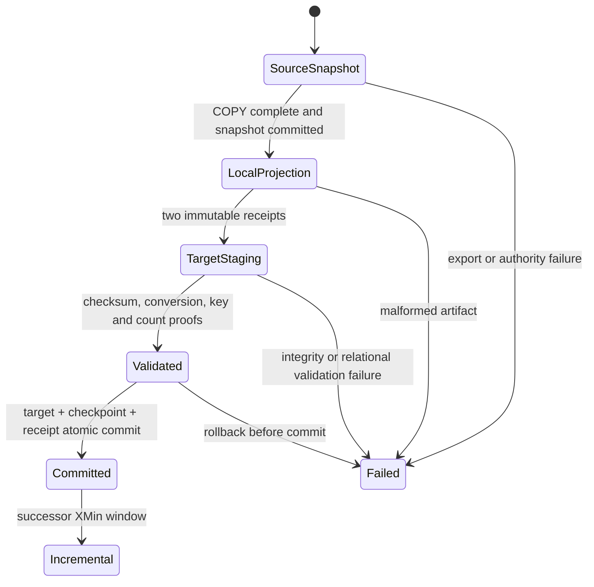

# Feature design: XMin snapshot baseline throughput v1

- Status: APPROVED
- Owner: dpone maintainers
- Issue: production follow-up to PostgreSQL standby snapshot closure
- Target release: 0.74.8
Last verified: 2026-08-19
Approval: maintainer explicitly requested a systemic, market-aligned fix without
monkey patches on 2026-08-19.

## Executive summary

The PostgreSQL `COPY TO STDOUT` phase can export a 4.5 million-row relation in
seconds, but the first XMin + complete-key reconciliation run currently spends
tens of minutes in local artifact preparation. The hot path creates an
attempt-local SQLite B-tree one row at a time and rereads large files several
times before SQL Server performs the same set-based null, duplicate, trailing
space, checksum, conversion, and key-index validation.

This change keeps the existing correctness boundary and makes it set-based:
the source writes immutable row-checksummed delta and key artifacts in one
sequential pass, while SQL Server remains the authority for relational key
semantics. File SHA-256, physical file identity, wire-contract digest, exported
row count, BCP row count, staging row count, per-row wire checksum, typed
conversion, key uniqueness, key parity, target row hash, checkpoint and receipt
remain fail-closed.

The measurable production objective is that local preparation is linear,
sequential-I/O only, and contains no per-row database calls. For the SaMpLe MeTrIcS
reference relation (4.5M rows, about 1 GiB wire data), the complete governed DEV
run must finish in less than 10 minutes and a no-change successor must finish in
less than 5 minutes on the deployed Airflow worker profile. No production claim
is made until those exact live measurements pass.

## Personas and customer journey

| Persona | Goal | Current pain | Success signal |
|---|---|---|---|
| Data engineer | Bootstrap XMin safely on an existing large table | A 13-second export is followed by tens of minutes of local processing | First run completes under the stated SLO and writes one atomic checkpoint receipt |
| Platform engineer | Keep corruption and duplicate detection fail-closed | Performance work can accidentally remove evidence | All byte, row-count, schema, conversion, uniqueness and parity negatives remain green |
| Operator | Understand whether time is spent in source, local artifact work, BCP or target DML | One task duration hides the bottleneck | Structured phase timings and row/byte counters identify every boundary |

Journey: validate manifest and authorities -> open one PostgreSQL RR snapshot ->
export one complete relation -> close the source snapshot -> build delta and key
artifacts sequentially -> BCP immutable artifacts -> validate and normalize
set-wise -> mutate only new/changed/deleted target rows -> atomically commit
target, XMin checkpoint and receipt -> run again using only the XMin delta.

## Scope

### In scope

- PostgreSQL whole-file XMin snapshot artifacts for MSSQL key reconciliation.
- One-pass baseline projection of delta and complete keys.
- Removal of the source-side per-row SQLite uniqueness index.
- SQL Server set-based key validation as the sole relational authority.
- Additive phase timing evidence and performance regression tests.
- Existing manifests remain valid; no new user option is required.

### Non-goals

- Skipping the initial complete source observation.
- Fabricating or manually seeding XMin state.
- Weakening file identity, SHA-256, BCP, conversion, parity or atomic receipt
  checks.
- Changing physical-delete reconciliation semantics.
- Treating a small unit benchmark as production evidence.

### Assumptions and constraints

- `BulkTextCodec` prevents literal field/row terminators from appearing in
  encoded text fields.
- SQL Server native staging validates nulls, conversions, binary text-key
  equality and duplicates before business-table mutation.
- The complete key set and delta are bound to the same snapshot token and scope
  digest.

## Public contract

### CLI, Python API and manifest

No new command, import or manifest key. Existing XMin + `key_snapshot` routes
retain their behavior. Diagnostic phase timings are additive log fields.

### Artifacts and evidence

`DeltaSnapshotReceipt` and `KeySnapshotReceipt` remain complete SHA-256
receipts. Row-checksum columns remain in the wire files. The producer creates
each checksum once; the sink verifies it after BCP. `FileArtifactReceipt`
continues to verify exact bytes immediately before and after BCP.

### Compatibility and migration

The change is backward-compatible at the manifest and state-table layers.
Error timing changes only for null, duplicate, or SQL-equivalent text keys:
they are now rejected by MSSQL native staging before target business DML rather
than by a local SQLite index before BCP. Stable MSSQL reconciliation error codes
remain authoritative. Existing checkpoint and receipt rows need no migration.

## Detailed algorithm

1. Open the branded PostgreSQL repeatable-read snapshot and verify source
   identity.
2. Export the complete baseline once with `COPY TO STDOUT`; capture row count
   while streaming and close the source snapshot immediately after COPY.
3. Scan the immutable raw file once. For each row:
   - validate the exact source field count;
   - append the existing SHA-256 wire-row checksum to the delta output;
   - project key columns, append their checksum, and write the key output.
4. Capture immutable file receipts for both outputs and delete the raw input.
5. BCP each file only after exact file identity/SHA/wire-contract validation;
   verify again after BCP and require vendor/staging row counts to match.
6. In SQL Server, validate row checksums and conversions, create native staging,
   reject null/padded/duplicate keys set-wise, and create the unique key index.
7. Under the existing target transaction and applock, compare target and delta
   by unique key plus canonical row hash; update only changed rows, insert only
   missing rows, and reconcile deletes from the complete key table.
8. Commit target changes, XMin checkpoint, repair consumption and receipt in one
   transaction. A failure leaves the previous checkpoint authoritative.
9. A successor run starts from the committed XMin and exports only its bounded
   delta plus the complete key image required for physical-delete detection.

### State machine



### Edge cases

- Empty input creates two zero-row receipts and still proves target parity.
- Null, duplicate, padded text and SQL-equivalent keys fail before business DML.
- File replacement, truncation, append, symlink or scope escape retain their
  typed artifact-integrity failures.
- Crash before the target commit retains the previous checkpoint; commit-ACK
  ambiguity is resolved by the durable receipt probe.
- Schema, source/target identity, database topology and route changes remain
  bound to existing signed authorities.

## Architecture

| Component | Responsibility |
|---|---|
| Baseline snapshot artifact builder | One sequential raw read; write delta and key artifacts and receipts |
| Delta/key artifact wrappers | Immutable resource ownership and materialization protocol |
| MSSQL staging evidence authority | Exact pre/post BCP file proof and row-count agreement |
| Snapshot staging normalizer | Set-based checksum, conversion, null and text-key validation |
| Snapshot contract/finalizer | Unique-key authority, parity, changed-row DML and atomic state receipt |

The new builder depends only on artifact contracts and `BulkTextCodec`. It does
not own connectors, state, target DML or global services. Composition remains in
the PostgreSQL snapshot extractor.

### Alternatives and tradeoffs

| Alternative | Advantages | Disadvantages | Decision |
|---|---|---|---|
| Keep per-row SQLite profile | Earliest duplicate detection | Random disk B-tree work duplicates MSSQL validation and is catastrophically slow on network-backed worker storage | Reject |
| Manually seed checkpoint | Fast | No same-snapshot parity or atomic receipt; can lose updates/deletes | Reject |
| Remove all checksums | Fastest | Weakens the existing artifact trust boundary | Reject |
| One-pass files + set-based MSSQL validation | Linear sequential I/O, preserves all target-side proofs | Duplicate errors occur after staging creation | Adopt |
| Full table swap | Predictable bulk load | Rewrites data, changes physical identity/permissions and is unnecessary for an equal target | Reject |

ADR: not required. This replaces a redundant implementation inside the already
approved XMin snapshot contract; state, identity and public authoring remain
unchanged.

Quality budget: one cohesive builder below 400 SLOC; delta/key wrappers shrink;
no new cross-layer dependency.

## Market comparison

Research verified 2026-08-19 against official documentation.

| System | Relevant capability | Observed design | Adopt/reject |
|---|---|---|---|
| Airbyte | Incremental append + deduped | First sync is full; later runs sync new/modified rows and use primary-key deduplication | Adopt delta + set-based key semantics; reject history-table duplication for this target contract. [Source](https://docs.airbyte.com/platform/using-airbyte/core-concepts/sync-modes/incremental-append-deduped) |
| Fivetran | Database initial and incremental sync | Initial sync copies history; later batches update only new/changed data using cursors and merge/upsert | Adopt explicit initial/incremental phases and changed-row DML. [Source](https://fivetran.com/docs/connectors/databases) |
| Microsoft SQL Server | Set-based DML | `UPDATE ... FROM`, `INSERT ... SELECT`, `NOT EXISTS`, deterministic joins, `OUTPUT`/row counts and indexed predicates are native set operations | Adopt separate deterministic UPDATE/INSERT/DELETE statements; continue avoiding SQL Server `MERGE`. [UPDATE](https://learn.microsoft.com/en-us/sql/t-sql/queries/update-transact-sql) [EXISTS](https://learn.microsoft.com/en-us/sql/t-sql/language-elements/exists-transact-sql) |
| Informatica Data Ingestion and Replication | Initial + incremental load | CDC starts before/during initial load so captured changes follow the baseline | Same ordering goal, but XMin snapshot+checkpoint is dpone-specific. [Source](https://docs.informatica.com/content/dam/source/GUID-3/GUID-3A292783-0D9B-4870-A5F5-71E96057503F/43/en/CMI_May2025_MonitoringDataIngestionAndReplicationJobs_en.pdf) |
| dlt | N/A | Library load packages differ from this PostgreSQL XMin/MSSQL atomic state contract | No direct pattern adopted |
| Pentaho / SSIS | N/A | General ETL tooling; no public equivalent for this signed same-snapshot authority contract | N/A |
| gusty / Astronomer Cosmos | N/A | Orchestration authoring layers, not database replication engines | N/A |
| Apache Beam | N/A | Stream/batch programming model, not an MSSQL target-state adapter | N/A |

## Measurable differentiation

```yaml
axis: cold-baseline end-to-end latency with exact state and delete reconciliation
scenario: PostgreSQL to MSSQL, 4.5M rows, about 1 GiB, existing equal target
baseline: deployed 0.74.7 run exceeded 45 minutes before the second table completed
metric: task wall time; local projection time; rows mutated; successor wall time
target: first run <10m; local projection <2m; equal-target business DML=0; successor <5m
procedure: governed Airflow DEV run followed immediately by a no-change replay
artifact: task logs plus MSSQL target/state/receipt/catalog readback
limitations: target is tied to the observed Airflow worker and SQL Server capacity
```

## Security, privacy and operations

No new credential or permission. Temp files remain in the configured owned
scope and are deleted on every terminal outcome. Logs expose phase durations,
bytes and row counts only. Operators retry only after a typed failure; they do
not edit state rows.

## Test and certification plan

| Layer | Scenario | Expected evidence |
|---|---|---|
| Unit | baseline builder | one raw read, exact delta/key receipts and cleanup |
| Unit | null/duplicate/padded keys | MSSQL pre-business-DML typed reject |
| Integrity | replacement/truncate/append/scope escape | existing stable artifact errors |
| Contract | old manifests and state rows | unchanged parsing and replay |
| Vendor integration | equal, changed, inserted and deleted rows | exact action counts and atomic checkpoint receipt |
| Performance | 4.5M-row SaMpLe MeTrIcS baseline + no-change successor | stated SLO and zero equal-row DML |

## Documentation plan

Update the PostgreSQL XMin runbook and PostgreSQL-to-MSSQL guide with the
one-pass/set-based boundary, phase metrics, SLO procedure and recovery advice.
Update the changelog for 0.74.8.

## Rollout and rollback

Release as 0.74.8, pin the Airflow consumer synchronously, run DEV baseline and
immediate successor, then run PROD only after DEV evidence passes. Roll back the
runtime image if integrity, parity, mutation-count or latency gates fail; the
previous checkpoint remains authoritative on every pre-commit failure.

## Approval checklist

- [x] User problem and CJM are clear.
- [x] Algorithm and failure semantics are implementable without guessing.
- [x] Public contracts and compatibility are explicit.
- [x] Architecture and alternatives are justified.
- [x] Relevant market research uses current official sources.
- [x] Claimed differentiation is measurable.
- [x] Tests, evidence, docs, rollout and rollback are complete.
- [x] One integrator owns all changes; no parallel writer overlap.

## Development evidence

The first implementation checkpoint used the production builder on a local
4,520,561-row, 832.1 MiB MSSQL-delimited artifact. It produced a 1,112.3 MiB
delta and 439.7 MiB key artifact in 8.24 seconds (548,557 rows/s), with no
SQLite file and no post-write artifact rescan. This is algorithmic evidence
only, not the release SLO: the required Airflow DEV baseline and successor runs
remain the production acceptance authority.

The follow-up repository-wide runtime audit found one other row-volume use of
an embedded database: nested spill child-quality validation. It now uses
bounded 16 MiB external-sort chunks and streaming merge joins for duplicate and
hierarchy checks. A 100,000-root plus 100,000-child development probe completed
in 1.854 seconds (107,890 rows/s) and left zero temporary files. Runtime source
now has no SQLite import; the remaining SQLite adapters are explicit
control-plane registries and shared-runner coordination stores, not business-row
transport or transformation paths.
