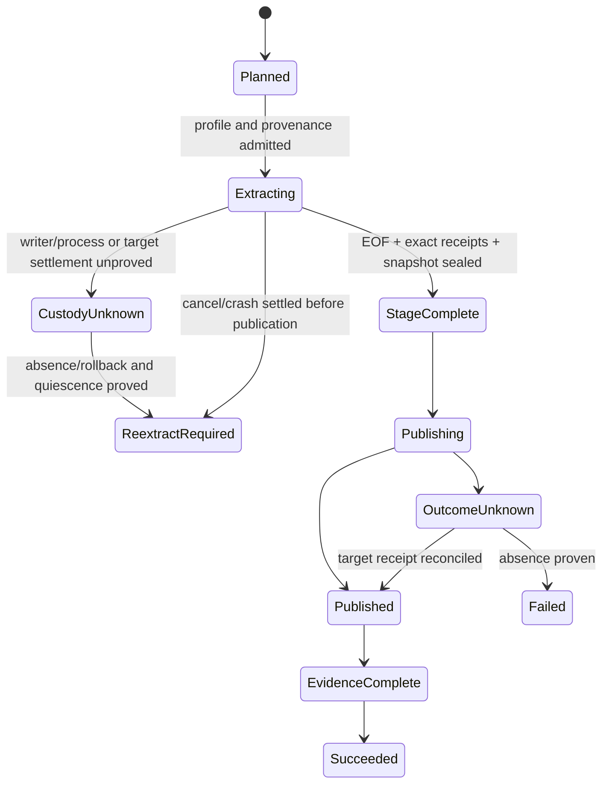

# Feature design: ClickHouse ReplacingMergeTree exact raw-row query snapshot

- Status: **APPROVED**
- Approval: maintainer explicitly approved this specification and implementation on 2026-09-30.
- Owner: dpone maintainers
- Issue: design proposal; no tracker issue assigned
- Target release: next compatible minor after the current release; no version reserved
- Design base: public repository commit `28aea0d9439ab3f24e0fb39800a041a6b6d661ed`
- Last verified: 2026-09-30

## Executive summary

The bounded native ClickHouse → MSSQL route currently admits only a directly
connected plain `MergeTree` in an `Atomic` database. That is correct for the
implemented contract, but it excludes a common event-history layout:
`ReplacingMergeTree`, where an ordinary non-`FINAL` query returns the exact
query-visible row versions and preserves their multiplicity.

Add one explicit source capability, `exact_raw_rows`, for a single bounded
ClickHouse query over `ReplacingMergeTree`. It means **the multiset returned by
one ordinary SELECT at query start**, after normal ClickHouse access control and
supported read-time visibility rules, with no `FINAL`, deduplication, aggregate,
source DDL, `OPTIMIZE`, temporary table, or source-side copy. It does not mean all
rows ever inserted: background merges may already have discarded old versions
before the query snapshot is acquired.

The capability reuses the existing single-producer extraction, bounded typed
chunks, BCP/SqlClient writers, target-local verification, atomic MSSQL
publication, durable custody, and source-free post-EOF recovery. Existing
manifests, plain `MergeTree`, BCP defaults, and recovery records retain their
current behavior. The maintainer approved this specification and implementation on 2026-09-30.

## Personas and customer journey

| Persona | Goal | Current pain | Success signal |
|---|---|---|---|
| Data engineer | Move an exact bounded raw version stream from `ReplacingMergeTree` | Native admission rejects the engine; using `FINAL` would change row multiplicity | Plan names `exact_raw_rows`, query has `final=0`, and target typed multiset equals the acquired stream |
| Operator | Know what the run read and recover without reopening ClickHouse | Part merges make before/after metadata easy to overinterpret | Evidence distinguishes query snapshot, physical provenance, and cross-query stability; post-EOF recovery is source-free |
| Data owner | Preserve duplicate/version/delete-marker rows exactly | “Replacing” is often mistaken for automatic current-state semantics | Documentation states that dpone neither deduplicates nor interprets engine version/delete columns |
| Security owner | Keep source policy and transport authority explicit | A raw-mode flag could become a policy bypass | Live admission uses direct native TLS and binds the exact relation, identity/roles, applicable read policy, and effective query settings |
| Connector author | Add one engine variation without another runtime | Existing graph already owns chunking, staging, publication, and recovery | Only source admission/query/provenance varies; the downstream route remains shared |

Customer journey:

1. **Discover:** the route guide explains `query_visible` versus
   `exact_raw_rows` and warns that `FINAL` is intentionally absent.
2. **Check prerequisites:** credential-free `dpone plan` validates manifest
   shape and static compatibility; doctor checks local runtime readiness.
   `dpone check PIPELINE --connections`
   checks registered bindings without network access. The existing pipeline-only
   `--live` path requires a configured live runner and does not itself certify a
   batch source. Runtime admission verifies engine, direct native protocol, TLS,
   database engine, schema/types/defaults, permissions, effective read profile,
   replica scope, and provenance capability before row I/O. Missing live evidence
   remains `UNVERIFIED`; a static plan never substitutes for admission.
3. **Configure:** the user adds the closed selector below; credentials remain in
   the existing connection authority.
4. **Run:** one fixed UTC half-open window and one dedicated native SELECT are
   acquired. Hidden provenance is observed but never loaded into the target.
5. **Observe:** plan shows the declared selector and replica scope. Runtime
   evidence records actual engine, replica scope,
   effective settings, relation/schema/profile identities, query ID, source EOF,
   part coverage, and typed row digest without secrets or row values.
6. **Diagnose:** overridden read settings, policy or identity drift, replica
   ambiguity, schema drift, missing metadata, or provenance mismatch fail with
   stable error codes before publication.
7. **Recover:** before EOF, first prove writer/process and target custody settled,
   then start a new invocation and re-extract; unknown custody remains held and
   blocks overlap. After verified EOF, recover from durable MSSQL stages without
   connecting to ClickHouse.
8. **Operate/upgrade:** enable per process, certify on synthetic data, compare
   exact-commit evidence, and roll back by removing the selector only after any
   unknown publication has been reconciled.

## Scope

### In scope

- Opt-in `exact_raw_rows` for direct `ReplacingMergeTree` in `Atomic`.
- `ReplicatedReplacingMergeTree` only with the pinned connected-replica contract
  below; `SharedReplacingMergeTree` remains unsupported in the first increment.
- Full refresh and existing fixed `partition_replace` window only.
- One data-bearing SELECT, `FINAL=0`, no logical deduplication, and preservation
  of duplicates across chunks and workers.
- Exact relation/schema/read-profile identity, query-bound physical provenance,
  typed stream digest, and versioned recovery bindings.
- The existing BCP and `mssql_sqlclient` backends without changed defaults.

### Non-goals

- Current-state/latest-row semantics, `FINAL`, `argMax`, or interpretation of a
  ReplacingMergeTree version or deletion column.
- CDC, cursor inference, offset resume, parallel source queries, custom SQL,
  views, `Distributed`, dictionaries, projections as an authored source, joins,
  sampling, or `LIMIT/OFFSET`.
- Source DDL, `OPTIMIZE`, `SYSTEM SYNC REPLICA`, mutations, temporary/materialized
  copies, or any other source write.
- A durable reusable ClickHouse snapshot token or a claim that two equal catalog
  reads prove that no intermediate change occurred.
- A new generic snapshot framework, new credential store, or changes to target
  publication/recovery policy.

### Assumptions and constraints

- A single-table SELECT must expose a consistent query-lifetime view of relevant
  immutable parts. The cited ClickHouse 25.6 change extends snapshot consistency
  to cross-subquery/table references; it does **not** justify a 25.6 minimum for
  this single-table capability. The implementation probes required settings and
  metadata, and certification establishes the supported server-version matrix
  ([ClickHouse 25.6 snapshot explanation](https://clickhouse.com/blog/clickhouse-release-25-06)).
- `ReplacingMergeTree` removes duplicates during asynchronous background merges;
  only `FINAL` applies replacement rules at query time. Therefore raw rows are
  the versions still visible at query acquisition, not insertion history
  ([ClickHouse ReplacingMergeTree guidance](https://clickhouse.com/resources/engineering/clickhouse-optimize-table-final)).
- The source connection is a dedicated native-driver session. HTTP fallback,
  redirect, `Distributed`, and implicit replica fan-out are forbidden.
- The source account is read-only for this route and can inspect the exact
  metadata required by preflight. Failure to inspect is unsupported, not a
  reason to weaken the gate.

## Public contract

### Manifest/schema

The only selector is under the existing source `native_transfer` object:

```yaml
source:
  type: clickhouse
  options:
    native_transfer:
      source_snapshot:
        mode: exact_raw_rows
        replica_scope: single_server
      wire:
        mode: typed_binary
        binary_format: mssql_native
      execution:
        # Existing BCP/SqlClient, chunking and resource settings remain unchanged.
```

Closed schema:

| Field | Values | Default and validation |
|---|---|---|
| `source_snapshot.mode` | `query_visible` or `exact_raw_rows` | Omission behaves exactly as today: only plain `MergeTree`; `query_visible` is the explicit spelling of that legacy behavior and is not materialized into old manifests |
| `source_snapshot.replica_scope` | `single_server` or `connected_replica` | `single_server` is required for non-replicated `ReplacingMergeTree`; `connected_replica` is required for `ReplicatedReplacingMergeTree`; any other combination fails before extraction |

`exact_raw_rows` requires `execution.verification_backend: target_local` so the
existing v2 identity and persisted recovery authority can certify source-free
recovery. BCP remains the default import backend; SqlClient remains opt-in.
This requirement applies only to the new raw selector; omitted/query-visible
legacy verification defaults are unchanged.

`additionalProperties: false`. No knobs expose `FINAL`, cache, patch, mask,
policy, or consistency settings: those are a versioned framework profile and
cannot be weakened per workload. `SharedReplacingMergeTree` and aliases fail
closed until a separate shared-storage identity contract is approved.

Example for a self-managed replicated table:

```yaml
native_transfer:
  source_snapshot:
    mode: exact_raw_rows
    replica_scope: connected_replica
```

The connection must resolve to one stable server/replica for all metadata and
row operations. A load-balanced endpoint is rejected unless its existing
connection adapter proves session/replica pinning; a new routing mechanism is
outside this change.

### CLI and Python API

No new command or top-level Python API. Credential-free plan output gains
a sanitized **declared** `source_snapshot` section and never resolves credentials
or claims a live engine, TLS endpoint, permission, policy, or replica observation.
Doctor and connection checks retain their existing behavior; they do not certify
raw source admission. Live observations occur in runtime admission. Invalid
combinations exit through existing manifest/admission failure handling and emit
one stable code, for example:

- `mssql_native.source_snapshot_mode_invalid`
- `mssql_native.replacing_raw_snapshot_required`
- `mssql_native.replica_scope_unproven`
- `mssql_native.source_read_profile_unsupported`
- `mssql_native.source_provenance_incomplete`

No fallback to character transport, `FINAL`, plain `MergeTree` semantics, or a
materialized copy occurs after an explicit request.

### Identity and artifacts

Introduce two versioned source contracts only for the new selector:

1. `dpone.clickhouse-raw-snapshot-profile.v1` is deterministic before row I/O.
   Its SHA-256 binds mode, complete engine signature (including version/delete
   arguments), relation UUID, database engine, ordered schema/default metadata,
   partition/sorting/primary keys, frozen UTC window, effective read settings,
   server revision, sanitized direct endpoint authority, replica scope/identity,
   effective authenticated principal/roles, applicable row-policy identity, and
   policy-filtered status. It also binds a versioned normalized query-shape digest,
   ordered projection/conversion digest, and canonical typed-parameter digest.
   The descriptor contains no rendered SQL, relation coordinates, host, username,
   certificate path, secret, policy predicate text, or row value.
2. `dpone.clickhouse-raw-query-snapshot.v1` is sealed at EOF. It binds the
   profile digest, opaque query ID, observed touched-part identities and
   checksum-bearing before/after physical-profile digests, selected row count and
   `_part` coverage, and the endpoint-authority agreement result. Physical file
   checksums describe ClickHouse parts; they are not presented as a logical
   business-row hash. The existing stage-complete record atomically co-binds this
   source descriptor with ordered verified receipts and their typed evidence.

No recovery-plan version is added. The existing `NativeChunkPlan.source_query_id`
is an opaque source binding rather than the vendor query ID. Omitted/default mode
keeps its current unprefixed SHA-256 bytes. For `exact_raw_rows`, freeze the
profile **before** chunk-plan/`NativeVerificationIdentityV2` construction and set:

```text
legacy_source_binding_sha256 = SHA256(canonical(relation identity, route fingerprint, UTC window))
source_query_id = "clickhouse.raw-query.v1:" + SHA256(canonical({
  "kind": "dpone.clickhouse-raw-query-binding.v1",
  "legacy_source_binding_sha256": legacy_source_binding_sha256,
  "source_snapshot_profile_sha256": source_snapshot_profile_sha256
}))
```

The real ClickHouse query ID remains the separate per-query opaque ID used by the
source driver. At EOF, add exactly one closed, namespaced
`completion_metadata.source_snapshot_v1` object with fields `kind` (constant
`dpone.clickhouse-raw-query-snapshot.v1`), `mode` (constant `exact_raw_rows`),
`source_query_binding`, `profile`, `source_snapshot_profile_sha256`, `source_eof`,
and `source_eof_descriptor_sha256`. `profile` is the bounded canonical preimage
of the profile digest. `source_eof` is the bounded canonical preimage containing
`vendor_query_id_sha256`, `rows`, `touched_part_coverage_sha256`,
`before_physical_profile_sha256`, `after_physical_profile_sha256`, and
`endpoint_authority_agreement`. Recovery recomputes both digests from these
preimages. Per-part details remain in sanitized evidence rather than making the
recovery record unbounded; the existing journal record-size limit remains a hard
fail-closed cap.

The existing journal atomically hashes this extension with EOF completion
metadata. Source-free recovery applies a closed marker decoder **before**
`ensure_runtime_bindings`, target connection/coordinate resolution, or any target
action. For a sealed EOF/resume it requires exact agreement among selector,
marker recomputation, extension kind/mode/profile/EOF digests, schema, and window;
`source_eof.rows` must equal the atomically stored stage-complete row count. Before
EOF, a known raw marker without this EOF extension is expected: existing
phase-permitted observe/reconcile/retire actions remain available to settle held
custody, but resume/publish cannot proceed. An extension before stage-complete,
an extension without the marker, an unknown marker version, or tampering fails
closed. Existing recovery-plan schema versions 1 and 2, their
current key, `NativeVerificationIdentityV2`, and chunk/evidence formats remain
unchanged. Omitted/default mode writes byte-for-byte legacy plan and completion
metadata and never gains an empty extension.

P3 source qualification records a checksum-bearing physical profile before and
after each trial: relation/replica identity, exact bounded partition and active
part identities, physical row counts, data versions/merge levels, and available
server checksums. Any **observed** mutation, merge, policy, schema, replica, or
profile drift excludes the trial. Equal endpoint observations are named
`endpoint_authority_agreement`; they do not prove absence of an intermediate ABA
change and are never called `source_unchanged`. Each trial independently binds
the actual EOF/stage-complete row count and the existing chunk-boundary-independent
typed workload digest: sum verified `native_typed_sum` values modulo 2^256 and
apply `native_multiset_digest(total_rows, total_sum)`. Repeatability compares
those stable workload values across admitted trials, excluding query
IDs, receipt IDs, timing, and other per-run fields; it never compares the whole
query-descriptor SHA. No extra monotonic fence is required or claimed.

### Compatibility and migration

- Omitted selector: identical current engine admission and artifacts.
- Plain `MergeTree`: identical query, BCP default, SqlClient opt-in, recovery,
  evidence, and failure behavior.
- Explicit raw selector on an unsupported engine: pre-I/O failure.
- Rollback: remove the selector and deploy the prior compatible release only
  after resolving every exact-raw invocation with held, `publishing`, or
  outcome-unknown custody. Existing v1/v2 recovery remains unchanged; a prior
  runtime is not an authorized recovery reader for the new marker/extension.
- No deprecation or automatic migration.

## Detailed algorithm

1. Parse the closed selector and freeze the existing UTC half-open window. Reject
   wall-clock defaults, custom predicates, or a window column outside the ordered
   admitted schema.
2. Resolve credentials through the existing authority. Establish one direct
   native TLS connection with certificate and hostname verification. Record
   sanitized native protocol/server revision; reject HTTP, redirects, native
   plaintext when the connection policy requires TLS, or an unbounded deadline.
   This is live admission only; credential-free planning performs none of these
   checks.
3. On that session, inspect exactly one relation. Admit `ReplacingMergeTree` in
   `Atomic`; admit `ReplicatedReplacingMergeTree` only for
   `connected_replica` and one pinned server/replica identity for all metadata
   and row reads. This snapshots the connected replica and makes no
   cluster-freshness or cross-replica-equality claim. Reject `Distributed`, Shared, views, aliases,
   engine-name prefixes/suffixes not explicitly parsed, and zero UUID.
4. Reuse current schema/type admission. Require unique ordinary columns with no
   `DEFAULT`, `MATERIALIZED`, `ALIAS`, or ephemeral declaration. Preserve current
   integer, decimal, string/binary, UUID, date and UTC temporal bounds. Reject
   nested/dynamic/aggregate/object types, unsupported DateTime64 precision,
   nullability ambiguity, overflow, and target mapping loss before extraction.
   In raw mode also reject business columns named `_part` or `_part_offset`:
   these names can shadow the ClickHouse virtual input provenance columns, and an
   output alias alone cannot make that ambiguity safe. Legacy admission is unchanged.
5. Build `raw-snapshot-profile.v1`. Verify the effective principal and roles,
   enumerate applicable row policies, and bind a sanitized canonical policy
   digest plus `policy_filtered=true|false`. The data SELECT runs under that same
   authority; dpone never disables or bypasses a policy. Reject only a policy or
   server-side transform whose applicability/identity cannot be inspected. Bind
   active patch/delete-mask observations and reject pending classic mutations
   while `apply_mutations_on_fly=0`; do not use a prior absence observation to
   disable query-visible patch or delete-mask application. Replacing engine
   version/delete columns remain ordinary projected values and are not interpreted.
   Freeze this profile before chunk-plan and verification-identity construction;
   derive the versioned `source_query_id` marker from it and the unchanged legacy
   source binding.
6. Freeze query settings at query level: `final=0`, `use_query_cache=0`,
   `apply_mutations_on_fly=0`, `apply_patch_parts=1`,
   `apply_deleted_mask=1`, `max_parallel_replicas=1`,
   `skip_unavailable_shards=0`, `limit=0`, `offset=0`, `extremes=0`,
   `sort_overflow_mode=throw`, and existing throwing read/result/timeout limits.
   Inspect and reject unsupported nonempty additional table/result filters;
   inspect a version-optional result `filter` when present. Never clear access
   filters to obtain admission. Bind the inspected empty/absent filter state.
   Thus committed patch parts and lightweight-delete masks visible to the acquired
   query are applied even if they appear after metadata preflight. An unsupported
   or overridden effective value fails admission. For `connected_replica`, bind
   the pinned replica identity and record status as diagnostic context; no unnamed
   consistency setting, lag threshold, or cluster-wide freshness guarantee is
   introduced.
7. Snapshot a bounded physical profile before SELECT: table UUID, partition and
   base/patch part identity, delete-mask identity, physical rows/data
   version/merge level, and server-provided file checksums. Canonically hash it as
   `physical_profile_sha256`. For a bounded window, admit only a partition expression from the
   closed window-column allowlist and enumerate its exact partition IDs.
   Explicit UTC timestamp columns are accepted; implicit timestamp window
   columns require proven UTC server/session calendars, bound in partition
   semantics. Reject non-UTC implicit calendars before row I/O. For a
   full refresh, enumerate all active parts under a fixed implementation cap;
   exceeding the cap fails before data I/O rather than truncating provenance.
   This manifest is provenance and a race detector, not a row-content digest.
8. Issue exactly one qualified SELECT with the frozen projection and interval.
   Render it only from the admitted relation and the canonical query-shape,
   projection/conversion, and typed-parameter descriptors already bound in the
   profile; recompute and compare their digests before execution.
   Do not add `FINAL`, grouping, ordering, sampling, or offset pagination. Add
   hidden `_part` and `_part_offset` provenance to the driver frame; strip them
   before the existing wire/schema path. Every observed part must be present in
   the pre-query manifest. Count selected offsets per part and hash their typed
   canonical representation without persisting row values.
9. Feed the existing single producer and bounded frame/chunk pipeline. Preserve
   every returned row and duplicate. Existing byte, row, pending-work, staging,
   cancellation, writer, target-local verification, and resource limits apply.
10. At EOF, require contiguous chunk ordinals, exact total count agreement, all
    typed chunk receipts, complete touched-base-part coverage, and unchanged
    relation, schema, effective access context/read profile, and connected-replica
    identity. Capture and hash the matching post-query checksum-bearing physical profile.
    Observed part/patch/mask/mutation/merge drift does not invalidate the internal
    fidelity of the already acquired query, but excludes that trial from P3
    repeatability qualification. Equal before/after profiles establish only
    `endpoint_authority_agreement`, not absence of intermediate change. Seal
    `raw-query-snapshot.v1`, add the closed `source_snapshot_v1` completion
    extension, and persist both atomically with `stage_complete`.
11. Immediately after journal completion returns and before prepare/publication,
    require source EOF `rows` to equal `NativeStageComplete.rows`. Derive the
    stable typed workload digest from the already verified receipt
    `native_typed_sum` values using the existing modulo-2^256 sum plus
    `native_multiset_digest(total_rows, total_sum)`. Continue through the unchanged
    prepare, quality, atomic MSSQL publish, receipt, evidence, and state ordering.
    Target validation compares against this exact typed snapshot multiset, never
    a `FINAL`/logical aggregate.
12. On failure before completed EOF, fence/cancel/join workers and retain audit
    facts. Retire an unpublished extraction stage only after its writer/process
    and target ownership are proved terminal. Any unknown writer or target custody
    remains `held`, blocks overlapping work and automatic re-extraction, and
    requires existing inspection/settlement; it is never dropped merely because
    EOF was not reached. Once custody is proved settled without publication, the
    invocation returns `reextract_required`; it never resumes by row/part offset.
    After EOF, recovery validates marker/extension/profile/EOF/count bindings
    before runtime bindings or target connection, then validates stages and performs
    source-free prepare/publish/evidence/state completion. Unknown publication is
    reconciled through the existing target receipt before cleanup or retry.

```text
validate explicit selector + native/TLS authority
  -> bind relation/schema/read-profile/replica identity
  -> bounded pre-query physical manifest
  -> one SELECT (FINAL=0) + hidden part provenance
  -> existing bounded typed chunks and verified stages
  -> EOF + contiguous receipts + raw-query-snapshot.v1
  -> existing prepare/quality/atomic publish/receipt/evidence/state
```

### State and failure semantics



- Empty valid window seals zero rows and may atomically clear the target window;
  it still requires relation/schema/profile authority.
- Duplicate keys and identical duplicate rows preserve multiplicity.
- NULL, empty string, zero, engine delete-marker values, and literal text remain
  distinct under the existing type contract.
- A merge completed before query acquisition affects the raw snapshot; versions
  already removed by that merge cannot be reconstructed. A merge/insert/update
  after acquisition does not alter the acquired query view; observed physical
  drift excludes the trial from repeatability qualification.
- Schema, engine, relation UUID, role/policy, replica, or read-setting drift before
  EOF fails the invocation. Cleanup failure never replaces the primary error.
- Import retries reuse only sealed local bytes. Source query restart always creates
  a new invocation and snapshot identity.

## Architecture

| Component | Existing/new | Responsibility | Dependencies |
|---|---|---|---|
| Native manifest policy | Extended cohesively | Parse the closed selector and preserve omission behavior | Manifest model only |
| Raw snapshot profile/descriptor | New small contracts | Canonical identity, validation, serialization/versioning | Contracts; no vendor client |
| ClickHouse native source | Extended | Engine/read-profile admission, one SELECT, hidden provenance | Injected connector and existing lifecycle |
| Schema stability guard | Extended or adjacent cohesive guard | Relation/schema/read-policy/replica checks | Read-only metadata adapter |
| Native assembly/chunk runtime | Reused with a versioned source marker and namespaced EOF extension | Bind the frozen profile before identity construction and carry its EOF descriptor through current stage-complete metadata | Existing ports and journals |
| BCP/SqlClient, MSSQL preparation/publication | Unchanged | Transport and atomic target behavior | Existing contracts |
| Plan/evidence/docs producers | Extended by integrator | Explain and certify the selected source semantics | Versioned sanitized artifacts |

Dependency direction remains contracts/ports → runtime → adapters. The connector
adapter executes bounded metadata/data reads; it does not decide policy. The
existing application composition injects the source profile/provenance collector.
No registry or alternate runtime is introduced.

### Alternatives and decision

| Alternative | Advantage | Cost/risk | Decision |
|---|---|---|---|
| One direct non-`FINAL` SELECT | Fastest and smallest change; ClickHouse supplies one query snapshot; no source writes; preserves raw multiplicity | Snapshot is query-lifetime only; already-merged versions are gone | **Adopt** with explicit selector and provenance |
| Create/materialize a source snapshot table | Durable reread and simpler cross-process identity | Requires source DDL/storage/write authority, copy time, cleanup, and failure ownership; explicitly outside scope | Reject |
| `FINAL` or `argMax` logical snapshot | Produces current-state rows familiar to users | Changes semantics and multiplicity, interprets engine keys/version/delete rules, and can cost substantially more | Reject; future separately named mode |
| Read physical part files directly | Could expose storage bytes | Bypasses query policies, masks, patch semantics, type projection, and supported connector APIs | Reject |

An ADR extension is required because source snapshot semantics and recovery
identity are architectural route guarantees. Extend the existing bounded native
ADR; do not create a second transport architecture.

Expected code stays in one small contract module, one policy module, one focused
source-provenance helper, and narrow edits to source/assembly. Each new module
must remain below warning budgets; existing modules may not cross warning/debt
thresholds. Import/layer metrics must remain within the checked baseline.

## Current official primary-source research

Checked 2026-09-30. Facts below come from the linked official sources; adoption
choices are dpone design decisions. No speed superiority claim is made.

| System/version | Relevant observation | Adopt/reject |
|---|---|---|
| ClickHouse single-query snapshot semantics | A SELECT uses a query-lifetime part snapshot. The 25.6 article specifically extends that consistency to cross-subquery/table references, so it is explanatory evidence rather than a minimum-version basis for this single-table route. | Adopt one query and a tested capability/version matrix; reject offset reopen, durable-token claims, and an unsupported 25.6 floor. [Official 25.6 release](https://clickhouse.com/blog/clickhouse-release-25-06) |
| ClickHouse ReplacingMergeTree | Background deduplication is asynchronous; `SELECT ... FINAL` applies replacement logic at query time and has extra work. | Adopt explicit `FINAL=0` raw semantics; reject implicit current-state claims. [Official FINAL guidance](https://clickhouse.com/resources/engineering/clickhouse-optimize-table-final), [purpose-built engine explanation](https://clickhouse.com/blog/updates-in-clickhouse-1-purpose-built-engines) |
| ClickHouse lightweight updates/deletes | Patch parts overlay values and lightweight deletes use a logical `_row_exists` mask until merges materialize them. | Apply query-visible patches/masks under frozen effective settings; reject an uninspectable transform, never turn transforms off based on a racy absence check. [Official update architecture](https://clickhouse.com/videos/lightweight-updates-clickhouse-openhouse-2025) |
| ClickHouse virtual columns | A physical column with the same name makes the virtual column inaccessible. | Reserve `_part` and `_part_offset` for raw-mode provenance and reject a conflicting business schema before extraction. [Official table-engine virtual-column contract](https://clickhouse.com/docs/reference/engines/table-engines#virtual-columns) |
| ClickHouse replication | Self-managed replication is asynchronous; another replica may lag. A pinned replica/read consistency mechanism does not create a transaction across sources. | Admit only a directly connected, identified replica and make cluster-wide equality a non-goal. [Official replication/consistency explanation](https://clickhouse.com/blog/clickhouse-cloud-boosts-performance-with-sharedmergetree-and-lightweight-updates) |
| dlt 1.30 | Bounded incremental ranges can be stateless; primary keys can deduplicate overlapping cursor items. | Adopt explicit fixed bounds; reject primary-key dedup because raw multiplicity is the contract. [Official incremental API](https://dlthub.com/docs/api_reference/dlt/extract/incremental/__init__) |
| Fivetran ClickHouse | Current official ClickHouse material describes a destination/activation source; its Replacing destination uses `FINAL` for latest rows, not a raw ClickHouse extraction snapshot contract. | N/A as a source-route comparator; the documented `FINAL` contrast supports explicit semantics. [Official ClickHouse destination](https://fivetran.com/docs/destinations/clickhouse) |
| Airbyte | Current official catalog/docs do not publish a supported ClickHouse-source exact raw-snapshot contract; ClickHouse documentation found is destination-oriented. | N/A; do not infer guarantees from a generic JDBC history. [Official connector catalog](https://docs.airbyte.com/integrations) |
| Microsoft SSIS | ODBC Source can unload from ODBC providers but exposes no ClickHouse ReplacingMergeTree snapshot/recovery contract. | N/A at this semantic layer. [Official ODBC flow components](https://learn.microsoft.com/en-us/sql/integration-services/data-flow/odbc-flow-components?view=sql-server-ver17) |
| Informatica | Generic connectivity is not evidence of this ClickHouse engine/read identity contract. | N/A |
| Pentaho | Generic table input is not evidence of this ClickHouse engine/read identity contract. | N/A |
| gusty | DAG authoring does not own database snapshot semantics. | N/A |
| Astronomer Cosmos | dbt/Airflow orchestration does not own connector snapshot semantics. | N/A |
| Apache Beam | Distributed transforms do not provide this route's ClickHouse single-query/target-publication contract. | N/A |

## Measurable differentiation

```yaml
axis: exact raw-version fidelity with source-free recovery
scenario: >
  Synthetic ReplacingMergeTree with duplicate keys, identical duplicates,
  version/delete-marker columns, nullable and boundary values, a fixed UTC
  window, controlled background merge/insert races, and injected failures before
  EOF, after EOF, during prepare, and around commit acknowledgement.
baseline: current dpone release rejects the engine; FINAL is a semantic alternative, not a performance baseline
metric:
  - typed multiset mismatches
  - duplicate multiplicity mismatches
  - partial publications
  - unsafe source reopen after EOF
  - unknown outcomes mislabeled safe
  - plain-MergeTree throughput and peak RSS comparison
  - raw-profile preflight overhead
target:
  - zero correctness, multiplicity, partial-publication, or unsafe-recovery failures
  - all injected unknown commits reconciled by target receipt
  - all post-EOF recovery cases perform zero source connections
  - performance is reported with median and dispersion; no numeric claim before evidence
procedure: exact-commit hermetic matrix plus approved disposable live ClickHouse/MSSQL runs, one warmup and at least three measured trials
artifact: versioned sanitized raw-snapshot, route-certification, recovery, resource, and benchmark evidence
limitations: proves the acquired non-FINAL query snapshot and observed endpoint agreement only; not insertion history, logical latest state, cluster-wide equality, or absence of an unobserved intermediate ABA change
```

## Security, privacy, and operations

- Credentials and CA material remain in existing authority objects and never enter
  manifests, identities, evidence, logs, or exception strings.
- Require native TLS with peer/hostname verification and bounded connect/query
  deadlines. No protocol downgrade or HTTP redirect.
- Least privilege: SELECT on the exact relation and bounded system metadata needed
  for admission/provenance. No DDL, mutation, optimize, temporary-table, or source
  write permission is required.
- Evidence records only sanitized identities, digests, counts, settings, phases,
  and resource measurements. It never records source rows or private coordinates.
- Alert on reextract-required, held/unknown custody, provenance/read-profile drift,
  observed source drift, unknown publication, and cleanup failure. Existing
  stage/storage budgets and runbooks remain authoritative.

## Test and certification plan

| Layer | Required scenarios | DoD/evidence |
|---|---|---|
| Unit | Closed selector; omission compatibility; exact engine parser; version/delete arguments; defaults/types/nulls; raw-mode `_part`/`_part_offset` rejection; exact patch/mask/cache/FINAL settings; access-policy identity; replica combinations; canonical identities | Deterministic fixtures, red-green tests, no connector I/O for policy tests |
| Contract | Existing recovery-plan v1/v2, identity and omitted-mode completion bytes unchanged; raw marker + bounded canonical profile/EOF extension round trip; digest/preimage, schema/window and row-count parity; extension is required only after sealed EOF; missing/extra/unknown-version/tampered/selector-mismatched bindings fail closed | Golden compatibility fixtures and negative corpus |
| Source integration | Raw duplicate/version rows without FINAL; empty window; typed boundaries; hidden provenance stripped; policy/schema/role/part drift; committed patch/delete visibility; cancel/iterator cleanup | Docker ClickHouse supported-version matrix; exact query and descriptor evidence |
| Route integration | BCP and SqlClient; narrow and 100-column wide; duplicate multiplicity; empty replacement; outside-window invariance; target-local digest | Disposable ClickHouse + SQL Server, no skips reported as pass |
| Recovery | Settled crash/cancel before EOF requires fresh invocation; failed writer termination or unknown target custody remains held and blocks overlap; pre-EOF raw marker without EOF extension still permits phase-authorized observe/reconcile/retire; every post-EOF phase is source-free; marker/extension checks precede target connection; lost commit ACK reconciles; tampered/missing stage/descriptor rejected | Failure matrix plus source-denial and retained-custody proofs |
| Concurrency | Barrier-controlled insert/merge/update and patch/delete-mask commit between metadata preflight and SELECT; the query must return the committed query-visible transform or fail, never silently read base values; observed before/after drift excludes the trial | Deterministic synchronization, no timing sleeps; endpoint-authority result is explicit |
| Replica | Direct pinned replica, endpoint/identity ambiguity and role/profile drift; no cluster-freshness assertion | Self-managed replicated Docker topology; otherwise replicated support remains UNVERIFIED |
| Live certification | Approved synthetic data only; native TLS; exact build/server/driver identity; BCP and SqlClient | Route bundle with snapshot/recovery/resource evidence; unavailable is SKIP/UNVERIFIED |
| Performance | Narrow and 100-column wide synthetic trials with duplicates/skew/NULLs, one warmup + ≥3 runs; admit only trials with before/after endpoint-authority agreement and no observed drift | Compare EOF row count and stable typed workload digest across trials, excluding query/receipt IDs and timing; report median/dispersion, phase time, rows/s, bytes/s, RSS, and storage; no public speed claim without artifact |
| Compatibility | All existing plain MergeTree/default/BCP/recovery cases | Byte-identical legacy fixtures and full non-live suite |

Required project gates: selected focused tests, Ruff, format, mypy, import rules,
layer metrics, module-size debt gate, full non-live pytest, docs checks, strict
MkDocs, and a fresh-context correctness/data-loss/recovery review. A skipped live
cell is not certification.

## Documentation and rollout

Update the ClickHouse → MSSQL guide, native transport reference, manifest schema
reference, source/sink matrix wording, ADR, recovery/performance runbooks,
examples, generated schema docs, and changelog. The tutorial must show discovery,
declared plan output, both replica scopes, raw-versus-FINAL examples, common failure
codes, evidence inspection, safe retry, source-free recovery, rollback, and the
limits of physical checksums/before-after observations.

Roll out opt-in only. First ship hermetic support, then disposable replicated
certification, then environment-specific qualification. Roll back on any row
mismatch, incomplete provenance, source reopen after EOF, false safe retry,
partial publication, module/graph debt, or regression in legacy route evidence.
Removing the selector disables new runs; it does not authorize cleanup of an
unknown publication.

## Agent execution plan

All writers use separate worktrees and a checked-in task contract derived from
`docs/agent-templates/agent-task-contract.yml`. The root integrator alone owns
shared schemas, generated references, ADRs, docs indexes, changelog, and final
reconciliation.

| Task | Owned paths | Read-only paths | Forbidden paths | Dependency and DoD |
|---|---|---|---|---|
| T1 — contracts and policy | New `src/dpone/contracts/clickhouse_raw_snapshot.py`, new `src/dpone/manifest/clickhouse_raw_snapshot_policy.py`, focused new unit tests | Existing native contracts/policy/schema and design spec | Shared schemas/docs/workflows/changelog; runtime/adapters | No code before approval. Red-green canonical profile/query/marker/extension models, closed parser, legacy omission, engine/replica/settings and reserved provenance-name failures; Ruff/mypy/focused tests PASS |
| T2 — source acquisition and provenance | `src/dpone/runtime/sources/clickhouse_native_source.py`, `src/dpone/runtime/sources/clickhouse_native_guard.py`, optional new cohesive `src/dpone/runtime/sources/clickhouse_raw_snapshot.py`, `tests/test_clickhouse_native_source.py`, and new focused source tests | T1 contracts; connector and lifecycle code | MSSQL writers/publication, shared schemas/docs/workflows | One data SELECT, `FINAL=0`, hidden provenance stripped, query-visible patches/delete masks and access policies honored, effective profile bound, cleanup/cancellation correct, deterministic preflight-to-SELECT race tests PASS |
| T3 — durable identity and recovery | `src/dpone/runtime/mssql_native_application_assembly.py`, `src/dpone/runtime/sinks/mssql_native_completed_payload.py`, `src/dpone/runtime/sinks/mssql_native_prepare.py`, `src/dpone/app/mssql_native_recovery_application.py`, `tests/test_mssql_native_application.py`, `tests/test_mssql_native_recovery_inspection.py`, and new `tests/test_mssql_native_raw_snapshot_recovery.py` | T1/T2; `src/dpone/contracts/mssql_native_verification.py`; `src/dpone/adapters/mssql_native_recovery_plan.py`; `src/dpone/adapters/mssql_native_recovery_journal.py`; existing journal contracts | Source query implementation, writers, shared schemas/docs/workflows | Freeze profile before identity; legacy source binding/recovery-plan v1/v2/completion bytes unchanged when selector omitted; raw marker and atomic bounded EOF extension agree; post-complete and recovery row-count parity enforced; unknown/tampered/selector-mismatched bindings fail before runtime bindings or target connection; pre-EOF marker without extension still permits phase-authorized custody settlement; settled pre-EOF reextract, unknown-custody retention, post-EOF source denial, and unknown-commit tests PASS |
| T4 — certification and docs integration | Integrator-owned `src/dpone/schema/*.json`, generated references, route/transport/ADR/runbook docs, examples, changelog, scoped certification tests/artifact producers | All implementation and this spec | Release publication credentials/controller changes | Schema/example/CJM complete; narrow+wide BCP/SqlClient synthetic matrix; replica/TLS/recovery/resource evidence; full gates and fresh review PASS; live absence reported UNVERIFIED |

T2 depends on T1; T3 may begin against frozen T1 contracts and integrates after
T2; T4 follows the reconciled implementation. Parallel writers have disjoint
paths. Any required edit outside an owned list stops for integrator reassignment.

## Approval checklist

- [x] User problem, personas, journey, scope, and non-goals are explicit.
- [x] Query, identity, transaction, retry, recovery, cancellation, concurrency,
      and failure semantics are implementable without choosing `FINAL` implicitly.
- [x] Compatibility, security, evidence, tests, docs, rollout, and rollback are defined.
- [x] Relevant current primary sources were checked and other named comparators are marked N/A with reasons.
- [x] Future writers have disjoint task ownership and measurable DoD.
- [x] Maintainer explicitly approved this completed contract and implementation on 2026-09-30.
