# Feature design: Arrow bulk feasibility for ClickHouse to MSSQL

- Status: RESEARCHED
- Decision: NO-GO for backend adoption; retain BCP. Research deliverables are complete.
- Owner: DDA P05; programme integrator: task `01a08a6d-20f9-7900-9eef-ea42ecc0b124`.
- Baseline: dpone 0.80.0, `6ae541d38ac223327d7edb23510859df91173bda`.
- Target release: a separate minor release only after approval and acceptance.
- Last verified: 2026-09-14.

This design is for data engineers, operators and connector maintainers deciding
whether an optional Arrow input can improve the complete native delivery route.
There is no Arrow backend to enable in this change. Continue with the
[native transport guide](../mssql-native-transport.md) and
[delivery overview](../delivery-acceleration/index.md).

## Executive summary and decision

A concrete maintained API exists: Microsoft's `mssql-python` exposes
`Cursor.bulkcopy_arrow()`, accepting Arrow tables, batches and readers, and
serializing them through its Rust bulk implementation into SQL Server TDS.
Arrow is an in-process representation and possible spool format, not SQL Server's
import protocol. The latest GitHub release inspected is 1.15.0, published
2026-09-11, commit `0fc5b280ad0a0c09f988d2a6c6be8cdf6dac5d1b`.
[Microsoft bulk documentation](https://learn.microsoft.com/en-us/sql/connect/python/mssql-python/bulk-copy?view=sql-server-ver17),
[release](https://github.com/microsoft/mssql-python/releases/tag/v1.15.0).

The external Python/PyArrow prototype demonstrates typed conversion, IPC sealing,
integrity/identity rejection and Arrow C-stream buffer sharing. It does not
execute the SQL driver. Adoption is NO-GO because the following remain unproven:

1. Lossless driver roundtrip on the actual admitted source/target type profile.
2. Settlement and fencing of the independently connected bulk writer after
   timeout, cancellation, worker death or lost acknowledgment.
3. An approved backend, payload, recovery and public type contract.
4. A complete-route adapter and representative comparison against BCP, including
   independent verification, publication, evidence and checkpoint.

This is a decision to defer activation, not evidence that Arrow is slower or
incapable. No speedup is promised. P01 owns all live execution; its request is
recorded below. The current research DoD does not wait for future implementation.

## Personas and customer journey

| Persona | Problem | Desired outcome |
| --- | --- | --- |
| Data engineer | A fast in-memory conversion may not reduce delivery time | Select a backend using confirmed visibility and pipeline measurements |
| Operator | Bulk commits can survive the caller's rollback | Reconcile the exact attempt and safely retain unknown outcomes |
| Platform engineer | Native libraries add installation and memory costs | Explicit optional dependencies, compatible wheels and bounded resources |
| Connector maintainer | A format name can conceal type or recovery changes | A testable, versioned contract with stable dependency direction |

Journey after a future approval: inspect the supported-type profile; install the
optional dependencies in the execution environment; inject the matching runtime
factory; inspect admission; run a small fidelity/recovery fixture; compare complete
delivery; opt in for new invocations; inspect durable receipts and checkpoint;
recover through the same invocation owner; upgrade only after settling old work.
Until then, the first successful path remains BCP. A manifest plan alone cannot
supply the required runtime factory or prove environment compatibility.

## Scope and evidence boundaries

Research includes actual API identification, an offline typed conversion
experiment, transaction/replay design, dependency admission, a P01 request and
future path ownership. Production source, packages, existing tools/tests,
registries, dependency files, shared codecs, changelog and navigation are unchanged.

Exclude a direct ClickHouse Arrow source, a generic backend plugin registry,
automatic tuning, default changes, source cursor recovery, new binary mapping,
SWITCH, layout policy, dbt, composition framework work and package publication.
Switching the source client to obtain columnar data would require separate source
snapshot/type/closure evidence; it cannot be hidden inside this sink experiment.

## Current execution path

Observed at the baseline commit:

1. `ClickHouseNativeSource` checks the source guard and opens one `execute_iter`
   query. It yields Python mappings; temporal values are projected as integer
   microseconds. The value adapter produces tuples with native size reservations.
2. `BoundedNativeChunks` frames rows using native and pickle size limits, sends
   row tuples to spawned encoder processes, and imports through a thread pool.
3. `MssqlNativeEncoder` writes native BCP bytes; the producer seals a file with
   SHA-256 and a typed multiset digest. The journal records attempt intent before
   SQL mutation. `NativeChunkImporter.import_file` accepts `EncodedNativeFile`.
4. The importer commits owned attempt-table DDL, invokes external BCP, then checks
   vendor count, rejects, file integrity, target schema, count and typed content.
   Later preparation and prepublication stages repeat independent verification.
5. Prepared staging receives business and metadata digests. Quality and reverify
   precede the existing transaction finalizer. Business mutation and publication
   receipt commit together, followed by durable evidence, checkpoint and cleanup.

Source anchors: `src/dpone/runtime/sources/clickhouse_native_source.py`,
`src/dpone/runtime/sinks/mssql_native_source_values.py`,
`src/dpone/runtime/mssql_native_chunks.py`,
`src/dpone/ports/mssql_native_chunks.py`,
`src/dpone/runtime/sinks/mssql_native_import.py`,
`src/dpone/runtime/sinks/mssql_native_prepare.py`,
`src/dpone/runtime/mssql_native_runtime.py`.
See [preparation](../delivery-acceleration/preparation.md),
[frame boundaries](../delivery-acceleration/frames.md),
[ADR 0057](../adr/0057-bounded-window-atomic-publication.md) and
[ADR 0063](../adr/0063-independent-native-stage-limits.md).

The existing importer, native byte reservations and strict journal v1 are not
Arrow-compatible extension points. Substituting IPC bytes while retaining their
old labels would change evidence authority. This design requires explicit new
identities and preserves the old readers and bytes.

## Candidate API and unavoidable conversion

The inspected API creates a fresh `PyCoreConnection` internally and tears it down
after the call. Per-batch internal transactions do not make the entire invocation
atomic. Previously committed batches survive a later failure; caller rollback
cannot undo them. DDA must import only into a committed, uniquely owned permanent
attempt table, then use its existing publication transaction.
[Pinned Python implementation](https://github.com/microsoft/mssql-python/blob/0fc5b280ad0a0c09f988d2a6c6be8cdf6dac5d1b/mssql_python/cursor.py#L3587).

Future adapter call shape, not an available dpone example:

```python
result = cursor.bulkcopy_arrow(
    owned_attempt_table,
    sealed_payload_reader,
    batch_size=65536,
    timeout=120,
    column_mappings=ordered_destination_names,
    keep_identity=False,
    check_constraints=True,
    table_lock=False,
    keep_nulls=True,
    fire_triggers=False,
    use_internal_transaction=True,
)
```

The actual batch size must equal the admitted explicit driver setting. Keep
identity/defaults/triggers absent from owned raw staging. No automatic table lock
or recovery-model change is requested. Driver counts are observations; independent
content and receipt checks remain authoritative.

| Boundary | Allocation/copy or work | What this research establishes |
| --- | --- | --- |
| ClickHouse to current source rows | Network decode, Python values and mapping/tuple containers | Exists in released source; Arrow below it cannot remove it |
| Rows to Arrow | Per-column Python lists, validity/offset/value buffers; strict Unicode and Decimal conversion | Executed offline; extra allocations exist |
| Worker handoff | Existing row pickle is another representation; a future worker may receive only a sealed descriptor | Descriptor transport is a proposal, not implemented |
| Durable IPC | Payload serialization, file writes, SHA pass, fsync and metadata | Executed locally; no power-loss campaign |
| mmap and Arrow C stream | Buffers can be shared while their owners remain alive | Exact buffer addresses preserved in the probe; file pages still consume RSS |
| Arrow to SQL bulk | Native row-major conversion and TDS packets, including string/decimal/binary adaptation | Required work; allocation size and elapsed cost UNVERIFIED |
| Verification and publication | SQL reads, typed semantic digest, metadata INSERT and final transaction | Must remain in complete-route comparison |

IPC mmap can avoid copying IPC values on read, but does not make the complete
route zero-copy. The Apache Arrow IPC documentation describes this local property.
[Arrow IPC](https://arrow.apache.org/docs/python/ipc.html).
Current upstream Rust source explicitly implements row-major conversion; its
commit is retained as supporting source, without claiming it identifies the
binary inside the inspected Python wheel.
[Rust Arrow writer](https://github.com/microsoft/mssql-rs/blob/c62e8b46a1d02ae8d08531084d23521752834384/mssql-py-core/src/arrow_bulkcopy.rs).

## Type contract proposal

The candidate profile must be the intersection of the existing native source
contract, explicit destination layout and demonstrated driver support. Arrow's
type vocabulary cannot expand route admission. Match declared SQL scale/width
before import; never rely on a driver to reject every lossy value.

| Family | Proposed representation and exact policy | Current evidence |
| --- | --- | --- |
| NULL | Explicit nullable fields; validity bitmap; `keep_nulls=True`; unexpected NULL fails | Offline PASS; SQL default/null behavior UNVERIFIED |
| Empty and duplicates | Preserve empty string/bytes, literal `NULL`, whitespace and row multiplicity | Offline PASS for empty/NULL/duplicates; complete SQL path UNVERIFIED |
| Integers/bit | Destination-sized signed integers, `uint8` for tinyint, bool for bit; reject overflow/coercion | Prototype supports these forms; SQL endpoint matrix required |
| UInt64 | Never cast blindly to int64; use existing approved decimal projection only with exact conversion | Not covered by prototype; future admission remains closed |
| Decimal | `decimal128(p,s)`, 1 <= p <= 38, 0 <= s <= p; finite exact Decimal; no float bridge or rounding | PASS at 38 digits, excess scale/precision rejected; SQL UNVERIFIED |
| Float | Finite float64, preserving signed zero; exact existing source projection | Offline probes only; Float32 narrowing not admitted by this prototype |
| Unicode | Explicit strict UTF-8 source decode; Arrow string; SQL NVARCHAR length measured in UTF-16 units | Supplementary/combining/NUL strings preserved; lone surrogates rejected |
| Binary | Immutable bytes in Arrow binary; distinguish NULL/zero length/all byte values | Offline transport experiment only; no new String-to-varbinary public mapping |
| Date/time | date32; time64(us); timestamp(us); target time(6)/datetime2(6) for first probe | Date 0001 and datetime 9999 survive IPC; SQL extrema UNVERIFIED |
| Source timestamps | Existing UTC DateTime64(0..6), exact integer microsecond projection | No p7/p9, non-UTC source or offset-preservation activation |
| Other families | VARCHAR/CHAR/NCHAR, fixed binary, datetimeoffset, legacy datetime, UUID, money and nested types | Rejected by this prototype; require separate admitted profiles |

The generic native encoder's 100 ns carrier does not widen the current source
profile. The prototype rejects datetime subclasses carrying extra precision.
Timestamp unit narrowing with nonzero remainder fails in the Arrow probe.
Timezone-aware values are rejected rather than silently normalized. SQL scale
below 6 must have explicit divisibility checks before any future admission.

Microsoft's Arrow integration guide describes input compatibility and a fetch
mapping table. A fetch table is not certification of every reverse mapping or
per-cell offset. In particular, its signed tinyint representation must not drive
a lossy 128..255 cast; the proposed probe uses uint8 and requires SQL validation.
[Arrow integration](https://learn.microsoft.com/en-us/sql/connect/python/mssql-python/arrow-integration?view=sql-server-ver17).

## Proposed public surfaces and compatibility

No current CLI, Python API, manifest, evidence, import or default changes.
There is no install/enable command for users in this research deliverable.

For an eventual approved minor, propose a distinct wire discriminator
`mssql_arrow_ipc_v1` and an explicit typed profile. The existing `mssql_native`
discriminator remains BCP. Introduce a new Arrow-specific policy object with
positive `max_rows`, `max_arrow_buffer_bytes`, `max_ipc_file_bytes`,
`max_row_bytes`, `max_total_ipc_bytes`, `max_pending`, `encoding_parallelism`,
`import_parallelism`, `driver_batch_rows`, `driver_timeout_seconds`,
`max_staging_tables` and `stage_allocated_bytes_stop_threshold` fields. Reuse the
current allowed row/concurrency ranges where meaningful, but give byte fields
their actual representation. Resource budgets are explicit, not inferred from
BCP encoded bytes; no automatic backend fallback after invocation creation.

The maintainer must freeze the final manifest location, defaults, schema producer,
error codes and Python value contracts in an approved revision before production
work. These unresolved public choices are adoption blockers, not hidden runtime
defaults. CLI help/base imports remain functional without optional libraries.
Admission errors must distinguish dependency absence, unsupported platform/type,
budget failure and incompatible recovery identity before source extraction.

New sealed-payload identity includes backend/type version, source query/window,
source schema/catalog fingerprint, destination schema/collation, invocation,
ordinal, ordered column mapping, Arrow schema/unit/scale, policy, immutable payload
hash/size and producer/dependency identity. Separate IPC file SHA from the existing
typed semantic digest. A new closed recovery envelope is required; historical
native v1/v2 reports, journals and comparator rules remain immutable.

## Detailed algorithm and recovery

1. Compile the exact source/destination projection. Resolve optional driver and
   version/platform support at the composition root. Reject unsupported types,
   nested values, missing dependencies or inconsistent old invocation identities.
2. Reserve ownership, catalogue guard and resource budgets. Maintain the existing
   single-query source semantics. Frame by explicit row and representation caps;
   memory admission must precede allocation, unlike the small offline probe.
3. Produce one immutable IPC payload per logical chunk, with explicit schema and
   uncompressed deterministic settings. Close writer, flush/fsync payload, publish
   exclusive name, fsync directory, then atomically persist its descriptor.
   Independently verify bytes/schema and canonical semantic digest before import.
4. Persist attempt intent via CAS before SQL. Commit a permanent attempt table
   with exact owner/object identity and no defaults/triggers. Hold the writer guard
   for the full internal writer lifetime. Open a per-attempt bulk worker; never
   share a driver cursor between threads.
5. Bulk import the whole sealed payload using explicit column mapping, null and
   per-batch transaction settings. Keep the reader and mmap alive until native
   consumption and teardown finish. Observe actual batches, not just Arrow batch
   boundaries; they are different units.
6. After confirmed writer completion, independently check file integrity, target
   object/schema, row count and typed content/duplicate multiplicity. Persist the
   verified receipt by CAS before deleting the payload. Reuse canonical native
   semantic verification initially; include its conversion cost in measurements.
7. Persist EOF and contiguous receipts/completion metadata in one durable CAS.
   Reuse owned SQL stages for source-free completed-stage recovery, as today.
   Individual deleted IPC payloads are not promised as a full source snapshot.
8. Prepare, verify, quality-check and reverify through the current authorities.
   Publish business data and exact receipt in one transaction; then evidence,
   checkpoint and cleanup in the current order.

```text
if publication intent exists: probe exact receipt before source/stage access
if receipt outcome is unknown: retain resources; stop
if durable EOF + contiguous verified receipts exist: reverify completed stages
else if restarting incomplete extraction: settle all writers; re-extract fully
for each sealed chunk:
    persist attempt -> import whole payload -> settle -> independent verification
    CAS verified receipt -> unlink payload
on retryable import failure:
    prove old writer settled; discard entire owned attempt; retry same sealed bytes
    if settlement is unknown: stop without cleanup/retry/publication
after EOF: prepare -> quality/reverify -> publish+receipt -> evidence -> checkpoint
```

The first import attempt plus at most two transient retries matches current
policy. Errors in type/schema/integrity are terminal, not retryable. Retry delay
cannot substitute for settlement proof. A failed later driver batch can leave
earlier committed rows; never append the remaining suffix to that attempt or
infer an extraction offset from `rows_copied`. Do not reuse a retired table name.

```mermaid
stateDiagram-v2
    [*] --> Admitted
    Admitted --> PayloadSealed
    PayloadSealed --> AttemptImporting: durable intent before SQL
    AttemptImporting --> Verified: writer settled and content matches
    AttemptImporting --> RetainedUnknown: settlement unknown
    AttemptImporting --> PayloadSealed: settled transient failure; new attempt
    Verified --> StageComplete: EOF and contiguous receipts CAS
    StageComplete --> Publishing: quality and independent reverify
    Publishing --> ReceiptConfirmed
    Publishing --> RetainedUnknown: receipt outcome unknown
    ReceiptConfirmed --> EvidenceDurable
    EvidenceDurable --> Checkpoint
    Checkpoint --> [*]
```



Cancellation stops new scheduling and joins/settles active workers before
ownership release. A local Future cancellation or a control connection's rollback
does not prove server settlement. The candidate must demonstrate an identifiable,
fenced internal session and authoritative completion, or select an API exposing
that control. This is an open blocker; no fictitious implementation is supplied.
Unknown publication follows exact receipt reconciliation, never blind cleanup.

Empty input still has explicit schema, zero-row authority and EOF; an empty window
replacement can delete the admitted target window. Missing source fields, schema
drift, partial IPC, corrupt identity, disk exhaustion and count/digest mismatch
prevent success. Concurrent invocations retain target exclusion and CAS fencing.

## Architecture and optional dependency admission

| Component | Responsibility | Dependency direction |
| --- | --- | --- |
| New typed/payload value contracts | Backend identity, physical sizes, schema and settled outcomes | `dpone.contracts`; no vendor imports |
| New narrow bulk port | Import sealed payload, inspect, settle, observe allocation | `dpone.ports`; no SDK connections in domain objects |
| Concrete Arrow/driver adapter | Conversion, reader lifetime, native bulk connection and error translation | `dpone.adapters` to contracts/ports; lazy optional imports |
| Bounded runtime orchestration | Admission, attempts, retries and authority ordering | `dpone.runtime` to injected ports |
| Existing preparer/finalizer | Independent content checks and final transactional publication | Reused only after compatible contracts are approved |

No generic plugin registry is justified for one candidate. Two supported
variations are full refresh and explicit half-open window replacement; both share
the same transport lifecycle and preserve their existing publication policies.

Propose one optional extra in the existing distribution. The research environment
used cached PyArrow 23.0.1, inside the existing `columnar` range. Driver 1.15.0
source requires Python >=3.10, `azure-identity>=1.12.0` and the pinned companion
`mssql-python-odbc==18.6.2.1`; its bundled Rust core version file reads 0.1.9.
No package index or provider verification was performed. A wheel's actual native
payload identity, ABI, licensing, platform availability and installation remain
UNVERIFIED. Intersect dpone's Python 3.11/3.12 support and test each platform
before selecting pins; do not ship speculative broad compatibility ranges.
[Pinned packaging source](https://github.com/microsoft/mssql-python/blob/0fc5b280ad0a0c09f988d2a6c6be8cdf6dac5d1b/setup.py).

Use an isolated execution environment for dependency admission and record both
the existing BCP libraries and candidate libraries. Avoid process-wide monkey
patches, hidden clients, global pooling changes and import-time SDK loads. Source
code must never import the research directory. Expected new cohesive modules are
roughly 100–250 SLOC each; these estimates are not budget exemptions. Validate
[quality budgets](../benchmarks/quality_budgets.yml), import direction and existing
debt after implementation; do not grow shared god modules.

## Alternatives and market comparison

All sources were checked 2026-09-14. Product performance statements are not dpone
evidence. Facts below describe the cited feature; choices are design inferences.

| System/version | Relevant observation | Adopt/reject for this task |
| --- | --- | --- |
| Current dpone BCP / 0.80.0 | File-bound import with established attempt/receipt semantics | Keep control and default until candidate passes full-route gates |
| mssql-python / 1.15.0 | Actual Arrow-to-TDS bulk API with independent connection | Research candidate; defer activation pending lifecycle and type proof |
| arrow-odbc / stable docs 9.3.0 | `insert_into_table` consumes a batch reader; insert chunk size is independent of Arrow batch size | Alternative parameter-array bulk path; do not equate it to TDS bulk or assume caller-transaction control; not prototyped. [API](https://arrow-odbc.readthedocs.io/en/stable/arrow_odbc.html) |
| dlt / docs 1.30.0 | MSSQL supports insert-values and optional Parquet through a Columnar ADBC driver; documented type limits and transaction scope | Adopt explicit type/transaction investigation; reject automatic backend activation based only on installed driver. No dlt speed ratio transfers to BCP comparison. [MSSQL](https://dlthub.com/docs/dlt-ecosystem/destinations/mssql) |
| Microsoft SSIS / SQL Server 17 docs | OLE DB fast-load exposes null/identity and commit-batch controls; constraint failure affects the commit batch | Adopt explicit batch/failure semantics; reject treating buffer size as transaction size. [OLE DB destination](https://learn.microsoft.com/en-us/sql/integration-services/data-flow/ole-db-destination?view=sql-server-ver17) |
| Informatica | N/A for selection of an embeddable Python Arrow-to-SQL API; whole-platform comparison is outside this bounded question | No product capability/performance inference |
| Airbyte | N/A for this driver/lifetime decision; connector orchestration is not being changed | No connector parity claim |
| Fivetran | N/A for locally injected bulk-driver and owned staging contract | No managed-service benchmark |
| Pentaho | N/A for embedding a Python Arrow C-stream consumer; Java ETL platform replacement is outside scope | No claim about its loading performance |
| gusty | N/A: DAG authoring layer | Excluded |
| Astronomer Cosmos | N/A: dbt/Airflow layer | Excluded |
| Apache Beam | N/A: distributed pipeline execution is not this single-query runtime boundary | No runner comparison |

An ADBC MSSQL adapter is a possible later alternative if the selected API cannot
provide settlement control. Its actual driver/version, transaction ownership and
type matrix would require a separate probe; the dlt documentation alone is not
enough to admit it here.

## Measurement request and acceptance

External artifact root:
`/Users/paulkov007/.codex/artifacts/dpone-dda-industrial-plan-20260914/P05/`.
`request.json` contains exact existing BCP run/inspect argv, 10k pilot limits,
names/ownership, headroom, watchdog behavior and return contract. It was submitted
to P01 task `01a09fc6-2697-7141-ad2e-3a2688f47a31`. P01 may reuse identical planned
cells. P05 neither owns nor starts live services.

The 0.80.0 control uses the harness's `--adapter candidate`; its `baseline`
adapter is hard-coded to an older 0.76.0 SHA. Arrow has no CLI flag/factory; its
request argv is null with explicit blockers. Native run/comparison producers
cannot be relabelled as Arrow or weakened to hide backend/environment differences.
Future cross-backend results need an explicitly identified comparison artifact.

The pilot starts at 10k rows, 1/1 concurrency, with existing fidelity/recovery
gates, one warmup and three retained trials. The 100MB pilot cap cannot cover
100k wide rows (text payload alone is roughly 396MB); scale needs new admission.
No automatic SQL/container resource changes or workload shrinkage are allowed.

```yaml
axis: confirmed complete-route delivery cost with exact content and recovery
scenario: identical admitted ClickHouse snapshot, schema, layout and DDA strategy
baseline: dpone 0.80.0 native BCP at the pinned source commit
metric: pipeline_seconds and visibility_seconds; CPU/RSS/spool/log as available
target: proposed >=10% median pipeline reduction; <=5% visibility regression
procedure: at least 10 matched measured pairs with balanced AB/BA execution order
artifact: P01 original runs plus distinct cross-backend diagnostic comparison
limitations: no SLA or production claim; missing metrics remain null with reason
```

Correctness and recovery gates precede any performance decision. Report paired
differences, dispersion and uncertainty; require the improvement interval to
exclude no improvement before selecting the proposed target. Both arms use the
same frozen environment with candidate dependencies installed but dormant for BCP.
No p95 claim from three trials. The current CLI runs trial blocks, not balanced
pairs; a future approved pairing runner is needed.

Preserve existing timing boundaries: visibility includes extraction through known
commit and the local evidence callback's target snapshot; pipeline also includes
evidence/checkpoint. The additional post-run exact Counter comparison and cleanup
are outside those spans. Retain that validation and optionally measure whole
session wall time separately. Never sum overlapping spans or compare only encode
time, driver elapsed time or in-memory Arrow throughput.

## Tests, evidence and operations

| Layer | Required proof | Current status |
| --- | --- | --- |
| Offline conversion | NULL/empty/duplicates, immutable bytes, Unicode lengths, exact Decimal, temporal range and rejection | PASS: external prototype; exact test count in completion report |
| Offline IPC | Schema-preserving empty batches, mmap/C stream, byte/identity tamper, unsealed replay rejection | PASS; not crash/power-loss or SQL evidence |
| Dependency/compatibility | SDK absent/incompatible before I/O; base help; old BCP settings/journals; no recovery backend switch | Planned, UNVERIFIED |
| Driver integration | Every admitted SQL type, explicit null/default/column mappings, batch boundaries | P01 only, UNVERIFIED |
| Failure/recovery | Partial commits, timeout, actual process death, session settlement, CAS conflicts, lost commit ACK | Coordinate P02/P01; UNVERIFIED |
| Complete route | Full refresh/window, empty input, duplicates, exact receipt, evidence-before-checkpoint | Candidate absent, UNVERIFIED |
| Performance | Representative paired complete-route comparison at admitted scale | UNVERIFIED |
| Repository docs | Change-aware selector, docs/language/generated references and strict build | Recorded in external completion report |

Existing live fixture limitations remain visible: decimal profile is 18,4, not
precision 38; binary mapping is not admitted; below-window and NULL-window
sentinels are absent from the current provisioning fixture. The prototype does
not fix or certify these gaps. Retain existing regression coverage for source
snapshot/closure, native golden bytes, row multiplicity, retries, tamper, staged
recovery, finalizer receipts and checkpoint ordering.

Secrets stay in approved runtime credential injection, never artifact files or
argv. Keep default driver debug logging disabled; translate SDK exceptions to
redacted diagnostics without raw rows/connection strings. Owner inventories and
attempt IDs support recovery. Unknown outcome means stop and retain, with an
operator action to reconcile exact receipts/writers. Resource metrics must report
actual observations; Arrow nbytes and configured caps are not process RSS.

## ADR draft, documentation, rollout and rollback

ADR required: **Optional Arrow bulk into owned MSSQL staging**. Proposed decision:
explicit opt-in, narrow typed profile, separate sealed-payload/recovery identity,
independent bulk transaction ownership, canonical verification/publication
authority retained, no BCP default change. Consequences: extra dependencies and
copy boundaries, new reader/settlement proof, immutable historical artifacts.
Rejected: treating Arrow as a SQL protocol, automatic fallback during an attempt,
caller rollback as bulk rollback, batch offset as source snapshot authority.
State: proposed; no ADR number is reserved and none is marked accepted.

Future documentation must include prerequisites/install matrix; a runnable
first-success tutorial; exact manifest and Python parity; type/reference tables;
architecture/data-flow; interpretation of reports; capacity and recovery runbook;
upgrade/downgrade guidance. Common route/nav/changelog/generated-reference edits
belong to the integrator. This document links back to the current supported route;
its proposed settings are not presented as runnable current configuration.

Rollout: approve final public contracts and ADR; implement scoped modules; run
focused then full gates; obtain a fresh independent diff review; run P01 fidelity,
recovery and paired performance; select or reject; publish a separate minor only
through the programme's release authority. A NO-GO keeps BCP without migration.

Rollback applies to new invocations after active Arrow work is settled. A binary
without the Arrow reader must reject unfinished Arrow journals rather than
reinterpret them as native BCP. Unknown publication is reconciled using the
matching reader/receipt protocol before cleanup or downgrade. Never re-encode a
retained attempt into a different backend under its existing identity.

## Future agent ownership and approval

These paths are a proposal, not authorization. Parallel writers require separate
worktrees and validated task contracts. Shared edits remain with the programme
integrator; existing source/tools/tests stay read-only in this P05 research task.

| Role | Exact future owned paths | Dependencies |
| --- | --- | --- |
| Contract owner | `src/dpone/contracts/mssql_arrow_bulk.py`, `src/dpone/ports/mssql_arrow_bulk.py` | Approved type/identity/settlement ADR; integrator reconciles shared contracts |
| Adapter owner | `src/dpone/adapters/mssql_arrow_bulk_conversion.py`, `src/dpone/adapters/mssql_arrow_bulk_driver.py`, `src/dpone/adapters/mssql_arrow_bulk_payload.py` | Frozen port; actual driver settlement proof |
| Runtime owner | `src/dpone/runtime/mssql_arrow_batches.py`, `src/dpone/runtime/mssql_arrow_attempts.py` | Bounded representation policy; compatible receipt contract |
| Test owner | `tests/test_mssql_arrow_conversion.py`, `tests/test_mssql_arrow_payload.py`, `tests/test_mssql_arrow_attempts.py`, `tests/integration/mssql/test_clickhouse_mssql_arrow_bulk_integration.py` | Frozen contract; P01 alone executes live campaign |
| Programme integrator | Existing native policy/composition/journal/report producers, shared schemas/codecs/registries, dependency files, fixtures, changelog/nav and accepted ADR | All independent findings; shared-file ownership is exclusive |

New-path writers read existing contracts/runtime/tests and are forbidden from
editing all other repository paths. No production task starts before the detailed
specification is APPROVED. Independent research analysis covered execution,
architecture and evidence/UX; it is not a production implementation review.

- [x] User problem, current route and researched alternative are explicit.
- [x] Copy, transaction, type, recovery and evidence boundaries are documented.
- [x] Offline implementation and live gaps are distinguished.
- [x] P01 request, future ownership, ADR, tests and rollback are specified.
- [ ] Maintainer freezes unresolved public fields and approves the specification.
- [ ] Driver lifecycle/type proof and complete-route comparison permit adoption.
