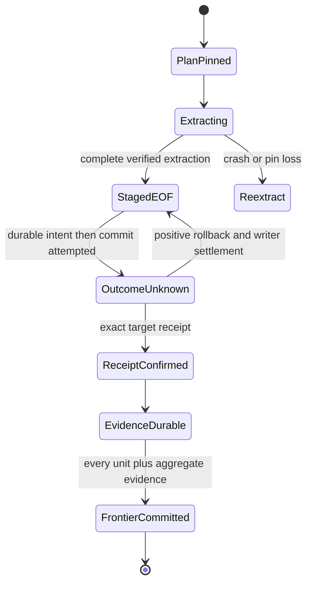

# Authoritative changed-window delivery for ClickHouse to MSSQL

- Status: RESEARCHED
- Owner: DDA P06; integration/shared files: task `01a08a6d-20f9-7900-9eef-ea42ecc0b124`.
- Research baseline: dpone 0.80.0, `6ae541d38ac223327d7edb23510859df91173bda`.
- Target release: a separate minor after design approval and certification; no version reserved.
- Last verified: 2026-09-14.

This design is for data engineers and producer/platform owners who want to send
fewer complete windows while preserving deletes and corrections. It changes no
shipped CLI, Python API, manifest, state, receipt or evidence format. Production
implementation is not authorized. See [delivery acceleration](../delivery-acceleration/index.md)
and the [current native contract](../mssql-native-transport.md) for available behavior.

## Problem, personas and journey

Reloading every window transfers unchanged rows. A timestamp filter cannot safely
identify old corrections, last-row deletions or rows whose window changes. The
proposed producer publishes a complete change declaration tied to immutable data;
the consumer replaces every selected window in full. This is batch state delivery,
not CDC or a promise to reproduce every intermediate source event.

| Persona | Responsibility | Success signal |
|---|---|---|
| Producer owner | Account for every logical change and publish sealed generations | One authenticated, non-forking revision chain |
| Data engineer | Bind one dataset and window definition to one owned target | Exact target content after the confirmed revision |
| Operator | Retain pins, receipts and evidence; recover unfinished work | No checkpoint ahead of durable evidence |
| Analyst | Understand freshness and intermediate visibility | Confirmed revision and outstanding windows are visible |

The future journey is: discover governance requirements; enroll a producer and
an exclusively owned target; validate a complete baseline; run one full refresh;
deliver a correction and an emptied interval at an unchanged watermark; inspect
receipt/evidence-backed progress; recover an interrupted delivery; monitor history
retention; migrate identities explicitly. The research example is executable
outside production via `python -m unittest -v test_revision_model` in the P06
artifact directory. It uses synthetic rows and no database access. There is no
changed-window dpone command or YAML example to run at this stage.

## Scope and admission

Initial proposed activation supports one logical dataset, one local plain
MergeTree generation in an Atomic database, scalar types already admitted by the
native route, a fixed UTC half-open window definition and a whole, exclusively
owned MSSQL target. The window definition covers every non-NULL row exactly once;
NULL is a separately identified membership class. Partial ownership, overlapping
window definitions, arbitrary SQL/projections, new connectors, dbt, composition
framework work, SWITCH and alternative bulk backends are outside scope.

The authority store and enforcement are deployment-owned capabilities injected
at the application boundary. Deployment ownership is a prerequisite, not evidence
that an implementation already exists. No production authority adapter is
selected or certified by this research. Without enforceable source immutability,
authenticated complete history, and target cycle exclusion, activation is NO-GO.

## Three different clocks

| Value | Meaning | Permitted use |
|---|---|---|
| Event time | Business timestamp used for window membership | Define `[start,end)`; never decide whether a window changed |
| Extraction watermark | Observation of an extraction range/progress or high value | Diagnostics or explicitly bounded extraction planning; not commit authority |
| Committed producer revision | Authenticated epoch, increasing sequence, manifest digest and parent | Select changes and identify the exact immutable data generation |

Equal event/extraction watermarks can accompany different committed revisions.
Rows may arrive arbitrarily late within the governed domain. `MAX(target)` plus
`source > MAX(target)` is forbidden as change authority. Source query IDs, table
UUIDs, physical part versions, extraction timestamps, delivery attempt generations,
journal CAS revisions and target load timestamps are also not producer revisions.

## Producer authority and draft schema

The external `producer-manifest.schema.json` is a research proposal, not a public
manifest/schema update. The initial wire proposal is strict JSON with no unknown
fields. Integers are decimal nonnegative integers; sequence is bounded to signed
64-bit storage. Timestamps are UTC integer microseconds and observational. Hashes
are SHA-256 lowercase hexadecimal. Canonical bytes use UTF-8, recursively sorted
object keys, no whitespace, no floating values, and no Unicode normalization.
Arrays have defined order. Strings are compared exactly. The manifest hash is
computed over the complete record; it is carried by the authenticated head, not
inside the hashed record. This proposed codec needs independent cross-language
vectors before approval; the model's JSON digest is only a synthetic identity.

| Record | Required fields and invariants |
|---|---|
| Dataset enrollment | `authority_id`, logical `dataset_id`, immutable `epoch`, `window_definition_sha256`, `schema_sha256`; ownership and trusted reader binding |
| Committed head | Exact enrollment, `sequence`, `manifest_sha256`; read from a durable authenticated linearizable store |
| Manifest | Enrollment fields, `sequence`, `parent_sha256`, `generation`, `changed_windows`, `inventory_sha256`, `committed_at_us`; authenticated head publishes only committed records |
| Generation | `generation_id`, nonzero physical `table_uuid`, schema hash, complete inventory/content root, immutable pin capability binding; one complete dataset at this revision |
| Window | `kind=range`, canonical `window_id`, `start_us`, `end_us`; or `kind=null` and canonical NULL ID, with no endpoints |
| Inventory | Sorted complete nonempty window inventory with row counts and typed bag digests; NULL membership explicit; zero-row changed windows remain in `changed_windows` even if absent from nonempty inventory |
| Consumer binding | Stable consumer ID, enrollment, physical target incarnation, window/ownership scope digest, schema/mapping policy digest and baseline revision |
| Cycle plan | Binding, expected old frontier, pinned head, verified chain digests, sorted selected windows, fallback reason, deterministic logical operations and durable physical attempt references |
| Progress | Active cycle ID, cycle fence, per-unit original intent/receipt/evidence hashes, aggregate evidence hash, CAS state revision and producer frontier |

`window_id = SHA256([window_definition_sha256, kind, start_us, end_us])`;
NULL uses `[window_definition_sha256,"null"]`. IDs are not SQL partition IDs.
Validate sorted unique windows, `start < end`, membership in the enrolled grid,
NULL at most once, inventory root, schema and generation UUID. Positive manifests
may conservatively include unchanged windows. Omitting a changed window violates
producer authority; hashes alone cannot detect a truthful-looking omission.

### Producer commit protocol

1. Acquire a producer fencing token and expected previous head from its durable
   coordinator. Every writer, TTL process and administrative path capable of
   logical changes must be governed. Uncontrolled DML/DDL invalidates enrollment.
2. Build an unpublished complete generation. No consumer reads a mutable alias.
   Settle asynchronous inserts/mutations and logical partition operations before
   declaring completeness. Determine every changed window relative to the parent;
   a moved row marks both old and new windows. Record explicit empty replacements.
3. Validate complete content and schema, then seal the candidate so no permitted
   writer can mutate it. Candidate writer operations and requests already in flight
   must be settled before sealing; revoking credentials alone is insufficient.
   Disable/exclude TTL and destructive administration for sealed objects. Ordinary
   merges are admissible only when they preserve exact row bags and pin lifetime.
4. Persist immutable generation metadata, inventory and manifest. Atomically CAS
   the authenticated head from the exact parent to this manifest using the current
   fence. Sealing must precede head publication. Sequence advances by one; the
   genesis record is sequence zero with a null parent. Published records never change.
5. A losing concurrent producer cannot publish a sibling successor. It rebuilds or
   revalidates against the winner. A crash before head CAS leaves unpublished data;
   a lost CAS acknowledgement requires an exact head/history probe, never blind
   resequencing. Cleanup only unpublished, unreferenced candidates with settled writers.

The consumer verifies every link from its frontier to the sampled head, exact
epoch/definition/schema, sequence continuity and digest. A gap explicitly reported
by a trusted retention catalog permits full rebaseline. An unexplained fork, hash
mismatch, rollback, reused sequence with different bytes or identity change fails
closed; it must not be relabeled as an ordinary history gap.

ClickHouse multi-statement transactions remain documented as experimental; this
design does not assume cross-table atomic publication from ordinary INSERTs.
It uses a separate committed pointer after sealing. [ClickHouse transaction guarantees](https://clickhouse.com/docs/concepts/features/operations/insert/transactions)
were checked on 2026-09-14 (page modified 2026-09-09). Mutations are asynchronous
and can replace parts incrementally; their history is pruned. A mutation ACK or
system table scan is not complete business change authority.
[ClickHouse ALTER reference](https://clickhouse.com/docs/reference/statements/alter).

## Consumer algorithm and visibility

1. Resolve the immutable consumer binding and target incarnation. Acquire one
   durable, target-wide active-cycle ownership record that spans all window calls.
   It conflicts across consumer names as well as retries. The next cycle is
   prohibited until the old cycle is terminal. The target publication gate checks
   current cycle ID/fence and expected frontier inside its transaction.
2. If a cycle exists, restore its original intent and inspect exact target receipts
   before source access. A new worker fence does not change logical delivery IDs
   or invalidate a genuine receipt from the original physical attempt.
3. Sample authenticated head R; validate history `(C,R]`. Pin R's sealed generation
   through every required extraction EOF. Pin acquisition/renewal/GC decision must
   serialize in the authority store. A wall-clock timestamp is not an active pin.
4. Select the union of changed windows in the chain, then read each selected
   window's complete contents from R. A revision whose changes were later reversed
   still selects that window; coalescing skips intermediate states, not correctness.
   The planner spills bounded pages if the configured window/manifest byte limit
   is exceeded; absent supported bounded storage, admission fails before I/O.
5. For bootstrap, trusted missing history, or any changed NULL membership class,
   choose one native full refresh of the complete owned dataset. Full refresh
   removes deleted historic windows and NULL rows even when their source keys no
   longer exist. Without full target ownership/capacity, stop before extraction.
   Never guess the missing scope from surviving manifests or current source rows.
6. Freeze the plan and all logical operation identities durably before publishing
   any window. The identity hashes consumer/target/scope/policy, C, R manifest and
   generation, chosen window or full scope, and algorithm version. Attempt IDs,
   query IDs and fences are separate durable execution bindings.
7. Execute each interval with existing native extraction, bounded encoding/import,
   contiguous raw receipts, EOF, typed duplicate-preserving verification, quality,
   independent prepublication recheck and target transaction receipt. An explicitly
   empty interval still deletes its whole authored target predicate. Parallel
   chunk settings remain those of the existing route; first activation serializes
   window publications and retains cycle exclusion between them.
8. Probe/confirm each exact target receipt, then persist idempotent durable evidence
   bound to that receipt. The receipt identity must cryptographically commit the
   cycle/revision/window binding through the future versioned mutation intent;
   an optional diagnostic sidecar is insufficient. Wrong target, window, schema,
   policy, generation, manifest or payload blocks success.
9. Persist aggregate cycle evidence containing the plan and every required receipt
   and evidence digest. Only then CAS the producer frontier C→R with the current
   cycle fence. A conflict preserves artifacts; no state is overwritten or lowered.
   Terminal completion releases pins/ownership under retention policy.

Each interval is atomic on the target. A multi-window cycle exposes intermediate
mixed revisions to direct target readers. The global confirmed frontier advances
only when the full plan is evidenced; it does not create snapshot isolation for
readers. Atomic whole-cycle visibility is a separate feature and is not promised.

```text
admit binding and target cycle gate
if unfinished cycle: recover original receipts first
else:
    R = read authenticated committed head
    validate chain C..R; pin immutable generation R
    scope = union(changes) or admitted full refresh on trusted gap/NULL/bootstrap
    persist frozen cycle plan
for unit in plan:
    recover or extract entire unit; verify EOF/staging
    publish with target-fenced transaction receipt
    confirm exact receipt; persist durable unit evidence
persist durable aggregate evidence
CAS frontier C -> R under active cycle fence
```

### No-change revisions and state machine

If R equals C, report already delivered without a new revision commit. If R is
newer but the changed set is empty, initial activation requires an explicit
target-fenced control-only receipt, bound to C, R and the unchanged target
incarnation. It performs no business DML but follows evidence and frontier CAS.
This capability is proposed and unimplemented. Without it, keep C and report a
validated scan observation; an empty list cannot synthesize target success.



| Boundary/failure | Required recovery |
|---|---|
| Late rows, corrections, equal watermarks | Producer marks old window; complete replacement from R |
| Row changes membership | Mark both old/new windows; NULL change selects full refresh |
| Last-row delete, drop/TTL | Explicit changed empty interval; governance must include the operation |
| Before durable EOF | Settle partial attempt, re-extract complete interval from the same valid pin; never seek by query offset |
| Source advances during extraction | Continue immutable R; new head belongs to the next cycle |
| Source UUID/schema/content changes under a pin | Authority violation: stop; no frontier advancement; investigate any already committed units |
| Pin expires before unfinished extraction | Block cycle; reacquire identical R if retained; otherwise fenced explicit full rebaseline repair, never silently relabel it as R |
| Pin expires after durable staging/receipt | Source-free recovery remains possible from original verified artifacts |
| Lost commit ACK or receipt service unavailable | Exact original receipt probe; unknown outcome retains resources and blocks replay/cleanup |
| Evidence persistence/fsync fails | Target may be committed; retry evidence, then frontier; do not republish |
| Lease takeover or old revision replay | Settle old writers; restore original operation; target gate rejects stale cycle/fence/frontier |
| Partial cycle already published | Keep global frontier C; finish R or explicit audited repair after all outcomes are known |
| Unsupported schema or epoch change | Explicit migration/bootstrap; no ordinary fallback |

Retries use existing bounded transport policies. Coordinator/store transient reads
may retry with capped backoff while leases/pins remain valid; publication is never
retried merely because a timeout elapsed. Cancellation retains unresolved intent,
staging and receipts. Rollback cannot undo previously committed windows; repair is
a new governed delivery, not a checkpoint edit.

## Architecture, compatibility and ADR draft

Existing execution anchors are `NativeMssqlRuntime.run` in
`src/dpone/runtime/mssql_native_runtime.py`, `ClickHouseNativeSource`, native stage
preparation/recovery, `NativeChunkJournal` and the MSSQL transaction finalizer.
The native runtime already orders receipt → evidence → checkpoint and resumes
before opening the source. Current DDL exclusion explicitly allows ordinary DML;
it must not be relabeled as an immutable-generation authority.

| Component | Responsibility and dependency direction |
|---|---|
| New revision value models | Closed versioned records and identity validation; no clients or I/O |
| New selection policy | Chain validation, deterministic union, full fallback; pure contracts dependency |
| New cycle coordinator | Injected authority, pin, state, evidence and existing native delivery services |
| New narrow ports | Authenticated revision read/pin; durable cycle admission/CAS; no generic plugin registry |
| Deployment-owned adapter | Prove authenticated CAS and source/target enforcement; selected separately before implementation |
| Integrator bindings | Versioned receipt/recovery authority and composition injection; no vendor imports on base/help paths |

No legacy namespace receives new policy. Initial extraction uses a full immutable
generation table to fit the existing one-table native capability. Per-window
generation reuse could reduce producer storage, but needs a later storage/read
contract. Complete source generation construction can still cost O(N) rows and
storage; reduced cross-system transfer does not establish lower total source cost.

ADR draft decision: choose a committed producer hash chain over sealed complete
generations, whole-target cycle exclusion, complete-window replacement and
receipt/evidence-gated frontier. Require a future numbered ADR; do not reserve or
edit shared ADR indexes in P06. Alternatives:

| Alternative | Tradeoff | Decision |
|---|---|---|
| Target MAX/cursor or bounded lookback | Cheap, misses arbitrary deletes/old changes | Rejected as authority |
| Parts/query/mutation logs or incremental MV | Physical/insert observations lack complete logical history | Rejected as sole authority |
| All-writer mutable-source exclusion | Less generation storage; blocks writers and has difficult crash settlement | Deferred; not initial capability |
| Per-window immutable generation maps | Lower producer copy cost; new multi-object extraction/retention contract | Deferred |
| Row-level CDC | Needs complete retained operation log and event semantics | Out of scope |
| Always full refresh | Simpler and already available; more transferred data | Safe fallback and no-change option |

Incremental ClickHouse materialized views react to inserts; existing-row updates,
deletes and partition drops do not update them. That makes them insufficient as
the sole change ledger. [ClickHouse CREATE VIEW reference](https://clickhouse.com/docs/reference/statements/create/view)
(checked 2026-09-14).

No current v1/v2 report, chunk journal, prepared snapshot or receipt is reinterpreted.
Future activation needs separate versioned cycle records and a receipt-bound
revision intent extension; legacy readers stay strict. Deployment upgrades first
add authority/readers/control-receipt and cycle gating, then bootstrap a new
consumer binding through evidenced full refresh. Old manifests retain current
behavior. No new public manifest field is proposed for this phase; future Python
composition signatures, errors and any CLI schema need approval before shipping.
Disabling selection returns to complete governed loads with preserved historical
receipts; it never derives a frontier from target contents. Rollback waits for
unresolved publication to settle and retains old schema readers needed by recovery.

Quality follows [engineering standards](../engineering-standards.md) and
`docs/benchmarks/quality_budgets.yml`. Expected small modules separate models,
selection and I/O coordination; no threshold is duplicated here. Run canonical
module-size/import/layer gates after implementation. The external model is a
finite abstraction, not code to copy into production unchanged.

## Market comparison and measurable outcome

Official sources below were checked on 2026-09-14. Facts describe the cited
capability; adoption/rejection is a P06 design inference. No vendor performance
comparison was executed.

| System/version | Fact, strength and limit relevant here | Decision/source |
|---|---|---|
| dlt 1.30.0 docs | Inclusive cursor boundaries reacquire ties; configured lag bounds lookback | Adopt explicit boundary semantics; cursor/lag does not establish arbitrary historical change authority. [Cursor](https://dlthub.com/docs/general-usage/incremental/cursor), [lag](https://dlthub.com/docs/general-usage/incremental/lag) |
| Airbyte current unversioned docs | Incremental append can resend equal cursors and miss updates whose cursor does not advance; it does not remove destination rows | Separate detection from application; reject append cursor as delete authority. [Incremental append](https://docs.airbyte.com/platform/using-airbyte/core-concepts/sync-modes/incremental-append) |
| Fivetran current hosted docs | Delete capture is connector-specific; complete-table re-sync can infer absent records, without exact delete time | Adopt complete scope before absence-based deletion. [Features](https://fivetran.com/docs/core-concepts/features) |
| Apache Beam current guide | Event time/watermarks and late-data handling are distinct concepts | Adopt terminology distinction, not streaming watermark closure as mutable-window authority. [Watermarks](https://beam.apache.org/documentation/programming-guide/#watermarks-and-late-data) |
| Informatica | N/A: no Informatica adapter/product-version protocol is part of this producer contract | No claim about capability absence |
| Pentaho | N/A: job/connector integration is outside this scope | No comparative ranking |
| Microsoft SSIS | N/A: SQL bulk/layout tuning belongs to separate DDA work; no SSIS integration proposed | No comparative ranking |
| gusty | N/A: DAG authoring outside scope | No comparative ranking |
| Astronomer Cosmos | N/A: dbt orchestration excluded | No comparative ranking |

Synthetic scenario: 100 equal windows, 10,000 rows/window and 128 encoded
bytes/row; full delivery is 1,000,000 rows / 128,000,000 bytes. Changing respectively
1%, 5%, 20%, 100% of windows transfers 10,000 / 50,000 / 200,000 / 1,000,000 rows
and 1.28 / 6.4 / 25.6 / 128 MB, before authority/transport overhead. These are
arithmetic scenarios, not measured performance. Changed-row ratio is not
changed-window ratio: one changed row in each window still transfers 100%.
Skew requires summing actual selected-window bytes; NULL/history fallback transfers
the full dataset. Empty replacements transfer no source payload but still incur
target deletion, receipt and evidence work.

The proposed axis is transferred native rows/bytes at identical correct final
content, compared with the existing complete-window baseline. A 5% equal-window
scenario targets 95% fewer payload rows/bytes, not a latency target. The external
`estimate_scenarios.py` produces reproducible assumptions/results. Future timing
requires at least ten paired balanced trials at identical source/target/schema/
policy/settings; report producer generation/manifest cost separately and include
it in total cost. No SLA, CDC coverage or production speedup is established.

## Security, operations and recovery ownership

Consumers have read-only sealed-generation access; producer publishing and garbage
collection use separate scoped authority. Source and target admin bypass is a
trust boundary and invalidates certification. Hashes authenticate content only
when obtained through the enrolled trusted store. No credentials appear in
manifests, commands, evidence or this research.

Retention is separate for chain history, generation payloads, active pins,
unresolved native staging, receipts and durable consumer evidence. Configure
history for maximum supported consumer outage plus recovery margin; reject
insufficient budget at enrollment. Pin renewal must precede expiry and atomically
exclude GC. Unresolved receipts/intents are never TTL-cleaned. GC uses acknowledged
consumer frontiers and pin state, not elapsed event time; retired consumers need
an audited retirement operation. Expired history means rebaseline/stop, not no change.

Observe producer head, evidenced consumer frontier, revision lag, outstanding
windows, fallback reason, actual transferred rows/bytes, pin deadline, evidence
write failures and unresolved commit age. Missing measurements are null plus a
reason. Planned diagnostics include `authority_missing`, `chain_invalid`,
`history_expired_full_refresh_required`, `pin_lost`, `cycle_conflict`,
`publication_unknown`, and `evidence_pending`; these are proposed labels, not
shipped CLI error codes. Each must name the affected identity and safe next action.

## Acceptance, evidence and documentation plan

Research artifacts live under
`/Users/paulkov007/.codex/artifacts/dpone-dda-industrial-plan-20260914/P06/`.
`completion.json` inventories hashes, checks and final source commit; no external
artifact is an authoritative dpone certification report.

| Requirement | Research evidence | Future acceptance |
|---|---|---|
| Complete change declaration, deletes/late/corrections/NULL | Producer oracle exhausts 32,768 old/new/mask combinations; explicit lying-producer counterexample | Certified enforcement of every producer write path |
| Equal watermarks, duplicates, reversal and empty replacement | 4,096 two-window/two-revision histories over four row bags | Existing typed digest and native route integration |
| Receipt before evidence before frontier | Finite transition graph; crash/ACK/evidence/lease/pin variants | Real fsync/store faults and target transaction recovery |
| Identity and concurrency | Wrong binding, producer CAS, active-cycle and stale-frontier tests | Target gate enforced across processes/consumers/admin policy |
| History gaps and NULL | Complete-domain/full-refresh selection model | Actual empty/NULL target reconciliation with outside-scope admission |
| Source changes and retention | Frozen plan and pin-loss model | Source governance/pin/GC adapter and mutation fault tests |
| Legacy compatibility | No production/schema edits | Old manifest/API/journal/receipt readers and current native tests |
| Performance | Explicit synthetic estimates | P01-owned same-subject live campaign after adapter exists |

The finite model does not prove distributed storage, all typed values, process
termination, network partitions, bounded manifest spill, durability or real
enforcement. Those remain UNVERIFIED. Existing live tests cannot certify a feature
which has no production implementation. The P01 `request.json` separates runnable
baseline primitives from future authority cases that must remain blocked.

Before activation, add separate producer-governance how-to, consumer tutorial,
revision reference, architecture and recovery runbook pages. Link them through
delivery acceleration and the route entry point. Validate CLI/API parity and
first-success/recovery examples after the public interface is approved. Current
research adds this design leaf only; shared navigation/changelog are integrator-owned.

## Future task ownership and release gate

All following paths are proposed future ownership, not permission to edit now.
Detailed contracts must be regenerated against then-current master. One
integrator owns shared semantic integration, including interactions with P02–P05.

| Role | Exact future owned paths | Dependencies |
|---|---|---|
| Models/selection writer | `src/dpone/contracts/producer_revision.py`, `src/dpone/runtime/changed_window_selection.py`, `tests/test_producer_revision.py`, `tests/test_changed_window_selection.py` | Approved ADR/record schema and canonical identity vectors |
| Cycle writer | `src/dpone/ports/producer_revision.py`, `src/dpone/runtime/changed_window_cycle.py`, `tests/test_changed_window_cycle.py` | Approved authority/pin/CAS ports and target gate contract |
| Source authority adapter writer | `src/dpone/adapters/clickhouse_generation_authority.py`, `tests/test_clickhouse_generation_authority.py` | Selected deployment enforcement backend; no implementation until selected |
| Documentation writer | `docs/delivery-acceleration/changed-windows.md`, `docs/delivery-acceleration/producer-governance.md`, `docs/delivery-acceleration/revision-reference.md`, `docs/delivery-acceleration/changed-window-recovery.md` | Validated final interfaces and executable examples |
| Integrator | `src/dpone/runtime/mssql_native_runtime.py`, `src/dpone/runtime/sources/clickhouse_native_source.py`, `src/dpone/runtime/sinks/mssql_native_completed_payload.py`, `src/dpone/runtime/sinks/mssql_native_recovery.py`, `src/dpone/runtime/sinks/mssql_native_staged_load.py`, `src/dpone/runtime/sinks/strategies/mssql/mssql_transaction_finalizer.py`, `src/dpone/contracts/mssql_transaction_governance.py`, `src/dpone/adapters/mssql_native_publication_journal.py`, `src/dpone/manifest/mssql_native_policy.py` | Versioned intent/receipt recovery, target-cycle fencing/control receipt design |

Shared `CHANGELOG.md`, `mkdocs.yml`, dependency files, fixtures, ADR index and any
public schema/factory/workflow remain with the integrator. Each writer's other
production paths are read-only and shared files forbidden. Authority-store backend
paths and target gate persistence migration remain unassigned until backend choice;
this is an explicit implementation gate, not a missing research deliverable.

P06 research has no dependency on profiling. P01 exclusively owns live workloads;
P02 recovery semantics and P07 operator guidance consume these contracts. No task
may infer source authority from profiling results. Production implementation needs
maintainer approval, exact future task contracts, focused and broad checks, a
fresh-context independent final diff review, and route/identity/recovery/live
evidence. A later minor release changes source capability/state/evidence obligations.
Research completion alone authorizes no merge, tag, publication or provider changes.

## Approval checklist

- [x] Problem, journey, complete-window algorithm and failure behavior documented.
- [x] Identity, authority assumptions, compatibility and ADR alternatives explicit.
- [x] Current primary sources and measurable synthetic scenarios recorded.
- [x] External model, acceptance, documentation, rollout and ownership proposed.
- [ ] Maintainer changed status to APPROVED.
- [ ] Deployment authority adapter and target gate selected and certified.
- [ ] Production implementation, independent review and live acceptance completed.
