# DDA resilience and endurance research

- Status: RESEARCHED
- Owner: DDA P02; programme integrator owns shared files and release decisions.
- Target release: no production change selected; research documentation only.
- Baseline: released 0.80.0, `6ae541d38ac223327d7edb23510859df91173bda`.
- Last verified: 2026-09-14.

This specification is for data engineers designing recovery tests and operators
assessing ClickHouse → MSSQL bounded native delivery. It defines an executable
research protocol. Production robustness remains **UNVERIFIED** until a
representative live campaign passes on the intended environment and workload.

Start with [delivery acceleration](../delivery-acceleration/index.md), then the
[native recovery contract](../mssql-native-transport.md) and
[local Docker procedure](../delivery-acceleration/local-docker.md).

## Problem, personas and journey

| Persona | Need | Observable success |
|---|---|---|
| Data engineer | Retry without duplicate delivery or losing source rows | Exact typed multiset and one authoritative publication |
| Operator | Distinguish safe recovery from an unresolved transaction | Receipt, journal and process observations identify the next action |
| Architect | Bound failure duration and resource consumption | Retained trial-level RTO/resource evidence with stated limits |

The journey is: select supported strategy/schema → freeze source, producer,
configuration and environment → admit a small fixture → inspect initial state →
inject at a proven boundary → retain the failed state before recovery → settle
owned workers → reconcile the receipt → recover twice → verify evidence before
checkpoint → separately clean known owned resources → inspect retained results.
A timeout or missing observation is an incomplete experiment, never a successful
recovery. Production operation additionally requires a business workload/SLA and
operator ownership; these inputs have not been supplied.

## Scope and public contract

P02 delivers external diagnostic Python modules, hermetic tests, a read-only
journal observer, P01 job requests and an operator protocol. No shipped CLI,
Python API, manifest, journal, evidence, digest, dependency or report schema
changes. Existing receipt and EOF authority remains unchanged. No migration,
deprecation, feature flag or production rollback is required for this research.
The separate task P01 exclusively owns live Docker execution and its lock.

Non-goals: dbt/composition, SWITCH activation, Arrow, source change authority,
provider/PyPI operations, resource reconfiguration, automatic cleanup of unknown
outcomes, recovery by source offset, or a new generic fault/plugin API.

External artifacts have distinct kinds (`p02-*`), an execution label and scope.
A hermetic PASS never certifies live behavior. They cannot authorize cleanup or
advance state. Existing v1/v2 reports and `Snapshot.fault_events` remain intact.
The journal observer emits sanitized JSON in stdout; exit 0 means local record
consistency, 1 means a detected violation, and 2 means observation unavailable.
Its output always says `target_outcome: UNVERIFIED` and
`cleanup_authorized: false`. It does not query SQL or assert ordering from a final
snapshot. Missing SQL/process authority is not inferred from local telemetry.

## Detailed algorithm and durable boundaries

1. Verify actual imported checkout, runtime tree, prototype hashes and clean
   production paths. Freeze invocation, physical target/catalog identity, schema,
   source query, strategy/window and resolved limits. Recovery must use the same
   original identity; a different invocation is a new experiment.
2. P01 holds the campaign lock and admits actual free memory/disk, SQL log and
   allocation headroom, service ownership and an idle benchmark queue. Record
   configured limits separately from measured values. Inject no fault if the
   environment or requested boundary cannot be established.
3. Capture the pre-fault target business/metadata multiset, outside rows, exact
   receipt and journal. Open an existing SQLite file with `mode=ro`,
   `query_only=ON` and one read transaction. Do not instantiate
   `SQLiteWindowStore` or call `attach()` merely to observe: initialization may
   write schema/WAL state.
4. Stage immutable encoded files through the bounded executor. Verified attempt
   receipts are ordered by ordinal, not worker completion. Durable
   `stage_complete` requires source EOF, contiguous verified receipts and
   completion metadata in the journal CAS. A sealed file alone is insufficient.
5. Prepared state binds staging object/schema/content and operation identity.
   Persist publication intent before the transaction. Finalizer business DML and
   receipt insertion share the transaction. A missing COMMIT response establishes
   neither rollback nor absence of publication.
6. Retain the first failed observation before any recovery. At ambiguous commit,
   probe the exact receipt using a fresh connection. Until authoritative
   resolution: no success, checkpoint, stage replay or destructive cleanup.
7. After confirmed publication, invoke durable, idempotent evidence writing,
   mark `evidence-complete`, invoke fenced checkpoint, mark `succeeded`, then
   clean owned staging. Check checkpoint's evidence digest against the persisted
   evidence bytes and its receipt ID against the journal receipt. Final rows
   cannot excuse an earlier invalid checkpoint or partial publication.
8. Recover twice with source access poisoned after durable EOF. Confirm unchanged
   receipt/metadata/content and no added publication/source reads. After a known
   commit, stage reads must also remain unchanged. An incomplete extraction
   requires settlement of the original attempts and then a new full extraction;
   it cannot claim source-free continuation.
9. Record injection, termination, settlement, visibility and pipeline completion
   in a single supervisor monotonic clock domain. Preserve immutable raw
   observations, source/prototype identity and null-with-reason missing metrics.
   Cleanup is a separate operation and never establishes success retrospectively.

```mermaid
stateDiagram-v2
    [*] --> Staging
    Staging --> StageComplete: EOF and verified receipts durable
    Staging --> ReextractRequired: interruption and owned attempts settled
    StageComplete --> Prepared: identity and content verified
    Prepared --> Publishing: durable intent
    Publishing --> Unknown: COMMIT acknowledgement unavailable
    Unknown --> Unknown: exact receipt unavailable; retain resources
    Unknown --> Published: matching fresh receipt
    Publishing --> Published: confirmed transaction
    Published --> EvidenceComplete: evidence durable
    EvidenceComplete --> Succeeded: fenced checkpoint durable
    Succeeded --> Cleaned: owned cleanup
```

SQL operation leases and the local WindowStore lease are distinct. The finalizer
checks SQL lease expiry before DML, then owner/epoch with
`require_unexpired_lease=False` after DML while holding transaction locks. TTL
elapsed during that transaction is not itself a rollback requirement. Assert
that stale epochs cannot mutate state, and that a successor cannot bypass the
held target lock. Local SQLite fencing does not exclude independent SQL writers.

## Fault and edge-case matrix

All new route-level live cells below are UNVERIFIED. Historical same-source
controlled tests are a scoped input, not acceptance of this campaign.

| Case | Exact boundary / current support | Required observation and invariant |
|---|---|---|
| Controlled EOF exception | Existing `FaultStore.save`, after durable completion save | Initial target unchanged; recovery from original invocation opens no source |
| Controlled before-COMMIT exception | After receipt insertion, before COMMIT | Confirmed rollback, original business/metadata preserved; no checkpoint |
| Controlled lost ACK | After actual COMMIT returns; exception in delegate | Fresh exact receipt, one publication, idempotent evidence/checkpoint |
| Controlled unknown commit | Same boundary; fresh probe deliberately unavailable | Atomic old-or-new state, no success/replay/cleanup |
| Process restart | Normal exit after controlled failure; new process attaches | Record distinct processes and original identity; not SIGKILL evidence |
| Actual SIGKILL | Local executable probe kills owned child after real SQLite save; live route bridge absent | Signal/wait evidence plus durable journal; SQL/BCP recovery remains UNVERIFIED |
| SQL/CH server restart | Dedicated owned service at import/precommit/source-read barrier; adapter absent | Server stop/start and readiness evidence; SQL atomicity, pre-EOF re-extraction |
| Network interruption | Isolated connection path at import/COMMIT/probe; adapter absent | Actual path interruption/restoration, not just a driver exception |
| Disk full | Bounded disposable spool/journal volume; adapter absent | Real ENOSPC and retained authority; never fill host filesystem |
| SQL log pressure/full | Isolated capped log; adapter absent | Used/allocated bytes, reuse wait and error 9002 if exhaustion claimed |
| Encoder/importer saturation | Existing controlled executors, policies 1/3 and 3/1 | Worker bounds, retained capacity, settlement and identical sealed-byte retries |
| Lease expiry | Injected clock at exact TTL and successor acquisition | Stale save/renew rejected; stale release cannot revoke successor |
| Concurrent same target | Two attaches to same UUID cover same invocation only | One active local lease; different invocations/same business target need a dedicated binding |
| Cleanup interruption | After durable delete intent / DROP acknowledgement loss | Retry accepts proven absence; rejects replaced or foreign objects |
| Duplicates and payload NULL | Existing typed fixtures | Preserve multiplicity; distinguish NULL, empty, text `NULL`, Unicode |
| Empty window | Zero-row EOF authority with outside sentinels | Replace only the authored half-open interval; outside remains unchanged |
| NULL window key | External reference assertion only | Preserve NULL-window rows; built-in `null` profile changes payload, not event key |
| Schema mutation | Before guard, before final verification, during resume | Reject changed schema/UUID; cooperative guard does not fence an independent administrator |

`Session.run()` persists telemetry in `finally`. SIGKILL bypasses it: stored
source/publication counters can be stale. Neither equal row counts nor one
receipt alone proves no repeated publication. Live acceptance needs independently
observed transaction effects/receipt generation, full typed contents and source
access evidence. Missing instrumentation leaves the affected assertion UNVERIFIED.
Two ordinary `factory.open()` calls create different schemas and do not establish
same-target concurrency. The scheduler's `shutdown(wait=True)` also means bounded
queue size is not a wall-clock termination guarantee.

## Architecture and alternatives

| Component | Role | Dependencies |
|---|---|---|
| Existing runtime, journal, finalizer | Authoritative delivery and recovery | Canonical contracts, injected store/source/sink capabilities |
| External `reference_assertions.py` | Pure checks over detached observations | Python data classes and exact multiset tokens |
| External `journal_probe.py` | Own child lifecycle at three real journal boundaries | Canonical journal/SQLite store; no target services |
| External `observe_journal.py` | Local read-only consistency inspection | SQLite SELECT and hashes; no runtime construction |
| Existing hermetic/live factory | Controlled faults and typed fixture oracle | Unmodified repository tools; P01 alone runs live |
| P01 supervisor | Resource admission, exclusive scheduling, deadlines | Explicit job and frozen environment |

Dependency direction is diagnostics → runtime/contracts. Runtime never imports
research artifacts. No new abstraction is introduced for vendor restart/network
controls. A generic chaos registry is rejected because there is no approved
production extension contract. Reusing the existing four delegates is selected
for controlled exceptions; relabeling those exceptions as crashes is rejected.

No new ADR is needed for an external harness. Existing
[atomic publication ADR](../adr/0057-bounded-window-atomic-publication.md) and
[stage limits ADR](../adr/0063-independent-native-stage-limits.md) remain normative.
Changing recovery authority, TTL semantics, persistent state/evidence ordering or
a public injection API requires a separate APPROVED design and ADR. Production
module/import graph budgets are unchanged; any later implementation must use
[the canonical quality budgets](../benchmarks/quality_budgets.yml).

## Market comparison

Sources checked 2026-09-14. Facts below concern recovery boundaries; adoption and
rejection are dpone design choices, not claims of superior vendor performance.

| System/version | Fact and useful pattern | Relevant limit; decision | Primary source |
|---|---|---|---|
| dlt 1.30.0 docs | Distinguishes terminal/transient failures; pending load state does not advance cursors past unloaded data | Aborting a partial package does not reverse every destination write; adopt inspect-before-retry, retain dpone receipt authority | [Running](https://dlthub.com/docs/running-in-production/running) |
| SSIS, SQL Server 17 docs | Restart uses package identity and checkpointed control-flow tasks | Restart is not mid-data-flow, and a committed transaction may repeat; adopt identity binding, reject checkpoint existence as publication proof | [Checkpoints](https://learn.microsoft.com/en-us/sql/integration-services/packages/restart-packages-by-using-checkpoints?view=sql-server-ver17) |
| Airbyte platform, official checkpointing article | Destination acknowledgement controls checkpoint progress; replay can resend records | At-least-once behavior is not dpone atomic replacement evidence; adopt explicit acknowledgement boundaries | [Checkpointing](https://airbyte.com/blog/checkpointing) |
| Apache Beam current execution-model docs | Runner-selected bundles balance persistence and retries | Runner-specific execution does not establish this SQL transaction's outcome; adopt explicit retry unit, reject inferred global ordering | [Execution model](https://beam.apache.org/documentation/runtime/model/) |
| Informatica, Fivetran, Pentaho | N/A for this bounded comparison of the selected local harness | No adapters or matched recovery experiment in scope; no comparative ranking | N/A |
| gusty, Astronomer Cosmos | N/A: DAG/dbt authoring | No participation in native commit/journal authority; composition excluded | N/A |

SQL Server reports error 9002 when its transaction log fills; log size limits,
full disk and truncation blockers are distinct causes. P01 must record the actual
cause, not label any slow import as log exhaustion. No recovery-model change or
log shrink is proposed. See [Microsoft troubleshooting](https://learn.microsoft.com/en-us/sql/relational-databases/logs/troubleshoot-a-full-transaction-log-sql-server-error-9002?view=sql-server-ver17).

The proposed measurable axis is recovery correctness under an identified fault:
zero typed/multiplicity mismatch, zero false-success/checkpoint-order violations,
and one confirmed publication per original operation. Compare 0.80.0 with a
future selected candidate using the same environment/configuration. RTO and
resource bounds are experiment budgets, not an approved SLA. No speedup,
industrial-readiness or vendor-superiority claim is made.

## Operations, testing and rollout

P01 receives an external `request.json` and `protocol.md`. The initial request
uses 10k rows; 100k requires new admission, and the existing 1M cap is absolute.
The bounded endurance diagnostic stops after 60 minutes or 60 invocations,
whichever comes first, retaining all trials and failures. A 24-hour representative
campaign is a later scheduled experiment after pilot admission; it has a finite
1,440-invocation cap, unchanged per-run limits and hourly resource review.

Measure fault confirmation → independent receipt plus target visibility and,
separately, → durable evidence/checkpoint. Include detection, settlement, service
restoration, lease wait and operator delay as separate observations, not additive
overlapping spans. Report raw trials and diagnostic medians; no p95/SLA claim
from small samples. A timeout retains artifacts and stops the campaign.

| Layer | Validation | Evidence and limits |
|---|---|---|
| External unit/reference | Mutated identity, unsafe healed transitions, duplicate/NULL/empty rows, unknown outcome, ordering | Negative tests reject unsafe histories; does not execute SQL |
| Real local contract | SQLite crash/exit at incomplete, EOF and publication intent; lease fencing | Owned child signal result and restart read; no route recovery claim |
| Existing focused runtime | Scheduler, chunks, journal, finalizer, cleanup and recovery tests | Real subprocess + mocked SQL/controlled executors, explicitly hermetic |
| Live | P01 controlled faults, restarts, typed fixtures and later physical injections | Queue only; unsupported injection remains UNVERIFIED |
| Performance/endurance | Resource peaks, retained samples, visibility and RTO | Await P01 environment and business workload/SLA |
| Documentation | Change-aware selector, docs checks, language contracts, strict build | No shared navigation or generated schema change |

Runbook decisions: observe original invocation first; retain unknown outcomes;
settle incomplete attempts before a new extraction; after durable EOF use the
original invocation and poison source; after confirmed receipt finish evidence
before checkpoint. Recovery/cleanup use
`tools.native_delivery_local.factory:create_factory`, never the benchmark factory
that performs source discovery. The existing `inspect` command validates saved
benchmark reports, not current journal/SQL state. Maintenance cleanup does not
replace native staging cleanup. Preserve unknown and foreign resources.

Only synthetic fixtures are used. Credentials stay in P01's in-memory access
helper; never serialize environment variables, connector exception strings or
customer rows. For operational results retain hashes, timings and safe reason
codes. Recovery decisions require original authoritative records, not an edited
sidecar. Reversing this research means removing diagnostic artifacts; runtime
behavior stays unchanged.

## Ownership, dependencies and approval

Current P02 ownership: this specification and its external artifact directory.
Runtime, packages, tools/tests and shared semantic files remain read-only. P01
owns live runner, lock, baseline descriptor and result manifest. The programme
integrator owns navigation/changelog, shared files, release classification and
any later integration of a selected change.

Exact proposed future test-only paths are
`tests/test_mssql_native_resilience_boundaries.py`,
`tests/test_native_delivery_resilience_observer.py`,
`tools/native_delivery_resilience/observe.py`, and
`tools/native_delivery_resilience/process_gate.py`. Their creation is not
approved. Existing `tools/native_delivery_local/{faults,session,factory}.py`,
`tests/conftest.py` and `docs/delivery-acceleration/{operations,certification}.md`
remain integrator-owned dependencies. No runtime write is currently proposed;
a demonstrated defect requires a separate scoped approved bug/feature contract.

Documentation/CJM follow-up: integrator should resolve ambiguous benchmark vs
maintenance factory examples, distinguish partial extraction from EOF recovery,
and correct obsolete release wording in shared pages. P02 does not edit them.
An independent reviewer must inspect source/prototype hashes, negative tests,
protocol and limitations before the research deliverable is accepted. Review is
not publication authority. Production rollout remains NO-GO pending the relevant
live evidence, selected design approval and normal release gates.

- [x] Algorithm, identity, ordering, failure semantics and compatibility specified.
- [x] Relevant official sources and limitations recorded.
- [x] Test, operator, evidence and ownership plans defined.
- [ ] Representative live resilience/endurance campaign accepted.
- [ ] Maintainer marked any production implementation specification APPROVED.

Next: use [operations](../delivery-acceleration/operations.md) with the scoped
research protocol, then return live evidence to the programme integrator.
