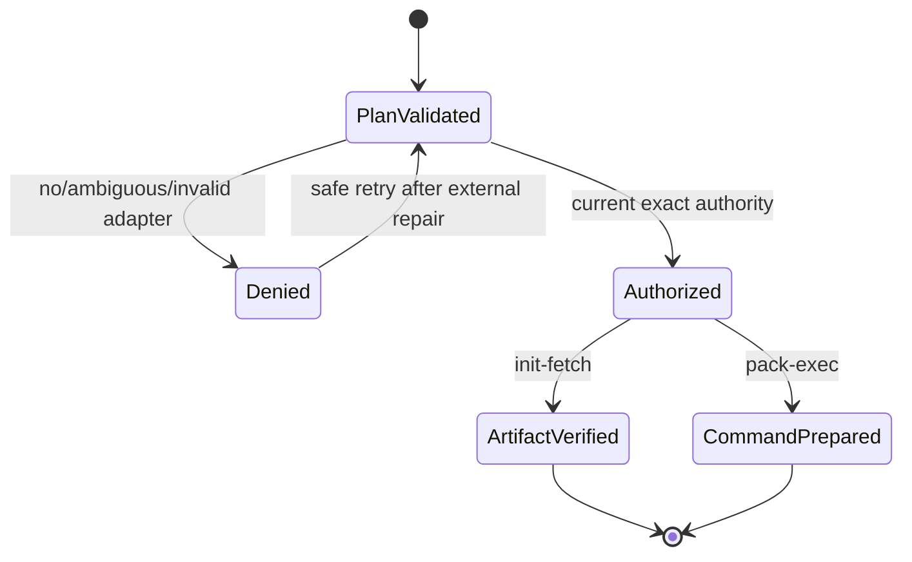
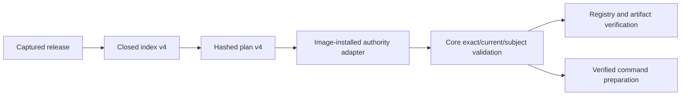

# Feature design: protected development runtime authority

- Status: IMPLEMENTED
- Owner: dpone maintainers
- Issue: TBD
- Target release: TBD
Last verified: 2026-09-17

## Executive summary

Development release composition can already deliver a complete immutable dbt,
flow, and batch workspace, but the standard runtime deliberately refuses to run
it. This feature adds the missing protected execution boundary. A deployment
projects the release's authority requirement into the immutable Airflow plan.
Each runtime process asks one image-installed authority adapter to reopen
current external policy before registry, credential, source, or command access.

The outcome is binary and measurable: an authorized selected workload reaches
the existing verified launcher, while absent, ambiguous, stale, revoked, or
mismatched authority fails before a sensitive runtime operation. Private policy,
credentials, organization metadata, and customer data remain outside dpone.

## Personas and customer journey

| Persona | Goal | Current pain | Success signal |
|---|---|---|---|
| Platform operator | Run an approved development workload in a pinned image | Delivery succeeds but runtime always rejects execution | The installed adapter admits the exact selected subject twice |
| Data developer | Run one selected dbt, flow, or batch workload | Complete workspace membership does not imply execution | Only the selected subject runs; other members stay dormant |
| Security reviewer | Keep policy and tenant details private | A public implementation must not embed deployment-specific logic | Core exposes a narrow generic port and fail-closed errors |

The operator installs a private adapter in the digest-pinned runtime image,
materializes the development deployment, and schedules one selected workload.
The init container validates the plan and reopens current authority before
registry access. The base container repeats authorization before it reads the
ready manifest or exposes connection context. A stable redacted error tells the
operator to restore exactly one adapter or renew external authority; retrying the
same immutable deployment is safe after that repair.

## Scope

### In scope

- A closed plan v4 marker stating that current development authority is required.
- A small runtime authorization port and immutable request/result types.
- Discovery of exactly one image-installed adapter through a fixed Python entry
  point group; users cannot select an adapter through CLI arguments or env vars.
- Independent authorization in init-fetch and pack-exec.
- Exact binding to environment, release, deployment, image, workload, and
  execution kind, followed by the existing receipt/time/revocation/subject check.
- Direct development dbt releases and development v3 compositions.

### Non-goals

- Implementing any organization's policy verifier, identity provider, database,
  secret store, or revocation service.
- Adding a public bypass, receipt file, CLI flag, environment override, fallback,
  or development credential format.
- Treating delivery authority, a successful prior process, or production route
  certification as development execution authority.
- Publishing packages or claiming live route certification.

### Assumptions and constraints

- The runtime image is selected by ref and digest and is part of the trusted
  deployment identity.
- The external adapter can reopen the authority identified by the exact request and
  returns a fully validated `DevelopmentAuthorityReceipt`, check time, and current
  revocation epoch.
- The provider is parse-safe and must not import core dpone or the private adapter.

## Public contract

### CLI

`dpone airflow runtime-init-fetch` and `runtime-pack-exec` keep their command
lines and exit codes. Development plans return the existing general policy exit
code 4 with `DPONE_DEVELOPMENT_RUNTIME_AUTHORITY_REQUIRED` when authorization is
unavailable or invalid. No secret or adapter detail is printed.

### Python API

`dpone.ports.development_runtime_authority` exposes immutable request/result
types and a capability-oriented protocol. It is intended for separately
distributed adapters installed in the runtime image. Core adapter discovery is
an infrastructure implementation, not user-configurable policy.

### Manifest/schema

Existing deployment inputs do not change. A development release causes the
Airflow deployment index and runtime plan to use new closed v4 schemas with a
mandatory `development_authority_required: true` marker. Ordinary releases continue emitting
their existing v2/v3 index and v1-v3 plan bytes unchanged.

### Artifacts and evidence

The plan hash covers the authority marker and exact release/deployment/workload
identity. The adapter result is process
local and is never serialized, logged, copied to XCom, or persisted as a
credential. Existing ready and execution evidence remains authoritative for
artifact and workload outcomes.

### Compatibility and migration

Old readers reject v4 explicitly. Existing production and non-development plans
retain byte-for-byte schema selection. Development deployments must update core,
Airflow pack, provider, and runtime image as one exact release set. Rollback
selects the previous immutable deployment and disables development execution.

## Detailed algorithm

1. Projection creation parses the already captured release bytes, validates the
   development authority, and writes a literal requirement marker to index v4.
2. The parse-safe provider validates the closed index field and copies it into
   plan v4. Plan canonicalization and SHA-256 cover the field.
3. Init-fetch decodes and validates the plan before external I/O. For plan v4 it
   loads the fixed adapter entry-point group and requires exactly one candidate.
4. Core sends an immutable request bound to all execution identities, including
   exact release and deployment digests. The adapter independently reopens policy
   and returns a validated receipt, aware timestamp, and current revocation epoch.
5. Core verifies environment, current time/epoch, and the selected
   runtime subject. Failure is redacted and occurs before registry configuration,
   registry construction, cache reuse, artifact fetch, or credential access.
6. Normal checksum, attestation, artifact, and ready publication logic runs.
7. Pack-exec decodes the same plan in a separate process and repeats steps 3-5
   before reading the ready manifest or constructing connection context.
8. Existing artifact validation compares the fetched release authority projection
   with the process-local receipt before ready publication and command preparation.
   Development dbt validation receives the same result.
9. Retries repeat external authorization. No successful result is cached across
   processes or attempts; expiry or revocation therefore blocks the next entry.

### Pseudocode

```text
plan = decode_and_validate(env.plan, env.plan_sha256)
if plan.development_authority exists:
    adapter = load_exactly_one_fixed_entry_point()
    result = adapter.authorize(request_from(plan))
    require_environment_time_epoch_and_subject(plan, result)
else:
    result = none

if command == init_fetch:
    authorize before registry/cache/fetch
    run existing init_fetch
else:
    authorize before ready/artifact/connection reads
    run existing verified launcher(result)
```

### State machine



### Edge cases

- Missing, multiple, unloadable, or structurally invalid adapters deny execution.
- Naive clocks, changed epochs, expired grants, projection mismatch, missing
  runtime subject, unknown fields, and noncanonical plan bytes deny execution.
- Adapter exceptions are redacted; no private text crosses the CLI boundary.
- Duplicate delivery, process crash, and retry perform a fresh authorization.
- Ordinary plans do not discover an adapter and preserve existing behavior.

## Architecture

### Components and responsibilities

| Component | Existing/new | Responsibility | Dependencies |
|---|---|---|---|
| Development runtime authority port | New | Request/result/protocol | Contracts only |
| Entry-point adapter loader | New | Resolve exactly one image-installed adapter | Python metadata, port |
| Runtime authorization service | New | Bind plan to result and apply core policy | Plan, contract, port |
| Airflow index/plan v4 | New versions | Carry the mandatory authority marker | Existing closed DTOs |
| Init-fetch composition root | Extended | Authorize before registry operations | Authorization service |
| Verified pack launcher | Extended | Preserve result for dbt release validation | Authorization result |

### Ports, adapters, and composition root

Core depends on the port. A fixed entry-point loader is the default composition
adapter. Tests inject a synthetic implementation directly. Private packages own
external policy and registration; image construction owns which distribution is
installed. There is no service locator available to workloads.

### Data and control flow



### Alternatives and tradeoffs

| Alternative | Advantages | Disadvantages | Decision |
|---|---|---|---|
| Put policy implementation in core | One package | Leaks deployment policy and couples vendors | Reject |
| Pass a receipt by CLI/env/file | Simple wiring | Caller can select or replay authority | Reject |
| Authorize only after release fetch | Reuses release bytes | Registry I/O occurs before authorization | Reject |
| Fixed image-installed adapter entry point | Generic, supply-chain bound, private implementation | Requires exact runtime image build | Adopt |
| Cache init authorization for base container | Fewer checks | Cross-process stale/revoked authority | Reject |

### ADR requirement

Required because this adds a reusable runtime extension point and a new closed
wire version. See ADR 0068.

### Quality-budget impact

New modules stay below the 400 SLOC hard limit. The port contains only data and
protocol types; discovery and policy orchestration are separate. Existing large
runtime modules receive only composition calls. Layer/import and module-size
checks guard the added graph edges.

## Market comparison

Checked 2026-09-17 against official documentation.

| System/version | Relevant capability | Observed design | Strength | Limitation | Adopt/reject | Source/date |
|---|---|---|---|---|---|---|
| Airbyte Workloads | Kubernetes data-plane launcher | A launcher claims queued workloads and starts pods; retries remain a control-plane decision | Separates orchestration from data movement and supports back pressure | The cited design does not define dpone's immutable external grant binding | Adopt separate launcher/runtime authority; retain exact plan binding | [Airbyte, 2024](https://airbyte.com/blog/introducing-workloads-how-airbyte-1-0-orchestrates-data-movement-jobs) |
| Fivetran Hybrid Deployment | Private agent authenticated to managed control plane | Customer-hosted agent processes data locally and uses agent-specific authentication/outbound communication | Keeps data-plane processing inside the private environment | Agent token/config is a product-specific trust model | Adopt private runtime adapter boundary; reject a dpone-specific public token | [Fivetran documentation](https://fivetran.com/docs/core-concepts/deployment-models/hybrid-deployment) |
| Astronomer Cosmos 1.x | Isolated dbt execution modes | Kubernetes/container modes require a pre-existing image and provide stronger isolation than worker-local modes | Image choice is an explicit runtime boundary | Execution mode alone does not provide current external workload authorization | Adopt digest-pinned image boundary; add independent current authority | [Cosmos documentation](https://astronomer.github.io/astronomer-cosmos/guides/run_dbt/execution-modes.html) |
| dlt | N/A | Library/runtime integration is not the protected Airflow adapter layer being designed | — | No relevant exact comparison | N/A |
| Informatica | N/A | Managed execution-agent details are outside this narrow open runtime port comparison | — | No directly comparable open contract selected | N/A |
| Pentaho | N/A | Job execution does not define this immutable Airflow plan boundary | — | No relevant exact comparison | N/A |
| Microsoft SSIS | N/A | Package execution is a different orchestration/runtime contract | — | No relevant exact comparison | N/A |
| gusty | N/A | DAG generation does not provide protected external runtime admission | — | No relevant exact comparison | N/A |
| Apache Beam | N/A | Runner portability is distinct from per-workload external authorization | — | No relevant exact comparison | N/A |

## Measurable differentiation

```yaml
axis: sensitive operations attempted before current workload authorization
scenario: development plan with missing, expired, revoked, or mismatched external authority
baseline: current dpone development runtime remains dormant without an executable adapter path
metric: registry factory, registry reads, ready-manifest reads, and launcher calls before denial
target: 0 for every negative case; exactly two independent adapter checks for a successful init/base pair
procedure: synthetic unit and contract tests with recording fakes in separate service invocations
artifact: pytest output and exact-head CI checks
limitations: does not certify a private adapter or a live connector route
```

## Security, privacy, and operations

The authority projection is non-secret and digest-bearing. Adapter responses are
process-local. Core logs only a stable generic error code. Exactly one fixed
entry point prevents caller-selected fallback; the runtime image digest binds the
installed distribution. Private policy names, endpoints, identities, credentials,
SQL, data, and operational evidence are forbidden from public fixtures and docs.

Operators diagnose absence/ambiguity at image build time, renew or revoke policy
in the private authority system, and safely retry the same exact deployment.

## Test and certification plan

| Layer | Scenario | Environment | Expected artifact |
|---|---|---|---|
| Unit | loader cardinality and redacted failures | Hermetic | pytest result |
| Contract | v4 canonical/closed parsing and v1-v3 compatibility | Hermetic | schema and provider tests |
| Integration | init and base authorize before recording I/O fakes | Hermetic | pytest result |
| Live certification | Private adapter plus one isolated workload | Downstream approved DEV | Downstream evidence only |
| Performance | Loader and adapter call count | Hermetic | two calls per successful Pod lifecycle |
| Compatibility | Existing plan/index bytes and behavior | Hermetic | regression suite |

## Documentation plan

Update Airflow provider/runtime reference, architecture/ADR index, schema
reference, changelog, and release notes. Public examples use synthetic identities.

## Rollout and rollback

Ship core, Airflow pack, provider, and runtime image at exact versions. Build a
private adapter into a digest-pinned development image, validate downstream, and
keep production unchanged. Rollback selects an earlier immutable deployment or
an image without the adapter, which returns to fail-closed dormant behavior.

## Agent execution plan

| Agent/role | Owned paths | Read-only paths | Forbidden paths | Dependency |
|---|---|---|---|---|
| Primary integrator | Spec, ADR, core, pack, schemas, tests, docs | Entire repository | Private downstream files | Approved spec |
| Independent reviewer | Final diff/evidence only | Entire public worktree | All writes | Exact final commit |

## Approval checklist

- [x] User problem and CJM are clear.
- [x] Algorithm and failure semantics are implementable without guessing.
- [x] Public contracts and compatibility are explicit.
- [x] Architecture and alternatives are justified.
- [x] Relevant market research uses current official sources.
- [x] Claimed differentiation is measurable.
- [x] Tests, evidence, docs, rollout, and rollback are complete.
- [x] Path ownership and integration plan are conflict-safe.
- [x] Maintainer changed status to `APPROVED`.
