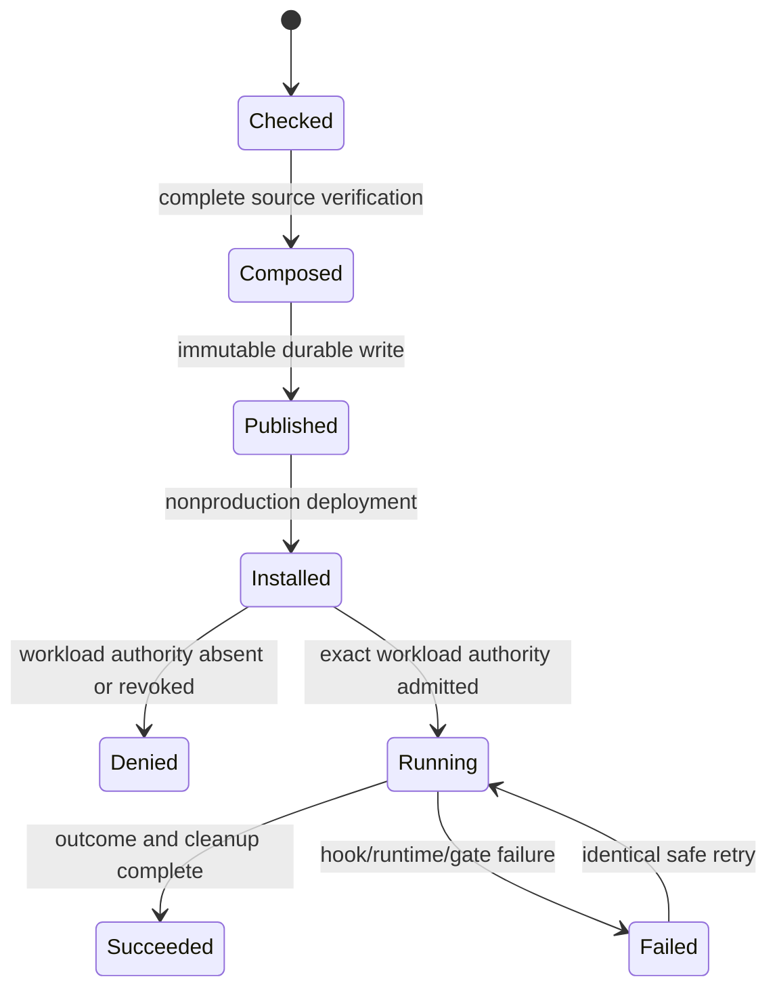
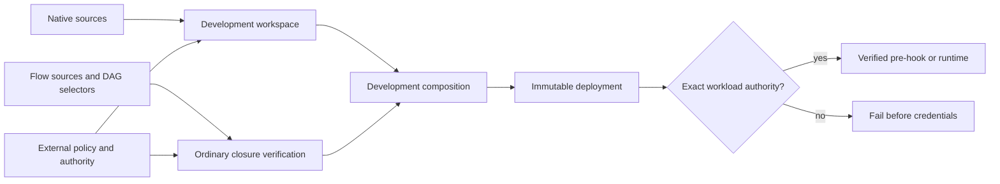

# Feature design: development workspace and batch release federation

- Status: APPROVED
- Owner: dpone maintainers
- Issue: maintainer implementation request
- Target release: 0.81.0
- Last verified: 2026-09-17

## Executive summary

dpone can publish a production-certified native dbt workspace, and it can
compose that workspace with a narrow plain-transfer release. It cannot safely
deliver a complete development workspace beside ordinary flow workloads that
use selectors, public Kubernetes resources, connection aliases, and separately
scheduled pre-hooks. The current failure is intentional: neither a test suffix
nor a nonproduction Airflow deployment is authority to reinterpret a production
release.

This feature adds a separate development release family. It preserves complete
source authority while allowing a development deployment to contain dormant dbt
workloads and independently executable ordinary flow workloads. A workload is
executable only when its own authority is present. The production and synthetic
families retain their current schemas, validation and runtime behavior.

All public examples and fixtures are synthetic and organization-neutral. Source
repositories may consume the generic contract with private configuration, but
private names, SQL, relations, hosts, issue identifiers, data and evidence are
outside this repository.

## Personas and customer journey

| Persona | Goal | Current pain | Success signal |
|---|---|---|---|
| Data engineer | Validate a flow in an isolated development deployment | A native dbt workspace elsewhere in the same release blocks publication | The selected flow runs without granting dormant dbt workloads execution authority |
| Platform engineer | Preserve one immutable deployment and exact source closure | Legacy compact merging loses native workspace authority | One verified parent binds native and ordinary sources, selectors, resources and hooks |
| Operator | Diagnose and safely retry a manual development run | Delivery and execution authority are conflated | The release reports delivery authority separately from workload execution authority |

The engineer authors a native workspace and ordinary flow sources. CI compiles
both, verifies their complete inputs, and creates one development parent. The
platform builds and installs the immutable deployment. Airflow may parse every
DAG, but a task obtains credentials and starts a process only after runtime has
verified authority for that exact workload and attempt. An unauthorized dormant
workload fails before source access. A failed separately scheduled pre-hook
fails its Airflow task and never writes XCom. Retry reopens the same immutable
release and source closure.

## Scope

### In scope

- a distinct development-native release schema and composition profile over the
  stable V2 artifact wire, never accepted as production authority;
- an externally pinned development authority for an isolated nonproduction
  deployment, with exact source-read and target-write participants and limits;
- delivery-only native membership, with execution denied unless an exact
  workload execution grant is supplied;
- a development composition parent containing a complete native workspace and
  ordinary flow/batch workloads;
- ordinary DAG selectors and exact workload membership;
- public Airflow resource requests and limits;
- connection alias projection without credential bytes;
- declarative SQL files and separately scheduled `pre_hook` actions;
- exact source archive, projection, pack, DAG, hook command and fingerprint
  verification;
- manual/recovery flows, deterministic retry, failure propagation and cleanup.

### Non-goals

- weakening or reinterpreting production certification;
- using `synthetic_composition_validation` for development or business data;
- authorizing a production target from a development release;
- embedding credentials, private source material or organization-specific
  examples in release metadata or this repository;
- separate Airflow `post_hook` tasks; post-hooks retain existing inline runtime
  semantics until a separately approved lifecycle contract exists;
- arbitrary commands, custom runners, cross-constituent dependencies, implicit
  scheduling, or live production certification;
- making a successful offline build evidence that a data route executed.

### Assumptions and constraints

- development authority is externally signed and independently pinned;
- source participants may be read-only shared systems only when explicitly
  enrolled; target and control participants must be isolated nonproduction
  systems;
- the source archive contains no credentials and stays within existing bounded
  extraction limits;
- connection projection contains aliases and binding shape only; physical
  credentials are resolved after sealed deployment admission;
- effective limits are the minimum of policy, grant and workload limits;
- full-refresh size authorization remains explicit and positive.

## Public contract

### CLI

No unauthenticated authority-file CLI is added in this increment. A platform
adapter must verify original policy and grant bytes, signature identity,
validity and revocation before it injects a typed receipt into the Python
composition root. Existing CLI commands remain production-default and reject a
development release where no verifier adapter is configured. This avoids
turning a user-written JSON file into authority.

### Python API

New construction is explicit and dependency-injected. Development contracts do
not add booleans to production validators. The application layer constructs a
development workspace writer and a development composition service from:

- a confined source reader;
- an external signature verifier;
- an independently pinned policy reader;
- an ordinary flow closure verifier;
- an integrity service and immutable publisher.

Pure contracts classify authority families and workload execution eligibility.
Adapters acquire files, signatures, registry bindings and clocks.

### Manifest/schema

The additive documents are:

- `dpone.development-authority.v1`;
- `dpone.dbt-release-set.development.v1` with the unchanged artifact wire
  `dpone.dbt-airflow-self-service.v2`;
- `dpone.release-set.v3` with promotion profile
  `development_workspace_delivery_v1`.

All are closed, bounded canonical JSON. Identity-bearing scope includes purpose,
trust tier, exact source commit, native and ordinary membership, read/write
participants, limits, policy and authority digests. Local paths and credentials
never enter identity.

The ordinary source descriptor binds:

- original DAG and pack bytes;
- selector-to-workload membership;
- the declarative source archive and every dependency;
- canonical connection projection aliases;
- public Airflow resources;
- exact hook phase, identifier, dependency order, SQL-file digest and generated
  runtime command;
- the rebuilt framework pack and fingerprint.

### Artifacts and evidence

The parent records native and ordinary constituent IDs, exact source sidecars,
an integrity subject, authority family, policy/grant digests, delivery status and
per-workload execution eligibility. Delivery evidence never reports workload
execution as passed. Runtime evidence names the exact release, deployment,
workload, attempt, command kind, hook identity, exit status and cleanup result.

### Compatibility and migration

Production v1/v2, composition v3 and synthetic nonproduction readers keep their
closed dispatch. Unknown development documents fail on older versions. Users
upgrade compiler, runtime, Airflow pack, provider and native accelerator as one
versioned set, regenerate locks, rebuild the release, then deploy it under
nonproduction trust. Rollback selects the previous immutable deployment; it does
not reinterpret the new release with old readers.

## Detailed algorithm

1. Discover every publishing dbt project and ordinary flow workload.
2. Parse and verify the external development policy and authority against the
   exact source commit, participant enrollment, validity, revocation and limits.
3. Compile dbt selection and packs from exact manifest/project/profile inputs.
   Mark each native workload delivery-only unless the authority includes its
   exact execution subject.
4. Reacquire all native inputs and assemble the distinct development-native
   release. Verify complete membership and source closure before publication.
5. Capture ordinary DAGs and selector membership. Reject cross-constituent or
   missing workload references.
6. For each ordinary pack, bounded-extract its source archive, rematerialize the
   flow and hook graph, and rebuild the pack with the exact public resources and
   alias-only connection projection. Compare every executable semantic field and
   fingerprint.
7. Require only supported process kinds: flow runtime and separate SQL pre-hook.
   Reject custom runners, arbitrary commands, separate post-hooks and unbound
   dependencies.
8. Check all logical writes for collision. Preserve native runtime payload IDs
   and ordinary source sidecars without rewriting their authority family.
9. Assemble the development parent, verify it from a private stage, write the
   integrity subject, reread every byte, and publish atomically.
10. Build and install one immutable nonproduction deployment. Parsing exposes
    all DAGs but grants no credentials.
11. At task start, reopen the parent, deployment, externally verified current
    authority and exact
    workload membership. Deny dormant or revoked workloads before init-fetch,
    source reads or writer issuance.
12. For a separate pre-hook, select the unique verified hook step, resolve
    connection aliases from the sealed deployment, run the canonical hook
    command, propagate its child exit code, publish no XCom and stop downstream
    runtime on failure.
13. For runtime, enforce source-byte and time limits, perform the declared load,
    verify outcome/quality gates, clean staging and publish terminal evidence.
14. Identical retry reuses the release and authority identities. Changed source,
    projection, command or grant produces a different identity or fails closed.

### Pseudocode

```text
policy = verify_external_policy(policy_bytes, pinned_digest)
grant = verify_development_grant(grant_bytes, policy, source_commit, clock)

native = compile_development_workspace(all_projects, grant)
ordinary = capture_and_rebuild_all_flows(dag_root, grant)
require_no_logical_write_collisions(native, ordinary)
parent = compose_development_release(native, ordinary, grant)
verify_complete_parent(parent)
publish_immutable(parent)

on_task_start(task):
    occurrence = reopen_deployment_and_authority(task.release_id)
    require_workload_execution_subject(occurrence, task.workload_id, task.kind)
    if task.kind == PRE_HOOK:
        command = select_unique_verified_pre_hook(task)
        exit(command, publish_xcom=false, exit_code=child)
    else:
        execute_bounded_runtime(task)
```

### State machine



### Edge cases

- Empty project or ordinary membership rejects.
- A native workspace with delivery authority but no execution subject installs;
  any attempt to run it rejects before credentials.
- Duplicate selectors, pack IDs, hook IDs or logical writes reject.
- Unknown fields, null authority, symlinks, archive traversal and digest drift
  reject before publication.
- A connection projection containing credential material rejects.
- Resource request greater than limit or outside policy rejects.
- Pre-hook success without runtime is not pipeline success; pre-hook failure
  blocks runtime and produces no XCom.
- Partial publication reports durability uncertainty and never success.
- Expiry or revocation blocks new attempts; historical evidence stays readable.

## Architecture

### Market comparison and measurable target

Official documentation reviewed on 2026-09-17:

| System | Relevant public behavior | Adopted or rejected pattern |
| --- | --- | --- |
| [Astronomer Cosmos](https://astronomer.github.io/astronomer-cosmos/guides/run_dbt/execution-modes.html) | Separates parsing/rendering from several worker and container execution modes | Adopt explicit isolated execution modes; add immutable release and authority checks rather than relying on execution-mode configuration alone |
| [Fivetran Transformations for dbt Core](https://fivetran.com/docs/transformations/dbt) | Syncs a Git project and runs ordered dbt commands on integrated, custom, cron, or repository-defined schedules | Adopt repository-owned declarative scheduling; reject implicit delivery-as-execution authority |
| dlt | N/A: pipeline state and deployment do not address mixed Airflow release federation | No pattern adopted |
| Airbyte | N/A: connector development does not define native dbt plus ordinary Airflow release authority | No pattern adopted |
| Informatica, Pentaho, SSIS, gusty, Apache Beam | N/A for the exact immutable mixed-release authority boundary | No pattern adopted |

The measurable target is deterministic offline federation of one complete
native workspace and one or more selector-scoped ordinary workloads: identical
inputs must produce identical release identity in 100% of 100 repeated runs;
every missing, changed, expired, revoked or over-budget authority input must be
rejected before publication or credentials. The evidence artifact is the
focused test report plus the immutable release metadata generated from public
synthetic fixtures. Live route qualification remains separate.

### Components and responsibilities

| Component | Existing/new | Responsibility | Dependencies |
|---|---|---|---|
| Development authority contracts | New | Closed policy, grant, scope, limits and identity | Pure contracts |
| Development workspace assembly | New | Reuse dbt projections under distinct authority family | Existing project projector and source reader |
| Ordinary flow source verifier | Extended | Rebuild selectors, resources, aliases and pre-hooks from exact sources | Manifest loader, dependency resolver, pack builder |
| Development composition service | New | Verify complete union and publish one immutable parent | Source readers, integrity, publisher |
| Deployment/runtime admission | Extended | Separate delivery membership from workload execution authority | Deployment cache and protected authority reader |
| Airflow provider/pack | Extended | Preserve exact task kind and hook identity | Existing verified launcher contract |

### Ports, adapters, and composition root

Contracts and services never read environment variables, credentials or clocks.
Ports expose policy bytes, signature verification, participant enrollment,
registry binding and immutable publication. Application roots inject adapters.
Provider and CLI remain thin consumers of the same services.

### Data and control flow



### Alternatives and tradeoffs

| Alternative | Advantages | Disadvantages | Decision |
|---|---|---|---|
| Treat DEV as production-certified | No new schema | False certification and unsafe authority reuse | Rejected |
| Reuse synthetic campaign | Existing signed contracts | Forbids real development data and shared read-only sources | Rejected |
| Merge descriptor-less compact packs | Small adapter | Loses workspace source authority | Rejected |
| Require every delivered workload to be executable | Simpler activation | Blocks unrelated development flows and over-grants dbt | Rejected |
| Separate delivery and workload execution authority | Least privilege and one immutable deployment | More explicit contracts and runtime checks | Adopted |

### ADR requirement

Required. This introduces a new authority family and changes the relationship
between release membership and execution permission. The ADR must preserve
closed dispatch and document why production and synthetic contracts remain
unchanged.

### Quality-budget impact

New pure authority and service modules stay below the repository SLOC budget.
Existing large validators are extended through family dispatch functions, not
additional nested branches. Shared schemas and registries remain integrator-owned.

## Market comparison

| System/version | Relevant capability | Observed design | Strength | Limitation | Adopt/reject | Source/date |
|---|---|---|---|---|---|---|
| dlt, current docs | Development isolation | `dev_mode` starts fresh and loads to a separate timestamped dataset | Clear isolation for experimentation | Does not provide dpone's immutable multi-producer authority chain | Adopt explicit development isolation; retain stronger authority ([docs](https://dlthub.com/docs/general-usage/pipeline), 2026-09-17) |
| Astronomer Cosmos, current docs | dbt-to-Airflow task projection | Separates project parsing from execution and supports container execution modes | Fine-grained task visibility and environment isolation | Operator configuration alone is not source/release authority | Adopt parse/execute separation; reject implicit trust ([docs](https://astronomer.github.io/astronomer-cosmos/getting_started/core-concepts.html), 2026-09-17) |
| Airbyte | Connector-oriented pipeline delivery | N/A for immutable dbt workspace plus arbitrary flow composition | Mature connector model | Not the target authority problem | N/A |
| Informatica | Enterprise workflow deployment | N/A for an open Python release wire | Broad operational controls | No directly reusable public contract | N/A |
| Fivetran | Managed connector delivery | N/A | Managed operations | No user-owned immutable multi-producer release | N/A |
| Pentaho | Job/transformation orchestration | N/A | General workflow graph | No relevant signed release authority contract | N/A |
| Microsoft SSIS | Package execution | N/A | Mature package deployment | Platform-specific authority model | N/A |
| gusty | Airflow DAG authoring | N/A | Declarative DAG construction | Does not solve artifact/source authority | N/A |
| Apache Beam | Portable data processing | N/A | Portable runner model | Not a dbt/Airflow release federation system | N/A |

## Measurable differentiation

```yaml
axis: least-privilege mixed development delivery
scenario: one complete native workspace plus ordinary flow workloads in one immutable deployment
baseline: all delivered workloads require production authority or the release fails
metric: unauthorized workload processes or credential issuances
target: 0, while one explicitly authorized ordinary flow completes
procedure: build a synthetic mixed parent, parse all DAGs, attempt one dormant native workload, then run one authorized flow with a separate pre-hook
artifact: development-release acceptance report with deployment, denial, hook, runtime and cleanup receipts
limitations: offline and synthetic acceptance does not certify a live connector route
```

## Security, privacy, and operations

Policies pin signer, environment, participants, source commit, validity,
revocation and limits. Alias projection never contains secrets. Source access is
read-only and independently enrolled; target/control systems are nonproduction.
All examples use generated synthetic identifiers and rows. Logs sanitize SQL,
credentials and private filesystem roots. Operators can inspect denial reason,
authority expiry, selected workload, resource admission and cleanup evidence.

## Test and certification plan

| Layer | Scenario | Environment | Expected artifact |
|---|---|---|---|
| Unit | Closed authority parsing, family dispatch, limits, selector/hook closure | Offline synthetic | Contract reports |
| Contract | Compile native delivery-only plus ordinary flow with resources/aliases/pre-hook | Offline synthetic | Exact release trees and negative fixtures |
| Integration | Build, install, parse; deny dormant dbt; execute authorized flow | Isolated synthetic services | Deployment and attempt receipts |
| Live certification | Representative source read and nonproduction target write | Explicitly approved isolated environment | Route-specific evidence; never inferred from unit tests |
| Performance | Large bounded source archive and maximum membership | Offline/isolated | Time/memory/byte report |
| Compatibility | Existing production v2, v3 composition and synthetic family unchanged | Offline | Golden vectors |

Tests cover expired/revoked grants, unknown fields, policy drift, missing source
files, archive traversal, projection credentials, resource overflow, selector
collision, hook tampering, hook failure, no-XCom behavior, unauthorized native
execution, identical retry, conflicting retry and cleanup failure.

## Documentation plan

Add a first-use development federation guide, schema reference, authority
explanation, operator runbook and synthetic example. Cross-link dbt workspace,
Airflow pack/provider, release composition, compatibility and release docs.
Generated CLI/schema references must be regenerated from code.

## Rollout and rollback

Ship as an additive 0.81.0 family. Consumers must update the four coordinated
packages and rebuild releases. Start with offline synthetic acceptance, then an
explicitly approved isolated live environment. Roll back by selecting the prior
immutable deployment. Any authority ambiguity, credential issuance to a dormant
workload, source-closure mismatch or incomplete cleanup blocks rollout.

## Agent execution plan

| Agent/role | Owned paths | Read-only paths | Forbidden paths | Dependency |
|---|---|---|---|---|
| Integrator | Shared contracts, schemas, app roots, changelog, navigation | Whole repository | Private downstream repositories and evidence | Approved design |
| Contract reviewer | Read-only authority/release review | Contracts, specs, ADRs | Writes | Draft implementation |
| Runtime reviewer | Read-only execution and provider review | Runtime/provider/pack | Writes | Draft implementation |
| Test/docs reviewer | Read-only test, UX and release review | Tests/docs/release | Writes | Draft implementation |

The primary agent is integrator and shared-file owner. All implementation and
fixtures remain organization-neutral.

## Approval checklist

- [x] User problem and CJM are clear.
- [x] Algorithm and failure semantics are implementable without guessing.
- [x] Public contracts and compatibility are explicit.
- [x] Architecture and alternatives are justified.
- [x] Relevant market research uses current official sources.
- [x] Claimed differentiation is measurable.
- [x] Tests, evidence, docs, rollout, and rollback are complete.
- [x] Path ownership and integration plan are conflict-safe.
- [x] Maintainer changed status to `APPROVED` through the implementation request.
