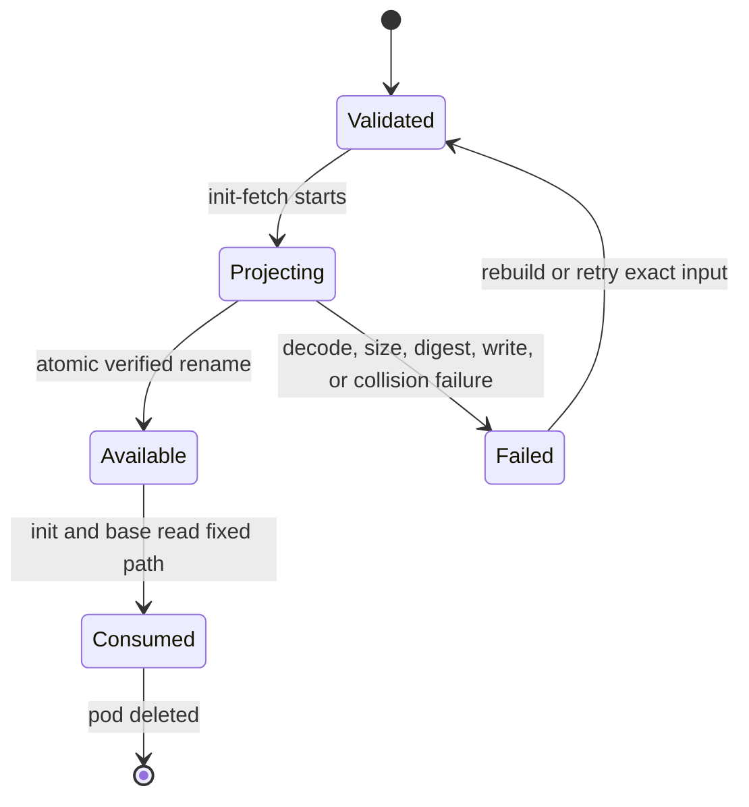
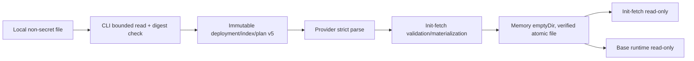

# Feature design: immutable KPO runtime-authority payload

- Status: IMPLEMENTED
- Owner: dpone maintainers
- Issue: maintainer request
- Target release: 0.83.0
Last verified: 2026-09-20

Implementation evidence: [`validation-report.md`](../../test_artifacts/airflow-runtime-authority-immutable-payload-v1/validation-report.md).

## Executive summary

Protected development deployments currently require a Kubernetes Secret even
when the image-installed authority adapter needs only bounded, non-confidential
configuration. This additive extension accepts one exact local payload during
`dpone airflow build`, binds its decoded bytes to an explicit byte count and
SHA-256, and carries the closed immutable value in new deployment/index/runtime-
plan v5 contracts. Init-fetch materializes those already-validated bytes into a
Pod-lifetime, memory-backed volume before authority access; base independently
verifies the same file before its own authority access. The existing v4 Secret
projection remains unchanged for confidential values.

The measurable outcome is a protected development pod that creates or reads no
deployment-specific Secret or ConfigMap for non-secret authority configuration,
while rejecting malformed, oversized, truncated, or digest-mismatched payloads
before the authority adapter can run.

## Personas and customer journey

| Persona | Goal | Current pain | Success signal |
|---|---|---|---|
| Platform operator | Deploy non-secret authority policy without a mutable cluster object | A Secret is mandatory even for public configuration | One digest-pinned file reaches both runtime processes without an external object |
| Security reviewer | Keep confidential and non-confidential transport semantics explicit | An inline value could be mistaken for Secret-equivalent protection | Help, schema, and runbook state that the immutable payload is API-visible and non-secret only |
| Data developer | Diagnose invalid input before a pod runs | Size or digest drift could otherwise surface inside a private adapter | Stable redacted CLI/provider/runtime errors identify the failed invariant |

The operator discovers the two authority source modes in CLI help, chooses the
immutable mode only for non-secret bytes, computes an expected SHA-256, and
builds the deployment. The CLI validates the file before any artifact write.
At DAG parse the provider independently validates the closed source. Init-fetch
validates and atomically writes the file before authority or registry access;
base independently verifies it before authority access. Both use the fixed path.
On failure the operator corrects the file/digest and rebuilds the immutable
deployment. Upgrade is additive; rollback selects the Secret mode or an earlier
exact package set.

## Scope

### In scope

- A closed `immutable_payload` authority source containing canonical Base64,
  decoded byte count, and `sha256:<lowercase hex>` over exact decoded bytes.
- A 4 KiB decoded limit, with non-empty input, bounded encoded input, and the
  existing 16 KiB total runtime-plan cap unchanged.
- Mutually exclusive CLI selection between legacy Secret and immutable file.
- Independent build-plane, provider-parse, and pod-runtime validation.
- A provider-owned memory-backed `emptyDir` with an 8 KiB size limit; init-fetch
  materializes through a write mount and base receives a read-only mount.
- Mapping and Kubernetes-client pod models, generated schemas/reference, tests,
  docs, changelog, and release packaging.

### Non-goals

- Secret-equivalent confidentiality, encryption, redaction from Kubernetes API
  readers, or transport of credentials/tokens/private keys.
- Caller-selected commands, images, paths, volume names, encodings, or limits.
- Creating, updating, deleting, or garbage-collecting Kubernetes resources.
- Changing the private adapter contract or ordinary/production plan policy.
- Claiming live Kubernetes certification without an approved live environment.

### Assumptions and constraints

- Deployment/index artifacts and Pod specs can be read by their existing
  authorized principals; immutable payload bytes are therefore non-secret.
- The exact runtime image already contains the matching dpone Airflow pack.
- Kubernetes executes init containers in order and shares `emptyDir` contents
  with later containers for the lifetime of one Pod.
- All examples use generic synthetic JSON without external names or credentials.

## Public contract

### CLI

`dpone airflow build` adds:

- `--runtime-authority-payload-file PATH`;
- `--runtime-authority-payload-sha256 sha256:<64 lowercase hex>`.

The two options are required together and are mutually exclusive with
`--runtime-authority-secret-name` and `--runtime-authority-secret-key`. The
payload must contain 1..4,096 bytes. Usage/validation failures return exit 2,
write diagnostics to stderr, emit no result on stdout, and create no output or
cluster side effect. The Secret flags and default key remain unchanged.

### Python API

The existing `runtime_authority_ref` build-plane argument accepts either the
legacy closed `{kind: kubernetes_secret, name, key}` mapping or a closed
`{kind: immutable_payload, payload_b64, bytes, sha256}` mapping. This is an
additive accepted variant; no new adapter or public import is introduced.

### Manifest/schema

The protected source family has two closed versioned variants. Frozen v4 keeps
only `kubernetes_secret_volume`; deployment/index v5 keeps only:

```yaml
mode: immutable_payload
encoding: base64
payload_b64: eyJtb2RlIjoic3ludGhldGljIn0K
bytes: 21
sha256: sha256:<64 lowercase hex>
```

The versions cannot be relabeled or mixed. Digest identity is defined over
decoded bytes. Base64 must be canonical RFC 4648
standard alphabet with required padding. Empty input, unknown fields, malformed
Base64, declared-size mismatch, maximum+1, and digest mismatch fail closed.

### Artifacts and evidence

The payload is part of canonical v5 deployment/index identity and is copied into
the hash-bound v5 runtime plan so both processes can verify it independently. It
is not copied into XCom, receipts, or logs. No new evidence schema is introduced.
Validation evidence records commands and pass/fail status, never payload bytes.

### Compatibility and migration

Secret-mode v4 schemas, deployment/index bytes, and rendered Pod shape remain
unchanged. Existing v2/v3/v4 inputs remain valid. Protected development users
may continue using a Secret indefinitely; immutable mode is opt-in and is safe
only for non-secret configuration. Downgrade by rebuilding with Secret mode or
using the previous exact version; an older provider rejects the new closed mode.

## Detailed algorithm

1. The CLI requires exactly one complete authority-source option set.
2. For immutable mode it opens the local file once, reads at most 4,097 bytes,
   rejects empty/oversized input, validates the explicit digest, and emits
   canonical Base64 plus exact decoded byte count.
3. Build-plane normalization accepts exactly one closed variant and recomputes
   decoded size and digest before canonical deployment/index construction.
4. Provider parsing applies the encoded bound before decode, decodes strictly,
   checks canonical re-encoding, decoded bound/count, SHA-256, and the unchanged
   16 KiB total plan bound, then stores an immutable DTO. No runnable operator is
   constructed on failure.
5. Secret mode follows the existing v4 code path byte-for-byte. Immutable mode
   reserves one memory-backed volume, its mounts, and the existing fixed path
   environment variable. Any collision fails before operator construction.
6. Init-fetch decodes the hash-bound v5 plan, validates the payload, writes a
   private temporary file through its write mount, verifies written bytes,
   changes mode to `0400`, and atomically renames it to the fixed authority
   path. Only after that succeeds may it create the durable development-evidence
   spool or perform authority/registry I/O.
7. Base decodes the same plan, opens the file with bounded/no-follow semantics,
   rechecks type, length, and digest, then performs its independent authority
   call. Base mounts the volume read-only.
8. A retry reconstructs the same Pod from the same immutable index. No fallback,
   remote lookup, mutable cluster object, partial-file reuse, or resume state
   exists. Pod cancellation/deletion destroys the ephemeral volume.

### Pseudocode

```text
source = select_exactly_one(secret_options, payload_options)
if source is payload:
    raw = bounded_read(path, max + 1)
    require 1 <= len(raw) <= max
    require sha256(raw) == expected_sha256
    wire = {mode, encoding, canonical_base64(raw), len(raw), sha256(raw)}

parsed = strict_parse(wire)
if parsed.mode is immutable_payload:
    raw = strict_decode_and_verify(parsed)
    pod = reserve_memory_empty_dir(pod, parsed)
init-fetch: strict_decode_and_verify -> atomic_write -> reread_and_verify -> authorize
base: bounded_no_follow_read -> verify length/digest -> authorize
```

### State machine



### Edge cases

Empty, missing-pair, both-mode, malformed/canonicality, non-UTF-8, exact-limit,
limit+1, declared-size mismatch, digest mismatch, duplicate/missing containers,
reserved-field collision, total-plan overflow, partial write, process crash,
retry, and cancellation
are covered. Schema drift and nested data are not applicable because the payload
is opaque bytes. A projector crash leaves only a temporary file and blocks later
init containers; a fresh Pod starts with an empty volume.

## Architecture

### Components and responsibilities

| Component | Existing/new | Responsibility | Dependencies |
|---|---|---|---|
| Build CLI adapter | Extend | Bounded file read and explicit source selection | stdlib only |
| Runtime-authority source codec | New dependency-light modules | Canonical encode/decode, bounds, digest verification | stdlib only |
| Deployment projection/schema | Extend | Closed union and canonical identity | codec contract |
| Provider parser DTOs | Extend | Parse-safe immutable source | codec contract |
| Pod projection | Extend | Preserve Secret path; compose memory-backed ephemeral path | provider DTOs |
| Runtime projector/verifier | New | Init atomic materialization and base independent verification | stdlib only |

Dependencies continue pointing inward to contracts/pure helpers. Airflow and
Kubernetes imports remain optional and parse-safe. The CLI is a composition
root; it injects already-read bytes into the pure build-plane contract.

### Data and control flow



### Alternatives and tradeoffs

| Alternative | Advantages | Disadvantages | Decision |
|---|---|---|---|
| Kubernetes Secret | Confidential native projection | Mutable cluster object remains required | Retain for confidential values |
| ConfigMap | Familiar non-secret file projection | Separate mutable object and lookup | Reject |
| Pod annotation/downward API | No bootstrap container | Metadata is mutable and payload becomes an annotation contract | Reject |
| Literal env directly in both runtimes | Simple | Duplicates payload and broadens process environments | Reject |
| Memory `emptyDir` + existing init/base | Pod-lifetime, shared, bounded, no external object or extra container | Pod readers see payload; init needs a write mount | Adopt |

### ADR requirement

ADR 0070 records the deliberate safe-to-persist classification, v5 wire, and
integrity-versus-confidentiality boundary because the earlier v4 decision
rejected inline payloads.

### Quality-budget impact

The codec/materializer and projection responsibilities remain separate; no
module may exceed `docs/benchmarks/quality_budgets.yml`. The design adds no
vendor SDK and no base-import Airflow/Kubernetes dependency.

## Market comparison

Sources checked 2026-09-20.

| System/version | Relevant capability | Observed design | Strength | Limitation | Adopt/reject | Source/date |
|---|---|---|---|---|---|---|
| dlt | N/A | Application credential/config providers, not KPO pod-file projection | N/A | Different layer | N/A |
| Informatica | N/A | Managed integration configuration, not OSS KPO pod composition | N/A | Different layer | N/A |
| Airbyte | N/A | Connector secret references, not KPO pod-file projection | N/A | Different layer | N/A |
| Fivetran | N/A | Managed connector configuration | N/A | Different layer | N/A |
| Pentaho | N/A | Job/runtime parameters, not KPO pod composition | N/A | Different layer | N/A |
| Microsoft SSIS | N/A | Package configuration/protection, not Kubernetes pod composition | N/A | Different layer | N/A |
| gusty | N/A | DAG authoring helper; no closed digest-bound authority projection found in public contract | N/A | No relevant primitive | N/A |
| Astronomer Cosmos 1.15+ docs | Kubernetes execution accepts general operator args and examples use Secrets | Flexible native KPO integration | Caller-owned args do not establish a closed digest-bound source | Retain isolation goal; reject open operator authority | [Official Cosmos Kubernetes execution docs](https://astronomer.github.io/astronomer-cosmos/getting_started/kubernetes.html), checked 2026-09-20 |
| Apache Beam | N/A | Data-processing SDK/runtime, not Airflow KPO pod composition | N/A | Different layer | N/A |

Relevant platform facts: current [Kubernetes volume documentation](https://kubernetes.io/docs/concepts/storage/volumes/)
defines `emptyDir` as Pod-lifetime ephemeral storage shared by containers and
supports `medium: Memory` plus `sizeLimit`; current [Airflow
KubernetesPodOperator documentation](https://airflow.apache.org/docs/apache-airflow-providers-cncf-kubernetes/stable/operators.html)
exposes native pod/volume composition. Sources checked 2026-09-20. These facts
support feasibility, not a marketing claim.

## Measurable differentiation

```yaml
axis: mutable cluster objects required for non-secret protected authority input
scenario: one protected development task with a 1 KiB synthetic immutable payload
baseline: dpone 0.82.0 kubernetes_secret_volume mode
metric: deployment-specific Kubernetes Secret or ConfigMap reads/creates
target: 0 in immutable_payload mode; build, provider, init, and base validation reject one-byte tampering
procedure: render a pod twice, inspect object references, run projector boundary/tamper tests
artifact: test_artifacts/airflow-runtime-authority-immutable-payload-v1/validation-report.md
limitations: hermetic evidence does not certify a live Kubernetes distribution or confidentiality
```

## Security, privacy, and operations

Immutable payloads are visible in deployment/index artifacts and Pod specs and
must never contain credentials or sensitive personal data. Secret mode remains
the required path for confidential bytes. Diagnostics include invariant names,
paths, sizes, and expected grammar but never payload contents. Bounds apply
before decode and after decode. The projector has one fixed command, path,
volume, encoding, and size. It performs no network or Kubernetes API operation.
Operators diagnose materialization failure from the init-container status/log code,
correct the build input, and safely retry with a fresh Pod.

## Test and certification plan

| Layer | Scenario | Environment | Expected artifact |
|---|---|---|---|
| Unit | codec, boundaries, canonical Base64, digest/count mismatch, atomic writer/no-follow verifier | Hermetic | pytest log |
| Contract | closed schema union, legacy bytes, deployment/index symmetry | Hermetic | pytest log/generated schemas |
| CLI | option matrix, file errors, redaction, help/reference | Hermetic | pytest log/reference diff |
| Integration | mapping/object pods, order, mounts, collisions, deterministic retry | Dependency-light + Kubernetes client | pytest log |
| Live certification | no external object, exact bytes in both processes, retry/tamper | Explicitly approved disposable cluster only | separate evidence or UNVERIFIED |
| Performance | 1 byte, 4 KiB, 4 KiB+1 parse/materialization | Hermetic | bounded test timings |
| Compatibility | v2/v3/no-authority and legacy Secret fixtures | Hermetic | pytest log |

## Documentation plan

Update the Airflow provider guide, provider API, CLI reference, schema catalog,
feature-spec index/navigation if required, upgrade/runbook guidance, changelog,
and synthetic examples. Document discovery, preparation, run, observation,
diagnosis, recovery, operation, downgrade, confidentiality boundary, and live
certification status.

## Rollout and rollback

Ship core, Airflow pack, provider, and runtime image as one exact version. Secret
mode continues producing v4; immutable mode selects v5 and requires coordinated
v5 readers. Post-release verification checks all four public distributions and
fresh installation. Roll back by rebuilding the deployment with Secret mode or
pinning the previous exact package set. Any payload exposure in logs/evidence,
legacy schema/pod-shape change, silent truncation, or digest bypass is a release blocker.

## Agent execution plan

| Agent/role | Owned paths | Read-only paths | Forbidden paths | Dependency |
|---|---|---|---|---|
| Explorers/reviewers | none | repository | all writes | none |
| Integrator | feature implementation, tests, docs, schemas, version files, evidence report | repository | credentials/private systems | approved spec |

The primary agent is the sole writer and shared-file owner. A fresh-context
independent reviewer must inspect the final commit and evidence before merge.

## Approval checklist

- [x] User problem and CJM are clear.
- [x] Algorithm and failure semantics are implementable without guessing.
- [x] Public contracts and compatibility are explicit.
- [x] Architecture and alternatives are justified.
- [x] Relevant market research uses current official sources.
- [x] Claimed differentiation is measurable.
- [x] Tests, evidence, docs, rollout, and rollback are complete.
- [x] Path ownership and integration plan are conflict-safe.
- [x] Maintainer request explicitly authorizes implementation and release work.
