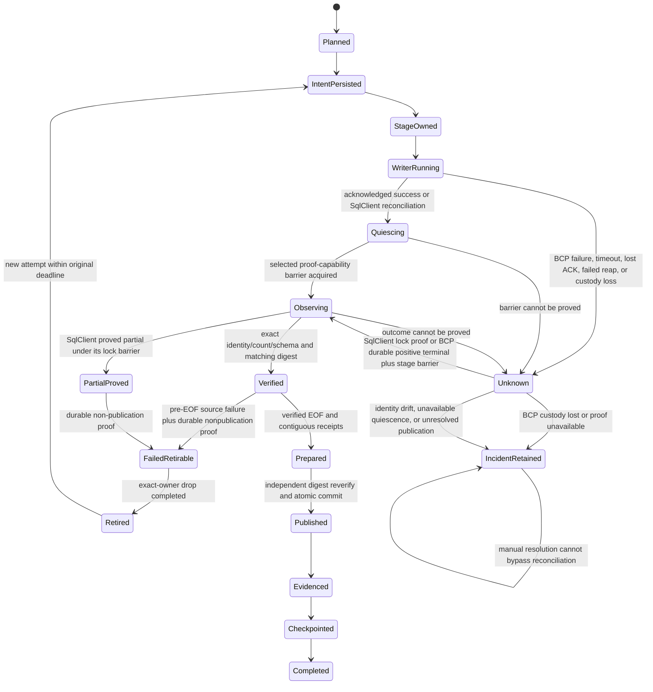
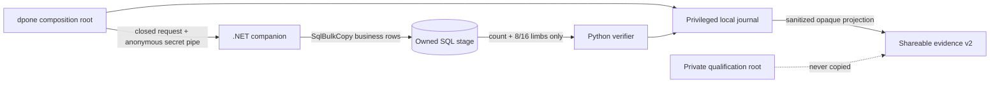

# MSSQL SqlClient target-local verification v2: architecture and algorithm

This normative appendix belongs to the [approved feature specification](mssql-sqlclient-target-local-verification-v2.md). It owns the detailed algorithm, state machine, dependency boundaries, and tradeoffs.

## Detailed algorithm

1. Parse the existing bounded route, import backend, and verification backend;
   validate the complete closed object before connector row I/O.
2. Resolve backend capability at the composition root. For SqlClient, require
   the optional companion, exact protocol version, supported runtime/driver,
   and a fully supported source-to-target type layout.
3. Freeze the existing window, schema, wire contract, chunk limits, target,
   writer identity, digest algorithm, timeout policy, and identity version into
   the plan. Create one monotonic deadline for each attempt at the composition
   root; a retry gets a new bounded attempt budget but never extends the
   process-local invocation deadline. After process restart, automatic retry is
   forbidden. Reconciliation runs under a new bounded recovery deadline; any
   further write requires operator authorization and a new attempt identity.
   After acquiring the target lease, check stable target custody. A target-local
   v2 invocation CAS-claims it before source I/O; a matching source-free
   recovery reuses it, while every different v1/v2 invocation stops.
4. Reuse the current single ClickHouse query and bounded encoder pipeline.
   Each immutable native file is fsynced and sealed with file SHA, row count,
   encoded byte count, and typed multiset digest.
5. Persist the existing attempt intent and create an isolated owned raw stage.
   Re-read catalog identity, ownership, writable column order, and capacity.
6. Grant exactly that stage and sealed file to the selected writer. For
   SqlClient, stream native rows through a bounded `DbDataReader` into
   `SqlBulkCopy` with explicit mappings, `KeepNulls`, approved table locking,
   no triggers, and timeout derived from the remaining operation deadline.
   Before persisting `GRANTED`, reassert that stable target custody still names
   the same invocation. Any drift stops before writer I/O.
7. Apply the selected closed proof capability.
   - For P1 BCP, persist `GRANTED`, then persist `WRITING` before exactly one
     supervised launch may occur. Retain the child handle under that grant.
     `WRITER_TERMINAL(success)` requires acknowledged BCP success, positive
     child reaping, exact vendor count, empty reject output, and unchanged
     sealed-file identity. Timeout, cleanup failure, lost acknowledgement,
     controller/custody loss, or ambiguous launch yields `UNKNOWN`; digest,
     drop, preparation, automatic retry, and overlapping invocation are
     forbidden. After positive success, a verification transaction acquires
     `TABLOCKX, HOLDLOCK` on the exact owned stage, repeats object/owner/schema
     identity, and performs verification while the barrier is held. This is a
     successful-process-plus-stage-barrier proof, not a writer-session lock.
   - For SqlClient, the companion acquires a session-owned exclusive
     application lock derived from the opaque grant token before bulk copy and
     holds it until connection disposal. The verification transaction acquires
     that same lock and the exact-stage barrier. Acquiring both proves the
     writer session is gone and rollback/stage locks have drained.
   Any barrier timeout, rollback still in progress, or unavailable proof yields
   `UNKNOWN` and retains custody.
8. While holding that barrier, verify current object ID, owner binding, schema,
   row count, and target-local typed digest, then repeat the identity check
   before releasing it. Scan at most `expected_rows + 1`: the aggregate reports
   exact count when it is at most expected and otherwise reports
   `count_overflow=true` plus the `expected_rows + 1` sentinel. An overflow can
   never verify. Return the count/sentinel plus eight `decimal(38,0)` limb
   sums ordered most-significant to least-significant. Compute each row hash
   once behind a bounded optimizer barrier; the raw result has ten values:
   count/sentinel, overflow flag, and eight limbs.
   Python validates result shape and bounds, propagates carries, and reduces the
   sum modulo 2^256 before calling the existing `native_multiset_digest`. The
   prepared result returns count/sentinel, overflow flag, and two eight-limb
   sets: 18 values total.
9. Construct the existing `NativeChunkReceipt` only when count, sealed-file
   digest, stage identity, and target-local digest agree. Complete or partial
   observations never manufacture a receipt. This barrier-held digest is the
   import verification for that receipt; the generic importer must not repeat
   the same full scan immediately. Preparation and the prepublication boundary
   retain their independent revalidation scans.
10. After verified EOF and contiguous receipts, build the existing prepared
   stage. Compute both business and full prepared digests inside SQL Server and
   return aggregate rows only. Compare the business digest to raw receipts and
   retain the full digest for later independent prepublication verification.
11. Reverify ownership, raw receipts, prepared count, schema, and full digest at
    the existing boundary. Perform the existing single atomic publication.
12. Persist publication receipt, evidence, checkpoint, and cleanup in the
    existing order. Source-free resume remains available only after verified
    EOF; failures before EOF require re-extraction.

### P4 persisted-hash and mutation-watermark contract

P4 changes only the explicitly selected SqlClient layout. Protocol and layout
v2 append two framework-owned columns to every raw stage:
`__dpone__native_row_hash binary(32) NOT NULL` and
`__dpone__mutation_version rowversion NOT NULL`. The companion computes the
SHA-256 hash incrementally from the exact canonical bytes it consumes for one
sealed row and exposes that hash as the final `IDataReader` field. Explicit
column mappings write it with the business row in the same `SqlBulkCopy`
operation. The rowversion is generated by SQL Server and is never supplied by
the client. BCP and protocol/layout v1 retain their existing physical schema
and verification behavior.

The first verification remains independent of writer completion. Under the
same application-lock and table-lock barrier it checks object, owner, schema,
row count, and the multiset sum of the persisted 32-byte hashes against the
sealed-file typed digest. It also records `MAX(__dpone__mutation_version)` as an
unsigned eight-byte watermark. A receipt is impossible until all facts agree.
The persisted hash is evidence only; it is never a key and never replaces the
sealed source artifact.

Every later raw-stage verification repeats object, owner, and schema checks and
reads only `COUNT_BIG(*)` plus `MAX(__dpone__mutation_version)` under the normal
barrier. Matching count and watermark prove that no row was inserted, updated,
or deleted since the independent first verification: SQL Server assigns a new
rowversion on every insert or update; deletion changes the count, and a
same-count delete/insert produces a newer watermark. Any mismatch retains
custody and runs no preparation or publication. The proof is database-local;
restoring, copying, or moving a stage to another database changes physical
identity and is rejected before the watermark can be used.

Prepared-stage v2 materializes the already verified native row hash beside the
business and framework columns and owns its own rowversion. Construction,
initial business/full aggregate verification, and watermark capture happen in
one fenced target transaction. Prepublication verification uses exact object,
owner, schema, count, and watermark; it does not rebuild canonical business
payloads when the watermark is unchanged. The publication SQL excludes both
technical columns from the customer table. Recovery receipts persist the
layout ID, object ID, initial aggregate, row count, and watermark, and v1
readers reject v2 records rather than guessing.

The optimization is accepted only if differential tests prove byte-for-byte
hash parity for every admitted type and null form, mutation tests cover
insert/update/delete/truncate and delete-plus-insert, crash tests cover every
receipt boundary, and exact-commit narrow/wide100 live certification passes.
A/B evidence must report transport, initial verification, repeat verification,
preparation, publication, log bytes, storage, and peak memory separately. A
failure or unsupported layout falls closed; there is no automatic downgrade
inside an invocation.

The SQL digest implementation must reproduce the existing encoder bytes for
every admitted layout, hash each row with SHA-256, and use the aggregate
contract above. SQL text and projected column count are bounded before
execution; the target work bound is `expected_rows + 1`. The minimum admitted
SQL Server version must support `HASHBYTES` over the compiled `varbinary(max)`
payload and is checked before source I/O. Differential tests are the authority;
SQL collation, implicit conversion, and row order must not affect the result.

P1 never broadens or guesses the route surface. The generated
`TargetLocalLayoutMatrixV1` in
`dpone.runtime.sinks.mssql_native_target_local_layout` is the intersection of the current planner,
ClickHouse source, encoder, importer, and live-certified layout registries.
Current importer exclusions such as `char`/`varchar` without UTF-8 collation
authority remain excluded. Wire-only `binary`/`varbinary` capability does not
enter the optimized route until the route registry has live proof. Prepared
verification separately covers all admitted mapped business types plus
framework types `varchar(26)`, `varchar(32)`, `varchar(64)`, `nvarchar(max)`,
`int`, and `datetime2(7)`. Any layout absent from the generated matrix makes
readiness reject `target_local`; default BCP continues Python readback without
narrowing. The matrix artifact binds the exact commit and capability digest.
The sanitized receipt is stored as
`test_artifacts/live_certification/mssql-target-local-p1/layout-matrix-v1.json`.

### Pseudocode

```text
plan = admit_and_freeze(config, backend_capability)
if not journal_identity_is_compatible(plan):
    stop_before_source_with_identity_mismatch()
claim_or_resume_invocation_target_custody_before_source(plan)

for sealed_file in bounded_encode(single_source_query(plan)):
    intent = journal.begin_attempt(plan, sealed_file.identity)
    stage = create_owned_raw_stage(intent)
    grant = revalidate_and_grant(stage, sealed_file, plan)
    assert_invocation_target_custody_before_granted(grant)
    deadline = attempt_deadline(plan.timeout_policy, invocation_deadline)
    outcome = writer(plan.backend).write_once_under_custody(grant, deadline)

    if grant.proof_capability == "bcp-supervised-stage-barrier-v1":
        if not outcome.acknowledged_success_and_reaped:
            append(UNKNOWN)
            stop_and_retain_without_retry_drop_prepare_publish_or_overlap()
        if (
            outcome.vendor_rows != sealed_file.rows
            or not outcome.reject_output_is_empty
            or not sealed_file.identity_is_unchanged()
        ):
            append(UNKNOWN)
            stop_and_retain_without_retry_drop_prepare_publish_or_overlap()
        barrier = acquire_exact_stage_transaction_barrier(stage)
    else:
        barrier = acquire_sqlclient_session_and_stage_barrier(
            stage, grant.grant_token_sha256
        )
    if not barrier.proved:
        preserve_custody_and_fail_unknown_outcome()
    observation = observe_exact_stage_under_barrier(stage)
    if observation.count_digest_schema == sealed_file.authority:
        receipt = create_native_chunk_receipt(observation, sealed_file)
        journal.commit_receipt(receipt)
    elif (
        grant.proof_capability == "sqlclient-session-applock-v1"
        and observation.proves_partial_or_empty
        and outcome.is_terminal
    ):
        append(PARTIAL_PROVED)
        prove_nonpublication()
        append(FAILED_RETIRABLE)
        drop_exact_owned_stage(stage)
        append(RETIRED)
        retry_with_new_attempt_if_budget_remains()
    else:
        preserve_custody_and_fail_unknown_outcome()

stage_complete = close_only_after_eof_and_contiguous_receipts()
prepared = prepare_existing_union(stage_complete)
business_digest, full_digest = target_local_prepared_digests(prepared)
expected_total = sum(receipt.consumed_part_evidence.native_typed_sum) mod 2^256
expected_digest = native_multiset_digest(stage_complete.rows, expected_total)
if business_digest != expected_digest:
    stop_and_retain_without_publication("mssql_native.prepared_digest_mismatch")
reverify_full_digest_at_publication_boundary(full_digest)
publication_receipt = publish_once_atomically(prepared)
persist_evidence_then_checkpoint_then_retire(publication_receipt)
```

Every `stop_*` and `preserve_*_unknown_outcome` operation above is
non-returning. It durably records the closed diagnostic before raising; no
barrier, digest, receipt, retry, drop, preparation, publication, or overlapping
invocation follows it. These are runtime validations, never Python `assert`
statements.

### State machine



### Edge cases

- Empty input still holds invocation-level target custody but produces no sealed
  chunk and therefore no writer attempt or fabricated writer event. EOF closes
  under the existing verified zero-row authority and empty-window strategy;
  successful no-op completion and cleanup release custody.
- NULL and empty values remain distinct. Unicode, embedded NUL, binary,
  decimals, floats, and temporal boundaries require SQL/Python byte parity.
- Duplicates contribute independently to the multiset sum; row order is
  irrelevant.
- A timeout or cancellation does not create a fresh phase budget. BCP timeout,
  failed reap, lost ACK, controller loss, or uncertain launch remains
  `UNKNOWN`/`INCIDENT_RETAINED`; it cannot enter stage classification.
- SqlClient may reconcile a lost ACK from the exact stage only through its
  same-session lock proof. Blind replay is prohibited for every backend.
- A crash after durable `GRANTED` or `WRITING` but before a positive terminal
  event is an uncertain BCP launch. Restart may inspect and retain it but must
  not launch a second child or append success authority.
- A barrier failure after durable acknowledged-and-reaped BCP success may be
  retried as observation-only recovery. It may append `QUIESCENT` only after the
  exact-stage barrier succeeds; no writer launch or partial-stage retirement is
  permitted.
- Schema, owner, computed definition, object ID, or digest drift blocks
  publication.
- Unsupported types or missing capability fail before ClickHouse row I/O.
- Failure or process loss before source EOF always requires a new full
  extraction. Observation may classify and clean the exact attempt, but even a
  complete chunk cannot resume a vanished ClickHouse stream. Failure after
  verified EOF may resume from target receipts without reading the source.
- A lost publication ACK follows the existing receipt-first unknown-commit
  recovery; it never repeats target mutation speculatively.

## Architecture

### Components and responsibilities

| Component | Existing/new | Responsibility | Dependencies |
|---|---|---|---|
| `BoundedNativeChunks` | Existing | Bound extraction, encoding, retained work, retries, and EOF | Contracts and importer port |
| `MssqlNativeChunkImporter` | Adapted | Own stage, grant writer, verify exact identity/count/schema and matching versioned digest | Bulk writer and target digest ports |
| `NativeStageWriter` | New canonical port | Write one sealed input into one exact owned stage under one deadline | Immutable contracts only |
| `NativeStageBulkWriter` | Existing compatibility port | Preserve the P1 BCP grant/reject-file callable behind an adapter | Existing BCP contracts |
| BCP writer adapter | Adapted | Preserve current default process behavior | Existing `BcpRunner` |
| SqlClient writer adapter | New optional adapter | Launch and supervise the companion without secrets in argv/logs | Launcher, credential projection, deadline |
| .NET SqlClient companion | New optional package | Decode native wire and stream `DbDataReader` to `SqlBulkCopy` | `Microsoft.Data.SqlClient` |
| Target-local digest service | New runtime service | Return exact count and matching probabilistic digest aggregates without business rows | Connector query capability |
| Stage preparer/finalizer | Existing/adapted | Use aggregate digest and existing atomic publication | Existing receipts and strategy |
| Composition root | Adapted | Select and inject explicit backend and capability | Manifest and installed adapters |

### Ports, adapters, and composition root

Domain/runtime code depends on immutable contracts and the one bulk-writer
port. Vendor SDK imports remain inside the optional companion package. The app
composition root resolves the manifest selector, credentials, clock, launcher,
and declared capabilities. Importing dpone or rendering CLI help does not import
or probe .NET.

The target digest is a separate capability because it applies to both BCP and
SqlClient. This lets the first patch remove reverse readback for explicitly
admitted layouts while leaving the writer unchanged. It also prevents transport
success from serving as content evidence.

### Data and control flow

```mermaid
flowchart LR
    CH[One bounded ClickHouse query] --> ENC[Bounded native encoder]
    ENC --> FILE[Sealed native file]
    FILE --> GRANT[Exact owned-stage grant]
    GRANT --> BCP[BCP writer]
    GRANT --> SQLC[SqlBulkCopy writer]
    BCP --> RAW[Raw attempt stage]
    SQLC --> RAW
    RAW --> DIGEST[Target-local count and matching versioned digest]
    DIGEST --> RECEIPT[Existing chunk receipt]
    RECEIPT --> PREP[Existing prepared stage]
    PREP --> PDIGEST[Business and full aggregate digests]
    PDIGEST --> PUB[Existing atomic publication]
    PUB --> EVIDENCE[Evidence then checkpoint]
```





### Alternatives and tradeoffs

| Alternative | Advantages | Disadvantages | Decision |
|---|---|---|---|
| Rebase or cherry-pick the old broad TDS prototype | Reuses extensive code | Conflicts with current 0.83.x lifecycle, hundreds of files, and current ADR numbering | Reject |
| Replace the whole importer and publication graph | Maximum freedom | Duplicates mature authority, recovery, and evidence contracts | Reject |
| Add a small SqlBulkCopy writer under the current importer | Reuses tested lifecycle and limits blast radius | Sealed-file pass remains | Adopt |
| Direct ClickHouse-to-TDS stream | Removes file pass and can lower latency | Changes replay, custody, and source-free recovery | Defer to a separate design after v2 evidence |
| Persisted computed row hashes immediately | Makes repeated digest aggregation cheaper | Changes physical identity and write layout before bottleneck proof | Conditional phase only |
| Return all rows to Python for verification | Reuses canonical encoder and full BCP type surface | Adds full reverse transport and repeated CPU work | Preserve as v1 default; remove from admitted optimized path |

### ADR requirement

[ADR 0076](../adr/0076-mssql-sqlclient-companion-boundary.md) records explicit
backend selection, the BCP default, sealed-file custody, unknown-outcome
recovery, and the single-writer-port boundary. [ADR 0077](../adr/0077-mssql-persisted-hash-layout-v2.md)
records persisted raw-stage layout v2, protocol/identity versioning, mutation
proof, and recovery compatibility.

### Quality-budget impact

New modules are split by stable responsibility: immutable contracts, writer
port, SqlClient launcher adapter, target-local digest compiler, and composition.
No module may exceed the current `max_sloc: 400`; existing debt may not grow.
The optional adapter must not add vendor edges to base import/help paths. The
implementation runs module-size, import-rule, and layer-metric checks against
the current baselines.
