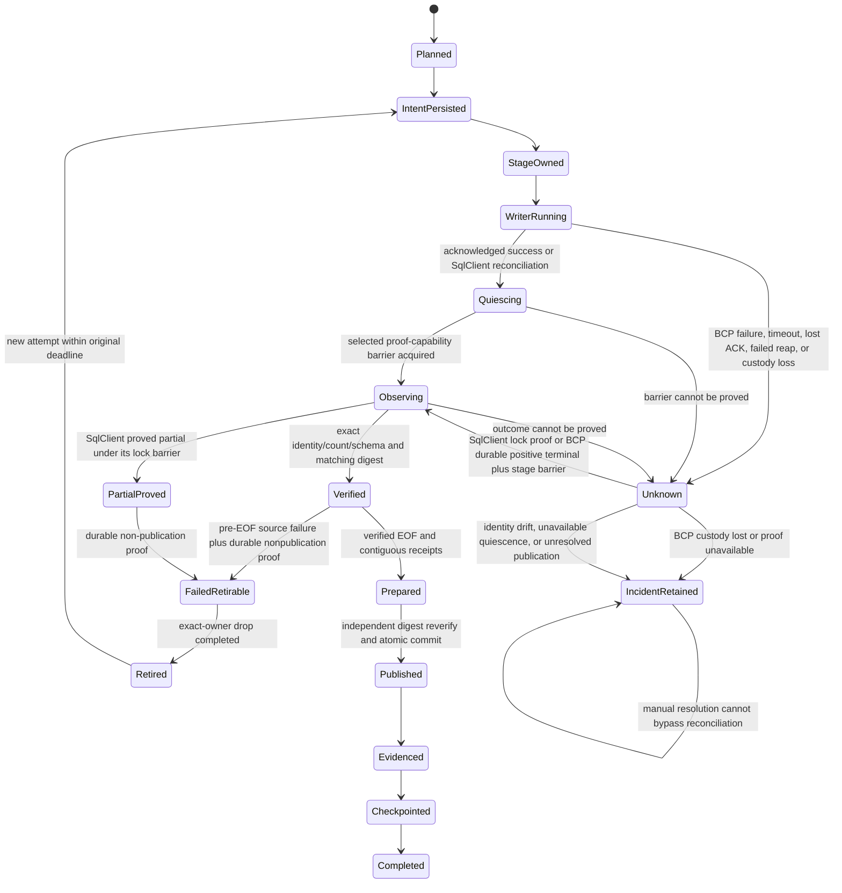
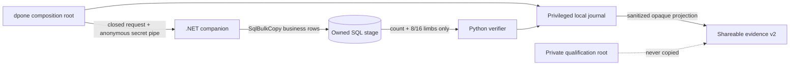

# Feature design: MSSQL target-local verification and SqlClient bulk transport v2

- Status: RESEARCHED — P1 BCP proof amendment approval required
- Owner: dpone maintainers
- Issue: TBD
- Target release: phased minor releases after 0.83.23
- Last verified: 2026-09-27

## Executive summary

The bounded ClickHouse-to-MSSQL native route already has deterministic source
scope, sealed chunk files, isolated target stages, durable receipts,
source-free recovery after EOF, and atomic publication. Its successful path is
still too expensive for large windows because SQL Server business rows cross
back to Python several times for canonical re-encoding and digest comparison.
The only implemented bulk writer on the current main line is BCP.

This design removes the reverse business-row transfer from the optimized path
while reproducing the existing probabilistic
`mssql-native-sha256-sum-v1` multiset evidence exactly. Object identity, schema,
row count, and algorithm parity remain exact checks; large-set content equality
remains probabilistic. The design then adds an optional
`Microsoft.Data.SqlClient.SqlBulkCopy` writer behind the current native stage
lifecycle. BCP remains the default. A persisted row hash is a separately gated
optimization only when profiling proves that target-local hash computation is
still material.

The measurable outcome is a bounded, recoverable seven-day delivery whose
confirmed visibility is below 60 minutes, with a target median of 20 minutes or
less, zero business rows returned during mandatory target verification, and one
atomic publication boundary. Production qualification is private and does not
publish endpoint, object, query, credential, row sample, or customer workload
details.

### P1 BCP proof amendment

The original design required the actual bulk-writer SQL session to acquire a
nonce-derived application lock. The released BCP CLI opens its own SQL session
and provides no supported import-session SQL preamble, so the importer cannot
make that claim truthfully. P1 therefore uses a narrower, fail-closed proof for
BCP: one supervised child remains under grant custody; only positively
acknowledged success from a reaped child can enter a transaction-held
`TABLOCKX, HOLDLOCK` stage barrier and target-local verification. Timeout,
cleanup failure, lost acknowledgement, controller loss, or any uncertain child
or server outcome enters `UNKNOWN`. It never authorizes automatic retry, stage
drop, preparation, or publication.

The SqlClient phase retains the stronger same-session nonce-lock contract. The
two proof capabilities have distinct identity bindings and must never be
interpreted as equivalent. This amendment trades automatic recovery after an
ambiguous BCP outcome for a truthful, safe optimized success path; it does not
weaken data correctness or publication authority.

## Personas and customer journey

| Persona | Goal | Current pain | Success signal |
|---|---|---|---|
| Data platform operator | Deliver a bounded ClickHouse window to MSSQL quickly and safely | Verification may repeat the full dataset over TDS | Phase timings identify one bounded write and aggregate-only verification |
| Data architect | Select a faster writer without changing correctness or recovery | The current route exposes only BCP | An explicit optional backend has deterministic capability and identity |
| Incident responder | Resume after a crash or lost acknowledgement without duplicating data | A bulk writer can finish after the caller loses the result | Exact-stage observation classifies complete, partial, or unknown outcome |
| Framework maintainer | Evolve the route without regressing existing manifests | A stale prototype created a parallel lifecycle and journal graph | The new writer uses current 0.83.x contracts and BCP remains compatible |

The operator discovers the capability in the ClickHouse-to-MSSQL route guide,
runs readiness before any source row I/O, installs the optional companion only
when selecting SqlClient, and observes source-read, bulk-write, target-digest,
preparation, publication, and confirmed-visibility timings. Unsupported types,
missing runtime capability, identity drift, and insufficient capacity fail
before extraction. A retry reuses the existing invocation only when the journal
and exact target stage prove that replay is safe. Upgrade preserves all BCP v1
records; rollback selects BCP for a new invocation.

## Scope

### In scope

- Target-local raw and prepared-stage evaluation that reproduces the current
  versioned probabilistic digest and returns only `COUNT_BIG` and fixed-size
  aggregate limbs.
- Removal of business-row readback from the explicitly optimized verification
  path.
- An optional `mssql_sqlclient` writer using `Microsoft.Data.SqlClient` and
  `SqlBulkCopy` with streaming input, explicit column mappings, null
  preservation, bounded memory, and one operation deadline.
- BCP as the unchanged default and compatibility path.
- An opt-in BCP plus target-local P1 path whose positive proof is supervised
  child completion followed by a transaction-held exact-stage barrier.
- Backend-aware durable identity v2 for explicit SqlClient invocations.
- Fail-closed recovery for process failure, timeout, cancellation, lost ACK,
  partial write, target mutation, and unknown commit outcome.
- Synthetic narrow, wide100, and existing wide stress profiles in Docker.
- Private seven-day qualification bound to the exact commit and environment.
- A separately approved persisted-hash layout v2 if profiling meets its
  promotion trigger.

### Non-goals

- Direct unsealed ClickHouse-to-TDS streaming in this delivery.
- CDC, arbitrary queries, unbounded full-table extraction, offset replay, or a
  new publication state machine.
- Changes to dbt, composition activation, Airflow, or Kubernetes contracts.
- Automatic fallback from SqlClient to BCP.
- Publishing private infrastructure, object identities, queries, credentials,
  row samples, or private benchmark receipts.
- Claiming general superiority over other products.

### Assumptions and constraints

- Baseline is exact `v0.83.23` commit
  `54905bce7f93c768e9ff7cc95d6b7067a513cab8`; implementation rebases onto the
  then-current `origin/master` before editing shared files.
- Current `BoundedNativeChunks`, `NativeChunkReceipt`, stage ownership,
  preparation, publication, and checkpoint ordering remain authoritative.
- The first SqlClient capability set is closed and narrower than BCP.
  Version 1 admits only nullable/non-nullable `bigint`, `float(53)`,
  `nvarchar(max)`, and `datetime2(6)`. Unsupported schemas fail before source
  I/O. Type expansion is a later capability version, never silent coercion.
- SqlClient v1 public runtime support is Linux x64 on a glibc-based image with
  .NET 8 LTS. Docker Desktop on macOS is a supported development host through
  that Linux image. Other OS/architecture pairs remain `UNVERIFIED` until their
  packaging, protocol, and live matrix passes.
- Sealed native files remain the replay boundary. Their file and typed digests
  are checked before the writer receives a stage grant.
- Credentials are injected at the composition root and never enter plans,
  receipts, process arguments, logs, or repository artifacts.
- A skipped live test is `UNVERIFIED`, never a pass.

## Public contract

### CLI

The executable admission sequence is:

1. `dpone doctor --profile mssql --format json` checks local Python, ODBC, BCP,
   and installed companion prerequisites without database connections.
2. `dpone plan PATH --selector NAME --format json` validates schema and projects
   backend, verifier, identity version, capability requirements, and blockers
   without opening source or target connections.
3. `dpone check PATH --connections --format json` performs bounded connection
   handshakes and companion protocol negotiation without reading business rows.
4. `dpone check PATH --live --format json` reads catalogs and executes a bounded
   disposable probe; it does not start the authored delivery.
5. `dpone run PATH --selector NAME --format json` executes only after admission
   succeeds again inside the runtime boundary.

Steps 1 and 2 exit `0` on success and `2` for an authored or capability
blocker. Steps 3 through 5 retain the existing command classes: `0` success,
`2` validation/admission failure, and `1` runtime failure. Human output uses
stdout; failures put stable diagnostic codes and remediation on stderr. JSON
mode emits one closed document to stdout. Missing companion
(`mssql_sqlclient.companion_missing`), incompatible protocol
(`mssql_sqlclient.protocol_incompatible`), unsupported type
(`mssql_sqlclient.type_unsupported`), and identity drift
(`mssql_native.identity_mismatch`) fail before ClickHouse business-row I/O.

Recovery adds `dpone ops mssql-native-recovery` with `inspect`, `reconcile`,
`resume`, and `retire` actions. Each requires an opaque invocation ID and
durable journal root. Live actions additionally require `--yes`, a target
connection binding, and the expected identity digest. `inspect` is read-only;
`reconcile` proves quiescence and stage state; `resume` is allowed only after
verified EOF; `retire` drops only an exact owned terminal stage. JSON reports
an opaque stage ID, state, permitted next actions, and diagnostic tokens. An
unknown or mismatched state exits `1` and retains custody. The generic
`dpone resume` command is not extended implicitly.

No release command, automatic installation, or implicit backend switch is
introduced.

`CODE` values below are diagnostic codes, uppercase words are durable states,
the command exit code is separate, and only `permitted_actions` may execute.

| Diagnostic code / state | Required operator action | Success observation | Escalation |
|---|---|---|---|
| `mssql_native.writer_ack_lost` / `UNKNOWN` | Inspect the exact attempt; P1 BCP provides no automatic reconcile-to-write authority after custody loss | Read-only incident record; no retry, drop, preparation, or overlap | Retain custody as `INCIDENT_RETAINED`; SqlClient may use live reconcile only when its same-session lock proof is available |
| `mssql_native.partial_stage_proved` / `FAILED_RETIRABLE` | `dpone ops mssql-native-recovery retire ID --journal-root ROOT --identity-sha256 SHA --connection-id TARGET --connection-type env --yes --format json` | Exact owned stage removed; new attempt permitted if publication exclusion also holds | Stop on any identity drift |
| `mssql_native.verified_eof_recoverable` / `VERIFIED` | `dpone ops mssql-native-recovery resume ID --journal-root ROOT --identity-sha256 SHA --connection-id TARGET --connection-type env --yes --format json` | Preparation/publication continues without source read | Stop if receipt chain is not contiguous |
| `mssql_native.pre_eof_reextract_required` / `FAILED_RETIRABLE` | Retire with the complete command above, then run the full authored interval | New source query and invocation | Never resume the vanished stream |
| `mssql_native.publication_outcome_unknown` / `INCIDENT_RETAINED` | Run the complete `reconcile` command above | Existing publication receipt or proved uncommitted state | Never replay target mutation blindly |
| `mssql_native.identity_mismatch` or `mssql_native.server_not_quiescent` / `INCIDENT_RETAINED` | `dpone ops mssql-native-recovery inspect ID --journal-root ROOT --identity-sha256 SHA --format json` | Read-only incident record | Manual resolution followed by successful reconciliation; no ordinary drop/retry |

### Python API

Add one capability-oriented port with immutable request and receipt contracts:

```python
class NativeStageBulkWriter(Protocol):
    def write(
        self,
        request: NativeStageWriteRequest,
        *,
        deadline: OperationDeadline,
    ) -> NativeStageWriteReceipt: ...
```

The request binds the exact owned stage identity, sealed file identity, native
wire layout, explicit writable columns, and attempt identity. It contains no
credential material. The receipt reports attempt identity, input rows consumed,
writer/runtime identity, completion status, and non-sensitive phase metrics.
It is not a content authority: the existing importer creates
`NativeChunkReceipt` only after independent target-local count and digest
verification.

Existing public BCP imports and `NativeChunkImporter` behavior remain valid.
The companion is distributed as the optional `dpone-mssql-sqlclient` wheel and
selected through the `dpone[mssql-sqlclient]` extra. It contains a
framework-dependent Linux x64 assembly for .NET 8 LTS. Its closed protocol is
`dpone.mssql-sqlclient.ipc.v1`; the wheel minor version must match dpone and
`Microsoft.Data.SqlClient` is constrained to the certified 6.x range.
`dpone doctor --profile mssql` verifies `dotnet --list-runtimes` contains
`Microsoft.NETCore.App 8.x`, prints only version/capability IDs, and gives the
remediation `pip install "dpone[mssql-sqlclient]"`. Upgrade changes companion
identity and cannot resume unfinished v2 work. Removal uses
`pip uninstall dpone-mssql-sqlclient` only after
`dpone ops mssql-native-recovery inspect-all --journal-root ROOT --format json`
reports `retained_custody_count: 0`.

### Manifest/schema

The bounded native execution object gains two optional closed fields. The exact
dotted paths start at
`defaults.source.options.native_transfer.execution` in a batch manifest:

```yaml
native_transfer:
  execution:
    import_backend: bcp  # bcp | mssql_sqlclient
    verification_backend: python_readback  # python_readback | target_local
```

Omission means `bcp` plus `python_readback`, preserving v1. `target_local` is
opt-in for BCP and mandatory for `mssql_sqlclient`. SqlClient has no fallback
chain. Unknown or incompatible values fail schema validation. Either non-default
selector participates in readiness, plan output, durable identity, recovery,
and evidence. Existing v1 BCP journals are neither rewritten nor interpreted
as v2 journals.

The first release exposes no transport-specific tuning knobs. Batch size,
streaming, mappings, and transaction policy are derived from the sealed chunk
and closed capability profile so that the manifest cannot request an unsafe
combination. SqlClient v1 uses `EnableStreaming`, explicit mappings,
`KeepNulls`, `TableLock`, and `UseInternalTransaction`; `FireTriggers`,
`CheckConstraints`, and `KeepIdentity` are absent. Each internal batch may
commit only to the isolated attempt stage. Final target visibility still occurs
once through the existing publication transaction.

### Prerequisites

| Requirement | SqlClient v1 contract | Admission proof |
|---|---|---|
| Platform | Linux x64, glibc-based image | OS/architecture capability ID |
| Runtime | `Microsoft.NETCore.App` 8.x | `dotnet --list-runtimes` through `doctor` |
| SQL Server | SQL Server 2019+ with database compatibility level 150+ | bounded catalog query before source I/O |
| SQL crypto | `HASHBYTES('SHA2_256', varbinary(max))` on the compiled payload | disposable parity probe |
| Permissions | connect; create/drop owned stage; `ALTER` on staging schema; insert/select owned stage; catalog/extended-property read/write; database application locks; existing strategy publication permissions | least-privilege disposable preflight |

A successful doctor JSON includes
`{"status":"ready","capability_id":"mssql_sqlclient_v1","protocol":"dpone.mssql-sqlclient.ipc.v1"}`.
A missing runtime returns exit `2` and
`{"status":"blocked","blockers":["mssql_sqlclient.dotnet8_missing"]}`.
Connection and permission blockers are emitted only by `check --connections` or
`check --live`, never by credential-free doctor/plan.

### Artifacts and evidence

Legacy BCP v1 evidence stays byte-identical. Optimized invocations write an
atomically replaced UTF-8 `dpone.mssql-native-delivery-evidence.v2` JSON
sidecar. Its closed schema requires:

- `import_backend`: `bcp` or `mssql_sqlclient`;
- `backend_identity_sha256` and `wire_identity_sha256`;
- `source_read_seconds`, `bulk_write_seconds`, `target_digest_seconds`,
  `preparation_seconds`, `publication_seconds`, and
  `confirmed_visibility_seconds`;
- `business_rows_read_back`, which must be zero for the optimized route;
- `bcp_process_count`, which must be zero for SqlClient certification;
- retry, unknown-outcome, and reconciliation classifications;
- exact commit, package version, dirty flag, and allowlisted environment digest.

All timing values are non-negative decimal seconds from one monotonic clock.
`confirmed_visibility_seconds` spans runtime admission start through the first
successful post-commit visibility observation. Overlapping spans are stored
independently and never summed to derive a total. Missing values are `null` and
make the applicable performance decision `UNVERIFIED`.

The strict public scanner covers shareable JSON/Markdown/log/JUnit artifacts,
their producer stdout/stderr, and private qualification exports. It validates
the closed schema, recursively scans keys and strings, then scans serialized
bytes against forbidden names and in-memory secret/endpoint needles.
Privileged local journals and recovery streams have a separate secret scanner:
they may contain exact object coordinates but never credentials or raw vendor
exceptions. Diagnostics are closed tokens. Exact private counts and timings do
not enter public summaries. Partition/object identities in private exports are
opaque keyed digests; the key is external and is never retained with the
export.

The final public gate scans `git diff --binary APPROVED_BASE...HEAD`, every
tracked file added or changed in that range, untracked files below public
artifact roots, and every generated JSON/Markdown/log/JUnit/stdout/stderr
artifact. A staged diff is insufficient. Any forbidden match is `FAIL`.

The environment digest is domain-separated over allowlisted architecture,
runtime/package/driver versions, capability IDs, and package digests. It
excludes hosts, paths, endpoints, environment variables, and
credential-derived values. Private receipts use an external root outside the
checkout and are not copied into Git, CI artifacts, PRs, or public docs.

The sidecar lives below the configured evidence root at an opaque
invocation-relative path. The immutable payload filename is its SHA-256; an
atomic pointer selects the current revision. Equal content is idempotent and
unequal content creates a new revision, never overwriting history or v1
evidence. The producer creates parents with existing artifact permissions,
writes a same-directory temporary file, fsyncs it, and atomically renames it.

Generated schemas are
`dpone.mssql-native-admission.v2.schema.json`,
`dpone.mssql-native-recovery.v2.schema.json`, and
`dpone.mssql-native-delivery-evidence.v2.schema.json`. Admission requires
`schema_version`, `kind`, `status`, `import_backend`,
`verification_backend`, `identity_version`, `capability_id`, `blockers`, and
`warnings`. Recovery requires `schema_version`, `kind`, opaque
`invocation_id`, `identity_sha256`, durable `state`, namespaced
`diagnostic_code`, `permitted_actions`, and content-addressed `artifact_refs`.
Evidence requires the fields enumerated above under versioned `subject`,
`backend`, `timings`, `resources`, `correctness`, `recovery`, `privacy`, and
`status` objects. Identifiers/digests are strings, facts are booleans, counts
are non-negative integers, seconds/bytes are non-negative JSON numbers or
`null`, and state/status/action fields are closed enums. Unknown fields are
rejected. Docs contain complete success, blocked, and unknown examples validated
against these schemas.

### Compatibility and migration

- Old manifests select BCP plus Python readback and produce the same v1
  plan/journal/evidence bytes.
- Explicit target-local verification or SqlClient uses identity/journal v2. A
  v1 record cannot resume v2, and either selector change requires a new
  invocation.
- No automatic migration rewrites durable records.
- Operators can roll back by starting a new BCP invocation only when stable
  target custody is clear. Any in-flight v2 invocation must first reach a
  proved terminal or recoverable state that authorizes custody release.

Journal v2 uses key prefix `mssql-native-chunks-v2/`. Its canonical identity
contains the six unchanged v1 `NativeChunkPlan` fields plus `import_backend`,
`verification_backend`, `writer_proof_capability`, companion protocol and package digests,
capability-layout digest, digest algorithm ID, and timeout-policy digest. The
monotonic deadline is process-local and never serialized. Journal v1 decodes
only as BCP plus Python readback. Existing `NativeChunkReceipt` and prepared
snapshot shapes remain unchanged.

The invocation key is lowercase SHA-256 of RFC 8785 canonical JSON for that
identity. Each attempt begins by persisting a 256-bit random nonce; `attempt_id`
is SHA-256 of canonical `[invocation_key, ordinal, nonce]`. The writer grant
contains a fresh 256-bit token and a closed proof-capability identifier; only
the token digest is durable. For SqlClient, the application-lock resource is
derived from that digest. For BCP P1, the digest binds one supervised launch
and must not be described as a SQL-session token.
The closed initial proof-capability values are
`bcp-supervised-stage-barrier-v1` and `sqlclient-session-applock-v1`.
The only admitted pairs are BCP plus the former and SqlClient plus the latter;
every other pair fails before source I/O. The capability string is an explicit
field in the canonical invocation-identity JSON and therefore changes its
SHA-256 key.

Journal identity alone cannot prevent a new backend or invocation from ignoring
unresolved custody. A second durable CAS authority uses the stable key
`mssql-native-target-custody-v1/{sha256(target_id)}` in the existing
`WindowStore`; the key excludes run, window, backend, and verifier identity.
Every native runtime, including default v1, checks this authority after target
lease acquisition and before source or writer I/O. A v2 invocation claims it
with its invocation digest before any v2 durable side effect or source I/O;
all of its chunk attempts share that invocation-owned custody. A crash between
claim and the first launch remains conservatively held. It is released only
after the matching invocation has durable publication success and cleanup, or after durable
non-publication proof plus retirement of every owned stage. Lease expiry never
clears it. A matching source-free recovery may inspect or complete already
authorized work but cannot grant a second launch. Current binaries enforce this
guard; older binaries do not understand the key and must be operationally
excluded from targets with any v2 custody record.
The authority payload is closed JSON with `schema_version=1`,
`kind="dpone.mssql-native-target-custody"`, `target_id_sha256`, monotonically
increasing positive `epoch`, `state` (`clear` or `held`), nullable
`holder_invocation_key`, nullable positive `holder_lease_fence`, and a closed
nullable `release_reason`. In `held`, holder and fence are required and
`release_reason` is null. In `clear`, holder and fence are null and
`release_reason` is one of `published_cleanup`,
`nonpublication_all_stages_retired`, or `empty_completion_cleanup`.
`clear -> held` increments `epoch`; `held -> clear` preserves it. Both use `WindowStore.save`
CAS under the current target lease. A held record may be read by matching
recovery but cannot be overwritten by lease replacement, backend change, or a
new run ID. A changed lease fence makes the matching invocation recovery-only:
it may inspect, verify already durable positive terminal authority, retire
proved stages, or finish source-free publication, but it cannot create a new
attempt or writer grant. No deletion or TTL-based release exists.

Writer state is an append-only chain below
`mssql-native-chunks-v2/{invocation_key}/{ordinal:020d}/{attempt_id}/`.
Each UTF-8 canonical JSON event has exactly `schema_version`, `kind`,
`invocation_key`, `ordinal`, `attempt_id`, `sequence`, `previous_sha256`,
`event`, `stage_binding`, `artifact_binding`, `writer_binding`, `observation`,
and `created_at`. Bindings are closed objects containing only opaque IDs,
digests, counts, and bytes; no credentials or coordinates. Allowed events are
`INTENT`, `STAGE_OWNED`, `GRANTED`, `WRITING`, `WRITER_TERMINAL`, `QUIESCENT`,
`VERIFIED`, `PARTIAL_PROVED`, `UNKNOWN`, `FAILED_RETIRABLE`,
`INCIDENT_RETAINED`, and `RETIRED`. The mandatory generated
`dpone.mssql-native-writer-state.v2.schema.json` closes the nested objects:

- `artifact_binding` is required from `INTENT`: ordinal, row count, encoded
  bytes, file SHA-256, and typed digest;
- `stage_binding` is `null` for `INTENT` and thereafter requires opaque stage
  ID, owner-binding SHA-256, positive SQL object ID, and schema SHA-256;
- `writer_binding` is `null` before `GRANTED` and thereafter requires import
  backend, proof-capability ID, protocol/package/capability SHA-256 values,
  grant-token SHA-256, and timeout-policy SHA-256;
- `observation` is `null` through `WRITING`. Later events require writer outcome
  (`success`, `failure`, `timeout`, `lost_ack`, or `custody_lost`), nullable non-negative input
  rows consumed, nullable count/sentinel, nullable overflow flag, either `null`
  or exactly eight non-negative decimal limb strings, quiescence (`unverified`,
  `proved`, or `failed`), and a namespaced diagnostic code.

`sequence` is non-negative; `previous_sha256` is `null` only at sequence zero;
`created_at` is UTC RFC 3339. Event-conditional required/null rules and
`additionalProperties: false` apply at every level. Events must be contiguous,
hash-linked,
idempotent by content, and follow the state machine. Unknown fields, missing
links, duplicate sequence with unequal bytes, or invalid transitions retain
custody and block replay. Recovery reconstructs state only from this chain and
the unchanged receipt/publication authorities.

The normal chain is `INTENT -> STAGE_OWNED -> GRANTED -> WRITING ->
WRITER_TERMINAL -> QUIESCENT -> VERIFIED`. Any state after `GRANTED` may enter
`UNKNOWN`; only reconciliation may append `QUIESCENT`, `PARTIAL_PROVED`, or
`INCIDENT_RETAINED`. `PARTIAL_PROVED` may enter `FAILED_RETIRABLE` after
non-publication proof. Only `FAILED_RETIRABLE` may enter `RETIRED`.
`INCIDENT_RETAINED` has no ordinary destructive transition. Receipt creation
requires terminal `VERIFIED` plus matching artifact and stage bindings.
For `bcp-supervised-stage-barrier-v1`, `UNKNOWN -> QUIESCENT` is allowed only
when the durable chain already contains positive acknowledged-and-reaped
`WRITER_TERMINAL(success)` and the new observation-only recovery acquires the
exact-stage barrier. BCP lost ACK, failed reap, uncertain launch, or custody
loss may append only `INCIDENT_RETAINED`; current stage contents cannot replace
missing writer authority. BCP never enters `PARTIAL_PROVED`. Recovery-only
journal access exposes this closed observation operation but still forbids a
new attempt, grant, launch, source resume, EOF promotion, or publication.
If the source fails before EOF after one or more BCP chunks reached `VERIFIED`,
an invocation-level durable proof that no preparation/publication intent exists
may move those verified stages to `FAILED_RETIRABLE` and then `RETIRED` by exact
owner identity. This retirement path applies only to fully writer-proved
`VERIFIED` stages; any `UNKNOWN` attempt keeps target custody held.

Compatibility is fail-closed. SqlClient plus a missing/old companion blocks
before extraction. Old dpone rejects unknown manifest fields and cannot decode
the v2 keyspace. Protocol mismatch blocks. Unfinished v2 state cannot be
downgraded. No overlapping rollback invocation may start until the prior v2
publication state is proved non-publishing, published, terminal-retirable, or
reconciled to another proved terminal state. `INCIDENT_RETAINED` never
authorizes overlap. Retained raw stages may coexist
only after non-publication is proved and remain excluded from new identity.
P1 verifier rollback starts a new `python_readback` invocation only after the
old attempt has proved non-publication and reached an allowed terminal state;
an unresolved BCP `UNKNOWN` never authorizes overlap. P2 writer
rollback then starts a new BCP invocation. Older binaries preserve but never
interpret v2 records.

## Detailed algorithm

1. Parse the existing bounded route, import backend, and verification backend;
   validate the complete closed object before connector row I/O.
2. Resolve backend capability at the composition root. For SqlClient, require
   the optional companion, exact protocol version, supported runtime/driver,
   and a fully supported source-to-target type layout.
3. Freeze the existing window, schema, wire contract, chunk limits, target,
   writer identity, digest algorithm, timeout policy, and identity version into
   the plan. Create one monotonic deadline for each attempt at the composition
   root; a retry gets a new bounded attempt budget but never extends the
   process-local invocation deadline. After process restart, automatic retry is
   forbidden. Reconciliation runs under a new bounded recovery deadline; any
   further write requires operator authorization and a new attempt identity.
   After acquiring the target lease, check stable target custody. A target-local
   v2 invocation CAS-claims it before source I/O; a matching source-free
   recovery reuses it, while every different v1/v2 invocation stops.
4. Reuse the current single ClickHouse query and bounded encoder pipeline.
   Each immutable native file is fsynced and sealed with file SHA, row count,
   encoded byte count, and typed multiset digest.
5. Persist the existing attempt intent and create an isolated owned raw stage.
   Re-read catalog identity, ownership, writable column order, and capacity.
6. Grant exactly that stage and sealed file to the selected writer. For
   SqlClient, stream native rows through a bounded `DbDataReader` into
   `SqlBulkCopy` with explicit mappings, `KeepNulls`, approved table locking,
   no triggers, and timeout derived from the remaining operation deadline.
   Before persisting `GRANTED`, reassert that stable target custody still names
   the same invocation. Any drift stops before writer I/O.
7. Apply the selected closed proof capability.
   - For P1 BCP, persist `GRANTED`, then persist `WRITING` before exactly one
     supervised launch may occur. Retain the child handle under that grant.
     `WRITER_TERMINAL(success)` requires acknowledged BCP success, positive
     child reaping, exact vendor count, empty reject output, and unchanged
     sealed-file identity. Timeout, cleanup failure, lost acknowledgement,
     controller/custody loss, or ambiguous launch yields `UNKNOWN`; digest,
     drop, preparation, automatic retry, and overlapping invocation are
     forbidden. After positive success, a verification transaction acquires
     `TABLOCKX, HOLDLOCK` on the exact owned stage, repeats object/owner/schema
     identity, and performs verification while the barrier is held. This is a
     successful-process-plus-stage-barrier proof, not a writer-session lock.
   - For SqlClient, the companion acquires a session-owned exclusive
     application lock derived from the opaque grant token before bulk copy and
     holds it until connection disposal. The verification transaction acquires
     that same lock and the exact-stage barrier. Acquiring both proves the
     writer session is gone and rollback/stage locks have drained.
   Any barrier timeout, rollback still in progress, or unavailable proof yields
   `UNKNOWN` and retains custody.
8. While holding that barrier, verify current object ID, owner binding, schema,
   row count, and target-local typed digest, then repeat the identity check
   before releasing it. Scan at most `expected_rows + 1`: the aggregate reports
   exact count when it is at most expected and otherwise reports
   `count_overflow=true` plus the `expected_rows + 1` sentinel. An overflow can
   never verify. Return the count/sentinel plus eight `decimal(38,0)` limb
   sums ordered most-significant to least-significant. Compute each row hash
   once behind a bounded optimizer barrier; the raw result has ten values:
   count/sentinel, overflow flag, and eight limbs.
   Python validates result shape and bounds, propagates carries, and reduces the
   sum modulo 2^256 before calling the existing `native_multiset_digest`. The
   prepared result returns count/sentinel, overflow flag, and two eight-limb
   sets: 18 values total.
9. Construct the existing `NativeChunkReceipt` only when count, sealed-file
   digest, stage identity, and target-local digest agree. Complete or partial
   observations never manufacture a receipt.
10. After verified EOF and contiguous receipts, build the existing prepared
   stage. Compute both business and full prepared digests inside SQL Server and
   return aggregate rows only. Compare the business digest to raw receipts and
   retain the full digest for later independent prepublication verification.
11. Reverify ownership, raw receipts, prepared count, schema, and full digest at
    the existing boundary. Perform the existing single atomic publication.
12. Persist publication receipt, evidence, checkpoint, and cleanup in the
    existing order. Source-free resume remains available only after verified
    EOF; failures before EOF require re-extraction.

The SQL digest implementation must reproduce the existing encoder bytes for
every admitted layout, hash each row with SHA-256, and use the aggregate
contract above. SQL text and projected column count are bounded before
execution; the target work bound is `expected_rows + 1`. The minimum admitted
SQL Server version must support `HASHBYTES` over the compiled `varbinary(max)`
payload and is checked before source I/O. Differential tests are the authority;
SQL collation, implicit conversion, and row order must not affect the result.

P1 never broadens or guesses the route surface. A generated
`TargetLocalLayoutMatrixV1` is the intersection of the current planner,
ClickHouse source, encoder, importer, and live-certified layout registries.
Current importer exclusions such as `char`/`varchar` without UTF-8 collation
authority remain excluded. Wire-only `binary`/`varbinary` capability does not
enter the optimized route until the route registry has live proof. Prepared
verification separately covers all admitted mapped business types plus
framework types `varchar(26)`, `varchar(32)`, `varchar(64)`, `nvarchar(max)`,
`int`, and `datetime2(7)`. Any layout absent from the generated matrix makes
readiness reject `target_local`; default BCP continues Python readback without
narrowing. The matrix artifact binds the exact commit and capability digest.

### Pseudocode

```text
plan = admit_and_freeze(config, backend_capability)
if not journal_identity_is_compatible(plan):
    stop_before_source_with_identity_mismatch()
claim_or_resume_invocation_target_custody_before_source(plan)

for sealed_file in bounded_encode(single_source_query(plan)):
    intent = journal.begin_attempt(plan, sealed_file.identity)
    stage = create_owned_raw_stage(intent)
    grant = revalidate_and_grant(stage, sealed_file, plan)
    assert_invocation_target_custody_before_granted(grant)
    deadline = attempt_deadline(plan.timeout_policy, invocation_deadline)
    outcome = writer(plan.backend).write_once_under_custody(grant, deadline)

    if grant.proof_capability == "bcp-supervised-stage-barrier-v1":
        if not outcome.acknowledged_success_and_reaped:
            append(UNKNOWN)
            stop_and_retain_without_retry_drop_prepare_publish_or_overlap()
        if (
            outcome.vendor_rows != sealed_file.rows
            or not outcome.reject_output_is_empty
            or not sealed_file.identity_is_unchanged()
        ):
            append(UNKNOWN)
            stop_and_retain_without_retry_drop_prepare_publish_or_overlap()
        barrier = acquire_exact_stage_transaction_barrier(stage)
    else:
        barrier = acquire_sqlclient_session_and_stage_barrier(
            stage, grant.grant_token
        )
    if not barrier.proved:
        preserve_custody_and_fail_unknown_outcome()
    observation = observe_exact_stage_under_barrier(stage)
    if observation.count_digest_schema == sealed_file.authority:
        receipt = create_native_chunk_receipt(observation, sealed_file)
        journal.commit_receipt(receipt)
    elif (
        grant.proof_capability == "sqlclient-session-applock-v1"
        and observation.proves_partial_or_empty
        and outcome.is_terminal
    ):
        append(PARTIAL_PROVED)
        prove_nonpublication()
        append(FAILED_RETIRABLE)
        drop_exact_owned_stage(stage)
        append(RETIRED)
        retry_with_new_attempt_if_budget_remains()
    else:
        preserve_custody_and_fail_unknown_outcome()

stage_complete = close_only_after_eof_and_contiguous_receipts()
prepared = prepare_existing_union(stage_complete)
business_digest, full_digest = target_local_prepared_digests(prepared)
expected_total = sum(receipt.consumed_part_evidence.native_typed_sum) mod 2^256
expected_digest = native_multiset_digest(stage_complete.rows, expected_total)
if business_digest != expected_digest:
    stop_and_retain_without_publication("mssql_native.prepared_digest_mismatch")
reverify_full_digest_at_publication_boundary(full_digest)
publication_receipt = publish_once_atomically(prepared)
persist_evidence_then_checkpoint_then_retire(publication_receipt)
```

Every `stop_*` and `preserve_*_unknown_outcome` operation above is
non-returning. It durably records the closed diagnostic before raising; no
barrier, digest, receipt, retry, drop, preparation, publication, or overlapping
invocation follows it. These are runtime validations, never Python `assert`
statements.

### State machine



### Edge cases

- Empty input still holds invocation-level target custody but produces no sealed
  chunk and therefore no writer attempt or fabricated writer event. EOF closes
  under the existing verified zero-row authority and empty-window strategy;
  successful no-op completion and cleanup release custody.
- NULL and empty values remain distinct. Unicode, embedded NUL, binary,
  decimals, floats, and temporal boundaries require SQL/Python byte parity.
- Duplicates contribute independently to the multiset sum; row order is
  irrelevant.
- A timeout or cancellation does not create a fresh phase budget. BCP timeout,
  failed reap, lost ACK, controller loss, or uncertain launch remains
  `UNKNOWN`/`INCIDENT_RETAINED`; it cannot enter stage classification.
- SqlClient may reconcile a lost ACK from the exact stage only through its
  same-session lock proof. Blind replay is prohibited for every backend.
- A crash after durable `GRANTED` or `WRITING` but before a positive terminal
  event is an uncertain BCP launch. Restart may inspect and retain it but must
  not launch a second child or append success authority.
- A barrier failure after durable acknowledged-and-reaped BCP success may be
  retried as observation-only recovery. It may append `QUIESCENT` only after the
  exact-stage barrier succeeds; no writer launch or partial-stage retirement is
  permitted.
- Schema, owner, computed definition, object ID, or digest drift blocks
  publication.
- Unsupported types or missing capability fail before ClickHouse row I/O.
- Failure or process loss before source EOF always requires a new full
  extraction. Observation may classify and clean the exact attempt, but even a
  complete chunk cannot resume a vanished ClickHouse stream. Failure after
  verified EOF may resume from target receipts without reading the source.
- A lost publication ACK follows the existing receipt-first unknown-commit
  recovery; it never repeats target mutation speculatively.

## Architecture

### Components and responsibilities

| Component | Existing/new | Responsibility | Dependencies |
|---|---|---|---|
| `BoundedNativeChunks` | Existing | Bound extraction, encoding, retained work, retries, and EOF | Contracts and importer port |
| `MssqlNativeChunkImporter` | Adapted | Own stage, grant writer, verify exact identity/count/schema and matching versioned digest | Bulk writer and target digest ports |
| `NativeStageBulkWriter` | New port | Write one sealed input into one exact owned stage | Immutable contracts only |
| BCP writer adapter | Adapted | Preserve current default process behavior | Existing `BcpRunner` |
| SqlClient writer adapter | New optional adapter | Launch and supervise the companion without secrets in argv/logs | Launcher, credential projection, deadline |
| .NET SqlClient companion | New optional package | Decode native wire and stream `DbDataReader` to `SqlBulkCopy` | `Microsoft.Data.SqlClient` |
| Target-local digest service | New runtime service | Return exact count and matching probabilistic digest aggregates without business rows | Connector query capability |
| Stage preparer/finalizer | Existing/adapted | Use aggregate digest and existing atomic publication | Existing receipts and strategy |
| Composition root | Adapted | Select and inject explicit backend and capability | Manifest and installed adapters |

### Ports, adapters, and composition root

Domain/runtime code depends on immutable contracts and the one bulk-writer
port. Vendor SDK imports remain inside the optional companion package. The app
composition root resolves the manifest selector, credentials, clock, launcher,
and declared capabilities. Importing dpone or rendering CLI help does not import
or probe .NET.

The target digest is a separate capability because it applies to both BCP and
SqlClient. This lets the first patch remove reverse readback for explicitly
admitted layouts while leaving the writer unchanged. It also prevents transport
success from serving as content evidence.

### Data and control flow

```mermaid
flowchart LR
    CH[One bounded ClickHouse query] --> ENC[Bounded native encoder]
    ENC --> FILE[Sealed native file]
    FILE --> GRANT[Exact owned-stage grant]
    GRANT --> BCP[BCP writer]
    GRANT --> SQLC[SqlBulkCopy writer]
    BCP --> RAW[Raw attempt stage]
    SQLC --> RAW
    RAW --> DIGEST[Target-local count and matching versioned digest]
    DIGEST --> RECEIPT[Existing chunk receipt]
    RECEIPT --> PREP[Existing prepared stage]
    PREP --> PDIGEST[Business and full aggregate digests]
    PDIGEST --> PUB[Existing atomic publication]
    PUB --> EVIDENCE[Evidence then checkpoint]
```





### Alternatives and tradeoffs

| Alternative | Advantages | Disadvantages | Decision |
|---|---|---|---|
| Rebase or cherry-pick the old broad TDS prototype | Reuses extensive code | Conflicts with current 0.83.x lifecycle, hundreds of files, and current ADR numbering | Reject |
| Replace the whole importer and publication graph | Maximum freedom | Duplicates mature authority, recovery, and evidence contracts | Reject |
| Add a small SqlBulkCopy writer under the current importer | Reuses tested lifecycle and limits blast radius | Sealed-file pass remains | Adopt |
| Direct ClickHouse-to-TDS stream | Removes file pass and can lower latency | Changes replay, custody, and source-free recovery | Defer to a separate design after v2 evidence |
| Persisted computed row hashes immediately | Makes repeated digest aggregation cheaper | Changes physical identity and write layout before bottleneck proof | Conditional phase only |
| Return all rows to Python for verification | Reuses canonical encoder and full BCP type surface | Adds full reverse transport and repeated CPU work | Preserve as v1 default; remove from admitted optimized path |

### ADR requirement

A new ADR is required. It records explicit backend selection, BCP default,
identity/journal v2, sealed-file custody, unknown-outcome recovery, and the
single-writer-port boundary. The next free ADR number must be allocated from the
current index at implementation time. Persisted raw-stage layout v2 requires a
separate ADR or a clearly scoped amendment after its profiling gate.

### Quality-budget impact

New modules are split by stable responsibility: immutable contracts, writer
port, SqlClient launcher adapter, target-local digest compiler, and composition.
No module may exceed the current `max_sloc: 400`; existing debt may not grow.
The optional adapter must not add vendor edges to base import/help paths. The
implementation runs module-size, import-rule, and layer-metric checks against
the current baselines.

## Market comparison

Facts below were checked from official primary documentation on 2026-09-27.

| System/version | Relevant capability | Observed design | Strength | Limitation | Adopt/reject | Source/date |
|---|---|---|---|---|---|---|
| dlt 1.30 | MSSQL loading | Insert-values default; optional ADBC/Parquet path; staging-optimized replace uses transactional schema transfer | Capability-based faster path and atomic replace | Its documented type limits and transaction/file model are not dpone's native-wire recovery proof | Adopt explicit capability; reject equivalence claims | [dlt MSSQL](https://dlthub.com/docs/dlt-ecosystem/destinations/mssql), 2026-09-27 |
| Informatica | Managed bulk integration | N/A for this narrow open-source connector adapter decision | N/A | Managed product layer is outside the selected writer-boundary axis | N/A | No source consulted; excluded from evidence, 2026-09-27 |
| Airbyte | Connector-based replication | N/A for SQL Server native-wire digest and bounded publication | N/A | Different route contract | N/A: compare only with a future reproducible MSSQL benchmark | No source consulted; excluded from evidence, 2026-09-27 |
| Fivetran | Managed incremental replication | N/A for user-operated bulk writer and recovery journal | N/A | Managed service is outside this implementation axis | N/A | No source consulted; excluded from evidence, 2026-09-27 |
| Pentaho | Bulk-load ETL | N/A for the current dpone route contract | N/A | No comparable digest/recovery contract was evaluated | N/A | No source consulted; excluded from evidence, 2026-09-27 |
| Microsoft SSIS / SQL Server 2022+ | OLE DB fast load | Supports table lock, keep-null, constraint, rows-per-batch, and maximum commit-size controls | Mature SQL Server bulk-load controls | Batch commit choices can expose partial progress and do not provide dpone receipts | Adopt explicit mappings/nulls/lock and bounded batches; retain dpone authority | [Microsoft OLE DB destination](https://learn.microsoft.com/en-us/sql/integration-services/data-flow/ole-db-destination?view=sql-server-ver17), 2026-09-27 |
| Microsoft.Data.SqlClient 6.x | Native SQL Server bulk copy | `SqlBulkCopy` exposes streaming, batch size, timeout, mappings, rows copied, and transaction choices | Direct supported TDS bulk path | Writer completion alone is not end-to-end content proof | Adopt as optional writer with independent digest | [SqlBulkCopy API](https://learn.microsoft.com/en-us/dotnet/api/microsoft.data.sqlclient.sqlbulkcopy?view=sqlclient-dotnet-core-6.0), 2026-09-27 |
| gusty | DAG authoring | N/A | N/A | Does not implement this data-plane writer | N/A | No source consulted; excluded from evidence, 2026-09-27 |
| Astronomer Cosmos | dbt orchestration | N/A | N/A | Does not implement this data-plane writer | N/A | No source consulted; excluded from evidence, 2026-09-27 |
| Apache Beam | Distributed data processing | N/A for a first SqlBulkCopy adapter | N/A | A Beam runtime would be a different architecture | N/A | No source consulted; excluded from evidence, 2026-09-27 |

## Measurable differentiation

```yaml
axis: confirmed visibility latency with recoverable versioned verification
scenario: fixed UTC half-open seven-day window partition-pruned by technical load time
baseline: current released bounded native BCP route on the same commit-compatible environment
metric:
  - confirmed_visibility_seconds
  - business_rows_read_back
  - rows_per_second
  - peak_rss_bytes
  - recovery_matrix_status
target:
  hard_fail_at_or_above_seconds: 3600
  median_at_or_below_seconds: 1200
  worst_of_three_at_or_below_seconds: 2700
  p90_at_or_below_seconds: 2700
  p90_minimum_measured_runs: 10
  business_rows_read_back: 0
  atomic_visibility_boundaries: 1
procedure: one warmup plus at least three measured runs per unchanged commit, environment, schema, configuration, and source authority; correctness and recovery gates precede performance
artifact: private versioned qualification receipt outside the repository; synthetic public receipts contain no private identities
limitations: establishes only the measured bounded route and workload; it is not a universal product ranking
```

Candidate median should additionally be no more than half the released BCP
baseline median on the same environment. This ratio is advisory until both
receipts bind the same environment/workload digest; the absolute gates remain
mandatory.

## Security, privacy, and operations

- Credentials are provided to the child over an inherited anonymous pipe after
  process creation. The payload is length-bounded, never placed in argv or the
  environment, read once, zeroed where the runtime permits, and both pipe ends
  are closed before result emission. No credential file is created. Credentials
  never enter plans, receipts, logs, or tracebacks.
- A grant is issued only after revalidating exact database-independent target
  identity, object ID, owner binding, schema/layout digest, attempt, and sealed
  artifact identity. Connection values are not part of public identity.
- The companion has one job, one bounded reader, one destination, and one
  absolute deadline. It emits a closed protocol with size limits.
- `FireTriggers` is disabled. Computed/service columns are excluded from
  writable mappings. `KeepNulls` is required. Table locking is used only after
  capacity and ownership checks.
- Local privileged operational records may contain exact database object
  coordinates needed for recovery and are protected by the existing journal
  permissions. Shareable evidence contains only opaque invocation/stage IDs and
  digests. Sanitization occurs when the sidecar is produced; it does not erase
  the local recovery authority.
- Operational metrics include phase latency, throughput, peak RSS, allocated
  and log bytes, retry count, aggregate verification rows, and outcome class.
- Alerts fire on unknown outcome, capacity stop, digest drift, source-authority drift,
  deadline exhaustion, and evidence/checkpoint failure.
- Shareable and private-export certification artifacts forbid host, port,
  login, database, schema, table, query text, connection string, row samples,
  absolute paths, and vendor exception text. Privileged recovery records may
  retain exact object coordinates under their separate access policy.

## Test and certification plan

| Layer | Scenario | Environment | Expected artifact |
|---|---|---|---|
| Unit | SQL/Python canonical bytes and 256-bit limb/carry parity for every allowed raw/prepared type, NULL, empty, duplicates, reorder, and extrema | Hermetic | Differential report |
| Unit | Streaming native decoder, mappings, timeout/cancel, malformed protocol, bounded buffering | .NET/Python hermetic | Test report |
| Contract | Omitted selector remains BCP; explicit SqlClient has no fallback; v1/v2 journal separation | Hermetic | Contract tests |
| Contract | Evidence rejects secrets, endpoints, object/query identities, absolute paths, and raw exceptions | Hermetic | Privacy-lint report |
| Integration | Partial write, lost ACK, worker crash, deadline, digest/schema mutation, EOF boundaries, unknown commit | Mocked target/process | Recovery matrix |
| Docker live | Real SqlBulkCopy narrow 10k/1m and versioned wide100 10k/1m; existing 200-column profile remains stress coverage | Local Docker Desktop | Versioned synthetic receipt |
| Docker live | Force-kill real SqlBulkCopy during a batch and during commit; prove app-lock/table-lock barrier waits for rollback, repeated digest stability, `UNKNOWN` retention, and no premature drop/retry/prepare | Local Docker Desktop | Quiescence recovery receipt |
| Docker live | Differential SQL/Python parity for every generated admitted raw and prepared layout, nullable/fixed/max framing, precision/scale, collation, and boundary value | Local Docker Desktop | Layout matrix receipt |
| Docker live | Empty interval, duplicates, late change, outside-window invariance, rollback, receipt-first recovery | Local Docker Desktop | Correctness/recovery receipt |
| Performance | Warmup plus three measured narrow and wide100 runs; ten runs before p90 claim | Stable Docker profile | Benchmark receipt |
| Private live certification | Fixed UTC half-open seven-day technical-load window, rerun idempotency, failure injection, exact commit | Approved private environment | External private receipt only |
| Compatibility | Released BCP manifests, plans, journals, examples, and import paths | Hermetic and Docker | Compatibility report |

Small synthetic fixtures additionally compare the complete typed multisets on
both sides and therefore provide exact equality for those finite fixtures.
Large Docker and private workloads use exact identity/schema/count checks plus
the versioned probabilistic multiset digest; their status and documentation
must not label content equality as mathematically exact.

Two wide contracts are generated deterministically from checked-in seeds and
publish schema digests. `wide100-verifier-v1` has exactly 100 business columns
before service columns and cycles through every current BCP scalar, text,
binary, decimal, and temporal family. `wide100-sqlclient-v1` has exactly 100
business columns and deterministically repeats the four SqlClient v1 types.
Both mix nullability, exercise identifier boundaries, and fix byte-size,
null, duplicate, and skew distributions. The existing 200-column profile is an
additional stress case, not a substitute.

Checked-in fixture descriptors are authoritative, not prose-generated at test
time. `narrow-sqlclient-v1` uses seed `20260927`, four business columns in order
(`bigint`, `float(53)`, `nvarchar(max)`, `datetime2(6)`), alternating
nullability where legal, and 10k/1m row sizes. `wide100-sqlclient-v1` uses the
same seed, 25 columns of each SqlClient v1 type, round-robin order, alternating
nullability, and 10k/1m rows. `wide100-verifier-v1` uses seed `20260928`, 100
business columns allocated round-robin across the generated admitted type
families, and 10k/1m rows. Column names exercise lengths 1, 64, 127, and the
current SQL identifier maximum without collision.

Across descriptors, row `i` is NULL in nullable column `j` when
`(i + j) % 11 == 0`; every 13th generated business row duplicates the prior
row; text/binary lengths cycle through `0, 1, 31, 255, 4095, 65535` within the
column and row byte limits; one max-row case occurs every 65536 rows; numeric
and temporal boundary vectors occur every 257 rows; remaining values come from
the named deterministic generator. Each descriptor freezes generator version,
column list, type parameters, distributions, row-byte limit, and expected
schema SHA-256.

Private qualification freezes `[interval_start, interval_end)` in UTC from the
invocation data interval and prunes source partitions by technical load time.
Before and after extraction it records a private source authority consisting of
partition identity, count, and versioned digest. Mutation/merge drift makes
correctness and performance `UNVERIFIED`; that run is excluded from all
statistics. The authority never enters public artifacts.

The performance status function excludes warmup and retains failed/timeout
samples. Any measured run at or above 3600 seconds is `FAIL`. With three valid
runs, median above 1200 seconds or worst above 2700 seconds is `FAIL`. p90 is
computed only with at least ten valid independent runs; otherwise p90 is
`UNVERIFIED`. Missing phase metrics, identity mismatch, source-authority drift,
correctness/recovery failure, partial publication, or ambiguous retry makes the
run `FAIL` when safety is violated and otherwise `UNVERIFIED`. Release
acceptance requires the absolute latency gate, all correctness and recovery
cells, `business_rows_read_back=0`, `bcp_process_count=0` for SqlClient, one
visibility boundary, and complete phase metrics. An unavailable private run
remains `UNVERIFIED`.

## Documentation plan

- Keep the ClickHouse-to-MSSQL overview short: backend choice, first-success
  sequence, and links to focused pages.
- Add focused pages for SqlClient install/verify/upgrade/removal; manifest, CLI,
  evidence and compatibility reference; recovery runbook; architecture/trust
  boundaries; and certification/limitations.
- Update native transport reference with the writer port, aggregate verifier,
  identity v2, process/security boundary, journal/receipt stores, aggregate-only
  return path, and failure reconciliation diagrams.
- Add an operator decision table for every diagnostic token. It gives exact
  `inspect`, `reconcile`, `resume`, or `retire` command, required opaque IDs,
  expected result, cleanup authority, and escalation rule.
- Provide complete schema-valid BCP-v1, BCP-target-local, and SqlClient manifest
  examples plus success, blocked, and unknown-outcome JSON examples.
- Update schema-generated references, source-sink matrix, certification matrix,
  examples, ADR index, and changelog in their owning release phase.
- Keep private benchmark inputs and results outside all documentation.

## Rollout and rollback

Delivery is intentionally phased so each phase is an independently reviewable
patch or minor release:

1. **P1: target-local verification.** Keep BCP plus Python readback as v1
   default. Add explicit `target_local` identity v2, certify full admitted type
   parity plus narrow/wide100 behavior, and remove business-row readback only
   for that optimized path. Rollback may start a new Python-readback invocation
   only after reconciliation proves the prior v2 publication state terminal
   and non-overlapping; evidence and unresolved custody are preserved.
2. **P2: optional SqlClient writer.** Add the companion, explicit selector,
   identity/journal v2, readiness, failure recovery, documentation, and Docker
   certification. BCP remains default.
3. **P3: private production qualification.** Run the exact released candidate
   privately, tune bounded operational values without publishing private data,
   and decide GO/NO-GO from the stated SLO.
4. **P4: conditional persisted hash.** Consider a candidate only when at least
   three identical valid P3 runs show median target digest above 10% of median
   confirmed visibility or above five minutes. Promote only when an A/B
   experiment improves median confirmed visibility, all correctness/recovery
   gates pass, and bulk-write CPU, log bytes, storage, and capacity budgets stay
   within approved bounds. Introduce a new raw-stage layout identity and
   recertify all recovery paths.
5. **P5: direct streaming research.** Consider eliminating sealed files only in
   a separate approved design that replaces their replay and custody proof.

Rollback never mutates an in-flight identity. For P1, disable `target_local`,
preserve its evidence/custody, prove non-overlap at the publication boundary,
and then start a new Python-readback invocation. For P2, disable SqlClient,
reconcile existing attempts to a proved terminal state, prove non-overlap, and
then start a new BCP invocation. Trigger rollback on silent mismatch,
unclassifiable outcome,
credential leakage, unbounded memory, compatibility regression, or missed hard
latency gate after controlled tuning.

## Agent execution plan

One integrator owns shared semantic files and reconciles all agents. Parallel
writers use separate worktrees and task contracts.

| Agent/role | Owned paths | Read-only paths | Forbidden paths | Dependency |
|---|---|---|---|---|
| Explorer | None | Current native execution, tests, docs, old prototype | All writes | None |
| Architect | None | Contracts, journals, recovery, ADRs | All writes | Explorer map |
| Digest implementer | New digest contracts/port/adapter and focused tests | Encoder/importer/preparer | Shared schemas, changelog, indexes | Approved spec and ADR |
| SqlClient companion implementer | Optional companion package and its tests | Native wire corpus and port | Current runtime/shared files | Approved writer protocol |
| Runtime implementer | Importer/composition integration and focused tests | Companion protocol and current lifecycle | Release/shared docs | Digest and writer contracts |
| Test certifier | Synthetic harness and certification tests | All changed code | Production code | Integrated candidate |
| Docs/UX reviewer | Route docs/runbook/examples review | Public contracts and evidence | Production code | Integrated candidate |
| Integrator | Shared schemas, registries, ADR/index, changelog, dependency locks | Entire scoped diff | Unrelated dbt/composition work | All reports |

## Approval checklist

- [x] User problem and CJM are clear.
- [ ] Algorithm and failure semantics passed independent review.
- [ ] Public contracts and compatibility passed independent review.
- [x] Architecture and alternatives are justified.
- [ ] Relevant market research is fully reproducible from official sources.
- [x] Claimed differentiation is measurable.
- [ ] Tests, evidence, docs, rollout, and rollback passed independent review.
- [x] Path ownership and integration plan are conflict-safe.
- [ ] Maintainer changed status to `APPROVED`.
