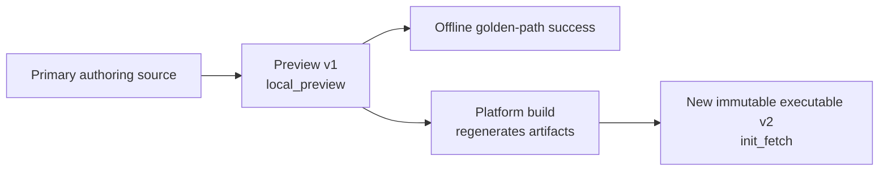

# First Airflow DAG

Create a dpone pipeline, validate it, preview its Airflow DAG, and prove its
behavior without writing Airflow Python or using credentials.

Audience: a data engineer seeing dpone for the first time.

Noun map: [Airflow pipeline glossary](airflow-pipeline-glossary.md).

Start from your route (source → sink). This tutorial uses
**MSSQL → ClickHouse** with incremental merge:

| Built-in recipe | Route | Strategy |
| --- | --- | --- |
| `mssql-to-clickhouse-incremental` | MSSQL → ClickHouse | `incremental_merge` |
| `mssql-to-clickhouse-full-refresh` | MSSQL → ClickHouse | `full_refresh` |
| `postgres-to-clickhouse-incremental` | PostgreSQL → ClickHouse | `incremental_merge` |
| `postgres-to-clickhouse-full-refresh` | PostgreSQL → ClickHouse | `full_refresh` |

All JSON snippets on this page are abridged. Complete contracts are in the
[generated Airflow reference](../reference/airflow-public-contracts.md) and
[GitOps schema catalog](../reference/gitops-schema-catalog.md).

## Golden path commands

Run these commands from an empty repository:

```bash
dpone init project --airflow
dpone init pipeline orders_daily --recipe mssql-to-clickhouse-incremental
dpone check orders_daily
dpone airflow preview orders_daily
dpone test orders_daily
```

Every command should return exit code `0`. The result is a checked,
provider-loadable, deliberately non-runnable local preview plus a passing
credential-free behavior test.

The five-command sequence is the complete successful offline golden path.
The optional live sample is platform-gated and remains outside this sequence.

This path performs no network, database, Airflow metadata, Kubernetes, object
storage, Vault, or secret-store calls.

For a team-owned repository where ownership and tests should be colocated with
each pipeline, use the equally short
[domain-first Airflow journey](domain-first-airflow.md). Existing projects keep
the flat layout shown below unless `layout.mode: domain_first` is selected
explicitly.

## Choose by route

If you know the route but not the recipe name, use the equivalent route-first
command:

```bash
dpone init pipeline orders_daily \
  --route mssql:clickhouse:incremental_merge
```

You can inspect the bounded catalog before choosing:

```bash
dpone recipe list --source mssql --sink clickhouse
dpone recipe show mssql-to-clickhouse-incremental
```

These are discovery helpers, not additional required golden-path steps.

In an interactive terminal, omitting both options opens a bounded picker that
contains only scaffoldable routes. Automation should always pass `--route` or
`--recipe` explicitly.

## Prerequisites

Use Python 3.11 or 3.12 in an isolated authoring environment:

```bash
git clone https://github.com/PaulKov/dpone.git
cd dpone
uv sync
. .venv/bin/activate
dpone --version
```

This source-checkout form makes the route-first commands in this guide
available before their first package release. After that release, installing
the normal `dpone` distribution in an isolated environment is sufficient. Do
not install Airflow, `dpone[full]`, or database drivers in this authoring
environment.

## 1. Initialize the project

```bash
dpone init project --airflow
```

Expected files:

| Path | Owner and purpose |
| --- | --- |
| `dpone.yaml` | Project policy; commit it |
| `dags/dpone.py` | Generated provider loader; commit, do not edit |
| `environments/dev/binding-set.yaml` | Logical connection aliases; no secrets |
| `environments/dev/credential-runtime.yaml` | Non-secret runtime identity |
| `platform/connection-registries/dev.yaml` | Platform-owned connection metadata |

### What to commit after `init project`

Commit all five source/configuration files above. Do not edit the generated
`dags/dpone.py` loader.

Do not commit `.dpone-cache/**`.

The command is idempotent. A repeated run is a no-op unless an existing file
conflicts with the requested scaffold. dpone preserves user content and exposes
the complete change plan and rollback journal with `--format json`.

## 2. Create a pipeline

```bash
dpone init pipeline orders_daily \
  --recipe mssql-to-clickhouse-incremental
```

Expected files:

| Path | Owner and purpose |
| --- | --- |
| `pipelines/orders_daily/pipeline.yaml` | The only editable source for this pipeline |
| `domains/sales.yaml` | Workload and DAG catalog entry |
| `tests/orders_daily.test.yaml` | Hermetic behavior contract |
| `tests/fixtures/orders_daily.input.jsonl` | Credential-free input fixture |

### What to commit after `init pipeline`

Commit `pipelines/`, `domains/`, and `tests/`. Edit only the pipeline source
and intentionally user-owned test/fixture content; do not edit generated
release, deployment, pack, index, or cache files.

The project default enables Airflow for this pipeline. Text output reports:

```text
- airflow: enabled (project)
```

JSON exposes:

```json
{
  "airflow_enabled": true,
  "airflow_source": "project"
}
```

An explicit `--airflow` or `--no-airflow` wins and reports
`airflow_source: explicit`. Without `dpone.yaml`, the legacy non-Airflow
default reports `airflow_source: legacy_default`.

The default authoring source is `dpone.flow.v1`. It compiles to the existing
canonical `dpone.batch.v1` execution contract; it is not a second runtime
engine. A pipeline has exactly one editable authoring mode:

```bash
# Full classic grammar
dpone init pipeline orders_daily \
  --recipe mssql-to-clickhouse-incremental \
  --authoring classic

# Explicit bounded fragments for a larger flow
dpone init pipeline orders_daily \
  --recipe mssql-to-clickhouse-incremental \
  --authoring folder
```

Do not keep classic, flow, and folder sources for the same pipeline. See
[Airflow pipeline authoring](../airflow-authoring.md).

## 3. Check without credentials

```bash
dpone check orders_daily
```

Expected result:

```text
dpone check: OK
- pipeline: orders_daily
- next: dpone airflow preview orders_daily
```

The default check is static and credential-free. Its JSON form also includes
the authoring mode, source and semantic fingerprints, and deprecation notices:

```bash
dpone check orders_daily --format json
```

Connection configuration and bounded live preflight are separate readiness
levels:

```bash
dpone check orders_daily --connections --environment dev
dpone check orders_daily --live --environment dev
```

`--connections` validates non-secret registry wiring. `--live` requires a
configured runtime-side preflight runner and fails closed when none exists.
Neither mode silently turns the default static check into network I/O. See
[Airflow self-service](../airflow-self-service.md).

## 4. Preview the Airflow DAG

```bash
dpone airflow preview orders_daily
```

Expected result:

```text
dpone airflow preview: OK
- pipeline: orders_daily
- next: dpone test orders_daily
```

The command creates an environment-neutral release and a non-runnable preview
deployment under `.dpone-cache`. Airflow reads the same composite index contract
used by platform deployments:

```text
.dpone-cache/current/airflow-index.json
.dpone-cache/current/deployment.json
```

`runnable: false` and `runtime_artifact_delivery.mode: local_preview` are
expected. Preview proves compilation and provider parsing; it does not claim
runtime credentials, Kubernetes delivery, or route certification.

Preview v1 shares the provider loader entry point, current-pointer convention,
and cache layout with production delivery, but it does not share the executable
production schema contract. The platform build regenerates a new immutable
executable v2 release/deployment; never edit or promote preview v1 in place.



The generated `dags/dpone.py` uses:

```python
from airflow.providers.dpone import load_and_acknowledge_dpone_dags

loaded = load_and_acknowledge_dpone_dags(
    globals(),
    index_path="/opt/airflow/.dpone-cache/current/airflow-index.json",
    ack_path="/opt/airflow/.dpone-ack/loader-ack.json",
    ack_root="/opt/airflow/.dpone-ack",
)
if loaded.report.fatal:
    error_code = (
        loaded.report.errors[0].get("code", "DPONE_AIRFLOW_INDEX_INVALID")
        if loaded.report.errors
        else "DPONE_AIRFLOW_INDEX_INVALID"
    )
    raise RuntimeError(
        f"{error_code}: dpone Airflow deployment index could not be loaded"
    )
```

Scheduler image installation, exact compatibility cells, duplicate/invalid DAG
policies, and recovery are documented in
[Formal Airflow provider and lightweight pack reader](../airflow-pack-provider.md)
and [Provider API](../airflow-provider-api.md). They are not extra beginner
steps. The matching scheduler package is the exact published version selected
by the platform release, or the checksum-verified candidate wheel when testing
an unreleased commit. Never combine packages or generated artifacts from
different commits.

For a published release, platform image automation uses matching pins:

```bash
DPONE_VERSION=X.Y.Z
python3 -m pip install "dpone==${DPONE_VERSION}"
python3 -m pip install "apache-airflow-providers-dpone==${DPONE_VERSION}"
```

For an unreleased candidate, use the immutable CI artifact instead of asking
PyPI for that version:

```bash
test "$(cat dist-airflow/SOURCE_COMMIT)" = "$(git rev-parse HEAD)"
(cd dist-airflow && sha256sum --check SHA256SUMS)
python3 -m pip install \
  dist-airflow/dpone-*.whl \
  dist-airflow/dpone_airflow_pack-*.whl \
  dist-airflow/apache_airflow_providers_dpone-*.whl
```

The authoring environment needs only the core wheel. The scheduler image needs
only the provider and its lightweight pack dependency; the combined command is
shown here to prove one-version candidate compatibility before image builds.

## 5. Test without credentials

```bash
dpone test orders_daily
```

The test compiles the same primary source and executes the generated JSONL
fixture in a temporary in-memory target. It proves connector-neutral final-state
behavior, not a live MSSQL to ClickHouse route.

Successful output ends with:

```text
- journey: offline golden path complete
```

See [Hermetic pipeline tests](../testing/hermetic-pipeline-tests.md).

## Optional: Request a platform-gated safe sample

After the five commands pass, request a bounded development sample:

```bash
dpone run orders_daily --sample 1000 --target temporary
```

The command accepts the same canonical pipeline ID, directory, or YAML path as
the other beginner commands. It pins the checked source digest, release, and
deployment before writing a runtime handoff.

Without a prepared runtime, it returns exit code `3`, does not read or write
source or target data, and reports a blocked handoff. That is not a successful
sample execution and does not invalidate the offline five-command journey.

Possible outcomes:

| Exit | Meaning |
| ---: | --- |
| `0` | Certified bounded copy completed |
| `2` | CLI or authoring configuration is invalid |
| `3` | Runtime/deployment is not prepared; network-free handoff may be available |
| `4` | Safety, trust, path, checksum, or source fingerprint rejected the run |
| `5` | Unexpected internal failure |

Production requires proven pushdown sampling; unsafe full-scan fallback is
forbidden. Source access is read-only, the target is ephemeral with TTL, and
PII is masked before normal output. A policy or target-planning failure creates
no release, cache projection, or handoff.

A source change after validation blocks the handoff with
`DPONE_AUTHORING_SOURCE_CHANGED_DURING_BUILD`. The runtime rechecks the persisted
source snapshot before credential, artifact, or database I/O.

The pinned handoff plan is
`safe_sample.runtime_handoff.plan_path`
(`safe-sample-execution-plan.json`). Fail-closed and successful runtime attempts
write create-only evidence:

```text
- evidence: .dpone-cache/safe-sample-runs/orders_daily/<run-id>/safe-sample-runtime-execution.json
```

The complete execution modes, schemas, evidence fields, recovery actions, and
operator preparation are in:

- [Airflow self-service architecture](../airflow-self-service-architecture.md)
- [Airflow self-service evidence](../airflow-self-service-evidence.md)
- [Route attestation and live authorization](../airflow-route-attestation.md)
- [Cache materialization and recovery](../airflow-cache-sync.md)

## Diagnose

`explain` is not part of the happy path:

```bash
dpone airflow explain orders_daily
```

Use it when preview or Airflow import is unclear. It reports planned versus
materialized artifacts, provider pinning, parse side effects, and one recovery
action without reading Vault, Connections, Variables, or remote storage.

Use the stable `DPONE_*` code from JSON output:

```bash
dpone airflow explain orders_daily --format json
```

Then follow the linked
[error catalog](../airflow-self-service.md#diagnostics-and-error-catalog).
Cache/current-pointer failures use the
[cache recovery runbook](../airflow-cache-sync.md).
Do not repair immutable release/deployment artifacts in place.

## After your commit

The shared-environment path belongs to platform CI:

```text
authoring source
  -> build environment-neutral release
  -> bind environment deployment
  -> publish immutable artifacts
  -> materialize local cache by digest
  -> atomically promote current deployment
```

Pipeline authors do not publish packs manually and do not need object-store
keys, Vault paths, Kubernetes credentials, or KPO arguments.

## Next guides

| Need | Guide |
| --- | --- |
| Configure logical connections and Vault | [Credentials quickstart](credentials-quickstart.md) |
| Use governed recipes and profiles | [Recipes, profiles, and components](../airflow-recipes.md) |
| Understand runtime delivery | [Airflow self-service architecture](../airflow-self-service-architecture.md) |
| Operate provider/cache recovery | [Airflow provider](../airflow-pack-provider.md) |
| Inspect the route | [MSSQL to ClickHouse](../source-sink/mssql-to-clickhouse.md) |
