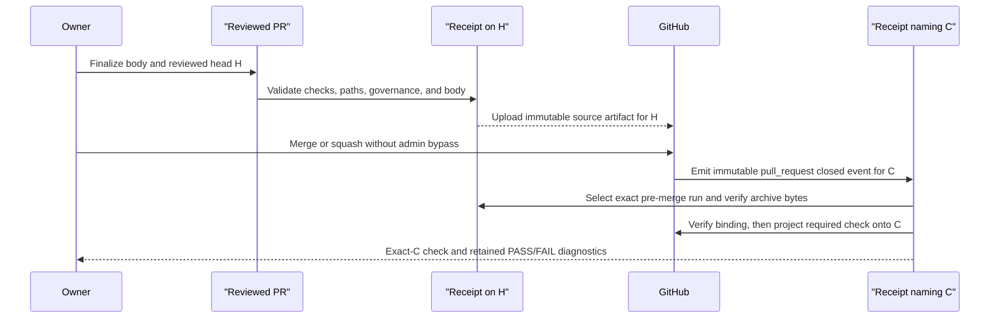

# GitHub branch protection

Purpose: provide a self-service checklist for turning repository-local agent
rules into enforced GitHub settings.

Audience: maintainers and repository administrators.

## Recommended ruleset

dpone currently uses **solo-maintainer governance mode**: the repository has one
human owner, so GitHub cannot count that same owner as both pull-request author
and approving reviewer. GitHub rejects self-approval by design. In this mode,
CODEOWNERS remains an ownership map, but branch protection must not require a
CODEOWNER approval that only the PR author can provide.

The machine-readable policy is
`.agents/policy/github-branch-protection.yml`. Validate it with:

```bash
uv run python tools/agent_policy/branch_protection.py \
  .agents/policy/github-branch-protection.yml
```

Compare the policy to live GitHub settings with:

```bash
uv run python tools/agent_policy/github_settings_drift.py \
  --policy .agents/policy/github-branch-protection.yml \
  --repo PaulKov/dpone
```

The scheduled `Agent Governance Drift` workflow runs the same comparison and
uploads `agent-governance-drift-summary.json` as the primary audit receipt. The
ruleset endpoint is publicly readable, but GitHub's classic branch-protection
endpoint requires an Administration read token. Configure
`DPONE_GOVERNANCE_GITHUB_TOKEN` as a repository secret to make that part a hard
live check; without it the workflow records classic branch protection and the
overall summary as `UNVERIFIED` instead of calling missing evidence a pass.

Create or update a ruleset named `protect-master`.

Target:

- branch: `master`

Bypass:

- allow only repository administrators;
- do not grant agent, automation, or broad team bypass unless an incident runbook
  requires it.

Pull request requirements:

- require a pull request before merging;
- require `0` approving reviews while `mode: solo_maintainer` is active;
- do not require review from Code Owners while `mode: solo_maintainer` is
  active;
- dismiss stale approvals when new commits are pushed;
- require conversation resolution before merge;
- block force pushes;
- block branch deletion.

Status checks:

- require checks to pass before merge;
- require branches to be up to date before merge when GitHub allows it without
  excessive queue churn;
- require the exact twenty-one contexts resolved from the canonical active policy
  [`.agents/policy/github-branch-protection.yml`](https://github.com/PaulKov/dpone/blob/master/.agents/policy/github-branch-protection.yml),
  which stores names but does not store App IDs. This page deliberately does not
  copy the list: a prose duplicate can drift and must never be used as mutation input.
  Validate the policy with
  `uv run python tools/agent_policy/branch_protection.py .agents/policy/github-branch-protection.yml`
  (shape/status only), and resolve names from the same bytes with the shared
  accessor below. `PR Gate shadow` is diagnostic and is not part of that
  required set.

The semantic PR privilege boundary does not add a required context, GitHub App,
ruleset entry, classic-protection setting, secret, environment, or publisher.
It runs inside the existing `Workflow security policy` CI step. The read-only
`governance-source` and source-free `governance-attestation` jobs are internal
evidence topology, not branch-protection contexts. CodeQL keeps its existing
hosted check identity while narrowing to the action-only profile, and the
existing post-merge receipt publisher remains unchanged.

The two `Doctor import Windows (3.11|3.12)` contexts are independent,
credential-free required checks. They prove the Windows direct-child backend on
the reviewed head; neither context is routed through the ADR 0037 governance
artifact edge, and neither may be skipped or replaced by a Linux result.

```bash
uv run python - <<'PY'
import hashlib
from pathlib import Path

import yaml

from tools.agent_policy.governance_policy_access import required_context_names

policy_path = Path(".agents/policy/github-branch-protection.yml")
raw = policy_path.read_bytes()
policy = yaml.safe_load(raw.decode("utf-8"))
for context in required_context_names(policy):
    print(context)
print(f"sha256:{hashlib.sha256(raw).hexdigest()}")
PY
```

Provider binding is separate live evidence, not a v1 policy field. Before the
planned PR 7 observer exists, this repository has no supported bounded,
replacement-safe command for persisting raw ruleset bytes. The existing generic
file helper is not an authority for this capture. Do not redirect an ad-hoc
`gh api` response into an evidence filename or treat terminal output as retained
certification.

An operator with authenticated read access may inspect the current provider
projection only:

```bash
set -euo pipefail
command -v gh >/dev/null
gh auth status >/dev/null
gh api repos/PaulKov/dpone/rulesets/18806829 \
  --jq '.rules[] | select(.type == "required_status_checks") | .parameters.required_status_checks[] | [.context, .integration_id] | @tsv'
```

The planned read-only PR 7 observer will compare this live field with its
versioned, time-bound expected observation `15368` using bounded streaming,
strict JSON, a descriptor/inode-stable create-only writer, and replacement-race
tests. Until that implementation exists, even twenty-one displayed
`<context><TAB>15368` rows remain an inspection result and App-binding evidence
is `UNVERIFIED`. The local policy validator does not certify App bindings.

Required workflows must report a check on every pull request. GitHub leaves
checks pending when an entire workflow is skipped by `pull_request` path filters,
which blocks merge for required checks. Use always-on pull request triggers with
job-level no-op or conditional steps for expensive scoped checks instead.

Dependency review is enforced natively by
`.github/workflows/dependency-review.yml` with the pinned
`actions/dependency-review-action`, `fail-on-severity: high`, and only
top-level `contents: read`. PR execution evaluates GitHub's test-merge subject;
push execution requires a nonzero 40-hex `github.event.before` as `base-ref`
and evaluates `github.sha` as `head-ref` on exact `master`. The PR and
exact-master `Dependency Review` results are separate subjects: PR success does
not create release evidence for the later commit.

The workflow has no manual dispatch, arbitrary-ref input, comment permission,
check-write permission, or synthetic backfill. Missing or unreadable native
evidence is `UNVERIFIED`, not PASS. Rerun an existing eligible run by exact run
ID after a transient provider failure. If no PR run exists, create a new
reviewed PR head/event; if no exact-master run exists, use a new reviewed
successor commit as the release candidate. Never manufacture or mirror a
successful check with `gh api` or another workflow. See the
[Dependency Review runbook](cicd/runbooks.md#dependency-review-failures).

Merge methods:

- allow merge commits for traceable PR integration history;
- allow squash only if release notes and evidence still preserve individual task
  context;
- do not allow direct pushes to `master`.

Owner attestation replaces impossible self-approval in solo-maintainer mode. The
PR must link the approved spec, issue, ADR, docs path, or `N/A: reason`; record
validation evidence statuses; state the owner decision; list required GitHub
checks on the reviewed head commit; and call out whether admin bypass was used.
Normal merges must not use admin bypass. `Agent PR receipt` enforces those
fields for PRs touching the agent control surface and uploads
`agent_pr_receipt.json`; non-agent PRs report `N/A` so the required check stays
fast and deterministic without turning missing agent evidence into a pass. For
agent-control PRs the receipt also verifies live required checks and the
`agent-governance-gate` artifact against the reviewed head SHA before returning
`PASS`. The governance artifact must expose an artifact id, workflow run id,
SHA-256 digest, and positive size from GitHub Actions artifact metadata; a
stale, expired, digestless, or sizeless artifact fails closed. The receipt also
downloads the artifact zip, computes the local downloaded archive SHA-256 and
byte length, requires both to match GitHub artifact metadata, and validates
exactly one `agent_governance_gate.json` inside it. That JSON must have schema
version 1, `status: PASS`, `control_surface_changed: true`, changed paths
matching the PR changed paths, and
`changed_control_surface_red_team: PASS`; stale or invalid content fails closed.
The receipt also verifies the GitHub Artifact Attestation for the extracted
governance JSON subject and requires the expected dpone CI signer workflow,
GitHub OIDC issuer, SLSA provenance predicate, and GitHub-hosted runner
provenance. Missing or failing attestation evidence fails closed even when the
artifact is visible in the GitHub Actions UI.
The passing receipt includes structured
`traceability` fields so audits can read the approved source, validation
statuses, non-pass reasons, and owner attestation state without scraping PR
Markdown. It also includes an `evidence_chain` object so audits can follow the
reviewed head commit to required checks, the governance artifact digest, the
local archive fingerprint, governance content summary, and compact attestation
summary without re-querying GitHub.

After an allowed merge or squash, `pull_request: closed` automatically closes
that reviewed-head evidence over the exact integration commit. The derived
`agent_pr_merge_receipt.json` keeps `H` and `C` separate and verifies the Git
parent/tree relationship plus the rename-disabled first-parent path delta. It
uses only the closed-event snapshot and the exact immutable pre-merge artifact;
the current PR body and manual branch dispatch are not authorities. GitHub
keeps the native closed-event run on `H`; after validation, the merged-only job
projects the same required check name onto `C` and validates the returned
check-run/App identities. A missing or expired source artifact blocks release.
Diagnose and recover with the
[Agent PR merge-receipt runbook](agent-pr-merge-receipt-runbook.md).



When dpone gains a second trusted maintainer, switch to **multi-reviewer mode**:
set `required_approving_review_count: 1`, set `require_code_owner_review: true`,
update `.agents/policy/github-branch-protection.yml`, and run the agent
governance gate.

## CODEOWNERS coverage

The following paths must remain owner-owned through CODEOWNERS:

- `AGENTS.md`, nested `AGENTS.md`, `.codex/**`, `.agents/**`;
- `docs/agent-*.md`, `docs/github-branch-protection.md`;
- `tools/agent_policy/**`, `evals/agent/**`;
- `.github/workflows/**`, `.github/CODEOWNERS`, PR and issue templates;
- public contracts, architecture docs, dependency files, and release surfaces
  already listed in `.github/CODEOWNERS`.

## Verification after setup

After saving ruleset changes:

1. Open a documentation-only test PR against `master`.
2. Confirm it cannot merge before required checks complete.
3. Confirm CODEOWNER review is not a merge requirement while solo-maintainer
   mode is active.
4. Push a new commit and confirm required status checks rerun on the new head.
5. Confirm a skipped Pages deploy does not block PR merge when the docs build
   check passes.
6. Open or inspect a non-Airflow PR and confirm the Airflow compatibility checks
   report success via their no-op path instead of staying pending.
7. Open or inspect a dependency-changing PR and confirm `Dependency Review`
   reports a required check.
8. Open or inspect an agent-control PR, leave owner attestation unchecked, leave
   `Approved specification or issue` blank, or leave validation evidence
   statuses blank, and confirm `Agent PR receipt` fails. Then check the owner
   attestation on the reviewed head commit, reference
   `agent_governance_gate.json`, record validation statuses with reasons for
   `SKIP`, `N/A`, or `UNVERIFIED`, and confirm the receipt reruns to `PASS` only
   after live required checks are successful and the `agent-governance-gate`
   artifact exists for the same head SHA with matching
   `agent_governance_gate.json` content and a verified GitHub Artifact
   Attestation for that JSON subject.
   Reproduce PR-body grammar problems locally before rerunning GitHub CI:

   ```bash
   uv run python tools/agent_policy/pr_body.py check \
     --phase draft \
     --body-file test_artifacts/agent-policy/pr-body.md \
     --changed-paths-file test_artifacts/agent-policy/pr-changed-paths.txt
   uv run python tools/agent_policy/pr_body.py check \
     --phase final \
     --body-file test_artifacts/agent-policy/pr-body.md \
     --changed-paths-file test_artifacts/agent-policy/pr-changed-paths.txt
   ```

   `draft` preflight catches source and validation-table grammar. `final`
   preflight also checks the owner-attestation and governance-receipt reference
   text. GitHub still validates live required checks plus artifact digest and
   downloaded archive fingerprint metadata through `Agent PR receipt`.
   Confirm the uploaded `agent-pr-receipt` artifact contains
   `agent_pr_receipt.json` with a structured `traceability` object,
   an `evidence_chain` object with required-check metadata and the
   `agent-governance-gate` artifact id, workflow run id, reviewed head SHA, and
   SHA-256 digest plus local archive SHA-256, local archive size, content
   status, changed paths, key governance check statuses, and compact attestation
   status,
   `agent_audit_manifest.json` with compact traceability and evidence-chain
   fields, and is configured with `retention-days: 90`.
   After merge, confirm the exact integration SHA has a successful
   `Agent PR receipt` check whose exact producer has a durable
   `agent-pr-receipt` artifact containing
   `agent_pr_merge_receipt.json` and the byte-identical
   `source-agent-pr-receipt.zip`, plus a separate retained
   `agent-pr-merge-check` diagnostic artifact. Use
   `release_merge_receipt_gate.py`; do not trust a downloaded projection report
   without live check/App/run reconciliation.
9. On an agent-control PR, run the standalone semantic scanner locally and
   confirm the exact reviewed-head CI run also has hosted CodeQL, governance
   source/artifact/attestation, required-check, and Agent PR receipt evidence.
   Do not use local `PASS` as a replacement for provider state. Confirm that no
   new required context, App binding, or publisher was introduced.
10. Run `Agent Governance Drift` and confirm
   `agent-governance-drift-summary.json` has `overall_status: passed`. Confirm
   classic branch protection is `passed` when
   `DPONE_GOVERNANCE_GITHUB_TOKEN` is configured, or explicitly `unverified`
   otherwise.

Record the result in the PR or release evidence as:

```text
Branch-protection evidence status: UNVERIFIED until every field below is retained and verified
Ruleset: protect-master
Canonical required-check names: PASS — exact twenty-one from .agents/policy/github-branch-protection.yml with policy SHA-256
Ruleset App bindings: UNVERIFIED until the bounded PR 7 observer retains authenticated raw evidence; ad-hoc redirected output is not evidence
Classic branch-protection GET: <PASS with retained authenticated GET evidence | UNVERIFIED>
CODEOWNER review: disabled in solo-maintainer mode
Owner attestation: present
Traceability source: <issue/spec/ADR/docs path or N/A: reason>
PR receipt: agent_pr_receipt.json with live required-check and artifact evidence
PR receipt traceability: source, statuses, non-pass reasons, owner attestation
PR receipt evidence chain: head SHA, required checks, governance artifact id, run id, digest, local archive SHA-256, local archive size, content status, content changed paths
PR audit manifest: agent_audit_manifest.json with compact traceability and evidence-chain fields
Merge receipt: agent_pr_merge_receipt.json with distinct reviewed head H and integration commit C
Merge receipt source: exact source workflow run/artifact ids, archive digest and preserved source-agent-pr-receipt.zip
Governance artifact retention: 90 days
Semantic PR privilege boundary: <PASS on exact local bytes | FAIL | UNVERIFIED>
Semantic hosted evidence: <CodeQL, governance artifact/attestation, required contexts, and Agent PR receipt status on exact head>
PR3B required-context/App/publisher delta: none
Direct push to master: blocked
Settings drift summary: PASS or UNVERIFIED with reason
Settings drift artifact: agent-governance-drift-summary.json
Verified at: <ISO-8601 timestamp>
```

## Operations notes

- If a required check name changes, update this page, the ruleset, and the PR
  template in one PR.
- If GitHub settings drift from `.agents/policy/github-branch-protection.yml`,
  either restore the live setting or update the policy and evidence in the same
  PR. Use per-component receipts for diagnosis, but use
  `agent-governance-drift-summary.json` as the final status artifact.
- If a check is flaky, fix or quarantine the underlying check. Do not remove a
  release-critical required check just to merge faster.
- If the semantic scanner is red, follow the
  [semantic privilege runbook](cicd/runbooks.md#semantic-pr-privilege-boundary).
  Do not change branch protection, widen a workflow allowlist, or add a
  replacement publisher to turn a repository-policy failure green.
- Emergency bypass must use the `Admin bypass / break-glass` issue template and
  leave owner, reason, affected PR/commit/tag, completed evidence, residual
  risk, rollback plan, and follow-up review deadline. Link the issue from the
  PR, release, or incident evidence. A bypass is not a substitute for normal
  feature review; it is a time-boxed audit record for a higher-risk emergency.

Related pages:

- [Agent governance](agent-governance.md)
- [Agent risk register](agent-risk-register.md)
- [Agent security mapping](agent-security-mapping.md)
