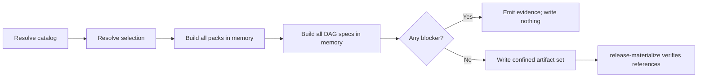

# Airflow reconcile and recovery

This page is the how-to, reference, and recovery runbook for DataOps engineers
who build compact Airflow packs and declarative DAG specs from a GitOps
workload catalog. Start with the
[GitOps workload catalog](gitops-workload-catalog.md) for the authoring model.

## Choose one selection mode

Use affected mode in merge-request pipelines:

```bash
dpone gitops airflow reconcile \
  --workload-set dpone_workloads/gitops.yaml \
  --changed-files-file .ci/changed-files.txt \
  --env dev \
  --output-dir .dpone/mr-1482/gitops \
  --output .ci/out/airflow-reconcile.json \
  --format json
```

Use full-catalog mode for a deployment fixture or immutable release:

```bash
dpone gitops airflow reconcile \
  --workload-set dpone_workloads/gitops.yaml \
  --all-workloads \
  --env dev \
  --output-dir .dpone/deploy-2057975/gitops \
  --output .ci/out/airflow-reconcile.json \
  --format json
```

`--all-workloads` cannot be combined with either changed-file option, even
when the supplied file is empty. This prevents an ambiguous build from silently
changing scope.

## Data flow



Known catalog, selection, pack, or DAG-spec blockers are evaluated before
artifact persistence. A failed build therefore cannot leave a subset of
successfully planned packs. Filesystem failure or process termination during
the final persistence phase can leave a disposable output root; it can never
be promoted unless the subsequent release materializer verifies the complete
set.

## Output tree

For `--output-dir .dpone/deploy-2057975/gitops`, a successful build produces:

```text
.dpone/deploy-2057975/gitops/
└── airflow/
    ├── _dags/
    │   ├── DAG__example__example_customer_mart__refresh.dag-spec.json
    │   └── DAG__interchange__account_activity_datamarts__refresh.dag-spec.json
    ├── crm_wide_mes/
    │   └── airflow-pack.json
    └── account_sales/
        └── airflow-pack.json
```

All JSON files are UTF-8 with a trailing newline. Existing files at the same
paths are replaced. Stale `*.dag-spec.json` files are pruned only from the
selected `airflow/_dags` directory after the complete build passes.

The output root must be repository-relative. Absolute paths, `..` traversal,
and paths that resolve through a symlink outside the repository are rejected.
Symlink-aware confinement also applies to the `--changed-files-file` input and
the optional `--output` evidence mirror. Values supplied through
`--changed-files` are logical Git path identities: they receive lexical
repository-relative validation but are never opened or dereferenced. All
inputs are validated before pack or DAG-spec writes.
Bucket, cache, and runtime artifact publication are separate commands.

## Evidence contract

Successful JSON evidence uses schema version `1`:

```json
{
  "kind": "gitops.airflow_reconcile",
  "schema_version": "1",
  "producer": "dpone gitops airflow reconcile",
  "workload_set": "dpone_workloads/gitops.yaml",
  "env": "dev",
  "selection_mode": "all",
  "affected_workloads": ["crm_wide_mes", "account_sales"],
  "packs": [
    ".dpone/deploy-2057975/gitops/airflow/crm_wide_mes/airflow-pack.json",
    ".dpone/deploy-2057975/gitops/airflow/account_sales/airflow-pack.json"
  ],
  "dag_specs": [
    ".dpone/deploy-2057975/gitops/airflow/_dags/DAG__example__example_customer_mart__refresh.dag-spec.json",
    ".dpone/deploy-2057975/gitops/airflow/_dags/DAG__interchange__account_activity_datamarts__refresh.dag-spec.json"
  ],
  "warnings": [],
  "blockers": [],
  "meta": {
    "kind": "gitops.airflow_reconcile",
    "path": ".dpone/deploy-2057975/gitops"
  }
}
```

Field meanings:

| Field | Meaning |
|---|---|
| `selection_mode` | `affected` for changed-file impact or `all` for a complete catalog |
| `affected_workloads` | Deterministically ordered workloads selected for this build |
| `packs` | Compact packs actually written by this successful invocation |
| `dag_specs` | DAG specs actually written below the selected root |
| `warnings` | Non-blocking typed findings; operators must review them |
| `blockers` | Typed failures; a non-empty list makes the result ineligible for promotion |

`selection_mode` is an optional additive field in schema v1. New producers
always emit it. Consumers must interpret an absent field in historical
evidence as `affected`; older Python construction of
`GitOpsAirflowReconcileReport` also defaults to affected mode.

## Exit codes and streams

| Exit | Meaning | stdout | stderr |
|---:|---|---|---|
| `0` | Complete build passed | JSON or Markdown evidence | empty during normal operation |
| `2` | Typed validation/build blocker | Machine-readable evidence with remediation context | empty during normal operation |
| `1` | Unexpected process or filesystem failure | May be incomplete | diagnostic error |

`--output` mirrors the rendered evidence to a repository-relative file. It
does not change the artifact root and cannot be placed anywhere inside, above,
or across the managed `<output-dir>/airflow` namespace. Keep evidence mirrors
in a sibling directory such as `.ci/out/`.

## Verify before promotion

Do not infer completeness from file count. Materialize the exact artifact set:

```bash
dpone gitops airflow release-materialize \
  --pack-root .dpone/deploy-2057975/gitops/airflow \
  --cache-root .dpone/deploy-2057975/cache \
  --xcom-sidecar-image registry.example/airflow/xcom@sha256:aaaaaaaaaaaaaaaaaaaaaaaaaaaaaaaaaaaaaaaaaaaaaaaaaaaaaaaaaaaaaaaa \
  --output .ci/out/release-materialize.json \
  --format json
```

The materializer verifies that every DAG-spec workload reference has a compact
pack, rewrites the strict runtime contract, and produces an immutable
`release_id`. A compact `release-set.v1` without dbt runtime payloads remains a
legacy-compatible release. A v1 release carrying optional dbt payload inventory
is eligible only for verified non-production transport; strict production
projection rejects it because v1 does not bind dbt selection/provenance
authority. Build the production v2 release instead:

```bash
dpone dbt compile path/to/dbt-project \
  --cache-root .dpone-cache \
  --output-dir .dpone/gitops/airflow-v2
```

First run `dbt parse --project-dir path/to/dbt-project`, then follow the
[dbt compile reference](dbt-self-service-reference.md#command-contract)
for profiles, cache publication, and recovery. Never hand-edit the compact v1
descriptor to bypass this boundary.

The production build returns typed blocker
`DPONE_DBT_PRODUCTION_RELEASE_SCHEMA_REQUIRED` when a v1 release contains dbt
runtime payloads. CLI JSON output exposes this code with exit `2`. Run `dbt
parse` for the project, execute the v2 compile command above, record the new
immutable `release_id`, and rerun the complete
[`dpone airflow build`](airflow-self-service-architecture.md#runtime-artifact-delivery)
command with that ID and a pinned `--airflow-bundle-ref git:<40-hex-commit>`.

## Diagnose and recover

### `reconcile_selection_conflict`

Remove either `--all-workloads` or both changed-file options. Do not use an
empty changed-file list to mean "all".

### `invalid_path`

Use a repository-relative, non-symlinked job directory such as
`.dpone/deploy-${CI_PIPELINE_ID}/gitops`. The same blocker protects `--output`:
it must name a file, must not resolve through a file or escaping symlink, and
must not equal, contain, or sit below the managed `<output-dir>/airflow`
namespace. This includes stale and currently unselected packs or DAG specs.

### `invalid_changed_path`

Every value passed through `--changed-files` or the newline-delimited input
must be repository-relative and free of traversal. Generate the list from the
checked-out repository diff; do not pass absolute CI runner paths.

### `changed_files_file_read_failed`

Create the newline-delimited input inside the repository and confirm the CI
process can read it. The blocker reports the normalized repo-relative path;
missing and unreadable files never start artifact persistence.

### `reconcile_artifact_build_failed`

Read `blockers[].code`, `path`, and `message`. For a build exception, `path`
identifies the manifest or workload-set to validate and the message gives the
failure class plus remediation. Fix that input and rerun into the same
disposable job root. Known blockers write no pack or DAG artifacts.

### Interrupted persistence

Do not promote the directory. Remove only the exact job-scoped output root,
rerun reconcile, then rerun `release-materialize`.

### Rollback

Reconcile output is build evidence, not the active scheduler state. Rollback
uses the previously verified exact `release_id` and `deployment_id`; see
[Airflow cache sync and recovery](airflow-cache-sync.md).

## Concurrency and cleanup

Use one isolated output root per CI job or release candidate. Two writers must
not share an output root because overwrite and stale-DAG pruning are
intentionally scoped to a single owner. Successful immutable releases and
deployment caches follow their own retention policies; disposable reconcile
roots may be removed after their release evidence is retained.

Next: [publish and activate remote packs](airflow-pack-provider.md).
