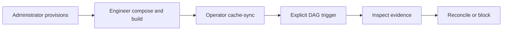

# Operate Kubernetes composition supervision

**Purpose.** Provision the protected supervisor boundary, promote a v3
composition through cache-sync or desired-state, trigger its unscheduled DAGs,
inspect evidence, and recover a blocked `COMMIT_UNKNOWN` attempt.

**Audience.** Platform administrators, data engineers, and Airflow operators.

[Back to the activation contract](../composition-activation-contract.md) ·
**Next likely task:** [diagnose runtime startup](../airflow-runtime-startup-diagnostics.md).

Use this how-to after a `dpone.release-set.v3` parent exists. Native-v2 and
ordinary v1/v2 releases keep their existing path and must not receive a
supervisor capability. A successful compose, build, cache install, or launcher
prepare is not SQL execution and is not route certification.



## Live status

The three installed execution cells are `sqlserver_dbt_v1`,
`postgres_mssql_full_refresh_v1`, and `mssql_clickhouse_full_refresh_v1`.
Installation does not make the three-cell trigger campaign ready; shipped
pack-exec reachability is stated under DAG triggering. Offline tests prove
fail-closed admission, fencing, and evidence shape. They are not route
certification.

A skipped, billed, or unavailable live campaign is `UNVERIFIED`, never `PASS`.
Do not claim Batch ETL, or any stronger route grade, from a narrow smoke table
or from only `full_refresh` plus `incremental_merge`. Wide typed fixtures and
every sink-supported load strategy remain the
[live wide certification](../testing/route-live-wide-certification.md) bar.

## Administrator provisioning

The platform administrator provisions the supervisor PVC, reserved numeric
identities, namespace security, and isolated control SQL **before** build or
cache-sync. Runtime never creates the PVC, never enrolls databases, and never
repairs control schema.

Reserve a Kubernetes DNS-label PVC and one unused UID/GID range. The range must
contain at least `1000000` identities, start at or above `1000000`, and stay
below `2^31`. Keep the range out of image and platform accounts.

```yaml
apiVersion: v1
kind: PersistentVolumeClaim
metadata:
  name: dpone-composition-supervisor
spec:
  accessModes:
    - ReadWriteMany
  resources:
    requests:
      storage: 32Gi
```

The provider materializes this exact least-privilege root-supervisor boundary.
Missing UID 0, a writable root filesystem, extra capabilities, a missing RWX
claim, or a missing memory-backed profile volume rejects v3 before source or
subprocess I/O.

```yaml
securityContext:
  runAsUser: 0
  runAsGroup: 0
  allowPrivilegeEscalation: false
  readOnlyRootFilesystem: true
  seccompProfile:
    type: RuntimeDefault
  capabilities:
    drop:
      - ALL
    add:
      - CHOWN
      - FOWNER
      - DAC_READ_SEARCH
      - SETUID
      - SETGID
      - KILL
volumes:
  - name: dpone-composition-supervisor
    persistentVolumeClaim:
      claimName: dpone-composition-supervisor
  - name: dpone-composition-profiles
    # memory-backed tmpfs for one-shot dbt profiles
    emptyDir:
      medium: Memory
      sizeLimit: 64Mi
```

Namespace prerequisites that must be true together:

- the base container runs as UID 0 / GID 0;
- the root filesystem is read-only;
- privilege escalation is denied and seccomp is `RuntimeDefault`;
- only `CHOWN`, `FOWNER`, `DAC_READ_SEARCH`, `SETUID`, `SETGID`, and `KILL`
  are added after dropping `ALL`;
- the supervisor claim is ReadWriteMany and mounted at
  `/var/lib/dpone/composition`;
- a memory-backed tmpfs `emptyDir` is mounted at
  `/dev/shm/dpone-composition`.

Install the protected SQL control schema and login-gate batches from the
[activation contract](../composition-activation-contract.md) on an isolated
SQL Server. The base installation does not include execution evidence or dbt
capture tables. After the base and login-gate batches, generate these additive
batches with the same `control_schema`:

```python
from pathlib import Path

from dpone.adapters.composition_dbt_capture_schema import render_dbt_capture_schema
from dpone.adapters.composition_execution_evidence_schema import render_execution_evidence_schema
from dpone.adapters.composition_snapshot_sql_schema import render_snapshot_publication_schema
from dpone.adapters.composition_snapshot_capture_schema import render_snapshot_capture_schema

schema = "dpone_control"
Path("composition-execution-evidence.sql").write_text(
    render_execution_evidence_schema(schema), encoding="utf-8"
)
Path("composition-dbt-capture.sql").write_text(
    render_dbt_capture_schema(schema), encoding="utf-8"
)
Path("composition-snapshot-publication.sql").write_text(
    render_snapshot_publication_schema(schema), encoding="utf-8"
)
Path("composition-snapshot-capture.sql").write_text(
    render_snapshot_capture_schema(schema), encoding="utf-8"
)
```

An administrator installs these generated batches in the protected control
database, before any worker invocation. Use the existing controller principal;
issued worker principals must not receive write access to these control tables.
Runtime never installs or repairs the schema. Verify the installed originals
using `require_execution_evidence_schema(cursor, schema)` and
`require_dbt_capture_schema(cursor, schema)` and
`require_snapshot_publication_schema(cursor, schema)` and
`require_snapshot_capture_schema(cursor, schema)` from the respective modules, on a
controller connection with complete metadata visibility. A missing or altered
object is an installation failure; stop before activation and correct the
administrator installation rather than granting a worker additional rights.
Do not reapply one-time creation batches to an existing populated schema. Desired-state watchers bind the same logical control reference in
`dpone.airflow-desired-state-authority.v2` as
`workspace_authority_connection_ref`. That field is a non-secret connection
alias, never a password or target binding. See
[desired-state authority](../airflow-desired-state.md).

Provision `/var/lib/dpone/composition/transfers` as an existing directory owned
by the supervisor's effective root UID, mode `0700`, with no symbolic links in
its path. Transfer capture persists the exact extracted bytes before artifact
cleanup and reopens them for receipt and target-content comparison. The current
capture supports one eager, uncompressed delimited artifact with the standard
codec; unsupported artifact shapes reject the operation. Do not remove retained
files while their attempt requires reconciliation.

The dbt supervisor uses bounded TERM/KILL/reap cleanup on failure and cancellation.
Failure to observe process termination cannot yield success or a reusable UID.
Linux process and UID isolation checks are required for the deployed profile;
local non-Linux tests do not establish them.

## Data-engineer compose and build

Data engineers compile the native workspace, reconcile ordinary packs, and
compose the v3 parent with
[release composition](../release-composition.md). Then project the deployment
with the complete supervisor group. The four flags are all-or-none. v3
requires the sealed `dpone.composition-supervisor.v1` object. v1/v2 releases
reject it with `DPONE_COMPOSITION_SUPERVISOR_FORBIDDEN`.

```bash
: "${DPONE_RELEASE_ID:?set the composed v3 release digest}"
: "${DPONE_RUNTIME_IMAGE_DIGEST:?set the pinned runtime image digest}"
: "${DPONE_ARTIFACT_REGISTRY_REF:?set the deployment registry reference}"
: "${DPONE_RUNTIME_IMAGE_REF:?set the image reference including its digest}"
: "${DPONE_REGISTRY_CONFIG_SHA256:?set the registry ConfigMap content digest}"
: "${DPONE_TRUST_POLICY_SHA256:?set the production trust policy digest}"
: "${DPONE_SOURCE_COMMIT:?set the Airflow bundle source commit}"

dpone airflow build \
  --release-id "${DPONE_RELEASE_ID}" \
  --environment prod \
  --trust-tier production \
  --runtime-image-ref "${DPONE_RUNTIME_IMAGE_REF}" \
  --runtime-image-digest "${DPONE_RUNTIME_IMAGE_DIGEST}" \
  --artifact-registry-ref "${DPONE_ARTIFACT_REGISTRY_REF}" \
  --registry-config-map-name dpone-artifact-registry \
  --registry-config-map-key registry.json \
  --registry-config-sha256 "${DPONE_REGISTRY_CONFIG_SHA256}" \
  --trust-policy-config-map-name dpone-artifact-trust-policy \
  --trust-policy-config-map-key policy.json \
  --trust-policy-sha256 "${DPONE_TRUST_POLICY_SHA256}" \
  --airflow-bundle-ref "git:${DPONE_SOURCE_COMMIT}" \
  --composition-supervisor-pvc dpone-composition-supervisor \
  --composition-child-uid-start 1000000000 \
  --composition-child-gid-start 1000000000 \
  --composition-child-identity-count 1000000 \
  --format json
```

A partial group returns `DPONE_COMPOSITION_SUPERVISOR_GROUP_INCOMPLETE`. An
invalid claim name or range returns `DPONE_COMPOSITION_SUPERVISOR_INVALID`.
No workload pack, manifest, Airflow parameter, or task environment may override
the sealed object. The public factory
`dpone.app.composition_activation.build_composition_activation_coordinator`
installs all three cells: `sqlserver_dbt_v1`,
`postgres_mssql_full_refresh_v1`, and `mssql_clickhouse_full_refresh_v1`.

## Operator cache-sync and desired-state

Operators promote only a reviewed deployment. v3 and native workspace wires
fail closed unless the protected control binding is supplied. Public
`dpone airflow cache-sync` accepts
`--workspace-authority-connection-ref`. Desired-state reconcile reads the same
alias from the sealed authority file.

```bash
: "${DPONE_SCHEDULER_CACHE_ROOT:?set the absolute scheduler cache root}"
: "${DPONE_NEXT_DEPLOYMENT_DIR:?set the reviewed sha256-... deployment directory name}"
: "${DPONE_REVIEWED_CURRENT_DEPLOYMENT_ID:?set the current canonical sha256 digest}"

dpone airflow cache-sync \
  --cache-root "${DPONE_SCHEDULER_CACHE_ROOT}" \
  --deployment-dir "${DPONE_SCHEDULER_CACHE_ROOT}/deployments/prod/${DPONE_NEXT_DEPLOYMENT_DIR}" \
  --environment prod \
  --promoted-by ci://your-platform/dpone-airflow \
  --allowed-promoter ci://your-platform/dpone-airflow \
  --expected-current-deployment-id "${DPONE_REVIEWED_CURRENT_DEPLOYMENT_ID}" \
  --workspace-authority-connection-ref dpone_control \
  --confirm-promote \
  --format json
```

Omitting the authority flag leaves `composition_activation_coordinator` unset.
A v3 parent then fails closed with `DPONE_COMPOSITION_ADMISSION_UNAVAILABLE`
instead of falling back to native-v2 or generic `dpone run`. Production
watchers should keep using
[desired-state reconcile](../airflow-cache-sync-promotion.md) rather than
re-implementing fetch, materialize, and cache-sync in shell.

A READY marker or successful pointer switch is not worker execution.

For PostgreSQL-to-MSSQL execution, runtime retains the independently derived
pre-extraction plan under `transfers/preplans/<attempt-digest>.json`. The v2
composition binding pins the complete envelope digest in its existing protected
SQL original. The envelope includes source identity and projection, target
registry identity, physical route and the existing schema preplan. Generic
commit-receipt formats remain unchanged.

Admission verifies the source on the same prepared PostgreSQL snapshot used for
extraction. Recovery reopens the retained envelope and checks the current target
registry, the plan's AFTER catalog expectations, receipt before/after hashes and
captured source provenance on the observer's existing SQL transaction. It never
reconstructs a before-plan from a catalog already changed by the load.

Preserve these files alongside the retained payload. Historical v1 bindings
remain readable but cannot establish the new independent OUTCOME proof. Do not
manufacture v2 originals or replay a `COMMIT_UNKNOWN` attempt to obtain them.

For ClickHouse capture, provision the private root-owned `0700` directory
`/var/lib/dpone/composition/snapshots`. Runtime stores immutable `source.json`
and `payload.native` under the complete attempt digest and pins their hashes in
protected SQL before CREATE. A deployment-side `composition-snapshots` file is
not a runtime source original. Never overwrite or remove capture files needed
for reconciliation. Retained generations count toward configured storage limits;
there is no implicit deletion policy. Before CREATE, runtime conservatively
checks whether every possible 64-row observation page fits the 1 MiB HTTP
profile, including JSON escaping. An oversized page rejects with
`snapshot_materialization_page_budget` before target mutation.

The catalog observer needs direct global SHOW DATABASES, SHOW TABLES, SHOW
COLUMNS, SHOW USERS, SHOW ROLES, SHOW ROW POLICIES and SELECT privileges (their
ancestor groups also qualify), with no partial revokes. These privileges belong
to the protected observer. Runtime does not grant them to workers. Role-only
observer grants are currently unsupported. The observer rechecks its actual
identity and grants before and after materialization; unsupported row policies,
physical designs and cluster topology still reject independently.

## Host observation service

The root host observer has a separate entry point:

```bash
/opt/dpone/venv/bin/python -m dpone.app.composition_supervisor_host_service \
  --config /etc/dpone/composition/host-probe.json \
  --configuration-sha256 "${DPONE_HOST_PROBE_CONFIG_SHA256:?set the approved configuration digest}"
```

The configuration must be canonical JSON in a root-owned protected directory.
Its closed `dpone.composition-host-probe-config.v1` fields are `schema`,
`socket_path`, `dispatcher_uid`, `dispatcher_gid`, `timeout_seconds`,
`enrollment_sha256` and `enrollment_document`. The supplied configuration digest
pins the entire original, including the complete enrolled Docker/Linux policy.
Use a dedicated nonzero dispatcher UID/GID. Keep Docker and host process access
inside this host service; expose only its peer-credential-checked Unix socket.

The [systemd template](../../examples/composition-supervisor/dpone-host-probe.service)
requires administrator substitution of its installation path, configuration
hash and dispatcher group before installation. It runs as host root and does
not automatically restart. An idle accept timeout keeps the listener available;
a failed accepted request exits without recapturing it. SIGTERM/SIGINT finish
within the configured request deadline, close the listener and remove only the
socket inode owned by this process.

This entry point does not provision enrollment, start the remote dispatcher or
certify the Kubernetes route. The HTTPS transport and host observation service
still require protected business-handler wiring and a real Linux campaign.

## DAG triggering

Composed synthetic DAGs keep `schedule: null`. Load every expected DAG through
the [Airflow provider](../airflow-pack-provider.md), then trigger the exact DAG
IDs from the parent inventory. Native DAG order does not create
cross-constituent dependencies.

Shipped pack-exec is not ready as a three-cell trigger campaign.
`sqlserver_dbt_v1` can reach `CompositionDbtExecutionRoot` when parent context
exists. `postgres_mssql_full_refresh_v1` can reach
`CompositionTransferExecutionRoot` when parent context exists and
`DPONE_CACHE_ROOT` (or `DPONE_SCHEDULER_CACHE_ROOT`) reopens the sealed parent
plan. `mssql_clickhouse_full_refresh_v1` can reach
`CompositionClickHouseExecutionRoot` when that parent context, cache plan,
runtime snapshot capture, and enrolled supervisor/HTTP collaborators compose.
The runtime captures the bounded MSSQL source once in a consistent transaction,
preserves exact Native bytes, and independently reads typed ClickHouse content
before publication. Source connections must include signed `database_authorities`
for both the actual source database and the composition control database, plus
the expected `composition_service_id`. Runtime verifies these pins on the same
business connection before and after extraction. Every attempt reserves a different generation name; the
previous target remains retained after exchange. Pack-exec
refuses login and ingest until an independent transfer observer or typed
catalog classification exists, so a composed root is not a mutation permit.
Missing any of those originals fail-closes with
`composition_ordinary_worker_unavailable` before login issuance. Native
pack-exec without parent context fails closed with
`composition_native_worker_unavailable`. Ordinary pack-exec without that cache
plan also fail-closes.

```bash
: "${DPONE_COMPOSITION_DAG_ID:?set one DAG id from the composed parent}"

airflow dags trigger "${DPONE_COMPOSITION_DAG_ID}"
```

Retry creates a new Airflow task try. The same RUNNING parent attempt never
receives a second executor permit. Do not handcraft init-fetch plans or rewrite
producer identities.

## Evidence inspection

Inspect these independent surfaces before retrying:

| Surface | What it proves | What it does not prove |
|---|---|---|
| `/var/lib/dpone/run/runtime-startup-error.json` | Dispatch rejection; inspect whether dispatch started | Absence of worker execution or mutations |
| `/var/lib/dpone/run/runtime-evidence.json` | Worker-reported files for this attempt | OUTCOME without the control ledger |
| Control `composition_operations` plus `execution_evidence` | Protected `CLOSED_GATES`, `QUIESCENCE`, and `OUTCOME` originals | That a process exit succeeded |
| Supervisor PVC at `/var/lib/dpone/composition` | Immutable attempt and UID/GID tombstones | That SQL committed |

A startup-error artifact can also be written after execution starts, for
example when terminal evidence cannot be verified. Distinguish pre-dispatch
rejection from a failure with `dispatch_started=True`; the artifact name alone
never proves that no SQL ran. Inspect the exact attempt in the protected control
ledger and complete closure/reconciliation before retrying an uncertain run.

Process exit, filesystem ownership, generic `LoadResult`, and a dbt exit code
are never OUTCOME proof. Arguments, credentials, and connection strings must
not appear in tickets, XCom, or committed fixtures. See
[startup diagnostics](../airflow-runtime-startup-diagnostics.md) for
`DPONE_RUNTIME_COMPOSITION_DISPATCH_REJECTED` reasons.

## Blocked retry diagnosis

| Observation | Meaning | Safe action |
|---|---|---|
| `composition_supervisor_authority_missing` | Verified command lacks `DPONE_COMPOSITION_SUPERVISOR_B64` | Rebuild with the complete supervisor group; do not patch the pod env |
| `composition_native_worker_unavailable` | Native pack-exec has no parent context or no `sqlserver_dbt_v1` factory | Do not treat this as worker execution; restore parent context or the native factory |
| `composition_ordinary_worker_unavailable` | Ordinary or ClickHouse pack-exec missing parent context, `DPONE_CACHE_ROOT`, a matching sealed plan, protected runtime capture originals, or enrolled supervisor/HTTP collaborators | Restore the shared release cache and protected originals; verify parent identity; do not retry as if a worker ran |
| `DPONE_COMPOSITION_SUPERVISOR_REQUIRED` | v3 deployment omitted the sealed supervisor object | Rebuild and promote the exact projection |
| Duplicate RUNNING admission | The original executor still owns the attempt | Inspect that attempt; do not start a second worker |
| Durable `COMMIT_UNKNOWN` | SQL or publication outcome is unproven | Close gates, prove quiescence, then reconcile; do not replay mutation |
| Missing PVC, tmpfs, `/proc`, or UID 0 | Supervisor boundary is incomplete | Restore namespace prerequisites; the pod must reject, not degrade |

A `COMMIT_UNKNOWN` attempt remains blocking after quiescence. The protected
store method `reconcile_unknown(...)` accepts only a newly produced success or
failure OUTCOME proof for an audited unknown. It issues no credentials, resets
no password, and cannot change an already `SUCCEEDED` or `FAILED` attempt.

```python
receipt = attempt_store.reconcile_unknown(
    attempt,
    state="FAILED",
    outcome_evidence_sha256=protected_outcome_digest,
)
```

Use `state="SUCCEEDED"` only after an independent trusted observer produced the
matching OUTCOME original. Blindly retrying ClickHouse `EXCHANGE` can swap
tables back. Deployment rollback does not undo SQL.

## Tombstone retention

Identity and attempt tombstones on the supervisor PVC are not automatically deleted.
This version has no reclamation command. A later reviewed operation
may reclaim names only after the parent is `RETIRED`, every attempt is
terminal, evidence is archived, and no process or transaction remains. Clearing
tombstones to retry an uncertain attempt is unsupported and unsafe.

## Compatibility

Native-v2 command, identity, retry, and evidence behavior is unchanged. v3
never falls back to native-v2 workspace admission or generic `dpone run`.
Public Python construction is
`build_composition_activation_coordinator(*, cache_root, authority_connection_ref,
control_schema="dpone_control")`.

Return to the [activation contract](../composition-activation-contract.md),
[CLI reference](../cli-reference.md), or
[compatibility notes](../compatibility.md).
