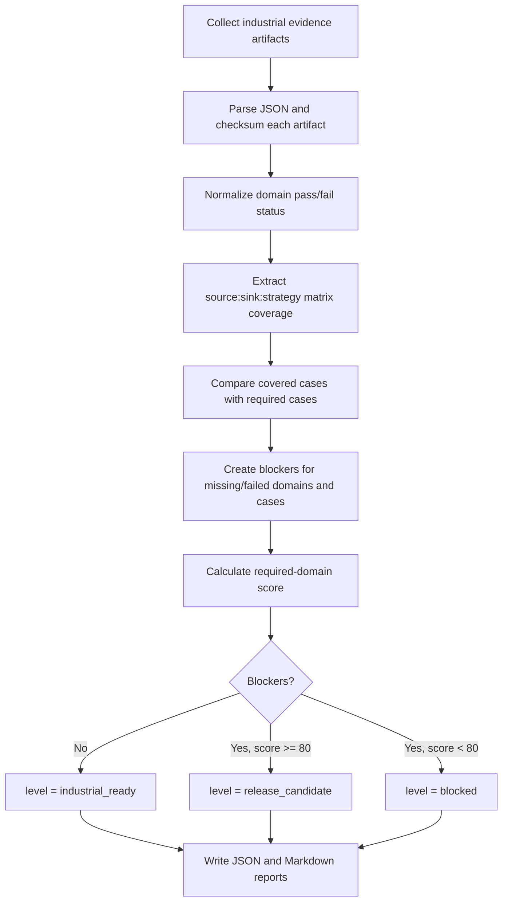

# Industrial readiness gate

`dpone ops industrial-readiness` is the operator gate for the next maturity layer after production readiness. It aggregates local matrix, correctness, reliability, performance lab, UX, governance, and schema evolution evidence into one release-review artifact.

Use it when a release needs proof that supported source -> sink -> strategy paths are not only implemented, but also certified, correct, recoverable, measurable, documented, and governed.

## Quickstart

```bash
uv run dpone ops industrial-readiness \
  --release vX.Y.Z-rc1 \
  --output-dir test_artifacts/industrial_readiness/report \
  --artifact local_matrix=test_artifacts/integration_matrix/latest/matrix.json \
  --artifact correctness=test_artifacts/correctness/latest/correctness.json \
  --artifact reliability=test_artifacts/reliability/latest/reliability.json \
  --artifact performance_lab=test_artifacts/benchmarks/latest/performance_lab.json \
  --artifact ux=test_artifacts/ux/latest/ux.json \
  --artifact governance=test_artifacts/governance/latest/governance.json \
  --case postgres:mssql:incremental_merge \
  --case mssql:clickhouse:partition_replace
```

Outputs:

| File | Purpose |
| --- | --- |
| `industrial_readiness.json` | Machine-readable domain status, matrix coverage, checksums, blockers, score, and level. |
| `industrial_readiness.md` | Human-readable release review and recovery guide. |

## Evidence domains

| Domain | Required evidence |
| --- | --- |
| `local_matrix` | Source -> sink -> strategy cases, row counts, wide-column profile, changed/deleted percentages, and pass/fail status. |
| `correctness` | Row-count reconciliation, checksum reconciliation, null/empty-string handling, type-fidelity checks, and quarantine summary. |
| `reliability` | Locks, retries, resumable runs, idempotency, state commit ordering, cancellation cleanup, and replay evidence. |
| `performance_lab` | Benchmark baselines, throughput, regression checks, native fast-path evidence, and performance advisor output. |
| `ux` | Self-service command coverage, examples, run-report/debug UX, and docs discoverability. |
| `governance` | Compatibility policy, deprecation policy, connector status, security posture, and release decision evidence. |
| `schema_evolution` | Online DDL plan, schema ledger, risk classification, blockers, and expand-contract evidence. |

## Matrix case format

Required matrix cases use `source:sink:strategy` identifiers:

```text
postgres:mssql:incremental_merge
mssql:clickhouse:partition_replace
kafka:postgres:incremental_append
api:mssql:replace
```

The local matrix artifact should include `cases` entries like this:

```json
{
  "passed": true,
  "cases": [
    {
      "source": "postgres",
      "sink": "mssql",
      "strategy": "incremental_merge",
      "row_count": 10000,
      "changed_pct": 20,
      "deleted_pct": 5,
      "wide_columns": 120
    }
  ]
}
```

## Algorithm



## CI workflow

The scheduled/manual workflow is `.github/workflows/industrial-readiness.yml`. It runs the focused industrial readiness tests, builds deterministic local evidence stubs, runs `uv run dpone ops industrial-readiness`, indexes artifacts, and uploads `industrial-readiness-report`.

For release candidates, replace stub evidence with real outputs from local matrix, correctness, reliability, benchmark, UX, and governance workflows.

## Runbook

If the gate fails:

1. Open `industrial_readiness.md`.
2. For `*.missing`, generate or download the missing specialized evidence artifact.
3. For `*.not_passed`, fix the specialized workflow; do not weaken the aggregator.
4. For `local_matrix.case_missing:*`, run that exact source -> sink -> strategy case.
5. For correctness failures, inspect row counts, checksums, type-fidelity evidence, and quarantine rows.
6. For reliability failures, inspect locks, retries, resume markers, idempotency checks, and state commit order.
7. Re-run `dpone ops industrial-readiness` after the specialized evidence is updated.

## Related docs

| Need | Doc |
| --- | --- |
| Production maturity aggregator | [Production maturity gate](production-maturity.md) |
| Source/sink testing | [Testing overview](testing/index.md) |
| Manual matrix | [Manual integration matrix](testing/manual-integration-matrix.md) |
| CI/CD workflows | [Workflow reference](cicd/workflows.md) |
| Failure recovery | [CI/CD runbooks](cicd/runbooks.md) |
| Operations CLI | [dpone ops](ops-cli.md) |
