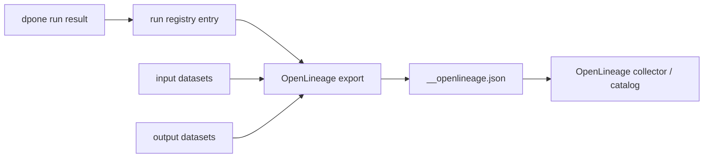

# OpenLineage and run history

`dpone` exports OpenLineage-compatible JSON events from the auditable run
registry. The export is dependency-light by design: the framework writes a
standard event payload, and operators can send it to Marquez, an OpenLineage
collector, a catalog, or a CI artifact store.

## Why this exists

Production ELT/ETL needs a shared language for answering four questions:

| Question | dpone source of truth |
| --- | --- |
| What ran? | `dpone run --format json` |
| Can we trust the result? | `dpone ops run-registry` |
| What datasets moved? | `dpone ops lineage-export --input ... --output ...` |
| Which artifacts prove it? | run registry checksums and attached evidence |

## Operator workflow

```bash
dpone run manifests/orders.yml \
  --selector daily_orders \
  --format json > .dpone/runs/daily_orders/run_result.json

dpone ops run-registry \
  --output-dir .dpone/run-registry \
  --run-result .dpone/runs/daily_orders/run_result.json \
  --artifact quality=.dpone/runs/daily_orders/quality.json \
  --format json

dpone ops lineage-export \
  --output-dir .dpone/lineage/daily_orders \
  --run-registry-entry .dpone/run-registry/<run_id>__run_registry.json \
  --namespace dpone.local \
  --input postgres=public.orders \
  --output mssql=landing.orders \
  --airflow-evidence-bundle .dpone/evidence/orders-airflow.json \
  --format json
```

## Event model



The exported event includes:

| OpenLineage field | dpone mapping |
| --- | --- |
| `run.runId` | `run_id` from the run registry entry |
| `job.namespace` | `--namespace`, default `dpone.local` |
| `job.name` | process name from the run registry entry |
| `eventType` | `COMPLETE` for passed runs, `FAIL` for red runs, or explicit `--event-type` |
| `inputs` | `--input namespace=name` values |
| `outputs` | `--output namespace=name` values |
| `run.facets.dpone_run` | status, manifest, checksums, registry checksum |
| `run.facets.dpone_artifacts` | attached evidence artifacts from the registry entry |
| `run.facets.dpone_data_contract` | optional runtime contract enforcement, quarantine, DDL apply, and compatibility summary from [Runtime data contracts](data-contract-runtime.md) |
| `run.facets.dpone_airflowCorrelation` | optional complete Airflow attempt, dpone run, release/deployment/pack, evidence, and pod correlation |

With `--airflow-evidence-bundle`, the OpenLineage `runId` becomes a
deterministic UUIDv5 derived from the internal correlation digest. The original
dpone run ID remains in `dpone_run.dponeRunId`. The custom
`dpone_airflowCorrelation` run facet uses the immutable, versioned schema at
`docs/schemas/openlineage/dpone-airflow-correlation-run-facet-v1.schema.json`.
The command performs local file conversion only; it does not contact Airflow or
an OpenLineage backend.

## Dataset naming convention

Use stable namespaces that identify the platform or system family, and dataset
names that identify the logical table/topic/resource.

| System | Example namespace | Example name |
| --- | --- | --- |
| PostgreSQL | `postgres` | `public.orders` |
| MSSQL | `mssql` | `landing.orders` |
| ClickHouse | `clickhouse` | `analytics.orders` |
| BigQuery | `bigquery` | `demo_project.dwh.orders` |
| Kafka | `kafka` | `orders_events` |
| REST API | `api` | `example_provider.orders` |

## Failure behavior

`lineage-export` still writes an event for failed runs, but the command exits
red so CI can block promotion.

| Condition | Event type | CLI status |
| --- | --- | --- |
| Registry entry passed | `COMPLETE` | green |
| Registry entry failed | `FAIL` | red |
| Registry entry missing | `FAIL` | red |
| Registry entry invalid JSON | `FAIL` | red |

## Runbook

1. If `lineage-export` fails with `run_registry.missing`, regenerate the run registry entry.
2. If it fails with `run_registry.not_passed`, debug `dpone run` first.
3. If inputs/outputs are missing in the catalog, re-export with explicit `--input` and `--output`.
4. If the collector rejects the payload, keep the generated JSON artifact and validate collector-side schema/version support.
5. If lineage checksums drift, treat it as an audit event and compare the run registry entry before re-exporting.
6. If `airflow_correlation.incomplete` appears, collect the final Airflow evidence bundle after pod and runtime evidence are available.

## Python API

```python
from dpone.ops.openlineage_export import OpenLineageExportService

report = OpenLineageExportService().export(
    output_dir=".dpone/lineage/daily_orders",
    run_registry_entry_path=".dpone/run-registry/run_01__run_registry.json",
    namespace="dpone.local",
    input_datasets={"postgres": "public.orders"},
    output_datasets={"mssql": "landing.orders"},
    airflow_evidence_bundle_path=".dpone/evidence/orders-airflow.json",
)
assert report.passed
```
