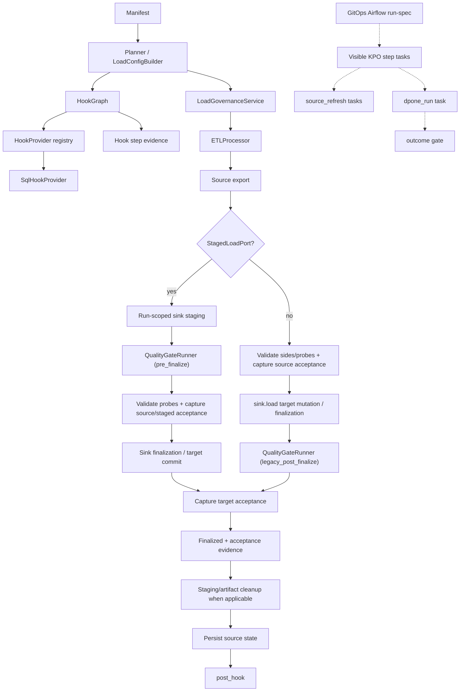
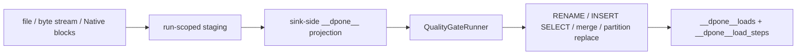

# Source preparation graph and load governance

`dpone` supports the production pattern: calculate a source-side mart, transfer
the refreshed result into sink staging, run quality gates, finalize atomically,
write evidence, and cleanup artifacts.

That ordering is guaranteed only when the sink implements `StagedLoadPort`.
Other sinks are identified explicitly as `legacy_post_finalize`; their residual
target-mutation risk is described under [Runtime lifecycle](#runtime-lifecycle).

The public API uses dbt-style `pre_hook` and `post_hook` names, but a hook is a
typed action with id, kind, connector, dependencies, lineage, execution mode and
audit evidence. Airflow DAGs can stay compact: they render the dpone graph
instead of embedding custom MSSQL, ClickHouse or data-quality helper code.

## Architecture



## Hook API

```yaml
source:
  options:
    hooks:
      pre_hook:
        - id: refresh_base
          kind: source_refresh
          type: sql
          connector: source
          sql: "EXEC [schema].[p_refresh_base]"
          autocommit: true
          mutates_source: true
          retry_policy: none
          depends_on: []
          lineage:
            inputs: ["analytics_staging.schema.base_table"]
            outputs: ["analytics_reporting.reporting.base_mart"]
          execution:
            cli: inline
            airflow: separate_task

      post_hook:
        - id: optimize_target
          kind: target_maintenance
          type: sql
          connector: sink
          sql: "OPTIMIZE TABLE raw.orders FINAL"
```

Use `sql` for short one-line hooks. Use `sql_file` for production SQL bodies:

```yaml
source:
  options:
    hooks:
      pre_hook:
        - id: refresh_price_calc_work_tables
          kind: source_refresh
          type: sql
          connector: sink
          sql_file: ../../sql/clickhouse/price_calc/010_refresh_work_tables.sql
          mutates_source: true
          execution:
            airflow: separate_task
```

`sql` and `sql_file` are mutually exclusive. `sql_file` is resolved relative to
the manifest directory, must stay inside the repository root, is read before
the mutating-SQL guard runs, and is represented in evidence by `sql_hash`
instead of raw SQL text. The GitOps compact pack records the SQL file path and
SHA-256 hash as a workload dependency, so changing hook SQL invalidates the
pack fingerprint just like changing `source.options.query.sql_file`.

Hook ids are unique inside each phase. `depends_on` is topologically sorted and
cycles fail before source export. Mutating SQL such as `EXEC`, `INSERT`,
`UPDATE`, `MERGE`, `CREATE`, `ALTER`, `DROP` and `TRUNCATE` must set
`mutates_source: true`; this makes business-refresh side effects visible in code
review.

Supported `kind` values:

| Kind | Purpose |
| --- | --- |
| `source_refresh` | Business/source calculation such as `EXEC p_refresh_mart`. |
| `source_materialization` | dpone-managed source work snapshot. |
| `source_maintenance` | Explicit source stats/index prep. |
| `target_preparation` | Target DDL, schema or cluster preparation. |
| `target_maintenance` | Target optimize/analyze/cleanup. |
| `data_quality_probe` | Explicit visible DQ probe. |
| `notification` | Marker, webhook, comment or external signal. |
| `custom` | Extension point through a registered provider. |

## Quality gates

Quality gates are connector-neutral. `row_count_reconciliation` is one
implementation of the common `QualityGate` contract, not a separate runtime
branch.

`quality.gates` is the canonical authoring and runtime contract. New manifests
must use it directly:

```yaml
quality:
  gates:
    - id: row_count_reconciliation
      type: row_count_reconciliation
      severity: error
      tolerance:
        mode: absolute
        value: 0

    - id: target_min_rows
      type: min_rows
      side: target
      threshold: 1
      severity: error

    - id: typed_hash_sample
      type: typed_hash_reconciliation
      mode: sample
      severity: warning
```

`target_min_rows` is opt-in for full refreshes and other workloads where an
empty target is always invalid. Omit it from incremental or CDC workloads where
a legitimate interval can contain no rows; row-count reconciliation still
accepts a valid `0` source / `0` target interval.

`quality.checks` is a deprecated compatibility input for older manifests, not a
second quality engine or a form for new examples. The adapter reads
`quality.mode` and normalizes the two mapped check types into canonical gates
before evaluation:

```yaml
quality:
  mode: fail   # fail → severity error; warn → severity warning
  checks:
    - id: target_not_empty
      type: min_rows
      side: target
      threshold: 1          # opt-in when zero rows are always invalid
    - id: source_target_rows
      type: source_target_count
      tolerance_pct: 0
```

The migration mapping is exact:

| Compatibility field | Canonical result |
| --- | --- |
| `quality.mode: fail` / `warn` | default `severity: error` / `warning` |
| `checks[].type: min_rows` | `gates[].type: min_rows`; preserves `side` and integer `threshold` (`value` is an alias) |
| `checks[].type: source_target_count` | `gates[].type: row_count_reconciliation` with `tolerance.mode: pct` |

`min_rows` never defaults a missing or misspelled threshold to zero. Both the
canonical gate and compatibility check require a non-negative integer
`threshold` (`value` is accepted only on the compatibility check). A missing
row-count probe fails an error gate and produces explicit metrics with
`row_count: null`; it does not silently become zero or pass.
When both compatibility aliases are present, they must contain the same
integer. Conflicting `threshold` and `value` fields are rejected instead of
choosing one by precedence.

Known checks and canonical gates use closed reserved field sets. Misspellings
such as `sied`, and undeclared switches such as `enabled: false`, are
configuration errors; dpone never changes quality semantics based on an
ignored field. Legacy provider-specific fields remain accepted only on an
unknown warning-mode compatibility check, where the result is explicitly
`skipped` and non-authoritative.

Unknown compatibility check types under `mode: fail` raise a configuration
error instead of silently passing. Under `mode: warn`, an unknown check is
retained only as non-blocking `skipped` evidence; it was not executed and is
not proof of data quality. Authoring both `gates` and leftover `checks` under
fail mode is rejected. Migrate the checks and remove `quality.mode`; do not copy
the compatibility block into new full-manifest examples.

Executable gate types: `row_count_reconciliation`, `min_rows`, and
`typed_hash_reconciliation`. Declared but not-yet-implemented types
(`custom_sql`, `not_null`, `unique`, `freshness`, `accepted_values`) fail closed
when `severity: error` (no vacuous skip). Error gates block the run; warning
gates are emitted in the report without blocking final status.

## Runtime lifecycle

For sinks that implement `StagedLoadPort`, the `pre_finalize` lifecycle is:

1. Parse `pre_hook`, `post_hook`, and the strict acceptance policy before
   pre-hooks or extraction.
2. Validate hook ids, dependencies, mutating SQL guards and hook kinds.
3. Start load identity and the audit record.
4. Execute `pre_hook` inline for CLI/Python runs.
5. Extract data through the selected route.
6. Stage the sink payload.
7. Project sink-side lineage columns into staged data.
8. Run quality gates against source and projected staging snapshots.
9. Validate requested acceptance sides/probes and capture requested source and
   staged metrics.
10. Finalize the target atomically only after pre-commit checks pass.
11. Capture requested target metrics and record finalized/acceptance evidence.
12. Cleanup staging artifacts without attempting to abort an already finalized
   target.
13. Return reconciliation metrics and persist source state only after required
   acceptance and cleanup succeed.
14. Execute `post_hook`.
15. Mark the run complete.

If a required pre-hook fails, source export does not start. If a blocking gate
fails during `pre_finalize`, dpone aborts and cleans the staged handle before
target finalization. The source checkpoint is not advanced. SQL text is not
printed in hook reports; reports expose stable `sql_hash`, id, kind, type,
status and explicit lineage.

For sinks without `StagedLoadPort`, `sink.load(...)` mutates or finalizes the
target before the processor can invoke quality gates. dpone records
`governance_finalization=legacy_post_finalize` in reconciliation evidence. A
blocking failure still fails the run and prevents source-state persistence, but
it cannot roll back target mutation. Target/load or native-transfer evidence may
therefore show committed work while the source checkpoint remains unchanged.
Inspect and repair, restore, or deduplicate the affected target interval before
retrying; a blind append retry can duplicate data. This is residual risk, not
`pre_finalize` certification. Certified bulk/native ClickHouse routes use
`pre_finalize`.

## Native load governance

ClickHouse implements the first certified staged sink:



The projection happens in ClickHouse SQL and never materializes native/bulk
rows in Python. It always writes the core lineage columns when lineage is
enabled, and writes `__dpone__row_id` only when a deterministic `unique_key` is
available.

```yaml
sink:
  staging:
    schema: ops
  options:
    lineage:
      enabled: true
      preset: bulk_standard
      row_identity:
        mode: auto
        unsupported_policy: warn
    load_governance:
      enabled: true
      finalization_phase: pre_finalize
      audit:
        mode: standard
        state_schema: ops
```

For governed ClickHouse and SQL Server loads, audit is enabled by default. The
runtime creates/writes `<state_schema>.__dpone__loads` and
`<state_schema>.__dpone__load_steps` through the sink connector. Step rows contain
stable phase/status/timing fields plus `details_json` with rows, schema width,
projection evidence, quality gate results and finalization counters. When a
completed step reports row or byte counters, dpone also adds
`details_json.throughput` with schema `dpone.runtime.throughput.v1`:
`scope: load_step`, `duration_seconds`, `rows_per_second`,
`bytes_per_second`, `mib_per_second`, the source counter key,
`rate_type: counter_over_wall_clock` and
`confidence: measured`. This makes step-level RPS visible for source export,
staging, lineage projection, quality gates, finalization and cleanup without
changing the physical audit table schema. `rate_type` is important: a fast
metadata finalization can show very high rows/s because the counter is divided
by wall-clock step duration; use the phase and `row_count_source` to interpret
whether the step physically moved rows or only finalized already staged data. Use
`load_governance.audit.enabled: false` or `load_governance.audit.mode: off`
only for explicit opt-out. The same behavior is used by CLI, Python API,
Docker, local runs and Airflow pack/KPO.

For SQL Server, `state_schema` is a schema in the database selected by the sink
connection; it is not a database selector. A sink connection with default
database `Example_System` plus `state_schema: dbo` writes the canonical relations
`[Example_System].[dbo].[__dpone__loads]` and
`[Example_System].[dbo].[__dpone__load_steps]`. The runtime also upgrades the
legacy route-step relation in place by adding nullable failure evidence and
allowing an unfinished `running` step, so route and governance writers share
one physical contract.

For ClickHouse sinks, `sink.staging.schema` is the managed-artifact database for
staging, decoded, projected, shadow and backup tables. If it is omitted, dpone
keeps backward-compatible same-database artifacts next to the target. If it is
set, for example to `ops`, final targets still remain in `sink.table.schema`,
while runtime artifacts and cleanup operate in `ops`. Cluster-aware ClickHouse
DDL uses the configured `physical_design.storage.clickhouse.cluster` for
`CREATE`, `DROP`, `RENAME` and partition replacement operations.

`RuntimeDecisionAudit` also writes `kind: runtime_decision` step rows for every
published auto/fallback decision when `load_governance.decision_audit.persist`
is enabled. This includes direct ClickHouse ingest selection, native
acceleration fallback, source scan mode, export optimizer selection and source
materialization decisions. See [Runtime decision audit](runtime-decision-audit.md)
for the evidence schema, log format and troubleshooting queries.

Runtime throughput can be queried directly from durable audit:

```sql
SELECT
    step_id,
    phase,
    status,
    JSONExtractFloat(JSONExtractRaw(details_json, 'throughput'), 'duration_seconds') AS seconds,
    JSONExtractFloat(JSONExtractRaw(details_json, 'throughput'), 'rows_per_second') AS rows_per_second,
    JSONExtractFloat(JSONExtractRaw(details_json, 'throughput'), 'mib_per_second') AS mib_per_second
FROM DWH_Tech.__dpone__load_steps FINAL
WHERE load_id = '<load_id>'
  AND JSONHas(details_json, 'throughput')
ORDER BY started_at;
```

## Pre-cleanup acceptance metrics

Some workloads build a source-side work table in `pre_hook` and drop it in
`post_hook`. A normal post-run acceptance job can no longer query that source
work table, so it can only compare durable counters such as `staged_rows`,
`inserted_rows` and target row count. Enable pre-cleanup acceptance metrics when
you need durable source NULL/distinct evidence before eager cleanup.

```yaml
quality:
  acceptance:
    enabled: true
    mode: warn_only        # warn_only|required
    capture:
      source: true
      staged: true
      target: true
    checks:
      row_count: true
      null_counts: all_columns
      distinct_counts: all_columns
```

The acceptance object is strict in both `dpone.batch.v1` and `dpone.flow.v1`:

- `enabled` is required and must be a boolean, even when the policy is disabled.
- `mode` is `warn_only` or `required`; omission defaults to `warn_only`.
- `capture` accepts only boolean `source`, `staged`, and `target` fields, which
  default to `true`.
- `checks` accepts only boolean `row_count` plus `null_counts` and
  `distinct_counts`. The latter accept a boolean, `off`, `none`, `all_columns`,
  `business_columns`, `source_and_binary_semantics`, `strict`, or a non-empty
  unique list of non-empty column names.
- An enabled policy must retain at least one requested side and one requested
  check. A disabled policy is not executed, but its complete authored shape is
  still validated.

Unknown keys, misspelled modes, string booleans, `row_count: exact`, empty or
duplicate column lists, and unknown selector strings fail schema validation.
Acceptance belongs under root or process-level `quality`, never under source or
sink options.

### Acceptance lifecycle and physical sides

Schema validity does not imply that every side exists on every load path.
Runtime derives physical sides before target mutation:

| Load path | Physical sides and commit boundary | Required-mode behavior |
| --- | --- | --- |
| Staged (`StagedLoadPort`) | `source`, current `staged`, and `target`; finalization is the target commit boundary. | Requested probes are checked before finalization. Source/staged collection failure is pre-commit; target collection failure after finalization is `post_commit`. |
| legacy/non-staged | `source` and `target`; `staged` is physically unavailable. `sink.load(...)` is the target commit boundary. | A requested staged side or known missing probe fails before `sink.load`. Target collection failure after a successful load is `post_commit`; the target is not rolled back. |
| native resume-only | `source` and already committed `target`; there is no current staged dataset and no new sink mutation. | Staged capture is unavailable. Required validation failure uses `resume_validation`, does not report success, and does not rewrite committed partition checkpoints. |

The staged defaults request all three sides. Before enabling acceptance on a
legacy or resume-only route, set `capture.staged: false`. In `warn_only` mode an
unavailable requested side produces an explicit warning snapshot; it never
becomes a synthetic staged success.

The staged lifecycle is ordered as follows:

1. Validate acceptance authoring before `pre_hook` or extraction.
2. Stage the payload and project lineage into staging.
3. Run configured quality gates.
4. Validate requested physical sides and probes.
5. Capture requested source and staged metrics.
6. Finalize the target; this is the target commit boundary.
7. Capture requested target metrics.
8. Record finalized and acceptance evidence.
9. Cleanup staging artifacts.
10. Return the merged reconciliation metrics to the processor.
11. Persist source state only after required acceptance and cleanup succeed.
12. Execute `post_hook`, including source work-table cleanup.

On a legacy path, source metrics are captured before `sink.load(...)`, target
metrics after it returns, and source state remains unchanged if required target
collection fails. On a resume-only path, source/target acceptance runs before
the already committed partition is reported successful; `sink.load(...)` is not
called.

Metric snapshots are written to `__dpone__load_steps.details_json` with schema
`dpone.acceptance.metric_snapshot.v1` and are also attached to
`load_result.reconciliation_metrics.acceptance_metrics`. Each snapshot contains
the dataset identity, business columns, row count, NULL counts and distinct
counts. dpone excludes `__dpone__*` framework lineage columns from business
metrics.

`mode: required` is fail-closed. A known unavailable physical side or probe
fails before target mutation. A required target probe failure after target
commit fails the run and prevents source-state persistence, but does not claim
target rollback. The runtime records `load_governance_failed` with a safe
failure boundary and side; it does not copy SQL, row values, credentials, or
raw connector exceptions into evidence. Use `warn_only` during rollout when
some connectors do not yet expose an acceptance metric probe.

ClickHouse source and sink connectors provide the first certified probe. It
runs one aggregate query per side with `count()`, `countIf(isNull(...))` and
`uniqExact(...)`; no data rows are materialized in Python. Distinct counts can
be expensive on very wide or high-cardinality datasets, so prefer explicit
column lists for large production loads:

```yaml
quality:
  acceptance:
    enabled: true
    mode: required
    capture:
      source: true
      staged: false        # required for legacy and resume-only paths
      target: true
    checks:
      row_count: true
      null_counts: [project_id, item_id, price_calculated]
      distinct_counts: [project_id, item_id]
```

Migration is fail-closed: add `enabled: true` to an active acceptance block,
replace string/number booleans with YAML booleans, replace historical
`row_count: exact` with `row_count: true`, correct selector names, and disable
staged capture on legacy/resume-only paths. Do not weaken `mode: required` to
make an invalid manifest pass.

## Airflow GitOps UX

`dpone gitops airflow run-spec` expands hooks with
`execution.airflow: separate_task` into visible run-spec steps:

```text
bundle_verify
pre_hook_refresh_base
pre_hook_refresh_final
dpone_run_orders
```

Generated DAG factories expose two helpers:

```python
runtime_task, outcome_gate = wire_dpone_gitops_task_with_gate(dag=dag)
step_tasks, outcome_gate = wire_dpone_gitops_task_group(dag=dag)
```

Use `wire_dpone_gitops_task_group` when business refresh steps should be visible
in the Airflow UI. The generated tasks are still ordinary dpone KPO tasks; the
DAG does not need handwritten MSSQL procedure helpers, count helpers or
ClickHouse cleanup helpers.

## CLI

Plan or execute one hook phase/action:

```bash
dpone hooks execute manifests/orders.yaml \
  --phase pre_hook \
  --hook-id refresh_base \
  --dry-run \
  --format json \
  --output .dpone/runs/orders/refresh_base.json
```

The JSON output is safe to store in GitOps evidence because it contains
`sql_hash` instead of raw SQL.

### Quality-gate failure diagnostics and recovery

Run the same manifest and route arguments with JSON output when a gate fails:

```bash
dpone run manifests/orders.yaml --selector orders --format json
```

A blocking quality result returns exit code `1` and the stable error code
`DPONE_QUALITY_GATES_FAILED`. The command-level diagnostic is written to
`stdout` for text, Markdown, and JSON output; treat `stderr` as logs rather than
the machine-readable interface. With `--format json`, stdout contains one
redacted JSON object with `passed: false`, `result.status: error`,
`result.error_code`, and the complete structured `result.quality_gates` report.
For example:

```json
{
  "manifest": "orders.yaml",
  "process": "",
  "selector": "orders",
  "run_id": "orders-run",
  "passed": false,
  "result": {
    "status": "error",
    "inserted_rows": 0,
    "updated_rows": 0,
    "final_rows": 0,
    "extracted_rows": 0,
    "duration_seconds": 0.0,
    "errors": [
      "DPONE_QUALITY_GATES_FAILED: quality gates failed"
    ],
    "error_code": "DPONE_QUALITY_GATES_FAILED",
    "quality_gates": {
      "kind": "dpone.data_quality.gates.v1",
      "passed": false,
      "results": [
        {
          "gate_id": "source_target_rows",
          "type": "row_count_reconciliation",
          "status": "failed",
          "severity": "error",
          "metrics": {
            "source_row_count": 10,
            "target_row_count": 9,
            "difference": 1,
            "allowed_difference": 0
          },
          "message": ""
        }
      ]
    }
  },
  "attempts": 0,
  "max_attempts": 1,
  "retry_backoff_seconds": 0.0
}
```

Use the recorded finalization mode before deciding whether a retry is safe:

| Failure boundary | Target and checkpoint state | Recovery |
| --- | --- | --- |
| `pre_finalize` blocking gate | Staging is aborted/cleaned, the target is not finalized, and source state is unchanged. | Correct the source or gate policy, verify staging cleanup evidence, then rerun the same interval. |
| `legacy_post_finalize` blocking gate | The target may already contain the batch while the source checkpoint is unchanged; target/load or native-transfer evidence may already say committed. | Inspect the exact target interval and run evidence. Restore, repair, or deduplicate it before retrying, especially for append strategies. |
| Failure while writing target metrics/finalization evidence or cleaning staging after commit | The finalized target is never aborted. Source-state persistence has not yet completed. | Treat the run as recovery-required: inspect `finalized` and `load_governance_failed` steps, reconcile the target, then resume or repair without weakening gates. |
| `native_transfer_manual_reconciliation_required` | A durable `armed`, `checkpoint_incomplete`, or `target_outcome_unknown` guard exists for the same source/target/strategy route. The target outcome cannot be inferred safely from ordinary checkpoint status. | Stop automatic retries. Reconcile target data and every checkpoint in the correlated batch, then repair through the approved operator procedure. Do not delete the guard or advance source state merely to unblock the run. |

Do not manually advance a source checkpoint merely to make the failed run look
successful. Preserve the JSON diagnostic and load-step evidence, determine
whether finalization occurred, and choose recovery from that observed boundary.

The native guard is an interim fail-closed safety barrier, not an exactly-once
journal or target fence. It cannot make an unknown target outcome retry-safe.
ADR 0022 tracks the durable journal, CAS and connector-fence work required for
that stronger claim.

## Product comparison

| System | What dpone takes | What dpone adds |
| --- | --- | --- |
| dbt | Familiar `pre_hook` / `post_hook` naming. | Typed hook graph with lineage, audit and optional Airflow task rendering. |
| Airflow | Explicit task dependencies and visibility. | Business steps remain in the dpone manifest, not custom DAG code. |
| Informatica / Pentaho / SSIS | Workflow tasks and pre/post SQL patterns. | Fail-closed validation, typed providers and machine-readable evidence. |
| Soda / Great Expectations / dbt tests | Declarative DQ checks. | Gates are bound to the transfer lifecycle and load evidence. |

## Extension points

New hook providers implement the `HookProvider` protocol and execute one
`HookDefinition`. New DQ checks implement the same `QualityGate` model: parse a
manifest definition, evaluate snapshots/probes, and return a blocking or warning
result. Keep providers small and connector-specific behavior behind ports; the
planner and processor should not import MSSQL, ClickHouse or Airflow adapters
directly.
