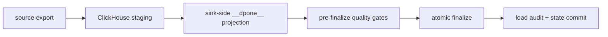
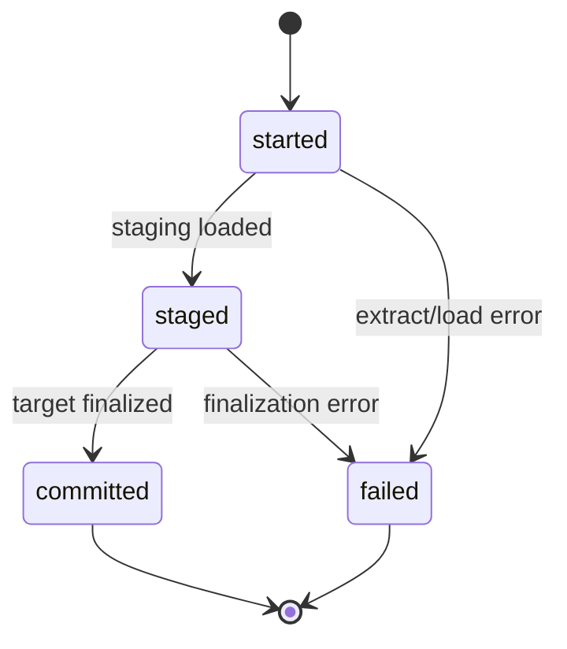
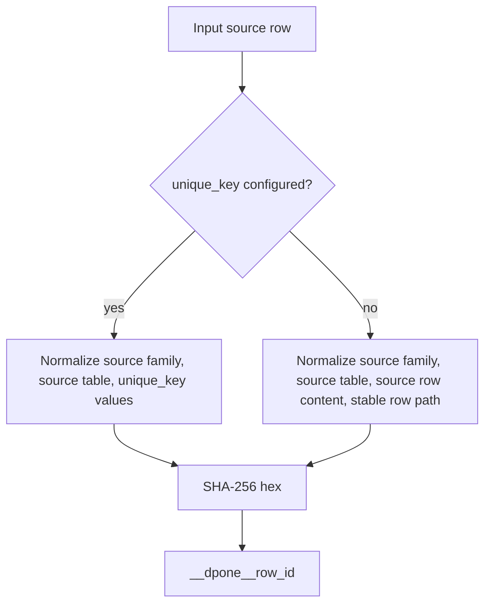
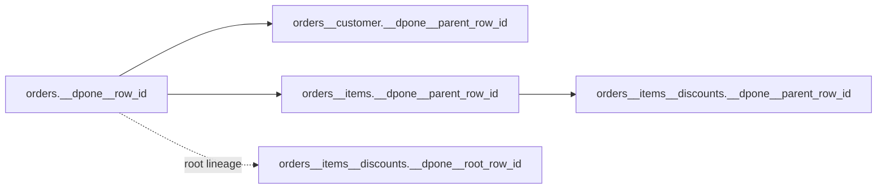

# Load lineage and technical columns

`dpone` uses canonical framework metadata columns to make loads auditable,
retry-safe, and debuggable across database, API, and Kafka pipelines.

The rule is simple: framework-owned columns always use the `__dpone__*`
namespace. User data should not create columns with this prefix.

## Quick start

Default lineage is enabled and uses the `standard` preset plus quarantine
support:

```yaml
sink:
  options:
    lineage:
      enabled: true
      preset: standard
      features:
        quarantine: true
```

Disable target lineage columns explicitly when you need a strict legacy target
shape:

```yaml
sink:
  options:
    lineage: false
```

Set defaults once in batch manifests:

```yaml
defaults:
  sink:
    options:
      lineage:
        enabled: true
        preset: standard
        features:
          operations: true
          quarantine: true
```

## Presets and features

Presets are not mutually exclusive modes. They are starting points. Features
can be enabled or disabled on top of a preset.

| Preset | Target columns |
| --- | --- |
| `off` | none |
| `minimal` | `__dpone__load_id`, `__dpone__loaded_at` |
| `bulk_standard` | `__dpone__run_id`, `__dpone__load_id`, `__dpone__loaded_at`, `__dpone__extracted_at` |
| `standard` | `minimal` plus `__dpone__row_id`, `__dpone__extracted_at` |
| `debug` | `standard` plus operation and diagnostics columns |
| `hierarchical` | `standard` plus parent/root/list index columns |

| Feature | Adds |
| --- | --- |
| `identity` | `__dpone__load_id`, `__dpone__loaded_at` |
| `row_identity` | `__dpone__row_id`, `__dpone__extracted_at` |
| `hierarchy` | `__dpone__parent_row_id`, `__dpone__root_row_id`, `__dpone__list_index` |
| `operations` | `__dpone__op` |
| `diagnostics` | `__dpone__meta` |
| `quarantine` | rejected rows go to state quarantine storage, not to the target table |

For dlt-like splitting of nested JSON into root and child tables, see
[Nested normalization](nested-normalization.md). The `hierarchical` preset is
the lineage contract used by that runtime path.

Example: standard lineage with operation and diagnostics columns:

```yaml
sink:
  options:
    lineage:
      enabled: true
      preset: standard
      features:
        operations: true
        diagnostics: true
        quarantine: true
```

## Canonical technical columns

| Column | Purpose | Type contract |
| --- | --- | --- |
| `__dpone__loaded_at` | UTC time when the load package wrote the row | timestamp |
| `__dpone__deleted_at` | UTC time when key reconciliation first detected the current absence | nullable timestamp |
| `__dpone__is_deleted` | Derived/current deletion state when the selected soft-delete mode exposes a flag | boolean |
| `__dpone__xmin` | PostgreSQL XMin checkpoint value when materialized | bigint/string by sink |
| `__dpone__deleted_marker` | Physical delete reconciliation marker | boolean/integer by sink |
| `__dpone__run_id` | One process execution identifier | ULID string, 26 chars |
| `__dpone__load_id` | One target load package identifier | ULID string, 26 chars |
| `__dpone__row_id` | Deterministic row lineage identity | SHA-256 hex, 64 chars |
| `__dpone__parent_row_id` | Parent row identity for normalized nested data | SHA-256 hex, 64 chars |
| `__dpone__root_row_id` | Root row identity for normalized nested data | SHA-256 hex, 64 chars |
| `__dpone__list_index` | Stable list position for normalized nested arrays | integer |
| `__dpone__op` | Normalized operation marker such as insert/update/delete | string |
| `__dpone__meta` | Optional row diagnostics | JSON/object |
| `__dpone__row_hash` | Business row hash for diff/SCD2 strategies | SHA-256 hex, 64 chars |

For SQL Server, fixed-length ASCII framework values (ULIDs and SHA-256 hex)
have an explicit storage-compatibility contract: exact-width `char(N)` and
`varchar(N)` are interchangeable only for the corresponding `__dpone__`
roles. Business columns, Unicode families, and different widths remain exact
schema changes and fail closed when schema evolution is disabled.
| `__dpone__valid_from_at` | SCD2 validity start timestamp | timestamp |
| `__dpone__valid_to_at` | SCD2 validity end timestamp | nullable timestamp |
| `__dpone__is_current` | SCD2 current row flag | boolean |
| `__dpone__extracted_at` | UTC start of the source extraction window | timestamp |

Legacy names such as `meta__load_dtm`, `meta__update_dtm`,
`meta__delete_dtm`, `meta__xmin`, and `__dpone_deleted_marker` are accepted
only through compatibility resolution.
New tables should use canonical names only.

For key-snapshot reconciliation, `__dpone__deleted_at` is detection time, not
the unknown source delete-event time. The default `timestamp_only` mode exposes
only that column. `timestamp_and_flag` derives a persisted
`__dpone__is_deleted` value from the timestamp, so the timestamp remains the
single source of truth. `flag_only` exposes only the boolean and cannot answer
when absence was detected. Repeated absence keeps the original timestamp;
reactivation clears it; a later absence receives a new UTC timestamp.

## Native and bulk staged projection

Row artifacts are still enriched by `RowLineageEnricher` before loading. Bulk
artifacts such as files, byte streams, physical chunks, RowBinary and
ClickHouse Native blocks are different: dpone must not materialize rows in
Python just to add metadata. For staged sinks, the runtime now projects lineage
inside the sink before finalization.

`__dpone__extracted_at` comes from the source lifecycle's
`extraction_started_at`; it is not copied from load-audit start time and a
generic adapter does not relabel it as a database snapshot. On governed MSSQL
routes, `__dpone__loaded_at` is captured with `SYSUTCDATETIME()` inside the
target transaction. Source and target clocks are independent, so dpone checks
monotonicity only within each clock authority and does not enforce
`extracted_at <= loaded_at`.



When lineage is enabled on a ClickHouse native/bulk route, dpone always projects
the core columns:

- `__dpone__run_id`
- `__dpone__load_id`
- `__dpone__loaded_at`
- `__dpone__extracted_at`

`__dpone__row_id` is emitted only when deterministic:

- `unique_key` is configured, or
- a future certified `business_hash` policy supports every target type.

No load-order or chunk-order row id is generated. In advisory mode dpone records
`row_identity_unique_key_missing`; with `row_identity.unsupported_policy: fail`
the load fails before finalization.

```yaml
sink:
  options:
    lineage:
      enabled: true
      preset: bulk_standard
      row_identity:
        mode: auto
        unsupported_policy: warn
```

## Load audit table

State backends can store load package lifecycle records in a technical schema,
for example `ops.__dpone__loads`. Keep these tables outside business schemas
when your warehouse conventions separate runtime metadata from marts.



State advancement happens only after the load audit status reaches
`committed`.

For ClickHouse and SQL Server sinks, enable OSS runtime-managed audit tables
with:

```yaml
sink:
  options:
    load_governance:
      audit:
        enabled: true
        state_schema: ops
        loads_table: __dpone__loads
        steps_table: __dpone__load_steps
```

`__dpone__loads` records the load package state. `__dpone__load_steps` records
pre-hook, staging, lineage projection, quality, finalization and failure steps.
Both tables are created by dpone runtime when the target connector is
ClickHouse or SQL Server; Airflow DAGs do not need custom governance helpers.
For SQL Server, the connection's `database` selects the database and
`state_schema` selects only the schema inside that database. For example, a
connection whose default database is `Example_System` and `state_schema: dbo`
materializes `[Example_System].[dbo].[__dpone__loads]` and
`[Example_System].[dbo].[__dpone__load_steps]`. Do not put a database name in
`state_schema`.

For ClickHouse, `sink.staging.schema` is also the canonical database for
dpone-managed sink-side artifacts: staging, decoded, projected, shadow and
backup tables. Without an explicit `sink.staging.schema`, ClickHouse preserves
the historical same-database behavior. To move runtime artifacts into a
technical database, configure both staging and audit:

```yaml
sink:
  staging:
    schema: ops
  options:
    load_governance:
      audit:
        enabled: true
        state_schema: ops
```

| Status | Meaning |
| --- | --- |
| `started` | Run/load IDs were created and extraction is about to execute |
| `staged` | Source payload was materialized into staging or producer batch |
| `committed` | Sink finalization succeeded and state can advance |
| `failed` | The load package failed; state must not advance |
| `cancelled` | Reserved for cooperative cancellation flows |

MSSQL key-snapshot audit rows preserve finalizer counters without deriving
them from target row-count deltas:

| Audit column | MSSQL type | Meaning |
| --- | --- | --- |
| `inserted_rows` / `updated_rows` | `bigint NULL` | New keys and changed active keys |
| `reactivated_rows` / `unchanged_rows` | `bigint NULL` | Returned tombstones and strict no-ops |
| `soft_deleted_rows` / `hard_deleted_rows` | `bigint NULL` | Disjoint delete actions in this commit |
| `active_rows` / `total_rows` | `bigint NULL` | Active keys and all retained target rows after commit |
| `commit_receipt_id` | `nvarchar(128) NULL` | Receipt proving target/checkpoint atomic commit |
| `commit_outcome` | `nvarchar(64) NULL` | `committed` or `committed_after_receipt_probe` |

The legacy nullable `loaded_rows` and `deleted_rows` columns remain populated
for compatibility (`deleted_rows` mirrors `soft_deleted_rows`); new consumers
must use the disjoint columns above. External MSSQL provisioning must include
all of them before a workload run passes state preflight.

## Row identity algorithm

`__dpone__row_id` is deterministic across retries. It does not include
retry-specific values such as `__dpone__load_id` or `__dpone__loaded_at`.



Preferred input is:

```text
source_type + source_schema + source_table + normalized unique_key values
```

Fallback input is:

```text
source_type + source_schema + source_table + normalized source row content + stable row path
```

Use a `unique_key` whenever possible. Fallback identity is deterministic for
stable extract ordering, but a business key is more robust for retries,
backfills, and source-side ordering changes.

## Nested hierarchy relationship

Nested normalization uses the same row identity service and adds parent/root
relationships:



Join child rows back to parent rows with:

```sql
child.__dpone__parent_row_id = parent.__dpone__row_id
```

See [Nested normalization](nested-normalization.md) for table naming, scalar
arrays, configuration, processor behavior, and runbooks.

## Strategy interaction

| Strategy | Lineage usage |
| --- | --- |
| `full_refresh` | Writes one `load_id` for the load package and row IDs when enabled |
| `incremental_append` | Uses row IDs for audit/debug and source cursor state for checkpointing |
| `incremental_merge` | Uses `unique_key` for target finalization; row IDs remain lineage IDs, not business keys |
| `snapshot_diff` | Uses `__dpone__row_hash` to detect changed rows |
| `scd2` | Uses `__dpone__valid_from_at`, `__dpone__valid_to_at`, `__dpone__is_current`, and `__dpone__row_hash` |
| `cdc_apply` | Uses `__dpone__op` when operation tracking is enabled |
| `backfill` | Uses one `run_id` and multiple `load_id` values for chunks |

See [Load strategies](load-strategies.md) for the execution algorithms.

## Implementation map

| Concept | Code |
| --- | --- |
| Technical column catalog | [`src/dpone/contracts/technical_columns.py`](https://github.com/PaulKov/dpone/blob/master/src/dpone/contracts/technical_columns.py) |
| Lineage option resolution | [`src/dpone/runtime/lineage/options.py`](https://github.com/PaulKov/dpone/blob/master/src/dpone/runtime/lineage/options.py) |
| Row ID and ULID generation | [`src/dpone/runtime/lineage/identity.py`](https://github.com/PaulKov/dpone/blob/master/src/dpone/runtime/lineage/identity.py) |
| Row enrichment | [`src/dpone/runtime/lineage/enrichment.py`](https://github.com/PaulKov/dpone/blob/master/src/dpone/runtime/lineage/enrichment.py) |
| Nested normalization | [`src/dpone/runtime/normalization/normalizer.py`](https://github.com/PaulKov/dpone/blob/master/src/dpone/runtime/normalization/normalizer.py) |
| Load lifecycle service | [`src/dpone/runtime/lineage/audit.py`](https://github.com/PaulKov/dpone/blob/master/src/dpone/runtime/lineage/audit.py) |
| Staged governance coordinator | [`src/dpone/runtime/governance/finalization.py`](https://github.com/PaulKov/dpone/blob/master/src/dpone/runtime/governance/finalization.py) |
| ClickHouse sink-side projection | [`src/dpone/runtime/sinks/clickhouse_lineage_projection.py`](https://github.com/PaulKov/dpone/blob/master/src/dpone/runtime/sinks/clickhouse_lineage_projection.py) |
| Processor lifecycle integration | [`src/dpone/runtime/etl/processor.py`](https://github.com/PaulKov/dpone/blob/master/src/dpone/runtime/etl/processor.py) |

## Runbooks

### Target rejects `__dpone__*` columns

1. Confirm the target table allows schema evolution or pre-create the lineage
   columns manually.
2. If this is a strict legacy target, set `sink.options.lineage: false`.
3. Keep run artifacts and `__dpone__loads` enabled through state storage when
   possible, even if target row lineage is disabled.

### Row identity changes unexpectedly

1. Prefer an explicit `sink.strategy.unique_key` for merge/diff/SCD2 flows.
2. Check whether the source extract ordering changed when no `unique_key` is
   configured.
3. Compare source row content before enrichment. Retry-specific lineage fields
   are intentionally excluded from `__dpone__row_id`.

### Legacy target already has `meta__*` columns

1. Use `technical_columns_naming: legacy_compat` for one deprecation window.
2. Plan a migration to canonical `__dpone__*` names.
3. Do not create new `meta__*`, `*_dtm`, or `*_dttm` framework columns.
