# Load strategies

This guide explains how `dpone` load strategies work, which source/sink combinations support them, and which guide to copy from when building a manifest.

## Table of contents

- [`full_refresh`](#full_refresh)
- [`incremental_append`](#incremental_append)
- [`incremental_merge`](#incremental_merge)
- [`replace`](#replace)
- [`partition_replace`](#partition_replace)
- [`snapshot_diff`](#snapshot_diff)
- [`scd2`](#scd2)
- [`cdc_apply`](#cdc_apply)
- [`backfill`](#backfill)
- [`xmin`](#xmin)
- [`cdc`](#cdc)
- [`snapshot_reconciliation`](#snapshot_reconciliation)
- [Strategy Intelligence](#strategy-intelligence)
- [Semantics-first selection policy](#semantics-first-selection-policy)
- [Strategy support matrix](#strategy-support-matrix)
- [Cross-links](#cross-links)

## Strategy Intelligence

Use [Strategy Intelligence](strategy-intelligence.md) when you want `dpone` to recommend and explain a safe target-native strategy instead of choosing one manually.

```bash
dpone strategy advise orders.yaml --estimated-rows 50000000 --changed-percent 0.2 --delete-percent 0.05
```

The advisor explains the chosen strategy, merge policy, native fast path, adaptive batch plan, safety gates, and repair commands. It is plan-only in v1: it does not touch sources, sinks, credentials, or state.

## Semantics-first selection policy

Choose the strategy from the source change contract before tuning transport.
The fastest strategy that can silently omit updates or deletes is not an
optimization.

| Source contract | Preferred strategy | Required proof | Do not substitute |
|---|---|---|---|
| Immutable events with a durable monotonic source offset | `incremental_append` | Source-owned checkpoint, retry-safe boundary, explicit NULL/equality semantics | Target `MAX(column) + >` |
| Keyed updates with a complete changed-row boundary | `incremental_merge` | Stable `unique_key`, update/delete semantics, atomic checkpoint | A key without a trustworthy source boundary |
| Complete recomputed date or tenant window | `partition_replace` or `replace` | Exact target scope, completeness, late-arrival horizon plus margin | Staging values when an expected empty partition must be deleted |
| Complete current snapshot with physical-delete convergence | `snapshot_diff` | Snapshot boundary, complete key set, delete policy | Incremental merge without tombstones/key reconciliation |
| Ordered business history | `scd2` | Business key, row hash, validity policy, delete semantics | Repeated full snapshots without history contract |
| Actual log-based insert/update/delete stream | `cdc_apply` | Source offsets, operation/tombstone semantics, ordered idempotency | Polling described as CDC |
| Bootstrap, repair, small table, or no safer boundary | `full_refresh` | Complete source boundary and atomic target publication | Blind daily reload of a large mutable fact |

Transport is selected second. For SQL Server targets the implemented bulk path
is a bounded-memory source stream, one immutable spool artifact, one
verified BCP import into a heap stage, set-based native projection, and a short
target transaction. The exact route remains `UNVERIFIED` until its live gate is
complete. Source fetch size and BCP transaction batch are independent controls;
neither should multiply spool files or BCP processes.

## Strategy support matrix

| Strategy | Best for | Core requirement | Source/sink examples |
|---|---|---|---|
| `full_refresh` | Small or bounded complete reloads | Safe staging or shadow-table finalization | [Postgres -> MSSQL](source-sink/postgres-to-mssql.md), [REST API -> BigQuery](source-sink/api-to-bigquery.md) |
| `incremental_append` | Append-only facts and events | Monotonic cursor or bounded source batch | [Kafka -> ClickHouse](source-sink/kafka-to-clickhouse.md), [MSSQL -> Kafka](source-sink/mssql-to-kafka.md) |
| `incremental_merge` | Upserts by business key | `unique_key` and set-based finalization | [MSSQL -> MSSQL](source-sink/mssql-to-mssql.md), [MySQL -> MSSQL](source-sink/mysql-to-mssql.md) |
| `replace` | Rebuilding one partition or predicate window | Replace predicate or bounded time window | [REST API -> Postgres](source-sink/api-to-postgres.md), [ClickHouse -> BigQuery](source-sink/clickhouse-to-bigquery.md) |
| `partition_replace` | Recomputing changed table partitions | Target partition metadata and `partition.column` | [MSSQL -> ClickHouse](source-sink/mssql-to-clickhouse.md), [Postgres -> BigQuery](source-sink/postgres-to-bigquery.md) |
| `snapshot_diff` | Snapshot-to-target diff with physical delete support | `unique_key` and `__dpone__row_hash` | [Postgres -> MSSQL](source-sink/postgres-to-mssql.md), [MSSQL -> Postgres](source-sink/mssql-to-postgres.md) |
| `scd2` | Dimension history with current/expired versions | `unique_key`, row hash, validity columns | [Postgres -> BigQuery](source-sink/postgres-to-bigquery.md), [MSSQL -> MSSQL](source-sink/mssql-to-mssql.md) |
| `cdc_apply` | Applying normalized insert/update/delete events | CDC offsets and operation semantics | [Postgres -> Kafka](source-sink/postgres-to-kafka.md), [MSSQL -> ClickHouse](source-sink/mssql-to-clickhouse.md) |
| `backfill` | Resumable historical reloads split into chunks | chunk config and inner mode | [Postgres -> ClickHouse](source-sink/postgres-to-clickhouse.md), [MSSQL -> BigQuery](source-sink/mssql-to-bigquery.md) |
| `xmin` | Postgres transaction-ID incremental loads | Postgres source and XMin state | [Postgres -> MSSQL](source-sink/postgres-to-mssql.md), [Postgres -> ClickHouse](source-sink/postgres-to-clickhouse.md) |
| `cdc` | Change-event replication | Source-specific CDC reader and offset state | [Postgres -> Kafka](source-sink/postgres-to-kafka.md), [MSSQL -> ClickHouse](source-sink/mssql-to-clickhouse.md) |
| `snapshot_reconciliation` | Physical delete detection | Snapshot key set and configured delete policy | [Postgres -> MSSQL](source-sink/postgres-to-mssql.md), [MSSQL -> ClickHouse](source-sink/mssql-to-clickhouse.md) |

## `full_refresh`

Use `full_refresh` when the selected source boundary can be reloaded completely.

```yaml
sink:
  type: mssql
  table: {schema: landing, name: orders}
  strategy:
    mode: full_refresh
  options:
    bulk:
      mode: bcp
```

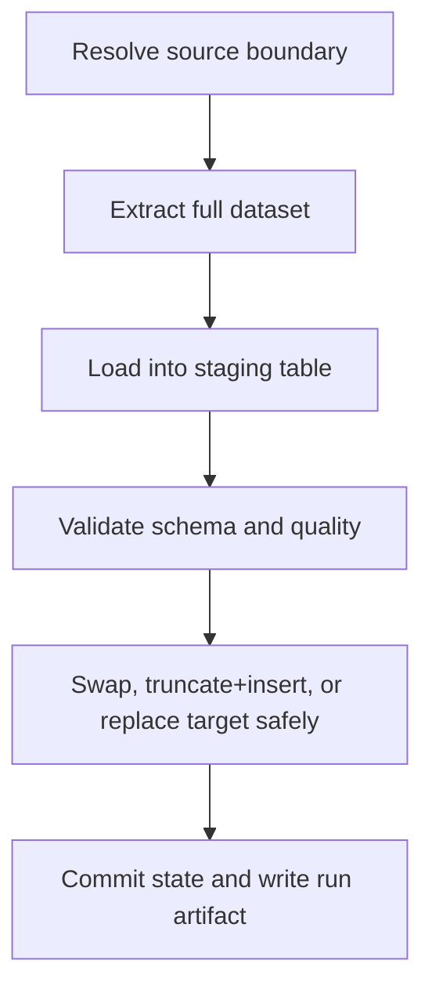

Algorithm:

1. Resolve all manifest and registry defaults.
2. Extract the full configured source boundary.
3. Load into staging or shadow target.
4. Run quality gates before finalization when possible.
5. Replace the final target using the sink-native safe path.
6. Advance state only after finalization succeeds.

For MSSQL, an existing business object is preserved: the fast path bulk-loads
a disposable heap, performs typed/lineage projection set-wise, then uses
`TRUNCATE` plus `INSERT ... WITH (TABLOCK) SELECT` inside the governed target
transaction. This avoids row-by-row writes and extra projection scans without
silently replacing permissions, dependencies, indexes, constraints, or object
identity. Minimal logging is conditional on SQL Server recovery model, target
shape, locking, and engine rules; dpone does not claim or force it.

On ClickHouse -> MSSQL table extracts, the completed stream row count is the
source authority. The route therefore skips a separate preflight `COUNT(*)`
that would scan the complete source twice. Required acceptance can still issue
an independent post-publication query against the explicitly bound target
database.

Copy from [Postgres -> MSSQL](source-sink/postgres-to-mssql.md) or [REST API -> BigQuery](source-sink/api-to-bigquery.md).

## `incremental_append`

Use `incremental_append` for append-only streams, event logs, and facts where existing target rows are never updated.

```yaml
source:
  options:
    incremental_column: updated_at
sink:
  strategy:
    mode: incremental_append
```

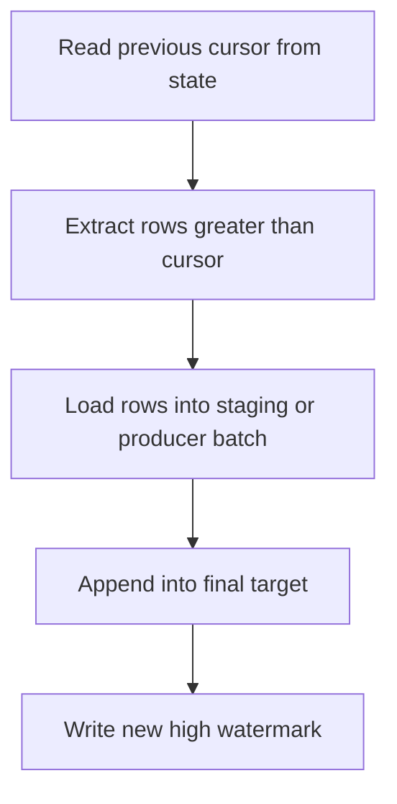

Algorithm:

1. Read the previous cursor or offset from state.
2. Build a bounded incremental extract.
3. Load the extracted rows through the target-native fast path.
4. Append only; do not update or delete existing target rows.
5. Commit the new cursor after sink success.

Copy from [Kafka -> ClickHouse](source-sink/kafka-to-clickhouse.md) or [MSSQL -> Kafka](source-sink/mssql-to-kafka.md).

## `incremental_merge`

Use `incremental_merge` when source rows may update previously loaded target rows.

```yaml
sink:
  strategy:
    mode: incremental_merge
    unique_key: order_id
    merge_policy: auto
    duplicate_policy: fail
```

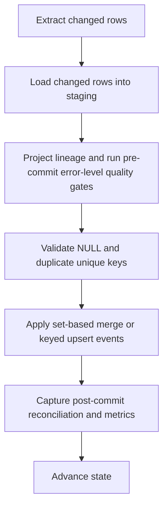

Algorithm:

1. Extract a bounded changed-row set.
2. Load into staging first.
3. Project lineage and run pre-commit error-level quality gates against the
   staged dataset.
4. Validate staging duplicates by `unique_key`; v1 default is
   `duplicate_policy: fail`. ClickHouse first rejects NULL in every key
   component, then rejects duplicate key groups on the exact post-lineage table
   before finalizer target lookup or mutation.
5. Resolve `merge_policy: auto` to the sink default.
6. Finalize by target-native policy.
7. Capture post-commit reconciliation/acceptance metrics and persist state only
   after success. These metrics do not replace the pre-commit error-level gates.

Policy matrix:

| Sink | `auto` resolves to | Other supported policies | Notes |
|---|---|---|---|
| MSSQL | `delete_insert` | `shadow_swap` | `delete_insert` runs `DELETE target WHERE EXISTS staging keys`, then `INSERT FROM staging` in one transaction. |
| Postgres | `delete_insert` | `shadow_swap` | `shadow_swap` rebuilds a full shadow table, then renames target/shadow. |
| BigQuery | `delete_insert` | `shadow_swap` | `shadow_swap` uses CTAS + table rename and fails if BigQuery rename restrictions apply. |
| ClickHouse | `lightweight_delete_insert` | `shadow_swap`, `mutation_delete_insert` | `mutation_delete_insert` requires `allow_non_recommended_policy: true`. |
| Kafka | `event_upsert` | none | Kafka emits keyed upsert/delete events and never mutates a topic. |

SQL shape examples:

```sql
-- MSSQL/Postgres/BigQuery delete_insert shape
DELETE FROM target
WHERE EXISTS (SELECT 1 FROM staging WHERE staging.id = target.id);

INSERT INTO target (...)
SELECT ... FROM staging;
```

```sql
-- ClickHouse default lightweight_delete_insert shape
DELETE FROM target
WHERE id IN (SELECT id FROM staging)
SETTINGS mutations_sync = 1;

INSERT INTO target
SELECT * FROM staging;
```

```sql
-- Shadow swap shape
CREATE TABLE shadow AS target;
INSERT INTO shadow SELECT * FROM target WHERE NOT EXISTS (...staging keys...);
INSERT INTO shadow SELECT * FROM staging;
RENAME target TO backup, shadow TO target;
DROP TABLE backup;
```

Copy from [MSSQL -> MSSQL](source-sink/mssql-to-mssql.md) or [Postgres -> Postgres](source-sink/postgres-to-postgres.md).

## `replace`

Use `replace` to rebuild a bounded target slice such as a date partition or API window.

```yaml
sink:
  strategy:
    mode: replace
    custom_predicate: "business_date between '2026-01-01' and '2026-01-02'"
```

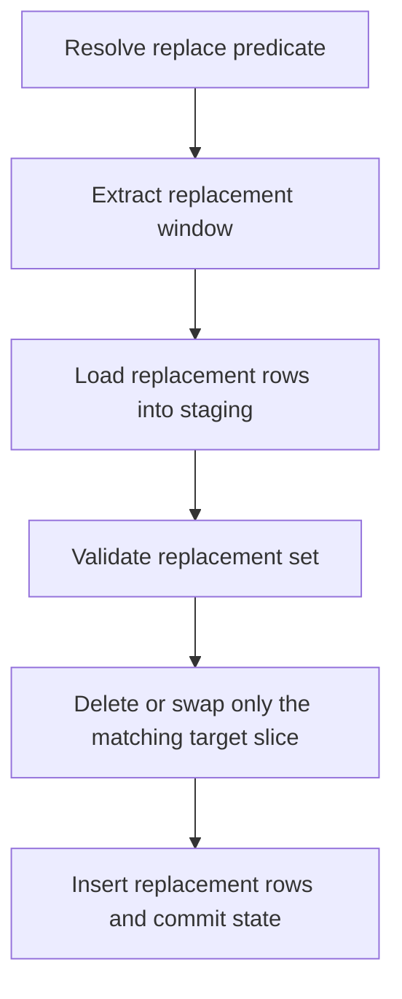

Algorithm:

1. Resolve the bounded replacement predicate.
2. Extract the replacement window.
3. Load into staging.
4. Validate row counts and key uniqueness.
5. Replace only the matching slice through sink-native finalization.
6. Commit state and run artifact.

Copy from [REST API -> Postgres](source-sink/api-to-postgres.md) or [ClickHouse -> BigQuery](source-sink/clickhouse-to-bigquery.md).

## `partition_replace`

Use `partition_replace` when the source can produce a complete bounded partition slice and the target should replace exactly those partitions.

```yaml
sink:
  strategy:
    mode: partition_replace
    partition:
      column: business_date
      values_from_staging: true
      max_partitions_per_run: 64
      native_mode: auto
```

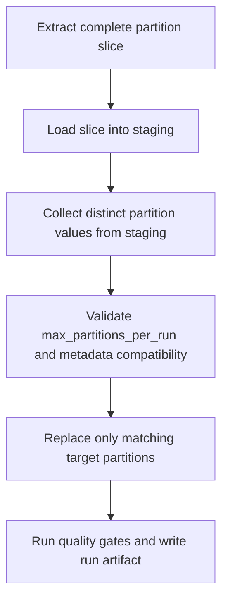

Algorithm:

1. Extract a complete partition slice from the source.
2. Load rows into staging first.
3. Read distinct `partition.column` values from staging.
4. Validate `max_partitions_per_run` and target partition compatibility.
5. Apply sink-native replacement where capability checks pass.
6. ClickHouse uses `ALTER TABLE ... REPLACE PARTITION ... FROM staging` when staging metadata is compatible.
7. BigQuery uses query job destination partition decorators with `WRITE_TRUNCATE` for time partitions.
8. Postgres uses declarative partition `DETACH PARTITION` / `ATTACH PARTITION` after resolving existing partition bounds.
9. MSSQL uses `ALTER TABLE ... SWITCH PARTITION` when target, staging, indexes, partition function, and pre-created switch-out tables are aligned.
10. Commit state and run artifacts only after success.

Support matrix:

| Sink | Status | Finalization |
|---|---|---|
| ClickHouse | Supported | Native `ALTER TABLE target REPLACE PARTITION ... FROM staging` when staging is created from target metadata. |
| BigQuery | Supported | Native time-partition overwrite through destination partition decorator + `WRITE_TRUNCATE`; fallback is partition-scoped delete/insert. |
| Postgres | Supported | Native declarative partition detach/attach when existing partition bounds are resolvable; fallback is partition-scoped delete/insert. |
| MSSQL | Supported | Native `ALTER TABLE ... SWITCH PARTITION` when metadata is aligned and switch-out tables are pre-created; fallback is partition-scoped delete/insert. |
| Kafka | Not supported | Kafka topics are append-only logs; use keyed events instead. |

Operational warnings:

- `partition_replace` is not an incremental cursor. The source must emit a complete replacement slice.
- The strategy should be used only for partitioned targets or targets with a strong partition column convention.
- Keep `max_partitions_per_run` conservative to avoid accidental large rewrites.
- Use `native_mode: required` for certified production tables where fallback would be too blocking.
- Use `native_mode: fallback` when you intentionally want predicate delete/insert and no metadata switch.
- `values_from_staging: true` cannot identify an expected partition that is
  completely empty in the new source slice. Do not claim physical-delete
  completeness for that case until the run carries an exact boundary-owned
  target scope; use `replace` with a certified scope or fail the acceptance.
- For Kafka sinks, this strategy fails fast with a clear diagnostic.

## `snapshot_diff`

Use `snapshot_diff` when the source can emit a bounded current snapshot and the target must converge to that snapshot, including physical deletes.

```yaml
sink:
  strategy:
    mode: snapshot_diff
    unique_key: [order_id]
    diff:
      compare: row_hash
      delete_policy: hard_delete
```

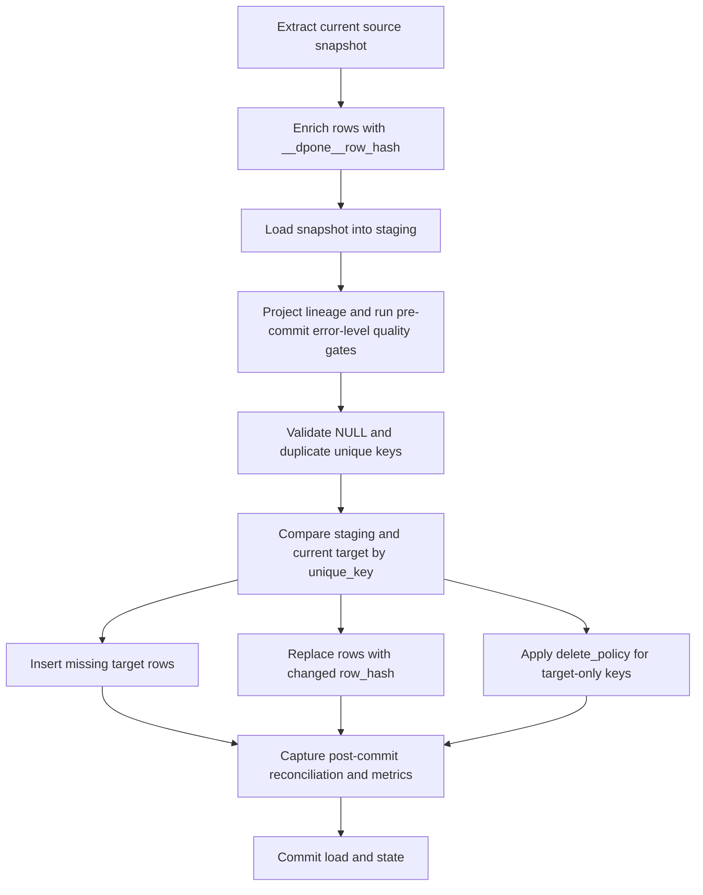

Algorithm:

1. Extract a complete bounded source snapshot.
2. Compute or pass through `__dpone__row_hash` for business columns.
3. Load the snapshot into staging.
4. Project lineage and run pre-commit error-level quality gates against the
   staged snapshot.
5. For ClickHouse, reject NULL key components and duplicate key groups in
   the exact post-lineage finalization table before finalizer target lookup or
   mutation.
6. Compare target and staging by `unique_key`.
7. Insert new keys and update changed keys through the sink-native staged finalizer.
8. Apply `delete_policy` for keys that exist in target but not in staging.
9. Capture post-commit reconciliation/acceptance metrics, then write the load
   audit, run artifact, and state. These metrics do not replace the pre-commit
   error-level gates.

DB-native finalizers:

| Sink | `snapshot_diff` finalizer | Delete policies |
|---|---|---|
| Postgres | staging duplicate check, target-only key cleanup, delete+insert changed keys in one transaction | `hard_delete`, `soft_delete`, `ignore` |
| MSSQL | staging duplicate check, target-only key cleanup, `DELETE t ... WHERE EXISTS` plus staged insert | `hard_delete`, `soft_delete`, `ignore` |
| BigQuery | staging duplicate check, target-only key cleanup, partition-safe DML delete+insert | `hard_delete`, `soft_delete`, `ignore` |
| ClickHouse | staging-first finalizer (`lightweight_delete_insert` default; optional `shadow_swap` / `mutation_delete_insert`); soft-delete via `ALTER UPDATE` | `hard_delete`, `soft_delete`, `ignore` |
| Kafka | emits keyed upsert/delete events; it does not mutate a target table | envelope/delete config |

Use [Load lineage](load-lineage.md) to understand `__dpone__row_hash` and row identity. Use `snapshot_diff` only when the source snapshot boundary is complete; otherwise prefer `incremental_merge` plus reconciliation or CDC.

## `scd2`

Use `scd2` when the target must preserve a full history of dimensional changes.

```yaml
sink:
  strategy:
    mode: scd2
    unique_key: [customer_id]
    scd2:
      valid_from_column: "__dpone__valid_from_at"
      valid_to_column: "__dpone__valid_to_at"
      current_flag_column: "__dpone__is_current"
      row_hash_column: "__dpone__row_hash"
      delete_policy: expire
```

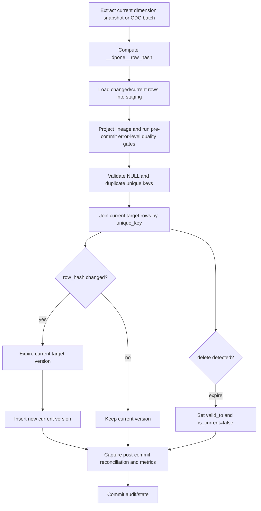

Algorithm:

1. Load the source snapshot or CDC batch into staging.
2. Project lineage and run pre-commit error-level quality gates against the
   staged dataset.
3. Deduplicate by `unique_key` according to the strategy duplicate policy. For
   ClickHouse, first reject NULL key components and duplicate key groups in
   the exact post-lineage finalization table before finalizer target lookup or
   mutation.
4. Compare staging rows with target current rows by `__dpone__row_hash`.
5. Expire changed current rows by setting `__dpone__valid_to_at`.
6. Insert a new current row with `__dpone__valid_from_at` and `__dpone__is_current=true`.
7. Apply delete policy. The default `expire` keeps history and closes the current record.
8. Capture post-commit reconciliation/acceptance metrics and commit state only
   after SCD2 finalization succeeds. These metrics do not replace the
   pre-commit error-level gates.

For the ClickHouse gates in all three strategies, NULL uses
`DPONE_CLICKHOUSE_STAGING_UNIQUE_KEY_NULL` and duplicates use
`DPONE_CLICKHOUSE_STAGING_UNIQUE_KEY_DUPLICATE`. The target and checkpoint stay
untouched. Cleanup is attempted for every attempt-local staging table even if
an earlier drop fails. The failed load step records their identities and
`cleanup_status`; follow the
[cleanup verification](dbt-self-service-runbook.md#verify-clickhouse-attempt-cleanup)
before retrying.

DB-native finalizers:

| Sink | `scd2` finalizer | Delete policy |
|---|---|---|
| Postgres | expires changed current rows with `UPDATE ... FROM staging`, inserts new current versions with `NOT EXISTS` | `expire`, `ignore` |
| MSSQL | expires changed current rows with set-based `UPDATE ... FROM`, inserts new current versions from staging | `expire`, `ignore` |
| BigQuery | expires changed current rows with DML, inserts current versions from staging | `expire`, `ignore` |
| ClickHouse | expire currents with synchronous `ALTER UPDATE`, insert new current versions from staging | `expire`, `ignore` |
| Kafka | not a table-history sink; use keyed change events instead | not supported |

SCD2 is for database sinks: MSSQL, Postgres, ClickHouse, and BigQuery. Kafka sinks should use keyed change events instead.

## `cdc_apply`

Use `cdc_apply` when the source emits normalized insert/update/delete events with an offset that must be committed only after sink success.

```yaml
sink:
  strategy:
    mode: cdc_apply
    unique_key: [order_id]
    cdc:
      delete_policy: apply
      operation_column: "__dpone__op"
```

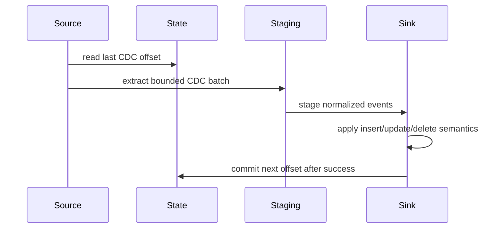

Algorithm:

1. Read source-specific CDC offset from state.
2. Extract a bounded CDC batch.
3. Normalize operations to insert/update/delete semantics.
4. Load events into staging first.
5. Apply events through the sink-native staged finalizer.
6. Persist the next offset only after the sink finalization succeeds.

See [Reconciliation and CDC](cdc.md) for Postgres logical replication, MSSQL CDC/Change Tracking, Kafka CDC envelopes, offset state, and runbooks.

## `backfill`

Use `backfill` for large historical reloads that must be resumable and split into deterministic chunks.

For a large PostgreSQL-to-MSSQL first load, use `inner_mode:
incremental_append` with `publication.mode: shadow_swap`, target-atomic MSSQL
state and a unique key. Four fixed lanes append disjoint chunks to an isolated
shadow; target receipts close the commit-before-ledger crash gap, exact
validation precedes an atomic live/backup swap, and the incremental XMin
handoff follows publication. Do not use per-chunk `incremental_merge` for this
initial phase. See [Backfill](backfill.md#large-postgresql-to-mssql-initial-load).

```yaml
sink:
  strategy:
    mode: backfill
    backfill:
      inner_mode: partition_replace
      chunk:
        column: business_date
        from: "2025-01-01"
        to: "2025-12-31"
        step: 1d
      parallel_workers: 4
```

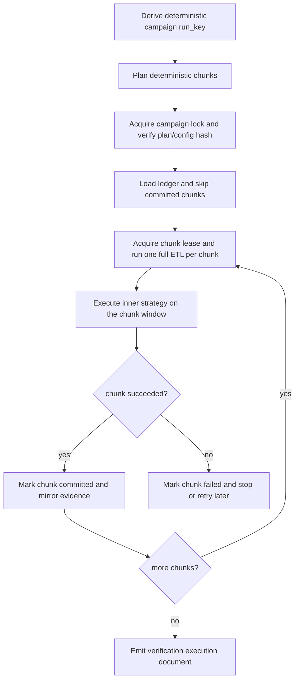

Algorithm:

1. Derive one deterministic campaign key (`run_key`) from the dataset and chunk configuration.
2. Build deterministic chunks from the configured column and range (`date`/`timestamp` kinds use half-open `>= start AND < end` windows; `integer` kind uses inclusive windows).
3. Execute each chunk as a complete ETL run — extraction bounded by the chunk predicate, load delegated to `inner_mode` — with its own `run_id`/`load_id` and audit record.
4. Persist chunk status in a durable ledger (`.dpone/backfill/<run_key>.json`, override with `backfill.state_dir` or `DPONE_BACKFILL_STATE_DIR`; mirror to SQL with `backfill.state.backend: audit_schema`).
5. Acquire the campaign lock before source IO so duplicate active runs cannot race the same ledger.
6. Acquire chunk leases before source IO; stale running chunks become retryable after lease expiry.
7. Mark each chunk committed or failed independently. A sequential campaign
   stops on the first failure. Parallel fixed lanes are work-conserving: each
   lane takes the next pending chunk immediately after its current durable
   boundary. Once any lane reports failure, a shared stop token prevents new
   claims while already executing lanes finish truthfully. Chunks not claimed
   in the durable ledger remain resumable.
8. Resume every non-committed chunk only with the same frozen execution-policy digest.
9. Retry only failed chunks when the campaign's frozen `retry_policy` is `failed_only`.
10. After the last chunk commits, emit a verification bridge document (`<run_key>.execution.json`) consumable by `dpone ops route-refresh-capture-snapshots` / `route-refresh-verify`.

Backfill is a wrapper strategy. It does not change source/sink semantics; it adds chunking, auditability, and resumability on top of an inner strategy. Without a `chunk` block the whole payload is delegated once to `inner_mode` (single-shot backfill).

The runtime normalizes `inner_mode`, `parallel_workers`, `chunk`,
`max_chunks`, `state`, `state_dir`, `retry_policy`, `backfill_id`,
`predicate_dialect`, and `lease_ttl_minutes` before ledger or source I/O. Their
canonical digest is bound to the campaign plan/config hash and, for MSSQL, the
transaction route identity. Changing any of them requires a new `backfill_id`.
`advisor` is validated plan-only metadata and is intentionally outside that
digest. `chunk_context` is not authoring: only the orchestrator can issue it,
paired with the same run key, plan hash, range, idempotency key, and operation
scope.

Supported inner modes today:

| Inner mode | Use case | Notes |
|---|---|---|
| `partition_replace` | preferred for partitioned historical reloads | idempotent per chunk; fails fast for Kafka and non-partitioned targets |
| `replace` | chunk predicate replacement | useful when partition metadata is unavailable |
| `incremental_merge` | keyed chunk upserts | uses the sink default `merge_policy` unless overridden |
| `full_refresh` | truncate+load bootstrap | valid only for single-chunk plans (guarded at runtime) |

Additional options:

| Option | Default | Purpose |
|---|---|---|
| `parallel_workers` | `1` | Chunks loaded concurrently; values > 1 require thread-safe connectors and independent chunk windows |
| `max_chunks` | `1000` | Planning guard against accidental chunk explosions |
| `state_dir` | `.dpone/backfill` | Durable ledger directory |
| `state.backend` | `local_file` | State backend contract; `audit_schema` mirrors campaigns/chunks into SQL audit tables |
| `backfill_id` | derived | Pin an explicit campaign id to reuse a specific ledger |
| `lease_ttl_minutes` | `60` | Running chunk lease TTL before stale recovery |
| `predicate_dialect` | `generic` | Dialect-aware rendering for generated chunk predicates (`clickhouse`, `mssql`, `postgres`) |
| `retry_policy` | `non_committed` | Runtime selection policy: `non_committed` for normal resume, `failed_only` for targeted retries |
| `advisor.optimize_for` | `balanced` | Plan-only performance profile: `balanced`, `speed`, `source_safety`, `worker_safety` |

Production Airflow deployments can mirror campaign/chunk snapshots into an
audit schema through SQL adapters (`__dpone__backfill_campaigns`,
`__dpone__backfill_chunks`). The local JSON ledger remains the default for CLI
and OSS compatibility.

Kafka sinks replay backfill chunks as keyed upsert events (topics are append-only logs); only `inner_mode: incremental_merge` (or omitting it) is accepted.

Self-service workflow — see the dedicated [Backfill guide](backfill.md):

```bash
dpone backfill plan manifest.yml                 # review the deterministic chunk plan
dpone backfill plan manifest.yml --advisor       # include safe performance advice
dpone backfill run manifest.yml --execute        # load pending chunks
dpone backfill resume manifest.yml               # continue all non-committed chunks
dpone backfill retry-failed manifest.yml         # retry failed chunks only
dpone backfill doctor manifest.yml               # explain campaign state
dpone backfill status manifest.yml               # ledger progress
```

Airflow interval-driven idempotent runs: template the chunk window from the DAG-run interval so a re-run of one interval replaces exactly its own slice (functional data engineering):

```yaml
sink:
  strategy:
    mode: backfill
    backfill:
      inner_mode: partition_replace
      chunk:
        column: business_date
        from: "{{ data_interval_start }}"
        to: "{{ data_interval_end }}"
        step: 1d
```

The tokens are resolved by `dpone run` from `--interval-start/--interval-end` flags or the `DPONE_INTERVAL_*` environment contract emitted by the Airflow GitOps pack (see [Backfill guide](backfill.md#airflow-integration)).

## `xmin`

Use `xmin` for Postgres sources when you want transaction-ID based incremental extraction without a business timestamp column.

```yaml
source:
  type: postgres
  options:
    incremental_strategy: xmin
sink:
  strategy:
    mode: incremental_merge
    unique_key: order_id
state:
  type: mssql
  table: {schema: etl_state, name: postgres_xmin_state}
```

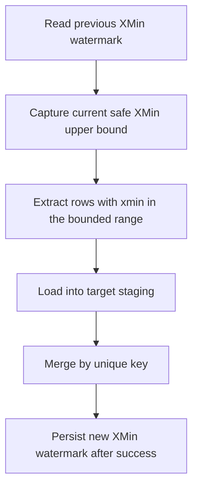

Algorithm:

1. Validate that the source type is Postgres.
2. Read the previous XMin watermark from state.
3. Capture a safe upper bound before extraction.
4. Extract rows whose `xmin` falls within the bounded range.
5. Load and finalize with the configured sink strategy.
6. Persist the upper bound only after sink success.

Copy from [Postgres -> MSSQL](source-sink/postgres-to-mssql.md), [Postgres -> ClickHouse](source-sink/postgres-to-clickhouse.md), or see the deep dive in [Postgres XMin](postgres-xmin.md).

## `cdc`

Use `cdc` when the source emits a change stream and you need insert/update/delete events rather than snapshot polling.

```yaml
source:
  type: postgres
  options:
    cdc:
      enabled: true
      slot: dpone_orders
      publication: dpone_publication
sink:
  strategy:
    mode: incremental_merge
    unique_key: order_id
```

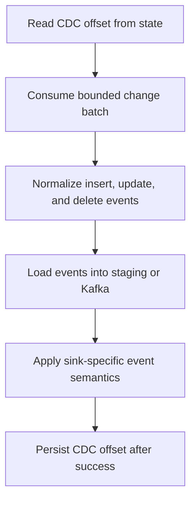

Algorithm:

1. Validate CDC capability for the source connector.
2. Read typed CDC offset state.
3. Consume a bounded batch of changes.
4. Normalize operations into `insert`, `update`, and `delete` semantics.
5. Apply sink-specific finalization or produce keyed events.
6. Persist the CDC offset after sink success.

Copy from [Postgres -> Kafka](source-sink/postgres-to-kafka.md) or [MSSQL -> ClickHouse](source-sink/mssql-to-clickhouse.md).

## `snapshot_reconciliation`

Use `snapshot_reconciliation` when the source does not emit delete events but the target must reflect physical deletes.

```yaml
reconciliation:
  enabled: true
  mode: snapshot
  key: order_id
  apply_deletes: true
  delete_mode: soft_delete
```

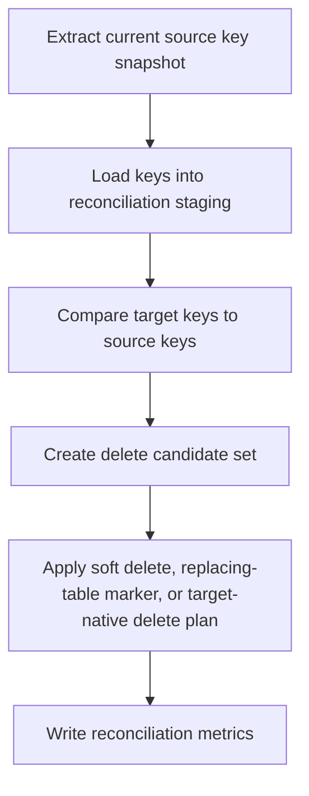

Algorithm:

1. Extract the current source key snapshot.
2. Load keys into reconciliation staging.
3. Compare staged source keys with target keys.
4. Produce a delete candidate set.
5. Apply the configured delete behavior through staging-first plans.
6. Write reconciliation metrics to the run artifact.

Copy from [Postgres -> MSSQL](source-sink/postgres-to-mssql.md), [MSSQL -> ClickHouse](source-sink/mssql-to-clickhouse.md), or [Postgres -> ClickHouse](source-sink/postgres-to-clickhouse.md).

## Copy/paste source/sink guide index

Use this index when you already know your source and target and want a ready manifest plus strategy runbook.

| Source | Sink | Guide |
|---|---|---|
| Postgres | MSSQL | [Postgres -> MSSQL](source-sink/postgres-to-mssql.md) |
| MySQL | MSSQL | [MySQL -> MSSQL](source-sink/mysql-to-mssql.md) (Batch ETL supported) |
| MySQL | Postgres | [MySQL -> Postgres](source-sink/mysql-to-postgres.md) (Batch ETL supported) |
| MySQL | ClickHouse | [MySQL -> ClickHouse](source-sink/mysql-to-clickhouse.md) (Batch ETL supported) |
| MySQL | BigQuery | [MySQL -> BigQuery](source-sink/mysql-to-bigquery.md) (Batch ETL supported) |
| MySQL | Kafka | [MySQL -> Kafka](source-sink/mysql-to-kafka.md) (Batch/event-log supported) |
| Postgres | Postgres | [Postgres -> Postgres](source-sink/postgres-to-postgres.md) |
| Postgres | ClickHouse | [Postgres -> ClickHouse](source-sink/postgres-to-clickhouse.md) |
| Postgres | BigQuery | [Postgres -> BigQuery](source-sink/postgres-to-bigquery.md) |
| Postgres | Kafka | [Postgres -> Kafka](source-sink/postgres-to-kafka.md) |
| MSSQL | MSSQL | [MSSQL -> MSSQL](source-sink/mssql-to-mssql.md) |
| MSSQL | Postgres | [MSSQL -> Postgres](source-sink/mssql-to-postgres.md) |
| MSSQL | ClickHouse | [MSSQL -> ClickHouse](source-sink/mssql-to-clickhouse.md) |
| MSSQL | BigQuery | [MSSQL -> BigQuery](source-sink/mssql-to-bigquery.md) |
| MSSQL | Kafka | [MSSQL -> Kafka](source-sink/mssql-to-kafka.md) |
| ClickHouse | MSSQL | [ClickHouse -> MSSQL](source-sink/clickhouse-to-mssql.md) |
| ClickHouse | Postgres | [ClickHouse -> Postgres](source-sink/clickhouse-to-postgres.md) |
| ClickHouse | ClickHouse | [ClickHouse -> ClickHouse](source-sink/clickhouse-to-clickhouse.md) |
| ClickHouse | BigQuery | [ClickHouse -> BigQuery](source-sink/clickhouse-to-bigquery.md) |
| ClickHouse | Kafka | [ClickHouse -> Kafka](source-sink/clickhouse-to-kafka.md) |
| REST API | MSSQL | [REST API -> MSSQL](source-sink/api-to-mssql.md) |
| REST API | Postgres | [REST API -> Postgres](source-sink/api-to-postgres.md) |
| REST API | ClickHouse | [REST API -> ClickHouse](source-sink/api-to-clickhouse.md) |
| REST API | BigQuery | [REST API -> BigQuery](source-sink/api-to-bigquery.md) |
| REST API | Kafka | [REST API -> Kafka](source-sink/api-to-kafka.md) |
| Kafka | MSSQL | [Kafka -> MSSQL](source-sink/kafka-to-mssql.md) |
| Kafka | Postgres | [Kafka -> Postgres](source-sink/kafka-to-postgres.md) |
| Kafka | ClickHouse | [Kafka -> ClickHouse](source-sink/kafka-to-clickhouse.md) |
| Kafka | BigQuery | [Kafka -> BigQuery](source-sink/kafka-to-bigquery.md) |
| Kafka | Kafka | [Kafka -> Kafka](source-sink/kafka-to-kafka.md) |

## Cross-links

- [Source -> sink matrix](source-sink-matrix.md)
- [Schema evolution](schema-evolution.md)
- [Type mapping matrix](type-mapping-matrix.md)
- [Postgres XMin](postgres-xmin.md)
- [Reconciliation and CDC](cdc.md)
- [Performance guide](performance.md)

## Atomic rolling-window composition

For an opt-in UTC rolling interval, see [Atomic rolling windows](rolling-window.md).
`sink.strategy.window` requires `mode: replace` and `atomicity: target_atomic`.
Execution requires injected source consistency and all-writer target authority;
the default runner refuses the declaration without those capabilities. Legacy
replace behavior and `state.atomicity` keep their existing meanings.
