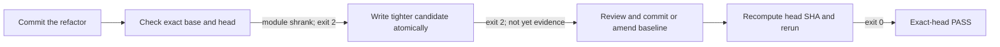
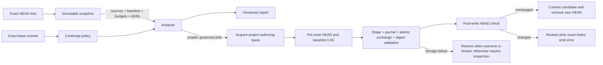

# Module-size debt ratchet

This guide is for dpone maintainers who change Python modules that already
exceed a warning threshold. It explains how to check, tighten, diagnose, and
recover the version-2 module-size baseline without creating hidden headroom.

The ratchet is a repository quality control, not a license to create large
modules. Global hard limits remain 600 LOC and 400 SLOC. Existing warning debt
may remain only at its exact reviewed LOC/SLOC values.

## Prerequisites

- Install the repository with `uv sync --locked --all-extras`.
- Fetch enough Git history to resolve the base and checked-out head commits.
- Commit or stage no unrelated edits. Authoritative evaluation reads immutable
  blobs from the exact checked-out `HEAD` and rejects relevant dirty inputs.
- Run commands from the repository root.
- Read-only checking is platform-neutral. `--write-baseline` requires a POSIX
  host with descriptor-relative no-follow I/O, advisory file locks, and a
  certified native atomic name exchange (Linux or macOS). On Windows, run the
  check locally, then hand the unchanged exact commit to a reviewed Linux/macOS
  maintainer worktree to produce the candidate. Protected Linux CI verifies the
  committed candidate; do not substitute an unconfined writer or copy bytes by
  hand.

## Check the current branch

```bash
git fetch --no-tags origin master
HEAD_SHA="$(git rev-parse HEAD)"
BASE_SHA="$(git merge-base "$HEAD_SHA" origin/master)"
if [ "$BASE_SHA" = "$HEAD_SHA" ]; then BASE_SHA="$(git rev-parse "${HEAD_SHA}^")"; fi
uv run dpone docs check-module-size \
  --baseline docs/module_size_baseline.json \
  --base-ref "$BASE_SHA" \
  --head-ref "$HEAD_SHA" \
  --format json
```

The base and head must be different commits. On the default-branch head the
merge base equals `HEAD`, so the snippet deliberately selects `HEAD^`; passing
the same SHA twice is rejected because it cannot prove cap continuity.

Exit `0` means the exact head satisfies the ratchet. Exit `2` means the module
violates a limit, the baseline must be tightened, or identity/configuration
could not be proven. JSON is written to stdout; logs and argparse errors use
stderr. Never interpret a skipped, malformed, or unavailable check as PASS.
Successful and policy-failure reports use `dpone.module-size-report.v2` and
declare `debt_model`. Configuration failures use
`dpone.module-size-error.v2`; candidate writes use
`dpone.module-size-baseline-write.v2`.

## Persist a real improvement

The writer refuses to certify uncommitted source bytes. Use this sequence:

1. Refactor and test the module.
2. Commit the refactor so it has an exact head identity.
3. Run the same check. A smaller governed module fails with
   `deterministic ratchet update required`.
4. Add `--write-baseline`. The command atomically writes only a valid tighter
   candidate and returns the versioned write outcome below with exit `2`; the
   written candidate is not yet evidence for the old head.
5. Review `git diff -- docs/module_size_baseline.json`, stage it, and amend the
   refactor commit or create a dedicated follow-up commit.
6. Recompute `HEAD_SHA` and rerun without `--write-baseline`. Only this final
   exit `0` certifies the new exact head.

Copyable writer command:

```bash
HEAD_SHA="$(git rev-parse HEAD)"
BASE_SHA="$(git merge-base "$HEAD_SHA" origin/master)"
if [ "$BASE_SHA" = "$HEAD_SHA" ]; then BASE_SHA="$(git rev-parse "${HEAD_SHA}^")"; fi
uv run dpone docs check-module-size \
  --baseline docs/module_size_baseline.json \
  --base-ref "$BASE_SHA" \
  --head-ref "$HEAD_SHA" \
  --write-baseline \
  --format json
git diff --check -- docs/module_size_baseline.json
git diff -- docs/module_size_baseline.json
```

A changed write produces:

```json
{
  "schema_version": "dpone.module-size-baseline-write.v2",
  "ok": false,
  "status": "CANDIDATE_WRITTEN",
  "changed": true,
  "baseline_path": "docs/module_size_baseline.json",
  "base_sha": "<40-character-base-sha>",
  "head_sha": "<40-character-old-head-sha>",
  "next_action": "Commit the candidate and rerun against the new exact head without --write-baseline."
}
```

A no-op writer returns the same schema with `status: NO_CHANGE` and
`changed: false`; it writes no file and still exits `2`, so automation cannot
mistake a writer invocation for certification.

Do not hand-increase a cap. The next exact-head comparison checks caps against
the base baseline and rejects increases regardless of ADR metadata.



## Rename and split behavior

- A single `R100` rename-only change may carry the same or lower cap from
  exactly one old path to exactly one new path.
- Multiple renames, mixed edits, and partial renames do not inherit caps.
- A split removes the old entry. Every new file is evaluated independently and
  receives no fraction of the old allowance.
- A deleted module must have its debt entry removed in the same exact head.

New warning debt is rejected. It requires a separate Accepted ADR with one
closed exception payload bound to the exact path, caps, owner, reason, target,
deadline, and baseline commit. Increasing an existing cap is never authorized
by merely pointing at an ADR.

Use this exact marker once in the Accepted ADR. Its nine fields are closed and
must match the proposed baseline entry; `accepted_adr` itself is the baseline
path pointing to this ADR and is deliberately not self-repeated:

```markdown
<!-- dpone-module-size-debt-exception-v2
{
  "schema_version": "dpone.module-size-debt-exception.v2",
  "path": "src/dpone/example.py",
  "max_lines": 480,
  "max_sloc": 370,
  "owner": "core",
  "reason": "temporary migration composition debt",
  "target_sloc": 350,
  "target_date": "2026-12-31",
  "baseline_commit": "0123456789abcdef0123456789abcdef01234567"
}
-->
```

The ADR must contain a `## Status` section whose only status value is
`Accepted` (an optional trailing period is allowed). Draft prose, a second
marker, an unbound payload, or an ADR absent from the evaluated head does not
authorize debt.

This is a two-PR maintainer exception, not an automatic writer path. First
merge the standalone ADR with `## Status` followed by `Accepted.` and the exact
marker above. In the later code PR, add the matching baseline entry manually
under review; set both `accepted_adr` and `baseline_commit` as follows:

```json
{
  "schema_version": 2,
  "debt": {
    "src/dpone/example.py": {
      "accepted_adr": "docs/adr/NNNN-example.md",
      "baseline_commit": "<the already-merged ADR commit, ancestor of BASE_SHA>",
      "max_lines": 480,
      "max_sloc": 370,
      "owner": "core",
      "reason": "temporary migration composition debt",
      "target_date": "2026-12-31",
      "target_sloc": 350
    }
  }
}
```

Use the merged ADR commit, never the current feature head: policy requires
`baseline_commit` to be an ancestor of the comparison base. Then run the exact
base/head check above. `--write-baseline` only tightens or removes existing
entries and intentionally cannot create this exception.

## Baseline v2 contract and migration

The canonical file is `docs/module_size_baseline.json`; its public JSON Schema
is [`module-size-baseline-v2.schema.json`](schemas/quality/module-size-baseline-v2.schema.json).
The root is closed and contains `schema_version: 2` plus a `debt` object keyed
by canonical repository-relative Python paths. Duplicate keys, unknown fields,
unsafe paths, symlinks, invalid dates, non-lowercase/full SHAs, and files larger
than 1 MiB fail closed. The published schema and executable codec validate the
closed structural shape and positive integers without copying numeric policy.
The exact-head `docs/benchmarks/quality_budgets.yml` snapshot is the sole
authority for warning targets and hard ceilings; the service binds every debt
entry to those budgets before evaluation. In baseline mode,
caller-supplied warning thresholds may be equal to or stricter than those
exact-head budgets; raising either threshold fails before evaluation, so a
ledger entry cannot disappear behind a relaxed warning level.

The one-time v1 migration is anchored only to audited commit
`e1d93822b47234e940829319cac0dc9678f6906c`. A later comparison base may carry
that migration only when it is a descendant of the audited commit and still
contains the legacy v1 ledger. Each grandfathered cap is rechecked against both
the module bytes at the audited commit and the exact descendant base; the cap
may not exceed either measurement. Intervening regrowth and newly introduced
warning debt therefore cannot be absorbed. Its grandfathered entries use
`accepted_adr: null` and expire after `2026-12-31`. A missing, replaced, or
different v1 ledger is not silently upgraded. The v2 report keeps the established top-level fields, adds
`debt_model`, and changes ratchet entries in `allowlisted` from
`lines`/`target` to exact caps and governed metadata. Consumers first dispatch
on report `schema_version`, then on `debt_model`; `legacy-v1`, `ratchet-v2`, and
`none` are intentionally distinct.

The retired v1 repository file used a broad exemption:

```json
{
  "version": 1,
  "entries": [
    {
      "path": "src/dpone/example.py",
      "lines": 443,
      "owner": "core",
      "reason": "legacy orchestration",
      "target": "split orchestration from policy"
    }
  ]
}
```

The equivalent v2 entry binds exact limits, provenance, and a deadline:

```json
{
  "schema_version": 2,
  "debt": {
    "src/dpone/example.py": {
      "accepted_adr": null,
      "baseline_commit": "e1d93822b47234e940829319cac0dc9678f6906c",
      "max_lines": 443,
      "max_sloc": 387,
      "owner": "core",
      "reason": "legacy orchestration",
      "target_date": "2026-12-31",
      "target_sloc": 350
    }
  }
}
```

The legacy Python helpers imported from `dpone.metrics.module_size` remain
available for v1 file round-trips. New governance code must use the v2 model and
codec from `dpone.metrics.module_size_policy`; legacy helpers do not authorize
CI PASS.

## Clean-root provenance migration

The clean source root `f8c6a4a5e75d167829c05f65d5d3033acb193878` preserves
51 reviewed debt entries whose original provenance commit is no longer in this
repository. Do not restore retired Git history to satisfy the check. The
repository-specific migration verifies that exact parentless root, the frozen
ledger and budget digests, and its immutable module measurements before
reanchoring provenance. Caps, ownership, reasons, reduction targets and
deadlines do not gain headroom. Normal ancestry and no-growth checks continue
to apply outside this one pinned transition.

The original root itself cannot prove change continuity: base and head must
remain distinct. Prepare and commit the migration on a successor branch, then
generate its candidate:

```bash
HEAD_SHA="$(git rev-parse HEAD)"
uv run python tools/migrate_module_size_root.py \
  --head-ref "$HEAD_SHA" --write-baseline
```

The command returns exit `2`, `ok: false`, and `CANDIDATE_WRITTEN` when it writes
the candidate. Review and commit or amend the result, recompute `HEAD_SHA`,
then run the regular exact-base/head gate against the clean root. Candidate
generation is not a passing check. Historical receipts remain
unverified for the recreated repository; fixture tests prove invariants, not
those old provider observations.

## Machine-readable report reference

`dpone.module-size-report.v2` is a closed semantic envelope with these stable
top-level fields and nested records:

| Field | Meaning |
|---|---|
| `schema_version` | Always `dpone.module-size-report.v2`. |
| `debt_model` | `ratchet-v2`, `legacy-v1`, or `none`. |
| `ok` | `true` only when no `error` issue exists. |
| `package` | Confined repository-relative scan root. |
| `base_sha`, `head_sha` | Verified distinct identities in authoritative ratchet CLI mode; nullable caller-supplied identities in the compatibility analyzer. The no-baseline CLI emits `null`. |
| `thresholds` | Effective warning and hard LOC/SLOC thresholds. |
| `issue_count`, `issues` | Complete sorted findings with path, counts, severity, and message. |
| `allowlisted` | Entries encoded according to `debt_model`; never infer their shape without it. |
| `largest` | At most 20 largest scanned modules for diagnostics. |

`thresholds` is closed over `warn_lines`, `max_lines`, `warn_sloc`, and
`max_sloc`; each value is a positive integer except that the two SLOC fields may
be `null` only for a compatible legacy Python caller. Every `issues` item is
closed over `path`, `lines`, `sloc`, `severity` (`error` or `warn`), and
`message`. Every `largest` item is closed over `path`, `lines`, and `sloc`.

`allowlisted` is selected by `debt_model`:

| `debt_model` | Exact item fields |
|---|---|
| `ratchet-v2` | `path`, `max_lines`, `max_sloc`, `owner`, `reason`, `target_sloc`, `target_date`, `accepted_adr`, `baseline_commit` |
| `legacy-v1` | `path`, `lines`, `owner`, `reason`, `target` |
| `none` | Always an empty array. |

The error envelope is closed over `schema_version`, `ok`, and
`configuration_error`; `schema_version` is `dpone.module-size-error.v2` and
`ok` is always `false`. The write envelope is closed over `schema_version`,
`ok`, `status`, `changed`, `baseline_path`, `base_sha`, `head_sha`, and
`next_action`; `status` is `CANDIDATE_WRITTEN` or `NO_CHANGE`, and `ok` is
always `false` because writing is not certification.

A ratchet-mode success begins as follows:

```json
{
  "schema_version": "dpone.module-size-report.v2",
  "debt_model": "ratchet-v2",
  "ok": true,
  "base_sha": "<40-character-base-sha>",
  "head_sha": "<40-character-head-sha>",
  "issue_count": 0,
  "issues": []
}
```

The actual report also contains `package`, `thresholds`, `allowlisted`, and
`largest`. Configuration failures reached after successful argument parsing
return exit `2` with `schema_version: dpone.module-size-error.v2`, `ok: false`,
and `configuration_error`; they are not report PASS. Values rejected while
argparse parses this command—including missing option values, malformed or
non-positive thresholds such as `--warn-lines -1`, an empty `--baseline`, and
invalid choices such as `--format xml`—use argparse usage/error text on stderr.
They exit `2`, write no report to stdout, and are neither
`dpone.module-size-error.v2` nor `dpone.error.v1` envelopes.

Python callers may continue importing `ModuleSizeBaselineEntry`,
`load_module_size_baseline`, `write_module_size_baseline`, and
`analyze_module_sizes` from `dpone.metrics.module_size`. The analyzer retains
its legacy advisory-warning default. Authoritative composition roots must pass
`warning_debt_requires_baseline=True` and use `ModuleSizeBaseline`,
`ModuleSizeDebtEntry`, and `decode_module_size_baseline` from
`dpone.metrics.module_size_policy`. Invalid v2 bytes raise
`ModuleSizeBaselineError`; callers must not reinterpret that exception as a
warning.



## Scoped no-baseline checks

`--no-baseline` is only for an explicitly selected focused package that has no
debt ledger:

```bash
uv run dpone docs check-module-size \
  --package packages/dpone-airflow-pack/src/dpone_airflow_pack \
  --no-baseline
```

Do not pass `--base-ref`, `--head-ref`, or `--write-baseline` with
`--no-baseline`. Empty baseline paths and non-positive or contradictory
thresholds are invalid; they never disable governance.

This mode cannot target the canonical `src/dpone` package. It always enforces
the global hard ceilings, but warning-threshold findings are advisory and may
coexist with exit `0`; text and JSON reports identify this as
`debt_model: none`. It is a scoped hard-budget guard, not evidence that the
repository-wide v2 ratchet passed.

## Operate the grandfathered debt cohort

The 67 bootstrap entries share `owner: architecture` and
`target_date: 2026-12-31` because ADR 0047 treats them as one reviewed migration
cohort. `architecture` is the portfolio owner, not a substitute for a routable
domain maintainer. Track weekly ownership, remaining count, completed paths,
and forecast in [issue #520](https://github.com/PaulKov/dpone/issues/520); the
working target is at least three to four resolved entries per week until the
ledger is empty.

Deadline expiry remains a gate failure. Do not raise an exact cap or edit the
date to make an unrelated change pass. Owner/date changes require a separately
reviewed Accepted ADR. An emergency admin bypass requires the repository
break-glass process and remains explicitly bypassed evidence—it never changes
the module-size result or this cohort to PASS.

## Diagnose and recover

| Signal | Meaning | Recovery |
|---|---|---|
| `inputs differ from checked-out HEAD` | A consumed source, baseline, budget, or ADR is dirty. | Commit the intended change or restore the unrelated edit, recompute `HEAD_SHA`, and rerun. |
| `base commit is not an ancestor` or commit unavailable | History is shallow or the wrong base was supplied. | Fetch `origin/master`, recompute the merge base, and rerun. |
| `grew beyond exact baseline cap` | Existing debt increased. | Reduce the module to its recorded cap or lower; never raise the cap. |
| `deterministic ratchet update required` | A refactor reduced governed debt. | Run the writer flow above, commit the lower cap, and certify the new head. |
| `target_date expired` | Governed debt missed its deadline. | Refactor below the warning threshold or obtain a separately reviewed policy change; a local date edit is not sufficient. |
| canonical baseline parent is missing or changed | Exact-byte authoring or final verification could not prove the same parent namespace. | Stop the writer. Preserve and inspect the current namespace, any detached/replaced parent, and all transaction siblings before changing paths; these bytes may be the only copy of concurrent or displaced data. Do not overwrite, delete, or rename a replacement. Recreate the tracked parent only after proving the intended checkout is clean and no concurrent bytes would be lost; otherwise escalate. The exact-byte path never recreates a missing parent or follows a replacement symlink. |
| writer interrupted before exchange | The prior baseline remains authoritative. | Verify the tracked baseline is clean, preserve sibling artifacts, and retry from the same clean head. The OS releases the project authoring lease when the process exits. |
| `write failed without a certifiable candidate` | Staging, atomic exchange, digest validation, or transaction cleanup did not produce certifiable final bytes. | Preserve the baseline and sibling recovery artifacts. Inspect the exact diff before retrying. |
| `transaction recovery is required` | A journal, displaced source, or candidate remains because cleanup could not be proven durable. | Do not delete artifacts by hand. Repair storage, preserve the directory, and rerun the same writer so the confined recovery state machine can reconcile it. |
| candidate is present after interruption | Replace succeeded, but the interrupted command could not certify it. | Review the diff. If valid, commit/amend it and run the ordinary check against the new head; do not rerun the writer while the baseline is dirty. |

The writer stages a complete UTF-8 JSON file, fsyncs it, creates a durable
transaction journal, atomically exchanges sibling names, validates both the
desired and displaced digests, and fsyncs the parent directory. It never emits PASS for the head that
preceded the write. If the command reports no candidate change, there is
nothing to commit; rerun the ordinary check and investigate any remaining
failure rather than manufacturing a diff.

The legacy unconditional baseline codec retains its compatible ability to
create a missing parent directory. Exact-byte compare-and-swap authoring and
final canonical verification do not: they reopen every parent through
existing-only no-follow descriptors and fail without namespace mutation when a
parent is missing, replaced, or symlinked.

After an interrupted process, inspect the canonical baseline and list sibling
transaction artifacts without reading or deleting them:

```bash
git diff --check HEAD -- docs/module_size_baseline.json
git diff HEAD -- docs/module_size_baseline.json
find docs -maxdepth 1 -type f \
  \( -name '.module_size_baseline.json.*.tmp' \
     -o -name '.module_size_baseline.json.dpone-transaction.json' \
     -o -name '.dpone-recovery-*' \) -print
```

The project authoring lease is an advisory descriptor lock in a private
platform temporary directory. It is released automatically when the process
ends and is never recovered by deleting a repository pathname. Exchange
journals and displaced files are descriptor-confined siblings of the baseline
and are reconciled by the canonical mutation recovery state machine. A
pre-exchange `.tmp` file can remain after abrupt process termination or when
the filesystem refused an attempted cleanup; a later writer uses a unique name
and does not delete or certify that residue. Preserve it for diagnosis. Repair
or escalate the storage failure when cleanup was attempted and failed. Manual
deletion can destroy the only copy of displaced or concurrent bytes.

Never remove the baseline itself. If the baseline differs from `HEAD`, inspect
it before taking any recovery action:

```bash
git diff --check -- docs/module_size_baseline.json
git diff -- docs/module_size_baseline.json
uv run python -m json.tool docs/module_size_baseline.json >/dev/null
```

For a valid intended candidate, commit or amend it and run the ordinary check
with a recomputed head. To discard an invalid or unintended candidate, restore
only this tracked file from the evaluated head, verify the clean diff, fix the
storage problem, and retry:

```bash
git restore --source=HEAD -- docs/module_size_baseline.json
git diff --exit-code -- docs/module_size_baseline.json
```

## Maintainer journey

| Stage | Evidence |
|---|---|
| Discover | ADR 0047 defines why exact caps replace the v1 allowlist. |
| Prepare | Full Git history, locked dependencies, and a clean exact head. |
| Configure | Baseline path and exact base/head SHAs. |
| Execute | Check, optionally write a tighter candidate, commit, then recheck. |
| Observe | Versioned JSON/text result, exit code, and baseline diff. |
| Diagnose | Fail-closed identity, cap, deadline, schema, and path errors. |
| Recover | Preserve the previous file on failed staging; rerun from a clean exact head. |
| Operate | CI passes the same explicit SHAs and never auto-raises caps. |
| Upgrade | Use the audited v1→v2 migration only; later schema changes require an ADR. |

See [Quality tooling](quality-tooling.md) for the broader local gate and
[ADR 0047](adr/0047-module-size-debt-ratchet.md) for the architecture decision.
