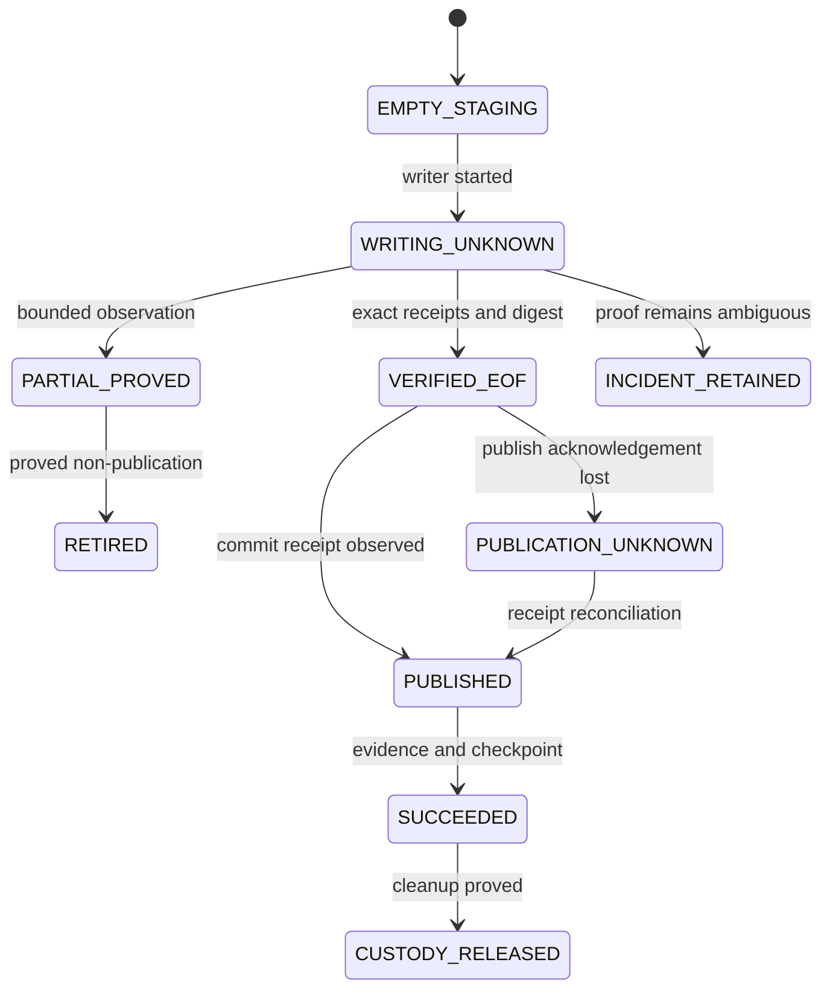

# Recover a bounded ClickHouse to MSSQL delivery

Use this runbook when a bounded native run stops after it has created durable
journal state. Recovery is source-free: these commands inspect the SQLite
journal and, for live actions, reconnect only to the authored MSSQL target.
They never query ClickHouse or infer scope from staging rows.

The journal normally lives below the manifest's durable
`runtime.storage.checkpoint_dir`:

```text
<checkpoint_dir>/mssql-native/<target-id>.sqlite
```

Keep the original manifest, selector, work directory, checkpoint directory,
connection binding, and credentials available. Live actions recompute their
digests against the sealed recovery authority. A mismatch performs no target
mutation and leaves custody held.

The v2 recovery plan seals the exact UTC window before source row I/O. Recovery
restores that window from the journal; the operator does not re-enter
`--interval-start` or `--interval-end` and cannot accidentally shift a rolling
seven-day scope.

## Inspect first

List every retained invocation without opening a database connection:

```bash
dpone ops mssql-native-recovery inspect-all \
  --journal-root /durable/checkpoints/mssql-native/<target-id>.sqlite \
  --format json
```

A successful command exits `0` and writes one JSON document to stdout:

```json
{"items":[],"kind":"dpone.mssql-native-recovery-index.v1","retained_custody_count":0,"schema_version":1}
```

Inspect one opaque invocation from that list:

```bash
dpone ops mssql-native-recovery inspect <invocation-id> \
  --journal-root /durable/checkpoints/mssql-native/<target-id>.sqlite \
  --format json
```

Read `state`, `diagnostic_code`, and `permitted_actions`. Run only an action
listed in `permitted_actions`. Missing, unreadable, ambiguous, or inconsistent
journal state exits `1`, leaves stdout empty, and writes a stable diagnostic to
stderr, such as `mssql_native.recovery_journal_unavailable`.

## Reconcile an uncertain outcome

`reconcile` observes an uncertain writer or publication result before any new
mutation. It requires the exact original manifest selector and explicit
confirmation:

```bash
dpone ops mssql-native-recovery reconcile <invocation-id> \
  --manifest /config/route.yaml#daily \
  --journal-root /durable/checkpoints/mssql-native/<target-id>.sqlite \
  --yes --format json
```

The command acquires the normal lease and target custody, checks the sealed
connection/identity/work-root bindings, probes the durable transaction receipt,
and observes only exact owned SQL objects. A positive receipt advances the
recorded publication state. Proved non-publication may authorize retirement or
resume. An ambiguous result retains custody and exits `1`; never start a new
invocation while it remains unresolved.

## Resume after verified EOF

Use `resume` only when inspection lists it. The command reuses contiguous
verified receipts and continues preparation, quality, publication, evidence,
checkpoint, cleanup, and custody release without reopening ClickHouse:

```bash
dpone ops mssql-native-recovery resume <invocation-id> \
  --manifest /config/route.yaml#daily \
  --journal-root /durable/checkpoints/mssql-native/<target-id>.sqlite \
  --yes --format json
```

Successful replay is idempotent. A crash after publication is resolved from the
exact transaction receipt before any target write. Evidence is persisted before
checkpoint advancement, and cleanup happens before custody release.

## Retire proved non-publication state

Use `retire` only when inspection lists it and reconciliation has durably proved
that publication did not occur:

```bash
dpone ops mssql-native-recovery retire <invocation-id> \
  --manifest /config/route.yaml#daily \
  --journal-root /durable/checkpoints/mssql-native/<target-id>.sqlite \
  --yes --format json
```

Retirement locks and rechecks the exact recorded object ID and owner binding,
drops only those owned stages, proves their absence, and then releases custody.
An absent object is accepted only when the recovery principal can distinguish
absence from metadata denial. Otherwise the command keeps custody for elevated
or manual recovery.

## State-to-action guide

| Observed state | Safe action |
|---|---|
| `EMPTY_STAGING` | Retire the exact empty owned stage when offered. |
| `WRITING_UNKNOWN` | Reconcile first. Never replay target mutation blindly. |
| `PARTIAL_PROVED` | Retire exact owned stages, then start a new complete invocation. |
| `VERIFIED_EOF` | Resume preparation and publication from contiguous receipts. |
| `REEXTRACT_REQUIRED` | Retire when offered, then start a new complete invocation. |
| `PUBLICATION_UNKNOWN` | Reconcile the exact transaction receipt first. |
| `PUBLISHED` | Resume idempotent evidence and checkpoint completion. |
| `SUCCEEDED` | Resume or inspect as offered until cleanup and custody release are durable. |
| `RETIRED` or `CUSTODY_RELEASED` | No target replay is required; retain normal audit evidence. |
| `INCIDENT_RETAINED` with no permitted live action | Preserve journal, work files, and custody; escalate with the opaque invocation and diagnostic code. |

All mutation commands exit `0` only after writing their resulting recovery
projection to stdout. Validation, authority, connection, lock, object, or SQL
failure exits `1`, writes a stable diagnostic to stderr, and retains resources
unless a prior durable transition proves their safe disposition. Repeating the
same command is safe after correcting an external availability issue.
Command-line grammar errors detected by argparse exit `2` before the recovery
application starts. Missing `--yes` is handled by the command and exits `1` with
`mssql_native.recovery_confirmation_required` before the manifest is loaded.



Before uninstalling the SqlClient companion or rolling back to a binary that
cannot read v2 records, require `inspect-all` to report
`retained_custody_count: 0`. Recovery outputs contain opaque identifiers and
diagnostics; do not copy privileged journals or connection configuration into
public evidence.

Continue with [MSSQL SqlClient transport](mssql-sqlclient-transport.md) for
backend selection and [ClickHouse to MSSQL](source-sink/clickhouse-to-mssql.md)
for the complete route journey. The [MSSQL native transport](mssql-native-transport.md)
page documents the shared BCP and SqlClient runtime contract.
