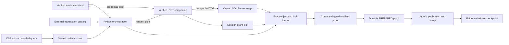

# MSSQL SqlClient architecture and trust boundaries

The Python runtime owns planning, bounded extraction, sealed files, grants,
journals, verification, publication, and evidence. The .NET companion owns one
non-pooled TDS connection and one `SqlBulkCopy` operation. It receives an
immutable request and credentials over separate bounded pipes.



The SQL session application name is a domain-separated SHA-256 binding of the
attempt, grant digest, stage object ID, and stage identity. Python and C# verify
the same executable parity vector during companion discovery. Force-kill
certification selects that exact session and requires an active `BULK INSERT`,
an open transaction, one granted application lock, and a granted `BU`, `IX`, or
`X` lock on the exact stage object in the current database.

The writer uses `EnableStreaming`, `KeepNulls`, `TableLock`, explicit column
mappings, and an internal transaction. The session application lock remains
held until connection disposal. Python then acquires its independent barrier,
revalidates object ownership and schema, and verifies aggregate content. A
positive companion result without this proof remains non-authoritative.

Trust does not cross these boundaries implicitly:

- manifest references are names, not credentials;
- the runtime context is accepted only with its matching pinned init-fetch plan;
- the companion binary is accepted only after package-tree and runtime checks;
- a process exit does not prove target state;
- stage ownership does not prove publication;
- public evidence never carries deployment coordinates or business data.

Recovery is observation-only. It never launches the previous grant again.
Exact content can advance to `VERIFIED`; two stable partial observations under
one barrier can advance to `PARTIAL_PROVED` and safe retirement. Any identity,
digest, lock, or catalog ambiguity retains custody.


## Observe the default runtime

Embedders can inject the existing observation contracts without replacing the
manifest execution path. Pass an `observer_factory` and a `write_observer` to
`DefaultMssqlNativeRuntimeFactory`, then supply that factory to
`DefaultProcessRunner(native_runtime_factory=...)`. Direct users of
`MssqlNativeApplicationRuntime` can pass the same optional dependencies.

This helper executes one already hydrated native process through the normal
runner and returns its bounded delivery snapshot. Each call owns a fresh
collector; it requires the same process and run context as ordinary execution.

```python
from dpone.runtime.bootstrap_runner import DefaultProcessRunner
from dpone.runtime.mssql_native_application import DefaultMssqlNativeRuntimeFactory
from dpone.runtime.native_delivery_observations import BoundedNativeDeliveryObserver


def run_observed_native_process(process, *, context):
    collector = BoundedNativeDeliveryObserver()
    factory = DefaultMssqlNativeRuntimeFactory(observer_factory=lambda: collector)
    runner = DefaultProcessRunner(native_runtime_factory=factory)
    result = runner.run(process, context=context)
    return result, collector.snapshot()
```

For failure diagnostics, retain the collector in your application's invocation
scope so it remains available when `runner.run` raises. To collect SqlClient
writer timings too, pass a bounded, thread-safe callback as `write_observer` on
the same factory. The helper above collects delivery phases only.

The delivery factory runs once per admitted run. Return a fresh bounded
observer for each run and retain it in the caller to read its snapshot after
completion or failure. It receives source, verification, preparation, and
publication observations. The SqlClient callback receives terminal writer
observations, including unavailable timings and failures; BCP does not invoke
that callback. Delivery observations and writer callbacks may arrive from worker
threads, so collectors must be thread-safe and bounded.

Instrumentation cannot establish target correctness or authorize publication.
Existing recorder and writer callback-failure isolation remains in effect;
missing or failed measurements make the applicable performance result
`UNVERIFIED`. Construct observation dependencies before execution, avoid I/O
in callbacks, and do not turn unavailable timings into zero. Overlapping phase
spans are measured independently. The caller owns retention and privacy:
operational evidence v1 and `ProcessResult` do not acquire a metrics payload,
and private qualification measurements stay outside public artifacts.
