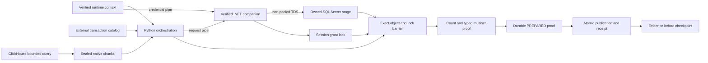

# MSSQL SqlClient architecture and trust boundaries

The Python runtime owns planning, bounded extraction, sealed files, grants,
journals, verification, publication, and evidence. The .NET companion owns one
non-pooled TDS connection and one `SqlBulkCopy` operation. It receives an
immutable request and credentials over separate bounded pipes.

The SQL session application name is a domain-separated SHA-256 binding of the
attempt, grant digest, stage object ID, and stage identity. Python and C# verify
the same executable parity vector during companion discovery. Force-kill
certification selects that exact session and requires an active `BULK INSERT`,
an open transaction, one granted application lock, and a granted `BU`, `IX`, or
`X` lock on the exact stage object in the current database.

The writer uses `EnableStreaming`, `KeepNulls`, `TableLock`, explicit column
mappings, and an internal transaction. The session application lock remains
held until connection disposal. Python then acquires its independent barrier,
revalidates object ownership and schema, and verifies aggregate content. A
positive companion result without this proof remains non-authoritative.

Trust does not cross these boundaries implicitly:

- manifest references are names, not credentials;
- the runtime context is accepted only with its matching pinned init-fetch plan;
- the companion binary is accepted only after package-tree and runtime checks;
- a process exit does not prove target state;
- stage ownership does not prove publication;
- public evidence never carries deployment coordinates or business data.

Recovery is observation-only. It never launches the previous grant again.
Exact content can advance to `VERIFIED`; two stable partial observations under
one barrier can advance to `PARTIAL_PROVED` and safe retirement. Any identity,
digest, lock, or catalog ambiguity retains custody.
