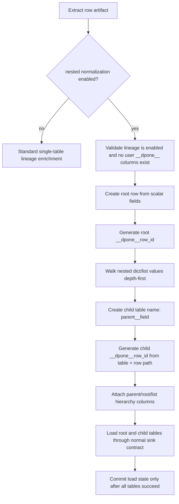
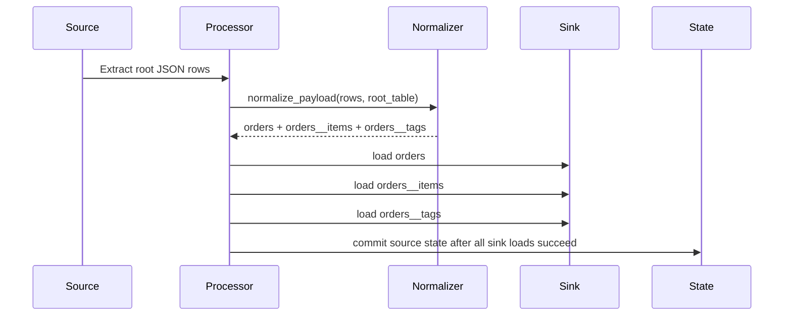
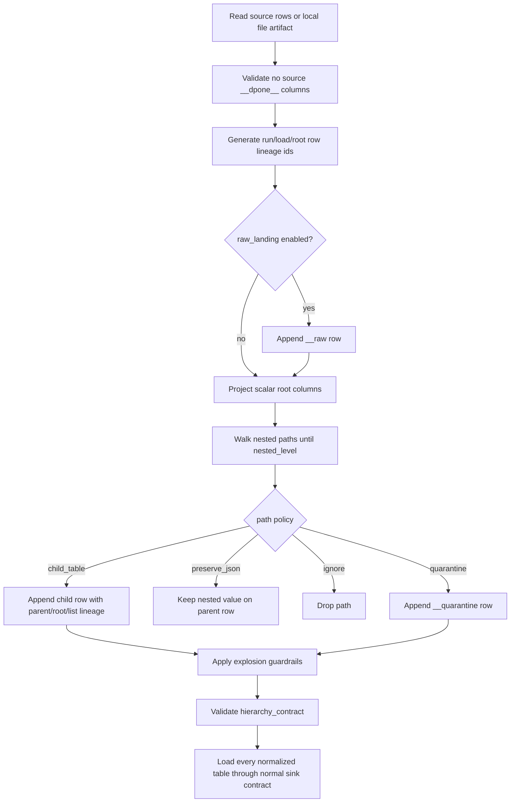
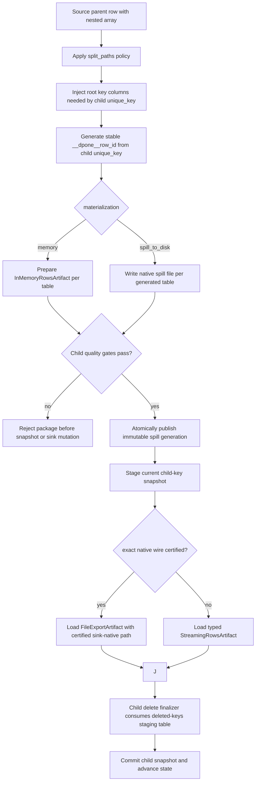

# Nested normalization

`dpone` supports dlt-like normalization for nested API/Kafka/row artifacts:
root records are loaded into the configured target table, and nested objects or
arrays are split into deterministic child tables with `__dpone__*` hierarchy
columns.

Use this when a source returns JSON shaped like orders with nested customer,
items, tags, addresses, payments, or other repeated structures and you want a
relational target contract instead of opaque JSON blobs.

## Quick start

```yaml
sink:
  table: {schema: landing, name: orders}
  strategy: {mode: incremental_append}
  options:
    lineage:
      enabled: true
      preset: hierarchical
    normalization:
      nested:
        enabled: true
        table_separator: "__"
        scalar_list_value_column: value
        nested_level: 32
```

Input row:

```json
{
  "order_id": 42,
  "status": "paid",
  "customer": {"customer_id": "c-1", "name": "Ada"},
  "items": [
    {"sku": "A", "qty": 2},
    {"sku": "B", "qty": 1}
  ],
  "tags": ["vip", "new"]
}
```

Output tables:

| Target table | Rows | Purpose |
| --- | ---: | --- |
| `orders` | 1 | Root scalar fields such as `order_id`, `status` |
| `orders__customer` | 1 | Nested object rows |
| `orders__items` | 2 | Repeated object rows with `__dpone__list_index` |
| `orders__tags` | 2 | Repeated scalar rows in the `value` column |

## Hierarchy columns

Nested normalization requires lineage because child tables need stable row
identity. The processor fails fast if `normalization.nested.enabled: true` is
combined with `sink.options.lineage: false`.

| Column | Root table | Child table |
| --- | --- | --- |
| `__dpone__row_id` | deterministic root row ID | deterministic child row ID |
| `__dpone__parent_row_id` | `null` | parent row ID |
| `__dpone__root_row_id` | root row ID | root row ID |
| `__dpone__list_index` | source batch row index | array item index, or `null` for nested objects |
| `__dpone__load_id` | same load package ID | same load package ID |
| `__dpone__loaded_at` | load timestamp | load timestamp |
| `__dpone__extracted_at` | extract timestamp | extract timestamp |

The row ID algorithm is shared with [Load lineage](load-lineage.md): business
`unique_key` is preferred for root rows, while child rows use normalized row
content plus a stable JSON path such as `$[0].items[1]`.

## Algorithm



## Table naming

By default child tables are named with `table_separator: "__"`:

```text
orders.customer        -> orders__customer
orders.items           -> orders__items
orders.items.discounts -> orders__items__discounts
```

Generated child table names keep their existing ASCII letter case for durable
table and row identity. Characters outside `0-9`, `A-Z`, `a-z`, and `_` become
`_`; non-ASCII generated names require an explicit safe table mapping.
Destination collision comparison is lowercase: distinct paths such as `a-b`
and `a_b`, or case-only variants, fail before staging instead of merging.

## Scalar arrays

Scalar lists become child rows with `scalar_list_value_column`:

```json
{"tags": ["vip", "new"]}
```

Produces:

| value | `__dpone__list_index` |
| --- | ---: |
| `vip` | 0 |
| `new` | 1 |

Override the column name when needed:

```yaml
sink:
  options:
    normalization:
      nested:
        enabled: true
        scalar_list_value_column: tag_value
```

## Processor behavior

When nested normalization is enabled, `ETLProcessor` executes a multi-table load
package:

1. Extract once from the source.
2. Normalize root and child tables in memory for row artifacts.
3. Apply schema evolution and runtime contracts per table.
4. Load each table through the same sink contract and configured strategy.
5. Mark the load audit record as committed only after every table succeeds.
6. Advance source state only after the full multi-table load succeeds.

Child tables use `__dpone__row_id` as their internal unique key when the root
strategy needs a key for merge-like semantics.



## Configuration reference

```yaml
sink:
  options:
    normalization:
      nested:
        enabled: false
        table_separator: "__"
        scalar_list_value_column: value
        nested_level: 32
        preserve_nested_json: false
        include_empty_tables: false
```

| Option | Default | Meaning |
| --- | --- | --- |
| `enabled` | `false` | Enable nested split into root and child tables |
| `table_separator` | `__` | Separator used for generated child table names |
| `scalar_list_value_column` | `value` | Column used for scalar array elements |
| `nested_level` | `32` | dlt-like maximum nested table depth. Direct child tables are level 1 |
| `max_depth` | `32` | Compatibility alias for `nested_level`; prefer `nested_level` in new manifests |
| `preserve_nested_json` | `false` | Also keep nested dict/list values on parent rows as JSON-like values |
| `include_empty_tables` | `false` | Reserved for planned empty-table schema emission |

Empty lists and mappings remain on their parent row as empty JSON-like values,
so reverse reconstruction distinguishes empty from missing without inventing a
child row. `include_empty_tables` does not create a zero-row table or infer a
schema.

## Source and sink support

Nested normalization works for source artifacts that expose rows or local export
files:

| Source artifact | Status |
| --- | --- |
| `InMemoryRowsArtifact` | supported |
| `StreamingRowsArtifact` | supported, consumed into normalized tables |
| `FileExportArtifact` | supported for local `csv`, `tsv`, `jsonl`, `ndjson`, and `json` files |
| `PartitionedFileExportArtifact` | supported; partitions are read sequentially and cleaned after read |
| `BatchedFileExportArtifact` | supported; generated batch files are read and cleaned after read |
| Cloud-native exports such as `GCSExportArtifact` | fail fast; use native sink fast paths or add an explicit cloud materialization contract |

Delimited file exports use the artifact `columns` list. If the first row equals
that column list, it is treated as a header and skipped. Cell values that look
like JSON objects or arrays are parsed back into nested values before
normalization, so CSV/TSV exports with JSON columns can still produce child
tables.

The produced root/child payloads require a sink that implements the complete
package-staging contract: `stage_payload`, `finalize_staged_load`, and
`abort_staged_load`. The runtime checks this capability before any target
mutation and fails with `nested_package_staged_abort_required` when it is
missing.

| Sink | Nested root/child package status |
| --- | --- |
| ClickHouse | Supported through its staged-load lifecycle |
| MSSQL | `UNVERIFIED` / fail closed until package staging ports are implemented |
| Postgres | `UNVERIFIED` / fail closed until package staging ports are implemented |
| BigQuery and Kafka | `UNVERIFIED` for automatic multi-target fan-out |

## Example: REST API to ClickHouse

```yaml
kind: dpone.flow.v1
authoring:
  mode: flow
  source: examples/nested/rest_api_to_clickhouse.yml
metadata:
  id: nested_orders_api_to_clickhouse
  domain: examples
processes:
  - name: nested_orders_api_to_clickhouse
    source:
      type: api
      api_type: rest
      connection_ref: orders_api
      table: {schema: api, name: orders}
      endpoint: /orders
      options:
        method: GET
        records_path: $.orders[*]
    sink:
      type: clickhouse
      connection_ref: clickhouse_dwh
      table: {schema: landing, name: orders}
      strategy: {mode: incremental_append}
      options:
        lineage:
          preset: hierarchical
        normalization:
          nested:
            enabled: true
```

Expected target tables:

```text
landing.orders
landing.orders__customer
landing.orders__items
landing.orders__items__discounts
```

## Runbooks

### Child rows cannot be joined to root rows

1. Confirm `sink.options.lineage.preset: hierarchical` or
   `sink.options.lineage.features.hierarchy: true` is configured.
2. Verify child tables contain non-null `__dpone__parent_row_id` and
   `__dpone__root_row_id`.
3. Join child to parent with
   `child.__dpone__parent_row_id = parent.__dpone__row_id`.

### Source already contains `__dpone__*` fields

`__dpone__*` is reserved for framework metadata. Rename source fields before
normalization, or keep the nested payload as JSON with normalization disabled.

### Row IDs changed after a retry

1. Prefer a root `unique_key` for stable business identity.
2. Confirm nested array ordering is stable in the source response.
3. Confirm the source did not reorder child arrays or mutate nested content
   between retries.

### File export fails with nested normalization enabled

1. Confirm the artifact is local `FileExportArtifact`, `PartitionedFileExportArtifact`,
   or `BatchedFileExportArtifact`.
2. Confirm `artifact.format` is one of `csv`, `tsv`, `jsonl`, `ndjson`, or `json`.
3. Confirm delimited rows have exactly the same number of fields as
   `artifact.columns`.
4. For cloud-native exports such as GCS, keep the native target fast path or add
   an explicit cloud materialization step before nested normalization.

### Deep objects are rejected

Use `nested_level` to control how deep child-table expansion can go:

```yaml
sink:
  options:
    normalization:
      nested:
        enabled: true
        nested_level: 2
```

If a source suddenly emits deeper documents, dpone fails before loading partial
child tables. Raise `nested_level` deliberately only after confirming the new
child tables are expected by downstream consumers.

## Implementation map

| Concept | Code |
| --- | --- |
| Options | [`src/dpone/runtime/normalization/options.py`](https://github.com/PaulKov/dpone/blob/master/src/dpone/runtime/normalization/options.py) |
| Result models | [`src/dpone/runtime/normalization/models.py`](https://github.com/PaulKov/dpone/blob/master/src/dpone/runtime/normalization/models.py) |
| File artifact reader | [`src/dpone/runtime/normalization/file_rows.py`](https://github.com/PaulKov/dpone/blob/master/src/dpone/runtime/normalization/file_rows.py) |
| Normalization service | [`src/dpone/runtime/normalization/normalizer.py`](https://github.com/PaulKov/dpone/blob/master/src/dpone/runtime/normalization/normalizer.py) |
| Nested load orchestration | [`src/dpone/runtime/etl/nested_load.py`](https://github.com/PaulKov/dpone/blob/master/src/dpone/runtime/etl/nested_load.py) |
| Processor integration | [`src/dpone/runtime/etl/processor.py`](https://github.com/PaulKov/dpone/blob/master/src/dpone/runtime/etl/processor.py) |
| Tests | [`tests/test_nested_normalization_contracts.py`](https://github.com/PaulKov/dpone/blob/master/tests/test_nested_normalization_contracts.py) |

## Advanced self-service controls

Nested normalization can be configured at the path level. The default remains
simple and safe: every nested object/list becomes a child table until
`nested_level` is reached. Advanced policies let a pipeline owner preserve,
ignore, quarantine, or explicitly split selected paths without writing custom
Python code.

```yaml
sink:
  options:
    normalization:
      nested:
        enabled: true
        nested_level: 4
        paths:
          customer: preserve_json
          debug_blob: ignore
          internal_payload:
            policy: quarantine
          items.discounts:
            policy: child_table
            table: order_item_discounts
        split_paths:
          - path: $.items[*]
            table: order_lines
            policy: child_table
        guardrails:
          max_child_tables: 16
          max_rows_per_root: 10000
          max_array_length: 1000
          on_explosion: fail
        raw_landing:
          enabled: true
          table_suffix: __raw
          payload_column: payload
        hierarchy_contract:
          tables:
            orders:
              required_columns: [order_id]
            order_lines:
              parent: orders
              required_columns: [sku]
```

### Path policies

| Policy | Behavior | Typical use |
|---|---|---|
| `child_table` | Split the path into a normalized child table. | Arrays of entities, nested dimensions, repeatable attributes. |
| `preserve_json` | Keep the nested value in the parent row and do not create a child table. | Small JSON attributes consumed as a single document. |
| `ignore` | Drop the path from normalized output. | Debug payloads, unstable API decorations, user-disabled fields. |
| `quarantine` | Write the path to `<root>__quarantine` with `path`, `payload`, and `reason`. | Sensitive, dirty, or contract-breaking nested values that must not enter target tables. |

`split_paths` accepts a tiny JSONPath subset for field paths such as
`$.items[*]` and `$.items[*].discounts[*]`. It is intentionally small: dpone
keeps normalization deterministic and table-oriented instead of running an
arbitrary JSON transformation language inside the loader.

### Raw + normalized dual-write

`raw_landing.enabled: true` adds a raw landing table next to normalized tables.
For a root table `orders`, the default raw table is `orders__raw`. It contains
one row per root source row, the configured payload column, and the same
`__dpone__load_id`, `__dpone__row_id`, `__dpone__root_row_id`, and timestamp
lineage columns as normalized rows.

Use this mode when:

- onboarding a new semi-structured source;
- debugging normalization policy changes;
- preserving vendor payloads for audit or replay;
- migrating downstream consumers gradually from raw JSON to normalized tables.

### Explosion guardrails

Nested APIs can accidentally produce millions of child rows from a single root
record. Guardrails fail before materialization grows without bounds.

| Guardrail | What it protects |
|---|---|
| `max_array_length` | One JSON array is too large to normalize safely. |
| `max_child_tables` | One root row fans out into too many distinct child tables. |
| `max_rows_per_root` | One root row produces too many total normalized rows. |

Production recommendation: keep `on_explosion: fail` for CI and production.
Use `warn` only in local exploration, because it can still produce very large
artifacts.

## CLI preview and inference

Use `dpone normalize preview` before enabling a manifest in production.

```bash
dpone normalize preview \
  --sample examples/nested/orders.jsonl \
  --root-table orders \
  --config examples/nested/normalization.yml \
  --format md \
  --output .dpone/normalization-preview.md
```

Use `dpone normalize infer` when you want a schema-oriented payload for review
or GitOps evidence.

```bash
dpone normalize infer \
  --sample examples/nested/orders.jsonl \
  --root-table orders \
  --nested-level 3 \
  --format json
```

The command reads local JSON, JSONL/NDJSON, CSV, or TSV samples. It does not
connect to source or target systems and it does not write target data.

## Reverse hierarchy builder

`HierarchyBuilderService` can reconstruct nested payloads from normalized
`NormalizationResult` tables. It is useful for tests, golden-data fixtures,
round-trip checks, and connector SDK certification.

```python
from dpone.runtime.normalization import HierarchyBuilderService

rebuilt_rows = HierarchyBuilderService().rebuild(result, root_table="orders")
```

The reverse builder uses:

- `__dpone__row_id` to identify each normalized row;
- `__dpone__parent_row_id` to attach children to parents;
- `__dpone__root_row_id` to preserve root lineage;
- `__dpone__list_index` to preserve array order.

## Algorithm diagram



## Runbooks

### Preview output has too many tables

1. Add `paths.<path>: preserve_json` for small document-shaped fields.
2. Add `paths.<path>: ignore` for unstable/debug fields.
3. Add `split_paths` table overrides for important arrays so table names stay
   stable across source payload changes.
4. Add `guardrails.max_child_tables` and run `dpone normalize preview` again.

### A single source row explodes into too many child rows

1. Start with `max_array_length` and `max_rows_per_root` in local preview.
2. If the large array is not business-critical, set the path to `ignore`.
3. If it must be retained for audit but not modeled yet, set the path to
   `quarantine` or enable `raw_landing`.
4. If it is a real child entity, model it explicitly with `split_paths` and a
   hierarchy contract.

### Downstream users need the original vendor payload

1. Enable `raw_landing.enabled: true`.
2. Keep normalized tables as the query-optimized contract.
3. Use the raw table for replay/audit only; do not make it the primary serving
   table unless your target architecture intentionally stores document payloads.

### Contract validation fails

1. Run `dpone normalize preview --format json` and inspect `tables`.
2. Check that the expected table name matches `table_separator` or `split_paths`.
3. Check `required_columns` against the table schema in preview output.
4. If the source changed incompatibly, keep production fail-closed and update
   the GitOps manifest contract in a reviewed PR.

## Code map

| Responsibility | Code |
|---|---|
| Path policies | [`src/dpone/runtime/normalization/policies.py`](https://github.com/PaulKov/dpone/blob/master/src/dpone/runtime/normalization/policies.py) |
| Explosion guardrails | [`src/dpone/runtime/normalization/guardrails.py`](https://github.com/PaulKov/dpone/blob/master/src/dpone/runtime/normalization/guardrails.py) |
| Hierarchy contracts | [`src/dpone/runtime/normalization/contracts.py`](https://github.com/PaulKov/dpone/blob/master/src/dpone/runtime/normalization/contracts.py) |
| Preview service | [`src/dpone/runtime/normalization/preview.py`](https://github.com/PaulKov/dpone/blob/master/src/dpone/runtime/normalization/preview.py) |
| Reverse builder | [`src/dpone/runtime/normalization/hierarchy_builder.py`](https://github.com/PaulKov/dpone/blob/master/src/dpone/runtime/normalization/hierarchy_builder.py) |
| Normalization orchestration | [`src/dpone/runtime/normalization/normalizer.py`](https://github.com/PaulKov/dpone/blob/master/src/dpone/runtime/normalization/normalizer.py) |
| Child delete finalizers | [`src/dpone/runtime/normalization/finalizers.py`](https://github.com/PaulKov/dpone/blob/master/src/dpone/runtime/normalization/finalizers.py) |
| Child snapshot state | [`src/dpone/runtime/normalization/snapshot_store.py`](https://github.com/PaulKov/dpone/blob/master/src/dpone/runtime/normalization/snapshot_store.py) |
| SQL snapshot state | [`src/dpone/runtime/normalization/snapshot_sql.py`](https://github.com/PaulKov/dpone/blob/master/src/dpone/runtime/normalization/snapshot_sql.py) |
| Snapshot store factory | [`src/dpone/runtime/normalization/snapshot_factory.py`](https://github.com/PaulKov/dpone/blob/master/src/dpone/runtime/normalization/snapshot_factory.py) |
| Snapshot runtime lifecycle | [`src/dpone/runtime/normalization/snapshot_runtime.py`](https://github.com/PaulKov/dpone/blob/master/src/dpone/runtime/normalization/snapshot_runtime.py) |
| Native spill writer | [`src/dpone/runtime/normalization/native_spill.py`](https://github.com/PaulKov/dpone/blob/master/src/dpone/runtime/normalization/native_spill.py) |
| Native fast-path planner | [`src/dpone/runtime/normalization/fast_path.py`](https://github.com/PaulKov/dpone/blob/master/src/dpone/runtime/normalization/fast_path.py) |
| Load package coordinator | [`src/dpone/runtime/normalization/load_package.py`](https://github.com/PaulKov/dpone/blob/master/src/dpone/runtime/normalization/load_package.py) |
| Child quality gates | [`src/dpone/runtime/normalization/child_quality.py`](https://github.com/PaulKov/dpone/blob/master/src/dpone/runtime/normalization/child_quality.py) |
| Live certification harness | [`src/dpone/readiness/nested_live_certification.py`](https://github.com/PaulKov/dpone/blob/master/src/dpone/readiness/nested_live_certification.py) |

## Industrial hardening layer

The production hardening layer adds industrial capabilities on top of the core
normalizer.

| Capability | Command/API | Why it matters |
|---|---|---|
| Spill-to-disk normalization | `SpillToDiskNormalizationService` | Normalizes row-by-row and writes one native spill file per generated table, avoiding one huge in-memory result. |
| Native spill handoff | `NestedSpillFastPathPlanner` | Uses a sink-native `FileExportArtifact` only after that exact wire contract is certified; otherwise fails closed to typed streaming. |
| SQL child snapshot state | `SqlChildSnapshotStore` | Persists committed/staged child-key snapshots through MSSQL/Postgres/BigQuery-style state executors. |
| Child quality gates | `ChildQualityService` | Detects duplicate child keys and orphan child rows before state advancement. |
| Atomic package lifecycle | `NestedLoadPackageCoordinator` | Commits root/child package state only after all generated tables load successfully. |
| Config lint | `dpone normalize lint` | Catches table collisions and missing explosion guardrails before ETL execution. |
| Certification evidence | `dpone normalize certify` | Produces JSON/Markdown evidence for release review and connector certification. |
| Benchmark evidence | `dpone normalize benchmark` | Measures throughput and generated row counts on deterministic nested payloads. |
| Stress evidence | `dpone normalize stress` | Generates skewed large-payload evidence with sparse nested objects and extreme child-array sizes. |

### Spill-to-disk API

```python
from dpone.runtime.normalization import NestedNormalizationOptions
from dpone.runtime.normalization.spill import SpillToDiskNormalizationService

result = SpillToDiskNormalizationService().spill_rows(
    rows,
    root_table="orders",
    options=NestedNormalizationOptions.from_config({
        "enabled": True,
        "raw_landing": True,
        "guardrails": {"max_array_length": 1000},
    }),
    output_dir=".dpone/nested-spill/orders",
)

print(result.files["orders"])
print(result.semantic_files["orders"])
print(result.row_counts)
```

The output is intentionally table-oriented: each generated table receives an
operator-facing spill file, typed semantic sidecar, row count, schema summary
and format metadata. Every successful call returns paths inside its own
`.dpone-spill-generation-*` directory. Always consume `result.files`; do not
construct `<output_dir>/<table>.<suffix>` yourself. Sinks can use the returned
files as a safe staging boundary instead of keeping all normalized rows in
memory. `semantic_files` points to an internal tagged JSONL sidecar for every
format; it is not a generic interchange file. Zero rows publish no generation,
and both mappings belong to the same retention lifecycle.

### Lint before rollout

```bash
dpone normalize lint \
  --root-table orders \
  --config examples/nested/normalization.yml \
  --format md \
  --output .dpone/nested-lint.md \
  --fail-on-error
```

Lint currently checks:

- explicit `split_paths.table` collisions;
- missing explosion guardrails;
- raw landing enabled without an explicit retention/access policy note.

### Certification and benchmark

```bash
dpone normalize certify \
  --row-count 1000 \
  --output-dir test_artifacts/nested/latest

dpone normalize benchmark \
  --row-count 10000 \
  --output-dir test_artifacts/nested/benchmark-latest

dpone normalize stress \
  --row-count 100000 \
  --spill-output-format json_each_row \
  --output-dir test_artifacts/nested/stress-latest
```

Certification verifies lint, spill-to-disk, reverse readback, child finalizers,
native fast-path routing, child snapshot state, child quality, quarantine and
raw landing evidence. Benchmark uses deterministic synthetic nested orders and
caps `--row-count` at `100000` by default.

Detailed testing docs: [Nested normalization testing](testing/nested/index.md).

Manual live readiness is available through the GitHub Actions workflow
`Nested live readiness (not certification)`
(`.github/workflows/nested-live-certification.yml`). It is intentionally
`workflow_dispatch` only because it starts local service dependencies and
exercises the connectivity-oriented `integration_nested_live` marker. A green
workflow proves that the readiness harness executed; it does not certify a
source-to-sink route. Route certification still requires every recorded
data-path check to pass with real rows and reconciliation evidence.

## Copy-paste examples

| Example | File |
|---|---|
| Local JSONL sample | [`examples/nested/orders.jsonl`](https://github.com/PaulKov/dpone/blob/master/examples/nested/orders.jsonl) |
| Normalization config | [`examples/nested/normalization.yml`](https://github.com/PaulKov/dpone/blob/master/examples/nested/normalization.yml) |
| REST API to ClickHouse | [`examples/nested/rest_api_to_clickhouse.yml`](https://github.com/PaulKov/dpone/blob/master/examples/nested/rest_api_to_clickhouse.yml) |
| Kafka to ClickHouse | [`examples/nested/kafka_to_clickhouse.yml`](https://github.com/PaulKov/dpone/blob/master/examples/nested/kafka_to_clickhouse.yml) |

## Child lifecycle: stable keys, deletes and runtime spill

Industrial nested normalization is not only about splitting JSON into child
tables. Child rows need a stable identity, physical deletes must be visible,
and large payloads must avoid a single in-memory normalized result.
The YAML fragments below are placed under the manifest's `sink.options`
mapping, as shown explicitly in each snippet.

### Stable child identity

Use `split_paths[].unique_key` for every business child table. The key may
combine root columns and child columns. If a key column exists on the root row
but not on the child object, dpone injects that root value into the child row
before generating `__dpone__row_id`.

```yaml
sink:
  options:
    normalization:
      nested:
        enabled: true
        split_paths:
          - path: $.items[*]
            table: order_lines
            unique_key: [order_id, sku]
```

With this contract, reordering `items` does not change `__dpone__row_id` for the
same `(order_id, sku)` pair. Without a child `unique_key`, dpone falls back to a
content/path identity that is useful for exploration but weaker for production
updates and deletes.

### Child physical deletes

When source arrays are authoritative snapshots for the parent row, configure a
child delete policy:

```yaml
sink:
  options:
    normalization:
      nested:
        split_paths:
          - path: $.items[*]
            table: order_lines
            unique_key: [order_id, sku]
            delete_policy: replace_parent_children
```

Supported policy values:

| Policy | Meaning |
|---|---|
| `none` | No child delete plan is produced. Good for append/event-log child data. |
| `replace_parent_children` | Treat the child array as authoritative for the loaded parent rows. Missing keys are physical deletes for those parents. |
| `snapshot_reconcile` | Treat previous/current child snapshots as comparable sets and produce deleted keys. |

`ChildTableReconciliationService` computes deterministic deleted-key plans from
previous/current normalized snapshots. Sink-specific finalizers can consume this
plan to perform staging-first set-based deletes instead of row-by-row target
mutations.

Sink-native child delete finalizers:

| Sink | Finalizer | Behavior |
|---|---|---|
| MSSQL | `DELETE target FROM target JOIN deleted_keys` | Deletes only child keys staged in the deleted-keys table. Uses bracket-quoted key columns. |
| Postgres | `DELETE ... USING deleted_keys` | Deletes only matched child keys in one set-based statement. |
| BigQuery | `DELETE WHERE EXISTS (...)` | Uses partition/filter-friendly key lookup from the staged deleted-keys table. |
| ClickHouse | Lightweight `DELETE ... WHERE tuple(key) IN (...)` | Supported as the child delete default. Cleanup is asynchronous until ClickHouse merges parts. |
| Kafka | Keyed delete events | Emits a `dpone` delete event contract instead of mutating a target table. |

The finalizer contract is intentionally narrow: it receives a target table,
deleted-keys staging table and child `unique_key`, then returns SQL statements or
an event contract. This keeps nested reconciliation reusable across sinks while
preserving sink-native finalization.

### Stateful child snapshots

Snapshot reconciliation needs a committed previous child-key snapshot. The local
`JsonFileChildSnapshotStore` implements the same lifecycle expected from DB state
backends:

1. `stage_snapshot` writes the current child keys for a `load_id`.
2. `load_committed` still returns the previous committed snapshot.
3. `commit_snapshot` promotes staged keys only after the sink load succeeds.
4. `rollback_staged` removes staged keys and preserves the committed snapshot.

This mirrors the broader dpone state rule: source offsets and reconciliation
state advance only after target finalization and quality gates succeed.

For production state backends use `SqlChildSnapshotStore`. It depends on a tiny
executor protocol (`execute` and `fetch_value`) rather than a concrete database
connector, so MSSQL, Postgres and BigQuery state adapters can reuse the same
stage/commit/rollback lifecycle.

Manifest configuration:

```yaml
sink:
  options:
    normalization:
      nested:
        enabled: true
        child_snapshot_store:
          enabled: true
          backend: postgres
          table: etl_state.__dpone__child_snapshots
          connection_id: postgres_state
```

For local certification and single-node runs use `backend: json` and `path`.

```python
from dpone.runtime.normalization import SqlChildSnapshotStore

store = SqlChildSnapshotStore(
    dialect="postgres",
    table="etl_state.__dpone__child_snapshots",
    executor=postgres_state_executor,
)

store.stage_snapshot(
    root_table="orders",
    child_table="order_lines",
    unique_key=["order_id", "sku"],
    keys=[{"order_id": 1, "sku": "A"}],
    load_id=load_id,
)
```

### Runtime spill materialization

For large nested payloads, set `materialization: spill_to_disk`.

Child-quality validation stays bounded in memory. It writes sequential
attempt-owned record spools, sorts fixed-size chunks, and evaluates duplicate
and parent/root membership through streaming merge joins. Business rows are
never inserted one-by-one into an embedded database. All sort runs are removed
after success or failure; the immutable published spill generation remains the
only load artifact.

```yaml
sink:
  options:
    normalization:
      nested:
        enabled: true
        materialization: spill_to_disk
        spill_output_dir: .dpone/nested-spill/orders
        spill_output_format: json_each_row
```

Supported `spill_output_format` values:

| Format | Best fit | Notes |
|---|---|---|
| `jsonl` | Portable default | One JSON object per line. Works well for generic streaming and debugging. |
| `ndjson` | Alias for JSON Lines | Same writer semantics as `jsonl`. |
| `json_each_row` | Portable JSON-line diagnostics | Writes JSONEachRow-style objects; delivery currently uses typed streaming until a matching sink wire is certified. |
| `tsv` | Delimiter-based diagnostics and future bulk routes | Renders one final-schema header and uses `\N` for NULL. Incompatible heterogeneous column types, literal `\N` strings, and values containing tab/newline/CR fail before publication. |

Runtime behavior:

1. `NestedLoadService` reads the source artifact as rows.
2. `SpillToDiskNormalizationService` writes typed canonical rows into a unique
   hidden staging directory, learns the complete schema, renders one native file
   per generated table, and atomically publishes an immutable generation.
3. Child quality reads the typed staged sidecars and must pass before the
   generation is published.
4. `NestedSpillFastPathPlanner` checks whether the exact sink writer/loader wire
   contract is certified. Current built-in combinations fail closed to
   `StreamingRowsArtifact`; a future certified combination may use
   `FileExportArtifact`.
5. Run metrics include `spill_output_dir`, spill files, generated table counts,
   spill formats, native fast paths, materialization mode and configured child
   unique keys.

Hidden `.dpone-rows-*.jsonl` sidecars preserve scalar types with explicit tags
for child quality, snapshots and portable fallback. Every spill format receives
one. They are part of the same generation as the operator-facing files and must
share its retention lifecycle. A retry never appends to or replaces an earlier
generation. Failed staging and failed load attempts are removed automatically;
completed results remain readable until the operator deletes them after all
consumers finish. Existing flat or unrelated files under `spill_output_dir` are
never migrated or overwritten.

Operator-facing JSONL/TSV files encode scalar `bytes` columns as hexadecimal and
their schema records the `bytes` logical type, so schema-aware replay restores
the original value. Bytes nested inside an unsplit JSON object fail before
generation publication because ordinary JSON has no unambiguous bytes scalar;
split that value into its own column or consume the typed semantic sidecar.

Native spill handoff matrix:

| Sink | Spill format | Current handoff |
|---|---|---|
| MSSQL | `tsv` | Typed streaming; BCP header/NULL wire is not yet certified |
| Postgres | `tsv` | Typed streaming; COPY delimiter/header wire is not yet certified |
| ClickHouse | `json_each_row` / `tsv` | Typed streaming; client/HTTP input-format binding is not yet certified |
| BigQuery | `jsonl` / `ndjson` | Typed streaming; load-job format binding is not yet certified |
| Kafka | `jsonl` / `ndjson` | Typed streaming; file parser binding is not yet certified |

Configure fast-path routing at the sink options level:

```yaml
sink:
  type: mssql
  options:
    sink_type: mssql
    nested_fast_path:
      enabled: true
```

`nested_fast_path.enabled: false` explicitly forces the same portable fallback.
Enabling it never bypasses certification; it only permits a future certified
cell to select its native loader.

### Atomicity modes

Nested loads are root/child packages. Configure the package semantics explicitly
when the target has unusual transaction behavior:

```yaml
sink:
  options:
    normalization:
      nested:
        atomicity:
          mode: staging_commit
          on_failure: rollback_staged
```

| Mode | When to use |
|---|---|
| `single_transaction` | The sink can load all root/child tables and finalizers in one transaction. |
| `staging_commit` | Default. Stage all generated tables, finalize each table, then commit state after all succeed. |
| `compensating_cleanup` | The sink cannot rollback target finalization and needs cleanup/retry runbooks. |
| `eventual_consistency` | Kafka and ClickHouse-style paths where delete cleanup or events are eventually consistent. |

If any generated table fails, dpone marks the load package failed and rolls back
staged child snapshots. Source offsets, child snapshots and reconciliation state
must not advance until the package commits.

This keeps the root/child table load path atomic for capability-confirmed sinks
while avoiding a single large in-memory `NormalizationResult`. MSSQL and
Postgres currently fail closed before target mutation because they do not yet
implement the package-staging ports.

### Child lifecycle diagram



### Child quality gates

`ChildQualityService` validates two common nested-data failure modes:

| Check | What it catches |
|---|---|
| Duplicate child keys | Two generated child rows with the same configured child `unique_key`. |
| Orphan child rows | Child rows whose parent key does not exist in the root table package. |

These checks execute after normalization and before child-snapshot staging,
sink staging, audit `STAGED`, or source-state advancement. The same service is
also reusable by CI, certification and dry-run planning.

Manifest policy:

```yaml
sink:
  options:
    normalization:
      nested:
        child_quality:
          duplicate_child_key: fail
          orphan_child_rows: fail
```

Supported policy values are `fail`, `warn` and `skip`.

### Atomic root/child package lifecycle

`NestedLoadPackageCoordinator` keeps audit lifecycle aligned with nested
package semantics:

1. Prepare all generated table files/rows and run child-quality gates.
2. Stage child snapshots only after quality passes, then mark the package `staged`.
3. Load every root/child table through the normal sink path.
4. If any child table fails, mark the package `failed` and do not commit state.
5. Commit load audit, child snapshots and source offsets only after every table
   succeeds.

### Live certification harness

`NestedLiveCertificationRunner` is the manual/live evidence harness for real
local services. Each sink case reports `passed`, `failed` or `skipped`, so CI can
distinguish an unavailable optional service from a broken connector.

Required live checks per sink:

| Check | Purpose |
|---|---|
| `root_child_load` | Root and generated child tables are loaded. |
| `physical_child_deletes` | Missing child keys are finalized through sink-native delete events/SQL. |
| `state_commit_after_success` | Child snapshots advance only after successful target finalization. |
| `state_not_advanced_after_failure` | Failed child loads rollback staged snapshots. |
| `native_fast_path` | A certified native file path is used when available; otherwise the typed streaming fallback is observed without claiming native execution. |
| `child_quality` | Duplicate child keys and orphan child rows are detected. |

### Runbook: unsafe TSV spill value

`spill_output_format: tsv` fails when a value contains tab, LF or CR. This is a
deliberate lossless-load guardrail: dpone will not silently corrupt child table
payloads by writing an ambiguous delimiter file.

Recommended responses:

1. Use `spill_output_format: json_each_row` for portable JSON-line output.
2. Keep `tsv` only for columns that are known to be delimiter-safe.
3. Add a source transformation that escapes or normalizes unsafe text before
   nested normalization.
4. Route dirty rows to quarantine if the payload cannot be made safe.

### Runbook: spill generation retention

1. Read the exact generation paths from `result.files` or run metrics; never
   infer a flat filename from the table name.
2. Keep the entire generation while any sink loader, snapshot stage, retry
   diagnostic, or audit reader can still open it.
3. After the load is terminal and no consumer remains, delete the whole
   `.dpone-spill-generation-*` directory according to your work-artifact
   retention policy.
4. Do not delete `.dpone-spill-stage-*` while a writer is active. A failed
   writer cleans its own unique staging directory.
5. If disk use grows, shorten successful-generation retention or move
   `spill_output_dir` to a capacity-managed work volume; never point cleanup at
   unrelated files in the parent directory.

### Runbook: child row changes on array reorder

1. Add `split_paths[].unique_key` using business columns, for example
   `[order_id, sku]`.
2. Run `dpone normalize preview` twice with reordered arrays and compare
   `__dpone__row_id` values.
3. Add `dpone normalize lint --fail-on-error` to CI for the manifest.

### Runbook: child physical delete missing in target

1. Confirm the child path has `unique_key`.
2. Set `delete_policy: replace_parent_children` for authoritative parent arrays.
3. Check run report `nested_normalization.child_unique_keys` and generated child
   row counts.
4. Use `ChildTableReconciliationService` in tests to assert deleted keys before
   enabling a live sink finalizer.
