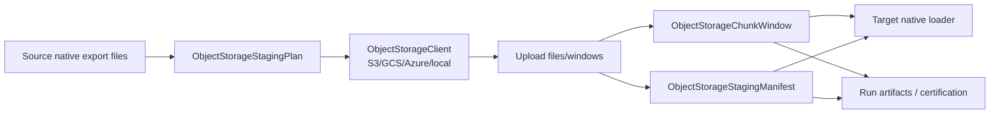

# Object storage staging

`dpone` supports a common object storage staging contract for S3, Google Cloud Storage, Azure Blob Storage, and a local filesystem emulator for CI.

The goal is simple: large extracts can be written as bounded windows or explicit
file manifests, uploaded to a durable staging area with checksums, then loaded by
target-native fast paths. The same window/manifest evidence powers replay,
certification, and run reports.

## Contents

- [Install](#install)
- [Supported URI forms](#supported-uri-forms)
- [How staging works](#how-staging-works)
- [Production access contract](#production-access-contract)
- [Columnar ClickHouse pull fast path](#columnar-clickhouse-pull-fast-path)
- [Route certification](#route-certification)
- [Python API](#python-api)
- [Manifest shape](#manifest-shape)
- [Cleanup policy](#cleanup-policy)
- [Retention, budget and lifecycle safety net](#retention-budget-and-lifecycle-safety-net)
- [Runbook](#runbook)
- [Related docs](#related-docs)

## Install

```bash
pip install "dpone[object_storage]"
```

For columnar Parquet snapshot providers, install the Parquet extra as well:

```bash
pip install "dpone[object_storage,columnar]"
```

Or install only one cloud SDK:

```bash
pip install "dpone[s3]"
pip install "dpone[gcp]"
pip install "dpone[azure]"
```

## Supported URI forms

| Provider | URI | Notes |
| --- | --- | --- |
| S3 | `s3://bucket/path/prefix` | Uses `boto3` when `S3ObjectStorageClient` is used. |
| GCS | `gs://bucket/path/prefix` | Uses `google-cloud-storage` when `GCSObjectStorageClient` is used. |
| Azure short | `az://container/path/prefix` | Account comes from the injected `BlobServiceClient` or connection string. |
| Azure explicit | `azure://account/container/path/prefix` | Account is preserved in the URI model for diagnostics. |

## How staging works



Every staged object records:

- object URI;
- file name;
- byte size;
- SHA-256 checksum;
- optional content type.

## Production access contract

High-throughput ClickHouse pull routes need two independent access checks:

- `runtime_access`: the dpone runtime/KPO can write chunks, read them back, list
  the run prefix, and delete the run prefix.
- `clickhouse_read_access`: the ClickHouse server or cluster can read the same
  staged objects through the exact table function used by the load.

No access keys, SAS tokens, passwords, session tokens, or presigned URL values
belong in the manifest. Store only `connection_type`, `connection_id`,
`named_collection`, URI prefix, and policy. Secrets must come from the standard
dpone credential providers: Airflow, environment, params, or Vault.

```yaml
source:
  options:
    native_transfer:
      snapshot:
        columnar_fast_path:
          mode: auto
          provider: auto
          execution:
            mode: chunked
            target_chunk_bytes: 512MiB
            max_chunk_bytes: 1GiB
            max_inflight_chunks: 1
            cleanup_policy: eager
          object_storage:
            enabled: true
            kind: s3
            uri_prefix: s3://dpone-stage/msql-clickhouse/{run_id}/
            format: parquet
            compression: zstd

            runtime_access:
              connection_type: airflow
              connection_id: s3_dpone_stage_writer
              required_permissions:
                - put_object
                - get_object
                - list_prefix
                - delete_prefix

            clickhouse_read_access:
              mode: named_collection
              named_collection: dpone_stage
              required_permissions:
                - get_object
                - list_prefix

            preflight:
              enabled: true
              require_runtime_write: true
              require_clickhouse_read: true
              require_cluster_read: true
              sentinel_format: parquet
              fail_on_region_mismatch: warn

            retention:
              enabled: true
              bucket_limit_bytes: 200GiB
              warn_usage_pct: 70
              block_usage_pct: 85
              active_run_max_hours: 12
              failed_run_ttl_hours: 24
              orphan_ttl_hours: 12
              lifecycle_expiration_days: 2
              abort_incomplete_multipart_days: 1
              require_lifecycle_rule: warn

sink:
  options:
    clickhouse_bulk:
      ingest_contract: columnar_staging
      columnar_pull:
        use_cluster_function: auto
        cluster: dwh
        auth_mode: named_collection
        settings:
          max_download_threads: auto
          input_format_parquet_allow_missing_columns: false
```

The preflight writes a tiny sentinel object into the run prefix, reads it back,
lists the prefix, asks ClickHouse to read the sentinel through `s3(...)` or
`s3Cluster(...)`, and then deletes the sentinel prefix when delete permission is
required. In `required` mode, any failed access check blocks before source IO. In
`auto` mode, dpone may choose another route, but the fallback reason is recorded
in runtime decision audit.

## Columnar ClickHouse pull fast path

For large MSSQL -> ClickHouse snapshots, the preferred high-throughput shape is:

```text
MSSQL snapshot -> Parquet window -> object storage -> ClickHouse s3/s3Cluster pull -> staging -> cleanup -> next window -> DQ/lineage/finalize
```

This is different from a KPO push stream. The dpone runtime writes bounded
columnar chunks and ClickHouse reads them server-side, optionally through
`s3Cluster(...)` so the cluster can parallelize object reads. The route is
designed for weak workers because the worker no longer has to push every byte
through one pod-to-ClickHouse stream.

The OSS runtime contracts are:

- `ColumnarFastPathPlanner`: selects `object_storage_pull`,
  `direct_push_columnar`, or the existing streaming fallback. `required` mode
  blocks before source IO when preflight/schema/writer checks fail; `auto` may
  fallback only with runtime decision audit.
- `ColumnarSnapshotProvider`: source-side port for writing Parquet chunks. Heavy
  Arrow/Rust engines are optional providers; the base package keeps only the
  interface and evidence model.
- `MssqlColumnarSnapshotProvider`: first certified MSSQL implementation under
  the provider id `mssql_odbc_arrow_parquet`. It streams batches from the MSSQL
  connector, writes bounded Parquet chunks through an injected writer, uploads
  them through `ObjectStorageClient`, and fails before source IO when the
  optional Parquet writer is not installed. Install `dpone[columnar]` for the
  default `pyarrow` writer.
- `ObjectStorageColumnarChunkedArtifact`: lazy run-scoped windows for the
  weak-worker default. Each window has row-count, byte-size, SHA-256, schema
  hash and cleanup policy, and is pulled into staging before the next window is
  produced.
- `ObjectStorageStagingManifest`: explicit `file` mode artifact for a full
  two-phase manifest when the worker and storage budget allow it.
- `ClickHouseColumnarPullLoader`: sink-side loader that stages data with
  `INSERT INTO staging SELECT ... FROM s3(...)` or `s3Cluster(...)` using a
  named collection by default.

Production rules:

- use run-scoped prefixes such as `s3://bucket/dpone/{run_id}/`;
- prefer `clickhouse_read_access.mode: named_collection` so SQL never embeds
  credentials;
- keep Parquet chunks large enough for efficient ClickHouse reads, commonly
  `512MiB` target and `1GiB` max;
- keep `input_format_parquet_allow_missing_columns: false` unless a schema
  evolution plan explicitly allows sparse loads;
- keep `auto` fallbacks visible in `run --format json`, structured logs and
  `etl_state.__dpone__load_steps.details_json`.

When object storage is unavailable, `direct_push_columnar` can still use the
same columnar writer and push local Parquet chunks to ClickHouse:

```yaml
source:
  options:
    native_transfer:
      snapshot:
        columnar_fast_path:
          provider: direct_push_columnar
          execution:
            mode: chunked          # chunked|file|streaming
            target_chunk_bytes: 512MiB
            max_chunk_bytes: 1GiB
            max_inflight_chunks: 1
            cleanup_policy: eager
```

The same `execution` block controls `object_storage_pull` and
`direct_push_columnar`:

- `chunked` is the weak-worker default: write one bounded Parquet window, load
  it into staging, clean it eagerly, then continue.
- `file` is the explicit two-phase/debug mode: write the full manifest first,
  then load it.
- `streaming` is reserved for a true zero-file route; if requested before a
  certified stream provider exists, dpone fails closed instead of silently using
  files.

The old `direct_push.mode` keys are accepted only as compatibility aliases. New
manifests should use `columnar_fast_path.execution`.

The route follows the same broad performance pattern described by
[Supermetal's SQL Server -> ClickHouse benchmark](https://www.supermetal.io/blog/sql-server-clickhouse-benchmark),
and ClickHouse's official guidance for [S3 table functions](https://clickhouse.com/docs/sql-reference/table-functions/s3),
[`s3Cluster`](https://clickhouse.com/docs/sql-reference/table-functions/s3Cluster), and
[S3 performance](https://clickhouse.com/docs/integrations/s3/performance).

## Route certification

Use [Route capability certification](route-capability-certification.md) before
promoting object-storage pull to a production default:

```bash
dpone certify route-capabilities \
  --manifest manifests/mssql/account_sales.yaml \
  --scenario work-item_account_sales_benchmark \
  --output test_artifacts/route-capability-certification/account_sales
```

The certification harness runs capability preflight before source IO, writes
`certification.json`, `route_decisions.jsonl`, `load_steps.json` and
`quality_report.json`, then selects the fastest route with green DQ and cleanup.

## Route capability planning

Columnar object-storage pull is planned through the generic route capability
system. The same mechanism is used for other future routes, so the planner does
not assume a specific source, sink, cloud or ClickHouse version. It builds route
candidates, probes only the capabilities each route needs, then records the
selected route and rejected alternatives in structured logs, `run --format json`
and `etl_state.__dpone__load_steps.details_json`.

```yaml
runtime:
  capabilities:
    mode: auto              # auto|required|warn_only
    explain_alternatives: true
```

Use `mode: required` when a workload must fail before source IO if the selected
fast path is not available. Use `auto` when a safe streaming/native fallback is
acceptable, but every fallback still needs an auditable reason.

At runtime the capability orchestrator runs after the load identity is created
and before incremental state or `source.extract` is called. This is the fail-
closed boundary for expensive source reads. The published evidence uses these
stable schemas:

- `dpone.runtime.route_capability_decision.v1`;
- `dpone.runtime.capability_probe.v1`;
- `dpone.runtime.route_execution.v1`.

Every decision is persisted as a `runtime_route_decision` step in
`etl_state.__dpone__load_steps`. The same summary is attached to
`run --format json` under `route_capabilities.summary`, so local CLI, Python API,
Docker/KPO and Airflow pack runs expose the same selected route, fallback reason,
warnings, blockers and recommendations.

`dpone run` and the Python process runner build this orchestrator automatically
through `RouteCapabilityRuntimeFactory`. Workloads do not need handwritten DI or
Airflow helper code: when `runtime.capabilities` or `columnar_fast_path` enables
planning, the factory wires candidate providers, source/storage/sink probes,
selected route executors, and SQL-backed `__dpone__load_steps` audit storage.
When the feature is absent or explicitly `off`, the factory returns no
orchestrator and the existing extract/load path is unchanged.

Examples of capability outcomes:

| Blocker | What dpone does in `auto` | Recommended action |
| --- | --- | --- |
| `storage.runtime_put_denied` | Rejects object-storage pull and chooses a streaming fallback. | Fix the runtime writer connection permissions. |
| `sink.auth.named_collection_missing` | Rejects production named-collection pull. | Create the named collection or explicitly allow dev credential mode. |
| `sink.cluster_pull_unsupported` | Selects single-node `s3(...)` pull when it is supported. | Configure cluster/named collection or use the single-node pull route. |
| `format.parquet_read_unsupported` | Chooses typed binary/native streaming. | Upgrade/configure the sink or keep the streaming route. |
| `source.columnar_writer_missing` | Chooses an existing streaming route. | Install `dpone[columnar]` or a certified source columnar provider. |

This is deliberately probe-first. Server versions are included as evidence, but
feature checks such as `s3(...)`, `s3Cluster(...)`, named collections and Parquet
readiness are verified by real sentinel probes whenever possible. That makes the
UX clear on older ClickHouse clusters: the plan shows the unsupported capability
and the next viable route instead of failing later during the load.

## Python API

Local CI example:

```python
from pathlib import Path

from dpone.staging.object_storage import ObjectStorageStagingPlan, ObjectStorageStagingService
from dpone.storage import LocalObjectStorageClient

client = LocalObjectStorageClient(root_dir=".dpone/object-storage-local")
service = ObjectStorageStagingService(client=client)

manifest = service.stage_files(
    ObjectStorageStagingPlan(
        base_uri="s3://dpone-stage/orders",
        run_id="01JZDPONEOBJECTSTAGING000",
        dataset="landing",
        table="orders",
        file_format="tsv",
        compression="none",
        cleanup_policy="delete_on_success",
    ),
    [Path("part-000.tsv"), Path("part-001.tsv")],
)

print(manifest.to_dict())
```

Cloud adapters accept injected clients for dependency injection and testing:

```python
from dpone.storage import S3ObjectStorageClient

client = S3ObjectStorageClient()  # uses boto3.client("s3")
```

```python
from dpone.storage import GCSObjectStorageClient

client = GCSObjectStorageClient()  # uses google.cloud.storage.Client()
```

```python
from dpone.storage import AzureBlobObjectStorageClient

client = AzureBlobObjectStorageClient(connection_string="...")
```

## Manifest shape

```json
{
  "provider": "s3",
  "base_uri": "s3://dpone-stage/orders",
  "run_id": "01JZDPONEOBJECTSTAGING000",
  "dataset": "landing",
  "table": "orders",
  "file_format": "tsv",
  "compression": "none",
  "cleanup_policy": "delete_on_success",
  "object_count": 2,
  "total_size_bytes": 128,
  "objects": [
    {
      "uri": "s3://dpone-stage/orders/01JZDPONEOBJECTSTAGING000/part-000.tsv",
      "file_name": "part-000.tsv",
      "size_bytes": 64,
      "sha256": "..."
    }
  ]
}
```

## Cleanup policy

| Policy | Behavior |
| --- | --- |
| `retain` | Keep staged files for replay/debugging. |
| `eager` | Delete transient windows/run prefixes as soon as the governed load no longer needs them. |
| `on_success` | Delete run prefix after successful sink commit. |
| `keep_on_failure` | Keep failed-run prefix until the configured failed-run TTL. |

Legacy aliases are still accepted for old artifacts: `delete_on_success` maps to
`on_success`, and `delete_always` maps to `eager`.

Production recommendation:

- keep `retain` for CDC replay, incident recovery, and certification runs;
- use `eager` for routine high-volume batch jobs when replay artifacts are stored elsewhere;
- avoid long-lived failed-run artifacts unless the retention block has a small TTL.

## Retention, budget and lifecycle safety net

Object storage cleanup has two layers:

1. Runtime eager cleanup removes each loaded window or run prefix immediately.
2. Retention governance protects the bucket when a pod dies before cleanup.

Every object-storage run writes `__dpone_run_marker.json` into the run prefix.
The marker contains the run id, workload id, table, creation time, expiry time
and status. The sweeper uses this marker before deleting a prefix. If a marker
is missing, the prefix is treated as an orphan only when the path shape is safe
and `orphan_ttl_hours` has elapsed.

Recommended production prefix shape:

```text
s3://<bucket>/dpone-stage/{env}/{layer}/{table}/{run_id}/
```

Example:

```text
s3://example-data-bucket/dpone-stage/prod/mart/example_reporting__account_sales/{run_id}/
```

Check budget before enabling object-storage pull:

```bash
dpone ops object-storage budget \
  --uri-prefix s3://example-data-bucket/dpone-stage/prod/ \
  --limit 200GiB \
  --connection-type airflow \
  --connection-id s3_dpone_stage_writer
```

Run cleanup in dry-run first:

```bash
dpone ops object-storage cleanup \
  --uri-prefix s3://example-data-bucket/dpone-stage/prod/ \
  --mode dry-run \
  --connection-type airflow \
  --connection-id s3_dpone_stage_writer
```

Then execute only after reviewing candidate prefixes:

```bash
dpone ops object-storage cleanup \
  --uri-prefix s3://example-data-bucket/dpone-stage/prod/ \
  --mode execute \
  --connection-type airflow \
  --connection-id s3_dpone_stage_writer
```

Render the bucket lifecycle safety-net rule:

```bash
dpone ops object-storage lifecycle render \
  --uri-prefix s3://example-data-bucket/dpone-stage/
```

The default safety net expires staging objects after 2 days and aborts
incomplete multipart uploads after 1 day. Scope lifecycle rules to
`dpone-stage/`, not the whole bucket. dpone renders and verifies compatible
rules, but it does not overwrite unrelated bucket lifecycle rules.

This follows industrial staging discipline:

- dlt uses filesystem/object-store destinations for staged data packages; dpone
  adds run markers, budget gates and cleanup evidence.
- Airbyte exposes sync state/protocol messages; dpone persists object-storage
  cleanup decisions into runtime evidence and load-step audit.
- Fivetran keeps operational sync metadata managed by the platform; dpone keeps
  the same discipline in OSS/GitOps-readable artifacts.
- Informatica, SSIS and Pentaho rely on staging areas for bulk movement; dpone
  makes staging lifetime explicit, prefix-safe and auditable.

Useful provider references:

- [Yandex Object Storage lifecycle rules](https://yandex.cloud/en/docs/storage/operations/buckets/lifecycles)
- [Amazon S3 lifecycle expiration](https://docs.aws.amazon.com/AmazonS3/latest/userguide/lifecycle-expire-general-considerations.html)
- [Amazon S3 abort incomplete multipart uploads](https://docs.aws.amazon.com/AmazonS3/latest/userguide/mpu-abort-incomplete-mpu-lifecycle-config.html)

## Runbook

| Symptom | Likely cause | Action |
| --- | --- | --- |
| Upload fails with auth error | Cloud SDK credentials are missing or scoped incorrectly. | Run `dpone doctor`, verify IAM/SAS/account roles, and retry with a single small file. |
| Checksum mismatch in downstream evidence | File changed after staging or wrong local path uploaded. | Re-export files, stage again, and compare `sha256` values before target load. |
| Target cannot read staged files | Bucket/container permissions differ from uploader permissions. | Grant target service account read/list on the staging prefix. |
| Cleanup deletes too much | Base URI points too high in the namespace. | Use per-pipeline prefixes and verify the generated `run_id` prefix before cleanup. |
| Azure URI cannot resolve account | `az://` form was used without configured `BlobServiceClient`. | Use `azure://account/container/prefix` for diagnostics or inject a configured service client. |

## Related docs

- [Developer object storage guide](developer-object-storage.md)
- [BigQuery](bigquery.md)
- [Load strategies](load-strategies.md)
- [Production readiness](production-readiness.md)
- [Testing](testing/index.md)
