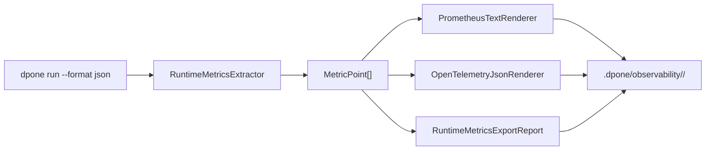

# Runtime observability

`dpone observability metrics-export` converts dpone run evidence into
Prometheus text exposition, OpenTelemetry-compatible JSON, a machine-readable
summary, and a Markdown report.

The exporter is intentionally local-first and dependency-light. It does not
require a running collector, Prometheus server, or vendor SDK to produce
artifacts. That keeps CI deterministic while still giving operators files they
can ship to their observability stack.

## Contents

- [Quickstart](#quickstart)
- [How it works](#how-it-works)
- [Prometheus artifact](#prometheus-artifact)
- [OpenTelemetry artifact](#opentelemetry-artifact)
- [Using custom metrics](#using-custom-metrics)
- [CI artifact pattern](#ci-artifact-pattern)
- [Runbook](#runbook)
- [Developer links](#developer-links)

## Quickstart

Run a process and save JSON output:

```bash
uv run dpone run examples/postgres_to_mssql.yaml \
  --format json > .dpone/runs/orders/run_report.json
```

Export observability artifacts:

```bash
uv run dpone observability metrics-export \
  --run-report .dpone/runs/orders/run_report.json \
  --airflow-evidence-bundle .dpone/evidence/orders-airflow.json \
  --output-dir .dpone/observability/orders \
  --label env=local \
  --label pipeline=orders \
  --service-name dpone \
  --namespace dpone.local \
  --format json
```

Generated files:

| File | Purpose |
| --- | --- |
| `prometheus_metrics.prom` | Prometheus text exposition for scraping or pushgateway upload. |
| `opentelemetry_metrics.json` | OTLP-shaped JSON that can be adapted by collectors or CI uploaders. |
| `metrics_index.json` | SHA-256 checksum manifest for the files produced by this export. |
| `runtime_metrics.json` | dpone export report with metric list and artifact paths. |
| `runtime_metrics.md` | Human-readable summary for run artifacts or pull requests. |

## How it works



The exporter reads the standard JSON shape produced by
[`dpone run`](run.md). It extracts:

| Run field | Metric |
| --- | --- |
| `result.extracted_rows` | `dpone_extracted_rows` |
| `result.inserted_rows` | `dpone_inserted_rows` |
| `result.updated_rows` | `dpone_updated_rows` |
| `result.final_rows` | `dpone_final_rows` |
| `result.duration_seconds` | `dpone_duration_seconds` |
| `result.run_throughput.rows_per_second` | `dpone_throughput_rows_per_second` |
| `result.details.run_throughput.rows_per_second` | `dpone_throughput_rows_per_second` |
| `result.throughput_rows_per_second` | `dpone_throughput_rows_per_second` legacy fallback |
| `attempts` | `dpone_attempts` |
| `max_attempts` | `dpone_max_attempts` |
| `retry_backoff_seconds` | `dpone_retry_backoff_seconds` |
| `result.errors` / `errors` / `blockers` | `dpone_error_count` |
| `warnings` | `dpone_warning_count` |
| `passed` | `dpone_run_passed` |

Labels are attached to every metric. Run reports automatically add useful
labels such as `run_id`, `process`, `selector`, and `status` when available.

`dpone run --format json` also contains `runtime_decisions.summary` when
decision audit is enabled. This is intentionally compact: it captures selected
backends, fallback reasons and release gates without embedding large connector
payloads. Use [Runtime decision audit](runtime-decision-audit.md) for durable
`__dpone__load_steps` queries and fallback troubleshooting.

Successful runs expose `run_throughput`. In direct runtime payloads this can be
`result.run_throughput`; in `ProcessResult` based `dpone run --format json`
payloads it is preserved under `result.details.run_throughput`:

```json
{
  "schema_version": "dpone.runtime.throughput.v1",
  "scope": "run",
  "duration_seconds": 12.5,
  "rate_type": "counter_over_wall_clock",
  "row_count": 1000000,
  "row_count_source": "loaded_rows",
  "rows_per_second": 80000.0,
  "confidence": "measured"
}
```

Per-step throughput lives in durable
`__dpone__load_steps.details_json.throughput`. Airflow compact runtime evidence
also receives a bounded, redacted `result.details.load_steps` snapshot for MR
comments and acceptance reports. If a step has timing but no row/byte counter,
dpone leaves the details compact instead of emitting a noisy synthetic rate.

## Prometheus artifact

Example output:

```text
# HELP dpone_extracted_rows Rows extracted by the dpone run.
# TYPE dpone_extracted_rows gauge
dpone_extracted_rows{env="local",process="orders",run_id="01J...",status="success"} 10000
```

Use this path when you want a simple Prometheus-compatible file that can be:

- uploaded as a CI artifact;
- pushed to a Prometheus Pushgateway by a wrapper job;
- read by a node-local file collector;
- attached to release evidence.

## OpenTelemetry artifact

The OpenTelemetry artifact is an OTLP-shaped JSON payload with:

- `service.name`;
- `service.namespace`;
- optional resource attributes passed with `--resource-attr key=value`;
- metric names, descriptions, units, labels, and gauge points.

When `--airflow-evidence-bundle` is provided, it must contain a complete
`dpone.airflow-correlation.v1` section produced by
`dpone gitops airflow evidence-bundle`. The exporter adds stable release,
deployment, workload, pod, and image identity to the OTel resource and adds
attempt-specific Airflow/dpone correlation to data-point attributes. It never
creates synthetic trace/span IDs, sends a request to a collector, or copies the
correlation into Prometheus labels. This avoids a high-cardinality Prometheus
series explosion while preserving an exact OTel join key.

The supplied evidence bundle is local, regular, at most 2 MiB, and must not be
a symlink. Missing, incomplete, malformed, or contradictory correlation fails
the export with an `airflow_correlation.*` blocker. Omitting the option keeps
the existing non-Airflow export behavior.

It is intentionally not a direct collector client. Production deployments can
choose their own collector path without forcing optional dependencies on local
users.

## Using custom metrics

Add manual metrics with repeated `--metric name=value` flags:

```bash
uv run dpone observability metrics-export \
  --run-report .dpone/runs/orders/run_report.json \
  --metric throughput_rows_per_second=85000 \
  --metric freshness_lag_seconds=180 \
  --label env=prod \
  --label pipeline=orders
```

Custom names are normalized to `dpone_<name>` unless they already start with
`dpone_`.

Add OpenTelemetry resource attributes with repeated `--resource-attr key=value`
flags. Use resource attributes for stable deployment identity and metric labels
for low-cardinality run dimensions:

```bash
uv run dpone observability metrics-export \
  --run-report .dpone/runs/orders/run_report.json \
  --output-dir .dpone/observability/orders \
  --label pipeline=orders \
  --label strategy=incremental_merge \
  --resource-attr deployment.environment=prod \
  --resource-attr service.version=X.Y.Z
```

Prometheus label names are sanitized to Prometheus-compatible names. For
example, `source.system=postgres` is rendered as `source_system="postgres"`.

## CI artifact pattern

Recommended CI path:

```bash
uv run dpone run "$MANIFEST" --format json > test_artifacts/runs/run_report.json

uv run dpone observability metrics-export \
  --run-report test_artifacts/runs/run_report.json \
  --output-dir test_artifacts/observability/current \
  --label ci_run_id="$GITHUB_RUN_ID" \
  --label branch="$GITHUB_REF_NAME" \
  --format json
```

Upload the whole `test_artifacts/observability/current/` directory even on
failure. This preserves metrics for failed runs and makes regression triage much
faster.

The repository includes `.github/workflows/observability-maturity.yml` as the
manual and weekly credential-free gate. It runs the observability tests, exports
Prometheus/OpenTelemetry artifacts from a synthetic run report, evaluates an SLO
smoke check, builds an artifact index, and uploads `observability-maturity-report`.

## Runbook

| Symptom | Likely cause | Action |
| --- | --- | --- |
| `metrics.empty` blocker | No run report and no `--metric` flags were provided. | Pass `--run-report` or at least one `--metric name=value`. |
| `run_report.missing` blocker | Path in `--run-report` does not exist in the current job workspace. | Upload/download the run artifact first, or use an absolute path inside CI. |
| `run_report.invalid_json` blocker | The input file is not JSON output from `dpone run --format json`. | Re-run with `--format json` and redirect only stdout. |
| Prometheus labels look wrong | The wrapper passed inconsistent labels. | Standardize labels in CI: `env`, `pipeline`, `source`, `sink`, `strategy`, `ci_run_id`. |
| OTel collector rejects the artifact | The artifact is OTLP-shaped JSON, not a direct protobuf request. | Use a collector/file adapter or a small upload wrapper owned by your platform. |
| `airflow_correlation.incomplete` blocker | The Airflow evidence bundle was collected before runtime evidence or pod identity was complete. | Re-run `dpone gitops airflow evidence-bundle` after the workload attempt and pass the final JSON artifact. |
| `airflow_correlation.invalid` blocker | The correlation is malformed, tampered, or conflicts with the immutable run identity. | Recollect evidence from the pinned attempt; do not hand-edit the bundle. |
| `metrics_index.json` checksum drift | A file was modified after export or an artifact was regenerated out of order. | Re-run `dpone observability metrics-export` and upload the full output directory as one immutable artifact. |
| `observability-maturity.yml` is red | Tests, metrics export, SLO smoke, or artifact indexing failed. | Open `observability-maturity-report`, inspect `runtime_metrics.json`, `metrics_index.json`, and `slo_report.json`, then reproduce the failing command locally. |

## Developer links

- [Developer observability guide](developer-observability.md)
- [Architecture](architecture.md)
- [Developer CI/CD guide](developer-ci-cd.md)
- [Certification suite](certification-suite.md)
