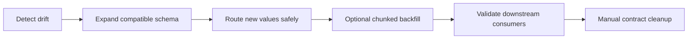

# Online schema evolution

`dpone` online schema evolution adds DDL governance on top of the existing safe schema comparator. The comparator detects drift; the online planner decides whether each DDL action is metadata-only, low-lock, blocking, breaking, or unsupported.

## Default policy

```yaml
sink:
  options:
    schema_evolution:
      enabled: true
      mode: widening
      tables: evolve
      columns: evolve
      data_type: widen
      ddl_mode: online
      on_schema_change: apply
      on_type_change: fail
      new_column_prefix: "__dpone__nc__"
```

Only non-breaking, online-safe changes are auto-applied. Blocking changes are deferred in `ddl_mode: online` unless `allow_blocking_online: true` is explicitly set.

## Contract modes

| Entity | Modes | Default | Notes |
| --- | --- | --- | --- |
| `tables` | `evolve`, `freeze`, `ignore` | `evolve` | For an absent target, only `evolve` can authorize downstream creation. `freeze` and `ignore` stop the run before target mutation. |
| `columns` | `evolve`, `freeze`, `ignore`, `quarantine` | `evolve` | Only `evolve` can apply a new physical column. The other modes retain a non-apply plan and stop before DDL/DML; they never silently discard the incoming value. |
| `data_type` | `widen`, `variant_column`, `freeze`, `quarantine` | `widen` | `variant_column` uses `__dpone__nc__<column>` for incompatible values. |
| `ddl_mode` | `online`, `safe_window`, `plan_only`, `manual_approval` | `online` | Controls whether planned DDL can execute automatically. |

## Finite fail-closed policy

Every detected change resolves to exactly one decision. Only `apply` may
continue to target DDL and DML. `notify`, `defer`, `fail`, `manual_approval`,
and `quarantine` all stop the current run before any target mutation. This rule
also applies to `metadata_only` changes: physical safety does not override an
operator's non-apply policy.

Decision precedence is deterministic:

1. `on_schema_change: fail|disable_pipeline`;
2. the applicable `tables`, `columns`, or `data_type` contract;
3. `ddl_mode: manual_approval|plan_only`;
4. table-size and dialect risk governance;
5. `on_schema_change: notify`;
6. `apply`.

`notify` records/logs the governed plan and then stops. It does not mean
"continue without applying DDL". `disable_pipeline` returns the same
fail-closed runtime error and leaves persistent disabling to the orchestrator;
dpone does not claim that a pipeline was disabled unless that external action
actually happened.

For a missing target table, creation is allowed only when all of these are
true: `tables: evolve`, `on_schema_change: apply`,
`ddl_mode: online|safe_window`, and `apply_safe: true`. `tables: ignore` does
not silently skip the payload because reporting a successful load without
writing it would be data loss. `schema_evolution.enabled: false` remains an
explicit compatibility bypass; the downstream load strategy then owns table
creation and all associated risk.

Rejected runtime paths raise `SchemaEvolutionError` with stable code
`DPONE_SCHEMA_EVOLUTION_BLOCKED`. The error includes the plan blocker, such as
`schema_evolution.notify:add_column:status`. Ledger evidence is written before
the error when `ledger_path` is configured, while target DDL, target DML, and
incremental state remain unchanged.

## DDL modes

| Mode | Behavior |
| --- | --- |
| `online` | Apply metadata-only/low-lock DDL only when the effective decision is `apply`; reject every non-apply or blocking/breaking decision before staging. |
| `safe_window` | Allow safe DDL during an operator-approved maintenance window. |
| `plan_only` | Produce the plan and fail before load if DDL is needed. |
| `manual_approval` | Defer DDL and require approval before applying. |

## Example with lock budget and ledger

```yaml
sink:
  options:
    schema_evolution:
      ddl_mode: online
      lock_timeout_seconds: 5
      statement_timeout_seconds: 60
      ledger_path: .dpone/schema_changes
```

Postgres DDL is decorated with session-level timeout statements where supported:

```sql
SET lock_timeout = '5s';
SET statement_timeout = '60s';
ALTER TABLE "landing"."orders" ADD COLUMN "status" text;
```

Timeout parameters are capability-checked, not best-effort. PostgreSQL supports
both `lock_timeout_seconds` and `statement_timeout_seconds`; MSSQL supports
`lock_timeout_seconds` through `SET LOCK_TIMEOUT`. MSSQL has no equivalent
session statement timeout in this DDL adapter, so configuring
`statement_timeout_seconds` produces
`schema_evolution.unsupported_option:statement_timeout_seconds:mssql` and
stops before DDL/DML. ClickHouse and BigQuery currently reject both timeout
parameters instead of silently ignoring them.

When `max_table_size_for_inline_ddl` is set, runtime must obtain a concrete
target cardinality before any physical schema change. MSSQL executes an exact,
three-part-qualified `COUNT_BIG(*)` only for such a run. If the sink cannot
provide a count, the run stops with `schema_evolution.table_size_unknown:*`;
if the probe itself fails, it stops with
`schema_evolution.table_size_unavailable`. A count greater than the configured
budget produces `schema_evolution.table_size_budget:*`; equality is allowed.

## Risk classes

| Risk | Auto online? | Examples |
| --- | --- | --- |
| `metadata_only` | yes | Nullable `ADD COLUMN`, generated compatibility column. |
| `low_lock` | yes | BigQuery schema API widening. |
| `blocking` | no by default | Most DB type widening, non-null add without default-safe path. |
| `breaking` | no | Drop, rename, narrowing, reserved framework namespace violation. |
| `unsupported` | no | Kafka table DDL; use Schema Registry compatibility instead. |

## Expand-contract workflow

Breaking or blocking changes should be handled as expand-contract:



For incompatible type changes, prefer:

```yaml
sink:
  options:
    schema_evolution:
      data_type: variant_column
      on_type_change: new_column
```

This creates `__dpone__nc__<column>` and preserves the original target column.

## CLI planning

```bash
dpone schema plan \
  --source source-columns.json \
  --target target-columns.json \
  --table landing.orders \
  --dialect postgres \
  --ddl-mode online \
  --lock-timeout-seconds 5 \
  --format json
```

The JSON output contains `online_schema_evolution` with risk levels, decisions, blockers, DDL, and expand-contract guidance.

## Runbook

| Symptom | Action |
| --- | --- |
| `schema_evolution.blocking:*` | Use `safe_window`, plan an expand-contract migration, or explicitly accept blocking DDL. |
| `schema_evolution.breaking:*` | Do not auto-apply. Create an expand-contract change request. |
| `schema_evolution.notify:*` | Review the ledger/notification, then change `on_schema_change` to `apply` only if this run may mutate the target. |
| `schema_evolution.unsupported_option:*` | Remove the unsupported timeout or use a sink/dialect with a concrete implementation. |
| `schema_evolution.table_size_unknown:*` | Add a target cardinality capability or remove the inline-DDL budget; dpone will not guess. |
| `DPONE_SCHEMA_EVOLUTION_BLOCKED` on `create_table` | Create the target out of band or use the explicit `tables: evolve` + apply policy. |
| DDL permission denied | Grant least-privilege `ALTER`/schema update permission or use `plan_only`. |
| Lock timeout | Re-run during a safer window or use shadow/expand-contract migration. |
| Type conflict | Use `data_type: variant_column` and migrate consumers to `__dpone__nc__*`. |
| Kafka schema conflict | Use Schema Registry compatibility checks; no table DDL is emitted. |

## Evidence

When `ledger_path` is configured, runtime writes schema change ledger artifacts with:

- `schema_change_id`
- `run_id`
- table and dialect
- risk level and decision
- DDL statements
- blockers and expand-contract guidance

Feed this artifact into `dpone ops industrial-readiness` as the `schema_evolution` evidence domain.

## Runtime governed DDL execution

Runtime uses sink-specific online DDL adapters before staging load:

| Sink | Adapter | Behavior |
| --- | --- | --- |
| Postgres | `PostgresOnlineDdlAdapter` | Applies decorated SQL through `execute_query`, including `SET lock_timeout` and `SET statement_timeout`. |
| MSSQL | `MssqlOnlineDdlAdapter` | Applies `SET LOCK_TIMEOUT` and safe `ALTER TABLE` actions. |
| ClickHouse | `ClickHouseOnlineDdlAdapter` | Applies safe `ADD COLUMN`; unsafe modifications remain blocked by governance. |
| BigQuery | `BigQuerySchemaUpdateAdapter` | Uses the existing connector query/API facade for schema updates. |
| Kafka | `KafkaSchemaRegistryCompatibilityAdapter` | Performs Schema Registry compatibility checks instead of table DDL. |

If a sink exposes `apply_governed_schema_plan`, runtime delegates to it. Otherwise, connectors exposing `execute_query` receive only governed actions with decision `apply`. Test doubles and legacy sinks can still use `apply_schema_plan` as a compatibility fallback.

## Approval workflow

Use `manual_approval` when DDL should be reviewed before execution:

```yaml
sink:
  options:
    schema_evolution:
      ddl_mode: manual_approval
      ledger_path: .dpone/schema_changes
```

Approve a ledger artifact:

```bash
dpone schema approve \
  --ledger .dpone/schema_changes/schema_change_run01_abcd.json \
  --approver data-architect \
  --output-dir .dpone/schema_approvals \
  --format json
```

## Executable expand-contract plan

For incompatible changes, generate a three-phase migration artifact:

```bash
dpone schema expand-contract \
  --source source-columns.json \
  --target target-columns.json \
  --table landing.orders \
  --dialect postgres \
  --output-dir .dpone/schema_expand_contract \
  --format json
```

The artifact contains `expand`, `backfill`, and `contract` phases and uses `__dpone__nc__*` for variant-column compatibility.

## Schema history and notifications

`SchemaHistoryRegistry` records versioned schema snapshots and diffs for each table. `SchemaNotificationService` turns ledger artifacts into JSON and Markdown notifications that can be attached to run reports, release evidence, or future Slack/webhook integrations.
