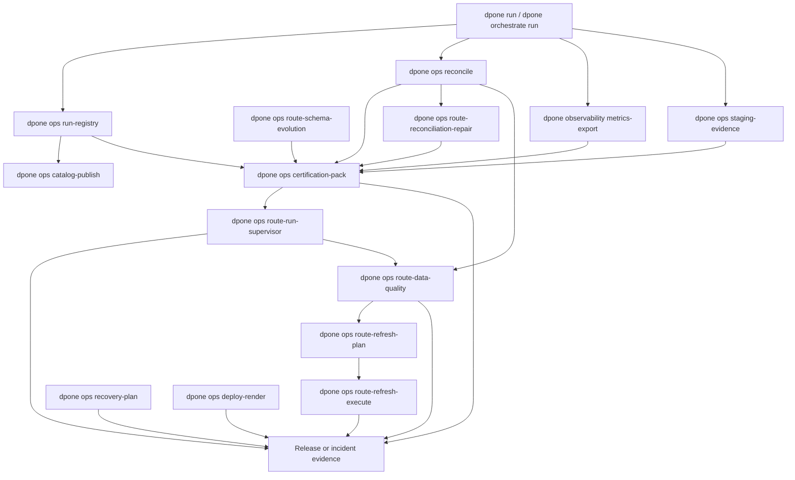

# Operational control plane

The operational control plane is the layer around `dpone run` that turns a
single pipeline execution into a repeatable production operating model. It does
not replace the runtime. It creates plans, evidence, catalogs, deployment
handoff files, recovery guidance, and observability templates that operators can
review and automate.

## Contents

- [Control-plane flow](#control-plane-flow)
- [Certification pack](#certification-pack)
- [Runtime recovery plan](#runtime-recovery-plan)
- [Reconciliation 2.0](#reconciliation-20)
- [Live certification](#live-certification)
- [Observability pack](#observability-pack)
- [Deployment profiles](#deployment-profiles)
- [Object-storage staging evidence](#object-storage-staging-evidence)
- [Catalog publication](#catalog-publication)
- [Production runbook](#production-runbook)
- [Developer extension points](#developer-extension-points)

## Control-plane flow



The design is intentionally artifact-first:

| Principle | Behavior |
| --- | --- |
| Runtime stays canonical | `dpone run` and `dpone orchestrate run` remain the only execution paths. |
| Ops commands are non-invasive by default | Commands plan, validate, and render artifacts unless a dedicated destructive command explicitly requires `--yes`. |
| Evidence is immutable | JSON and Markdown outputs include checksums or references suitable for release, incident, and certification review. |
| CI-friendly output | Every command supports `--format json` or writes machine-readable JSON artifacts. |
| No credentials in artifacts | Deployment and catalog artifacts show handoff shape, not inline secrets. |

## Certification pack

Use `dpone ops certification-pack` to aggregate matrix, observability, lineage,
reconciliation, staging, and contract artifacts into one connector certification
2.0 evidence package.

```bash
dpone ops certification-pack \
  --pack-id postgres-mssql-orders-2026-06-06 \
  --output-dir test_artifacts/certification/postgres_mssql_orders \
  --artifact certification_report=test_artifacts/integration_matrix/certification_report.json \
  --artifact observability=.dpone/observability/orders/runtime_metrics.json \
  --artifact reconciliation=.dpone/reconciliation/orders/reconciliation_report.json \
  --artifact lineage=.dpone/lineage/orders/openlineage_catalog_event.json \
  --require certification_report \
  --require observability \
  --require reconciliation \
  --format json
```

Generated files:

| File | Purpose |
| --- | --- |
| `connector_certification_pack.json` | Machine-readable pack with blockers, coverage, artifact checksums, and item statuses. |
| `connector_certification_pack.md` | Human-readable release or incident review artifact. |

Coverage is inferred from source -> sink case IDs such as
`postgres_to_mssql__incremental_merge`. This makes missing connector, sink, or
strategy coverage visible before a release is promoted.

Runbook when the pack is red:

1. Open `blockers` in `connector_certification_pack.json`.
2. Re-run missing or failing required artifacts first.
3. Compare `coverage.sources`, `coverage.sinks`, and `coverage.strategies`
   against the expected certification matrix.
4. Do not publish connector badges or production readiness claims while the pack
   is red.

## Live certification

Use [Live certification](live-certification.md) when connector, strategy, native
fast path, state backend, or source -> sink behavior needs proof against local
disposable services or real vendor systems.

Plan a local live run:

```bash
dpone ops live-certification-plan \
  --profile local_live \
  --row-count 25000 \
  --output-dir test_artifacts/live_certification/plan \
  --format json
```

Evaluate the combined performance/SLO gate:

```bash
dpone ops benchmark-slo-gate \
  --metrics-json '{"throughput_rows_per_second":120000,"freshness_lag_seconds":120}' \
  --baseline-json '{"throughput_rows_per_second":{"value":100000,"direction":"higher"}}' \
  --objectives-json '{"freshness_lag_seconds":{"max":300}}' \
  --output-dir test_artifacts/live_certification/benchmark-slo \
  --format json
```

The `local_live` profile uses `docker/docker-compose.integration.yml` for
Postgres, MySQL, MSSQL, ClickHouse, Kafka, Schema Registry, and MinIO. Its
retained status is derived from executed JUnit cases. Use `real_local` before
minor and major releases; then run the separate `benchmark-slo-gate`,
`performance-certification`, `live-state-reconciliation`, and
`pre-release-checklist` / `release-evidence-pack` producers with observed
inputs. Missing domains are `UNVERIFIED`. The `vendor_live` profile is manual
and requires configured provider secrets.
For route-heavy release candidates, set `docker_live_routes=true` in
`pre-release-checklist` only after Docker-live Postgres -> MSSQL and MSSQL ->
ClickHouse evidence has been generated, and set `documentation_mkdocs=true`
only after the strict docs build has passed.

Those CLI services create diagnostic summaries only. The abbreviated pack
command is unsafe because omitted required roles fail closed, while invented
inputs can create false claims. For a minor/major go/no-go decision, dispatch
the exact-`master` `Release candidate evidence` workflow and follow the
[canonical pre-tag workflow](release-evidence.md#canonical-pre-tag-workflow).
Its fixed `native_transfer` campaign derives the closed pack and manifest from
observed roles; both publishing workflows authenticate the paired tag-push
cutoff, independently select the unique newest exact-SHA dispatch created no
later than that cutoff, validate that run's current attempt, and reverify
before each mutation block's first write. Equal eligible timestamps fail
closed; post-cutoff dispatches are ignored.

## Runtime recovery plan

Use `dpone ops recovery-plan` after an interrupted run or before manually
cleaning local state.

```bash
dpone ops recovery-plan \
  --state-dir .dpone/orchestration-state \
  --lock-dir .dpone/locks \
  --load-package-dir .dpone/load-packages \
  --output-dir .dpone/recovery/orders \
  --format json
```

The planner reads:

| Input | What it detects |
| --- | --- |
| Orchestration job state | failed/resumable runs and previous blockers. |
| Lock files | active local concurrency locks that may still represent running jobs. |
| Load packages | `started` or `staged` load packages that need commit, rollback, or inspection. |

The planner is non-destructive. It returns actions such as:

```text
dpone orchestrate run --resume-policy resume
inspect_or_cleanup_lock
rollback_or_commit_load_package
```

Runbook:

1. Prefer resume over restart when the previous job state is `resumable`.
2. Inspect active locks before deleting them.
3. Resolve staged load packages with target-native rollback or commit evidence.
4. Re-run the recovery plan after every manual action.

## Reconciliation 2.0

Use `dpone ops reconcile` for bounded row-level source-target validation and a
repair plan.

```bash
dpone ops reconcile \
  --source-rows-json '[{"id":1,"amount":100},{"id":2,"amount":200}]' \
  --target-rows-json '[{"id":1,"amount":100},{"id":2,"amount":250}]' \
  --key id \
  --compare-columns amount \
  --output-dir .dpone/reconciliation/orders \
  --format json
```

The service computes:

| Signal | Meaning |
| --- | --- |
| `missing_count` | Source rows not present in target. |
| `extra_count` | Target rows not present in source or target rows whose source row is physically deleted. |
| `mismatch_count` | Same key but different compared values. |
| `delete_count` | Source rows marked deleted through `--delete-column`. |
| Checksums | Stable source and target comparison hashes. |
| Repair actions | `insert_target_row`, `update_target_row`, or `delete_target_row`. |

Physical deletes are safe by construction: a source delete marker only generates
a target delete action when the target still contains that key.

Runbook:

1. Use staging-first `incremental_merge` to repair inserts and updates.
2. Verify delete policy before applying hard deletes.
3. Keep reconciliation red as a state-commit blocker.
4. Attach the reconciliation report to certification packs.

## Route schema evolution and repair

Use route-level schema evolution and reconciliation repair evidence when a
release candidate needs industrial `source -> sink -> strategy` proof rather
than only row-level or CDC-level artifacts.

```bash
dpone ops route-schema-evolution \
  --source mssql \
  --sink clickhouse \
  --strategy incremental_merge \
  --schema-evolution-json test_artifacts/cdc_schema/mssql_to_clickhouse/orders/cdc_schema_evolution_evidence.json \
  --output-dir test_artifacts/route_schema/mssql_to_clickhouse/orders \
  --format json

dpone ops route-reconciliation-repair \
  --source postgres \
  --sink mssql \
  --strategy incremental_merge \
  --source-rows-json test_artifacts/reconciliation/orders/source_rows.json \
  --target-rows-json test_artifacts/reconciliation/orders/target_rows.json \
  --key id \
  --compare-column status \
  --output-dir test_artifacts/route_repair/postgres_to_mssql/orders \
  --format json
```

Runbook:

1. Generate upstream CDC schema or reconciliation artifacts first.
2. Convert them into route-level evidence with the route commands.
3. Attach `route_schema_evolution.json` and
   `route_reconciliation_repair.json` to route readiness.
4. Keep route state promotion blocked while either report is red.

## Route run supervisor

Use `dpone ops route-run-supervisor` after a manifest run, CDC apply, repair,
or route release-candidate execution to produce one lifecycle receipt for a
`source -> sink -> strategy` route. Use `--run-mode route_refresh` to add an
`execution_contract` that enforces refresh execute, read-only snapshot capture,
exact verification, ledger, and state-promotion evidence before release.

```bash
dpone ops route-run-supervisor \
  --source mssql \
  --sink clickhouse \
  --strategy incremental_merge \
  --run-id orders-2026-06-14T10-00Z \
  --dataset analytics.orders \
  --manifest manifests/orders.yml \
  --run-mode route_refresh \
  --artifact route_readiness=test_artifacts/route_readiness/mssql_to_clickhouse/route_readiness.json \
  --artifact route_refresh_execution=test_artifacts/route_refresh_execution/mssql_to_clickhouse/orders/route_refresh_execution.json \
  --artifact route_refresh_snapshot_capture=test_artifacts/route_refresh_execution/mssql_to_clickhouse/orders/route_refresh_snapshot_capture.json \
  --artifact route_refresh_verification=test_artifacts/route_refresh_execution/mssql_to_clickhouse/orders/route_refresh_verification.json \
  --artifact route_execution_ledger=test_artifacts/route_execution/mssql_to_clickhouse/orders/route_execution_ledger.json \
  --artifact state_promotion=test_artifacts/route_state/mssql_to_clickhouse/orders/state_promotion.json \
  --output-dir test_artifacts/route_runs/mssql_to_clickhouse/orders \
  --format json
```

Runbook:

1. Generate upstream route and CDC evidence first.
2. Attach the artifacts with `--artifact name=/path`.
3. In `route_refresh` mode, inspect `execution_contract.next_commands` for the
   next missing execute, capture, verify, ledger, or promote command.
4. Treat `ready` as release evidence, `retryable` as a bounded rerun path,
   `unsafe_to_retry` as a stop-the-line state/sink safety condition, and
   `manual_approval_required` as a governance handoff.
5. Require `route_run_supervisor` in `dpone ops route-release-gate` for route
   release candidates that must prove manifest/run lifecycle safety.

## Route data quality

Use `dpone ops route-data-quality` after a route run, CDC apply, or repair flow
to produce one data quality scorecard for a `source -> sink -> strategy` route.
The command reads data contract, quarantine, reconciliation, and optional run
evidence. It does not execute live queries or mutate sinks.

```bash
dpone ops route-data-quality \
  --source mssql \
  --sink clickhouse \
  --strategy incremental_merge \
  --artifact data_contract=test_artifacts/contracts/orders/data_contract_evidence.json \
  --artifact quarantine=test_artifacts/quarantine/orders/quarantine_export.json \
  --artifact reconciliation=test_artifacts/reconciliation/orders/reconciliation_report.json \
  --output-dir test_artifacts/route_quality/mssql_to_clickhouse/orders \
  --format json
```

Runbook:

1. Generate data contract, quarantine, and reconciliation artifacts first.
2. Attach optional route lifecycle evidence with `--artifact` and `--require`.
3. Treat `passed` and reviewed `warning` as release evidence.
4. Treat `quarantine_sla_breached` and `waiver_required` as stop-the-line
   governance states until exceptions are drained or approved.
5. Require `route_data_quality` in `dpone ops route-release-gate` for critical
   route release candidates.

## Route refresh plan

Use `dpone ops route-refresh-plan` when a `source -> sink -> strategy` route
needs a reviewed, idempotent backfill, replay, refresh, or resync plan before
execution. The command reads existing route evidence, validates route identity,
splits bounded windows into chunks, detects state rewind, classifies approval,
and writes `route_refresh_plan.json` and `route_refresh_plan.md`.

```bash
dpone ops route-refresh-plan \
  --source mssql \
  --sink clickhouse \
  --strategy incremental_merge \
  --dataset analytics.orders \
  --reason dq_repair \
  --window-kind integer \
  --start 1 \
  --end 250000 \
  --chunk-size 10000 \
  --artifact route_data_quality=test_artifacts/route_quality/mssql_to_clickhouse/orders/route_data_quality.json \
  --require route_data_quality \
  --output-dir test_artifacts/route_refresh/mssql_to_clickhouse/orders \
  --format json
```

Runbook:

1. Generate upstream route evidence before planning the replay.
2. Keep the window bounded and choose chunk sizes that downstream executors can
   resume idempotently.
3. Capture approval for destructive refreshes, source state rewinds, or routes
   that require manual governance.
4. Attach `route_refresh_plan.json` to `dpone ops route-release-gate` as
   `route_refresh_plan` whenever a release includes replay, backfill, repair,
   or resync work.

## Route refresh execute

Use `dpone ops route-refresh-execute` after a refresh plan has been reviewed.
The command reads `route_refresh_plan.json`, runs in `dry_run` by default,
delegates real chunk work to a configured `RouteRefreshExecutor`, and writes
`route_refresh_execution.json` and `route_refresh_execution.md`.

```bash
dpone ops route-refresh-execute \
  --route-refresh-plan-json test_artifacts/route_refresh/mssql_to_clickhouse/orders/route_refresh_plan.json \
  --runner-id operator-a \
  --output-dir test_artifacts/route_refresh_execution/mssql_to_clickhouse/orders \
  --format json
```

Execute the first built-in concrete backend only with an explicit executor
config:

```bash
dpone ops route-refresh-execute \
  --route-refresh-plan-json test_artifacts/route_refresh/mssql_to_clickhouse/orders/route_refresh_plan.json \
  --runner-id route-worker-1 \
  --execute \
  --executor mssql_clickhouse \
  --executor-config-json test_artifacts/route_refresh_execution/mssql_to_clickhouse/orders/executor-config.json \
  --output-dir test_artifacts/route_refresh_execution/mssql_to_clickhouse/orders \
  --format json
```

Runbook:

1. Generate and review a ready route refresh plan first.
2. Run the execute command in `dry_run` mode before real data movement.
3. Use `--execute` only when a route-specific executor is configured.
4. Require `route_refresh_execution` in `dpone ops route-release-gate` for
   releases that actually apply refresh chunks.

## Observability pack

Use `dpone ops observability-pack` to generate reusable Grafana and Prometheus
templates for runtime metrics.

```bash
dpone ops observability-pack \
  --output-dir .dpone/observability-pack/orders \
  --service-name dpone \
  --dashboard-title "dpone orders runtime" \
  --alert dpone_run_passed.min=1 \
  --alert dpone_error_count.max=0 \
  --format json
```

Generated files:

| File | Purpose |
| --- | --- |
| `grafana_dashboard.json` | Provisionable Grafana dashboard with rows, runtime, errors, warnings, and lag panels. |
| `prometheus_alerts.yml` | Prometheus alert rules for failure and configured thresholds. |
| `observability_pack.json` | Machine-readable pack report. |
| `observability_pack.md` | Operator summary and runbook. |

Pair this with [Runtime observability](observability.md), which exports actual
Prometheus and OpenTelemetry runtime metrics from a run report.

## Deployment profiles

Use `dpone ops deploy-render` to generate scheduler handoff templates while
keeping `dpone orchestrate run` as the production execution command.

```bash
dpone ops deploy-render \
  --target k8s-cronjob \
  --manifest manifests/orders.yml \
  --selector daily_orders \
  --image ghcr.io/paulkov/dpone:X.Y.Z \
  --schedule "0 2 * * *" \
  --output-dir .dpone/deploy/orders \
  --format json
```

Supported targets:

| Target | Artifact |
| --- | --- |
| `docker-compose` | `docker-compose.yml` |
| `k8s-cronjob` | `k8s-cronjob.yml` |
| `airflow` | `airflow_dag.py` |
| `dagster` | `dagster_asset.py` |

Runbook:

1. Review generated commands before deploying.
2. Inject credentials through platform secrets.
3. Keep lock/state directories on durable storage when jobs can overlap.
4. Attach the rendered profile to release or environment-promotion evidence.

## Object-storage staging evidence

Use `dpone ops staging-evidence` after staging files through
[Object storage staging](object-storage-staging.md).

```bash
dpone ops staging-evidence \
  --manifest .dpone/staging/orders/object_storage_manifest.json \
  --sink clickhouse \
  --target-table landing.orders \
  --output-dir .dpone/staging-evidence/orders \
  --format json
```

The evidence report validates:

| Check | Purpose |
| --- | --- |
| Object list is present | Prevents empty staging manifests from being promoted. |
| `sha256` length | Ensures every staged object has checksum evidence. |
| `size_bytes` positive | Catches empty or failed uploads. |
| Native load hint | Shows the target-specific loading shape for operator review. |

Runbook:

1. Verify object count and checksums before native target load.
2. Keep staging objects immutable until target load and reconciliation pass.
3. Use cleanup only after load evidence and source state commit are recorded.

## Catalog publication

Use `dpone ops catalog-publish` to produce catalog handoff payloads for
OpenLineage, dbt, and DataHub-compatible ingestion.

```bash
dpone ops catalog-publish \
  --run-registry-entry .dpone/run-registry/<run_id>__run_registry.json \
  --namespace dpone.local \
  --input postgres=public.orders \
  --output mssql=landing.orders \
  --output-dir .dpone/catalog/orders \
  --format json
```

Generated files:

| File | Purpose |
| --- | --- |
| `openlineage_catalog_event.json` | OpenLineage-compatible catalog event. |
| `dbt_sources.yml` | dbt source definitions for downstream projects. |
| `datahub_mcp.json` | DataHub MCP-like dataset payload. |
| `catalog_publication.json` | Machine-readable dpone publication report. |
| `catalog_publication.md` | Human-readable operator summary. |

Runbook:

1. Publish OpenLineage to the same collector used for runtime lineage.
2. Review generated dbt sources before committing them to the analytics project.
3. Feed DataHub payloads through the platform-owned ingestion job.
4. Keep `run_id` stable across run registry, lineage, and catalog artifacts.

## Production runbook

Recommended high-confidence release path:

```bash
dpone orchestrate run \
  --manifest manifests/orders.yml \
  --selector daily_orders \
  --resume-policy resume \
  --format json > .dpone/runs/orders/run_result.json

dpone ops run-registry \
  --run-result .dpone/runs/orders/run_result.json \
  --output-dir .dpone/run-registry \
  --format json

dpone observability metrics-export \
  --run-report .dpone/runs/orders/run_result.json \
  --output-dir .dpone/observability/orders \
  --format json

dpone ops reconcile \
  --source-rows-json "$SOURCE_SAMPLE" \
  --target-rows-json "$TARGET_SAMPLE" \
  --key id \
  --output-dir .dpone/reconciliation/orders \
  --format json

dpone ops certification-pack \
  --pack-id orders-release \
  --artifact certification_report=test_artifacts/integration_matrix/certification_report.json \
  --artifact observability=.dpone/observability/orders/runtime_metrics.json \
  --artifact reconciliation=.dpone/reconciliation/orders/reconciliation_report.json \
  --require certification_report \
  --require observability \
  --require reconciliation \
  --output-dir .dpone/certification-pack/orders \
  --format json
```

If anything is red:

1. Run `dpone ops recovery-plan`.
2. Inspect the red artifact and follow its runbook.
3. Re-run the focused command.
4. Regenerate `certification-pack`.
5. Promote only when all required artifacts are green.

## Developer extension points

| Need | Module |
| --- | --- |
| Add a new evidence item type | `dpone.ops.certification_pack` |
| Add recovery signals | `dpone.ops.recovery` |
| Extend row comparison or checksums | `dpone.ops.reconciliation` |
| Add dashboards or alert templates | `dpone.ops.observability_pack` |
| Add a deployment target | `dpone.ops.deploy_profiles` |
| Add target-native staging hints | `dpone.ops.staging_evidence` |
| Add a catalog payload | `dpone.ops.catalog_publish` |

Design constraints:

1. Keep CLI adapters thin.
2. Keep services dependency-light and deterministic.
3. Avoid target writes in planning services.
4. Prefer JSON+Markdown artifacts for every operator workflow.
5. Add tests for service behavior, CLI output, docs links, and runbook coverage.
