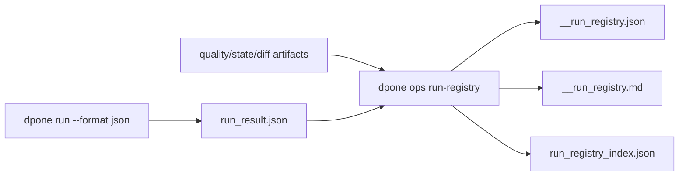
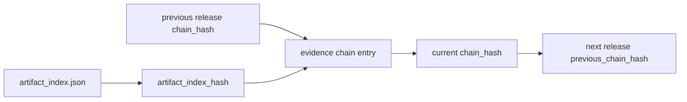
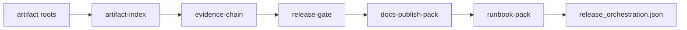
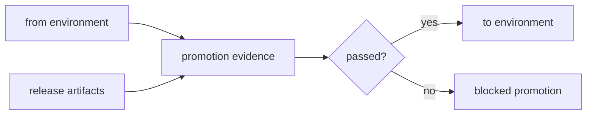
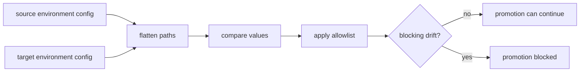
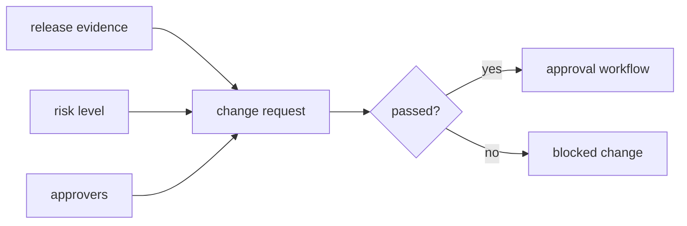
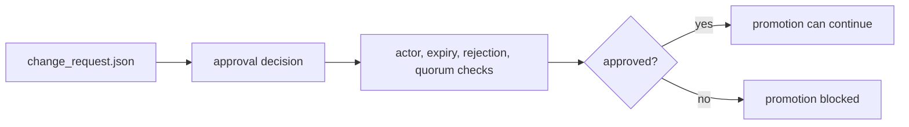
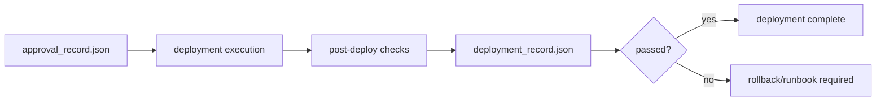
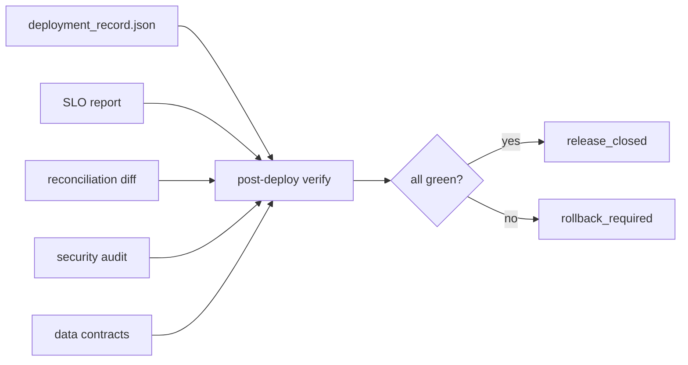
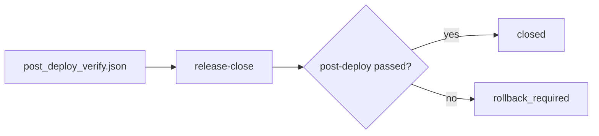

# `dpone ops` operational controls

`dpone ops` is the self-service operational toolbox for local, CI, staging, and
production-like runs. It is not a separate runtime mode. The same commands are
safe to use before a local smoke test, in manual certification, or during an
incident review.

## Command map

| Capability | Command | Purpose |
| --- | --- | --- |
| Artifact index | `dpone ops artifact-index` | Index `.dpone/` and `test_artifacts/` ops artifacts for GitHub Pages and CI. |
| Run registry | `dpone ops run-registry` | Record `dpone run` results and attached evidence as immutable checksumed run entries. |
| OpenLineage export | `dpone ops lineage-export` | Export a run registry entry as an OpenLineage-compatible event. |
| dbt lineage | `dpone ops dbt-lineage` | Export dbt artifacts as graph and OpenLineage-compatible transformation lineage evidence. |
| Native certification harness | `dpone ops certification-run` | Run selected source -> sink matrix contracts and write evidence artifacts. |
| Certification suite | `dpone ops certification-suite` | Aggregate matrix, benchmark, lineage, dbt, strategy, and evidence artifacts into one release gate. |
| Connector certification pack | `dpone ops certification-pack` | Aggregate certification, observability, reconciliation, staging, and lineage artifacts into one connector certification 2.0 pack. |
| Live certification plan | `dpone ops live-certification-plan` | Plan local-live, type-matrix, real-local, or vendor-live certification with services, commands, artifacts, and credential boundaries. |
| Benchmark and SLO gate | `dpone ops benchmark-slo-gate` | Evaluate performance baseline regression and operational SLO objectives as one release evidence artifact. |
| Performance certification | `dpone ops performance-certification` | Build release-grade throughput, duration, memory, and failure-rate evidence. |
| Live state/reconciliation | `dpone ops live-state-reconciliation` | Aggregate state backend, XMin/Kafka/CDC state, and physical-delete reconciliation evidence. |
| Release evidence pack | `dpone ops release-evidence-pack` | Build the final go/no-go evidence pack for minor and major releases. |
| Pre-release checklist | `dpone ops pre-release-checklist` | Record explicit CLI help/output, CLI/Python run, nested identity, route matrix/artifact, Docker-live, contracts, docs, CI, and package checks before release. |
| Runtime recovery plan | `dpone ops recovery-plan` | Detect failed/resumable jobs, active locks, and uncommitted load packages. |
| Reconciliation 2.0 | `dpone ops reconcile` | Compute source-target counts, checksums, delete reconciliation, and repair actions. |
| Observability pack | `dpone ops observability-pack` | Generate Grafana dashboard and Prometheus alert templates. |
| Deployment profile rendering | `dpone ops deploy-render` | Render Docker Compose, Kubernetes CronJob, Airflow DAG, or Dagster asset handoff templates. |
| Object-storage staging evidence | `dpone ops staging-evidence` | Validate object-storage staging manifests and render target-native load hints. |
| Object-storage retention | `dpone ops object-storage budget`, `dpone ops object-storage cleanup`, `dpone ops object-storage lifecycle` | Check bucket budget, sweep stale run-scoped prefixes, and render or verify lifecycle safety-net rules. |
| Catalog publication | `dpone ops catalog-publish` | Build OpenLineage, dbt sources, and DataHub-compatible publication artifacts. |
| Release summary | `dpone ops release-summary` | Combine replay, source -> sink matrix, and connector certification evidence into one final go/no-go report. |
| Certification history | `dpone ops certification-history` | Record release history, badge status, fixed cases, and certification regressions. |
| Connector badges | `dpone ops connector-badges` | Generate README/GitHub Pages connector badge matrix artifacts. |
| Data contracts and drift guard | `dpone ops contract-check` | Evaluate required columns, nullability, uniqueness, row count, and null-ratio contracts. |
| DLQ inspection and replay planning | `dpone ops quarantine-export`, `dpone ops quarantine-replay` | Inspect safe rejected-record metadata and build a replay preview. |
| Load package lifecycle | `dpone ops package-start`, `dpone ops package-commit` | Create load IDs and enforce state commit only after load commit. |
| Rollback and restore | `dpone ops rollback-plan`, `dpone ops rollback-apply`, `dpone ops rollback-execute` | Build, preview, and apply explicit target-native rollback plans. |
| Connector marketplace | `dpone ops marketplace` | Render connector certification status, capabilities, badges, and docs links. |
| Evidence bundle | `dpone ops evidence-bundle` | Collect certification, data-contract, and marketplace evidence with checksums. |
| Evidence chain | `dpone ops evidence-chain` | Append a tamper-evident release evidence chain entry. |
| Go-live gate | `dpone ops go-live-gate` | Evaluate required evidence and return go/no-go blockers. |
| Policy-as-code | `dpone ops policy-evaluate` | Enforce JSON release policies against an evidence bundle. |
| Reconciliation diff | `dpone ops diff` | Compare bounded source/target rows and emit missing, extra, and mismatch samples. |
| Security audit | `dpone ops security-audit` | Detect inline secrets, unsafe connection types, and unredacted log tokens. |
| SLO evaluation | `dpone ops slo-evaluate` | Evaluate freshness, throughput, latency, failure-rate, and retry-budget objectives. |
| Benchmark baseline | `dpone ops benchmark-baseline` | Detect throughput/latency regressions against committed benchmark profiles. |
| Incident pack | `dpone ops incident-pack` | Bundle evidence, policy, SLO, security, diff, and rollback artifacts for review. |
| Release gate | `dpone ops release-gate` | Aggregate ops artifacts into one release readiness decision. |
| Production maturity gate | `dpone ops production-maturity` | Aggregate CDC, performance, security, supply-chain, governance, and docs evidence into one operational readiness decision; production route authority remains separate. |
| Release orchestrator | `dpone ops release-orchestrator` | Run artifact index, evidence chain, release gate, docs pack, and runbook pack as one release pipeline. |
| Release promotion | `dpone ops release-promote` | Record immutable environment promotion evidence for dev/staging/production handoff. |
| Connection doctor | `dpone ops connection-doctor` | Check route tools, environment variables, Python imports, install extras, and prerequisite blockers without opening database connections. |
| Source discovery | `dpone ops source-discover` | Normalize exported source schema JSON into table, column, key-candidate, cursor-candidate, and type-risk evidence. |
| Route bootstrap | `dpone ops route-bootstrap` | Generate a matrix-backed manifest draft, type-risk summary, and next-command plan for one source -> sink -> strategy route. |
| Route doctor | `dpone ops route-doctor` | Aggregate onboarding artifacts into one route go/no-go report before route readiness and certification. |
| Route Conformance Lab | `dpone ops route-conformance run` | Generate deterministic source/sink snapshots, exact typed-hash verification, physical-contract checks, and release-gate evidence. |
| Route certification pack | `dpone ops route-certification-pack` | Generate readiness-compatible evidence files and embedded route readiness report for one source -> sink -> strategy route. |
| Route live certification | `dpone ops route-live-certification` | Build a Docker-live/vendor-live route harness and `route_live_evidence_bundle` for release candidates. |
| Route certify | `dpone ops route-certify` | Build the final route release certification bundle and promotion gate from immutable evidence artifacts. |
| Route certify release | `dpone ops route-certify-release` | Aggregate first-class route certification bundles into one release-level go/no-go report and release-notes fragment. |
| Route release finalize | `dpone ops route-release-finalize` | Discover route bundles, enforce freshness/provenance/regression checks, record history, and write the final route release gate. |
| Route release candidate orchestrator | `dpone ops route-rc-orchestrator` | Compose route certification, route live certification, route release gate, and release evidence pack into one fail-closed receipt. |
| Route release candidate executor | `dpone ops route-rc-execute` | Dry-run or explicitly execute `route_rc_orchestration.json` commands with timeout, retry, redaction, artifact collection, and `route_rc_execution` output. |
| Release RC collector | `dpone ops release-rc-collect` | Convert GitHub CLI PR exports and evidence refs into finalizer-ready release inputs. |
| Release RC finalizer | `dpone ops release-rc-finalize` | Validate the stacked merge train, release version context, and required release evidence before tagging. |
| Route release gate | `dpone ops route-release-gate` | Aggregate route readiness, certification, ledger, state promotion, and optional CDC evidence into one route release go/no-go receipt. |
| Route run supervisor | `dpone ops route-run-supervisor` | Build one route lifecycle receipt and optional `route_refresh` execution contract from manifest/run evidence. |
| Route data quality | `dpone ops route-data-quality` | Build a route-level scorecard and exception backlog receipt from data contract, quarantine, reconciliation, and optional runtime evidence. |
| Route refresh plan | `dpone ops route-refresh-plan` | Plan idempotent route backfill, replay, refresh, or resync chunks with evidence, approval, and state-rewind checks. |
| Route refresh execute | `dpone ops route-refresh-execute` | Dry-run or execute a route refresh plan through a configured executor and write chunk-level evidence. |
| Route refresh capture snapshots | `dpone ops route-refresh-capture-snapshots` | Capture read-only source/sink snapshots after route refresh execution and write verification-ready typed hash evidence. |
| Route readiness | `dpone ops route-readiness` | Evaluate one source -> sink -> strategy route from matrix, strategy, docs, benchmark, and run evidence. |
| Route schema evolution | `dpone ops route-schema-evolution` | Promote CDC schema evolution evidence into a route-level DDL/apply decision. |
| Route reconciliation repair | `dpone ops route-reconciliation-repair` | Promote source-target reconciliation differences into a route-level repair receipt. |
| Route execution ledger | `dpone ops route-execution-ledger` | Record idempotent route execution, lease fencing, and commit protocol evidence for one route. |
| Route state promotion | `dpone ops route-state-promote` | Promote source state from a verified route execution ledger and durable sink commit receipt. |
| CDC apply certification | `dpone ops cdc-apply-certification` | Generate CDC apply correctness, delete semantics, typed hash, and embedded handoff evidence from a fixture. |
| CDC snapshot handoff | `dpone ops cdc-handoff` | Evaluate snapshot boundary, CDC window, retention, apply, delete, typed hash, and schema drift evidence for one stream. |
| CDC observability evidence | `dpone ops cdc-observability-evidence` | Generate CDC lag, freshness, retention, offset, replay, and throughput SLO evidence from upstream CDC artifacts and telemetry. |
| CDC recovery evidence | `dpone ops cdc-recovery-evidence` | Generate CDC fault-injection recovery evidence for restart, replay, offset ordering, partial commit, poison event, and retention margin. |
| CDC schema evolution evidence | `dpone ops cdc-schema-evolution-evidence` | Generate CDC schema-change, compatibility, DDL dry-run, backfill, approval, and offset-ordering evidence. |
| CDC promotion gate | `dpone ops cdc-promotion-gate` | Combine CDC evidence into final `production_ready` and `promote_offsets` decisions. |
| CDC runtime run | `dpone ops cdc-runtime-run` | Run one bounded CDC read, sink apply, and durable offset commit tick; use `--mode live` for MSSQL -> ClickHouse live adapters. |
| CDC quarantine inspection | `dpone ops cdc-quarantine-inspect` | Summarize CDC poison quarantine records by reason and action before replay or incident closure. |
| CDC replay execution | `dpone ops cdc-replay-execute` | Replay quarantined CDC events through an injected sink applier without mutating CDC offsets. |
| CDC compare and repair | `dpone ops cdc-compare-repair`, `dpone ops cdc-repair-execute` | Compare source rows with the ClickHouse CDC log current state, write repair plans, and execute bounded repairs without mutating offsets. |
| CDC retention gap auto-resync | `dpone ops cdc-retention-check`, `dpone ops cdc-resync-plan`, `dpone ops cdc-resync-execute` | Detect source retention gaps, write bounded resync plans, and execute resync actions without mutating offsets. |
| Environment drift | `dpone ops env-drift` | Compare environment manifests/configs and block unapproved drift before promotion. |
| Change request | `dpone ops change-request` | Build a machine-readable release approval artifact with risk, approvers, and evidence. |
| Approval record | `dpone ops approval-record` | Record actual approval/rejection decisions and evaluate quorum before promotion. |
| Deployment record | `dpone ops deployment-record` | Record factual deployment outcome, post-deploy checks, and rollback pointer. |
| Post-deploy verification | `dpone ops post-deploy-verify` | Aggregate final deployment, SLO, diff, security, and contract checks into close-or-rollback gate. |
| Release close | `dpone ops release-close` | Write final immutable release closure or rollback-required evidence. |
| Docs publish pack | `dpone ops docs-publish-pack` | Build README and GitHub Pages snippets from ops artifacts. |
| Manifest bundle | `dpone ops manifest-bundle` | Create a redacted portable support/release bundle with checksums. |
| Runbook pack | `dpone ops runbook-pack` | Generate an operator go-live/rollback/incident runbook from ops artifacts. |
| Performance planning | `dpone perf advise` | Recommend native bulk paths, partitioning, and throughput improvements. |

## Design rules

- There is no `production` namespace or `production` mode.
- Operational services live under `dpone.ops.*`.
- CLI adapters are thin; business rules stay in focused services.
- Destructive operations require explicit `--yes`.
- Every command supports JSON output for automation where relevant.
- Artifacts should be saved under `.dpone/` for local runs and under
  `test_artifacts/` for tests/certification.
- Minor and major releases require a green `dpone ops release-evidence-pack`
  produced from `real_local` evidence before tagging or publishing.

## Artifact index

Use `dpone ops artifact-index` to publish a searchable list of generated ops
artifacts for GitHub Pages, CI summaries, release notes, and incident review.

```bash
dpone ops artifact-index \
  --output-dir .dpone/artifact-index \
  --root .dpone \
  --root test_artifacts \
  --release vX.Y.Z \
  --format json
```

Artifacts written:

```text
artifact_index.json
artifact_index.md
```

Indexed metadata:

| Field | Meaning |
| --- | --- |
| `artifact_type` | Type inferred from artifact filename such as `release_gate` or `ops_evidence_bundle`. |
| `sha256` | Content checksum for audit and tamper detection. |
| `size_bytes` | File size for storage and artifact growth reviews. |
| `modified_at` | UTC file modification timestamp. |
| `release`, `run_id`, `passed` | Extracted from JSON artifacts when present. |

Runbook when the index is red:

1. Find rows with `passed=false`.
2. Open the referenced artifact path.
3. Fix the underlying gate, SLO, security, diff, or certification issue.
4. Regenerate the artifact and re-run `artifact-index`.

## Run registry

Use `dpone ops run-registry` after [`dpone run`](run.md) to create an
auditable run entry. The registry stores the canonical run result, attached
quality/state/reconciliation artifacts, SHA-256 checksums, and an append/update
`run_registry_index.json`.

```bash
dpone run manifests/orders.yml \
  --selector daily_orders \
  --format json > .dpone/runs/daily_orders/run_result.json

dpone ops run-registry \
  --output-dir .dpone/run-registry \
  --run-result .dpone/runs/daily_orders/run_result.json \
  --artifact quality=.dpone/runs/daily_orders/quality.json \
  --artifact state=.dpone/runs/daily_orders/state_transition.json \
  --format json
```

Artifacts written:

```text
<run_id>__run_registry.json
<run_id>__run_registry.md
run_registry_index.json
```

Registry fields:

| Field | Meaning |
| --- | --- |
| `run_id` | Run identifier from `dpone run`, or `unknown_run` when the result is invalid. |
| `process` | Manifest process selector/name. |
| `status`, `passed`, `blockers` | Final run health and blocking diagnostics. |
| `run_result_sha256` | SHA-256 checksum of the canonical `dpone run --format json` output. |
| `artifacts` | Attached quality, state, diff, SLO, release, or support artifacts with checksums. |
| `index_path` | Location of the registry index for docs, CI summaries, or incident review. |

Operational model:



Runbook when registry is red:

1. Open `blockers` in `<run_id>__run_registry.json`.
2. If `run_result.missing` or `run_result.invalid_json`, re-run `dpone run --format json`.
3. If `run_result.not_passed`, fix the runtime failure before promoting state/release evidence.
4. If an attached artifact is red, open that artifact and follow its dedicated runbook.
5. Treat checksum drift in `run_registry_index.json` as an audit event.

## OpenLineage export

Use `dpone ops lineage-export` after `run-registry` to publish a portable
lineage event. The detailed model and runbook live in
[OpenLineage and run history](lineage.md).

```bash
dpone ops lineage-export \
  --output-dir .dpone/lineage/daily_orders \
  --run-registry-entry .dpone/run-registry/<run_id>__run_registry.json \
  --namespace dpone.local \
  --input postgres=public.orders \
  --output mssql=landing.orders \
  --format json
```

Artifacts written:

```text
<run_id>__openlineage.json
<run_id>__openlineage.md
```

Runbook when lineage export is red:

1. If `run_registry.missing`, regenerate the run registry entry.
2. If `run_registry.not_passed`, fix the original `dpone run` before publishing lineage.
3. Re-export with explicit `--input` and `--output` when catalog datasets are missing.
4. Keep the generated JSON as immutable evidence even when the collector is temporarily unavailable.

## dbt lineage

Use `dpone ops dbt-lineage` after `dbt build` to attach transformation lineage
to dpone run evidence. Detailed artifact semantics, CI examples, and runbooks
live in [dbt integration](dbt.md).

```bash
dbt build --project-dir analytics --profiles-dir analytics

dpone ops dbt-lineage \
  --output-dir .dpone/dbt-lineage/orders \
  --manifest analytics/target/manifest.json \
  --run-results analytics/target/run_results.json \
  --run-registry-entry .dpone/run-registry/<run_id>__run_registry.json \
  --namespace dbt.local \
  --format json
```

Artifacts written:

```text
dbt_lineage.json
dbt_lineage.md
dbt_openlineage.json
```

Runbook when dbt lineage is red:

1. If `dbt_manifest.missing`, run `dbt build` and verify the `target/` path.
2. If `dbt_results.not_passed`, fix failed dbt models/tests before release promotion.
3. If `run_registry.not_passed`, fix the dpone load before publishing transformation lineage.
4. Publish `dbt_openlineage.json` to the same collector as dpone run lineage.

## Evidence chain

Use `dpone ops evidence-chain` after `artifact-index` to append a
tamper-evident release entry. Each entry stores:

| Field | Meaning |
| --- | --- |
| `artifact_index_hash` | SHA-256 checksum of the release artifact index. |
| `previous_chain_hash` | Prior release chain hash, or `genesis` for the first entry. |
| `chain_hash` | SHA-256 hash of release id, artifact checksum, previous hash, and timestamp. |

```bash
dpone ops evidence-chain \
  --chain-dir .dpone/evidence-chain \
  --release vX.Y.Z \
  --artifact-index .dpone/artifact-index/artifact_index.json \
  --format json

dpone ops evidence-chain-verify \
  --chain-dir .dpone/evidence-chain \
  --format json
```

Artifacts written:

```text
<release>__evidence_chain.json
<release>__evidence_chain.md
evidence_chain_index.json
```

Operational model:



Runbook when verification fails:

1. Recompute the artifact index with `dpone ops artifact-index`.
2. Compare the current artifact checksum with `artifact_index_hash`.
3. Compare `previous_chain_hash` with the prior release `chain_hash`.
4. If a file changed unexpectedly, treat it as a release-blocking audit event.
5. Regenerate the evidence chain only after the artifact diff is reviewed.
6. Use `dpone ops evidence-chain-verify` in CI; an empty chain returns a non-zero exit code.

## Certification harness

Run one focused case:

```bash
dpone ops certification-run \
  --source postgres \
  --sink mssql \
  --strategy snapshot_diff \
  --row-count 10000 \
  --artifact-dir test_artifacts/certification/postgres_mssql_snapshot_diff \
  --format json
```

Run the default mock-contract profile:

```bash
dpone ops certification-run \
  --artifact-dir test_artifacts/certification/mock_contract_latest
```

Artifacts:

```text
certification_report.json
certification_report.md
<case_id>__behavior.json
```

Runbook when a case fails:

1. Open `certification_report.json` and identify the failing `case_id`.
2. Open `<case_id>__behavior.json`.
3. Compare `expected_row_count` and `actual_row_count`.
4. Compare `expected_checksum` and `actual_checksum`.
5. Re-run a focused case with the same row count.
6. If the contract is wrong, update `dpone.integration_matrix`.
7. If runtime behavior is wrong, add a sink/source regression test before changing code.

## Certification suite

Use `dpone ops certification-suite` to combine matrix certification, benchmark,
lineage, dbt lineage, strategy certification, and evidence artifacts into one manual/scheduled CI gate.
The full guide lives in [Certification suite automation](certification-suite.md).

```bash
dpone ops certification-suite \
  --output-dir test_artifacts/certification/suite \
  --suite-id manual_matrix_2026_06_05 \
  --certification-report test_artifacts/certification/current/certification_report.json \
  --benchmark-baseline test_artifacts/benchmarks/current/benchmark_baseline.json \
  --lineage-report .dpone/lineage/orders/run_01__openlineage_report.json \
  --dbt-lineage-report .dpone/dbt-lineage/orders/dbt_lineage.json \
  --strategy-certification-bundle test_artifacts/strategy_certification/matrix/strategy_certification_bundle.json \
  --evidence-bundle test_artifacts/ops/evidence/ops_evidence_bundle.json \
  --require-benchmark \
  --require-lineage \
  --require-dbt-lineage \
  --require-strategy-certification \
  --require-evidence \
  --format json
```

Artifacts:

```text
certification_suite.json
certification_suite.md
certification_suite_index.json
```

## Integration matrix report

Use `dpone ops integration-matrix-report` after the manual matrix pytest run to
convert per-case artifacts into a `certification_report.json` that can feed
`dpone ops certification-suite`.

```bash
DPONE_MATRIX_ARTIFACT_DIR=test_artifacts/integration_matrix \
uv run pytest -m integration_matrix tests/integration/matrix -q

dpone ops integration-matrix-report \
  --artifact-dir test_artifacts/integration_matrix \
  --output-dir test_artifacts/integration_matrix \
  --format json
```

Artifacts:

```text
certification_report.json
certification_report.md
```

Runbook:

1. If `matrix_behavior.missing:<case_id>` appears, re-run that case with `DPONE_MATRIX_CASE_ID=<case_id>`.
2. If `matrix_rows.mismatch:<case_id>` appears, open `<case_id>__behavior.json` and compare expected/actual checksums.
3. If the report is red in CI, download both `source-sink-integration-matrix` and `source-sink-certification-suite` artifacts.

Runbook when suite is red:

1. Open `certification_suite.json` and inspect `blockers`.
2. Fix red matrix cases before publishing connector badges.
3. Re-run benchmark on the same profile before changing baselines.
4. Regenerate lineage/dbt evidence after runtime or transformation changes.
5. Attach the suite artifact to release evidence before go-live.

## Certification history

Record a release certification snapshot and compare it with the previous
snapshot:

```bash
dpone ops certification-history \
  --history-dir test_artifacts/certification/history \
  --release vX.Y.Z \
  --current-report test_artifacts/certification/current/certification_report.json \
  --previous-report test_artifacts/certification/previous/certification_report.json \
  --format json
```

Artifacts:

```text
<release>__certification_history.json
<release>__certification_history.md
certification_history_index.json
```

Status values:

| Status | Meaning |
| --- | --- |
| `passing` | Current report is green and has no new failures. |
| `regression` | At least one previously passing case failed now. |
| `failing` | No new failures, but old failures remain. |
| `incomplete` | The report is not fully green and has no previous failure context. |

Runbook when status is `regression`:

1. Open `new_failures`.
2. Re-run each focused `case_id`.
3. Fix runtime behavior or update the certification contract with review.
4. Re-record certification history before publishing badges or release notes.

## Connector badges

Generate connector status artifacts for README snippets, GitHub Pages, and
release notes:

```bash
dpone ops connector-badges \
  --output-dir test_artifacts/certification/badges \
  --history-index test_artifacts/certification/history/certification_history_index.json \
  --format json
```

Artifacts:

```text
connector_badges.json
connector_badges.md
```

Badge rules:

| Input | Badge behavior |
| --- | --- |
| Marketplace status only | Use connector marketplace badge such as `certified` or `beta`. |
| New or unchanged failed case | Mark both source and sink connectors as `regression`. |
| Fixed failed case | Add a strategy row with status `fixed`, but do not downgrade connector badge. |

Runbook when connector badge is `regression`:

1. Open `strategy_rows`.
2. Re-run the listed source -> sink strategy case.
3. Fix runtime or certification contract.
4. Regenerate `certification-history`.
5. Regenerate `connector-badges`.

## Data contract guard

```bash
dpone ops contract-check \
  --rows-json '[{"id": 1, "email": null}]' \
  --contract-json '{"required_columns":["id","email"],"not_null":["email"],"unique":["id"],"min_rows":1}' \
  --format json
```

Supported checks:

| Check | Contract key | Failure action |
| --- | --- | --- |
| Required columns | `required_columns` | Add source column, schema evolution, or contract migration. |
| Not null | `not_null` | Fix upstream nulls or relax the contract. |
| Unique | `unique` | Fix duplicate keys or configure a composite key. |
| Minimum rows | `min_rows` | Check credentials, filters, pagination, and state. |
| Null ratio | `max_null_ratio` | Investigate sparsity drift or adjust threshold. |

Use `--mode warn` when introducing a new contract. Use `--mode fail` for
release gates.

## DLQ inspection and replay planning

Export safe metadata. Canonical records contain references and stable reason
codes, not raw rejected values:

```bash
dpone ops quarantine-export \
  --dir .dpone/dlq \
  --run-id 01J00000000000000000000000 \
  --format json
```

Preview replay:

```bash
dpone ops quarantine-replay \
  --dir .dpone/dlq \
  --run-id 01J00000000000000000000000
```

The generic command cannot apply data. The deprecated `--yes` input fails with
exit code `4` and `DPONE_DLQ_REPLAY_EXECUTOR_REQUIRED`:

```bash
dpone ops quarantine-replay \
  --dir .dpone/dlq \
  --run-id 01J00000000000000000000000 \
  --yes
```

Runbook:

1. Export metadata and group by stable `reason` code.
2. Fix mapping, schema evolution, or source data.
3. Build an immutable plan and execute it through a route-specific
   `DlqRecordResolver` and `DlqReplaySink`.
4. Require sink acknowledgement before recording replay success.
5. Keep original DLQ artifacts immutable until acknowledged retention permits deletion.

## Load package lifecycle

Start a package:

```bash
dpone ops package-start \
  --dir .dpone/load-packages \
  --run-id 01JRUN00000000000000000000 \
  --target landing.orders \
  --chunk-id business_date=2026-06-01 \
  --format json
```

Commit a package:

```bash
dpone ops package-commit \
  --dir .dpone/load-packages \
  --load-id 01JLOAD0000000000000000000 \
  --rows-loaded 10000 \
  --state-after-json '{"xmin":"845221"}'
```

State advancement is valid only after package status is `committed`.

## Rollback

Plan rollback:

```bash
dpone ops rollback-plan \
  --sink mssql \
  --target landing.orders \
  --load-id 01JLOAD0000000000000000000 \
  --strategy shadow_swap \
  --format json
```

Apply rollback after external review:

```bash
dpone ops rollback-apply \
  --plan-json rollback-plan.json \
  --yes
```

Safely preview or apply through the guarded executor:

```bash
dpone ops rollback-execute \
  --sink mssql \
  --target landing.orders \
  --load-id 01JLOAD0000000000000000000 \
  --strategy shadow_swap \
  --require-backup \
  --format json
```

Apply mode still requires explicit `--yes`:

```bash
dpone ops rollback-execute \
  --sink mssql \
  --target landing.orders \
  --load-id 01JLOAD0000000000000000000 \
  --strategy shadow_swap \
  --require-backup \
  --yes
```

Runbook:

1. Generate a rollback plan.
2. Review all SQL actions manually.
3. Verify backup/shadow objects exist.
4. Stop writers to the target table.
5. Apply with `--yes`.
6. Run reconciliation and data contracts.
7. Decide whether to replay or cancel downstream state.

## Connector marketplace

```bash
dpone ops marketplace --format json
dpone ops marketplace --format md
```

The marketplace is a capability catalog, not a SaaS registry. It helps users
decide whether a connector is certified, beta, experimental, or community-owned
and points to the relevant docs/runbooks.

## Evidence bundle

Build one audit artifact for a release candidate, connector certification run,
or controlled go-live:

```bash
dpone ops evidence-bundle \
  --artifact-dir test_artifacts/ops/evidence/postgres_mssql_snapshot_diff \
  --run-id 01JOPS00000000000000000000 \
  --source postgres \
  --sink mssql \
  --strategy snapshot_diff \
  --row-count 10000 \
  --rows-json '[{"id": 1, "email": "a@example.com"}]' \
  --contract-json '{"required_columns":["id","email"],"not_null":["id"]}' \
  --format json
```

Artifacts:

```text
certification_report.json
certification_report.md
data_contract_report.json
data_contract_report.md
connector_marketplace.json
connector_marketplace.md
ops_evidence_bundle.json
ops_evidence_bundle.md
```

The bundle stores a SHA-256 checksum for every required evidence file. Treat
`ops_evidence_bundle.json` as the automation input and `ops_evidence_bundle.md`
as the review artifact for PRs, incidents, and release notes.

## Evidence chain

Use `dpone ops evidence-chain` after `artifact-index` to create a
tamper-evident release chain entry.

```bash
dpone ops evidence-chain \
  --chain-dir .dpone/evidence-chain \
  --release vX.Y.Z \
  --artifact-index .dpone/artifact-index/artifact_index.json \
  --previous-entry .dpone/evidence-chain/vX.Y.Z__evidence_chain.json \
  --format json

dpone ops evidence-chain-verify \
  --chain-dir .dpone/evidence-chain \
  --format json
```

Artifacts:

```text
<release>__evidence_chain.json
<release>__evidence_chain.md
evidence_chain_index.json
```

The chain hash includes:

| Field | Purpose |
| --- | --- |
| `release` | Release identifier. |
| `artifact_index_hash` | SHA-256 of the release artifact index. |
| `previous_chain_hash` | Hash from the previous release entry. |
| `created_at` | UTC creation timestamp for this entry. |

Runbook:

1. Generate `artifact-index`.
2. Append a new evidence chain entry.
3. Store the generated JSON and Markdown with release artifacts.
4. If a previous entry is present, pass it with `--previous-entry`.
5. Treat changed chain hashes as tamper evidence and regenerate/review artifacts.

## Go-live gate

Evaluate a previously generated evidence bundle:

```bash
dpone ops go-live-gate \
  --bundle-json test_artifacts/ops/evidence/postgres_mssql_snapshot_diff/ops_evidence_bundle.json \
  --format json
```

Exit codes:

| Exit code | Meaning |
| --- | --- |
| `0` | All required evidence passed. |
| `1` | One or more required evidence items failed. |

Runbook when the gate is red:

1. Open the bundle JSON and identify `items[*].passed = false`.
2. Open the referenced evidence artifact by `path`.
3. Fix the underlying runtime, contract, docs, or connector capability issue.
4. Re-run `dpone ops evidence-bundle`.
5. Re-run `dpone ops go-live-gate`.

## Policy-as-code

Use policy evaluation when a CI job, release manager, or connector owner needs a
repeatable rule set instead of manual evidence review.

```bash
dpone ops policy-evaluate \
  --bundle-json test_artifacts/ops/evidence/postgres_mssql_snapshot_diff/ops_evidence_bundle.json \
  --policy-json '{"required_evidence":["certification","data_contract","marketplace"],"require_bundle_passed":true,"require_artifacts_exist":true}' \
  --format json
```

Supported policy keys:

| Policy key | Default | Meaning |
| --- | --- | --- |
| `required_evidence` | `[]` | Evidence names that must be present in the bundle. |
| `require_bundle_passed` | `true` | Fail if the bundle-level status is false. |
| `require_artifacts_exist` | `false` | Fail if referenced local artifact files are missing. |

Runbook when policy is red:

1. Read `violations`.
2. Follow the matching `actions`.
3. Regenerate the evidence bundle after the fix.
4. Re-run `policy-evaluate` in CI and locally.

## Reconciliation diff

Use `dpone ops diff` when a load, certification run, or incident review needs a
small but precise source-target comparison artifact.

```bash
dpone ops diff \
  --source-rows-json '[{"id": 1, "amount": 100}, {"id": 2, "amount": 200}]' \
  --target-rows-json '[{"id": 1, "amount": 100}, {"id": 2, "amount": 250}]' \
  --key id \
  --compare-columns amount \
  --format json
```

The service reports:

| Signal | Meaning |
| --- | --- |
| `missing_in_target_count` | Source rows absent from target. |
| `extra_in_target_count` | Target rows absent from source. |
| `mismatch_count` | Matching keys with different compared columns. |
| `duplicate_source_key_count` | Source has duplicate business keys. |
| `duplicate_target_key_count` | Target has duplicate business keys. |

Runbook when diff is red:

1. Check duplicate keys first; fix the `unique_key` contract if duplicates are valid.
2. Inspect missing and extra samples.
3. Inspect mismatch columns and decide whether the target needs replay, rollback, or reconciliation.
4. Do not advance state until the diff is green or an explicit exception is approved.

## Security audit

Use `dpone ops security-audit` before committing manifests, publishing support
bundles, or storing CI logs as artifacts.

```bash
dpone ops security-audit \
  --manifest-json '{"source":{"connection_type":"vault","credentials":{"password":"${DPONE_SOURCE_PASSWORD}"}}}' \
  --log-text 'password=[REDACTED] token=[REDACTED]' \
  --format json
```

The audit checks:

| Check | What it catches |
| --- | --- |
| Inline manifest secrets | Literal values under `password`, `token`, `api_key`, `secret`, `private_key`, and related fields. |
| Connection type policy | Unsupported `connection_type` values outside `env`, `airflow`, `vault`, and `params`. |
| Log redaction | Raw GitHub/PyPI/AWS-like tokens, credential URLs, and `password=value` style leaks. |

Safe secret references:

```text
${DPONE_PASSWORD}
env:DPONE_PASSWORD
vault:secret/data/dpone/source#password
airflow:conn_id:postgres_oltp
[REDACTED]
```

Runbook when security audit is red:

1. Remove literal secrets from manifests and logs.
2. Move credentials into env, Vault, Airflow, or another external provider.
3. Re-run `security-audit`.
4. Rotate any credential that was written to a repo, CI log, or support bundle.

## SLO evaluation

Use `dpone ops slo-evaluate` to enforce run-level or release-level objectives
from a run report, benchmark, certification artifact, or CI job.

```bash
dpone ops slo-evaluate \
  --metrics-json '{"freshness_lag_seconds":120,"throughput_rows_per_second":2500,"failure_rate":0.001}' \
  --objectives-json '{"freshness_lag_seconds":{"max":300},"throughput_rows_per_second":{"min":1000},"failure_rate":{"max":0.01}}' \
  --format json
```

Recommended objective families:

| Metric | Rule | Typical action when red |
| --- | --- | --- |
| `freshness_lag_seconds` | `max` | Reduce schedule interval, inspect state lag, or fix upstream delays. |
| `throughput_rows_per_second` | `min` | Tune partitioning, native bulk path, batch size, or retry policy. |
| `p95_latency_seconds` | `max` | Inspect slow stages, target locks, API backoff, and finalization. |
| `failure_rate` | `max` | Investigate connector errors and target throttling. |
| `retry_budget_used_ratio` | `max` | Reduce transient failures or adjust retry/backoff policy. |

Runbook when SLO is red:

1. Identify failed metrics in `results`.
2. Apply the recommended action for each failed metric.
3. Re-run the same workload or benchmark.
4. Attach the SLO report to release/certification evidence.

## Benchmark baseline gate

Use `dpone ops benchmark-baseline` for long-running stress and matrix gates.
Unlike SLOs, benchmark baselines answer: "did this release regress compared to
the same tested profile?"

```bash
dpone ops benchmark-baseline \
  --output-dir test_artifacts/benchmarks/postgres_mssql_10k \
  --metrics-json '{"throughput_rows_per_second":95000,"p95_latency_seconds":32}' \
  --baseline-json '{"throughput_rows_per_second":{"value":100000,"direction":"higher"},"p95_latency_seconds":{"value":30,"direction":"lower"}}' \
  --allowed-regression-ratio 0.10 \
  --format json
```

Baseline directions:

| Direction | Pass rule | Example metrics |
| --- | --- | --- |
| `higher` | Actual must stay above `baseline * (1 - allowed_regression_ratio)`. | Throughput, loaded rows, parallel worker utilization. |
| `lower` | Actual must stay below `baseline * (1 + allowed_regression_ratio)`. | Latency, runtime, error rate, retry budget burn. |

Artifacts written:

```text
benchmark_baseline.json
benchmark_baseline.md
```

Runbook when benchmark baseline is red:

1. Re-run the same benchmark profile before changing the baseline.
2. Confirm row count, source/sink versions, hardware profile, and bulk path are unchanged.
3. Tune partitioning, native bulk mode, batch size, target finalizer policy, or target capacity.
4. Update baseline only after a reviewed intentional performance change.

## Incident pack

Use `dpone ops incident-pack` to create one auditable bundle for a release
review, go-live gate, failed certification, or incident handoff.

```bash
dpone ops incident-pack \
  --artifact-dir .dpone/incidents/01JINC00000000000000000000 \
  --incident-id 01JINC00000000000000000000 \
  --title "Postgres to MSSQL release gate" \
  --severity release \
  --artifact evidence=test_artifacts/ops/evidence/latest/ops_evidence_bundle.json \
  --artifact policy=test_artifacts/ops/evidence/latest/policy_decision.json \
  --artifact slo=test_artifacts/ops/evidence/latest/slo_report.json \
  --artifact security=test_artifacts/ops/evidence/latest/security_audit.json \
  --format json
```

Artifacts written:

```text
ops_incident_pack.json
ops_incident_pack.md
```

Runbook when incident pack is red:

1. Open `ops_incident_pack.json`.
2. Review every item with `passed=false`.
3. Open the referenced artifact path and fix the underlying issue.
4. Regenerate the failed artifact.
5. Re-run `incident-pack` before closing the incident or approving go-live.

## Release gate

Use `dpone ops release-gate` as the final CI or release-manager gate after
generating evidence, policy, SLO, security, diff, connector badge, and incident
artifacts.

```bash
dpone ops release-gate \
  --artifact-dir .dpone/releases/vX.Y.Z \
  --release vX.Y.Z \
  --artifact evidence=test_artifacts/ops/evidence/latest/ops_evidence_bundle.json \
  --artifact policy=test_artifacts/ops/evidence/latest/policy_decision.json \
  --artifact security=test_artifacts/ops/evidence/latest/security_audit.json \
  --artifact slo=test_artifacts/ops/evidence/latest/slo_report.json \
  --artifact connector_badges=test_artifacts/certification/badges/connector_badges.json \
  --format json
```

Artifacts written:

```text
release_gate.json
release_gate.md
```

Runbook when release gate is red:

1. Open `release_gate.json`.
2. Inspect `blockers`.
3. Open each referenced artifact path.
4. Fix the underlying issue and regenerate that artifact.
5. Re-run `release-gate`.
6. Publish only when `passed=true`.

## Release orchestrator

Use `dpone ops release-orchestrator` when a release manager wants the standard
ops evidence pipeline in one command. The orchestrator does not replace the
underlying focused commands; it calls them in order and writes a top-level
summary.

```bash
dpone ops release-orchestrator \
  --output-dir .dpone/releases/vX.Y.Z \
  --release vX.Y.Z \
  --root .dpone \
  --root test_artifacts \
  --artifact security=test_artifacts/ops/evidence/latest/security_audit.json \
  --artifact slo=test_artifacts/ops/evidence/latest/slo_report.json \
  --format json
```

Pipeline:



Artifacts written:

```text
release_orchestration.json
release_orchestration.md
artifact-index/artifact_index.json
evidence-chain/<release>__evidence_chain.json
release-gate/release_gate.json
docs-publish-pack/docs_publish_pack.json
runbook-pack/runbook_pack.json
runbook-pack/OPERATOR_RUNBOOK.md
```

Runbook when orchestration is red:

1. Open `release_orchestration.json`.
2. Inspect `blockers` to find the failed pipeline step.
3. Open the step artifact path from `steps`.
4. Fix the underlying focused command failure.
5. Re-run `release-orchestrator`.
6. Publish only when every step has `passed=true`.

## Release promotion

Use `dpone ops release-promote` after a green release orchestration when the
same release is promoted between environments. The promotion manifest is an
audit artifact: it records source environment, target environment, artifact
checksums, and promotion blockers.

```bash
dpone ops release-promote \
  --output-dir .dpone/promotions/vX.Y.Z-staging-production \
  --release vX.Y.Z \
  --from-env staging \
  --to-env production \
  --artifact release_orchestration=.dpone/releases/vX.Y.Z/release_orchestration.json \
  --artifact runbook=.dpone/releases/vX.Y.Z/runbook-pack/runbook_pack.json \
  --artifact rollback=.dpone/releases/vX.Y.Z/rollback_execute.json \
  --format json
```

Promotion model:



Artifacts written:

```text
promotion_manifest.json
promotion_manifest.md
```

Runbook when promotion is blocked:

1. Open `promotion_manifest.json`.
2. Inspect `blockers`.
3. Open every failed artifact path.
4. Fix or regenerate the failed focused artifact.
5. Re-run `release-promote`.
6. Promote only when `passed=true`.

## Environment drift

Use `dpone ops env-drift` before promotion to compare staging/production
manifests, rendered configs, or release artifact metadata. Expected
environment-specific values can be allowlisted by exact flattened path, while
all other differences become blockers.

```bash
dpone ops env-drift \
  --output-dir .dpone/env-drift/vX.Y.Z-staging-production \
  --source-env staging \
  --target-env production \
  --source .dpone/rendered/staging.json \
  --target .dpone/rendered/production.json \
  --allowlist-path connection.host \
  --allowlist-path connection.database \
  --format json
```

Drift model:



Artifacts written:

```text
env_drift.json
env_drift.md
```

Runbook when drift is blocked:

1. Open `env_drift.json`.
2. Review `blockers`.
3. Fix accidental config drift in the target environment.
4. Add allowlist entries only for stable environment-specific fields.
5. Re-run `env-drift`.
6. Attach `env_drift.json` to `release-promote`.

## Change request

Use `dpone ops change-request` to create a machine-readable approval artifact
for release governance. It should be generated after release orchestration,
environment drift, promotion evidence, and rollback/runbook artifacts are
available.

```bash
dpone ops change-request \
  --output-dir .dpone/change-requests/CR-2026-0001 \
  --change-id CR-2026-0001 \
  --release vX.Y.Z \
  --target-env production \
  --risk-level medium \
  --requested-by release-manager@example.com \
  --approver data-architect@example.com \
  --approver platform-owner@example.com \
  --artifact release_orchestration=.dpone/releases/vX.Y.Z/release_orchestration.json \
  --artifact env_drift=.dpone/env-drift/vX.Y.Z-staging-production/env_drift.json \
  --artifact promotion=.dpone/promotions/vX.Y.Z-staging-production/promotion_manifest.json \
  --format json
```

Approval model:



Artifacts written:

```text
change_request.json
change_request.md
```

Runbook when change request is blocked:

1. Open `change_request.json`.
2. Review `blockers`.
3. Add required approvers if `approval.approvers_missing` is present.
4. Fix or regenerate failed evidence artifacts.
5. Re-run `change-request`.
6. Attach `change_request.json` to the approval system.

## Approval record

Use `dpone ops approval-record` to record real approval or rejection decisions
against a generated `change_request.json`. This keeps the release approval
state machine machine-readable and auditable.

```bash
dpone ops approval-record \
  --output-dir .dpone/approvals/CR-2026-0001 \
  --change-request .dpone/change-requests/CR-2026-0001/change_request.json \
  --actor data-architect@example.com \
  --decision approved \
  --comment "Release evidence reviewed." \
  --quorum-required 1 \
  --format json
```

Approval model:



Artifacts written:

```text
approval_record.json
approval_record.md
```

Runbook when approval is blocked:

1. Open `approval_record.json`.
2. Review `blockers`.
3. Confirm the actor is listed in the change request approvers.
4. Confirm `expires_at` has not passed.
5. Resolve rejected decisions through a new change request.
6. Continue promotion only when quorum is met and `passed=true`.

## Deployment record

Use `dpone ops deployment-record` after a release is actually applied to an
environment. It links the deployment to the approved change request, records
post-deploy checks, and keeps rollback evidence discoverable.

```bash
dpone ops deployment-record \
  --output-dir .dpone/deployments/DEP-2026-0001 \
  --deployment-id DEP-2026-0001 \
  --environment production \
  --actor release-manager@example.com \
  --approval-record .dpone/approvals/CR-2026-0001/approval_record.json \
  --status succeeded \
  --post-check smoke=true \
  --post-check quality=true \
  --rollback-artifact .dpone/rollback/DEP-2026-0001/rollback_execute.json \
  --format json
```

Deployment model:



Artifacts written:

```text
deployment_record.json
deployment_record.md
```

Runbook when deployment is blocked:

1. Open `deployment_record.json`.
2. Review `blockers` and failed post checks.
3. Attach rollback evidence when status is `failed` or `partial`.
4. Re-run post-deploy checks after remediation.
5. Keep the original deployment record immutable for audit.

## Post-deploy verification

Use `dpone ops post-deploy-verify` after deployment to aggregate deployment
record, SLO, reconciliation, security, and data-contract artifacts into a final
release close gate.

```bash
dpone ops post-deploy-verify \
  --output-dir .dpone/post-deploy/DEP-2026-0001 \
  --deployment-record .dpone/deployments/DEP-2026-0001/deployment_record.json \
  --artifact slo=.dpone/slo/DEP-2026-0001/slo_report.json \
  --artifact diff=.dpone/diff/DEP-2026-0001/diff.json \
  --artifact security=.dpone/security/DEP-2026-0001/security_audit.json \
  --format json
```

Verification model:



Artifacts written:

```text
post_deploy_verify.json
post_deploy_verify.md
```

Runbook when verification requires rollback:

1. Open `post_deploy_verify.json`.
2. Review `blockers`.
3. Open the referenced failed check artifact.
4. If deployment record is red, attach rollback evidence and incident pack.
5. Re-run failed checks after remediation.
6. Close the release only when `status=release_closed` and `passed=true`.

## Release close

Use `dpone ops release-close` as the final release lifecycle artifact after a
green post-deploy verification gate.

```bash
dpone ops release-close \
  --output-dir .dpone/release-close/vX.Y.Z \
  --release vX.Y.Z \
  --closed-by release-manager@example.com \
  --post-deploy-verify .dpone/post-deploy/DEP-2026-0001/post_deploy_verify.json \
  --notes "Release closed after green post-deploy checks." \
  --format json
```

Closure model:



Artifacts written:

```text
release_close.json
release_close.md
```

Runbook when release close is blocked:

1. Open `release_close.json`.
2. Confirm `post_deploy_verify.json` exists and has `passed=true`.
3. If post-deploy status is red, attach rollback and incident artifacts.
4. Do not close the release until post-deploy verification is green.
5. Keep `release_close.json` immutable as the final audit record.

## Docs publish pack

Use `dpone ops docs-publish-pack` after release artifacts are green to generate
copy/paste-ready README snippets and a GitHub Pages operational index.

```bash
dpone ops docs-publish-pack \
  --output-dir .dpone/docs-publish/vX.Y.Z \
  --release vX.Y.Z \
  --artifact artifact_index=.dpone/artifact-index/artifact_index.json \
  --artifact connector_badges=test_artifacts/certification/badges/connector_badges.json \
  --artifact release_gate=.dpone/releases/vX.Y.Z/release_gate.json \
  --artifact certification_history=test_artifacts/certification/history/certification_history_index.json \
  --format json
```

Artifacts written:

```text
docs_publish_pack.json
docs_publish_pack.md
README_SNIPPET.md
PAGES_INDEX.md
```

Runbook:

1. Generate `artifact-index`, `connector-badges`, and `release-gate`.
2. Run `docs-publish-pack`.
3. Review `README_SNIPPET.md` and `PAGES_INDEX.md`.
4. Copy snippets into docs only when `passed=true`.
5. Re-run `mkdocs build --strict` after publishing snippets.

## Manifest bundle

Use `dpone ops manifest-bundle` when support, release review, or incident
handoff needs a portable archive directory with redacted inputs and checksums.

```bash
dpone ops manifest-bundle \
  --output-dir .dpone/manifest-bundles/01JBUNDLE000000000000000000 \
  --bundle-id 01JBUNDLE000000000000000000 \
  --file manifest=examples/postgres_to_mssql/manifest.yml \
  --file release_gate=.dpone/releases/vX.Y.Z/release_gate.json \
  --redact \
  --format json
```

Artifacts written:

```text
files/
manifest_bundle.json
manifest_bundle.md
```

Runbook:

1. Always use `--redact` before sharing bundles outside your machine.
2. Inspect `manifest_bundle.md`.
3. Confirm every item has a SHA-256 checksum.
4. If `passed=false`, fix missing files and rebuild the bundle.
5. Rotate any credential that existed in a non-redacted source file.

## Runbook pack

Use `dpone ops runbook-pack` to generate one operator-facing Markdown runbook
for go-live, rollback, or incident handoff.

```bash
dpone ops runbook-pack \
  --output-dir .dpone/runbooks/vX.Y.Z \
  --runbook-id 01JRUNBOOK0000000000000000 \
  --title "vX.Y.Z go-live" \
  --artifact release_gate=.dpone/releases/vX.Y.Z/release_gate.json \
  --artifact rollback=.dpone/rollback/rollback_execute.json \
  --artifact security=test_artifacts/ops/evidence/latest/security_audit.json \
  --artifact diff=test_artifacts/ops/evidence/latest/diff_report.json \
  --format json
```

Artifacts written:

```text
runbook_pack.json
runbook_pack.md
OPERATOR_RUNBOOK.md
```

Runbook sections:

| Section | Purpose |
| --- | --- |
| Current status | Compact table of attached artifact statuses. |
| Go-live checklist | Release readiness actions and blocker follow-up. |
| Rollback checklist | Safe preview/apply sequence and post-rollback checks. |
| Incident handoff checklist | What to attach and what owners must follow up. |

Runbook:

1. Generate release gate, security, SLO, diff, rollback and manifest bundle artifacts.
2. Run `runbook-pack`.
3. Review `OPERATOR_RUNBOOK.md`.
4. Attach the generated runbook to release/incident review.
5. Close only when `passed=true` or an explicit exception is approved.

## Developer extension points

| Service | Module |
| --- | --- |
| Artifact index | `dpone.ops.artifact_index` |
| Certification harness | `dpone.ops.certification` |
| Certification history | `dpone.ops.certification_history` |
| Connector badges | `dpone.ops.connector_badges` |
| Data contract guard | `dpone.ops.contracts` |
| Quarantine store | `dpone.ops.quarantine` |
| Load package lifecycle | `dpone.ops.packages` |
| Rollback planner | `dpone.ops.rollback` |
| Rollback executor | `dpone.ops.rollback_execute` |
| Connector marketplace | `dpone.ops.marketplace` |
| Evidence bundle | `dpone.ops.evidence` |
| Evidence chain | `dpone.ops.evidence_chain` |
| Go-live gate | `dpone.ops.gate` |
| Policy-as-code | `dpone.ops.policy` |
| Reconciliation diff | `dpone.ops.diff` |
| Security audit | `dpone.ops.security` |
| SLO evaluation | `dpone.ops.slo` |
| Incident pack | `dpone.ops.incident` |
| Release gate | `dpone.ops.release_gate` |
| Release orchestrator | `dpone.ops.release_orchestrator` |
| Release promotion | `dpone.ops.release_promote` |
| Environment drift | `dpone.ops.env_drift` |
| Change request | `dpone.ops.change_request` |
| Approval record | `dpone.ops.approval_record` |
| Deployment record | `dpone.ops.deployment_record` |
| Post-deploy verification | `dpone.ops.post_deploy_verify` |
| Release close | `dpone.ops.release_close` |
| Docs publish pack | `dpone.ops.docs_publish_pack` |
| Manifest bundle | `dpone.ops.manifest_bundle` |
| Runbook pack | `dpone.ops.runbook_pack` |

When adding a new operational capability:

1. Add a focused service module.
2. Add a thin command adapter in `dpone.commands`.
3. Add contract tests first.
4. Add docs and a runbook.
5. Add generated artifacts only under `.dpone/` or `test_artifacts/`.

## Release summary

`dpone ops release-summary` is the final promotion gate after the manual replay, source -> sink matrix, and connector certification workflows have published their artifacts. It verifies all evidence chains and reads both certification suites before writing `release_summary.json` / `release_summary.md`.

```bash
dpone ops release-summary \
  --output-dir test_artifacts/certification/release-summary \
  --release-id vX.Y.Z \
  --replay-chain-dir test_artifacts/replay-evidence-chain \
  --matrix-suite test_artifacts/source-sink-certification-suite/certification_suite.json \
  --matrix-chain-dir test_artifacts/source-sink-evidence-chain \
  --connector-suite test_artifacts/connector-certification-suite/certification_suite.json \
  --connector-chain-dir test_artifacts/connector-evidence-chain \
  --format md
```

Exit code `1` means a chain is missing, a chain cannot be verified, or a suite is red. The generated Markdown report includes the short release-blocking runbook.

## Certification automation plan

`dpone ops certification-automation-plan` renders the expected full certification sequence and required artifacts before a scheduled/manual workflow runs.

```bash
dpone ops certification-automation-plan \
  --output-dir test_artifacts/full_certification/automation \
  --profile mock_contract \
  --row-count 10000 \
  --format md
```

Use this command when onboarding a new certification profile or reviewing `.github/workflows/full-certification.yml`. The command does not run tests; it documents the required order and artifacts so automation, docs, and runbooks stay aligned.

Workflow: `.github/workflows/full-certification.yml`.

## Production maturity gate

`dpone ops production-maturity` aggregates CDC, performance, security,
supply-chain, governance, and docs evidence into one operational
release-readiness report. It does not authorize a production route.

```bash
uv run dpone ops production-maturity \
  --release vX.Y.Z-rc1 \
  --output-dir test_artifacts/production_maturity/report \
  --artifact cdc=test_artifacts/replay/latest/replay.json \
  --artifact performance=test_artifacts/benchmarks/latest/baseline.json \
  --artifact security=test_artifacts/security/latest/security.json \
  --artifact supply_chain=test_artifacts/supply_chain/latest/evidence.json \
  --artifact governance=test_artifacts/governance/latest/policy.json \
  --artifact docs=test_artifacts/docs/latest/docs.json
```

Outputs:

| File | Description |
| --- | --- |
| `production_maturity.json` | Automation-friendly status, domain checksums, blockers, score, and level. |
| `production_maturity.md` | Release-review summary for humans. |

The scheduled/manual workflow is `.github/workflows/production-maturity.yml`; it uploads `production-maturity-report`.

Runbook: if a domain is `missing`, produce the specialized artifact first; if a domain is `not_passed`, fix the failing specialized gate before rerunning the aggregator.
For production route authority, publish the dedicated route certification
matrix and require a cryptographically re-verified `production-certified` row.

## Industrial readiness gate

`dpone ops industrial-readiness` aggregates local matrix, correctness, reliability, performance lab, UX, and governance evidence into one industrial release-readiness report.

```bash
uv run dpone ops industrial-readiness \
  --release vX.Y.Z-rc1 \
  --output-dir test_artifacts/industrial_readiness/report \
  --artifact local_matrix=test_artifacts/integration_matrix/latest/matrix.json \
  --artifact correctness=test_artifacts/correctness/latest/correctness.json \
  --artifact reliability=test_artifacts/reliability/latest/reliability.json \
  --artifact performance_lab=test_artifacts/benchmarks/latest/performance_lab.json \
  --artifact ux=test_artifacts/ux/latest/ux.json \
  --artifact governance=test_artifacts/governance/latest/governance.json \
  --case postgres:mssql:incremental_merge
```

The scheduled/manual workflow is `.github/workflows/industrial-readiness.yml`; it uploads `industrial-readiness-report`.

## Route certification pack

`dpone ops route-certification-pack` creates a normalized evidence bundle for
one route and then runs `dpone ops route-readiness` over the generated evidence.
It does not execute heavy tests; pass those artifacts in with `--artifact`.

```bash
uv run dpone ops route-certification-pack \
  --source mssql \
  --sink clickhouse \
  --strategy incremental_merge \
  --output-dir test_artifacts/route_certification/mssql_to_clickhouse \
  --artifact type_fidelity=test_artifacts/type_fidelity/latest/mssql_to_clickhouse.json \
  --artifact typed_hash=test_artifacts/typed_hash/latest/mssql_to_clickhouse.json \
  --artifact benchmark_slo=test_artifacts/benchmarks/latest/mssql_to_clickhouse_slo.json \
  --format json
```

Outputs:

| File | Description |
| --- | --- |
| `route_certification_pack.json` | Route profile, generated evidence paths, blockers, and embedded readiness report paths. |
| `route_certification_pack.md` | Human-readable pack summary and runbook. |
| `evidence/<name>.json` | Normalized evidence files consumed by route readiness. |
| `readiness/route_readiness.json` | Final go/no-go decision for the route. |

Runbook: missing heavy artifacts are fixed by running the specialized
certification/benchmark/type/reconciliation command first, then rerunning
`route-certification-pack`.

## Route release gate

`dpone ops route-release-gate` aggregates route evidence into one release
go/no-go receipt. It reads existing artifacts only; it does not run live
services, benchmarks, CDC loops, or connector code.

```bash
uv run dpone ops route-release-gate \
  --release vX.Y.Z-rc1 \
  --source mssql \
  --sink clickhouse \
  --strategy incremental_merge \
  --output-dir test_artifacts/route_release/mssql_to_clickhouse \
  --artifact route_readiness=test_artifacts/route_certification/mssql_to_clickhouse/readiness/route_readiness.json \
  --artifact route_certification_pack=test_artifacts/route_certification/mssql_to_clickhouse/route_certification_pack.json \
  --artifact route_execution_ledger=test_artifacts/route_execution/mssql_to_clickhouse/orders/route_execution_ledger.json \
  --artifact state_promotion=test_artifacts/route_state/mssql_to_clickhouse/orders/state_promotion.json \
  --require cdc_apply_certification \
  --artifact cdc_apply_certification=test_artifacts/cdc_apply/mssql_to_clickhouse/orders/cdc_apply_certification.json \
  --format json
```

Outputs:

| File | Description |
| --- | --- |
| `route_release_gate.json` | Stable schema `dpone.route_release_gate.v1` with release id, route profile, score, blockers, required evidence, and checksumed evidence index. |
| `route_release_gate.md` | Human-readable route release review and operator runbook. |

Runbook: if the command returns exit code `1`, open
`route_release_gate.json`. Missing evidence is attached or regenerated.
Failed evidence is fixed in the upstream specialized gate. A
`.route_mismatch` blocker means the artifact was produced for a different
`source`, `sink`, or `strategy`. See
[Route release gate](route-release-gate.md) for the full contract.

## Route live certification

`dpone ops route-live-certification` builds a route-aware Docker-live or
vendor-live harness and validates existing artifacts into
`route_live_certification.json`. It does not start databases or run tests
itself; operators or CI execute the emitted commands.

```bash
uv run dpone ops route-live-certification \
  --release vX.Y.Z-rc1 \
  --source mssql \
  --sink clickhouse \
  --strategy incremental_merge \
  --profile vendor_live \
  --output-dir test_artifacts/route_live/mssql_to_clickhouse \
  --artifact cdc_apply_certification=test_artifacts/cdc_apply/mssql_to_clickhouse/orders/cdc_apply_certification.json \
  --format json
```

Outputs:

| File | Description |
| --- | --- |
| `route_live_certification.json` | Stable schema `dpone.route_live_certification.v1` with harness steps, route identity, required evidence, blockers, and checksumed evidence index. |
| `route_live_certification.md` | Human-readable Docker-live/vendor-live review and operator runbook. |

Use the generated JSON in the final gate:

```bash
uv run dpone ops route-release-gate \
  --release vX.Y.Z-rc1 \
  --source mssql \
  --sink clickhouse \
  --strategy incremental_merge \
  --artifact route_live_evidence_bundle=test_artifacts/route_live/mssql_to_clickhouse/route_live_certification.json \
  --require route_live_evidence_bundle \
  --format json
```

See [Route live certification](route-live-certification.md) for the full
contract and Operator runbook.

## Route certify

`dpone ops route-certify` builds the final route release certification bundle
from immutable route evidence. It composes `route-certification-pack`,
`route_promotion_gate`, and `release_evidence_pack` into
`route_certification_bundle.json`.

```bash
uv run dpone ops route-certify \
  --release v0.9.0-rc1 \
  --source postgres \
  --sink mssql \
  --strategy incremental_merge \
  --profile oss_ci \
  --output-dir test_artifacts/route_certify/postgres_to_mssql \
  --artifact route_refresh_execution=test_artifacts/live_certification/refresh-executor/postgres-mssql/route_refresh_execution.json \
  --artifact route_refresh_snapshot_capture=test_artifacts/live_certification/refresh-executor/postgres-mssql/route_refresh_snapshot_capture.json \
  --artifact route_refresh_verification=test_artifacts/live_certification/refresh-executor/postgres-mssql/route_refresh_verification.json \
  --artifact pre_release_checklist=test_artifacts/live_certification/pre-release/pre_release_checklist.json \
  --artifact evidence_chain=test_artifacts/live_certification/evidence-chain/evidence_chain_index.json \
  --format json
```

Use `--profile vendor_live` only after a Docker-live or vendor-live job has
created `route_live_evidence_bundle`; otherwise the bundle fails closed.

Outputs:

| File | Description |
| --- | --- |
| `route_certification_bundle.json` | Stable schema `dpone.route_certification_bundle.v1` with `certified`, `warning`, or `blocked` level. |
| `route-promotion-gate/route_release_gate.json` | Route promotion gate, indexed as `route_promotion_gate`. |
| `release-evidence-pack/release_evidence_pack.json` | Release evidence pack scoped to this route certification. |

See [Route certify](route-certify.md) for the full contract.

## Route release candidate orchestrator

`dpone ops route-rc-orchestrator` composes the route release candidate train:
route certification pack, route live certification, route release gate, and
release evidence pack.

```bash
uv run dpone ops route-rc-orchestrator \
  --release vX.Y.Z-rc1 \
  --source mssql \
  --sink clickhouse \
  --strategy incremental_merge \
  --profile vendor_live \
  --output-dir test_artifacts/route_rc/mssql_to_clickhouse \
  --artifact route_execution_ledger=test_artifacts/route_execution/mssql_to_clickhouse/orders/route_execution_ledger.json \
  --artifact state_promotion=test_artifacts/route_state/mssql_to_clickhouse/orders/state_promotion.json \
  --artifact pre_release_checklist=test_artifacts/live_certification/pre-release/pre_release_checklist.json \
  --format json
```

Outputs:

| File | Description |
| --- | --- |
| `route_rc_orchestration.json` | Stable schema `dpone.route_rc_orchestrator.v1` with ordered steps, commands, blockers, and artifact index. |
| `route_rc_orchestration.md` | Human-readable route release candidate review and Operator runbook. |
| `release-evidence-pack/release_evidence_pack.json` | Nested release evidence pack for the route release candidate. |

See [Route release candidate orchestrator](route-rc-orchestrator.md) for the
full fail-closed contract.

## Release RC collector

`dpone ops release-rc-collect` turns GitHub CLI PR JSON exports into
`merge_train.json` and `release_rc_inputs.json` for the Release RC finalizer.

```bash
uv run dpone ops release-rc-collect \
  --release v0.10.0 \
  --previous-release v0.9.0 \
  --package-version 0.10.0 \
  --base-branch codex/route-certify-release-automation \
  --head-branch codex/rc-integration-finalizer \
  --pull-request-json test_artifacts/release/v0.10.0/prs/pr-75.json \
  --pull-request-json test_artifacts/release/v0.10.0/prs/pr-76.json \
  --artifact route_release_finalizer=test_artifacts/route_release_finalize/route_release_finalizer.json \
  --artifact release_evidence_pack=test_artifacts/release/v0.10.0/release_evidence_pack.json \
  --output-dir test_artifacts/release/v0.10.0/release-rc-collect \
  --format json
```

Outputs:

| File | Description |
| --- | --- |
| `merge_train.json` | Stable schema `dpone.release_rc_merge_train.v1` consumed by `release-rc-finalize`. |
| `release_rc_inputs.json` | Stable schema `dpone.release_rc_inputs.v1` with artifacts, required domains, and generated finalizer command. |
| `release_rc_collect.md` | Human-readable Release RC collector runbook. |

See [Release RC collector](release-rc-collector.md) for the full contract.

## Release RC finalizer

`dpone ops release-rc-finalize` validates the release-level merge train,
package version, and required evidence before a tag is created.

```bash
uv run dpone ops release-rc-finalize \
  --release v0.10.0 \
  --previous-release v0.9.0 \
  --package-version 0.10.0 \
  --merge-train-json test_artifacts/release/v0.10.0/merge_train.json \
  --artifact route_release_finalizer=test_artifacts/route_release_finalize/route_release_finalizer.json \
  --artifact release_evidence_pack=test_artifacts/release/v0.10.0/release_evidence_pack.json \
  --output-dir test_artifacts/release/v0.10.0/release-rc-finalizer \
  --format json
```

Outputs:

| File | Description |
| --- | --- |
| `release_rc_finalizer.json` | Stable schema `dpone.release_rc_finalizer.v1` with merge-train, version, evidence, blockers, and next actions. |
| `release_rc_finalizer.md` | Human-readable Release RC finalizer runbook. |

See [Release RC finalizer](release-rc-finalizer.md) for the full contract.

## Route readiness

`dpone ops route-readiness` evaluates one matrix-backed
`source -> sink -> strategy` route from reusable evidence artifacts. It is a
control-plane command: it does not run live databases or benchmarks, and it
does not change runtime state.

```bash
uv run dpone ops route-readiness \
  --source postgres \
  --sink mssql \
  --strategy incremental_merge \
  --output-dir test_artifacts/route_readiness/postgres_to_mssql \
  --artifact matrix_case=test_artifacts/integration_matrix/latest/postgres_to_mssql__incremental_merge.json \
  --artifact docs_runbook=docs/source-sink/postgres-to-mssql.md \
  --artifact benchmark_slo=test_artifacts/benchmarks/latest/postgres_to_mssql_slo.json \
  --format md
```

Outputs:

| File | Description |
| --- | --- |
| `route_readiness.json` | Stable schema `dpone.route_readiness.v1` with route profile, score, blockers, next actions, and checksumed evidence. |
| `route_readiness.md` | Human-readable release or operator review summary. |

Runbook: if the command returns exit code `1`, open the JSON report and fix the
first blocker. Missing evidence is regenerated or attached with `--artifact`;
failed evidence is fixed in the specialized gate that produced that artifact.
See [Route readiness](route-readiness.md) for the full evidence taxonomy and
first-route examples.

## Route schema evolution

`dpone ops route-schema-evolution` validates that CDC schema evolution evidence
belongs to the requested `source -> sink -> strategy` route and classifies the
target DDL/apply decision as `auto_apply`, `manual_approval`, or `blocked`.

```bash
uv run dpone ops route-schema-evolution \
  --source mssql \
  --sink clickhouse \
  --strategy incremental_merge \
  --schema-evolution-json test_artifacts/cdc_schema/mssql_to_clickhouse/orders/cdc_schema_evolution_evidence.json \
  --output-dir test_artifacts/route_schema/mssql_to_clickhouse/orders \
  --format json
```

Outputs:

| File | Description |
| --- | --- |
| `route_schema_evolution.json` | Stable schema `dpone.route_schema_evolution.v1` with route identity, blockers, next actions, upstream artifact reference, and DDL apply decision. |
| `route_schema_evolution.md` | Human-readable route schema evolution review and operator runbook. |

Attach `route_schema_evolution.json` to `dpone ops route-readiness` as
`route_schema_evolution` evidence.

## Route reconciliation repair

`dpone ops route-reconciliation-repair` converts bounded row-level
reconciliation into a route-level repair receipt. It is useful after snapshot,
CDC apply, resync, backfill, or incident recovery windows.

```bash
uv run dpone ops route-reconciliation-repair \
  --source postgres \
  --sink mssql \
  --strategy incremental_merge \
  --source-rows-json test_artifacts/reconciliation/orders/source_rows.json \
  --target-rows-json test_artifacts/reconciliation/orders/target_rows.json \
  --key id \
  --compare-column status \
  --compare-column amount \
  --delete-column deleted_at \
  --output-dir test_artifacts/route_repair/postgres_to_mssql/orders \
  --format json
```

Outputs:

| File | Description |
| --- | --- |
| `route_reconciliation_repair.json` | Stable schema `dpone.route_reconciliation_repair.v1` with route identity, reconciliation summary, blockers, next actions, and repair plan. |
| `route_reconciliation_repair.md` | Human-readable route repair review and operator runbook. |
| `reconciliation/reconciliation_report.json` | Underlying row-level reconciliation artifact. |

Attach `route_reconciliation_repair.json` to `dpone ops route-readiness` as
`route_reconciliation_repair` evidence.

## Route run supervisor

`dpone ops route-run-supervisor` turns route and CDC evidence for one manifest
or release-candidate run into a single `source -> sink -> strategy` lifecycle
receipt. It does not run the manifest or mutate a sink; it reads artifacts,
checks route identity, groups lifecycle phases, and emits a conservative
operator decision. Use `--run-mode route_refresh` when the receipt must enforce
refresh execution, snapshot capture, exact verification, ledger, and state
promotion evidence through an `execution_contract`.

```bash
uv run dpone ops route-run-supervisor \
  --source mssql \
  --sink clickhouse \
  --strategy incremental_merge \
  --run-id orders-2026-06-14T10-00Z \
  --dataset analytics.orders \
  --manifest manifests/orders.yml \
  --run-mode route_refresh \
  --artifact route_readiness=test_artifacts/route_readiness/mssql_to_clickhouse/route_readiness.json \
  --artifact route_refresh_execution=test_artifacts/route_refresh_execution/mssql_to_clickhouse/orders/route_refresh_execution.json \
  --artifact route_refresh_snapshot_capture=test_artifacts/route_refresh_execution/mssql_to_clickhouse/orders/route_refresh_snapshot_capture.json \
  --artifact route_refresh_verification=test_artifacts/route_refresh_execution/mssql_to_clickhouse/orders/route_refresh_verification.json \
  --artifact route_execution_ledger=test_artifacts/route_execution/mssql_to_clickhouse/orders/route_execution_ledger.json \
  --artifact state_promotion=test_artifacts/route_state/mssql_to_clickhouse/orders/state_promotion.json \
  --output-dir test_artifacts/route_runs/mssql_to_clickhouse/orders \
  --format json
```

Outputs:

| File | Description |
| --- | --- |
| `route_run_receipt.json` | Stable schema `dpone.route_run_supervisor.v1` with route identity, run identity, decision, `execution_contract`, phases, evidence checksums, blockers, warnings, and next actions. |
| `route_run_receipt.md` | Human-readable route run receipt and Runbook. |

Run modes: `evidence_only` requires readiness, execution ledger, and state
promotion. `route_refresh` additionally requires `route_refresh_execution`,
`route_refresh_snapshot_capture`, and `route_refresh_verification`, and lists
the next missing command hints under `execution_contract.next_commands`. The
CLI also accepts `route-refresh` as an alias and writes canonical
`route_refresh` in the receipt.

Runbook: `ready` means the receipt can be attached to route release evidence.
`retryable` means fix the runtime blocker and rerun the manifest or replay
command. `unsafe_to_retry` means stop automatic retry and inspect state, schema,
repair, and release evidence. `manual_approval_required` means capture approval
evidence before continuing.

## Route data quality

`dpone ops route-data-quality` turns data contract, quarantine, reconciliation,
and optional runtime evidence into a single `source -> sink -> strategy`
scorecard. It does not query live systems or mutate a sink; it reads artifacts,
checks route identity, applies score and exception thresholds, and emits a
release-ready DQ receipt.

```bash
uv run dpone ops route-data-quality \
  --source mssql \
  --sink clickhouse \
  --strategy incremental_merge \
  --artifact data_contract=test_artifacts/contracts/orders/data_contract_evidence.json \
  --artifact quarantine=test_artifacts/quarantine/orders/quarantine_export.json \
  --artifact reconciliation=test_artifacts/reconciliation/orders/reconciliation_report.json \
  --require route_run_supervisor \
  --artifact route_run_supervisor=test_artifacts/route_runs/mssql_to_clickhouse/orders/route_run_receipt.json \
  --min-score 95 \
  --warning-score 98 \
  --max-quarantine-rows 0 \
  --max-exception-ratio 0 \
  --max-exception-age-hours 24 \
  --output-dir test_artifacts/route_quality/mssql_to_clickhouse/orders \
  --format json
```

Outputs:

| File | Description |
| --- | --- |
| `route_data_quality.json` | Stable schema `dpone.route_data_quality.v1` with route identity, thresholds, score, dimensions, exception backlog, evidence checksums, blockers, warnings, and next actions. |
| `route_data_quality.md` | Human-readable route data quality scorecard and Runbook. |

Runbook: `passed` can be attached to route release evidence. `warning` should
be reviewed before release. `quarantine_sla_breached` means drain, replay, or
approve exception backlog before promotion. `waiver_required` means capture
data steward approval before rerunning the command.

## Route refresh plan

`dpone ops route-refresh-plan` creates a route-scoped control-plane plan for
bounded backfill, replay, refresh, or resync work. It validates one
`source -> sink -> strategy` route, normalizes evidence, computes idempotent
chunks, detects state rewind, and writes `route_refresh_plan.json` plus
`route_refresh_plan.md`. It does not execute data movement.

```bash
uv run dpone ops route-refresh-plan \
  --source mssql \
  --sink clickhouse \
  --strategy incremental_merge \
  --dataset analytics.orders \
  --reason dq_repair \
  --window-kind integer \
  --start 1 \
  --end 250000 \
  --chunk-size 10000 \
  --artifact route_data_quality=test_artifacts/route_quality/mssql_to_clickhouse/orders/route_data_quality.json \
  --require route_data_quality \
  --output-dir test_artifacts/route_refresh/mssql_to_clickhouse/orders \
  --format json
```

Runbook: generate upstream evidence first, run the planner with a bounded
window, review `ready`, `approval_required`, or `blocked`, attach
`route_refresh_plan.json` to release evidence, then execute chunks only through
the runtime or route RC executor.

See [Route refresh plan](route-refresh-plan.md) for full window modes,
approval handling, release-gate usage, Python API, and operator Runbook.

## Route refresh execute

`dpone ops route-refresh-execute` consumes `route_refresh_plan.json` and writes
`route_refresh_execution.json` plus Markdown evidence for one
`source -> sink -> strategy` route. It defaults to `dry_run` and requires an
explicit `--execute` plus a configured `RouteRefreshExecutor` before any chunk
can mutate a source or sink.

```bash
uv run dpone ops route-refresh-execute \
  --route-refresh-plan-json test_artifacts/route_refresh/mssql_to_clickhouse/orders/route_refresh_plan.json \
  --runner-id operator-a \
  --output-dir test_artifacts/route_refresh_execution/mssql_to_clickhouse/orders \
  --format json
```

Execute the built-in `mssql -> clickhouse` backend only with explicit executor
selection and executor config JSON:

```bash
uv run dpone ops route-refresh-execute \
  --route-refresh-plan-json test_artifacts/route_refresh/mssql_to_clickhouse/orders/route_refresh_plan.json \
  --runner-id route-worker-1 \
  --execute \
  --executor mssql_clickhouse \
  --executor-config-json test_artifacts/route_refresh_execution/mssql_to_clickhouse/orders/executor-config.json \
  --output-dir test_artifacts/route_refresh_execution/mssql_to_clickhouse/orders \
  --format json
```

Runbook: dry-run first, execute only with an approved executor, stop on failed
chunks, attach `route_refresh_execution.json` to release evidence, then record
route execution ledger and state promotion evidence separately.

For the built-in `mssql_clickhouse` backend, run
`tests/integration/mssql/test_mssql_clickhouse_refresh_executor_live_integration.py`
with `DPONE_RUN_REFRESH_EXECUTOR_LIVE=1` in the opt-in live certification
workflow before claiming production support for native refresh execution.
For the built-in `postgres_mssql` backend, run
`tests/integration/mssql/test_postgres_mssql_refresh_executor_live_integration.py`
with the same opt-in gate before claiming production support for Postgres COPY
to MSSQL bcp refresh execution.

See [Route refresh execute](route-refresh-execute.md) for safety rules,
developer extension points, and release-gate usage.

## Route refresh capture snapshots

`dpone ops route-refresh-capture-snapshots` consumes a successful
`route_refresh_execution.json` and writes `route_refresh_snapshot_capture.json`,
`source_route_refresh_snapshot.json`, and `sink_route_refresh_snapshot.json`.
Use it before `route-refresh-verify` so verification receives stable
route-scoped snapshot artifacts instead of hand-written JSON.

```bash
uv run dpone ops route-refresh-capture-snapshots \
  --route-refresh-execution-json test_artifacts/route_refresh_execution/mssql_to_clickhouse/orders/route_refresh_execution.json \
  --runner-id route-capture-1 \
  --executor mssql_clickhouse \
  --executor-config-json test_artifacts/route_refresh_execution/mssql_to_clickhouse/orders/executor-config.json \
  --key order_id \
  --boundary-column order_id \
  --column order_id \
  --column amount \
  --type amount=decimal\(18,2\) \
  --output-dir test_artifacts/route_refresh_execution/mssql_to_clickhouse/orders/capture \
  --format json
```

Runbook: capture only after a successful real execution or replay, keep the
three snapshot artifacts with the route release bundle, then pass
`source_route_refresh_snapshot.json` and `sink_route_refresh_snapshot.json` to
`route-refresh-verify`.

## Route refresh verify

`dpone ops route-refresh-verify` consumes a succeeded
`route_refresh_execution.json` plus source and sink
`route_refresh_snapshot.json` artifacts. It writes
`route_refresh_verification.json` and Markdown evidence with row-count,
boundary, duplicate/null key, and typed hash reconciliation for every executed
chunk.

```bash
uv run dpone ops route-refresh-verify \
  --route-refresh-execution-json test_artifacts/route_refresh_execution/mssql_to_clickhouse/orders/route_refresh_execution.json \
  --source-snapshot-json test_artifacts/route_refresh_execution/mssql_to_clickhouse/orders/source_snapshot.json \
  --sink-snapshot-json test_artifacts/route_refresh_execution/mssql_to_clickhouse/orders/sink_snapshot.json \
  --runner-id route-verifier-1 \
  --key order_id \
  --boundary-column order_id \
  --column order_id \
  --column status \
  --column amount \
  --type order_id=int \
  --type amount=decimal\(18,2\) \
  --output-dir test_artifacts/route_refresh_execution/mssql_to_clickhouse/orders/verify \
  --format json
```

Runbook: verify only a successful real execution receipt, stop state promotion
on any `route_refresh_verification.*` blocker, attach
`route_refresh_verification.json` to route live certification and route release
gates, then promote route state only after execution and verification are both
green.

## Route execution ledger

`dpone ops route-execution-ledger` records one idempotent execution step for a
matrix-backed route. Use it around retry, resume, CDC apply, repair, resync, and
state commit flows when operators need proof that a replay is safe and source
state is advanced only after durable sink success.

```bash
uv run dpone ops route-execution-ledger \
  --source mssql \
  --sink clickhouse \
  --strategy cdc \
  --dataset dbo.orders \
  --run-id orders-cdc-2026-06-13T09-00Z \
  --stage loaded_to_staging \
  --status succeeded \
  --runner-id cdc-worker-1 \
  --source-boundary "lsn:0x10..0x20" \
  --sink-boundary "clickhouse:analytics.orders_cdc:events:1500" \
  --idempotency-key "dbo.orders:cdc-window:0x10:0x20" \
  --artifact cdc_apply=test_artifacts/cdc_apply/mssql_to_clickhouse/orders/cdc_apply_certification.json \
  --lease-ttl-seconds 300 \
  --store-backend sqlite \
  --store-uri test_artifacts/route_execution/shared/route_execution_ledger.sqlite3 \
  --output-dir test_artifacts/route_execution/mssql_to_clickhouse/orders \
  --format json
```

Outputs:

| File | Description |
| --- | --- |
| `route_execution_ledger.json` | Stable schema `dpone.route_execution_ledger.v1` with route, run id, steps, blockers, warnings, and lease data. |
| `route_commit_protocol.md` | Human-readable route commit protocol summary and operator runbook. |
| `runs/*__route_execution_ledger.json` | Run-specific append-only step ledger. |
| `route_execution_index.json` | Local index of route, dataset, run id, and ledger path. |
| `route_execution_leases.json` | Local lease state when `--lease-ttl-seconds` is used. |
| `route_execution_ledger.sqlite3` | Shared SQLite ledger when `--store-backend sqlite` is used without `--store-uri`. |

Runbook: use the same `--idempotency-key` only for the exact same intended side
effect. If `state_committed` is blocked, record successful
`loaded_to_staging`, `finalized`, or `quality_checked` evidence first. If
`route_execution.concurrent_write_conflict` is blocked, re-read the shared
SQLite ledger and retry from the latest step version. Attach
`route_execution_ledger.json` to [Route readiness](route-readiness.md) as
`route_execution_ledger` evidence.

## Route state promotion

`dpone ops route-state-promote` advances source state only after a route
execution ledger and durable sink commit receipt agree. Use it before moving
xmin, LSN, offset, cursor, or any route checkpoint.
See [Route state promotion](route-state-promotion.md) for the full workflow and
operator runbook.

```bash
uv run dpone ops route-state-promote \
  --source mssql \
  --sink clickhouse \
  --strategy cdc \
  --dataset dbo.orders \
  --run-id orders-cdc-2026-06-13T09-00Z \
  --ledger-json test_artifacts/route_execution/mssql_to_clickhouse/orders/route_execution_ledger.json \
  --proposed-state "lsn:0x20" \
  --source-boundary "lsn:0x10..0x20" \
  --sink-boundary "clickhouse:analytics.orders_cdc:events:1500" \
  --idempotency-key "dbo.orders:promote:0x20" \
  --commit-token "clickhouse-partition-20260613-0001" \
  --target analytics.orders_cdc \
  --state-backend sqlite \
  --state-uri test_artifacts/route_state/shared/route_state_store.sqlite3 \
  --output-dir test_artifacts/route_state/mssql_to_clickhouse/orders \
  --format json
```

Outputs:

| File | Description |
| --- | --- |
| `state_promotion.json` | Stable schema `dpone.route_state_promotion.v1` with commit receipt, previous state, promoted state, blockers, and warnings. |
| `state_promotion.md` | Human-readable promotion summary and operator runbook. |
| `route_state_store.json` | Local JSON state store when `--state-backend local_json` is used. |
| `route_state_store.sqlite3` | SQLite state store when `--state-backend sqlite` is used without `--state-uri`. |

Runbook: if `state_promotion.boundary_mismatch` is blocked, use the commit
receipt whose source and sink boundaries match durable ledger evidence. If
`state_promotion.fencing_token_mismatch` is blocked, use the active ledger lease
token. Attach `state_promotion.json` to [Route readiness](route-readiness.md) as
`state_promotion` evidence.

## CDC apply certification

`dpone ops cdc-apply-certification` applies a credential-free CDC fixture,
generates handoff-compatible evidence, and embeds `dpone ops cdc-handoff`.
It is the recommended first producer for `mssql -> clickhouse` CDC apply
evidence.

```bash
uv run dpone ops cdc-apply-certification \
  --source mssql \
  --sink clickhouse \
  --strategy cdc \
  --source-dataset dbo.orders \
  --target-dataset analytics.orders \
  --fixture-json test_artifacts/cdc/orders/fixture.json \
  --output-dir test_artifacts/cdc_apply/mssql_to_clickhouse/orders \
  --format json
```

Outputs:

| File | Description |
| --- | --- |
| `cdc_apply_certification.json` | Stable schema `dpone.cdc_apply_certification.v1` with metrics, blockers, generated evidence paths, and embedded handoff paths. |
| `cdc_apply_certification.md` | Human-readable CDC apply certification summary. |
| `evidence/*.json` | Handoff-ready CDC evidence artifacts. |
| `handoff/cdc_handoff.json` | Final CDC handoff go/no-go report for the generated evidence. |

Runbook: if the command returns exit code `1`, inspect blockers in
`cdc_apply_certification.json`. Fix fixture event order, expected rows, delete
semantics, typed values, or retention boundaries before advancing CDC offsets.

## CDC snapshot handoff

`dpone ops cdc-handoff` evaluates snapshot-to-CDC apply evidence for one stream.
It is generic over `source -> sink -> cdc` routes and currently ships a profiled
`mssql -> clickhouse` CDC apply path.

```bash
uv run dpone ops cdc-handoff \
  --source mssql \
  --sink clickhouse \
  --strategy cdc \
  --source-dataset dbo.orders \
  --target-dataset analytics.orders \
  --output-dir test_artifacts/cdc_handoff/mssql_to_clickhouse/orders \
  --artifact cdc_snapshot_boundary=test_artifacts/cdc/orders/snapshot_boundary.json \
  --artifact cdc_window=test_artifacts/cdc/orders/window.json \
  --artifact retention_preflight=test_artifacts/cdc/orders/retention.json \
  --artifact cdc_apply_correctness=test_artifacts/cdc/orders/apply_correctness.json \
  --artifact delete_semantics=test_artifacts/cdc/orders/delete_semantics.json \
  --artifact typed_cdc_hash=test_artifacts/cdc/orders/typed_hash.json \
  --artifact schema_drift_governance=test_artifacts/cdc/orders/schema_drift.json \
  --format json
```

Outputs:

| File | Description |
| --- | --- |
| `cdc_handoff.json` | Stable schema `dpone.cdc_handoff.v1` with stream id, profile, score, blockers, next actions, and checksumed evidence. |
| `cdc_handoff.md` | Human-readable CDC handoff release review. |

Runbook: if the command returns exit code `1`, regenerate the missing or failed
CDC evidence first. Do not advance durable CDC offsets until `cdc_handoff.json`
is green and the sink load has committed.

## CDC observability evidence

`dpone ops cdc-observability-evidence` evaluates CDC telemetry after apply
certification and handoff. It reads `cdc_handoff.json`,
`cdc_apply_certification.json`, a normalized metrics JSON file, and an optional
SLO profile.

```bash
uv run dpone ops cdc-observability-evidence \
  --handoff-json test_artifacts/cdc_apply/mssql_to_clickhouse/orders/handoff/cdc_handoff.json \
  --apply-certification-json test_artifacts/cdc_apply/mssql_to_clickhouse/orders/cdc_apply_certification.json \
  --metrics-json test_artifacts/cdc_metrics/mssql_to_clickhouse/orders/metrics.json \
  --slo-json test_artifacts/cdc_metrics/mssql_to_clickhouse/orders/slo.json \
  --output-dir test_artifacts/cdc_observability/mssql_to_clickhouse/orders \
  --format json
```

Outputs:

| File | Description |
| --- | --- |
| `cdc_observability.json` | Stable schema `dpone.cdc_observability.v1` with stream id, route id, metrics, SLO profile, blockers, upstream paths, and evidence paths. |
| `cdc_observability.md` | Human-readable CDC observability release review. |
| `evidence/*.json` | Lag, freshness, retention, offset commit, duplicate/replay, and throughput SLO evidence. |

Runbook: if the command returns exit code `1`, fix upstream handoff/apply
blockers first, then address lag, freshness, retention, offset commit,
duplicate replay, or throughput blockers before promoting the CDC stream.

## CDC recovery evidence

`dpone ops cdc-recovery-evidence` evaluates a bounded fault-injection scenario
after apply, handoff, and observability evidence have already been generated.
It proves restart/resume, offset commit ordering, replay idempotency, partial
sink commit repair, poison event quarantine, and recovery margin.

```bash
uv run dpone ops cdc-recovery-evidence \
  --handoff-json test_artifacts/cdc_apply/mssql_to_clickhouse/orders/handoff/cdc_handoff.json \
  --apply-certification-json test_artifacts/cdc_apply/mssql_to_clickhouse/orders/cdc_apply_certification.json \
  --observability-json test_artifacts/cdc_observability/mssql_to_clickhouse/orders/cdc_observability.json \
  --scenario-json test_artifacts/cdc_recovery/mssql_to_clickhouse/orders/scenario.json \
  --policy-json test_artifacts/cdc_recovery/mssql_to_clickhouse/orders/policy.json \
  --output-dir test_artifacts/cdc_recovery/mssql_to_clickhouse/orders \
  --format json
```

Outputs:

| File | Description |
| --- | --- |
| `cdc_recovery_evidence.json` | Stable schema `dpone.cdc_recovery_evidence.v1` with stream id, route id, scenario, policy, blockers, upstream paths, and evidence paths. |
| `cdc_recovery_evidence.md` | Human-readable CDC recovery review. |
| `evidence/*.json` | Restart/resume, offset ordering, replay, partial commit repair, poison quarantine, and retention margin evidence. |

Runbook: if the command returns exit code `1`, fix upstream apply, handoff, and
observability blockers first. Then resolve restart, offset ordering,
idempotency, partial commit repair, poison quarantine, or retention margin
blockers before promoting the CDC stream.

## CDC schema evolution evidence

`dpone ops cdc-schema-evolution-evidence` evaluates a captured source schema
change and target DDL governance plan after apply, handoff, observability, and
recovery evidence have already been generated.

```bash
uv run dpone ops cdc-schema-evolution-evidence \
  --handoff-json test_artifacts/cdc_apply/mssql_to_clickhouse/orders/handoff/cdc_handoff.json \
  --apply-certification-json test_artifacts/cdc_apply/mssql_to_clickhouse/orders/cdc_apply_certification.json \
  --observability-json test_artifacts/cdc_observability/mssql_to_clickhouse/orders/cdc_observability.json \
  --recovery-json test_artifacts/cdc_recovery/mssql_to_clickhouse/orders/cdc_recovery_evidence.json \
  --schema-change-json test_artifacts/cdc_schema/mssql_to_clickhouse/orders/schema_change.json \
  --policy-json test_artifacts/cdc_schema/mssql_to_clickhouse/orders/policy.json \
  --output-dir test_artifacts/cdc_schema/mssql_to_clickhouse/orders \
  --format json
```

Outputs:

| File | Description |
| --- | --- |
| `cdc_schema_evolution_evidence.json` | Stable schema `dpone.cdc_schema_evolution_evidence.v1` with stream id, route id, change, plan, policy, blockers, upstream paths, and evidence paths. |
| `cdc_schema_evolution_evidence.md` | Human-readable CDC schema evolution review. |
| `evidence/*.json` | Schema capture, compatibility, type widening, DDL dry-run, backfill, breaking-change approval, and offset-ordering evidence. |

Runbook: if the command returns exit code `1`, fix upstream CDC blockers first.
Then resolve schema capture, compatibility, type widening, DDL dry-run,
backfill, breaking-change approval, or offset-ordering blockers before
applying live target DDL or advancing CDC offsets.

## CDC poison quarantine and replay

`dpone ops cdc-runtime-run` writes `cdc_poison_quarantine.json` when a bounded
CDC batch contains poison events. The default runtime policy fails closed; use
`--poison-mode quarantine_and_continue` only when the stream runbook allows
clean events to apply while quarantined records are investigated.

Inspect a quarantine:

```bash
dpone ops cdc-quarantine-inspect \
  --quarantine-json .dpone/cdc-runtime/orders/cdc_poison_quarantine.json \
  --output-dir .dpone/cdc-runtime/orders/inspection \
  --format json
```

Replay quarantined events locally:

```bash
dpone ops cdc-replay-execute \
  --mode local \
  --source mssql \
  --sink clickhouse \
  --backend mssql_change_tracking \
  --pipeline-name orders-cdc \
  --source-schema dbo \
  --source-table orders \
  --target-dataset analytics.orders_cdc \
  --unique-key order_id \
  --quarantine-json .dpone/cdc-runtime/orders/cdc_poison_quarantine.json \
  --output-dir .dpone/cdc-runtime/orders/replay \
  --format json
```

Replay writes `cdc_replay_execution.json` with `committed=false`. Normal
runtime ticks remain the only path that can advance CDC offsets. For
`mssql -> clickhouse`, `ClickHouseCdcSinkApplier` skips duplicate event hashes
and reports `duplicate_events_skipped` in the sink receipt metrics.

## CDC compare and repair

`dpone ops cdc-compare-repair` compares source current-state rows with the
current-state projection of a ClickHouse CDC log and writes
`cdc_compare_repair.json`, `cdc_compare_repair.md`, and `cdc_repair_plan.json`.

```bash
dpone ops cdc-compare-repair \
  --mode live \
  --source mssql \
  --sink clickhouse \
  --backend mssql_change_tracking \
  --pipeline-name orders-cdc \
  --source-schema dbo \
  --source-table orders \
  --target-dataset analytics.orders_cdc \
  --unique-key order_id \
  --column order_id \
  --column status \
  --source-connection-id mssql-prod \
  --sink-connection-id clickhouse-prod \
  --credentials-source env \
  --output-dir .dpone/cdc-compare/orders \
  --format json
```

`dpone ops cdc-repair-execute` applies approved repair actions through a
`CdcSinkApplier` and writes `cdc_repair_execution.json`. Do not mutate CDC
offsets from repair execution; normal runtime ticks own checkpoints.

## Schema DDL governance commands

Approve a schema change ledger artifact:

```bash
dpone schema approve --ledger .dpone/schema_changes/schema_change.json --approver data-architect --format json
```

Generate an expand-contract migration plan:

```bash
dpone schema expand-contract --source source-columns.json --target target-columns.json --table landing.orders --dialect postgres --format json
```

### Native transfer release evidence profile

`dpone ops release-evidence-pack --profile native_transfer` requires the normal
release evidence plus `strategy_certification_bundle`. It remains a diagnostic
assembler: an abbreviated invocation is expected to be red and its output does
not authorize publication.

```bash
dpone ops release-evidence-pack \
  --release vX.Y.Z \
  --profile native_transfer \
  --artifact strategy_certification_bundle=test_artifacts/strategy_certification/postgres_mssql/strategy_certification_bundle.json
```

The profile intentionally reuses the generic release pack instead of creating a
route-specific release command. Route-specific evidence stays inside
`strategy_certification_bundle`. For minor/major publication, use the fixed
strict-superset [canonical pre-tag workflow](release-evidence.md#canonical-pre-tag-workflow);
it derives roles from observed exact-SHA evidence and both tag workflows
re-verify its provider-bound artifact.
