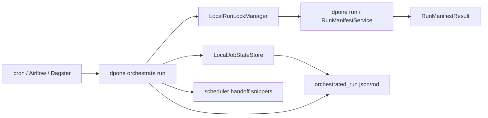
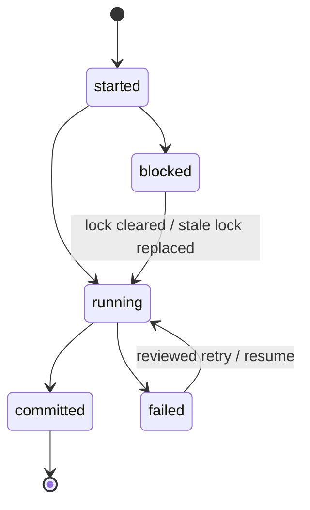
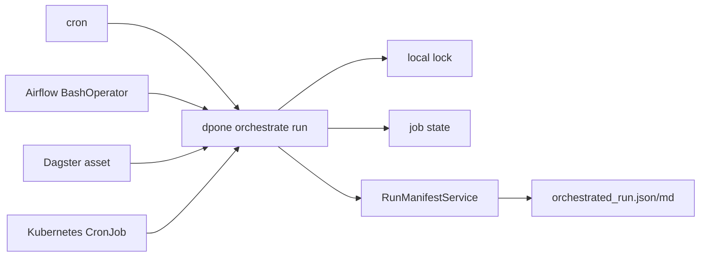

# Run orchestration

`dpone run` stays the canonical execution command. `dpone orchestrate run` wraps
that path with production-oriented orchestration controls:

- local concurrency locks;
- retry/backoff forwarding;
- scheduler handoff snippets for cron, Airflow, and Dagster;
- immutable orchestration artifacts.

The orchestration layer is intentionally small. It does not replace Airflow,
Dagster, cron, Kubernetes, or a managed scheduler. It gives those systems a
safe, observable, copy-pasteable way to execute dpone pipelines.

## Quickstart

```bash
dpone orchestrate run \
  --manifest manifests/orders.yml \
  --selector orders \
  --run-id orders_2026_06_05 \
  --retry-attempts 2 \
  --retry-backoff-seconds 5 \
  --concurrency-key orders_daily \
  --lock-dir .dpone/locks \
  --state-dir .dpone/orchestration-state \
  --resume-policy fail \
  --output-dir .dpone/orchestration/orders_2026_06_05 \
  --format json
```

Artifacts written:

```text
orchestrated_run.json
orchestrated_run.md
.dpone/orchestration-state/orders_2026_06_05.job_state.json
```

## Runtime model



## Durable job state

`dpone orchestrate run` writes a local durable job state file per run. The state
file is intentionally plain JSON so cron jobs, Airflow tasks, Dagster assets,
Kubernetes jobs, CI workers and humans can inspect the same evidence.

| Option | Meaning |
| --- | --- |
| `--state-dir` | Directory for `*.job_state.json` files. Defaults to `.dpone/orchestration-state`. |
| `--run-id` | Stable state key. Use one deterministic value per scheduled logical run. |
| `--concurrency-key` | Lock key. It can be broader than the run id, for example one key per table. |
| `--resume-policy fail` | Default. Block when a previous failed/blocked state exists. |
| `--resume-policy resume` | Continue from a previous resumable failed/blocked state after operator review. |
| `--resume-policy restart` | Explicitly restart a committed/failed/blocked run id. Use only for idempotent pipelines. |

Lifecycle:



State statuses:

| Status | Meaning | Resumable |
| --- | --- | --- |
| `started` | Orchestration accepted the request and created state. | no |
| `running` | Lock acquired and execution entered `RunManifestService`. | no |
| `committed` | The underlying run passed and artifacts were written. | no |
| `failed` | The underlying run returned a non-success result. | yes |
| `blocked` | Orchestration did not execute because a guard such as lock acquisition failed. | yes |

Runbook for a failed job state:

1. Open `<state-dir>/<run-id>.job_state.json`.
2. Check `blockers`, `run_result.result.errors`, `attempt`, and `transitions`.
3. Confirm the sink strategy is idempotent or resumable before retrying.
4. Re-run with the same `--run-id` and same `--concurrency-key` after the blocker is understood.
5. Attach both `orchestrated_run.json` and `*.job_state.json` to incident or release evidence.

Resume policy runbook:

1. Keep the default `--resume-policy fail` for unattended schedules.
2. Use `--resume-policy resume` only after reading the state file and confirming the target strategy is idempotent or resumable.
3. Use `--resume-policy restart` only when business ownership confirms a repeat run with the same `run_id` is acceptable.
4. If `job_state.already_running` appears, inspect the scheduler and lock file before forcing anything.
5. If `job_state.already_committed` appears, prefer a new `run_id` unless you intentionally need a repeat load.

Common blockers:

| Blocker | Meaning | Operator action |
| --- | --- | --- |
| `job_state.resume_required` | A previous failed or blocked run exists and the default fail-closed policy stopped execution. | Inspect the state file, then re-run with `--resume-policy resume` only when safe. |
| `job_state.already_running` | A previous state is still marked running. | Inspect the scheduler and lock file before retrying. |
| `job_state.already_committed` | The same `run_id` was already committed. | Use a new `run_id` or explicit `--resume-policy restart` for an approved idempotent replay. |

## Locking

`dpone orchestrate run` uses a local atomic file lock. This is suitable for one
host, one CI runner, or one shared workspace. Distributed locks can be added
later through the same interface without changing the CLI contract.

| Option | Meaning |
| --- | --- |
| `--concurrency-key` | Stable key for the job. Defaults to run id, selector, or manifest path. |
| `--lock-dir` | Directory where lock files are stored. |
| `--lock-ttl-seconds` | Stale lock timeout. Defaults to 3600 seconds. |
| `--state-dir` | Directory where durable job state files are stored. |
| `--resume-policy` | `fail`, `resume`, or `restart`. Defaults to fail-closed. |

Runbook when lock acquisition fails:

1. Confirm whether another scheduler job is still running.
2. Inspect `.dpone/locks/<key>.lock.json`.
3. If the process crashed and the lock is stale, wait for `--lock-ttl-seconds` or remove the reviewed stale lock.
4. Do not delete a fresh lock without confirming the active process is gone.

## Retry and idempotency

Retry behavior is forwarded to [`dpone run`](run.md):

```bash
dpone orchestrate run \
  --manifest manifests/orders.yml \
  --retry-attempts 3 \
  --retry-backoff-seconds 10
```

Use retries only for idempotent or resumable pipelines. Safe production
pipelines should use staging-first finalization, committed load IDs, and state
advancement only after successful commit.

## Scheduler handoff

Every orchestration report includes copy-paste snippets. All snippets call
`dpone orchestrate run`, not bare `dpone run`, so locks, state, retry/backoff
and artifacts stay enabled under the external scheduler.

| Field | Purpose |
| --- | --- |
| `scheduler_handoff.cron_command` | Plain shell command for cron/Kubernetes/CI. |
| `scheduler_handoff.airflow_task` | Minimal `BashOperator` snippet. |
| `scheduler_handoff.dagster_asset` | Minimal Dagster asset wrapper snippet. |
| `scheduler_handoff.kubernetes_cronjob` | Minimal Kubernetes `CronJob` YAML skeleton. |

These snippets are deliberately simple. Production teams should apply their own
secret handling, image selection, retry policy, alerting, pools, and ownership
metadata in the scheduler.



## Suggested production pattern

```bash
dpone orchestrate run ... --format json > .dpone/orchestration/orders/orchestrated_stdout.json

dpone ops run-registry \
  --run-result .dpone/orchestration/orders/orchestrated_run.json \
  --artifact orchestration=.dpone/orchestration/orders/orchestrated_run.json \
  --format json

dpone ops lineage-export \
  --run-registry-entry .dpone/run-registry/<run_id>__run_registry.json \
  --input postgres=public.orders \
  --output mssql=landing.orders \
  --format json
```

## Python API

```python
from dpone.orchestration.handoff import SchedulerHandoffBuilder
from dpone.orchestration.locks import LocalRunLockManager
from dpone.orchestration.run import OrchestratedRunRequest, OrchestratedRunService
from dpone.orchestration.state import LocalJobStateStore

service = OrchestratedRunService(
    lock_manager=LocalRunLockManager(".dpone/locks"),
    handoff_builder=SchedulerHandoffBuilder(),
    run_executor=my_run_executor,
    job_state_store=LocalJobStateStore(".dpone/orchestration-state"),
)

report = service.run(
    output_dir=".dpone/orchestration/orders",
    request=OrchestratedRunRequest(
        manifest_path="manifests/orders.yml",
        selector="orders",
        run_id="orders_2026_06_05",
        retry_attempts=2,
        retry_backoff_seconds=5,
        concurrency_key="orders_daily",
    ),
)
```

## Design boundaries

- `LocalRunLockManager` owns only local lock acquisition/release.
- `LocalJobStateStore` owns only durable job state persistence and state transitions.
- `SchedulerHandoffBuilder` owns only copy-paste snippets.
- `OrchestratedRunService` coordinates lock -> state -> run -> artifact.
- `RunManifestService` remains the canonical runtime execution path.
- CLI code is a thin adapter and contains no orchestration business rules.
