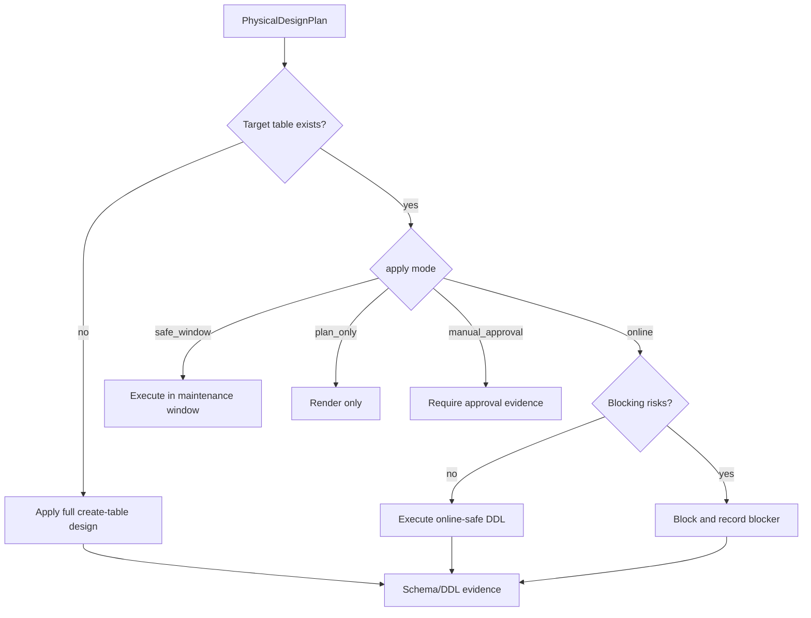

# Physical DDL apply runtime

Physical design planning renders target-specific SQL. Physical DDL apply decides
whether those statements may run now, must wait for a safe window, or require
manual approval.

For existing tables, physical DDL apply is preceded by
`physical_design.reconciliation`. Reconciliation compares desired design with the
actual target state and may produce blockers, warnings, or certified safe DDL.
ClickHouse v1 auto-applies only table-setting drift through
`ALTER TABLE ... MODIFY SETTING`; layout drift stays blocked for a shadow table
migration.

## Apply decision flow



## Apply modes

| Mode | Existing table behavior | New table behavior |
| --- | --- | --- |
| `online` | Apply only low-risk online-safe DDL. | Apply full physical design. |
| `safe_window` | Allow blocking DDL inside a controlled window. | Apply full physical design. |
| `plan_only` | Never execute, only render evidence. | Never execute, only render evidence. |
| `manual_approval` | Require approval artifact before execution. | Require approval artifact before execution. |

## Runtime API

`PhysicalDdlApplyService` uses dependency injection. Production connectors pass
a target-specific executor; tests and dry-runs can use no executor or a
recording fake.

```python
from dpone.readiness.physical_apply import PhysicalDdlApplyService
from dpone.readiness.physical_design import PhysicalDesignPlanner

plan = PhysicalDesignPlanner().plan(
    sink_type="mssql",
    table="landing.orders",
    source_schema=[("id", "bigint"), ("amount", "numeric(18,2)")],
)

report = PhysicalDdlApplyService(executor=mssql_executor).apply(
    plan,
    table_exists=True,
)
```

## Target DDL executors

`dpone.readiness.ddl_executors` provides connector-backed executor contracts:

| Executor | Safety prefix |
| --- | --- |
| `MSSQLDdlExecutor` | `SET LOCK_TIMEOUT ...` |
| `PostgresDdlExecutor` | `SET lock_timeout`, `SET statement_timeout` |
| `ClickHouseDdlExecutor` | `SET mutations_sync ...` |
| `BigQueryDdlExecutor` | BigQuery DDL/API handoff |
| `KafkaSchemaRegistryDdlExecutor` | Schema Registry compatibility check |

## Risk classes

| Risk | Default online behavior |
| --- | --- |
| metadata-only add nullable column | apply |
| safe widening | apply when dialect capability says safe |
| index create concurrently/online | apply when target supports it |
| compression rebuild | block |
| clustered columnstore creation on existing table | block |
| repartitioning | block |
| unsafe type change | block or route to `__dpone__nc__<column>` if explicitly configured |

## Target notes

| Sink | Online-safe examples | Safe-window examples |
| --- | --- | --- |
| MSSQL | add nullable column, safe index path when online-supported | page compression rebuild, clustered columnstore rebuild |
| Postgres | add nullable column, `CREATE INDEX CONCURRENTLY` | table rewrite, partition migration |
| ClickHouse | add column, create new shadow table | mutation-heavy type changes, repartitioning |
| BigQuery | nullable field add through schema update API | table recreation for partitioning changes |
| Kafka | Schema Registry compatibility check | incompatible subject migration |

## Runbook

| Symptom | Action |
| --- | --- |
| `physical_design.blocking_ddl_requires_safe_window_or_manual_approval` | Switch to `safe_window`, attach approval, or use shadow table migration. |
| DDL executor lacks permissions | Grant target DDL permissions or use `plan_only` and hand off SQL to DBA workflow. |
| New table physical design was not applied | Confirm target table did not already exist and `physical_design.enabled` is true. |
| Existing table needs compression | Schedule safe window; do not force online mode. |
| BigQuery partitioning changed | Plan shadow/recreate and downstream validation before cutover. |

## Related docs

- [Physical design](physical-design.md)
- [Online schema evolution](online-schema-evolution.md)
- [Schema contracts](schema-contracts.md)
- [Runtime data contracts](data-contract-runtime.md)
