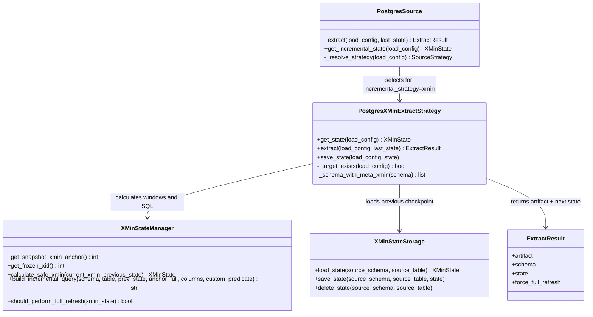
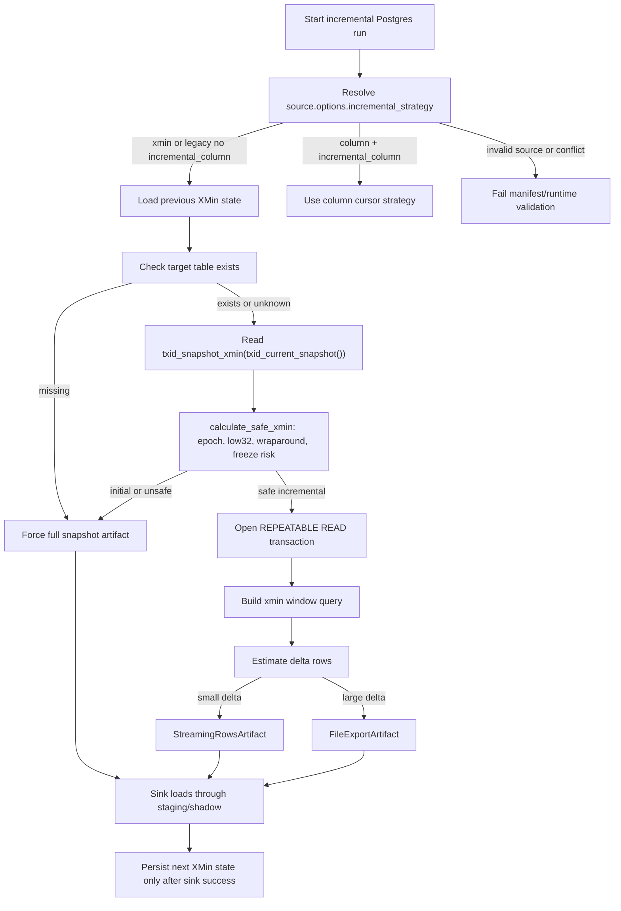

# PostgreSQL XMin Incremental Strategy

This guide explains how to use PostgreSQL `xmin` as an incremental extraction strategy in dpone.
It is written for operators and developers who need to configure, debug, and safely run Postgres source pipelines without treating XMin as a black box.

## Table of contents

- [Quick answer](#quick-answer)
- [XMin vs column cursor vs CDC](#xmin-vs-column-cursor-vs-cdc)
- [How dpone selects XMin](#how-dpone-selects-xmin)
- [Runtime class diagram](#runtime-class-diagram)
- [Algorithm flowchart](#algorithm-flowchart)
- [Algorithm](#algorithm)
- [Implementation map](#implementation-map)
- [State backends](#state-backends)
- [Full manifest examples](#full-manifest-examples)
- [Permissions](#permissions)
- [Physical deletes](#physical-deletes)
- [Wraparound and VACUUM/freeze caveats](#wraparound-and-vacuumfreeze-caveats)
- [Performance tuning](#performance-tuning)
- [Recovery runbooks](#recovery-runbooks)
- [Testing](#testing)
- [Developer API](#developer-api)

## Quick answer

Use XMin when all of these are true:

- The source is PostgreSQL.
- The pipeline must catch `INSERT` and `UPDATE` changes without requiring an application-maintained `updated_at` column.
- You can tolerate that physical deletes are not visible through XMin alone.
- The source table is read from the primary database or from a system where `xmin` is meaningful for that table.
- Runs are frequent enough that transaction ID wraparound/freeze risk is managed.

Prefer explicit `source.options.incremental_strategy: xmin` when you want XMin. For backward compatibility, PostgreSQL incremental loads still use XMin when `incremental_column` is omitted. If `incremental_column` is set, the runtime uses column-cursor mode unless `incremental_strategy: xmin` is also set, in which case validation fails because the configuration is ambiguous. PostgreSQL→MSSQL is stricter: column-cursor mode is rejected before source I/O because the current target-derived single-column state is not an atomic source boundary.

For a large first PostgreSQL→MSSQL load, do not use the implicit one-shot
baseline. Use two explicit phases with the same stable id:

```yaml
# Manual, resumable campaign
source:
  options:
    incremental_strategy: xmin
    xmin_execution: {mode: initial, handoff_id: orders_v1}
sink:
  strategy:
    mode: backfill
    unique_key: [id]
    backfill:
      inner_mode: incremental_append
      parallel_workers: 4
      retry_policy: non_committed
      state:
        backend: audit_schema
        schema: system
        require_distributed_lock: true
      publication: {mode: shadow_swap, retain_backup: true}
      chunk: {column: id, kind: uuid, buckets: 512}
state:
  type: mssql
  connection_ref: mssql_state
  atomicity: target_atomic
  provisioning: external
```

```yaml
# Scheduled only after the campaign receipt exists
source:
  options:
    incremental_strategy: xmin
    xmin_execution: {mode: incremental, handoff_id: orders_v1}
sink:
  strategy: {mode: incremental_merge, unique_key: [id]}
reconciliation:
  enabled: true
  mode: key_snapshot
  consistency: same_source_snapshot
```

The initial anchor is captured before chunk extraction and committed as the
first XMin checkpoint only after every chunk receipt succeeds. The first
incremental run therefore replays all updates newer than that anchor and uses
the full key snapshot to observe physical deletes. A failed or partial initial
campaign cannot advance the incremental checkpoint.

The initial chunks load a campaign-owned shadow, not the live target. Their
receipt invocation is stable by the runtime-proven backfill `run_key`, so a new
Airflow run replays an already committed target receipt instead of appending the
same chunk again after a commit-before-ledger crash. Exact aggregate and key
validation, deferred unique indexes and transactional publication complete
before XMin handoff. See [Backfill](backfill.md#large-postgresql-to-mssql-initial-load).

Minimal source shape:

```yaml
source:
  type: postgres
  connection_type: vault
  connection_id: postgres_oltp
  vault_path: postgres/demo-oltp
  table: {schema: public, name: orders}
  options:
    batch_size: 50000
    incremental_strategy: xmin
```

## XMin vs column cursor vs CDC

| Mechanism | Catches INSERT | Catches UPDATE | Catches DELETE | Requires app column | Best for |
| --- | --- | --- | --- | --- | --- |
| XMin | yes | yes | no | no | Snapshot-style incremental table sync from Postgres primary |
| `incremental_column` | yes, if column increases and the route accepts target-derived state | only if column updates | no | yes | Non-MSSQL routes with an externally guaranteed monotonic column |
| PostgreSQL logical CDC | yes | yes | yes | no | Event-history replication and delete propagation |
| Snapshot reconciliation | yes, by current snapshot | yes, by current snapshot | yes, by missing key detection | primary/unique key | Physical delete detection when CDC is not enabled |

Use XMin for practical table synchronization. Use CDC when deletes and event history matter. A business timestamp alone is not a safe PostgreSQL→MSSQL checkpoint: finite precision creates equal values, concurrent transactions can commit out of order, `NULL` is unordered, and late rows may be older than the target maximum. Use `incremental_column` only on routes that explicitly retain the legacy target-derived contract; PostgreSQL→MSSQL fails closed.

## How dpone selects XMin

For `source.type: postgres`:

1. If `source.options.incremental_strategy: xmin` is set, dpone uses `PostgresXMinExtractStrategy`. This is valid only when `source.type: postgres`.
2. If `source.options.incremental_strategy: column` is set, dpone requires `source.options.incremental_column` and uses column-cursor extraction.
3. If `source.options.incremental_column` is set and no explicit strategy is set, dpone keeps the legacy behavior and uses column-cursor extraction.
4. If neither `incremental_strategy` nor `incremental_column` is set, dpone keeps the legacy default and uses XMin for incremental PostgreSQL extraction.
5. For first run, unsafe state, or missing target table, dpone performs a full snapshot and stores an XMin checkpoint for the next run.
6. If the sink is MSSQL, either explicit or legacy column-cursor selection fails with `POSTGRES_MSSQL_COLUMN_CURSOR_UNSAFE` during manifest validation and `postgres_mssql.column_cursor_atomic_composite_state_required` at runtime. XMin is the supported migration.

The MSSQL gate covers both `incremental_append` and `incremental_merge`, file
and streaming thresholds, explicit and legacy selection, and direct strategy
construction. Those variants share the same missing atomic boundary, so none
is allowed to silently retain `MAX + >` behavior. A successful target commit
or retry cannot make an unsafe source boundary safe after the fact.

Example: XMin incremental merge into MSSQL:

```yaml
source:
  type: postgres
  connection_type: vault
  connection_id: postgres_oltp
  vault_path: postgres/demo-oltp
  table: {schema: public, name: orders}
  options:
    incremental_strategy: xmin
    batch_size: 50000
    export_format: mssql-delimited
    delta_size_threshold: 1000000

sink:
  type: mssql
  connection_type: vault
  connection_id: mssql_dwh
  vault_path: mssql/demo-dwh
  table: {schema: landing, name: orders}
  strategy:
    mode: incremental_merge
    unique_key: id
  options:
    bulk:
      mode: bcp
    schema_evolution: {enabled: true}

state:
  type: mssql
  connection_type: vault
  connection_id: mssql_dwh
  vault_path: mssql/demo-dwh
  table: {schema: etl_state, name: etl_xmin_state}
```

Example: XMin incremental merge into PostgreSQL state backend:

```yaml
source:
  type: postgres
  connection_type: vault
  connection_id: postgres_oltp
  vault_path: postgres/demo-oltp
  table: {schema: public, name: customers}
  options:
    incremental_strategy: xmin
    batch_size: 50000

sink:
  type: postgres
  connection_type: vault
  connection_id: postgres_dwh
  vault_path: postgres/demo-dwh
  table: {schema: landing, name: customers}
  strategy:
    mode: incremental_merge
    unique_key: customer_id
  options:
    bulk:
      mode: copy
    schema_evolution: {enabled: true}

state:
  type: postgres
  connection_type: vault
  connection_id: postgres_meta
  vault_path: postgres/demo-meta
  table: {schema: etl_state, name: etl_xmin_state}
```

Example: XMin source with ClickHouse sink:

```yaml
source:
  type: postgres
  connection_type: vault
  connection_id: postgres_oltp
  vault_path: postgres/demo-oltp
  table: {schema: public, name: order_events}
  options:
    incremental_strategy: xmin
    batch_size: 100000
    delta_size_threshold: 2000000

sink:
  type: clickhouse
  connection_type: vault
  connection_id: clickhouse_dwh
  vault_path: clickhouse/demo-dwh
  table: {schema: landing, name: order_events}
  strategy:
    mode: incremental_append
    unique_key: event_id
  options:
    clickhouse_bulk:
      mode: http
    schema_evolution: {enabled: true}

state:
  type: postgres
  connection_type: vault
  connection_id: postgres_meta
  vault_path: postgres/demo-meta
  table: {schema: etl_state, name: etl_xmin_state}
```

## Runtime class diagram



## Algorithm flowchart



## Algorithm

The runtime implementation is centered around `PostgresXMinExtractStrategy` and `XMinStateManager`.

### 1. Load previous checkpoint

The strategy loads state by source identity:

```text
(source_schema, source_table) -> XMinState
```

State fields:

| Field | Meaning |
| --- | --- |
| `xmin_value` | Full integer checkpoint used as the lower bound for the next window |
| `timestamp` | Time the checkpoint was produced |
| `is_initial` | Whether the state was created by an initial/full snapshot path |
| `wraparound_detected` | Whether a 32-bit XID epoch transition was detected |
| `frozen_xid` | Database `datfrozenxid` value when freeze risk was detected |

If no state exists, the run is treated as an initial snapshot.

### 2. Check target existence

Before selecting the incremental path, dpone checks whether the target table exists. If the target table is missing, the run is forced to full snapshot even if an XMin checkpoint exists.

This prevents a dangerous situation where state says "continue from X" but the target has no historical rows.

### 3. Read a stable upper anchor

The current upper bound is read from PostgreSQL:

```sql
SELECT txid_snapshot_xmin(txid_current_snapshot())::bigint AS xmin_raw_value;
```

This value is the stable high-water mark for the run. Rows with `xmin` below this anchor are eligible for this batch. Rows changed after the anchor are intentionally left for the next run.

### 4. Calculate safe state

`XMinStateManager.calculate_safe_xmin(current_xmin, previous_state)` splits transaction IDs into:

```text
epoch = full_xid // 2^32
low32 = full_xid % 2^32
```

It then classifies the state:

| Case | Runtime action |
| --- | --- |
| No previous state | Mark as initial; full snapshot path |
| Same epoch | Normal incremental window |
| One epoch transition | Wraparound-aware incremental window |
| More than one epoch transition | Unsafe; switch to full refresh |
| Frozen XID risk detected | Persist `frozen_xid` diagnostics |

The current database freeze anchor is read with:

```sql
SELECT datfrozenxid FROM pg_database WHERE datname = current_database();
```

### 5. Open a repeatable-read transaction

The strategy starts a transaction and sets:

```sql
SET TRANSACTION ISOLATION LEVEL REPEATABLE READ;
```

This keeps extraction consistent for the selected snapshot window.

### 6. Build the extraction query

For first/full snapshot:

```sql
SELECT <columns>
FROM "public"."orders" AS t
WHERE <custom predicate or TRUE>;
```

For normal same-epoch incremental runs:

```sql
SELECT *, t.xmin AS __dpone__xmin
FROM "public"."orders" AS t
WHERE t.xmin::text::bigint >= <previous_low32>
  AND t.xmin::text::bigint < <current_low32>;
```

For one wraparound between adjacent epochs:

```sql
SELECT *, t.xmin AS __dpone__xmin
FROM "public"."orders" AS t
WHERE (t.xmin::text::bigint >= <previous_low32>)
   OR (t.xmin::text::bigint < <current_low32>);
```

If `source.custom_predicate` is configured, it is appended as:

```sql
WHERE (<xmin window>) AND (<custom predicate>)
```

### 7. Choose streaming or file artifact

For incremental runs, dpone estimates delta size:

```sql
SELECT COUNT(*)
FROM "public"."orders" AS t
WHERE t.xmin::text::bigint >= <previous_low32>
  AND t.xmin::text::bigint < <current_low32>;
```

Then it chooses:

| Delta size | Artifact path |
| --- | --- |
| Below `source.options.delta_size_threshold` | `StreamingRowsArtifact` |
| At or above threshold | File export artifact |

Default threshold in runtime is `1_000_000` rows unless overridden.

### 8. Add `__dpone__xmin`

Incremental XMin outputs include a technical column:

```text
__dpone__xmin bigint
```

This column is internal extraction evidence. Key-snapshot routes retain it only
in staging/checkpoint processing and never publish it as a target business or
lineage column. Schema evolution ignores it as framework-managed metadata.

### 9. Commit extraction transaction

For streaming artifacts, the transaction is committed through the artifact cleanup callback after rows are consumed. For file artifacts, the transaction is committed after export completes.

### 10. Save state only after sink success

The source returns a checkpoint state with `xmin_value = snapshot_xmin`. A
target-atomic MSSQL route compares both the previous XMin and monotonic
`state_revision`; every successful commit increments revision even when XMin
is unchanged. This prevents an older snapshot from passing CAS after a newer
snapshot that happened to observe the same safe XMin.

Legacy non-atomic routes persist state only after the sink load succeeds.

This is the core reliability rule:

```text
extract rows -> load sink staging/finalize -> commit sink -> save XMin state
```

Never save the XMin state before target commit.

For `atomicity: target_atomic`, target DML, revision CAS, and commit receipt are
instead written on the same SQL Server connection and committed once.

For MSSQL `key_snapshot`, "upper" has two explicit meanings and they must not
be collapsed:

- `safe_checkpoint U = txid_snapshot_xmin(snapshot)` is persisted after commit;
- `visible_horizon H = txid_snapshot_xmax(snapshot)` bounds delta extraction;
- the delta is `[previous, H)`, while full keys come from that exact snapshot.

Visible rows in `[U,H)` must be in the delta or the source-only parity check
would correctly roll back. Persisting `U` can replay those rows on the next run
while a long transaction remains open; row hashes keep that replay idempotent.
The envelope exposes `safe_checkpoint`, `visible_horizon`, and
`replay_amplification_xids = H-U`. Because `H-U` measures cluster-wide XID
churn rather than route rows, it is evidence by default. The optional
`source.options.xmin_max_replay_amplification_xids` becomes a blocker only when
the workload explicitly configures a measured limit.

## Implementation map

| Algorithm step | Runtime class/method | Code link | Notes |
| --- | --- | --- | --- |
| Resolve explicit/legacy strategy | `PostgresSource._resolve_strategy` | [src/dpone/runtime/sources/postgres.py](https://github.com/PaulKov/dpone/blob/master/src/dpone/runtime/sources/postgres.py) | Implements `incremental_strategy: xmin`, `incremental_strategy: column`, and legacy fallback. |
| Load previous checkpoint | `PostgresXMinExtractStrategy.get_state` | [src/dpone/runtime/sources/strategies/postgres/postgres_xmin_extract.py](https://github.com/PaulKov/dpone/blob/master/src/dpone/runtime/sources/strategies/postgres/postgres_xmin_extract.py) | Uses `XMinStateStorage` by `(source_schema, source_table)`. |
| Check target existence | `PostgresXMinExtractStrategy._target_exists` | [src/dpone/runtime/sources/strategies/postgres/postgres_xmin_extract.py](https://github.com/PaulKov/dpone/blob/master/src/dpone/runtime/sources/strategies/postgres/postgres_xmin_extract.py) | Forces full snapshot when target is missing. |
| Read stable upper anchor | `XMinStateManager.get_snapshot_xmin_anchor` | [src/dpone/runtime/xmin/manager.py](https://github.com/PaulKov/dpone/blob/master/src/dpone/runtime/xmin/manager.py) | Runs `txid_snapshot_xmin(txid_current_snapshot())`. |
| Detect wraparound/freeze risk | `XMinStateManager.calculate_safe_xmin` | [src/dpone/runtime/xmin/manager.py](https://github.com/PaulKov/dpone/blob/master/src/dpone/runtime/xmin/manager.py) | Splits full XID into epoch and low32. |
| Build incremental SQL | `XMinStateManager.build_incremental_query` | [src/dpone/runtime/xmin/manager.py](https://github.com/PaulKov/dpone/blob/master/src/dpone/runtime/xmin/manager.py) | Adds `__dpone__xmin` and custom predicate. |
| Choose streaming/file artifact | `PostgresXMinExtractStrategy.extract` | [src/dpone/runtime/sources/strategies/postgres/postgres_xmin_extract.py](https://github.com/PaulKov/dpone/blob/master/src/dpone/runtime/sources/strategies/postgres/postgres_xmin_extract.py) | Uses `delta_size_threshold` to select artifact path. |
| Persist state after sink success | `LoadConfigRuntimeService.should_persist_state` and processor orchestration | [src/dpone/runtime/etl/load_config_runtime.py](https://github.com/PaulKov/dpone/blob/master/src/dpone/runtime/etl/load_config_runtime.py) | State persistence is gated by successful sink load. |
| Validate explicit XMin config | `validate_manifest` universal incremental strategy checks | [src/dpone/manifest/validation.py](https://github.com/PaulKov/dpone/blob/master/src/dpone/manifest/validation.py) | Fails for non-Postgres source or `incremental_column` conflict. |

## State backends

XMin checkpoints can be stored in BigQuery, PostgreSQL, or MSSQL.

### BigQuery state

BigQuery remains useful for teams already operating BigQuery as metadata/control plane.

```yaml
state:
  type: bigquery
  connection_type: vault
  connection_id: bigquery_meta
  vault_path: gcp/demo-project/bq/service-account
  table: {schema: etl_state, name: etl_xmin_state}
```

### PostgreSQL state

Use this for local OSS deployments or when metadata should stay close to Postgres.

```yaml
state:
  type: postgres
  connection_type: vault
  connection_id: postgres_meta
  vault_path: postgres/demo-meta
  table: {schema: etl_state, name: etl_xmin_state}
```

State table shape:

```sql
CREATE TABLE IF NOT EXISTS etl_state.etl_xmin_state (
    source_schema text NOT NULL,
    source_table text NOT NULL,
    xmin_value bigint NOT NULL,
    is_initial boolean NOT NULL DEFAULT false,
    wraparound_detected boolean NOT NULL DEFAULT false,
    frozen_xid bigint NULL,
    __dpone__loaded_at timestamp NOT NULL DEFAULT timezone('utc', now()),
    __dpone__updated_at timestamp NOT NULL DEFAULT timezone('utc', now()),
    PRIMARY KEY (source_schema, source_table)
);
```

### MSSQL state

Use a logical state connection when SQL Server owns both the checkpoint and
the target-atomic commit receipt:

```yaml
state:
  type: mssql
  connection_ref: mssql_state
  atomicity: target_atomic
  provisioning: external
  table: {name: dpone_source_state}
  run_table: {name: dpone_run_state}
  receipt_table: {name: dpone_commit_receipt}
  repair_authority_table: {name: dpone_repair_authority}
  repair_consumption_table: {name: dpone_repair_authority_consumption}
  audit_table: {name: dpone_load_audit}
```

The environment registry owns the database/schema defaults. The platform must
provision these objects before the run; the DAG does not create them. The
source-state table includes `state_revision bigint NOT NULL`; receipts include
nullable `previous_revision` and non-null `candidate_revision`. Source state
also retains nullable `superseded_at_utc` and `superseded_by_state_key` so an
identity migration preserves old receipts without leaving two active owners.
It also includes `target_identity binary(32) NOT NULL`, resolved from the
immutable target-local `dbo.dpone_target_identity` registry before source I/O.
The registry name key uses `COLLATE DATABASE_DEFAULT`; therefore CI aliases
share a binding and CS names that differ only by case retain distinct bindings.
The runtime does not provision or rebind this registry.

#### Approved full repair and delete-guard override

Do not delete XMin state or add a permanent manifest flag to recover from
reverse parity drift or a legitimate mass delete. An environment owner creates
one immutable, expiring repair authority bound to the route `state_key`,
`scope_hash`, and exact expected checkpoint (or explicit absence). Invoke it
with `--repair-authority-ref ID` or `DPONE_REPAIR_AUTHORITY_REF=ID`.
On Airflow, pass the opaque ID in `dag_run.conf` (`DPONE_REPAIR_AUTHORITY_REFS`
by `task_id`, or scalar `DPONE_REPAIR_AUTHORITY_REF`); strict compose injects
the env after the pack allowlist. Do not bake the ID into a pack.

If `allow.full_baseline` is true, the source read-only preview selects a full
payload even when an existing checkpoint is present; the envelope retains that
previous checkpoint so the final CAS is still stale-run safe. If it is false,
the source keeps the normal XMin delta, allowing a least-privilege delete-guard
override. Target finalization revalidates expiry, digest, state, scope,
checkpoint, actual delete rows, and actual ratio under the target lock. It then
stores unique authority consumption beside the commit receipt in the same
transaction. The full repair algorithm does not truncate or swap the target:
existing tombstones remain available and key reconciliation applies the exact
current snapshot.

If a schema, PK, or scope change produces a new `state_key` for the same target,
a normal full-baseline approval is insufficient. Provision an authority whose
optional transfer block supplies the old active `state_key`, XMin, and revision
as one all-or-none binding. The new expected checkpoint must be `absent` and
`allow_full_baseline` must be true. Dpone supersedes the exact old row under the
target lock and commits that transfer only with baseline DML, the new CAS
receipt, and authority consumption. A missing, additional, already superseded,
or changed old owner fails closed; no history is deleted.
The externally provisioned source-state table includes a unique filtered index
on `target_identity` for rows whose `superseded_at_utc IS NULL`, so SQL Server
enforces one active state authority independently of the state database
collation. Raw database/schema/table strings are display evidence only.

## Full manifest examples

### PostgreSQL -> MSSQL with XMin and physical delete reconciliation

```yaml
name: orders_xmin_sync

source:
  type: postgres
  connection_ref: postgres_oltp
  table: {schema: public, name: orders}
  options:
    incremental_strategy: xmin
    batch_size: 50000
    batch_commit_mode: whole
    export_format: csv
    compress_export: false

sink:
  type: mssql
  connection_ref: mssql_dwh
  table: {schema: landing, name: orders}
  strategy:
    mode: incremental_merge
    unique_key: [id]
    merge_policy: update_insert
  options:
    technical_columns: required
    soft_delete:
      mode: timestamp_only

reconciliation:
  enabled: true
  mode: key_snapshot
  cadence: every_run
  consistency: same_source_snapshot
  delete_policy: soft_delete
  empty_snapshot: {policy: fail}
  guards: {max_delete_ratio: 0.05, max_delete_rows: 100000}

state:
  type: mssql
  connection_ref: mssql_state
  atomicity: target_atomic
  provisioning: external
  table: {name: dpone_source_state}
  run_table: {name: dpone_run_state}
  receipt_table: {name: dpone_commit_receipt}
  repair_authority_table: {name: dpone_repair_authority}
  repair_consumption_table: {name: dpone_repair_authority_consumption}
  audit_table: {name: dpone_load_audit}
```

The public export format stays `csv`; the PostgreSQL-to-MSSQL route maps it to
its internal lossless delimited artifact. The certified MSSQL key-snapshot sink
then verifies and decodes that artifact once into a private length-prefixed
UTF-8 BCP host file and loads native staging directly. Do not author either
internal wire name in a manifest.

### PostgreSQL -> BigQuery with generated column fallback

```yaml
source:
  type: postgres
  connection_type: vault
  connection_id: postgres_oltp
  vault_path: postgres/demo-oltp
  table: {schema: public, name: accounts}
  options:
    incremental_strategy: xmin
    batch_size: 100000
    delta_size_threshold: 2000000

sink:
  type: bigquery
  connection_type: vault
  connection_id: bigquery_dwh
  vault_path: gcp/demo-project/bq/service-account
  table: {schema: landing, name: accounts}
  strategy:
    mode: incremental_merge
    unique_key: account_id
  options:
    schema_evolution:
      enabled: true
      on_type_change: new_column

state:
  type: bigquery
  connection_type: vault
  connection_id: bigquery_dwh
  vault_path: gcp/demo-project/bq/service-account
  table: {schema: etl_state, name: etl_xmin_state}
```

### PostgreSQL -> Kafka as bounded batch events

```yaml
source:
  type: postgres
  connection_type: vault
  connection_id: postgres_oltp
  vault_path: postgres/demo-oltp
  table: {schema: public, name: orders}
  options:
    incremental_strategy: xmin
    batch_size: 50000

sink:
  type: kafka
  connection_type: vault
  connection_id: kafka_cluster
  vault_path: kafka/demo-cluster
  topic: dwh.orders
  strategy:
    mode: incremental_merge
    unique_key: id
  options:
    message_format: json
    envelope: dpone
    key: {mode: unique_key}
    delivery: {mode: at_least_once}

state:
  type: postgres
  connection_type: vault
  connection_id: postgres_meta
  vault_path: postgres/demo-meta
  table: {schema: etl_state, name: etl_xmin_state}
```

## Permissions

The source PostgreSQL user needs:

```sql
GRANT USAGE ON SCHEMA public TO dpone_reader;
GRANT SELECT ON TABLE public.orders TO dpone_reader;
```

The following built-in functions/views are normally readable without superuser privileges, but locked-down environments should verify access:

```sql
SELECT txid_snapshot_xmin(txid_current_snapshot())::bigint;
SELECT datfrozenxid FROM pg_database WHERE datname = current_database();
```

State backend permissions depend on backend:

- PostgreSQL state: `CREATE SCHEMA`, `CREATE TABLE`, `SELECT`, `INSERT`, `UPDATE`, `DELETE` on the state schema/table.
- MSSQL `target_atomic` state: the platform provisioner needs schema/table DDL;
  the runtime principal needs only the documented DML on the four pre-created
  tables and target. Runtime DDL is forbidden.
- BigQuery state: dataset/table create and query job permissions.

Sink permissions are described in the per-flow guides under [Source -> sink matrix](source-sink-matrix.md).

## Physical deletes

XMin does not see rows that no longer exist. If a row is deleted between runs, there is no row left for the next XMin query to return.

Use one of these patterns:

| Requirement | Recommended pattern |
| --- | --- |
| Need to mark deleted rows eventually | Snapshot reconciliation on primary key |
| Need every delete event | PostgreSQL logical CDC |
| Source uses soft deletes | Treat `deleted_at` or status column as normal update captured by XMin |
| Kafka target needs delete events | Use CDC/tombstone source or reconciliation-generated delete events |

Recommended reconciliation config:

```yaml
sink:
  strategy:
    mode: incremental_merge
    unique_key: [id]

reconciliation:
  enabled: true
  mode: key_snapshot
  cadence: every_run
  consistency: same_source_snapshot
  delete_policy: soft_delete
  empty_snapshot: {policy: fail}
  guards: {max_delete_ratio: 0.05, max_delete_rows: 100000}
```

The complete key artifact must come from the same `REPEATABLE READ READ ONLY`
snapshot as the XMin delta. An empty/partial artifact, duplicate or null key,
checksum mismatch, or delete-guard breach rolls back target and state. The
default `timestamp_only` policy records UTC detection time; repeated absence
does not change that timestamp and reappearance clears it.

For PostgreSQL text keys, target and native staging columns must use
`Latin1_General_100_BIN2`. A disk-backed source profile preserves case and
accent distinctions but rejects trailing U+0020, which SQL Server equality
pads and PostgreSQL `text` equality distinguishes. The complete declared key
must fit 900 bytes before export (`nvarchar(450)` is exactly 900); oversized
composite keys fail before scanning payload data.

Successful run evidence preserves the finalizer's exact, disjoint
`inserted_rows`, `updated_rows`, `reactivated_rows`, `unchanged_rows`,
`soft_deleted_rows`, `hard_deleted_rows`, `active_rows`, `final_rows`, and
`staging_rows` values. It also exposes `commit_receipt_id` and the typed
`commit_outcome`. Do not derive these counters from before/after row-count
deltas: updates, reactivations, and tombstones can leave the total unchanged.
A snapshot-envelope run without a committed receipt is a failure even when its
target DML appears successful.

## Wraparound and VACUUM/freeze caveats

PostgreSQL transaction IDs are 32-bit internally. dpone stores a full integer checkpoint and splits it into epoch/low32 for comparisons.

Important caveats:

- Frequent runs reduce wraparound/freeze risk.
- Long gaps between runs can make an XMin checkpoint unsafe.
- If more than one epoch transition is detected between checkpoints, dpone switches to full refresh.
- `VACUUM FREEZE` can change tuple visibility metadata. If `frozen_xid` diagnostics appear, review the run artifact and consider a controlled full refresh.
- XMin values are PostgreSQL implementation details. Do not expose them as business data contracts.

Operational monitoring SQL:

```sql
SELECT
  datname,
  age(datfrozenxid) AS xid_age,
  datfrozenxid
FROM pg_database
WHERE datname = current_database();
```

Set alerts according to your PostgreSQL version and vacuum policy.

## Performance tuning

Key options:

```yaml
source:
  options:
    incremental_strategy: xmin
    batch_size: 100000
    delta_size_threshold: 1000000
    custom_predicate: "status <> 'archived'"
```

Guidance:

- Use `delta_size_threshold` to switch large deltas to file export instead of streaming.
- Use native sink bulk paths: MSSQL `bcp`, Postgres `COPY`, ClickHouse HTTP/native TSV, BigQuery load jobs.
- For very large tables, use partitioned range extraction when a stable partition column exists. XMin defines the change window; partitioning defines how to split the scan inside that window.
- Keep target merge keys indexed.

Useful source indexes:

```sql
CREATE INDEX CONCURRENTLY IF NOT EXISTS idx_orders_id ON public.orders (id);
CREATE INDEX CONCURRENTLY IF NOT EXISTS idx_orders_updated_at ON public.orders (updated_at);
```

PostgreSQL does not normally index `xmin` directly for this pattern. The XMin predicate is a system-column filter; performance should be validated on realistic table sizes.

## Recovery runbooks

### First run or missing target table

Expected behavior: full snapshot.

1. Confirm target table does not exist or state is absent.
2. Run `dpone plan` and check `force_full_refresh` or equivalent plan diagnostics.
3. Run the pipeline.
4. Confirm state row exists after successful sink commit.

### Pipeline failed before sink commit

Expected behavior: state should not advance.

1. Inspect the run artifact.
2. Confirm the XMin state row still contains the previous checkpoint.
3. Re-run the same pipeline. Rows in the failed window are re-read.
4. Ensure sink strategy is idempotent through `unique_key`/merge semantics.

### Pipeline failed after sink commit but before state commit

This is rare but possible when process termination happens between sink commit and state save.

1. Re-run the pipeline.
2. Expect the previous window to be read again.
3. Sink merge/upsert should deduplicate by `unique_key`.
4. If using append-only sink, reconcile duplicates or replay from a known checkpoint.

### Unsafe wraparound detected

Expected behavior: full refresh.

1. Review `wraparound_detected=true` in state/run artifact.
2. Confirm whether long downtime or XID churn caused the gap.
3. Let dpone perform full refresh into staging/shadow target.
4. After success, the new checkpoint becomes the baseline.

### Bad checkpoint or manual replay

Use state UX commands:

```bash
dpone state inspect --backend postgres --state-type xmin public.orders

dpone state export --backend postgres --state-type xmin public.orders --format md

dpone state replay-from --backend postgres --state-type xmin public.orders --offset 123456789 --yes

dpone state reset --backend postgres --state-type xmin public.orders --yes
```

Use reset only when you intentionally want the next run to behave like a first/full snapshot.

## Testing

Unit/contract tests that cover XMin behavior:

```bash
uv run pytest tests/test_runtime_state_and_reconciliation_contracts.py -q
uv run pytest tests/test_runtime_postgres_state_contracts.py -q
uv run pytest tests/test_postgres_xmin_strategy_selection.py -q
```

Live integration test for runtime selector, baseline checkpoint, and streaming delta path:

```bash
docker compose -f docker/docker-compose.integration.yml up -d postgres
DPONE_RUN_INTEGRATION=1 \
DPONE_IT_PG_HOST=127.0.0.1 \
DPONE_IT_PG_PORT=55432 \
DPONE_IT_PG_DATABASE=dpone_it \
DPONE_IT_PG_USER=dpone \
DPONE_IT_PG_PASSWORD=dpone \
  uv run pytest -m integration_postgres_xmin tests/integration/postgres -q
```

GitHub Actions runs the same marker in the `postgres-xmin` CI job with a `postgres:16-alpine` service.

Useful focused assertions covered by tests:

- `txid_snapshot_xmin(txid_current_snapshot())` anchor is read.
- `datfrozenxid` is read for freeze diagnostics.
- Same-epoch incremental SQL uses `>= previous_low32 AND < current_low32`.
- One-epoch wraparound SQL uses `>= previous_low32 OR < current_low32`.
- Unsafe multi-epoch gaps switch to full refresh.
- XMin state saves, loads, and deletes in PostgreSQL/MSSQL/BigQuery style backends.

Manual smoke test outline:

```sql
CREATE TABLE public.orders (
  id bigint PRIMARY KEY,
  amount numeric(18,2),
  status text,
  updated_at timestamptz DEFAULT now()
);

INSERT INTO public.orders(id, amount, status) VALUES (1, 10.00, 'new');
```

1. Run pipeline. It should full-snapshot row `1` and save state.
2. Update the row:

```sql
UPDATE public.orders SET amount = 11.00, status = 'paid' WHERE id = 1;
```

3. Run pipeline again. It should extract row `1` through XMin window and merge it into target.
4. Delete the row:

```sql
DELETE FROM public.orders WHERE id = 1;
```

5. Run pipeline again. XMin alone will not emit a row. Snapshot reconciliation or CDC is required to propagate the delete.

## Developer API

Direct strategy usage is normally only needed in tests or custom runtime wiring:

```python
from dpone.runtime.sources.strategies.postgres.postgres_xmin_extract import PostgresXMinExtractStrategy
from dpone.runtime.state.postgres import PostgresXMinStateStorage

state_storage = PostgresXMinStateStorage(connector, schema="etl_state", table="etl_xmin_state")
strategy = PostgresXMinExtractStrategy(
    connector=postgres_connector,
    state_storage=state_storage,
    logger=logger,
    sink_connector=sink_connector,
)

state = strategy.get_state(load_config)
result = strategy.extract(load_config, state)
# Load result.artifact into sink first.
strategy.save_state(load_config, result.state)
```

Production runtimes should let `DefaultRuntimeHydrator` and the processor wire this automatically.

## Common mistakes

| Mistake | Result | Fix |
| --- | --- | --- |
| Setting `incremental_column` while expecting XMin | Column-cursor strategy is used, or explicit `incremental_strategy: xmin` fails validation | Prefer `incremental_strategy: xmin` and remove `incremental_column` |
| Expecting deletes from XMin | Deleted rows are not emitted | Enable reconciliation or CDC |
| Saving state before sink commit | Data loss window | Let processor save state only after sink success |
| Running after very long downtime without review | Potential unsafe XID gap | Inspect plan/state and allow full refresh if needed |
| Treating `__dpone__xmin` as business column | Downstream contract drift | Keep it technical/observability-only |
| Using XMin on replicated/exported data where tuple metadata changed | Missing or misleading changes | Use CDC or business cursor |

## Related docs

- [State](state.md)
- [CDC](cdc.md)
- [Source -> sink matrix](source-sink-matrix.md)
- [Postgres -> MSSQL](source-sink/postgres-to-mssql.md)
- [Postgres -> Postgres](source-sink/postgres-to-postgres.md)
- [Postgres -> ClickHouse](source-sink/postgres-to-clickhouse.md)
- [Postgres -> BigQuery](source-sink/postgres-to-bigquery.md)
- [Postgres -> Kafka](source-sink/postgres-to-kafka.md)
