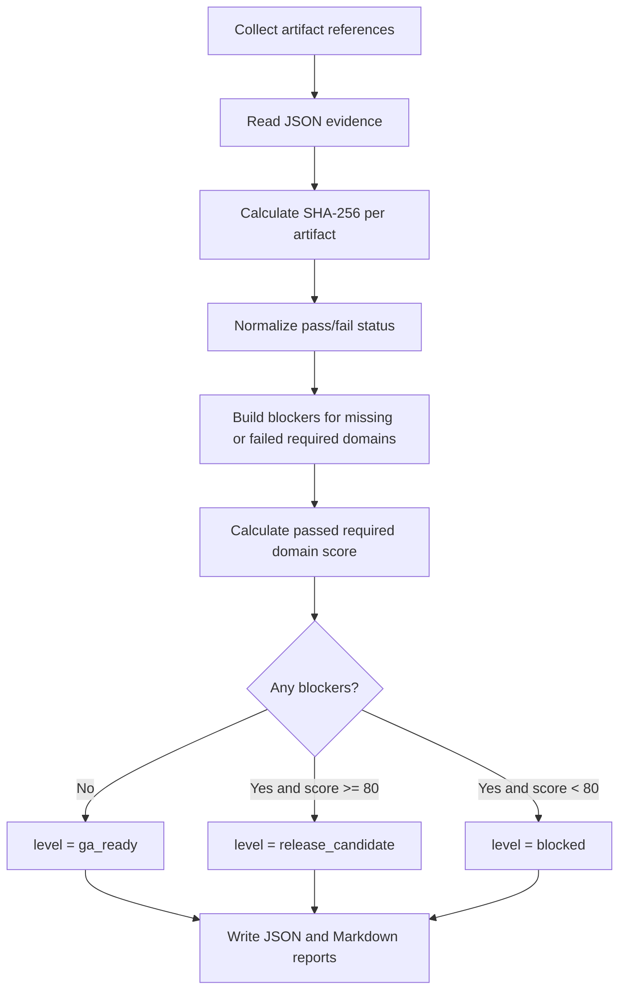

# Production maturity gate

`dpone ops production-maturity` is the local/CI operational-maturity gate for
release readiness. It aggregates CDC, performance, security, supply-chain,
governance, and docs evidence into one deterministic report. It does not grant
route production authority: use the cryptographically re-verified
[route certification matrix](route-certification-matrix.md) for that decision.

The command does not run every heavy suite itself. Instead, each specialized workflow produces an evidence artifact, and the maturity gate verifies that the required domains are present, passed, checksummed, and summarized.

## Quickstart

```bash
uv run dpone ops production-maturity \
  --release vX.Y.Z-rc1 \
  --output-dir test_artifacts/production_maturity/report \
  --artifact cdc=test_artifacts/replay/latest/replay.json \
  --artifact performance=test_artifacts/benchmarks/latest/baseline.json \
  --artifact security=test_artifacts/security/latest/security.json \
  --artifact supply_chain=test_artifacts/supply_chain/latest/evidence.json \
  --artifact governance=test_artifacts/governance/latest/policy.json \
  --artifact docs=test_artifacts/docs/latest/docs.json
```

Outputs:

| File | Purpose |
| --- | --- |
| `production_maturity.json` | Machine-readable gate result, per-domain status, checksums, blockers, score, and level. |
| `production_maturity.md` | Human-readable release review summary. |

## Evidence domains

| Domain | Typical producer | Required signal |
| --- | --- | --- |
| `cdc` | CDC replay/idempotency workflow | Replay offsets and duplicate/idempotency assertions passed. |
| `performance` | Benchmark baseline workflow | No regression blockers against accepted baselines. |
| `security` | CodeQL, secret scan, security evidence export | No blocking findings. |
| `supply_chain` | OSSF Scorecard, SBOM/provenance/signing evidence | No release blockers. |
| `governance` | Compatibility and policy checks | No unresolved governance violations. |
| `docs` | MkDocs strict build and docs contract tests | Documentation builds and examples are valid. |

Raw certification JSON is intentionally rejected by this generic aggregator,
including a caller-supplied `production_certification=VERIFIED` field. Publish
route certification through the dedicated matrix so Sigstore and policy are
re-verified against the exact route/release/deployment subject.

## CI workflow

The scheduled/manual GitHub Actions workflow is `.github/workflows/production-maturity.yml`.

It runs the focused service tests, builds local evidence stubs for deterministic CI coverage, runs `dpone ops production-maturity`, indexes the resulting artifacts, and uploads `production-maturity-report`.

Use the workflow before public releases after the specialized operational
gates have produced real evidence artifacts, and run the route-certification
matrix separately. The stub artifacts in the workflow are not a substitute for
release or production-route evidence; they prove only that the aggregator
remains operational.

## Algorithm



## Runbook

If the gate fails:

1. Open `production_maturity.md` and identify blockers.
2. For `*.missing`, run or upload the missing specialized evidence artifact.
3. For `*.not_passed`, open the source workflow artifact and fix the failing domain, not the aggregator.
4. Re-run the specialized gate first, then rerun `dpone ops production-maturity` with the new artifact path.
5. Do not publish a release while any required blocker remains.

## Related docs

| Need | Doc |
| --- | --- |
| CI/CD workflow inventory | [CI/CD](ci-cd.md) |
| Detailed workflow behavior | [Workflow reference](cicd/workflows.md) |
| Failure recovery | [CI/CD runbooks](cicd/runbooks.md) |
| Connector certification | [Connector certification](connector-certification.md) |
| Supply-chain evidence | [Supply-chain evidence](supply-chain.md) |
| Operations CLI | [dpone ops](ops-cli.md) |
