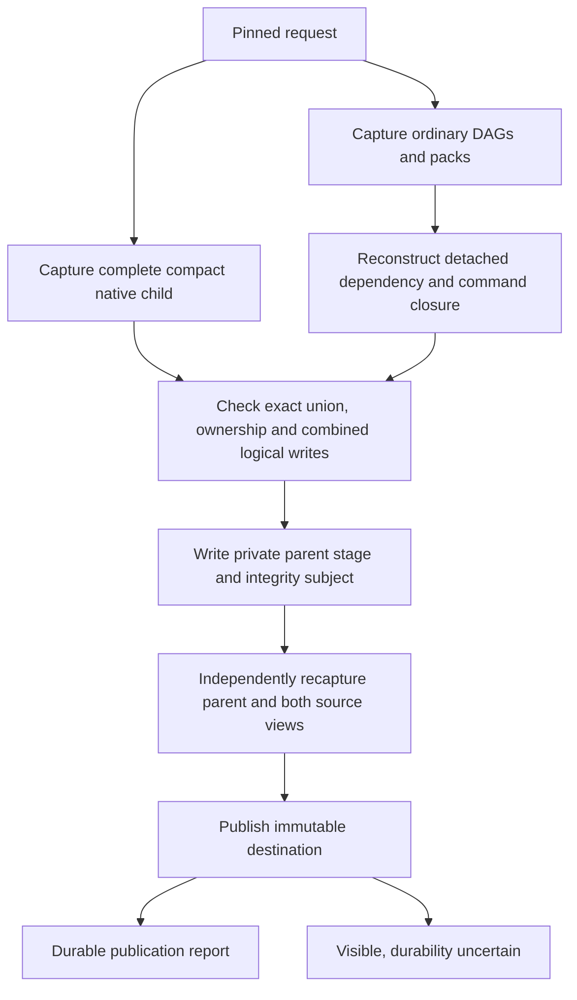

# Release composition contracts and architecture

This reference is for platform engineers and maintainers integrating composition
into CI or delivery tooling. Start with the [first-success guide](release-composition.md)
for a complete producer recipe; use the [operations guide](release-composition-operations.md)
for retries and migration.

## Version boundaries

| Contract | Meaning |
|---|---|
| `dpone.release-composition.v1` | Local composition request and composer identity |
| `dpone.workload-inventory.v1` | Verified ordinary source descriptor inventory |
| `dpone.workload-inventory-report.v1` | Inventory command/service result |
| `dpone.release-set.v3` | Parent envelope with exactly one native and one standalone constituent |
| `dpone.release-set.v2` | Unchanged complete native workspace child |
| dbt wire-v2 / execution-pack.v2 | Native runtime authority, preserved within its child |
| `dpone.release-composition-report.v1` | Composition publication outcome |

These versions describe different contracts. Replacing a v1/v2 schema label or
adding a producer field cannot create a valid composition. Old v1/v2 contracts
retain their existing meaning. Readers must explicitly support the v3 envelope.

## CLI

```text
dpone gitops airflow release-inventory
  --pack-root ROOT --xcom-sidecar-image IMAGE [--format json]

dpone gitops airflow release-compose
  --manifest FILE --output-dir DIRECTORY [--format json]
```

All shown non-format arguments are required. JSON is the only format and the
default. Each command writes one JSON object to stdout; capture it with shell
redirection into a file outside the input/output artifact roots. These two
commands have no separate report-file option. Standard argument-parser failures
are reported on stderr and exit `2`.

`release-inventory` returns `passed`, `inventory_sha256`, and `inventory` on
success. On rejection it returns `passed: false`, a null digest, and `blockers`.
Its exit codes are `0` for verified inventory and `2` for rejection. It validates
the proposed sidecar and transport capability without publishing a release.
The sidecar must pass the Airflow provider's OCI image validator: a digest alone,
an image name containing spaces, or an out-of-range registry port is rejected.
Use a complete reference such as `registry.example/team/xcom@sha256:` followed
by its 64 lowercase hexadecimal digest characters. Rejection leaves source
files unchanged; correct the image reference and repeat the command.

`release-compose` returns `passed`, `status`, `release_id`, `output_dir`,
`source_release_id`, `inventory_sha256`, and `blockers`. A missing or empty
release ID means no candidate identity was established. A populated ID alone
does not prove publication.

| Exit | Status | Meaning |
|---|---|---|
| `0` | `passed` | Complete sources and parent were verified; publication is durable or the identical destination was reverified |
| `2` | `rejected` | Request, source, transport, or immutable destination validation failed |
| `3` | `durability_uncertain` | The complete release is visible, but durable publication could not be confirmed |

## Local request schema

The request has exactly four top-level fields:

| Field | Required content |
|---|---|
| `schema` | `dpone.release-composition.v1` |
| `native_workspace` | `root`, `expected_release_id` |
| `standalone` | `root`, `expected_inventory_sha256` |
| `transport` | `profile`, `xcom_sidecar_image` |

`profile` must be `compact_v2_runtime_connection_context`. Identity values are
`sha256:` followed by 64 lowercase hexadecimal digits. The sidecar is an exact
OCI image reference with an `@sha256:` digest. Every workload in the resulting
parent must use the same sidecar; materialize the native child with that image
before composition.

Roots are local paths, not remote URLs. Relative source roots are resolved from
the manifest's directory. The output path is supplied separately; it is not a
manifest field. The source roots and destination cannot contain one another or
be equal. Confined reads reject symlink traversal. Unknown, missing, and invalid
fields are rejected. YAML acquisition is bounded to 1 MiB with the standard
bounded YAML parser. See the [first-success guide](release-composition.md#capture-source-identity-and-compose)
for generation from actual producer reports.

## Python API and dependency injection

The public composition root is
`dpone.app.release_composition.build_release_composition_service()`.
It returns `ReleaseCompositionService` with:

```python
inventory = service.inventory(ordinary_root, xcom_sidecar_image=sidecar_image)
report = service.compose(request)
installed = service.install(composed_root, cache_root=cache_root)
```

`ordinary_root` is a `pathlib.Path`. The request can be read with
`dpone.manifest.release_composition_request.read_release_composition_request`
or constructed with `dpone.contracts.release_composition.ReleaseCompositionRequest`:

```python
from pathlib import Path
from dpone.contracts.release_composition import ReleaseCompositionRequest

request = ReleaseCompositionRequest(
    native_root=Path(native_report["release_dir"]),
    expected_release_id=native_report["release_id"],
    standalone_root=Path(".dpone/ordinary-build/airflow"),
    expected_inventory_sha256=inventory["inventory_sha256"],
    output_dir=Path("composed-release"),
    xcom_sidecar_image=sidecar_image,
)
```

The omitted `profile` defaults to the only supported compact profile. These
values express caller intent; the service verifies them before publication.
`report.passed` is true only for status `passed`; `report.to_dict()` is the CLI
JSON projection. Python inventory failures raise an exception; the CLI maps them
to the sanitized inventory rejection report. Composition returns a report for
handled source, validation, and publication failures.

The service receives native and ordinary source readers, a confined file reader,
an integrity capability, an immutable publisher, producer version, and the
publisher's durability-error type. The application module constructs those
capabilities. CLI adapters only parse arguments, call the service, and project
its result. Verification is mandatory in the standard composition root.

## Ordinary source closure

The complete ordinary root contains only:

```text
_dags/<dag_id>.dag-spec.json
<workload_id>/airflow-pack.json
```

Each workload belongs to one DAG and appears once. Empty/orphan directories,
missing packs, additional artifact files, duplicate membership, symlinks, and
special files fail. The DAG must reference the whole plain transfer workload;
process selectors and cross-constituent DAG splicing are unsupported.

Source pack fingerprints and DAG schema/fingerprints are verified before any
rewrite. Each embedded archive is decoded, safely extracted, and reconciled in a
private directory. `WorkloadDependencyResolver` reconstructs dependencies from
those source bytes. Runtime materialization must reproduce the declared runtime
manifest. The verifier then rebuilds the original pack with
`AirflowCompactPackBuilder` and compares its executable projections, including
all bootstrap commands, process plans, pod projections, and compatibility
commands. Caller-supplied hashes or producer labels alone are insufficient.

The initial supported manifest has top-level `name`, `source`, `sink`, and
optionally `description`. `name` matches the workload ID. Source and sink types
must explicitly be `postgres`, `mssql`, `mysql`, or `clickhouse`; the sink declares
`connection_ref` and table `schema`/`name`, with optional database. Referenced SQL
files are included through the normal dependency resolver. Standard manifest
parsing still applies. This capability does not cover batch/flow/folder/recipe
manifests, hooks, transforms, extra runtime sections, custom runner assets, live
gate commands, or dbt payload IDs/execution. Unsupported input fails closed and
must use its existing separate delivery path.

The only admitted input connection projections are `{}` and
`{"query_overrides": {}}`. Both mean no connection authority. Existing strict
transfer rewriting produces an empty projection and the pinned sidecar. A
nonempty projection, including a secret-volume bridge, cannot be relabeled.

## Source identity and transport identity

The ordinary inventory contains `schema`, `dag_specs`, and `workload_packs`.
Each descriptor has `id`, original relative `path`, `sha256`, and `bytes`;
workload descriptors also contain `pack_fingerprint`. Its canonical digest binds
original source bytes. It excludes local root paths and the selected sidecar.

The parent release binds both constituents, composer version, compact promotion
profile, and the complete artifact union. It preserves the native child release
object and native executable bytes. Runtime payload trios retain their order and
content-addressed paths. Ordinary source bytes remain under
`_composition/standalone/`; their final strict transport projections are under
`dags/` and `packs/`.

Native source metadata is retained at:

- `_composition/native/release-set.json`;
- `_composition/native/dbt-source-snapshot.json`;
- `_composition/native/release-subjects.sha256`.

The parent `release-subjects.sha256` is transported separately as a redundant
checksum subject derived from the exact descriptor bytes and bound artifact
digests. Readers verify it; it does not grant source admission or signature
authority. `service.install` repeats complete source admission before installing
the immutable parent under `cache_root/releases/<release_id>`.

These source artifacts are registered in `artifacts.composition_sources` and
travel with the parent. Omitting them cannot produce an equivalent release.
Unordered inventories are canonically sorted; ordered runtime trios are not.
Timestamps and local directory locations do not define parent identity. Changed
source bytes, transport, or identity-bearing producer version require a new ID.

## Verification and publication flow



The independent reader reconstructs the native child view and calls its unchanged
source and integrity verifiers. It reconstructs ordinary source bytes, recaptures
the inventory, and compares the deterministic final transport bytes. It also
checks combined logical writes. Different connection aliases are not proof of
physical target disjointness; composition activation remains unavailable.

The source ordinary reader admits at most 10,000 files, 8 MiB per source file,
and 512 MiB total source bytes. Runtime extraction applies its normal per-archive
limits: 64 MiB compressed, 512 MiB expanded, and 10,000 entries. Complete parent
capture additionally enforces 50,000 files, 256 MiB per file, and 2 GiB total;
metadata is bounded to 8 MiB. Source sidecars consume parent budgets too. These
are ceilings, not promised throughput or live certification.

Publication uses the existing immutable writer. It exposes a complete tree
atomically and compares existing destinations instead of overwriting them.
There is no SQL transaction, checkpoint mutation, deployment-pointer update, or
implicit execution dependency between independent DAGs. Continue with the
[operations guide](release-composition-operations.md).
