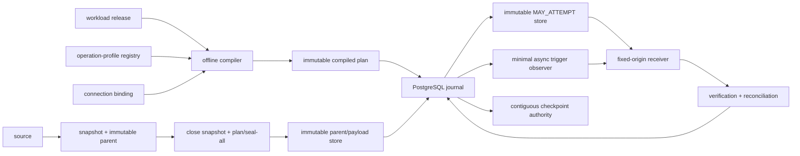

# Governed REST bulk-delivery threat model

- Status: RESEARCHED
- Scope: synchronous batch and one-submit asynchronous bulk-job V1
- Approval gate: platform security owner and control-plane owner

This threat model covers the authority boundaries introduced by governed REST
bulk delivery. It is normative together with the
[feature design](feature-design-rest-api-sink-v1.md),
[machine-readable design contract](rest-bulk-delivery-design-contract-v1.yaml),
and ADRs 0053–0055. Runtime implementation and production certification remain
blocked until the named owners approve these controls and residual risks.

## Assets and authorities

| Asset | Authority | Required property |
|---|---|---|
| Workload intent | Reviewed workload release | Bounded self-service input; no URL, secret, retry, or result-program authority |
| Operation profile | Platform-owned immutable registry | Certified semantics, fence, verification, limits, and deny-only revocation |
| Connection binding | Environment control plane | Fixed authority, stable remote principal/account identity, non-secret credential references |
| Parent and payload artifacts | Immutable object store | Content-addressed, encrypted, create-only, tenant-isolated, retained through sealing/recovery horizon |
| Parent plan | PostgreSQL journal plus immutable plan artifact | Complete child topology and coverage admitted before first mutation |
| Mutation journal | PostgreSQL 15+ synchronous quorum | Zero-loss critical transitions, CAS, database time, tenancy, restore epoch |
| Pre-attempt marker | Independent immutable object authority | Survives journal rewind and proves that a remote attempt may have occurred |
| Effect authority index | PostgreSQL plus recovery evidence | Prevents replay through the maximum permitted replay horizon |
| Receiver | Certified fixed-origin API and remote principal | Endpoint-specific idempotency, receipt, verification, and retention evidence |
| Airflow trigger | Minimal provider-side async observer | Read-only receiver interaction, bounded resources, no business mutation authority |
| Checkpoint | Source-state authority | Advances only across a contiguous verified fully-applied frontier |

## Trust boundaries

The authored workload is outside the security authority boundary. It selects
approved references and logical intent; it cannot grant network reachability,
change a principal, classify a duplicate, relax a fence, or add a response URL.

## Threats, controls, and failure behavior

| Threat | Preventive/detective control | Fail-closed behavior |
|---|---|---|
| Two workers concurrently admit overlapping generations after both observe no conflict | PostgreSQL effect-domain row `SELECT FOR UPDATE`, half-open ranges, GiST `&&`, and one admission transaction | One admission linearizes first; the other observes it and deterministically blocks/stales |
| Append/replace or two local namespaces mutate the same physical receiver resource concurrently | Conflict domain uses stable receiver principal/account/resource plus platform-owned `effect_conflict_group`; local namespace and mutation kind do not split it | Physically overlapping effects share one domain lock and admission fence |
| Older replacement generation resumes after a newer overlapping effect | Monotonic generation tuple, overlap-aware conflict domain, normalized interval watermark map | `REST_DELIVERY_STALE_GENERATION`; no HTTP |
| New replacement overlaps an older unresolved mutation | Range-overlap admission and pre-submit generation fence under the same domain lock | `REST_DELIVERY_OVERLAPPING_EFFECT_IN_FLIGHT`; observe/reconcile only |
| Corrected append repeats an already applied exact scope | Append correction disabled by default; durable successful-effect key | `REST_DELIVERY_APPEND_SCOPE_ALREADY_APPLIED`; certified correction profile required |
| Crash or code upgrade replans a partially executed parent differently | Seal every child and admit immutable ordered topology plus coverage digest before first submit | Existing parent resumes pinned children; planner invocation is forbidden |
| Long planning/sealing holds OLTP source snapshot or version-store pressure | Immutable parent is materialized and digest-verified, then the source snapshot closes before planning/sealing | Planner and sealer read only the parent artifact; no child enters `SUBMITTING` until seal-all/admission barriers pass |
| Asynchronous PostgreSQL failover loses `SUBMITTING` | Synchronous remote-apply quorum and zero-RPO commit policy for critical transitions | Submission is unavailable when quorum is unavailable |
| PITR or lossy restore rewinds journal behind a receiver mutation | Journal epoch, independent immutable `MAY_ATTEMPT`, restore mutation gate, reconciliation campaign | Environment-wide mutation gate remains blocked until approved reconciliation |
| Journal and immutable marker store are restored or compromised together | Independent failure domains, object-lock retention, separate credentials and restore exercises | Certification fails; no production mutation authority |
| Token rotation silently changes receiver tenant/account or TLS/network semantics | Receiver- or dual-approved platform-attested principal/account/resource identity plus authentication, TLS, and network policy identity with expiry | Semantic mismatch changes mutation intent; credential rotation with unchanged certified semantics preserves it |
| Cross-tenant/environment delivery-key collision | Operation namespace includes platform instance, tenant, environment, and namespace revision; receiver fence is `H(operation_namespace, delivery_key)` | Local admission and receiver mutation keys remain isolated; foreign namespace lookup is denied and audited |
| Workload injects arbitrary path, headers, multipart parts, or filename | Closed profile schema and canonical rendered-request semantics digest | Compilation fails before source or secret access |
| Payload size check omits multipart envelope | Deterministic full envelope rendering and actual wire-byte measurement | Payload is not admitted when complete request exceeds the certified limit |
| Arbitrary `Location` redirects credentials or polling to another host | Typed same-origin canonicalization; DNS/IP and redirect authority checks | Foreign origin, scheme, userinfo, or path escape is rejected |
| Profile is compromised or must be disabled after plans are pinned | Mutable deny-only revocation for profile/binding submissions; observation remains allowed | New submit transitions are denied; read-only recovery continues |
| Receiver commits after connection loss and worker retries | Durable `SUBMITTING`, certified receiver fence, no lease-based resend | Remote effect becomes `UNKNOWN`; automatic mutation retry is forbidden |
| Effect tombstone expires before a historical rerun | Long-lived effect authority index and permanent generation watermark | Historical replay resolves prior authority or requires audited namespace reset |
| Process dies between capacity reservation, marker, and journal CAS | Capacity, attempt row/marker binding, and `SUBMITTING` CAS share one PostgreSQL transaction; external marker is attempt-scoped | Transaction rollback frees no invisible slot; orphan marker reconciles by attempt id |
| Active remote job loses local Airflow pool reservation | PostgreSQL remote-job reservation retained across deferral and journal recovery | New submissions wait; `UNKNOWN` does not silently free capacity |
| Triggerer is exhausted by blocking I/O or heavy runtime imports | Minimal async observation client, lazy imports, bounded response/time/depth and distributed poll rate | Trigger fails boundedly; operation stays durable and pending/blocked |
| Duplicate trigger instances race journal writes | Read-only GET/HEAD, observation lease, revision CAS, event-as-hint | Duplicate observation is harmless; `execute_complete` rereads journal authority |
| Remote cancellation endpoint is used as an unjournaled mutation | Active remote cancel is out of V1; only externally cancelled state is observed | CLI/operator cannot issue receiver cancellation in V1 |
| `Retry-After` exceeds remaining operation budget | Earliest-attempt calculation compares the full server delay with the budget | Operation expires/blocks; client never retries earlier than instructed |
| API key in URL leaks through proxy, trace, WAF, exception, or receiver log | Query-key authentication forbidden by production default; exception requires security approval and end-to-end URL redaction evidence | Profile compilation/certification fails |
| Response body leaks secrets or personal data into XCom/logs/evidence | Allowlisted bounded scalar extraction, redaction, content-addressed restricted spill | Evidence publication fails closed; raw body is not serialized |
| Object-store payload is replaced or read cross-tenant | Create-only digest verification, tenant prefixes, KMS, ACL, object lock and access audit | Digest/tenant mismatch blocks submission and raises security incident |
| Namespace reset erases replay protection without governance | Separate audited administrative operation with dual approval and explicit scope | Ordinary runtime and workload authors cannot reset effect authority |

## Authentication capability boundary

V1 profiles may use only these platform-owned authentication providers:

- bearer token;
- API key in an allowlisted header;
- HTTP Basic;
- OAuth 2.0 client credentials;
- mTLS.

HMAC, AWS SigV4, delegated user OAuth, browser flows, workload-authored token
exchange, and response-derived credentials are deferred capabilities. Adding
one requires a threat-model update, a profile schema version, secret-sentinel
tests, and security-owner approval.

API key in a query field is a production-denied exception, not a normal V1
capability. It requires explicit security approval and evidence that client,
proxy, WAF, tracing, exception, access, and receiver logging all redact the URL.

## Journal disaster recovery gate

Critical admission, plan, `MAY_ATTEMPT` correlation, `SUBMITTING`, receipt,
remote-effect, and checkpoint transitions use synchronous quorum commits. A
commit timeout or unavailable quorum occurs before any dependent external
action and blocks submission.

Every restore or failover produces an attested journal epoch decision:

1. prove zero-RPO continuity against synchronous-replication evidence and
   immutable markers; or
2. set the environment mutation gate to `BLOCKED`;
3. inventory markers, operations, receipts, and remote proofs for the affected
   epoch/range;
4. publish a reconciliation artifact and security/platform approvals;
5. advance to a new attested epoch before submissions resume.

PITR is a data-recovery mechanism, not proof that external receiver effects
were rolled back.

## Residual risks and non-claims

- No generic client can prove the outcome of an arbitrary receiver mutation
  after all receiver evidence expires. Such operations remain blocked until an
  endpoint-specific reconciliation proof or operator decision exists.
- Synchronous PostgreSQL replication prevents acknowledged journal loss only
  within its certified topology. Correlated control-plane and marker-store loss
  is outside the guarantee and blocks mutation authority.
- Same-origin validation reduces SSRF and credential-forwarding risk but does
  not certify the business correctness of the receiver account or resource.
- A permanent compact effect index has low storage cost, but its correctness
  depends on governed decommission and namespace-reset procedures.
- V1 does not actively cancel, compensate, or automatically repair a partial
  remote effect.

## Approval record

- [ ] Platform architecture owner approves identity, generation, state, and
      immutable-plan contracts.
- [ ] PostgreSQL/control-plane owner approves zero-RPO topology, epoch, restore,
      and mutation-gate operations.
- [ ] Security owner approves principal binding, marker/object-store separation,
      authentication matrix, revocation, SSRF, and evidence controls.
- [ ] Airflow/provider owner approves minimal async trigger packaging and
      resource budgets.
- [ ] reference profile owner signs vendor-live fence, TTL, same-origin receipt, and
      verification evidence.

Until every applicable approval and exact-environment certification artifact
exists, the subsystem remains `RESEARCHED` and runtime implementation is
`NO-GO`.
