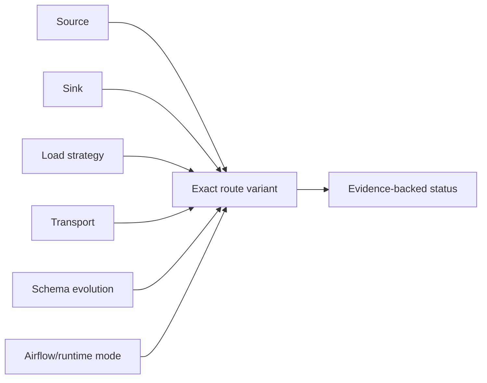
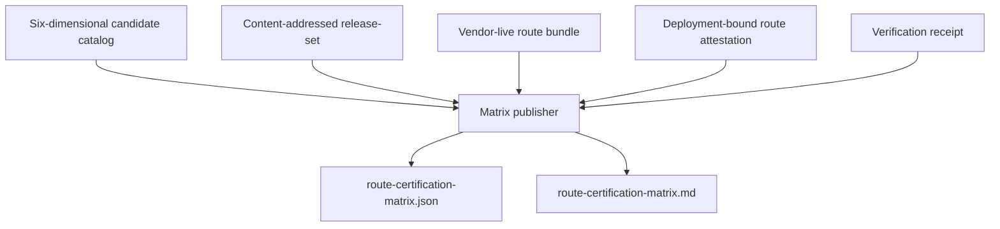

# Route certification matrix

This page is for data engineers, platform engineers, Airflow operators, and
auditors who need to know whether one exact dpone route has contract, live, or
production evidence. It is not a beginner prerequisite for creating the first
Airflow DAG.

The matrix answers a narrower question than connector support:

> Has this source, sink, strategy, transport, schema-evolution mode, and
> Airflow/runtime mode been proved together?

## First publication

Publish the catalog-only matrix for the exact commit:

```bash
dpone certify routes \
  --commit-sha "$(git rev-parse HEAD)" \
  --output-dir test_artifacts/route-certification-matrix
```

Expected files:

```text
test_artifacts/route-certification-matrix/
  route-certification-matrix.json
  route-certification-matrix.md
```

The command publishes an honest matrix even when every row is still
`experimental` / `UNVERIFIED`. Process exit is `0` only when every row is
route/production/enterprise-certified. Incomplete but valid publications exit
`1` unless `--allow-unverified` is set for publish-only workflows. Supplied
malformed, stale, or contradictory evidence also exits `1` (or `2` when
`has_input_failures` is set by FAIL proofs). Unsafe command input or an output
conflict produces `dpone.error.v1` and exit code `2`.

Production promotion requires Sigstore re-verification artifacts beside each
evidence set (`route-attestation.sigstore.json` and
`route-attestation-policy.json`). Consistency-only verification receipts cannot
promote a route to `production-certified`.

## Six-dimensional identity



Connector certification and the source/sink matrix remain useful capability
indexes. They are not production authorization for a route variant. For
example, MSSQL and ClickHouse can both be Beta connectors while a specific
`incremental_merge + native BCP + widening + KPO` route remains experimental.

## Status levels

| Status | What it proves | What it does not prove |
|---|---|---|
| `experimental` | The six-dimensional candidate is registered | Live correctness, production authorization, or an SLA |
| `route-certified` | A fresh exact-commit `vendor_live` route bundle passed with `level=certified` and contains a release-bound six-dimensional matrix claim | Authorization for a specific deployment |
| `production-certified` | The route bundle is linked to a non-expired verified production attestation | Independent operation in a second organization/deployment |
| `enterprise-certified` | Two production proofs have different deployment IDs and different verified signer identities | Universal support for unlisted versions or route variants |

The matrix also reports independent evidence axes:

- `contract_status`: `PASS`, `FAIL`, or `UNVERIFIED`;
- `live_status`: `PASS`, `FAIL`, or `UNVERIFIED`;
- `production_status`: `PASS`, `FAIL`, or `UNVERIFIED`.

`FAIL` dominates a proof set. Missing evidence is never converted to `PASS`.

## Current declared route

The initial public catalog deliberately contains one route rather than a false
Cartesian product:

| Source | Sink | Strategy | Transport | Schema evolution | Runtime | Current status |
|---|---|---|---|---|---|---|
| MSSQL | ClickHouse | `incremental_merge` | `native_bcp_to_clickhouse` | `widening` | `kpo` | `experimental` |

This row is the self-service safe-sample candidate. Catalog membership is
credential-free metadata. It does not authorize production reads or writes.

## Evidence set

Each `--evidence-dir` is explicit and non-recursive. A production proof contains
the six closed proof files below plus the policy-referenced trusted root:

```text
release-set.json
route_certification_bundle.json
route-attestation.json
route-attestation-verification.json
route-attestation.sigstore.json
route-attestation-policy.json
trusted_root.json
```

For route certification, the first two files are required. The route bundle
must have been built with the same `release-set.json`:

```bash
dpone ops route-certify \
  --release v0.72.3 \
  --source mssql \
  --sink clickhouse \
  --strategy incremental_merge \
  --profile vendor_live \
  --release-set test_artifacts/release/release-set.json \
  --artifact route_live_evidence_bundle=test_artifacts/live/route_live_certification.json
```

The last five files are required only for `production-certified`. The policy
must refer to `trusted_root.json` by this same-directory relative path and its
exact SHA-256. The publisher re-verifies the signature; a verification receipt
without the Sigstore bundle, policy, and trusted root remains non-production.

`--release-set` adds a `dpone.route-matrix-claim.v1` that binds the bundle to
the content-addressed release, complete source commit, certification timestamp,
route ID, transport, schema-evolution mode, runtime mode, and sampling mode.
Copying an old bundle cannot refresh this timestamp. Production certification
additionally requires the attestation pair. The reader rejects symlinks, files
larger than 4 MiB, duplicate JSON keys, non-object JSON, stale content-bound
claims, altered release identities, and source-commit mismatches.

Publish one proof:

```bash
dpone certify routes \
  --commit-sha "$(git rev-parse HEAD)" \
  --evidence-dir test_artifacts/routes/mssql-clickhouse-prod-a \
  --output-dir test_artifacts/route-certification-matrix-prod-a
```

Publish two independent proofs:

```bash
dpone certify routes \
  --commit-sha "$(git rev-parse HEAD)" \
  --evidence-dir test_artifacts/routes/mssql-clickhouse-prod-a \
  --evidence-dir test_artifacts/routes/mssql-clickhouse-prod-b \
  --output-dir test_artifacts/route-certification-matrix-enterprise
```

The output stores only safe provenance: artifact digests, release/deployment
IDs, signer identity, environment, and validity. It never copies credentials,
Vault paths, registry bodies, signed download URLs, or source rows.

## Evidence flow



The publisher performs no route workload, network, database, Airflow metadata,
Vault, secret, or cache-refresh call. Existing producers remain authoritative:

1. [Route live certification](route-live-certification.md) proves the live run.
2. [Route certify](route-certify.md) builds the immutable route bundle.
3. Route attestation build and verification bind that bundle to one deployment.
4. This command projects those facts into a support matrix.

## Failure and recovery

| Blocker | Meaning | Recovery |
|---|---|---|
| `route_matrix.release_commit_mismatch` | Release provenance is from another commit | Rebuild the release-set from the exact candidate commit |
| `route_matrix.release_digest_mismatch` | Release bytes no longer match `release_id` | Discard the modified copy and rematerialize by digest |
| `route_matrix.certification_bundle_stale` | Vendor-live evidence is older than policy | Rerun the approved live certification |
| `route_matrix.bundle_claim_invalid` | Bundle is not bound to this release, commit, or exact six-dimensional route | Rebuild `route-certify` with `--release-set` from the same immutable evidence set |
| `route_matrix.certification_bundle_not_vendor_live` | Bundle is mocked, offline, failed, or not certified | Run the vendor-live profile and rebuild the bundle |
| `route_matrix.production_proof_incomplete` | Only one attestation file is present | Regenerate and verify the complete immutable pair |
| `route_matrix.attestation_verification_invalid` | Receipt does not match attestation/bundle bytes | Rerun verification; never edit the receipt |
| `route_matrix.production_subject_invalid` | Release, deployment, environment, or signer is not production-valid | Build a deployment-bound attestation with approved policy |
| `route_matrix.enterprise_independence_missing` | Proofs share a deployment or signer | Attach a genuinely independent production proof |

Do not edit the generated matrix to clear a blocker. Repair the upstream
producer, write a new immutable evidence directory, and publish to a new output
directory.

## Customer journey

| Stage | Question | Action |
|---|---|---|
| Discover | Is my exact route listed? | Read the six columns, not only source/sink support |
| Prepare | Which proof is missing? | Inspect the three evidence states and blockers |
| Execute | How do I publish? | Run `dpone certify routes` with explicit proof directories |
| Observe | Did publication work? | Check exit code and both generated artifacts |
| Diagnose | Why was status not promoted? | Use the blocker table and proof digests |
| Recover | Can I fix the matrix directly? | No; regenerate the authoritative upstream proof |
| Operate | How is production status retained? | Republish before expiry and release review |
| Upgrade | Does connector support imply route support? | No; certify each newly declared route variant |

## Contract references

- [Route certification matrix JSON Schema](schemas/gitops/route-certification-matrix.schema.json)
- [Source to sink matrix](source-sink-matrix.md)
- [Connector certification](connector-certification.md)
- [Airflow self-service architecture](airflow-self-service-architecture.md)
- [Route release finalize](route-release-finalize.md)
