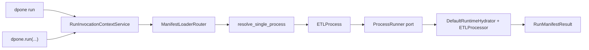
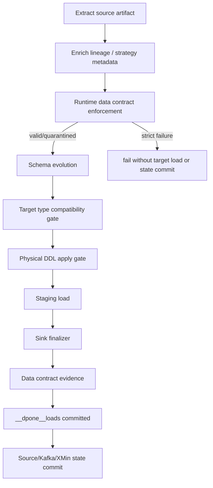

# Running pipelines

`dpone run` is the canonical user-facing command for executing one manifest process. Operational commands under `dpone ops` wrap the release, evidence, approval, and deployment lifecycle around this runtime path, but they do not replace it.

## CLI quickstart

Single-process manifest:

```bash
dpone run manifests/orders_to_landing.yaml
```

Batch manifest with an explicit selector:

```bash
dpone run manifests/dwh_batch.yaml \
  --selector orders \
  --run-id orders_2026_06_05 \
  --format json
```

With registry defaults:

```bash
dpone run manifests/dwh_batch.yaml \
  --selector orders \
  --registry config/source_registry.yaml
```

With retry/backoff for transient failures:

```bash
dpone run manifests/dwh_batch.yaml \
  --selector orders \
  --retry-attempts 2 \
  --retry-backoff-seconds 5 \
  --format json
```

For stateless `full_refresh` and `replace` manifests, `state` can be omitted:
dpone does not create a durable state connector for those strategies. For
stateful strategies, configure `state.type` deliberately; otherwise the legacy
durable state default is used. See [Runtime State Backends](state.md).

## Python quickstart

Use `dpone.run(...)` when embedding dpone in a Python application, notebook, or custom scheduler:

```python
import dpone

report = dpone.run(
    "manifests/orders_to_landing.yaml",
    selector="orders_to_landing",
    run_id="orders_2026_06_05",
    registry_paths=("config/source_registry.yaml",),
    retry_attempts=2,
    retry_backoff_seconds=5.0,
)

if not report.passed:
    raise RuntimeError(report.result.errors)

print(report.result.inserted_rows)
```

The same API is also available as `dpone.api.run`:

```python
from dpone.api import run

report = run("manifests/orders_to_landing.yaml")
```

## What happens under the hood



Execution steps:

1. Snapshot scheduler environment and resolve invocation identity and interval.
2. Load the manifest with `metadata_only=false` so runtime bindings and credentials can be resolved.
3. Select exactly one process by `--selector`, process name, or single-process manifest default.
4. Create a `RunContext` with the requested `run_id` or the process name.
5. Execute `ETLProcess.run()`.
6. If retry is configured and the result is not success-like, wait for the configured backoff and execute a new attempt.
7. Delegate each attempt through the `ProcessRunner` port.
8. Return `RunManifestResult` with the underlying final `ProcessResult`, attempt count, row counts, duration, status, and errors.

## Scheduler identity and precedence

CLI and Python use the same `RunInvocationContextService`. One environment
snapshot is used for the whole resolution, so concurrent environment changes
cannot mix identities within a run.

| Effective value | Explicit input | Environment fallback |
| --- | --- | --- |
| DAG ID | CLI/Python `dag_id` | `DPONE_DAG_ID` |
| Logical date | CLI/Python `execution_date` | `DPONE_LOGICAL_DATE` |
| Interval start | CLI `--interval-start` | `DPONE_INTERVAL_START` |
| Interval end | CLI `--interval-end` | `DPONE_INTERVAL_END` |
| Airflow mapping context | not overridden by an ordinary run argument | `DPONE_AIRFLOW_MAPPING_ITEM` and partition environment |

A non-empty explicit value wins. An omitted or empty explicit value falls back
to the environment. Logical date and interval values must be valid ISO-8601;
invalid effective values fail before manifest loading with exit `2`. The
resolved interval is applied to the load configuration before execution.

## Runtime lifecycle gates

Every `dpone run` attempt uses the same runtime lifecycle inside
`ETLProcessor`. The order is fail-closed:



Important guarantees:

| Gate | Production behavior |
| --- | --- |
| Runtime contracts | `strict` rejects block target load and state commit. `quarantine` keeps target rows clean and writes bad rows to quarantine. |
| Type compatibility | Unsafe narrowing or incompatible target type changes fail before finalization unless an explicit policy routes them to a variant column or quarantine. |
| Physical DDL apply | Runs only when `sink.options.physical_design.apply_runtime: true` and the sink exposes a DDL executor. Blocking existing-table DDL remains blocked in `online` mode. |
| Evidence | `data_contract_evidence.json` is written before load audit/source state commit when `runtime_evidence.output_dir` is configured. |
| State | Source/Kafka/XMin state advances only after sink load, evidence, and load audit commit succeed. |

Example manifest fragment:

```yaml
schema_contract:
  enforcement: quarantine
  columns:
    amount:
      type: decimal
      precision: 18
      scale: 2
      nullable: false

sink:
  options:
    schema_contract:
      enforcement: quarantine
      columns:
        amount:
          type: decimal
          precision: 18
          scale: 2
          nullable: false
    type_inference:
      conflict_policy: quarantine
    physical_design:
      apply_runtime: true
      apply: online
    runtime_evidence:
      output_dir: .dpone/evidence/orders
    dlq:
      directory: .dpone/dlq
      pii_policy: reference_only
```

The resulting JSON report exposes the data contract evidence path under
`result.reconciliation_metrics.data_contract_evidence`.

## Retry policy

Retries are off by default:

```bash
dpone run manifests/orders.yml
```

Enable retries only for idempotent or resumable pipelines:

```bash
dpone run manifests/orders.yml \
  --retry-attempts 3 \
  --retry-backoff-seconds 10
```

Retry behavior:

| Setting | Meaning |
| --- | --- |
| `--retry-attempts 0` | Default. One attempt only. |
| `--retry-attempts 3` | One initial attempt plus three retries; `max_attempts=4`. |
| `--retry-backoff-seconds 10` | Sleep 10 seconds between failed attempts. |
| Python `retry_attempts` | Same behavior as CLI. |
| Python `retry_backoff_seconds` | Same behavior as CLI. |

Safety model:

1. A retry is triggered only when the previous attempt returns a non-success `ProcessResult`.
2. Success-like statuses are `success`, `completed`, and `succeeded`, with no errors.
3. `dpone run` does not hide failed attempts; the final report includes `attempts` and `max_attempts`.
4. State advancement must still happen only after committed loads in the runtime/load lifecycle.
5. Do not enable retries for non-idempotent custom sinks unless they use staging-first finalization and committed-load guards.

## Output formats

Text is the default:

```bash
dpone run manifests/orders_to_landing.yaml
```

JSON is recommended for automation:

```bash
dpone run manifests/orders_to_landing.yaml --format json
```

Markdown is useful for release notes or runbooks:

```bash
dpone run manifests/orders_to_landing.yaml --format md
```

Command-owned reports go to stdout. A successful `--format json` run emits one
JSON object with `manifest`, `process`, `selector`, `run_id`, `passed`,
`attempts`, `max_attempts`, `retry_backoff_seconds`, and a `result` containing
status, row counts, duration, and errors. For example:

```json
{
  "manifest": "manifests/orders_to_landing.yaml",
  "process": "orders_to_landing",
  "selector": null,
  "run_id": "orders_local",
  "passed": true,
  "result": {
    "status": "success",
    "inserted_rows": 1000,
    "updated_rows": 0,
    "final_rows": 1000,
    "extracted_rows": 1000,
    "duration_seconds": 1.5,
    "errors": []
  },
  "attempts": 1,
  "max_attempts": 1,
  "retry_backoff_seconds": 0.0
}
```

Pre-execution and runtime failures requested as JSON keep the same top-level
identity fields, set `passed` to `false`, and expose the safe message in
`result.errors`; typed failures also expose `result.error_code`. These reports
still go to stdout so automation receives one parseable channel. Argparse
usage errors, such as an unknown option, go to stderr and exit `2`. Secrets and
absolute local paths are redacted from every public format.

## Exit codes

| Exit code | Meaning |
| --- | --- |
| `0` | Process finished with a success-like status and no errors. |
| `1` | Process executed but returned a non-success status or errors. |
| `2` | Manifest/configuration error before execution. |
| `130` | Interrupted by the user. |

## Common runbooks

### `dpone run` is missing

1. Verify the installed version with `python -c "import dpone; print(dpone.__version__)"`.
2. Run `dpone run --help`.
3. If the command is missing, upgrade to a version that includes the restored top-level run command.
4. Do not use `dpone ops` commands as a replacement for process execution; they are operational controls around a run.

### Batch manifest has multiple processes

Symptom:

```text
Manifest ... contains N processes. Use --selector or --all.
```

Fix:

```bash
dpone manifest list manifests/dwh_batch.yaml
dpone run manifests/dwh_batch.yaml --selector orders
```

### Selector not found

1. Run `dpone manifest render manifests/dwh_batch.yaml --all`.
2. Copy the `selector` or process `name` exactly.
3. Re-run `dpone run ... --selector <selector>`.

### Credentials or optional dependencies fail

1. Run `dpone doctor --profile local`.
2. Confirm the relevant extra is installed, for example `dpone[postgres]`, `dpone[mssql]`, `dpone[clickhouse]`, or `dpone[kafka]`.
3. Confirm `connection_type` matches your configured credential source.
4. See [Connections and credentials](connections.md).

### Runtime returned failed status

1. Re-run with `--format json` and inspect `result.errors`.
2. Check source/sink credentials and permissions.
3. Check load strategy compatibility in [Load strategies](load-strategies.md).
4. If the error mentions data contracts, inspect [Runtime data contracts](data-contract-runtime.md) and quarantine files.
5. If the error mentions physical DDL, inspect [Physical DDL apply](physical-ddl-apply.md).
6. For production releases, attach the JSON output to `dpone ops evidence-bundle` or the incident pack.

### Retry exhausted

1. Inspect `attempts`, `max_attempts`, and `result.errors` in JSON output.
2. Check whether the failure is transient: network timeout, connection reset, temporary lock, or API 429.
3. If the failure is deterministic, fix the manifest/source/sink before increasing retries.
4. If the sink is not idempotent, do not retry until the load strategy is staging-first and state-safe.
5. For recurring jobs, prefer scheduler-level alerting plus `dpone ops run-registry` evidence.

## Related commands

| Need | Command |
| --- | --- |
| Validate manifest before execution | `dpone manifest validate <path>` |
| Inspect effective manifest | `dpone manifest render <path>` |
| Preview source/sink/staging plan | `dpone plan <path>` |
| Execute one process | `dpone run <path>` |
| Generate a manual/synthetic run artifact (not the result of `dpone run`) | `dpone run-report --run-id ... --pipeline ...` |
| Build operational release evidence | `dpone ops release-orchestrator` |
