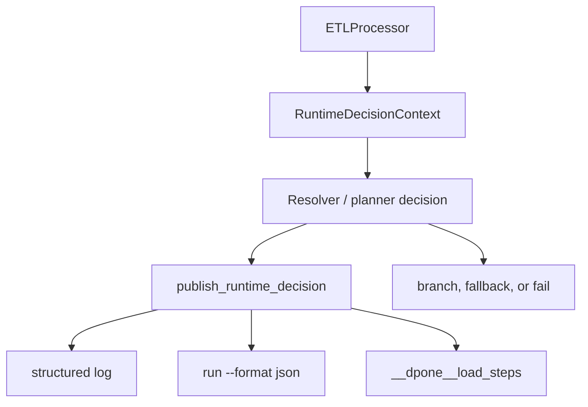

# Runtime decision audit

Runtime decision audit makes every automatic route choice and fallback visible
in the same places: structured logs, `dpone run --format json`, and governed
load-step audit storage.

The goal is simple: if dpone changes a requested `auto` route at runtime, the
operator must see what was requested, what was selected, why the fallback was
allowed, and whether the release gate is green, warning, or blocked.

## Public contract

Decision audit is enabled by default under load governance:

```yaml
sink:
  options:
    load_governance:
      enabled: true
      decision_audit:
        enabled: true
        persist: true
        log_level: warning_on_fallback # always|warning_on_fallback|error_only
        include_successful_decisions: true
```

`persist: true` writes decision rows to `__dpone__load_steps` when load audit
storage is enabled. If audit storage is disabled, runtime still emits
structured logs and includes a compact summary in the JSON run result.

## Evidence shape

Every decision is normalized to
`dpone.runtime.decision_audit.v1`:

```json
{
  "schema_version": "dpone.runtime.decision_audit.v1",
  "decision_id": "clickhouse.direct_ingest",
  "phase": "load",
  "component": "clickhouse_sink",
  "category": "backend_selection",
  "requested": "auto",
  "selected": "client",
  "fallback_allowed": true,
  "fallback_reason": "direct_ingest_provider_uncertified",
  "release_gate": "warning",
  "warnings": ["direct_ingest_provider_uncertified"],
  "blockers": [],
  "route_id": "mssql_bcp_native_to_clickhouse_native",
  "provider": "dpone-native-accel",
  "provider_version": "0.61.3",
  "details": {
    "input_format": "Native",
    "certification_mode": "certified_only",
    "route_certified": false
  }
}
```

Secrets are redacted recursively before a decision is logged, returned, or
persisted. Keys such as `password`, `token`, `secret`, `credential`,
`authorization`, `api_key`, and URLs with embedded credentials are masked.

## Lifecycle



Planners and resolvers stay pure: they return their existing decision objects.
Runtime branches publish the decision before they choose a backend, fallback, or
raise an error.

## Current decision points

| Decision id | Phase | What it explains |
| --- | --- | --- |
| `clickhouse.direct_ingest` | `load` | `native_tcp.backend: auto|direct|client` selection and direct-provider fallback. |
| `native_transfer.acceleration` | `load` | `native_accelerated` vs `python_reference` backend selection. |
| `load_governance.finalization` | `load_governance` | `pre_finalize` vs legacy finalization fallback. |
| `source_export.optimizer` | `extract` | Export provider selected from benchmark/probe evidence. |
| `source_scan.planner` | `extract` | `range_partitioned`, `single_scan_chunks`, or `single_file` scan mode. |
| `source_materialization` | `extract` | Source-side work-table materialization selected, skipped, or blocked. |
| `mssql.bcp_pipe.route` | `extract` | BCP FIFO route selection, configured/effective read buffer, deprecated aliases, and blockers. |
| `mssql.bcp_pipe.started/progress/completed` | `extract` | BCP process lifecycle and safe progress/row-count metadata. |

For the streaming migration, `deprecated_aliases` uses the unambiguous full
path `source.options.native_transfer.snapshot.streaming.target_chunk_bytes`.

Future connector and CDC decisions should publish through the same
`RuntimeDecision` contract instead of adding connector-specific audit helpers.

## Runtime JSON

`dpone run --format json` includes a compact summary:

```json
{
  "runtime_decisions": {
    "schema_version": "dpone.runtime.decision_audit.v1",
    "total": 2,
    "by_release_gate": {"green": 1, "warning": 1, "blocked": 0},
    "decisions": [
      {
        "decision_id": "clickhouse.direct_ingest",
        "phase": "load",
        "component": "clickhouse_sink",
        "category": "backend_selection",
        "requested": "auto",
        "selected": "client",
        "fallback_reason": "direct_ingest_provider_missing",
        "release_gate": "warning",
        "warnings": ["direct_ingest_provider_missing"],
        "blockers": []
      }
    ]
  }
}
```

This summary is safe for CI artifacts and incident notes because it omits large
provider payloads and redacts sensitive details.

## Durable audit

For governed ClickHouse loads, decisions are written as load steps:

```sql
SELECT
    step_id,
    phase,
    kind,
    status,
    details_json
FROM etl_state.__dpone__load_steps
WHERE kind = 'runtime_decision'
ORDER BY started_at;
```

`status` is `succeeded` for green and warning decisions. Blocked decisions are
persisted first and then fail the run, so the operator can see the exact reason
even when source I/O never starts.

## Logging

Structured log lines are stable and grep-friendly:

```text
event=dpone.runtime_decision decision_id=clickhouse.direct_ingest phase=load component=clickhouse_sink category=backend_selection requested=auto selected=client release_gate=warning fallback_reason=direct_ingest_provider_missing
```

`log_level` controls noise:

| Value | Behavior |
| --- | --- |
| `always` | Log every published decision. |
| `warning_on_fallback` | Log warnings, blockers, and fallback decisions. |
| `error_only` | Log only blocked decisions. |

Persistence and JSON summary are controlled separately from log verbosity.

## Failure rules

- Forced or `required` backend missing: publish a blocked decision, then fail
  before source I/O when the branch is pre-I/O.
- `auto` fallback: publish a warning decision, continue only when policy allows
  fallback.
- Successful `auto`: publish a green decision when
  `include_successful_decisions: true`.
- Mid-load backend failure does not silently fallback after staging write has
  started; normal staging abort/finalization safety rules apply.

## Troubleshooting

| Symptom | What to check |
| --- | --- |
| Direct ClickHouse insert used the client wrapper | Find `decision_id=clickhouse.direct_ingest` and inspect `fallback_reason`. |
| Native accelerator did not run | Find `decision_id=native_transfer.acceleration`; common reasons are missing package, unsupported platform, unsupported schema, or uncertified route. |
| Heap table used single-scan chunks | Find `decision_id=source_scan.planner`; it should explain heap/no-index/low-confidence stats blockers for range partitioning. |
| Export provider changed unexpectedly | Find `decision_id=source_export.optimizer` and compare `selected`, `current_default`, probes, rejected providers, and speedup details. |
| Audit table has no rows | Check `load_governance.audit.enabled` and `decision_audit.persist`. Logs and JSON summary still include decisions when persistence is disabled. |

## Extension rules

New auto/fallback logic should:

1. Keep decision calculation side-effect free.
2. Normalize to `RuntimeDecision` before branching.
3. Publish before fallback or raise.
4. Use stable reason codes in `warnings`, `blockers`, and `fallback_reason`.
5. Put connector details in `details`, never in ad-hoc log text only.
6. Let the shared redactor handle credentials before output.
