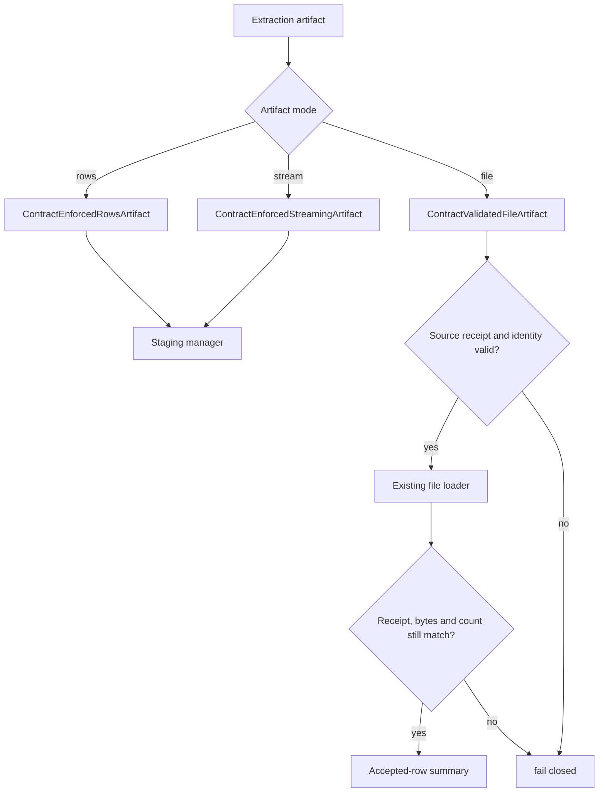

# Streaming-safe contracts for native fast paths

`dpone` enforces data contracts inside `dpone run`, not only in plan-only
commands. Large production paths must preserve that safety without forcing every
source into an in-memory list.

## Supported artifact modes

| Artifact | Contract behavior | Memory behavior |
| --- | --- | --- |
| `InMemoryRowsArtifact` | Validate rows before staging. | Materialized by definition. |
| `StreamingRowsArtifact` | Validate chunk-by-chunk through `ContractEnforcedStreamingArtifact`. | Does not load the full stream. |
| `FileExportArtifact` | Requires a source-issued receipt bound to the exact file, wire format, ordered source schema, contract and row count. | Retains the existing file loader; receipt integrity checks still read the source file. |
| `PartitionedFileExportArtifact` | Requires separate per-partition evidence. The legacy boolean wrapper is not proof of validation. | Partition parallelism does not establish certification. |
| `InternalQueryArtifact` | Requires source/target SQL contract certification or a prevalidated wrapper. | Avoids Python row parsing. |

## Runtime flow



The file branch shows the ClickHouse single-file consumer. It passes the same
concrete artifact to its existing loader once, verifies the receipt again after
loading, and compares the returned count with the validated source count. Only
then does it report accepted rows. On failure, the existing staging lifecycle
attempts cleanup; source retention follows the original terminal owner. This
does not add a retry or publication-idempotency guarantee.

Partitioned validation remains a separate contract. In particular, the legacy
`PartitionedContractValidationArtifact(prevalidated=True)` gate is not a
replacement for per-partition receipts and must not be used as certification
evidence. The single-file behavior above does not repair that authority gap.

## Manifest knobs

```yaml
sink:
  options:
    schema_contract:
      enforcement: quarantine
      columns:
        amount:
          type: decimal
          precision: 18
          scale: 2
          nullable: false
    type_inference:
      conflict_policy: quarantine
    dlq:
      directory: .dpone/dlq
      pii_policy: reference_only
    runtime_evidence:
      output_dir: .dpone/evidence/orders
```

No manifest boolean creates validation proof. The source exporter must issue a
`FileContractValidationReceipt` for the configured schema contract. Setting
`contract_prevalidated: true` does not bypass the single-file receipt requirement.
The current source-side file-contract validator supports uncompressed
`mssql-delimited` files; other opaque formats need their own supported validation
producer or a row/stream route. Do not create receipts by hand or remove strict
contracts to bypass a missing producer.

## Runbook

| Symptom | Action |
| --- | --- |
| `file_contract_receipt.required` | Use an exporter that validates this file format and schema contract, or select a supported row/stream route; re-export before loading. |
| File, wire, schema, contract or receipt identity mismatch | Re-export against the intended ordered source schema and contract. Reconstruct the wrapper from that receipt; do not relabel or reuse stale evidence. |
| `file_contract_receipt.row_count_mismatch` | Compare the validated export count with the file loader's count. Resolve the discrepancy before following the route's retry/recovery procedure. No successful staged handle is returned. |
| DLQ volume spikes | Inspect safe metadata with `dpone ops quarantine-export`, fix source drift, and use a route-specific replay executor only after contract review. |
| Streaming load is slower | Increase artifact batch size and keep native target bulk mode enabled. |
| Partitioned fast path needs validation proof | Require producer evidence for every partition and review its admission contract. An authored boolean is insufficient. |

## Developer notes

Runtime wrappers live in `dpone.runtime.etl.contract_artifacts`. Keep them thin:
row wrappers delegate validation to `dpone.type_system.ContractEnforcementService`;
single-file wrappers use `dpone.runtime.etl.file_contract_validation`. The source
producer scans the supported file and issues its bound receipt. ClickHouse's
internal concrete-file consumer reopens its checks before and after dispatch;
it does not expose a new public artifact capability, recursively unwrap objects,
change file formats, or reinterpret target renaming as source identity.

The validation summary keeps its existing `opaque_file_prevalidated` mode after
success. A failed consumption does not reuse a previous successful row summary.
Receipt checks and a recording-connector test do not replace live route
certification or independent target reconciliation.

Related docs:

- [Runtime data contracts](data-contract-runtime.md)
- [Physical DDL apply](physical-ddl-apply.md)
- [Performance](performance.md)
