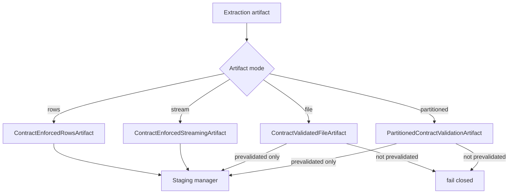

# Streaming-safe contracts for native fast paths

`dpone` enforces data contracts inside `dpone run`, not only in plan-only
commands. Large production paths must preserve that safety without forcing every
source into an in-memory list.

## Supported artifact modes

| Artifact | Contract behavior | Memory behavior |
| --- | --- | --- |
| `InMemoryRowsArtifact` | Validate rows before staging. | Materialized by definition. |
| `StreamingRowsArtifact` | Validate chunk-by-chunk through `ContractEnforcedStreamingArtifact`. | Does not load the full stream. |
| `FileExportArtifact` | Fail closed unless the source marks the export as prevalidated. | Preserves native file load speed. |
| `PartitionedFileExportArtifact` | Requires per-partition validation during export. | Preserves partition parallelism. |
| `InternalQueryArtifact` | Requires source/target SQL contract certification or a prevalidated wrapper. | Avoids Python row parsing. |

## Runtime flow



## Manifest knobs

```yaml
sink:
  options:
    schema_contract:
      enforcement: quarantine
      columns:
        amount:
          type: decimal
          precision: 18
          scale: 2
          nullable: false
    type_inference:
      conflict_policy: quarantine
    dlq:
      directory: .dpone/dlq
      pii_policy: reference_only
    runtime_evidence:
      output_dir: .dpone/evidence/orders
```

For file/native fast paths, use `contract_prevalidated: true` only when the
source export step already validated every row or partition:

```yaml
sink:
  options:
    contract_prevalidated: true
```

## Runbook

### Source-byte budget admission

For platform owners and manifest authors, an explicit
`sink.strategy.max_source_bytes` is a positive Int64-sized limit for
`full_refresh`. The public builder preserves it as a reserved runtime contract;
null, malformed, misplaced and non-full-refresh occurrences fail before I/O.
The dbt planner freezes the platform-owned value into generated manifests.

At the ClickHouse staged-load boundary, dpone sums complete, deduplicated
source-emitted byte evidence from validated files, physical chunks, transfer
slices, or the certified MSSQL BCP stream. Publication proceeds only when the
measurement is complete and does not exceed the limit. Otherwise staging is
cleaned and the published target remains unchanged. An empty completed snapshot
is a measurable zero-byte input.

The separately enforced `ClickHouseValidatedFilePolicy.max_source_bytes` Python
staging limit keeps its existing behavior. Neither limit represents compressed
ClickHouse allocation. See [dbt inline publishing](dbt-inline-publishing.md) and
the [MSSQL to ClickHouse route](source-sink/mssql-to-clickhouse.md#bounded-full-refresh).

### Runtime contract failures

| Symptom | Action |
| --- | --- |
| `opaque file artifact requires prevalidated contract` | Validate during source export or remove strict runtime contracts for that opaque fast path. |
| DLQ volume spikes | Inspect safe metadata with `dpone ops quarantine-export`, fix source drift, and use a route-specific replay executor only after contract review. |
| Streaming load is slower | Increase artifact batch size and keep native target bulk mode enabled. |
| Partitioned fast path fails closed | Certify every partition writer emits contract validation evidence before enabling `contract_prevalidated`. |

## Developer notes

Runtime wrappers live in `dpone.runtime.etl.contract_artifacts`. Keep them thin:
they adapt artifact protocols and delegate actual validation to
`dpone.type_system.ContractEnforcementService`.

Related docs:

- [Runtime data contracts](data-contract-runtime.md)
- [Physical DDL apply](physical-ddl-apply.md)
- [Performance](performance.md)

## Explicit validated ClickHouse file staging

`ClickHouseSink.stage_validated_file` accepts a genuine validated default-codec
character export and prepares a separate bounded RowBinary spool. It is an explicit
Python capability; generic `stage_payload` and ordinary routes do not activate it.
Source receipts retain their authority, while exact transport/count checks and
immutable journal events govern only the new staging attempt. See the
[API guide and recovery procedure](validated-clickhouse-file-staging.md) and
[developer contract](developer-validated-clickhouse-file-staging.md).
