# Schema contracts

Schema contracts let users define portable logical column types before `dpone`
renders target-specific DDL. They are the right place for business-critical
columns, sparse columns, financial decimals, timestamps, and fields where
sampled inference is not acceptable.

## Basic contract

```yaml
schema_contract:
  id: analytics.orders
  version: 1.5.0
  owner: data-platform
  enforcement: strict
  compatibility: backward
  columns:
    amount:
      type: decimal
      precision: 18
      scale: 4
      nullable: false
    updated_at:
      type: timestamp
      timezone: true
      nullable: false
    payload:
      type: json
      nullable: true
```

## Version registry

`schema_contract.registry` turns a logical schema into a versioned data API:
`analytics.orders@1.5.0`. The registry is provider-neutral and does not open a
target database connection. It stores immutable contract versions in
`local_json` or `sqlite`, then lets PR/MR and deploy pipelines prove that a
schema migration is compatible with the published contract and declared
consumers.

```yaml
sink:
  options:
    schema_contract:
      id: analytics.orders
      version: 1.5.0
      owner: data-platform
      enforcement: strict
      compatibility: backward
      registry:
        enabled: true
        mode: gate
        store_backend: sqlite
        store_uri: .dpone/schema-contracts/registry.sqlite3
      versioning:
        semver: strict
        allow_major: approval_required
        unknown_consumer: warn
      deprecation:
        default_remove_after_days: 90
        expired_policy: block
      consumers:
        discovery:
          enabled: true
          mode: gate
          unknown_consumer: warn
          required_sources: [manual]
          sources:
            manual: true
            manifests: true
            dbt_manifest: target/manifest.json
            openlineage: .dpone/lineage/latest.json
        manual:
          - id: finance.daily_margin
            type: dashboard
            owner: finance-analytics
            version_constraint: ">=1.4,<2.0"
            reads:
              columns: [amount, customer_id]
      columns:
        amount:
          type: decimal
          precision: 18
          scale: 2
          nullable: true
        customer_id:
          type: integer
          nullable: true
```

### Semver rules

| Change | Required bump | Default compatibility |
| --- | --- | --- |
| Owner, docs, or deprecation metadata only | `patch` | compatible |
| Add nullable column or add alias | `minor` | compatible |
| Drop column, narrow type, `nullable -> not nullable`, direct rename, expired alias removal | `major` | breaking |
| Incompatible type expansion with `__dpone__nc__<column>` | `major` unless hidden behind a compatible alias lifecycle | breaking |

In `semver: strict`, the declared manifest version must satisfy the required
bump. If the registry already has `analytics.orders@1.4.0`, adding a nullable
column must declare at least `1.5.0`; a breaking change must declare `2.0.0` or
another higher major version.

### Consumers and deprecation windows

Manual consumers let data owners pin dashboards, jobs and downstream products to
a compatible version range. `dpone schema contract gate` blocks when a consumer
reads a removed column or when its `version_constraint` excludes the head
contract version. Unknown consumer policy is configurable:

| Policy | Behavior |
| --- | --- |
| `allow` | Do not emit consumer evidence. |
| `warn` | Emit warning evidence but allow local/dev flows. |
| `block` | Fail gate until consumers are registered. |

Deprecation windows belong in the contract registry rather than in ad hoc PR
comments. Use `dpone schema contract deprecate` to emit a deterministic receipt
for a column or alias removal window.

### Consumer discovery and compatibility matrix

Manual consumers are still the safest source of ownership truth, but production
review usually needs more evidence than hand-maintained YAML. Consumer discovery
builds a local, provider-neutral inventory from:

| Source | Evidence |
| --- | --- |
| `manual` | `schema_contract.consumers.manual` owner/version/read declarations. |
| `manifests` | Local dpone manifests/routes that reference the same contract/table. |
| `dbt_manifest` | Local dbt `manifest.json` source/model dependency metadata. |
| `openlineage` | Local OpenLineage artifacts with input datasets and schema facets. |
| `dbt_compiled_sql` | Local dbt compiled SQL parsed with `sqlglot` for column-level reads. |
| `datahub` | Local DataHub MCP/export payloads with dataset and column mappings. |
| `generic_catalog` | Portable JSON/CSV-style catalog exports for BI/jobs/catalog tools. |

The resulting matrix answers:

```text
contract version -> changed columns/aliases -> discovered consumers -> confidence -> owner action
```

It complements `schema_impact`: impact is a migration blast-radius view,
consumer matrix is a data API compatibility view. The matrix is offline and does
not query target databases or SCM APIs.

```bash
dpone schema contract consumers lineage \
  --manifest manifests/orders.yaml \
  --format json \
  --output .dpone/schema-contracts/orders.lineage.json

dpone schema contract consumers discover \
  --manifest manifests/orders.yaml \
  --lineage .dpone/schema-contracts/orders.lineage.json \
  --format json \
  --output .dpone/schema-contracts/orders.consumers.json

dpone schema contract consumers matrix \
  --manifest manifests/orders.yaml \
  --against analytics.orders@1.5.0 \
  --consumers .dpone/schema-contracts/orders.consumers.json \
  --lineage .dpone/schema-contracts/orders.lineage.json \
  --format md \
  --output .dpone/schema-contracts/orders.consumer-matrix.md

dpone schema contract consumers gate \
  --manifest manifests/orders.yaml \
  --pack .dpone/schema-migration/orders.pack.json \
  --matrix .dpone/schema-contracts/orders.consumer-matrix.json \
  --format json \
  --output .dpone/schema-contracts/orders.consumer-gate.json
```

In `mode: gate`, the consumer gate blocks removed column reads, expired alias
reads, incompatible `version_constraint` ranges and missing required discovery
sources. In `mode: observe`, the same evidence is emitted as warnings so teams
can adopt discovery without breaking existing pipelines.

Lineage evidence carries a confidence level:

| Confidence | Meaning |
| --- | --- |
| `explicit` | Manual declaration or catalog column mapping. |
| `parsed` | `sqlglot` parsed a local SQL artifact to column-level reads. |
| `inferred` | Dataset dependency is known and columns are partially inferred from facets. |
| `table_only` | Consumer depends on the table, but column reads are unknown. |

For `major`, drop, direct-rename and expired-alias changes, the default
`low_confidence_major_change: block` fails closed when only `table_only` or
`inferred` evidence exists. Set it to `warn` only for an explicit migration
window where owners accept the risk.

### Consumer test kit and certification

The consumer matrix tells the release pipeline who is affected. The test kit
turns that evidence into owner-routable checks, so PR/MR reviewers can see which
consumer contract tests should run before promotion. V1 is offline and
provider-neutral: dpone generates deterministic pytest/Markdown scaffolding and
certifies an imported result artifact; it does not call BI tools, APIs or SCMs.

```bash
dpone schema contract consumers test-kit plan \
  --manifest manifests/orders.yaml \
  --matrix .dpone/schema-contracts/orders.consumer-matrix.json \
  --compatibility-view-plan .dpone/schema-contracts/orders.compatibility-views.json \
  --format json \
  --output .dpone/schema-contracts/orders.consumer-test-kit.json

dpone schema contract consumers test-kit render \
  --kit .dpone/schema-contracts/orders.consumer-test-kit.json \
  --format pytest \
  --output tests/generated/test_orders_consumers.py

dpone schema contract consumers test-kit certify \
  --kit .dpone/schema-contracts/orders.consumer-test-kit.json \
  --result passed \
  --format json \
  --output .dpone/schema-contracts/orders.consumer-certification.json
```

`test-kit plan` treats blocked matrix rows as required cases instead of failing
the kit. That is intentional: the kit is the handoff artifact for consumer
owners. `certify` is the go/no-go artifact; it returns `blocked` when a required
case fails or is missing from a detailed result artifact.

| Evidence | Assertion |
| --- | --- |
| Column reads | Required columns are available to the consumer. |
| Version constraint | The consumer pin is compatible with the head contract or a served compatibility view. |
| Compatibility view | Older pinned consumers can read the versioned view that covers their columns. |
| Owner/confidence | Review routing preserves owner and evidence confidence from discovery/lineage. |

`consumer_test_kit` and `consumer_certification` are normal migration bundle
artifacts. Production bundle policies should require `consumer_certification`
for major/drop/direct-rename migrations, and the evidence registry can persist
stage `consumer_certified`.

### Compatibility views and multi-version serving

Consumer matrix gates intentionally fail closed for breaking changes. Contract
compatibility views turn that blocker into a release path: publish the new
contract version, keep older pinned consumers on a versioned view, migrate
consumers during the deprecation window, then retire the view when the registry
proves no consumers are pinned.

```yaml
sink:
  options:
    schema_contract:
      id: analytics.orders
      version: 2.0.0
      serving:
        enabled: true
        mode: gate
        default_strategy: projection_view
        unknown_mapping: block
        expired_view: block
        view_naming: "{schema}.{table}__contract_v{major}"
        versions:
          - constraint: "1.x"
            source_contract: analytics.orders@1.5.0
            view: analytics.orders__contract_v1
            remove_after: 2026-09-01
            owner: data-platform
            columns:
              client_id:
                from: customer_id
              amount:
                from: amount
                cast: "Decimal(18, 2)"
```

Planning is offline and provider-neutral:

```bash
dpone schema contract views plan \
  --manifest manifests/orders.yaml \
  --against analytics.orders@1.5.0 \
  --consumer-matrix .dpone/schema-contracts/orders.consumer-matrix.json \
  --format json \
  --output .dpone/schema-contracts/orders.compatibility-views.json

dpone schema contract views gate \
  --plan .dpone/schema-contracts/orders.compatibility-views.json \
  --consumer-gate .dpone/schema-contracts/orders.consumer-gate.json \
  --format json \
  --output .dpone/schema-contracts/orders.compatibility-view-gate.json

dpone schema contract views report \
  --plan .dpone/schema-contracts/orders.compatibility-views.json \
  --format md
```

The planner maps old contract columns to current expressions by stable identity
first, then by configured column mapping. It supports direct projection, alias
projection, safe casts, configured expressions/defaults, and fail-closed blockers
for unmapped or expired views. For ClickHouse V1 it renders normal
`CREATE OR REPLACE VIEW ... AS SELECT ...` statements; materialized views are
intentionally out of scope because they add storage and backfill semantics.

When enabled, `dpone schema migration plan` embeds
`compatibility_view_summary` and inserts the phase order:

```text
compatibility_views_expand
-> normal schema/physical migration phases
-> compatibility_views_validate
-> destructive contract/drop only after coverage or separate approval
```

`compatibility_view_gate` is a normal bundle/registry artifact:

```bash
dpone schema migration bundle build \
  --pack .dpone/schema-migration/orders.pack.json \
  --contract-gate .dpone/schema-contracts/orders.contract-gate.json \
  --consumer-gate .dpone/schema-contracts/orders.consumer-gate.json \
  --compatibility-view-gate .dpone/schema-contracts/orders.compatibility-view-gate.json \
  --output-dir .dpone/schema-migration/review/orders

dpone schema migration registry record \
  --bundle .dpone/schema-migration/review/orders/bundle.json \
  --compatibility-view-gate .dpone/schema-contracts/orders.compatibility-view-gate.json \
  --environment prod \
  --stage compatibility_view_planned
```

### Adoption and deprecation retirement

Compatibility views keep old contract ranges alive; adoption orchestration
decides when those old ranges are safe to retire. The layer is fully opt-in and
offline: it reads the consumer matrix, compatibility view plan, evidence
registry records and optional consumer certification artifacts. It never calls a
database, BI tool, catalog or SCM API.

```yaml
sink:
  options:
    schema_contract:
      adoption:
        enabled: true
        mode: gate
        profile: prod_strict
        default_migration_window_days: 90
        expired_window_policy: block
        require_consumer_certification: true
        unknown_consumer: warn
```

Build the owner-routed adoption campaign:

```bash
dpone schema contract adoption plan \
  --manifest manifests/orders.yaml \
  --consumer-matrix .dpone/schema-contracts/orders.consumer-matrix.json \
  --compatibility-view-plan .dpone/schema-contracts/orders.compatibility-views.json \
  --format json \
  --output .dpone/schema-contracts/orders.adoption-plan.json
```

Merge the campaign with registry and consumer certification evidence:

```bash
dpone schema contract adoption status \
  --plan .dpone/schema-contracts/orders.adoption-plan.json \
  --registry .dpone/schema-migration/registry/registry.json \
  --consumer-certification .dpone/schema-contracts/orders.consumer-certification.json \
  --format json \
  --output .dpone/schema-contracts/orders.adoption-status.json
```

Gate and plan retirement:

```bash
dpone schema contract adoption gate \
  --status .dpone/schema-contracts/orders.adoption-status.json \
  --profile prod_strict \
  --format json \
  --output .dpone/schema-contracts/orders.retirement-gate.json

dpone schema contract adoption retire \
  --gate .dpone/schema-contracts/orders.retirement-gate.json \
  --compatibility-view-plan .dpone/schema-contracts/orders.compatibility-views.json \
  --format json \
  --output .dpone/schema-contracts/orders.retirement-plan.json
```

`retire` emits a deterministic plan only. Actual view deletion, alias removal or
destructive DDL still goes through `dpone schema migration plan` and
`dpone schema migration apply --execute`.

| Artifact | Purpose |
| --- | --- |
| `contract_adoption_status` | Machine-readable status for who is still pinned, certified, migrated, blocked or unknown. |
| `contract_retirement_gate` | Fail-closed go/no-go receipt for removing a compatibility view or expired alias. |
| `contract_retirement_plan` | Offline retirement plan with affected view ids, consumers and reviewer actions. |

Evidence registry stages cover the whole lifecycle: `adoption_planned`,
`consumer_migrating`, `consumer_migrated`, `contract_retirement_ready` and
`contract_retired`.

Compatibility views complement, not replace, other contract layers:

| Layer | Question answered |
| --- | --- |
| `schema_contract check` | Is the head contract semver-compatible with the base contract? |
| `consumer matrix` | Which consumers are affected and are their version pins compatible? |
| `compatibility views` | Can old pinned consumers continue reading a stable data API while v2 rolls out? |
| `adoption status` | Which consumers still depend on the old range, and is retirement safe? |
| `schema_impact` | What broader migration blast radius and owner approvals are needed? |

## Contract CLI

Publish the first immutable contract version:

```bash
dpone schema contract publish \
  --manifest manifests/orders.yaml \
  --format json \
  --output .dpone/schema-contracts/orders-1.5.0.json
```

Check a manifest against a published version:

```bash
dpone schema contract check \
  --manifest manifests/orders.yaml \
  --against analytics.orders@1.4.0 \
  --compatibility backward \
  --format md
```

Build a pack-bound consumer compatibility gate:

```bash
dpone schema contract gate \
  --manifest manifests/orders.yaml \
  --pack .dpone/schema-migration/orders.pack.json \
  --format json \
  --output .dpone/schema-contracts/orders.contract-gate.json
```

Query the registry:

```bash
dpone schema contract history --contract analytics.orders --format table
dpone schema contract latest --contract analytics.orders --format json
dpone schema contract consumers --contract analytics.orders --version 1.x --format table
dpone schema contract deprecate --contract analytics.orders --column client_id --remove-after 2026-09-01
```

## Migration and CI/CD integration

When `schema_contract.registry.enabled: true`, `dpone schema migration plan`
embeds `contract_compatibility_summary`. In `mode: gate`, `migration apply`
fails closed when the pack lacks a compatible contract summary.

The PR/MR path is:

```text
schema contract publish/check
-> schema migration plan
-> schema contract gate
-> schema contract consumers discover/matrix/gate
-> schema contract views plan/gate
-> schema contract consumers test-kit plan/render/certify
-> schema contract adoption plan/status/gate
-> bundle build --contract-gate --consumer-gate --compatibility-view-gate --consumer-certification --contract-adoption-status --contract-retirement-gate
-> bundle gate required_artifacts: [migration_pack, contract_gate, consumer_gate, compatibility_view_gate, consumer_certification, contract_retirement_gate, ...]
-> registry record --stage contract_gate_passed
-> registry record --stage consumer_gate_passed
-> registry record --stage consumer_certified
-> registry record --stage compatibility_view_planned
-> registry record --stage adoption_planned|consumer_migrating|consumer_migrated|contract_retirement_ready|contract_retired
```

`contract_gate`, `consumer_gate`, `compatibility_view_gate`,
`consumer_certification`, `contract_adoption_status` and
`contract_retirement_gate` are normal evidence artifacts. They can be required
by `bundle gate` policies, shown in bundle summaries, and stored in the
evidence registry. SCM systems remain the orchestrator; dpone owns deterministic
contract evidence and go/no-go decisions.

## Architecture

```mermaid
flowchart TD
    Manifest["Manifest schema_contract"] --> Builder["SchemaContractVersionBuilder"]
    Identity["schema_identity ids and aliases"] --> Builder
    Builder --> Version["SchemaContractVersion"]
    Store["SchemaContractRegistryStore"] --> Comparator["SchemaContractComparator"]
    Version --> Comparator
    Comparator --> Classifier["SchemaCompatibilityClassifier"]
    Consumers["SchemaConsumerProvider[]"] --> Inventory["SchemaConsumerInventory"]
    Inventory --> Matrix["SchemaConsumerMatrixBuilder"]
    Matrix --> ConsumerGate["SchemaConsumerMatrixGate"]
    Matrix --> TestKit["SchemaConsumerTestKitBuilder"]
    ViewPlanner --> TestKit
    TestKit --> ConsumerCert["SchemaConsumerCertificationEvaluator"]
    Comparator --> ViewPlanner["CompatibilityViewPlanner"]
    Matrix --> ViewPlanner
    ViewPlanner --> ViewGate["CompatibilityViewGate"]
    Consumers["SchemaConsumerRegistry"] --> Gate["SchemaConsumerCompatibilityGate"]
    Classifier --> Gate
    Gate --> Migration["MigrationPack contract summary"]
    Gate --> Bundle["contract_gate evidence artifact"]
    ConsumerGate --> Bundle2["consumer_gate evidence artifact"]
    ViewGate --> Bundle3["compatibility_view_gate evidence artifact"]
    ConsumerCert --> Bundle4["consumer_certification evidence artifact"]
```



| Component | Responsibility |
| --- | --- |
| `SchemaContractVersionBuilder` | Builds immutable logical contract versions from manifest, columns and identity metadata. |
| `SchemaContractComparator` | Diffs base/head by stable identity first, then by name. |
| `SchemaCompatibilityClassifier` | Assigns required semver bump, risk tags and blockers. |
| `SchemaConsumerCompatibilityGate` | Checks consumer version ranges and removed column/alias reads. |
| `SchemaConsumerProvider` | Loads manual, manifest, dbt and OpenLineage consumer evidence from local artifacts. |
| `SchemaConsumerLineageProvider` | Loads column-level lineage evidence from local dbt compiled SQL, DataHub exports and generic catalog artifacts. |
| `SqlColumnLineageExtractor` | Uses `sqlglot` for SELECT/CTE/JOIN/projection parsing; no target DB connection. |
| `ConsumerEvidenceConfidenceClassifier` | Normalizes evidence as `explicit`, `parsed`, `inferred` or `table_only`. |
| `SchemaConsumerMatrixBuilder` | Builds consumer x contract-change compatibility rows with owner routing and reviewer actions. |
| `SchemaConsumerMatrixGate` | Emits pack-bound `allowed`, `warning` or `blocked` consumer evidence for CI/CD. |
| `SchemaConsumerTestKitBuilder` | Converts affected consumers into deterministic owner-routable test cases. |
| `SchemaConsumerCertificationEvaluator` | Converts consumer test results into `certified`, `warning` or `blocked` release evidence. |
| `CompatibilityViewPlanner` | Builds versioned projection view specs from contract diff, identity ids and consumer pins. |
| `CompatibilityViewGate` | Blocks breaking migrations when affected pinned consumers lack usable view coverage. |
| `SchemaContractRegistryStore` | Provider-neutral persistence port with `local_json` and `sqlite` adapters. |
| `SchemaContractFacade` | Thin CLI/file-IO facade; no target DB or SCM imports. |

## Industrial comparison

| System | Pattern | dpone behavior |
| --- | --- | --- |
| dlt | Schema contracts/evolution control whether schemas evolve, freeze or discard. | dpone keeps contract-as-code ergonomics and adds immutable semver versions plus consumer gates. |
| Airbyte | Schema changes can be reviewed, propagated or stopped before sync. | dpone makes compatibility decisions portable, pack-bound and can serve old/new contract versions in parallel. |
| Fivetran | Managed schema settings, history mode and schema logs provide platform auditability. | dpone separates data history from data API versions and emits GitOps-ready compatibility view evidence. |
| Informatica | Enterprise schema drift workflows emphasize governance and dynamic mappings. | dpone keeps governance value, but makes compatibility mappings typed, deterministic and testable. |
| Pentaho | Metadata injection and SQL scripts support dynamic metadata flows. | dpone replaces ad hoc view SQL scripts with versioned plans, gates, dialects and registry lifecycle. |
| SSIS | SSIS Catalog centralizes deployed projects, environments and executions. | dpone adds modern semver, multi-version serving and CI-verifiable contract evidence. |

## Enforcement modes

| Mode | Behavior |
| --- | --- |
| `strict` | Fail before or during load when values do not match the contract. |
| `coerce` | Attempt explicit value conversion before staging. |
| `quarantine` | Route bad rows to `__dpone__quarantine` and keep the target clean. |
| `warn` | Continue best-effort and emit run artifact warnings. |

Production default is `strict`. For dirty APIs and files, use `quarantine`.
Runtime behavior is implemented by
[Runtime data contracts](data-contract-runtime.md). That layer decides which
rows are safe to stage, which rows go to quarantine, and whether state can
advance after the load.

## Type conflict policies

`type_inference.conflict_policy` handles conflicts between source values,
contracts, and target shape:

| Policy | Behavior |
| --- | --- |
| `fail` | Stop before target writes. |
| `variant_column` | Route incompatible values into `__dpone__nc__<column>`. |
| `quarantine` | Keep target columns clean and store rejected rows with diagnostics. |

Example:

```yaml
sink:
  options:
    type_inference:
      conflict_policy: variant_column
    schema_evolution:
      data_type: variant_column
```

If `amount` was `decimal(18,2)` and source starts sending JSON/text payloads,
`dpone` creates or reuses `__dpone__nc__amount`. The old `amount` column remains
untouched.

## Target-specific type override

Use logical contracts for portable semantics and physical overrides for one
specific sink:

```yaml
sink:
  options:
    physical_design:
      columns:
        amount:
          target_type:
            mssql: decimal(18,4)
            postgres: numeric(18,4)
            clickhouse: Decimal(18,4)
            bigquery: NUMERIC
```

The override wins over inference. If it would narrow an existing target column,
the online DDL governance layer blocks it unless a safe-window or manual
approval flow is configured.

Decision precedence is visible in `dpone schema physical-plan` and
`dpone schema explain`:

| Winner | Decision category |
| --- | --- |
| `physical_design.columns.<column>.target_type.<sink>` | `explicit_physical_override` |
| `schema_contract.columns.<column>` | `explicit_logical_contract` |
| Source metadata / Schema Registry | `auto_inferred` |
| Sample profile | `auto_inferred` |
| Safe fallback, quarantine or variant-column policy | `quarantine_required`, `variant_column_required`, or `incompatible_requires_policy` |

Example: force a source integer to land as a string in ClickHouse:

```yaml
sink:
  options:
    physical_design:
      columns:
        legacy_code:
          target_type:
            clickhouse: String
```

This is allowed only because it is an explicit physical override. Without the
override, the certified MSSQL -> ClickHouse matrix maps `int` to `Int32`.

## CLI

```bash
dpone schema infer --manifest manifests/orders.batch.yaml --format md
dpone schema physical-plan --manifest manifests/orders.batch.yaml --format json
dpone plan manifests/orders.batch.yaml --selector public.orders --format json
```

## Runbook

| Change | Recommended action |
| --- | --- |
| Add a sparse field | Add it to `schema_contract.columns` so it appears before first non-null value. |
| Currency amount | Use `decimal` with explicit `precision` and `scale`. |
| Timestamp from API | Set `type: timestamp` and `timezone` intentionally. |
| Source type changed incompatibly | Prefer `fail`; use `variant_column` only for planned downstream migration. |
| Bad rows should not block ingestion | Use `enforcement: quarantine` and monitor quarantine artifacts. |

## Related docs

- [Type inference](type-inference.md)
- [Physical design](physical-design.md)
- [Runtime data contracts](data-contract-runtime.md)
- [Schema evolution](schema-evolution.md)
- [Load lineage](load-lineage.md)
