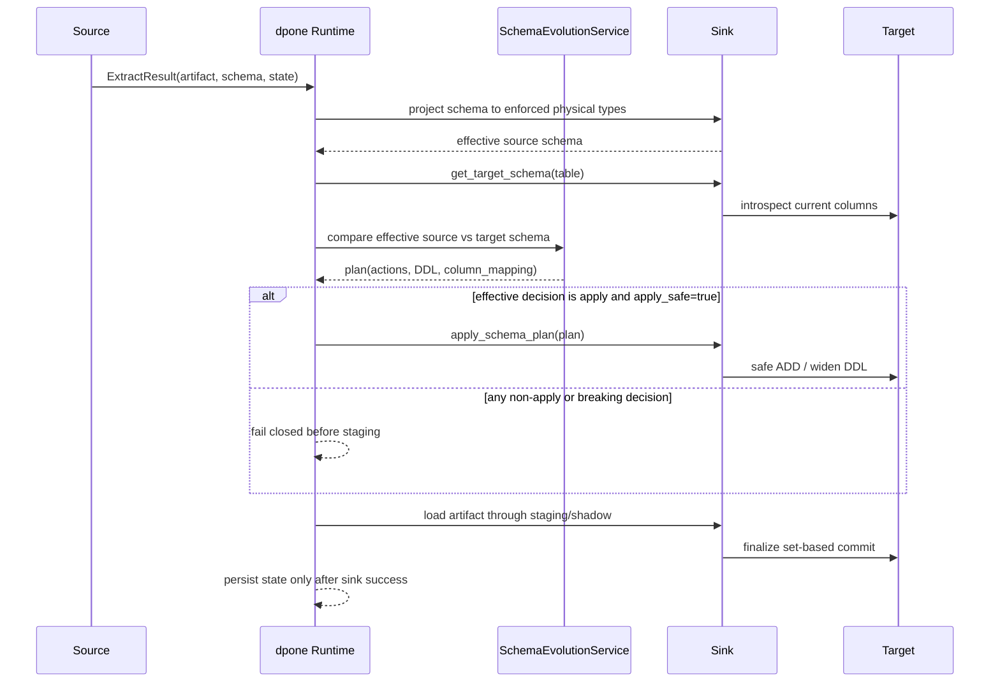

# Schema Evolution

`dpone` applies safe schema evolution automatically before every staging-first load. For low-lock DDL governance, lock budgets, ledger artifacts, and expand-contract workflows, see [Online schema evolution](online-schema-evolution.md). For planned renames, use [Schema Identity](schema-identity.md) so semantic aliases are resolved before name-based schema evolution. The goal is to let routine source drift move forward without breaking production pipelines, while still stopping on changes that can silently corrupt data.

Default runtime policy:

```yaml
sink:
  options:
    schema_evolution:
      enabled: true
      mode: widening
      apply_safe: true
      on_breaking: fail
      target_nullability: strict
      on_type_change: fail
      new_column_prefix: "__dpone__nc__"
```

To turn it off for a pipeline:

```yaml
sink:
  options:
    schema_evolution.enabled: false
```

Use the expanded form in normal manifests:

```yaml
sink:
  options:
    schema_evolution:
      enabled: false
```

## Runtime flow



## What happens before load

1. The source returns `ExtractResult.schema`.
2. A sink with an enforced physical projection resolves the exact types its
   staging and target path will validate. Sinks without that capability keep
   the source-native schema unchanged.
3. The sink introspects the current target table schema.
4. `SchemaEvolutionService` compares the effective source schema with the
   target through `SchemaComparator`.
5. Safe DDL is applied before staging is created.
6. If a type-change mapping is configured, source rows are remapped before sink load.
7. The normal staging-first strategy continues.

For MSSQL, an explicit
`physical_design.columns.<column>.target_type.mssql` is accepted as the desired
schema-evolution type only because native staging validates every value before
business-table DML. Bounded text and binary use length and round-trip guards;
numeric, temporal, or otherwise structurally lossy narrowing fails before
staging or target mutation. The override is not a drift waiver: if the
observed target type differs from it, normal fail-closed schema evolution still
blocks the load.

Only a governed `apply` decision reaches steps 5-7. `notify`, `freeze`,
`ignore`, `quarantine`, `plan_only`, `manual_approval`, `fail`, and
`disable_pipeline` stop before target DDL/DML even for a nullable
metadata-only `ADD COLUMN`. See [Finite fail-closed policy](online-schema-evolution.md#finite-fail-closed-policy)
for the complete precedence and missing-target-table behavior.

This means schema evolution never writes data directly into the final target table. Data still flows through staging/shadow paths implemented by each sink.

## Safe vs breaking changes

Safe by default:

| Change | Runtime action |
| --- | --- |
| New nullable source column | `ALTER TABLE ADD COLUMN`, then load into staging with the new column |
| Safe numeric/string widening | `ALTER/ MODIFY COLUMN` where the dialect supports it |
| Existing generated column for type change | Reuse it and route source values there |
| Technical columns | Managed by sink/reconciliation strategy |

Breaking by default:

| Change | Why it stops |
| --- | --- |
| Source column removed | Could be a real drop or rename; dpone cannot infer intent safely |
| Rename without Schema Identity | Looks like drop + add; configure `schema_identity` aliases for planned rename lifecycle |
| Narrowing | Can truncate/overflow data |
| Nullable -> not-null without default | Existing target rows can violate it |
| Incompatible type change | Can corrupt values unless explicitly routed to a generated column |
| Source column starting with `__dpone__` | Reserved framework namespace |

### Existing nullable MSSQL targets

For a legacy MSSQL target that is intentionally nullable while the current
source projection is non-null, use this narrowly scoped, explicit exception:

```yaml
sink:
  options:
    schema_evolution:
      target_nullability: accept_existing_nullable
```

It accepts only the direction `source NOT NULL -> existing target NULL` and
produces no `ALTER TABLE`. It does not permit nullable source values in a
`NOT NULL` target, type/collation changes, missing columns, or a disabled
schema-evolution policy. Use it only while the nullable target contract is
intentional; the default `strict` remains fail-closed.

## Incompatible type changes with generated columns

If a source column changes type incompatibly, set:

```yaml
sink:
  options:
    schema_evolution:
      on_type_change: new_column
```

Example:

| Source | Target before | Target after |
| --- | --- | --- |
| `amount nvarchar(100)` | `amount int` | `amount int`, `__dpone__nc__amount nvarchar(100)` |

Runtime behavior:

1. The original target column is not overwritten.
2. `__dpone__nc__<original_column_name>` is added as nullable.
3. Source values from `amount` are written into `__dpone__nc__amount`.
4. Downstream consumers can migrate at their own pace.
5. After migration, an operator can manually rename/drop columns during a planned change window.

If the generated column already exists with the same type, dpone reuses it. If it exists with a different type, the load fails.

When a rename and incompatible type change happen together, Schema Identity
runs first. The generated column uses the canonical name:
`__dpone__nc__<canonical_column>`.

## Framework-generated companion columns

`__dpone__*` remains a reserved framework namespace. Source columns that start
with `__dpone__` fail by default unless they are known framework-generated
columns. This prevents user data from accidentally colliding with runtime
metadata.

One important generated family is temporal offset fidelity:

```yaml
source:
  options:
    type_fidelity:
      temporal:
        offset_timestamp:
          mode: preserve_offset
```

For every offset-aware source column, dpone adds
`__dpone__tz_offset_minutes__<column>` as a nullable/safe companion column. The
normal schema evolution flow adds that column before staging. If the companion
column already exists with an incompatible type, the load fails before data is
written. If `schema_evolution.enabled: false`, create the companion column
manually or choose `utc_instant`, `fixed_timezone`, or `preserve_text`.

## CLI planning

Use the same planner outside runtime:

```bash
dpone schema plan \
  --source source-columns.json \
  --target target-columns.json \
  --table landing.orders \
  --dialect postgres \
  --mode widening \
  --on-type-change new_column \
  --format json
```

Supported dialects:

- `mssql`
- `postgres`
- `clickhouse`
- `bigquery`

Column JSON shape:

```json
[
  {"name": "id", "dtype": "bigint", "nullable": false},
  {"name": "amount", "dtype": "numeric(18,2)", "nullable": true}
]
```

When a plan reports type changes for a cross-system load, run the explain view
before changing manifests. It joins the schema comparator with the source -> sink
type matrix:

```bash
dpone schema explain \
  --source source-columns.json \
  --target target-columns.json \
  --source-system mssql \
  --sink-system clickhouse \
  --format md
```

Use this when a target column is semantically correct but written in target
dialect form. For example, MSSQL `int nullable` is expected to match ClickHouse
`Nullable(Int32)`, and MSSQL `nvarchar(510) nullable` is expected to match
ClickHouse `Nullable(String)`. The explain output shows:

- raw comparator equality;
- pair-specific expected target type;
- whether the current target matches the profile;
- the runbook or diagnostic reason.

If `matrix_matches_target=true`, the issue is usually a missing type profile or
stale plan artifact rather than a real breaking schema change. If it is false,
follow the expand-contract or explicit `schema_contract` runbook for the
affected column.

## Source -> sink matrix

Schema evolution is sink-side after extraction, so the same policy works for each source. The target dialect controls DDL and type mapping.

For production implementation details, use the dedicated [Source -> sink matrix](source-sink-matrix.md)
index. It links to one guide per supported source -> sink combination. Use
[Type mapping matrix](type-mapping-matrix.md) for the cross-system type conversion
defaults and caveats.

| Flow | Safe add column | Widening | Incompatible type change | Notes |
| --- | --- | --- | --- | --- |
| postgres -> mssql | Auto `ALTER TABLE ADD` | Auto where MSSQL type widening is supported | Fail or `__dpone__nc__*` | Best for high-throughput Postgres COPY -> bcp loads |
| postgres -> postgres | Auto `ADD COLUMN` | Auto `ALTER COLUMN TYPE` | Fail or `__dpone__nc__*` | Prefer explicit maintenance window for narrowing |
| postgres -> clickhouse | Auto `ADD COLUMN` | Auto `MODIFY COLUMN` for safe widening | Fail or `__dpone__nc__*` | Full/replace still use staging/shadow paths |
| postgres -> bigquery | Auto schema field addition | Auto supported `ALTER COLUMN SET DATA TYPE` | Fail or `__dpone__nc__*` | BigQuery limits some nested/repeated changes |
| mssql -> mssql | Auto `ALTER TABLE ADD` | Auto where supported | Fail or `__dpone__nc__*` | Same-DB internal query path remains supported |
| mssql -> postgres | Auto `ADD COLUMN` | Auto `ALTER COLUMN TYPE` | Fail or `__dpone__nc__*` | Watch datetime/uniqueidentifier mappings |
| mssql -> clickhouse | Auto `ADD COLUMN` | Auto `MODIFY COLUMN` | Fail or `__dpone__nc__*` | Native TSV/client ingest keeps column order |
| mssql -> bigquery | Auto schema field addition | Auto supported widening | Fail or `__dpone__nc__*` | Prefer string-safe landing for sql_variant-like fields |
| clickhouse -> mssql | Auto `ALTER TABLE ADD` | Auto where `clickhouse_to_mssql_landing_v1` proves compatibility | Fail or `__dpone__nc__*` | Arrays/nested/enums/high-precision values require explicit `schema_contract`; incremental event loads need an explicit complete replacement window, because a target-derived cursor is not a safe source boundary |
| clickhouse -> postgres | Auto `ADD COLUMN` | Auto `ALTER COLUMN TYPE` | Fail or `__dpone__nc__*` | LowCardinality/Nullable wrappers are normalized by source schema |
| clickhouse -> clickhouse | Auto `ADD COLUMN` | Auto `MODIFY COLUMN` | Fail or `__dpone__nc__*` | No mutations are used for load or reconciliation paths |
| clickhouse -> bigquery | Auto schema field addition | Auto supported widening | Fail or `__dpone__nc__*` | Parquet/GCS paths may need explicit nested type handling |
| api -> mssql | Auto `ALTER TABLE ADD` | Auto where supported | Fail or `__dpone__nc__*` | Keep REST `columns` explicit for predictable DDL |
| api -> postgres | Auto `ADD COLUMN` | Auto `ALTER COLUMN TYPE` | Fail or `__dpone__nc__*` | JSON payloads can be typed as `jsonb` or `text` |
| api -> clickhouse | Auto `ADD COLUMN` | Auto `MODIFY COLUMN` | Fail or `__dpone__nc__*` | Prefer `String` for highly variable fields |
| api -> bigquery | Auto schema field addition | Auto supported widening | Fail or `__dpone__nc__*` | BigQuery JSON is useful for semi-structured payloads |

## Example manifests

Postgres -> MSSQL with default safe evolution:

```yaml
source:
  type: postgres
  connection_id: postgres_source
  table: {schema: public, name: orders}

sink:
  type: mssql
  connection_id: mssql_dwh
  table: {schema: landing, name: orders}
  strategy: {mode: incremental_merge}
  options:
    schema_evolution:
      enabled: true
      mode: widening
```

MSSQL -> ClickHouse with generated-column type-change handling:

```yaml
source:
  type: mssql
  connection_id: mssql_source
  table: {schema: dbo, name: orders}

sink:
  type: clickhouse
  connection_id: clickhouse_dwh
  table: {schema: landing, name: orders}
  strategy: {mode: incremental_append}
  options:
    schema_evolution:
      on_type_change: new_column
```

REST/API -> BigQuery in plan-only runtime mode:

```yaml
source:
  type: api
  api_type: rest
  options:
    resource: orders
    columns:
      - {name: id, type: bigint}
      - {name: payload, type: json}

sink:
  type: bigquery
  connection_id: bq_dwh
  table: {schema: landing_api, name: orders}
  strategy: {mode: full_refresh}
  options:
    schema_evolution:
      apply_safe: false
```

With `apply_safe: false`, runtime fails before loading when safe DDL is needed. Use this in CI/preflight jobs when you want a plan but do not want the runner to mutate schemas.

## Runbooks

### New column appears in source

1. Confirm the new column is expected.
2. Keep `schema_evolution.enabled: true`.
3. Let dpone add it automatically if nullable/default-safe.
4. If the column is required/non-null, add it manually with a default or make the source expose it nullable first.

### Source type widened

1. Run `dpone schema plan` with the target dialect.
2. If the plan shows `type_widen`, allow runtime to apply it.
3. For BigQuery and ClickHouse, confirm the target engine supports the planned DDL for that concrete type.
4. Re-run the pipeline and check normal row-count reconciliation.

### Source type changed incompatibly

1. Keep default `on_type_change: fail` if downstream consumers must not see contract drift.
2. Use `on_type_change: new_column` if you want ingestion to continue safely.
3. Update downstream models to read `__dpone__nc__<column>`.
4. During a planned migration, backfill/rename/drop manually.
5. Remove the generated-column exception only after downstream consumers are migrated.

### Column disappeared

1. Treat it as possible rename/drop.
2. Stop the pipeline on the default failure.
3. Check source DDL/change request.
4. If it is a rename, add a transform/source alias or manual migration.
5. If it is a real drop, schedule target cleanup manually.

### Nullability changed

1. Nullable -> not-null is not auto-applied unless a default/backfill is planned.
2. Add a default or backfill existing target rows.
3. Apply the not-null constraint manually in a maintenance window.

### Reserved `__dpone__` source column

1. Rename the source column or alias it in extraction.
2. If this is a controlled framework-to-framework transfer, set `allow_reserved_dpone_columns: true` explicitly.
3. Document why the exception exists.

## Troubleshooting

| Symptom | Likely cause | Response |
| --- | --- | --- |
| Load fails with breaking schema evolution changes | Drop/rename/narrowing/type change detected | Inspect plan JSON and follow the matching runbook |
| DDL permission denied | Runner lacks `ALTER TABLE` or dataset update rights | Grant least-privilege schema evolution permissions or set `apply_safe: false` for preflight only |
| ClickHouse DDL fails | Engine/type does not support planned `MODIFY COLUMN` | Use generated column mode or manual migration |
| BigQuery schema update fails | BigQuery does not support that exact change | Add a generated column or rebuild through a planned shadow table |
| Existing generated column has wrong type | Prior incompatible change used a different type | Create a manual migration plan; dpone will not guess suffixes |
| Target has framework columns missing from source | Expected for `meta__*` and `__dpone__*` | These are ignored as target-only columns |

## Developer notes

- `SchemaComparator` is pure and belongs to readiness/planning.
- `SchemaEvolutionService` is runtime orchestration and runs before `sink.load()`.
- Sinks expose `get_target_schema(load_config)` and `apply_schema_plan(load_config, plan)`.
- Load strategies should not implement schema drift logic themselves.
- New sink implementations should add contract tests for DDL rendering, target introspection, and payload column remapping.

## Kafka schema evolution notes

Kafka sink participates in schema evolution only when Schema Registry is enabled. With `schema_registry.auto_register_schemas: true`, dpone registers safe evolved value schemas before producing. Without Schema Registry, Kafka target schema evolution is intentionally a no-op; downstream systems receive inferred source schema through the normal `ExtractResult.schema` contract.
