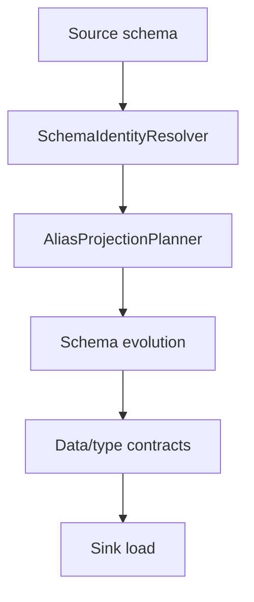

# Schema Identity

`schema_identity` is an opt-in contract for semantic column identity, rename
aliases, and deprecation windows. It runs before schema evolution so a planned
rename does not look like `drop old + add new`.

## Configuration

```yaml
sink:
  options:
    schema_identity:
      enabled: true
      mode: enforce
      rename_detection: explicit
      expired_alias: block
      rename:
        strategy: expand_contract
      columns:
        customer_id:
          id: orders.customer_id
          aliases:
            - name: client_id
              remove_after: 2026-09-01
              compatibility: read_alias
```

Defaults are conservative:

| Option | Default | Meaning |
| --- | --- | --- |
| `enabled` | `false` | No behavior changes unless configured. |
| `rename.strategy` | `expand_contract` | Add canonical column, backfill, validate, then contract old alias. |
| `expired_alias` | `block` | Stop loads that still use aliases past their removal date. |
| `rename_detection` | `explicit` | Suggestions may be shown, but rename is never applied without an alias. |

## Runtime Flow



`SchemaIdentityResolver` maps observed names to canonical names. If source emits
`client_id` and the manifest declares it as an alias of `customer_id`, the
resolver emits the `rename_alias` action and the canonical schema passed to
schema evolution contains `customer_id`.

`AliasProjectionPlanner` projects row data before data contract validation:

| Input | Output |
| --- | --- |
| `{"client_id": 42}` | `{"customer_id": 42}` |
| `{"client_id": 42, "customer_id": 42}` | accepted |
| `{"client_id": 42, "customer_id": 43}` | blocked with `schema_identity.alias_value_conflict` |

## Rename Strategies

| Strategy | Behavior |
| --- | --- |
| `expand_contract` | Adds the canonical column, backfills from the alias, validates equality, and drops the old alias in contract phase. |
| `runtime_alias` | Performs runtime projection only; no target DDL is generated. |
| `direct_rename` | Unsafe escape hatch. It renders target rename DDL where supported and emits a downstream warning. |

`direct_rename` is not the default because downstream consumers can break:
views, BI queries, dbt models, materialized views, CDC readers, and manual SQL
may still reference the old name.

## Rename Versus `__dpone__nc__`

`schema_identity` answers: “is this the same semantic column?”

`__dpone__nc__<column>` answers: “where can incompatible values go without
corrupting the existing target column?”

Pure rename does not create `__dpone__nc__`.

When rename and incompatible type change happen together, identity runs first:

```text
target: client_id Int64
source: customer_id String
alias: client_id -> customer_id
```

With `on_type_change: new_column`, dpone creates
`__dpone__nc__<canonical_column>`, for example
`__dpone__nc__customer_id`, not `__dpone__nc__client_id`.

## CLI

Plan identity decisions without changing the target:

```bash
dpone schema identity plan \
  --manifest manifests/orders.yaml \
  --source source-schema.json \
  --actual actual-clickhouse-physical.json \
  --format json
```

The output includes:

- `identity_decisions`;
- `canonical_source_schema`;
- `blockers`;
- `warnings`;
- rename migration recommendations.

`dpone schema migration plan` embeds the same identity decisions into the
migration pack so review, approval, and apply flows have one evidence object.

## Best Practices

1. Use stable ids such as `orders.customer_id`.
2. Prefer `expand_contract` for production renames.
3. Use `runtime_alias` only as a temporary compatibility window.
4. Use `direct_rename` only with explicit approval and downstream impact review.
5. Set `remove_after` for every alias and keep deprecation windows short.

## Industrial Comparison

| System | Pattern | dpone behavior |
| --- | --- | --- |
| dlt | Schema evolution/contracts and nested normalization. | Adds stable semantic identity and rename lifecycle before name-based evolution. |
| Airbyte | Pauses/reviews breaking schema changes. | Keeps safe review UX and adds machine-readable rename decisions. |
| Fivetran | Managed schema settings and type locking. | Adds self-service contract-as-code with alias/backfill/contract evidence. |
| Informatica | Dynamic schema and mapping tasks. | Makes mapping decisions portable, testable, and visible in run evidence. |
| Pentaho | Metadata injection and SQL script flexibility. | Keeps metadata-driven reuse without making raw SQL the primary UX. |
