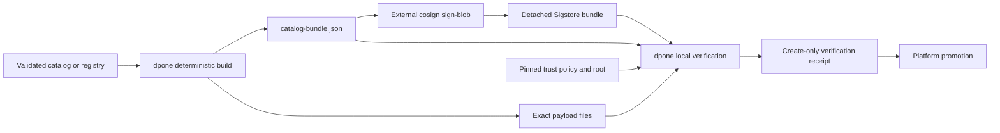

# Signed catalog bundles

Signed catalog bundles let a platform team prove who published an exact recipe
catalog or connection registry. They are a promotion control, not a new
pipeline authoring format. A data engineer still uses the ordinary recipe or
`connection_ref`; signing stays in platform CI.

## Trust boundary



dpone never signs a production catalog and never receives a signing key or OIDC
token. Verification runs in CI, the cache materializer, or another build-plane
process. Airflow DAG parsing, the KPO runtime, and credential resolution do not
fetch catalogs or invoke cosign.

## Build a recipe catalog bundle

First validate the configured catalog:

```bash
dpone recipe validate
```

Then build the complete pinned closure:

```bash
dpone supply-chain catalog-bundle-build \
  --kind recipe_catalog \
  --source platform/recipes/catalog.yaml \
  --bundle-root .dpone/catalog-bundles \
  --publisher-id data-platform-recipes \
  --format json
```

The source must be the catalog configured in `dpone.yaml`. The bundle contains
the exact catalog plus every recipe, profile, and component reachable from its
pins. Repeating the build with identical bytes returns the same `bundle_id` and
`status: no_op`. Existing different bytes are never overwritten.

## Build a connection registry bundle

```bash
dpone supply-chain catalog-bundle-build \
  --kind connection_registry \
  --source platform/connection-registries/prod.yaml \
  --bundle-root .dpone/catalog-bundles \
  --publisher-id data-platform-connections \
  --environment prod \
  --format json
```

The registry is schema-validated without resolving credentials. Literal secret
fields are rejected. Vault paths remain restricted platform metadata and do not
appear in ordinary command output, serialized DAGs, or workload packs.

## Sign outside dpone

Sign only the exact generated manifest:

```bash
cosign sign-blob --yes \
  --bundle catalog-bundle.sigstore.json \
  .dpone/catalog-bundles/sha256-*/catalog-bundle.json
```

Use a protected CI identity. Do not use the local HMAC helper as a production
catalog identity.

## Verify before promotion

```bash
dpone supply-chain catalog-bundle-verify \
  --bundle-dir .dpone/catalog-bundles/sha256-... \
  --sigstore-bundle catalog-bundle.sigstore.json \
  --policy platform/catalog-trust-policy.yaml \
  --trusted-root platform/sigstore/trusted-root.json \
  --output .dpone/catalog-verification/receipt.json \
  --format json
```

Verification checks the manifest identity, completion marker, exact inventory,
path confinement, size and digest limits, publisher/environment allowlists,
trusted-root digest, exact certificate identity and issuer, certified cosign
version, signature, and catalog semantics. Cryptographic success alone is not
enough.

Decisions are:

- `verified`: all local, cryptographic, policy, and semantic checks passed;
- `invalid`: bytes, policy, signature, or semantic contract contradicts the
  expected bundle;
- `unverified`: the certified external verifier is unavailable.

Only `verified` may be promoted. The receipt is create-only. Keep the detached
Sigstore bundle and pinned trusted root outside the signed payload.

## Directory contract

```text
.dpone/catalog-bundles/
  sha256-<content digest>/
    catalog-bundle.json
    payload/
      catalog.yaml
      artifacts/<digest>.yaml
    _SUCCESS
```

Bundles are directories, not archives. This avoids extraction traversal and
decompression bombs. v1 permits at most 1,001 payload files, 4 MiB per file,
and 64 MiB total. Catalog control parsing remains bounded at 32,000 tokens and
16,000 nodes so the declared maximum inventory is representable. Symlinks,
devices, unlisted files, duplicate paths, and mutable aliases are rejected.

## Recovery

Never repair a published bundle in place. For an incomplete or corrupt local
copy, discard it and materialize the same bundle ID again. For an intentional
content change, build and sign a new bundle ID. For verifier unavailability,
restore the certified cosign binary and retry with the same immutable bytes.

See [extension conformance](extension-conformance.md) to use the verification
receipt as one exact release-evidence input.
