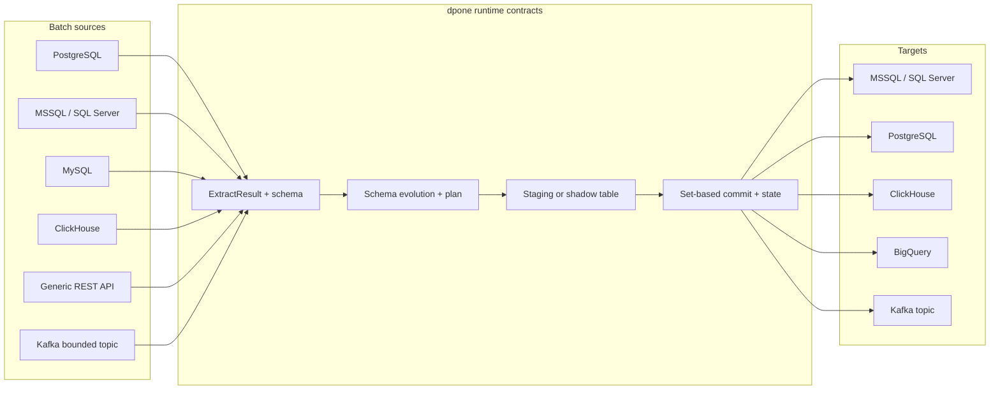

# Source -> Sink Matrix

This matrix is the public entrypoint for supported dpone source -> sink documentation. Each row links to a dedicated guide with install extras, manifest shape, supported strategies, staging policy, schema evolution behavior, delete/reconciliation notes, and type mapping policy.

Start from your route (source → sink): after you pick a matrix row for Airflow
self-service, scaffold it with a built-in recipe on
[First Airflow DAG](getting-started/first-airflow-dag.md).

Use [Route certification pack](route-certification-pack.md) and
[Route readiness](route-readiness.md) when a supported row needs a
machine-readable go/no-go report for a specific strategy and evidence bundle.
Use [Route certification matrix](route-certification-matrix.md) when support
must be stated for the exact transport, schema-evolution mode, and
Airflow/runtime mode. A source/sink row alone is not a production claim.
Use [Route execution ledger](route-execution-ledger.md) when the same route also
needs idempotent retry, lease fencing, resume, repair, resync, or state-commit
evidence.
Use [Route state promotion](route-state-promotion.md) when a route must advance
source state only after a matching sink commit receipt and route execution
ledger.
Use [Route live certification](route-live-certification.md) when Docker-live or
vendor-live artifacts must be normalized into `route_live_evidence_bundle`
before release review.
Use [Route certify](route-certify.md) when refresh execute, snapshot capture,
exact verification, readiness, and release evidence must become one
`route_certification_bundle`.
Use [Route certify release](route-certify-release.md) when all first-class route
bundles must be aggregated into a release-level go/no-go report with
`route_certification_release.json`.
Use [Route release finalize](route-release-finalize.md) when release managers
need bundle discovery, freshness, provenance, regression, and route history
checks before tagging.
Use [Route release candidate orchestrator](route-rc-orchestrator.md) when the
whole route release train must be captured in one `route_rc_orchestration`
receipt.
Use [Route release candidate executor](route-rc-executor.md) when that receipt
must be dry-run checked or explicitly executed into a `route_rc_execution`
receipt.
Use [Route release gate](route-release-gate.md) when those artifacts must be
combined into one release-candidate go/no-go receipt.
Use [Route Conformance Lab](route-conformance-lab.md) when `postgres -> mssql`
or `mssql -> clickhouse` needs 10,000-row, 200-column `--adapter vendor_live`
or `--adapter docker` evidence before release.

## Visual overview

## Supported source and sink families

Sources:

- PostgreSQL
- MSSQL / SQL Server
- MySQL
- ClickHouse
- Generic REST API
- Kafka bounded batch topic

Sinks:

- MSSQL / SQL Server
- PostgreSQL
- ClickHouse
- BigQuery
- Kafka topic

## Matrix

| Source | Sink | Guide | Status | Install |
| --- | --- | --- | --- | --- |
| PostgreSQL | MSSQL / SQL Server | [postgres -> mssql](source-sink/postgres-to-mssql.md) | Batch ETL supported (wide vendor-live for FR/replace/partition_replace/snapshot_diff/scd2/backfill; XMin key-reconciled merge; unsafe column append/merge fail closed; bytea via hex character BCP) | pip install "dpone[mssql,postgres]" |
| MySQL | MSSQL / SQL Server | [mysql -> mssql](source-sink/mysql-to-mssql.md) | Complete full/bounded-replacement batch ETL supported (wide vendor-live mechanics; BLOB via hex character BCP); target-derived single-column incremental cursors fail closed. | pip install "dpone[mysql,mssql]" |
| MySQL | PostgreSQL | [mysql -> postgres](source-sink/mysql-to-postgres.md) | Batch ETL supported | pip install "dpone[mysql,postgres]" |
| MySQL | ClickHouse | [mysql -> clickhouse](source-sink/mysql-to-clickhouse.md) | Batch ETL supported (wide vendor-live for FR/append/merge/replace/partition_replace/snapshot_diff/scd2/backfill) | pip install "dpone[mysql,clickhouse]" |
| MySQL | BigQuery | [mysql -> bigquery](source-sink/mysql-to-bigquery.md) | Batch ETL supported | pip install "dpone[mysql,gcp]" |
| MySQL | Kafka topic | [mysql -> kafka](source-sink/mysql-to-kafka.md) | Batch/event-log supported | pip install "dpone[mysql,kafka]" |
| PostgreSQL | PostgreSQL | [postgres -> postgres](source-sink/postgres-to-postgres.md) | Batch ETL supported (wide vendor-live for FR/append/merge/replace/partition_replace/snapshot_diff/scd2/backfill) | pip install "dpone[postgres]" |
| PostgreSQL | ClickHouse | [postgres -> clickhouse](source-sink/postgres-to-clickhouse.md) | Batch ETL supported (wide vendor-live for FR/append/merge/replace/partition_replace/snapshot_diff/scd2/backfill) | pip install "dpone[clickhouse,postgres]" |
| PostgreSQL | BigQuery | [postgres -> bigquery](source-sink/postgres-to-bigquery.md) | Batch ETL supported (wide vendor-live for FR/append/merge/replace/partition_replace/snapshot_diff/scd2/backfill) | pip install "dpone[gcp,postgres]" |
| PostgreSQL | Kafka topic | [postgres -> kafka](source-sink/postgres-to-kafka.md) | Batch/event-log supported (wide vendor-live for FR/append/merge/replace/snapshot_diff/backfill-merge; partition_replace/scd2 N/A) | pip install "dpone[kafka,postgres]" |
| MSSQL / SQL Server | MSSQL / SQL Server | [mssql -> mssql](source-sink/mssql-to-mssql.md) | Complete full/bounded-replacement batch ETL supported (wide vendor-live mechanics; varbinary via hex character BCP); target-derived single-column incremental cursors fail closed. | pip install "dpone[mssql]" |
| MSSQL / SQL Server | PostgreSQL | [mssql -> postgres](source-sink/mssql-to-postgres.md) | Batch ETL supported (wide vendor-live for FR/append/merge/replace/partition_replace/snapshot_diff/scd2/backfill; CSV COPY via `mssql_to_postgres_native_v1`) | pip install "dpone[mssql,postgres]" |
| MSSQL / SQL Server | ClickHouse | [mssql -> clickhouse](source-sink/mssql-to-clickhouse.md) | Batch ETL supported (wide local-live for FR/append/merge/replace/partition_replace/snapshot_diff/scd2/backfill; BCP-native required + Python-reference scalar/temporal matrix; Parquet S3-compatible pull exact hash; production certification remains environment-specific); live CDC runtime adapters, CDC poison quarantine, replay dedupe, CDC compare and repair, CDC retention gap auto-resync, CDC serving materialization, typed schema drift checks, and parse quarantine profiled. The bounded dbt semantic-refresh V2 cell is a 0.74 local diagnostic preview; production activation is unavailable because its retention controller is not shipped. | pip install "dpone[clickhouse,mssql]" |
| MSSQL / SQL Server | BigQuery | [mssql -> bigquery](source-sink/mssql-to-bigquery.md) | Batch ETL supported (wide vendor-live for FR/append/merge/replace/partition_replace/snapshot_diff/scd2/backfill; `mssql_to_bigquery_analytics_v1`) | pip install "dpone[gcp,mssql]" |
| MSSQL / SQL Server | Kafka topic | [mssql -> kafka](source-sink/mssql-to-kafka.md) | Batch/event-log supported (wide vendor-live for FR/append/merge/replace/snapshot_diff/backfill-merge; partition_replace/scd2 N/A) | pip install "dpone[kafka,mssql]" |
| ClickHouse | MSSQL / SQL Server | [clickhouse -> mssql](source-sink/clickhouse-to-mssql.md) | Governed complete full/bounded-replacement batch ETL supported. Target-derived single-column incremental cursors fail closed before I/O; certified type profile, MSSQL bcp staging, route readiness evidence, and source/target acceptance remain required. | pip install "dpone[clickhouse,mssql]" |
| ClickHouse | PostgreSQL | [clickhouse -> postgres](source-sink/clickhouse-to-postgres.md) | Batch ETL supported | pip install "dpone[clickhouse,postgres]" |
| ClickHouse | ClickHouse | [clickhouse -> clickhouse](source-sink/clickhouse-to-clickhouse.md) | Batch ETL supported | pip install "dpone[clickhouse]" |
| ClickHouse | BigQuery | [clickhouse -> bigquery](source-sink/clickhouse-to-bigquery.md) | Batch ETL supported | pip install "dpone[clickhouse,gcp]" |
| ClickHouse | Kafka topic | [clickhouse -> kafka](source-sink/clickhouse-to-kafka.md) | Batch/event-log supported | pip install "dpone[clickhouse,kafka]" |
| Generic REST API | MSSQL / SQL Server | [api -> mssql](source-sink/api-to-mssql.md) | Batch ETL supported | pip install "dpone[mssql]" |
| Generic REST API | PostgreSQL | [api -> postgres](source-sink/api-to-postgres.md) | Batch ETL supported | pip install "dpone[postgres]" |
| Generic REST API | ClickHouse | [api -> clickhouse](source-sink/api-to-clickhouse.md) | Batch ETL supported | pip install "dpone[clickhouse]" |
| Generic REST API | BigQuery | [api -> bigquery](source-sink/api-to-bigquery.md) | Batch ETL supported | pip install "dpone[gcp]" |
| Generic REST API | Kafka topic | [api -> kafka](source-sink/api-to-kafka.md) | Batch/event-log supported | pip install "dpone[kafka]" |
| Kafka batch topic | MSSQL / SQL Server | [kafka -> mssql](source-sink/kafka-to-mssql.md) | Batch/event-log supported | pip install "dpone[kafka,mssql]" |
| Kafka batch topic | PostgreSQL | [kafka -> postgres](source-sink/kafka-to-postgres.md) | Batch/event-log supported | pip install "dpone[kafka,postgres]" |
| Kafka batch topic | ClickHouse | [kafka -> clickhouse](source-sink/kafka-to-clickhouse.md) | Batch/event-log supported | pip install "dpone[clickhouse,kafka]" |
| Kafka batch topic | BigQuery | [kafka -> bigquery](source-sink/kafka-to-bigquery.md) | Batch/event-log supported | pip install "dpone[gcp,kafka]" |
| Kafka batch topic | Kafka topic | [kafka -> kafka](source-sink/kafka-to-kafka.md) | Batch/event-log supported | pip install "dpone[kafka]" |

## Production rules that apply to every guide

- Loads are staging-first. Heavy operations must happen in staging/shadow tables, not directly in final target tables.
- Automatic schema evolution is enabled by default and fail-closed for breaking changes.
- Type conversion must be explicit when vendor-specific types are involved.
- State is advanced only after sink commit succeeds.
- Physical deletes require CDC/tombstones or snapshot reconciliation; they are never inferred silently from incremental cursors.
- Kafka is batch ETL/event-log integration in this release, not an infinite streaming runtime.

## Type mapping

Use [Type mapping matrix](type-mapping-matrix.md) for cross-system type conversion policy and per-family caveats.

## Related docs

- [Schema evolution](schema-evolution.md) explains automatic target DDL and `__dpone__nc__*` generated columns.
- [Postgres XMin incremental strategy](postgres-xmin.md) is the detailed runbook for Postgres transaction-ID based incremental extraction.
- [Type mapping matrix](type-mapping-matrix.md) documents source -> sink type conversion policy.
- [Load strategies](load-strategies.md) is the canonical guide for `full_refresh`, `incremental_append`, `incremental_merge`/upsert, `replace`, `partition_replace`, `snapshot_diff`, `scd2`, `cdc_apply`, and `backfill` semantics.
- [Route bootstrap and doctor](route-bootstrap-doctor.md) explains `connection-doctor`, `source-discover`, `route-bootstrap`, and `route-doctor` for self-service route onboarding before readiness.
- [Route Conformance Lab](route-conformance-lab.md) explains `route-conformance` exact verification, 10,000-row/200-column synthetic datasets, typed hash evidence, and release gates.
- [Route certification pack](route-certification-pack.md) generates normalized evidence bundles for one route.
- [Route readiness](route-readiness.md) explains the matrix-driven evidence gate for one source -> sink -> strategy route.
- [Route execution ledger](route-execution-ledger.md) records idempotent route execution and commit protocol evidence.
- [Route state promotion](route-state-promotion.md) records commit receipt and safe source-state advancement evidence.
- [Route live certification](route-live-certification.md) builds Docker-live/vendor-live `route_live_evidence_bundle` receipts for critical routes.
- [Route certify](route-certify.md) builds the final route release certification bundle and promotion gate.
- [Route certify release](route-certify-release.md) builds the final release-level route bundle gate.
- [Route release finalize](route-release-finalize.md) discovers route bundles and blocks stale, mismatched, or regressed route release evidence.
- [Route release candidate orchestrator](route-rc-orchestrator.md) composes route certification, live evidence, release gate, and release evidence pack into `route_rc_orchestration`.
- [Route release gate](route-release-gate.md) combines route evidence into one release-candidate go/no-go receipt.
- [CDC apply certification](cdc-apply-certification.md) generates fixture-based CDC apply, delete, typed hash, and embedded handoff evidence.
- [CDC snapshot handoff](cdc-handoff.md) explains CDC apply evidence for snapshot-to-stream cutover, starting with `mssql -> clickhouse`.
- [CDC observability evidence](cdc-observability-evidence.md) adds lag, freshness, retention, offset, replay, and throughput SLO evidence for CDC streams.
- [CDC recovery evidence](cdc-recovery-evidence.md) adds fault-injection recovery evidence for restart, replay, offset ordering, partial commit, poison event, and retention pressure.
- [CDC schema evolution evidence](cdc-schema-evolution-evidence.md) adds schema-change capture, compatibility, DDL dry-run, backfill, approval, and offset-ordering evidence for CDC streams.
- [CDC promotion gate](cdc-promotion-gate.md) combines all CDC evidence into final `production_ready` and `promote_offsets` decisions.
- [CDC runtime orchestrator](cdc-runtime-orchestrator.md) runs bounded CDC read -> apply -> durable offset commit ticks for replication-grade streams.
- [CDC poison quarantine and replay](cdc-poison-quarantine.md) adds poison-event classification, quarantine inspection, replay execution, and ClickHouse duplicate replay safety.
- [CDC compare and repair](cdc-compare-repair.md) adds source-to-ClickHouse CDC log current-state consistency checks and bounded repair execution.
- [CDC retention gap auto-resync](cdc-retention-resync.md) adds source retention gap checks, bounded resync plans, and offset-safe resync execution for `mssql -> clickhouse`.
- [CDC live runtime adapters](cdc-live-runtime-adapters.md) add live MSSQL -> ClickHouse readers, ClickHouse CDC apply, and SQL-backed offsets.
- [ClickHouse CDC materialization](cdc-clickhouse-materialization.md) rebuilds current-state serving tables from the ClickHouse append-only CDC log.
- [ClickHouse CDC typed materialization](cdc-clickhouse-typed-materialization.md) rebuilds CDC typed serving materialization tables with declared ClickHouse columns.
