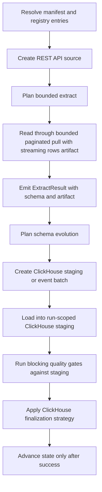

# REST API -> ClickHouse

This guide is a copy/paste-ready starting point for loading data from **REST API** into **ClickHouse** with `dpone`.

## When to use this path

Use this path when REST API is the system of record or ingestion boundary and ClickHouse is the landing, warehouse, event-log, or downstream replication target.

## Copy/paste manifest

```yaml
# yaml-language-server: $schema=../../src/dpone/schema/etl-batch-manifest.schema.json
kind: dpone.batch.v1

defaults:
  name: api_to_clickhouse_example
  source:
    type: api
    api_type: cbr
    options:
      resource: rates
  sink:
    type: clickhouse
    connection_id: clickhouse_analytics
    table:
      schema: analytics
      name: rates
    strategy:
      mode: incremental_append

quality:
  gates:
    - id: source_target_rows
      type: row_count_reconciliation
      severity: error
      tolerance:
        mode: pct
        value: 0.1

schemas:
  api:
    tables:
      - rates
```

Run it locally:

```bash
dpone plan examples/source-sink/api-to-clickhouse.yaml --format md
dpone run examples/source-sink/api-to-clickhouse.yaml
```

The checked source file is `examples/source-sink/api-to-clickhouse.yaml`; CI
compares its parsed YAML with this block. The example uses the official
schema-listed, credential-free `cbr` REST profile. Choose another
schema-listed API profile and its connector-specific options for your provider.

If you change the strategy to `full_refresh` and empty output is invalid,
row-count reconciliation is not enough: it can pass a `0` source / `0` target
comparison. Add an explicit non-empty target gate:

```yaml
quality:
  gates:
    - id: target_min_rows
      type: min_rows
      side: target
      threshold: 1
      severity: error
```

## Supported load strategies

These rows describe public runtime contracts, not certification of this exact
source, sink, transport, schema-evolution mode, and runtime combination.

| Strategy | Status | Notes |
|---|---|---|
| `full_refresh` | Supported | Uses staging first, then applies the target-specific finalization plan. |
| `incremental_append` | Supported | Uses staging first, then applies the target-specific finalization plan. |
| `incremental_merge` | Supported | Default `merge_policy: lightweight_delete_insert`; `shadow_swap` supported; `mutation_delete_insert` is explicit opt-in and non-recommended. |
| `replace` | Supported | Uses staging first, then applies the target-specific finalization plan. |
| `partition_replace` | Supported | Replaces target partitions represented by staging `partition.column`; see Load strategies for native/fallback paths. |
| `snapshot_diff` | Supported | Requires a complete bounded snapshot and `unique_key`; applies the configured diff/delete policy. |

See [Load strategies](../load-strategies.md) for the detailed algorithm for each strategy.
REST cursor or incremental-field state is a source capability, not a load
strategy; it advances only after sink success.

## Runtime algorithm

ClickHouse implements `StagedLoadPort`, so this route records
`governance_finalization=pre_finalize`. Blocking gates evaluate projected
staging rows before target finalization; a failure aborts and cleans staging
without advancing source state. See
[Load governance](../load-governance.md#runtime-lifecycle).



## Strategy behavior

- `full_refresh`: extract the selected source boundary, load into staging, and replace the target according to the target's safe finalization path.
- `incremental_append`: extract only the incremental boundary and append rows through staging or event production.
- `incremental_merge`: load into staging, validate duplicates, then use `lightweight_delete_insert` by default; `shadow_swap` and guarded `mutation_delete_insert` are explicit policies.
- `replace`: reload a bounded predicate window through staging and then atomically replace the matching target slice.
- `snapshot_diff`: compare a complete current source snapshot with the target by `unique_key`, then apply the configured insert, update, and delete policy.
- `partition_replace`: extract a complete partition slice, load it into staging, and replace only partitions represented by `partition.column`.

Snapshot reconciliation is separate from the load strategy. Runtime planning
reports that capability as `reconciliation.mode=snapshot`; in the official
`dpone.batch.v1` authoring schema, enable it with `reconciliation: true`.

## Schema evolution and type mapping

Schema evolution is enabled by default and runs before the staging/final load path:

1. Read source schema from `ExtractResult.schema`.
2. Introspect the ClickHouse target schema.
3. Apply safe additions and widening operations.
4. Fail breaking changes by default.
5. If configured, route incompatible type changes to `__dpone__nc__<column>`.

Use [Schema evolution](../schema-evolution.md) and [Type mapping matrix](../type-mapping-matrix.md) when adding columns or changing source types.

## Runbook

1. Start with `dpone doctor --profile local` and fix missing extras or native clients.
2. Run `dpone plan <manifest> --format md` and review source boundary, staging path, schema evolution, state, and quality gates.
3. Run a small bounded window first.
4. Inspect the run artifact under `.dpone/runs/api_to_clickhouse`.
5. For incremental jobs, verify state before enabling a schedule.
6. For delete-aware jobs, run reconciliation in report-only mode before enabling physical deletes.
7. Promote the manifest through GitOps after the plan and artifact are reviewed.

## Cross-links

- [Source -> sink matrix](../source-sink-matrix.md)
- [Load strategies](../load-strategies.md)
- [Schema evolution](../schema-evolution.md)
- [Type mapping matrix](../type-mapping-matrix.md)
- [Reconciliation and CDC](../cdc.md)
- [Performance guide](../performance.md)

## Type contracts and physical design

This flow supports the shared dpone type-governance stack:

- [Type inference](../type-inference.md) for source metadata, sampled profiling, confidence, and empty string vs `NULL` behavior.
- [Schema contracts](../schema-contracts.md) for explicit logical column types, enforcement modes, and `__dpone__nc__*` variant columns.
- [Physical design](../physical-design.md) for target-specific DDL such as concrete SQL types, indexes, partitioning, compression, ClickHouse `LowCardinality`, and BigQuery clustering.

Use `dpone schema infer --manifest ...` and `dpone schema physical-plan --manifest ...` before enabling new table DDL in production.
