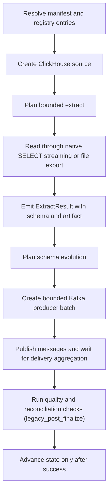

# ClickHouse -> Kafka

This guide is a copy/paste-ready starting point for loading data from **ClickHouse** into **Kafka** with `dpone`.

## When to use this path

Use this path when ClickHouse is the system of record or ingestion boundary and Kafka is the landing, warehouse, event-log, or downstream replication target.

## Copy/paste manifest

```yaml
# yaml-language-server: $schema=../../src/dpone/schema/etl-batch-manifest.schema.json
kind: dpone.batch.v1

defaults:
  name: clickhouse_to_kafka_example
  source:
    type: clickhouse
    connection_id: clickhouse_source
    options:
      batch_size: 50000
      export_format: csv
  sink:
    type: kafka
    connection_id: kafka_target
    topic: dwh.orders
    strategy:
      mode: incremental_append
    options:
      message_format: json
      envelope: dpone
      key:
        mode: hash_row
      delivery:
        mode: at_least_once

quality:
  gates:
    - id: source_target_rows
      type: row_count_reconciliation
      severity: error
      tolerance:
        mode: pct
        value: 0.1

schemas:
  analytics:
    tables:
      - orders
```

Run it locally:

```bash
dpone plan examples/source-sink/clickhouse-to-kafka.yaml --format md
dpone run examples/source-sink/clickhouse-to-kafka.yaml
```

The checked source file is
`examples/source-sink/clickhouse-to-kafka.yaml`; CI compares its parsed YAML
with this block.

If you change the strategy to semantic `full_refresh` publication and empty
output is invalid, row-count reconciliation is not enough: it can pass a
`0` source / `0` target comparison. Add an explicit non-empty target gate:

```yaml
quality:
  gates:
    - id: target_min_rows
      type: min_rows
      side: target
      threshold: 1
      severity: error
```

## Supported load strategies

Kafka is append-only message publication. Strategy names describe event
semantics; they do not mutate existing topic records or swap topic storage.
These rows are runtime contracts, not exact-route certification.

| Strategy | Status | Notes |
|---|---|---|
| `full_refresh` | Event publication | Publishes the bounded snapshot as new messages; existing messages remain. |
| `incremental_append` | Example | Publishes each bounded source row as a new message. |
| `incremental_merge` | Event publication | Publishes keyed upsert/delete events with `merge_policy: event_upsert`. |
| `replace` | Event publication | Publishes replacement-intent events; consumers decide how to materialize them. |
| `partition_replace` | Not supported | Kafka topics are append-only logs; use `incremental_merge` with `merge_policy: event_upsert`. |
| `snapshot_diff` | Event publication | Publishes keyed upsert/delete events derived from a complete source snapshot. |

See [Load strategies](../load-strategies.md) for the detailed algorithm for each strategy.

## Runtime algorithm

This sink does not currently implement `StagedLoadPort`, so this route records
`governance_finalization=legacy_post_finalize`. Blocking gates run only after
messages have been published. A failure prevents source-state advancement but
cannot retract delivered messages; inspect delivery evidence and consumer
idempotency before retrying. See
[Load governance](../load-governance.md#runtime-lifecycle).



## Strategy behavior

- `full_refresh`: publish every row in the bounded snapshot as a new message; existing topic records remain.
- `incremental_append`: publish only the bounded incremental rows as new messages.
- `incremental_merge`: publish keyed upsert/delete events with `merge_policy: event_upsert`; requires `unique_key`.
- `replace`: publish replacement-intent events for a bounded window; no existing message is rewritten.
- `snapshot_diff`: publish keyed upsert/delete events derived from a complete source snapshot.
- `partition_replace`: not supported for Kafka sinks because a topic is an append-only event log.

Snapshot reconciliation is separate from the load strategy. Runtime planning
reports that capability as `reconciliation.mode=snapshot`; in the official
`dpone.batch.v1` authoring schema, enable it with `reconciliation: true`.

## Schema evolution and type mapping

Schema evolution is enabled by default and runs before bounded message publication:

1. Read source schema from `ExtractResult.schema`.
2. Introspect the Kafka target schema.
3. Apply safe additions and widening operations.
4. Fail breaking changes by default.
5. If configured, route incompatible type changes to `__dpone__nc__<column>`.

Use [Schema evolution](../schema-evolution.md) and [Type mapping matrix](../type-mapping-matrix.md) when adding columns or changing source types.

## Runbook

1. Start with `dpone doctor --profile local` and fix missing extras or native clients.
2. Run `dpone plan <manifest> --format md` and review source boundary, publication and delivery path, schema evolution, state, and quality gates.
3. Run a small bounded window first.
4. Inspect the run artifact under `.dpone/runs/clickhouse_to_kafka`.
5. For incremental jobs, verify state before enabling a schedule.
6. For delete-aware event semantics, review keyed tombstone/upsert behavior with consumers before publication.
7. Promote the manifest through GitOps after the plan and artifact are reviewed.

## Cross-links

- [Source -> sink matrix](../source-sink-matrix.md)
- [Load strategies](../load-strategies.md)
- [Schema evolution](../schema-evolution.md)
- [Type mapping matrix](../type-mapping-matrix.md)
- [Reconciliation and CDC](../cdc.md)
- [Performance guide](../performance.md)

## Type contracts and physical design

This flow supports the shared dpone type-governance stack:

- [Type inference](../type-inference.md) for source metadata, sampled profiling, confidence, and empty string vs `NULL` behavior.
- [Schema contracts](../schema-contracts.md) for explicit logical column types, enforcement modes, and `__dpone__nc__*` variant columns.
- [Physical design](../physical-design.md) for target-specific DDL such as concrete SQL types, indexes, partitioning, compression, ClickHouse `LowCardinality`, and BigQuery clustering.

Use `dpone schema infer --manifest ...` and `dpone schema physical-plan --manifest ...` before enabling new table DDL in production.
