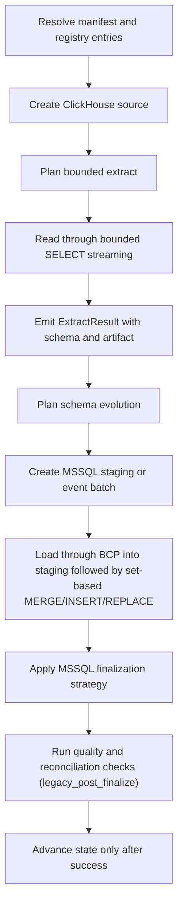

# ClickHouse -> MSSQL

This guide is a copy/paste-ready starting point for loading data from **ClickHouse** into **MSSQL** with `dpone`.
It describes the production contract for analytical/event tables landing in SQL
Server: certified type mapping, bounded source reads, MSSQL bcp staging,
source/target acceptance, and route evidence before scheduling.

The MSSQL doctor requires agreement between a hook-free artifact import and a
supported effective-runtime import. Both use one captured cwd/`sys.path`
snapshot, authenticated receipts and one shared five-second process budget;
bounded cleanup follows and is not counted inside that communication budget.
Ordinary wheels and direct/path-only editable installs remain supported. With automatic
site loading active, loaded customization modules, executable `.pth` code,
nonstandard import machinery, interpreter-flag disagreement and safely
unreproducible custom roots
(`PYTHONHOME`, `PYTHONPLATLIBDIR`, `PYTHONEXECUTABLE`, or macOS
`__PYVENV_LAUNCHER__`) return a distinct unsupported-startup diagnostic. Run the
doctor from the same standard environment used by the route runtime. Under an
effective `-S`, irrelevant `.pth` files are not treated as executed startup
state.

## When to use this path

Use this path when ClickHouse is the system of record or ingestion boundary and
MSSQL is the landing, warehouse, event-log, or downstream replication target.

For append-only or mostly append-only event tables, choose a complete source
boundary. The currently supported choices are a complete `full_refresh`, or a
complete bounded `partition_replace`, `replace`, or `backfill` window.

ClickHouse -> MSSQL `incremental_append` with `incremental_column` is blocked.
The legacy implementation derives `MAX(incremental_column)` from MSSQL and
uses ClickHouse `WHERE column > MAX`. That is not a durable source boundary,
even when the table is described as append-only.

## Copy/paste manifest

```yaml
# yaml-language-server: $schema=../../src/dpone/schema/etl-batch-manifest.schema.json
kind: dpone.batch.v1

defaults:
  name: clickhouse_to_mssql_example
  source:
    type: clickhouse
    connection_id: clickhouse_source
    options:
      batch_size: 50000
      export_format: csv
  sink:
    type: mssql
    connection_id: mssql_dwh
    table:
      schema: dbo
      name: orders
    strategy:
      mode: full_refresh

quality:
  gates:
    - id: source_target_rows
      type: row_count_reconciliation
      severity: error
      tolerance:
        mode: pct
        value: 0.1

schemas:
  analytics:
    tables:
      - orders
```

Run it locally:

```bash
dpone plan examples/source-sink/clickhouse-to-mssql.yaml --format md
dpone run examples/source-sink/clickhouse-to-mssql.yaml
```

The checked source file is `examples/source-sink/clickhouse-to-mssql.yaml`; CI
compares its parsed YAML with this block.

If you change the strategy to `full_refresh` and empty output is invalid,
row-count reconciliation is not enough: it can pass a `0` source / `0` target
comparison. Add an explicit non-empty target gate:

```yaml
quality:
  gates:
    - id: target_min_rows
      type: min_rows
      side: target
      threshold: 1
      severity: error
```

## ClickHouse connection transport

dpone supports two ClickHouse client transports behind the same
`source.type: clickhouse` manifest contract:

| Transport | Driver | Typical ports | When to use |
| --- | --- | --- | --- |
| Native TCP | `clickhouse-driver` | `9000`, secure `9440` | Self-hosted ClickHouse or clusters where native TCP is reachable. |
| HTTP/HTTPS | `clickhouse-connect` | `8123`, secure `8443` | ClickHouse Cloud, managed ClickHouse, or corporate networks where only HTTP(S) is exposed. |

The deployment connection registry and environment variables choose the
transport through connection extras. For managed ClickHouse over HTTPS:

```json
{
  "secure": true,
  "interface": "http",
  "port": 8443,
  "ca_cert": "/etc/ssl/certs/clickhouse-ca.pem"
}
```

Equivalent keys are accepted for the transport selector:
`interface`, `driver`, `protocol`, `transport`, or `client`. Values
`http`, `https`, `clickhouse_connect`, and `connect` select the HTTP adapter.
Without an explicit selector dpone keeps the historical native TCP behavior.

Troubleshooting:

| Symptom | Meaning | Action |
| --- | --- | --- |
| `SocketTimeoutError` on `8123`/`9000` | The pod cannot reach that endpoint/port. | Check network policy and whether the server exposes HTTP or native TCP. |
| `Unexpected packet ... expected Hello` | Native client was pointed at an HTTP/TLS endpoint, or TLS/native mode mismatch. | Set `interface: http` with `port: 8443`, or use native secure `9440` only when native TCP is exposed. |
| TLS/certificate error | HTTPS is reachable, but trust configuration is incomplete. | Provide `ca_cert` or use a platform trust bundle approved by security. |
| MSSQL rows exist but all business columns are `NULL`, while `__dpone__*` lineage is populated | Large ClickHouse extracts (>10k rows) streamed empty dicts when column names were taken from a zero-row header sample. | Upgrade to a dpone build that resolves streaming headers via `with_column_types` / `describe_result_columns`. Validate business-column payload with connector-native evidence. The executable manifest gates are `row_count_reconciliation`, `min_rows`, and `typed_hash_reconciliation`; use the hash gate only when both probes emit hashes. Row counts alone are not payload-fidelity proof. |

## Supported load strategies

These rows describe public runtime contracts, not certification of this exact
source, sink, transport, schema-evolution mode, and runtime combination.

| Strategy | Status | Notes |
|---|---|---|
| `full_refresh` | Manual live gate | Fast BCP staging and atomic publish are implemented; the exact route remains `UNVERIFIED` until DEV evidence is accepted. |
| `incremental_append` | Fail-closed | Target-derived single-column `MAX + >` can skip equal, out-of-order, late older, and `NULL` rows. |
| `incremental_merge` | Not available from this source | A `unique_key` alone does not supply an atomic ClickHouse source boundary. |
| `replace` | Manual live gate | Requires one complete source and target scope; raw cross-dialect predicates are not a portable boundary. |
| `partition_replace` | Manual live gate | Fallback atomically replaces values present in staging. An expected empty partition still requires explicit target-scope authority. |
| `snapshot_diff` | Not available from this source | `ClickHouseSource` does not expose this strategy. |

See [Load strategies](../load-strategies.md) for the detailed algorithm for each strategy.

## Production gates

Treat this route as production-ready only when these gates are green:

| Gate | Evidence | Why it matters |
| --- | --- | --- |
| Source boundary | `source_boundary_profile` | Event tables need a complete table snapshot or complete bounded replacement window; a target-derived cursor is rejected. |
| Type profile | `type_matrix` | `clickhouse_to_mssql_landing_v1` must classify every column as safe or contract-required. |
| Schema evolution | `route_schema_evolution` | New/widened columns are planned before source IO; incompatible changes fail or use `__dpone__nc__*`. |
| MSSQL bulk readiness | `bcp_bulk_readiness` | The runtime image has `bcp`, ODBC driver, staging permissions, and safe text codec settings. |
| Runtime evidence | `route_execution_ledger`, `run_artifact` | Load steps, row counts, errors and cleanup are durable. |
| Acceptance | `quality_reconciliation` | Counts, nulls, distincts, types and lineage columns are checked. |
| Performance | Operator-collected benchmark evidence | The runtime does not emit a complete versioned phase benchmark; status stays `UNVERIFIED` until the DEV campaign records the agreed measurements. |

## Runtime algorithm

This sink does not currently implement `StagedLoadPort`, so this route records
`governance_finalization=legacy_post_finalize`. Blocking gates run only after
the sink has mutated or finalized the target. A failure prevents source-state
advancement but cannot roll back that target mutation; inspect and repair or
deduplicate the target before retrying. See
[Load governance](../load-governance.md#runtime-lifecycle).



## Strategy behavior

- `full_refresh`: only for small or bounded reference tables. For large event tables it is a red flag unless the source predicate bounds the run.
- `incremental_append`: rejected before source or target I/O. Do not schedule it
  for ClickHouse -> MSSQL.
- `incremental_merge`: not exposed by `ClickHouseSource`; a stable key is
  necessary for idempotency but is not a source checkpoint.
- `replace`: reload a bounded predicate window through staging and then atomically replace the matching target slice.
- `snapshot_diff`: not exposed by `ClickHouseSource`.
- `partition_replace`: extract a complete partition slice, load it into staging,
  and replace only partitions represented by `partition.column`. An exact
  native MSSQL `date` column uses a deduplicated, sargable typed join; other
  types retain canonical identity matching. Inspect
  `mssql.partition_replace.finalizer` for
  `typed_sargable_distinct_join` or `canonical_identity_fallback`.

`partition_replace` derives its delete identities from staging. It preserves
all target dates outside that set, but it cannot remove an expected partition
that becomes completely empty because no staging identity exists for it. Keep
the bounded source window complete and do not claim empty-partition
reconciliation until an explicit expected-partition authority is available.

Snapshot reconciliation is separate from the load strategy. Runtime planning
reports that capability as `reconciliation.mode=snapshot`; in the official
`dpone.batch.v1` authoring schema, enable it with `reconciliation: true`.

## Cursor safety and migration

The old cursor cannot distinguish these cases from "no new rows":

- a second row with the same finite-precision timestamp, whether it commits
  before or after the source snapshot;
- a retry after the target maximum has advanced;
- an out-of-order or late row with a value older than the target maximum;
- `NULL`, which is unordered by the strict predicate;
- distinct ClickHouse `DateTime64` values that project to the same SQL Server
  `datetime2` precision.

The generic MSSQL receipt atomically records a target mutation, but it cannot
record a row that was absent from the source extract. `lookback_days` does not
make `incremental_append` idempotent, and `unique_key` alone does not bind a
bounded overlap to the receipt. Both manifest validation and runtime therefore
fail with `CLICKHOUSE_MSSQL_TARGET_MAX_CURSOR_UNSAFE` /
`clickhouse_mssql.target_max_cursor_unsafe` before target `MAX`, source schema,
streaming, or GCS export I/O.

Migrate by choosing one complete boundary:

1. Use `full_refresh` when a complete table scan is operationally acceptable.
2. Use `replace`, `partition_replace`, or `backfill` only when every run reads
   the complete declared window that the target operation replaces.
3. Keep incremental scheduling disabled until dpone provides either a typed
   source-snapshot composite cursor with an atomic receipt, or bounded overlap
   backed by a catalog-proven idempotent key and lateness contract.

## Schema evolution and type mapping

Schema evolution is enabled by default and runs before the staging/final load path:

1. Read the exact ClickHouse catalog schema before source row I/O.
2. Apply `physical_design.columns.<column>.target_type.mssql` to the same
   physical projection later used by native staging and lineage. Bounded text
   and binary overrides are value-guarded during staging; structurally lossy
   overrides fail before staging or target mutation. The override is an exact
   desired contract, not an instruction to ignore drift: a different observed
   target type still blocks the load.
3. Introspect the MSSQL target schema.
4. Apply safe additions and widening operations.
5. Fail breaking changes by default.
6. If configured, route incompatible type changes to `__dpone__nc__<column>`.

The runtime and CLI share one profile: `clickhouse_to_mssql_landing_v1`.
It unwraps `Nullable(...)` and `LowCardinality(...)`, preserves ordinary
numeric/date/time/string types, and requires explicit contracts for ambiguous
or lossy families.

Use [Schema evolution](../schema-evolution.md) and [Type mapping matrix](../type-mapping-matrix.md) when adding columns or changing source types.

## Type matrix certification

Run the route type matrix before enabling a new ClickHouse table:

```bash
dpone schema type-matrix \
  --source clickhouse \
  --sink mssql \
  --source-type "event_at:DateTime64(3, 'Europe/Moscow')" \
  --source-type "user_id:UInt64" \
  --source-type "payload:Nullable(String)" \
  --format md
```

Production blockers:

| Blocker | Meaning | Action |
| --- | --- | --- |
| `requires_explicit_contract=true` | The type is complex, lossy or vendor-specific. | Add `schema_contract`, physical override, or quarantine/normalization. |
| `DateTime64(p)` with `p > 7` | SQL Server `datetime2` cannot store precision above 7. | Declare truncation to `datetime2(7)` or land as text. |
| `Decimal(p,s)` with `p > 38` | SQL Server `decimal` cannot represent the precision. | Land as text or change source projection. |
| `Array` / `Map` / `Tuple` / `Nested` | Shape is not first-class in SQL Server. | Serialize JSON explicitly or normalize into child tables. |

## Performance profile

The implementation baseline is `clickhouse_streaming_to_mssql_bcp_staging`;
the exact environment becomes certified only after the live benchmark matrix:

```text
ClickHouse SELECT stream
-> one immutable BulkTextCodec spool file
-> MSSQL bcp into staging
-> capacity gate
   -> admitted: one owned raw-shaped decoded staging write and guards over decoded values
   -> fallback: the same guards over inline raw codec expressions
-> one table-locked set-based typed + lineage + row-hash heap projection
-> atomic strategy finalization
-> independent target acceptance and state commit
```

Route behavior and tuning:

- Put the character-BCP spool on an explicitly provisioned worker volume:

  ```yaml
  runtime:
    storage:
      profile: mounted_volume
      work_dir: /mnt/dpone-work
      min_free_bytes: 2GiB
  ```

  The ClickHouse source issues an internal, non-authorable character-spool
  proof for its Python row-stream route. Only that proof activates the early
  MSSQL storage gate; native, typed-file, query, and other non-spool routes do
  not inherit the compatibility-default 1 GiB floor. Before ClickHouse row
  I/O, the gate creates the directory when allowed, proves it is writable,
  resolves and pins its filesystem identity, and checks free bytes on that
  exact filesystem. Immediately before row iteration it reopens and repeats
  the checks. The spool byte ceiling is the observed free space minus
  `min_free_bytes`; this is a hard logical UTF-8 payload bound, not an invented
  estimate of source size or a guarantee about allocated filesystem blocks.
  Crossing it raises the stable
  path-free error `mssql_spool_byte_limit_exceeded` before BCP or business-table
  mutation and deletes the partial file. Filesystem allocation granularity and
  concurrent writers can still make the underlying write fail earlier; dpone
  reports that outcome as `mssql_spool_write_failed` without exposing the
  configured path.
- A manifest without `runtime.storage.work_dir` retains the compatibility
  fallback to the system temporary directory and emits the existing warning.
  Treat that as a migration path, not a large-load recommendation: container
  `/tmp` is often smaller than a mounted worker volume.
- The admission opens the resolved directory once. POSIX prefers `O_TMPFILE`;
  its portable fallback creates an exclusive random attempt file and removes
  that basename through `unlinkat` before source iteration. Separate writer
  and read-only descriptors retain the same inode. After serialization the
  file becomes owner-read-only; its held reader is the only consumer
  coordinate, so final cleanup closes descriptors and cannot delete a file
  later created at the old logical name. Evidence hashes the held reader with
  `fstat` plus offset-independent `pread`; an unavailable descriptor-read
  primitive fails closed rather than reopening the pathname.
  Windows verifies and holds non-delete-sharing handles for every resolved path
  component before using exclusive leaf-file operations. Both implementations
  recheck pathname and filesystem identity before BCP, so a rename, junction,
  symlink, or ancestor swap cannot redirect creation or cleanup into a
  replacement directory. File creation is exclusive; POSIX uses owner-only
  mode while Windows inherits the ACL of the provisioned work directory. On a
  shared volume, the per-attempt byte ceiling and live free-space recheck do
  not replace a platform-level concurrent-workload quota; size the volume and
  pod concurrency together.
- The same identity stays pinned through the external BCP open. On POSIX the
  runner inherits a read descriptor and gives BCP its verified
  `/proc/self/fd/<n>` or `/dev/fd/<n>` projection, never the mutable work-dir
  pathname. SHA-256 receipt capture, pre/post verification, BCP input, and
  consumed-payload evidence all use that same descriptor identity. If neither
  descriptor projection is available, the route fails closed before BCP. On
  Windows the spool is created with a readers-only share contract and a
  reduced read handle is retained across BCP; replacement, deletion, and
  concurrent write opens remain blocked while the vendor reader is allowed.
  Cleanup releases the reader, opens a deletion handle without delete sharing,
  verifies the exact volume/file identity, creation timestamp, and final path,
  and only then marks that handle for deletion. A missing or rebound name
  becomes residue; dpone never falls back to deleting the pathname. The runtime-only
  `BcpOptions.input_file_authority` transports this lease from staging to the
  process runner and is neither authorable nor persisted in route identity.
- The task's same-UID runtime components are a trust boundary. POSIX owner-only
  mode, immediate unlink, descriptor receipts, and pre/post hashes prevent
  pathname rebinding and detect ordinary mutation, but they are not a kernel
  immutability seal against a hostile same-UID process that can inspect or
  mutate another process's open descriptors. Such co-tenancy requires platform
  isolation or a separately certified fs-verity-style backend.
- Admission and lifecycle errors use stable path-free codes:
  `mssql_spool_work_dir_not_writable`,
  `mssql_spool_work_dir_low_space`,
  `mssql_spool_work_dir_identity_changed`,
  `mssql_spool_byte_limit_exceeded`, `mssql_spool_write_failed`, and
  `mssql_spool_cleanup_failed`. Directory-handle release uses the distinct
  `mssql_spool_directory_release_failed` code because a failed handle release
  does not by itself prove file residue. Neither cleanup nor release failure
  replaces an already authoritative capacity, BCP, or conversion failure;
  path-free secondary evidence records `cleanup_error_code` or
  `directory_release_error_code`. File cleanup failure additionally records
  `residue_possible=true`. After an otherwise successful import, either
  lifecycle failure fails the run; cleanup residue requires operator removal.
- ClickHouse table extracts to MSSQL skip a separate preflight full-table
  `COUNT(*)`; the consumed stream publishes the exact source row authority;
- `batch_size: 100000` to `250000` is a starting point for ordinary event
  tables, then must be benchmarked against row width and worker memory;
- source `batch_size` controls driver fetch memory, while MSSQL
  `bulk.bcp.batch_size` controls BCP transaction batches; neither creates an
  additional BCP process on this route;
- BCP packet size remains capped by the reviewed encrypted ODBC contract;
- inspect `phase=decode_admission` before `phase=decode_materialize` when
  conversion work dominates a run. The admitted path requires current free
  bytes in the database default filegroup for the decoded heap, a raw-sized
  native payload reserve, full-page-and-extent allocation for every possible
  wide native row, and 64 MiB headroom. An unavailable or insufficient probe
  selects `status=inline_fallback`; it never weakens a conversion guard;
- during admitted native projection, raw, decoded, and native heaps coexist.
  Decoded rows are exact-count verified while the immutable raw BCP receipt
  remains the evidence authority. Cleanup makes three bounded attempts; a
  permanent residue fails an otherwise successful run, or is logged with its
  exact qualified table without replacing an existing primary failure. Verify
  that no active run owns that exact table before dropping it; never wildcard-
  sweep staging prefixes;
- `conversion_validate` does not repeat target round-trips for exact or
  domain-preserving projections. It still validates non-text wire against its
  declared source domain and keeps complete per-value guards for bounded or
  code-page-sensitive text/binary projections; a narrowing outside those
  admitted families fails before the scan;
- bounded date predicates for backfill;
- complete bounded replacement windows for late-arriving events;
- `15k rows/sec` for target finalization is a provisional DEV acceptance
  threshold, not an emitted runtime certification claim. Record wall-clock,
  SQL Server, BCP, and Airflow evidence explicitly until a versioned benchmark
  producer is implemented.

For an independent read of the published MSSQL table, enable required
acceptance. The probe uses the materialized environment-specific database from
the load config; it does not infer or substitute another database:

```yaml
quality:
  acceptance:
    enabled: true
    mode: required
    capture:
      source: false
      staged: false
      target: true
    checks:
      row_count: true
      null_counts: business_columns
```

`source_target_count` remains the fast source-versus-staging materialization
gate and avoids an additional ClickHouse source scan. The MSSQL sink currently
uses the legacy post-finalize governance adapter, so required staged capture is
not available; the immutable staging receipt is its authority. Neither is a
substitute for the target acceptance snapshot. For `full_refresh`, the source
materialization, staging receipt, and target acceptance counts are directly
comparable. For
`partition_replace`, compare the source and target inside the same certified
window; a whole-target total is not a window reconciliation.

## Runbook

1. Run `dpone doctor --profile mssql --format json` and fix every required
   `pyodbc`/`bcp` blocker before a local transfer. The doctor executes a bounded
   dual import with one path/cwd snapshot and authenticated outcomes. POSIX proves
   disappearance of each original inherited process group; deliberate group
   reassignment or session detachment is outside containment. Windows bounds the
   direct child without claiming descendant containment. An installed `pyodbc` wheel with a
   missing unixODBC shared library is reported as a redacted load failure, never
   as a false PASS.
2. Run `dpone schema type-matrix --source clickhouse --sink mssql` with the real source schema.
3. Add `schema_contract` for every complex/lossy column before the first production run.
4. Run `dpone perf advise <manifest>` and confirm event tables are not using blind `full_refresh`.
5. Run `dpone plan <manifest> --format md` and review source boundary, staging path, schema evolution, state, and quality gates.
6. Run a small bounded window first.
7. Inspect `.dpone/runs/clickhouse_to_mssql`, route decision evidence, and MSSQL target row counts.
8. Require the MSSQL target acceptance probe and verify that its dataset
   identity contains the intended environment database. Compare exact counts,
   selected NULL/distinct metrics, type fidelity, and lineage columns.
9. Do not enable ClickHouse -> MSSQL cursor scheduling; verify that each run
   uses a complete table or complete bounded replacement window.
10. Promote the manifest through GitOps only after route readiness evidence is green.

## Industrial comparison

- dlt-style load packages: dpone keeps the package idea but adds MSSQL bcp staging, type matrix certification and source/target acceptance.
- Airbyte/Fivetran-style connector checks: dpone keeps connection validation and initial sync safety, but makes route decisions and blockers visible in OSS artifacts.
- Informatica/SSIS/Pentaho-style staging: dpone uses staging-first finalization and step evidence, but avoids manual tuning by route advisor and typed runbooks.
- MSSQL -> ClickHouse dpone route: this ClickHouse -> MSSQL path now shares the same contract language: route readiness, type profile, DQ, lineage, SLO and durable evidence.

## Cross-links

- [Source -> sink matrix](../source-sink-matrix.md)
- [Load strategies](../load-strategies.md)
- [Schema evolution](../schema-evolution.md)
- [Type mapping matrix](../type-mapping-matrix.md)
- [Reconciliation and CDC](../cdc.md)
- [Performance guide](../performance.md)

## Type contracts and physical design

This flow supports the shared dpone type-governance stack:

- [Type inference](../type-inference.md) for source metadata, sampled profiling, confidence, and empty string vs `NULL` behavior.
- [Schema contracts](../schema-contracts.md) for explicit logical column types, enforcement modes, and `__dpone__nc__*` variant columns.
- [Physical design](../physical-design.md) for target-specific DDL such as concrete SQL types, indexes, partitioning, compression, ClickHouse `LowCardinality`, and BigQuery clustering.

Use `dpone schema infer --manifest ...` and `dpone schema physical-plan --manifest ...` before enabling new table DDL in production.
