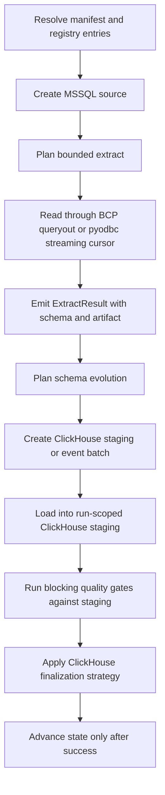
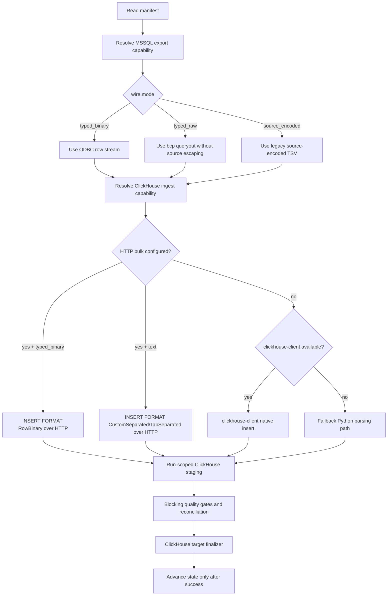

# MSSQL -> ClickHouse

This guide is a copy/paste-ready starting point for loading data from **MSSQL** into **ClickHouse** with `dpone`.

**Status:** Batch ETL supported

Type profile: `mssql_to_clickhouse_lossless_v2`. Vendor-live evidence uses a
**wide** typed fixture (`dpone_src` → ClickHouse `dpone_it`) and covers Docker
MSSQL → ClickHouse strategies `full_refresh`, `incremental_append`,
`incremental_merge`, `replace`, `partition_replace`, `snapshot_diff`, `scd2`,
and `backfill` (inner `replace`) via
`tests/integration/mssql/test_mssql_to_clickhouse_vendor_live_integration.py`.
`snapshot_diff` / `scd2` use staging-first ClickHouse finalizers (default
`lightweight_delete_insert`; see
`docs/feature-design-clickhouse-snapshot-diff-scd2-v1.md`). Binary columns use
hex character BCP (`type_fidelity.binary_encoding: hex`). See
[Route live wide certification](../testing/route-live-wide-certification.md).

### Vendor-live IT (manual)

```bash
docker compose -f docker/docker-compose.integration.yml up -d mssql clickhouse
export DPONE_RUN_INTEGRATION=1 DPONE_RUN_INTEGRATION_LIVE=1
uv run pytest tests/integration/mssql/test_mssql_to_clickhouse_vendor_live_integration.py -q
```

## When to use this path

Use this path when MSSQL is the system of record or ingestion boundary and ClickHouse is the landing, warehouse, event-log, or downstream replication target.

## Copy/paste manifest

```yaml
# yaml-language-server: $schema=../../src/dpone/schema/etl-batch-manifest.schema.json
kind: dpone.batch.v1

defaults:
  name: mssql_to_clickhouse_example
  source:
    type: mssql
    connection_id: mssql_source
    options:
      batch_size: 50000
      export_format: csv
  sink:
    type: clickhouse
    connection_id: clickhouse_analytics
    table:
      schema: analytics
      name: orders
    strategy:
      mode: incremental_merge
      unique_key: order_id
      merge_policy: lightweight_delete_insert
      duplicate_policy: fail

quality:
  gates:
    - id: source_target_rows
      type: row_count_reconciliation
      severity: error
      tolerance:
        mode: pct
        value: 0.1

schemas:
  dbo:
    tables:
      - orders
```

Older single-process manifests sometimes showed `state: {type: disabled}` for
one-shot smoke runs. Do not add that fragment here: `state` is not an official
`dpone.batch.v1` process field. Configure state through the supported runtime
composition path; incremental, CDC, snapshot, and checkpointed workloads still
require a durable backend.

Run it locally:

```bash
dpone plan examples/source-sink/mssql-to-clickhouse.yaml --format md
dpone run examples/source-sink/mssql-to-clickhouse.yaml
```

The checked source file is `examples/source-sink/mssql-to-clickhouse.yaml`; CI
compares its parsed YAML with this block.

If you change the strategy to `full_refresh` and empty output is invalid,
row-count reconciliation is not enough: it can pass a `0` source / `0` target
comparison. Add an explicit non-empty target gate:

```yaml
quality:
  gates:
    - id: target_min_rows
      type: min_rows
      side: target
      threshold: 1
      severity: error
```

## Supported load strategies

Wide vendor-live evidence covers the strategies below (see Status blurb and
manual IT command above). Notes describe runtime contracts.

| Strategy | Status | Notes |
|---|---|---|
| `full_refresh` | Supported | Uses staging first, then applies the target-specific finalization plan. |
| `incremental_append` | Supported | Uses staging first, then applies the target-specific finalization plan. |
| `incremental_merge` | Supported | Default `merge_policy: lightweight_delete_insert`; `shadow_swap` supported; `mutation_delete_insert` is explicit opt-in and non-recommended. |
| `replace` | Supported | Uses staging first, then applies the target-specific finalization plan. |
| `partition_replace` | Supported | Replaces target partitions represented by staging `partition.column`; see Load strategies for native/fallback paths. |
| `snapshot_diff` | Supported | Requires a complete bounded snapshot and `unique_key`; applies the configured diff/delete policy. |
| `scd2` | Supported | Staging-first SCD2 with technical columns; default expire delete policy. |
| `backfill` | Supported | Bounded predicate reload; vendor-live certifies inner `replace`. |

See [Load strategies](../load-strategies.md) for the detailed algorithm for each strategy.
MSSQL CDC is a source capability, not a load strategy. It uses typed CDC
offsets and advances source state only after sink success; certify the exact
route and environment before enabling it.

## Runtime algorithm

ClickHouse implements `StagedLoadPort`, so this route records
`governance_finalization=pre_finalize`. Blocking gates evaluate projected
staging rows before target finalization; a failure aborts and cleans staging
without advancing source state. See
[Load governance](../load-governance.md#runtime-lifecycle).



## Large native transfer on small workers

For production BCP queryout loads, prefer adaptive native transfer instead of
exporting every partition file before the first ClickHouse load. The adaptive
runtime exports one physical slice, loads it into ClickHouse staging, records
evidence, and cleans the local file before continuing.

Key settings:

```yaml
runtime:
  storage:
    profile: mounted_volume
    work_dir: /mnt/dpone-work
    min_free_bytes: 1GiB

source:
  options:
    columns: [id, name, updated_at]
    partitioning:
      column: id
      bounds: auto
      target_rows_per_partition: 200000
    native_transfer:
      execution:
        mode: auto
        profile: balanced
        resource_policy:
          max_active_files: 2
          max_active_bytes: 512MiB
          target_file_bytes: 128MiB
          max_file_bytes: 256MiB
```

Run `dpone plan --format md` before a large view-backed extract. The plan
reports the runtime storage path, active file budget, source SQL skeleton, and
source-impact warnings such as `source_select_star`,
`source_view_over_view_risk`, and `source_boundary_index_unknown`.

Read [Adaptive native transfer](../native-transfer-industrial-runtime.md) for
the full storage, slicing, cleanup, resume, and KPO contract.

## Fast typed binary BCP path

For high-throughput MSSQL -> ClickHouse loads, use the BCP native decoder route
when the source schema is covered by the supported native type set:

```yaml
source:
  type: mssql
  options:
    extract_mode: bcp_queryout
    bulk:
      mode: bcp
      bcp:
        file_format: native
    native_transfer:
      wire:
        mode: typed_binary
        source_native_format: bcp_native
        binary_format: native
        block_rows: 65536
        block_bytes: 64MiB
      snapshot:
        execution:
          mode: auto
          profile: balanced
          adaptive_parallelism: true
    partitioning:
      strategy: stats
      column: id
      target_rows_per_partition: 200000
      max_partitions: 16
      planner:
        mode: statistics
        stats_source: auto
        skew_policy: split_hot_ranges
        max_hot_partition_factor: 2.0
        null_bucket: separate

sink:
  type: clickhouse
  options:
    clickhouse_bulk:
      mode: native_tcp
      native_tcp:
        enabled: true
        backend: auto
        compression: auto
        port: 9000
      ingest_contract: typed_binary_staging
```

This selects `mssql_bcp_native_to_clickhouse_native`: SQL Server exports
`bcp queryout -n`, dpone decodes the source-native file under the native wire
contract, and ClickHouse receives `Native` columnar blocks into staging. The
generated MSSQL query must contain only projection, predicates, and
partition/slice filters. If you see `REPLACE(` or `CONVERT(VARCHAR(MAX))` in
the source query, the workload is using the legacy `source_encoded` TSV path.

`partitioning.strategy: stats` lets SQL Server routes build balanced snapshot
ranges from histogram metadata instead of running heavy boundary scans. The
first adapter reads `sys.dm_db_stats_histogram`, splits hot histogram ranges
when possible, and emits a separate NULL bucket. If the source is a view or
statistics confidence is low, `dpone plan` records
`source_stats_low_confidence` and starts with conservative parallelism.

`clickhouse_bulk.native_tcp.backend: auto` prefers a certified direct protocol
provider and otherwise falls back to the v0.30 client wrapper. `backend:
direct` blocks before source I/O when direct protocol support is missing or
uncertified, so production evidence cannot silently claim a direct path.

Supported v0.27 native types include numeric, temporal, text, binary, and
`uniqueidentifier`. `sql_variant`, XML, CLR/UDT, spatial types, `hierarchyid`,
and legacy `text`/`ntext`/`image` fail closed or require another certified
route. On Linux/KPO runners `bcp -N` is blocked; use `bcp -n`.

Before promoting native/Parquet behavior, run the dedicated
[wide dbt release-certification how-to](../mssql-clickhouse-wide-release-certification.md).
It starts the full local service set first, maps host ports and secrets without
writing credentials to evidence, creates a canonical 201-column MSSQL source,
materializes the 202-column dbt result, and proves that exact relation through
native acceleration, the Python reference backend, and Parquet/S3 pull. The
campaign is create-once and remains explicitly local-only; it cannot satisfy a
production or `vendor_live` certification slot.

## Strategy behavior

- `full_refresh`: extract the selected source boundary, load into staging, and replace the target according to the target's safe finalization path.
- `incremental_append`: extract only the incremental boundary and append rows through staging or event production.
- `incremental_merge`: load into staging, validate duplicates, then use `lightweight_delete_insert` by default; `shadow_swap` and guarded `mutation_delete_insert` are explicit policies.
- `replace`: reload a bounded predicate window through staging and then atomically replace the matching target slice.
- `snapshot_diff`: compare a complete current source snapshot with the target by `unique_key`, then apply the configured insert, update, and delete policy.
- `partition_replace`: extract a complete partition slice, load it into staging, and replace only partitions represented by `partition.column`.

Snapshot reconciliation is separate from the load strategy. Runtime planning
reports that capability as `reconciliation.mode=snapshot`; in the official
`dpone.batch.v1` authoring schema, enable it with `reconciliation: true`.

## Schema evolution and type mapping

Schema evolution is enabled by default and runs before the staging/final load path:

1. Read source schema from `ExtractResult.schema`.
2. Introspect the ClickHouse target schema.
3. Apply safe additions and widening operations.
4. Fail breaking changes by default.
5. If configured, route incompatible type changes to `__dpone__nc__<column>`.

Use [Schema evolution](../schema-evolution.md) and [Type mapping matrix](../type-mapping-matrix.md) when adding columns or changing source types.

For a route-level go/no-go report, attach this route's artifacts to
[`dpone ops route-certification-pack`](../route-certification-pack.md), which
generates readiness-compatible evidence and embeds
[`dpone ops route-readiness`](../route-readiness.md). The critical readiness
evidence domains for `mssql -> clickhouse` are `type_fidelity`, `typed_hash`,
`wide_type_certification`, `benchmark_slo`, and `schema_evolution`, plus the
generic matrix, manifest, strategy, reconciliation, run artifact, and docs
runbook domains.

Before a release tag, pass the refresh execution, `route_refresh_snapshot_capture`,
exact `route_refresh_verification`, readiness, checklist, and evidence-chain
artifacts to [`dpone ops route-certify`](../route-certify.md). In
`vendor_live` mode the same bundle also requires `route_live_evidence_bundle`.
The resulting `route_certification_bundle.json` is the final route promotion
artifact for this route.

## CDC apply evidence

The first CDC handoff profile for this route uses MSSQL CDC LSNs as the source
boundary and ClickHouse typed staging apply as the sink-side contract. Use it
after the initial snapshot has loaded and before advancing durable CDC offsets.

Generate CDC apply evidence from a credential-free fixture first:

```bash
dpone ops cdc-apply-certification \
  --source mssql \
  --sink clickhouse \
  --strategy cdc \
  --source-dataset dbo.orders \
  --target-dataset analytics.orders \
  --fixture-json test_artifacts/cdc/orders/fixture.json \
  --output-dir test_artifacts/cdc_apply/mssql_to_clickhouse/orders \
  --format json
```

The command writes `cdc_apply_correctness`, `delete_semantics`,
`typed_cdc_hash`, boundary, retention, and schema drift evidence, then embeds a
CDC handoff report.

```bash
dpone ops cdc-handoff \
  --source mssql \
  --sink clickhouse \
  --strategy cdc \
  --source-dataset dbo.orders \
  --target-dataset analytics.orders \
  --artifact cdc_snapshot_boundary=.dpone/cdc/orders/snapshot_boundary.json \
  --artifact cdc_window=.dpone/cdc/orders/window.json \
  --artifact retention_preflight=.dpone/cdc/orders/retention.json \
  --artifact cdc_apply_correctness=.dpone/cdc/orders/apply_correctness.json \
  --artifact delete_semantics=.dpone/cdc/orders/delete_semantics.json \
  --artifact typed_cdc_hash=.dpone/cdc/orders/typed_hash.json \
  --artifact schema_drift_governance=.dpone/cdc/orders/schema_drift.json \
  --output-dir .dpone/cdc-handoff/orders \
  --format md
```

The generated `cdc_handoff.json` must be green before a release gate treats this
route as replication-grade. See [CDC snapshot handoff](../cdc-handoff.md) for
the evidence taxonomy and failure runbook.

Add CDC observability evidence before promoting the stream in production-like
environments:

```bash
dpone ops cdc-observability-evidence \
  --handoff-json .dpone/cdc-handoff/orders/cdc_handoff.json \
  --apply-certification-json test_artifacts/cdc_apply/mssql_to_clickhouse/orders/cdc_apply_certification.json \
  --metrics-json test_artifacts/cdc_metrics/mssql_to_clickhouse/orders/metrics.json \
  --slo-json test_artifacts/cdc_metrics/mssql_to_clickhouse/orders/slo.json \
  --output-dir test_artifacts/cdc_observability/mssql_to_clickhouse/orders \
  --format json
```

This writes `cdc_lag_slo`, `cdc_freshness_slo`, `cdc_retention_risk`,
`cdc_offset_commit_health`, `cdc_duplicate_replay_rate`, and
`cdc_throughput_slo` evidence. See
[CDC observability evidence](../cdc-observability-evidence.md) for the metrics
contract and runbook.

Add CDC recovery evidence when fault-injection scenarios are part of the route
promotion gate:

```bash
dpone ops cdc-recovery-evidence \
  --handoff-json .dpone/cdc-handoff/orders/cdc_handoff.json \
  --apply-certification-json test_artifacts/cdc_apply/mssql_to_clickhouse/orders/cdc_apply_certification.json \
  --observability-json test_artifacts/cdc_observability/mssql_to_clickhouse/orders/cdc_observability.json \
  --scenario-json test_artifacts/cdc_recovery/mssql_to_clickhouse/orders/scenario.json \
  --policy-json test_artifacts/cdc_recovery/mssql_to_clickhouse/orders/policy.json \
  --output-dir test_artifacts/cdc_recovery/mssql_to_clickhouse/orders \
  --format json
```

This writes `cdc_restart_resume`, `cdc_offset_commit_ordering`,
`cdc_idempotent_replay_window`, `cdc_partial_commit_repair`,
`cdc_poison_event_quarantine`, and `cdc_retention_recovery_margin` evidence.
See [CDC recovery evidence](../cdc-recovery-evidence.md) for the scenario
contract and runbook.

## CDC poison quarantine and replay

Use [CDC poison quarantine and replay](../cdc-poison-quarantine.md) after the
runtime path is enabled. The generic runtime classifier quarantines missing-key,
unsupported-operation, and duplicate-event poison records. ClickHouse replay is
event-hash idempotent and reports `duplicate_events_skipped` when a replay
window already exists in the append-only CDC log.

```bash
dpone ops cdc-runtime-run \
  --mode live \
  --source mssql \
  --sink clickhouse \
  --backend mssql_change_tracking \
  --pipeline-name orders-cdc \
  --source-schema dbo \
  --source-table orders \
  --target-dataset analytics.orders_cdc \
  --unique-key order_id \
  --source-connection-id mssql-prod \
  --sink-connection-id clickhouse-prod \
  --credentials-source env \
  --poison-mode quarantine_and_continue \
  --output-dir .dpone/cdc-runtime/orders \
  --format json
```

Inspect and replay quarantined records without mutating offsets:

```bash
dpone ops cdc-quarantine-inspect \
  --quarantine-json .dpone/cdc-runtime/orders/cdc_poison_quarantine.json \
  --output-dir .dpone/cdc-runtime/orders/inspection \
  --format json

dpone ops cdc-replay-execute \
  --mode live \
  --source mssql \
  --sink clickhouse \
  --backend mssql_change_tracking \
  --pipeline-name orders-cdc \
  --source-schema dbo \
  --source-table orders \
  --target-dataset analytics.orders_cdc \
  --unique-key order_id \
  --sink-connection-id clickhouse-prod \
  --credentials-source env \
  --quarantine-json .dpone/cdc-runtime/orders/cdc_poison_quarantine.json \
  --output-dir .dpone/cdc-runtime/orders/replay \
  --format json
```

## CDC compare and repair

Use [CDC compare and repair](../cdc-compare-repair.md) after runtime apply,
poison replay, schema apply, or incident recovery. The live profile compares
the MSSQL source table with the latest current-state projection of the
ClickHouse CDC log and writes a bounded repair plan.

```bash
dpone ops cdc-compare-repair \
  --mode live \
  --source mssql \
  --sink clickhouse \
  --backend mssql_change_tracking \
  --pipeline-name orders-cdc \
  --source-schema dbo \
  --source-table orders \
  --target-dataset analytics.orders_cdc \
  --unique-key order_id \
  --column order_id \
  --column status \
  --source-connection-id mssql-prod \
  --sink-connection-id clickhouse-prod \
  --credentials-source env \
  --output-dir .dpone/cdc-compare/orders \
  --format json
```

Execute an approved repair plan without mutating offsets:

```bash
dpone ops cdc-repair-execute \
  --mode live \
  --source mssql \
  --sink clickhouse \
  --backend mssql_change_tracking \
  --pipeline-name orders-cdc \
  --source-schema dbo \
  --source-table orders \
  --target-dataset analytics.orders_cdc \
  --unique-key order_id \
  --sink-connection-id clickhouse-prod \
  --credentials-source env \
  --repair-plan-json .dpone/cdc-compare/orders/cdc_repair_plan.json \
  --output-dir .dpone/cdc-compare/orders/repair \
  --format json
```

## CDC retention gap auto-resync

Use [CDC retention gap auto-resync](../cdc-retention-resync.md) when the
stored MSSQL CDC offset may be older than the retained source window. For
`mssql -> clickhouse`, the live probe reads SQL Server Change Tracking min valid
version or SQL Server CDC min LSN, then resync execution writes bounded events
to the ClickHouse append-only CDC log without advancing offsets.

```bash
dpone ops cdc-retention-check \
  --mode live \
  --source mssql \
  --sink clickhouse \
  --backend mssql_change_tracking \
  --pipeline-name orders-cdc \
  --source-schema dbo \
  --source-table orders \
  --target-dataset analytics.orders_cdc \
  --unique-key order_id \
  --committed-offset 105 \
  --source-connection-id mssql-prod \
  --credentials-source env \
  --output-dir .dpone/cdc-retention/orders \
  --format json
```

When the report returns `gap_detected`, export a bounded source snapshot and
build a resync plan:

```bash
dpone ops cdc-resync-plan \
  --source mssql \
  --sink clickhouse \
  --backend mssql_change_tracking \
  --pipeline-name orders-cdc \
  --source-schema dbo \
  --source-table orders \
  --target-dataset analytics.orders_cdc \
  --unique-key order_id \
  --retention-report-json .dpone/cdc-retention/orders/cdc_retention_check.json \
  --rows-json test_artifacts/cdc_retention_resync/orders/source_snapshot.json \
  --max-rows 10000 \
  --output-dir .dpone/cdc-retention/orders/resync-plan \
  --format json
```

Execute only an approved bounded plan:

```bash
dpone ops cdc-resync-execute \
  --mode live \
  --source mssql \
  --sink clickhouse \
  --backend mssql_change_tracking \
  --pipeline-name orders-cdc \
  --source-schema dbo \
  --source-table orders \
  --target-dataset analytics.orders_cdc \
  --unique-key order_id \
  --sink-connection-id clickhouse-prod \
  --credentials-source env \
  --resync-plan-json .dpone/cdc-retention/orders/resync-plan/cdc_resync_actions.json \
  --max-actions 10000 \
  --output-dir .dpone/cdc-retention/orders/resync-execute \
  --format json
```

After resync, run `cdc-compare-repair` again and resume `cdc-runtime-run` only
after compare is green. Resync reports keep `committed=false`.

Add CDC schema evolution evidence when source DDL changes are part of the
route promotion gate:

```bash
dpone ops cdc-schema-evolution-evidence \
  --handoff-json .dpone/cdc-handoff/orders/cdc_handoff.json \
  --apply-certification-json test_artifacts/cdc_apply/mssql_to_clickhouse/orders/cdc_apply_certification.json \
  --observability-json test_artifacts/cdc_observability/mssql_to_clickhouse/orders/cdc_observability.json \
  --recovery-json test_artifacts/cdc_recovery/mssql_to_clickhouse/orders/cdc_recovery_evidence.json \
  --schema-change-json test_artifacts/cdc_schema/mssql_to_clickhouse/orders/schema_change.json \
  --policy-json test_artifacts/cdc_schema/mssql_to_clickhouse/orders/policy.json \
  --output-dir test_artifacts/cdc_schema/mssql_to_clickhouse/orders \
  --format json
```

This writes `cdc_schema_change_capture`, `cdc_schema_compatibility`,
`cdc_type_widening_safety`, `cdc_target_ddl_dry_run`,
`cdc_backfill_requirement`, `cdc_breaking_change_gate`, and
`cdc_offset_schema_ordering` evidence. See
[CDC schema evolution evidence](../cdc-schema-evolution-evidence.md) for the
schema-change contract and runbook.

Apply approved additive target DDL and refresh the typed serving projection with
[CDC schema apply](../cdc-schema-apply.md):

```bash
dpone ops cdc-schema-apply \
  --schema-change-json test_artifacts/cdc_schema/mssql_to_clickhouse/orders/schema_change.json \
  --sink clickhouse \
  --target-dataset serving.orders_current_typed \
  --mode dry_run \
  --require-approval \
  --output-dir test_artifacts/cdc_schema_apply/mssql_to_clickhouse/orders \
  --format json
```

After reviewing `cdc_schema_apply_plan.json`, run the approved apply path:

```bash
dpone ops cdc-schema-apply \
  --schema-change-json test_artifacts/cdc_schema/mssql_to_clickhouse/orders/schema_change.json \
  --sink clickhouse \
  --target-dataset serving.orders_current_typed \
  --mode apply \
  --sink-connection-id clickhouse-prod \
  --credentials-source env \
  --typed-refresh \
  --cdc-dataset analytics.orders_cdc \
  --unique-key order_id \
  --column order_id=Int32 \
  --column status=Nullable(String) \
  --column amount=Nullable(Decimal(18,2)) \
  --column status_reason=Nullable(String) \
  --fail-on-parse-errors \
  --schema-drift-mode strict \
  --quarantine-dataset serving.orders_parse_quarantine \
  --require-approval \
  --output-dir test_artifacts/cdc_schema_apply/mssql_to_clickhouse/orders \
  --format json
```

The command writes `cdc_schema_apply_result.json` and embeds
`typed_refresh/cdc_typed_materialization.json` when `--typed-refresh` is set.
It never advances CDC offsets; offset promotion still belongs to the final CDC
promotion gate.

Build the final CDC promotion bundle only after every upstream CDC gate is
green:

```bash
dpone ops cdc-promotion-gate \
  --apply-certification-json test_artifacts/cdc_apply/mssql_to_clickhouse/orders/cdc_apply_certification.json \
  --handoff-json .dpone/cdc-handoff/orders/cdc_handoff.json \
  --observability-json test_artifacts/cdc_observability/mssql_to_clickhouse/orders/cdc_observability.json \
  --recovery-json test_artifacts/cdc_recovery/mssql_to_clickhouse/orders/cdc_recovery_evidence.json \
  --schema-evolution-json test_artifacts/cdc_schema/mssql_to_clickhouse/orders/cdc_schema_evolution_evidence.json \
  --output-dir test_artifacts/cdc_promotion/mssql_to_clickhouse/orders \
  --format json
```

The generated `cdc_promotion_gate.json` is the route-level
replication-readiness bundle. Treat `production_ready=true` and
`promote_offsets=true` as the only green signal for external offset promotion
automation. See [CDC promotion gate](../cdc-promotion-gate.md) for the full
taxonomy and runbook.

Run a bounded CDC runtime tick once the stream is approved for replication:

```bash
dpone ops cdc-runtime-run \
  --source mssql \
  --sink clickhouse \
  --backend mssql_cdc \
  --pipeline-name orders-cdc \
  --source-schema dbo \
  --source-table orders \
  --target-dataset analytics.orders \
  --unique-key order_id \
  --events-json test_artifacts/cdc_runtime/mssql_to_clickhouse/orders/events.json \
  --checkpoint-json test_artifacts/cdc_runtime/mssql_to_clickhouse/orders/checkpoint.json \
  --output-dir test_artifacts/cdc_runtime/mssql_to_clickhouse/orders \
  --format json
```

The runtime orchestrator commits the checkpoint only after duplicate-event
checks pass and the sink applier returns a durable receipt. See
[CDC runtime orchestrator](../cdc-runtime-orchestrator.md) for the local JSON
contract, runtime-loop taxonomy, and recovery runbook.

Run the same approved stream against live SQL Server and ClickHouse connectors
with [CDC live runtime adapters](../cdc-live-runtime-adapters.md):

```bash
dpone ops cdc-runtime-run \
  --mode live \
  --source mssql \
  --sink clickhouse \
  --backend mssql_cdc \
  --pipeline-name orders-cdc \
  --source-schema dbo \
  --source-table orders \
  --target-dataset analytics.orders_cdc \
  --unique-key order_id \
  --source-connection-id mssql-prod \
  --sink-connection-id clickhouse-prod \
  --credentials-source env \
  --state-schema etl_state \
  --state-table etl_cdc_offset \
  --output-dir test_artifacts/cdc_runtime/mssql_to_clickhouse/orders \
  --format json
```

Live mode uses SQL Server CDC or Change Tracking readers, a SQL-backed offset
store, and `ClickHouseCdcSinkApplier`. The offset still advances only after
the ClickHouse receipt is durable.

Materialize the append-only ClickHouse CDC log into a serving table with
[ClickHouse CDC materialization](../cdc-clickhouse-materialization.md):

```bash
dpone ops cdc-materialize-clickhouse \
  --cdc-dataset analytics.orders_cdc \
  --target-dataset serving.orders_current \
  --unique-key order_id \
  --sink-connection-id clickhouse-prod \
  --credentials-source env \
  --delete-mode exclude_deleted \
  --output-dir test_artifacts/cdc_materialization/mssql_to_clickhouse/orders \
  --format json
```

Use `--delete-mode tombstone` when downstream consumers need latest deleted keys
with `dpone_cdc_deleted = 1` instead of active-only current rows.

Project the same append-only CDC log into declared ClickHouse business columns
with [ClickHouse CDC typed materialization](../cdc-clickhouse-typed-materialization.md):

```bash
dpone ops cdc-materialize-clickhouse-typed \
  --cdc-dataset analytics.orders_cdc \
  --target-dataset serving.orders_current_typed \
  --unique-key order_id \
  --column order_id=Int32 \
  --column status=Nullable(String) \
  --column amount=Decimal(18,2) \
  --sink-connection-id clickhouse-prod \
  --credentials-source env \
  --delete-mode exclude_deleted \
  --fail-on-parse-errors \
  --max-parse-error-ratio 0 \
  --quarantine-dataset serving.orders_parse_quarantine \
  --schema-drift-mode strict \
  --output-dir test_artifacts/cdc_typed_materialization/mssql_to_clickhouse/orders \
  --format json
```

Use nullable typed columns for values that may be absent in tombstone delete
events. Replication-grade runs should keep `--fail-on-parse-errors` and
`--schema-drift-mode strict` enabled so malformed MSSQL payloads are written to
`cdc_typed_parse_quarantine.json` and the serving table is not promoted until
the projection is clean.

## Exact type preservation

MSSQL -> ClickHouse uses a lossless-first type profile for native transfers. The goal is to avoid the classic analytical-load failure mode where exact MSSQL values arrive but are stored as approximate ClickHouse values.

| MSSQL type | Default ClickHouse type | Fidelity |
|---|---|---|
| `decimal(p,s)`, `numeric(p,s)` | `Decimal(p,s)` | Exact precision and scale, capped to ClickHouse decimal limits. |
| `money` | `Decimal(19,4)` | Exact fixed scale. |
| `smallmoney` | `Decimal(10,4)` | Exact fixed scale. |
| `bigint`, `int`, `smallint`, `tinyint` | `Int64`, `Int32`, `Int16`, `UInt8` | Exact integer range mapping. |
| `bit` | `Bool` | Exact boolean mapping. |
| `uniqueidentifier` | `UUID` | Exact UUID mapping. |
| `datetime` | `DateTime64(3)` | Preserves MSSQL `datetime` millisecond-scale rounded values inside the governed target range; native transfer can use epoch ticks to avoid string parsing. |
| `datetime2(p)` | `DateTime64(p)` | Preserves configured fractional precision inside the governed target range. |
| `smalldatetime` | `DateTime64(0)` | Preserves minute-scale timestamp values. |
| `datetimeoffset(p)` | configurable | Default `utc_instant` lands `DateTime64(p, 'UTC')`; `fixed_timezone`, `preserve_offset` and `preserve_text` are available through `type_fidelity.temporal.offset_timestamp`. |
| `date` | `Date` | Exact only after proving every value is inside `1970-01-01..2149-06-06`; use an explicit `Date32` target for the wider governed range. |
| `time(p)` | `String` | Conservative text landing because ClickHouse has no standalone time type. |
| `binary`, `varbinary`, `rowversion` | `String` | Requires explicit hex/base64 codec policy for byte-readable contracts. |
| `nvarchar`, `varchar`, `xml`, deprecated text types | `String` | Text-compatible landing. |

`dpone plan` includes a `type_fidelity` section when MSSQL source schema metadata is available. Review that section before enabling a new table in production.

### Native-required and Python temporal target matrix

The BCP-native `typed_binary` contract supports an explicitly governed target
that differs from the default mapping. The following pairs are exercised by
the local-live certification matrix through both independent implementations:

| MSSQL value | ClickHouse target | Native-required behavior | Exact verification |
| --- | --- | --- | --- |
| `date` | `Date` | Two-byte ClickHouse day value | Exact calendar date and nullability. |
| `date` | `Date32` | Four-byte signed ClickHouse day value | Exact calendar date, including dates outside the narrower `Date` range. |
| `datetime2(7)` | `DateTime` | Four-byte epoch seconds | Intentional target narrowing; exact comparison uses the governed seconds projection, not the discarded fraction. |
| `datetime2(7)` | `DateTime64(7)` | Eight-byte 100 ns ticks | Exact seven-digit fractional timestamp and nullability. |
| `datetime` | `DateTime` or `DateTime64(3)` | SQL Server 1/300-second value is decoded before target rescaling | Exact according to the selected target precision. |
| `smalldatetime` | `DateTime` or `DateTime64(0)` | Minute-resolution value is decoded before epoch encoding | Exact minute value. |
| `time(7)` | `String` or `UInt32` | Canonical seven-digit text or governed whole seconds since midnight | Exact text including the seventh digit, or exact governed seconds projection. |
| `datetimeoffset(7)` | `DateTime64(7, 'UTC')` or `String` | BCP's UTC clock is decoded once; text mode restores the original offset | Exact UTC instant or exact local value, seventh digit, and offset. |

For a production fast-path proof, set
`source.options.native_transfer.wire.acceleration.mode: required`. A missing or
unsupported accelerator then fails before transfer; it never silently selects
Python. The canonical wide campaign also runs `acceleration.mode: off` as a
deterministic Python-reference correctness oracle; it is not labelled as an
automatic-fallback proof. The temporal integration matrix separately removes
the accelerator under `auto` and asserts `selected_backend=python_reference`
before comparing its exact output with `required/native_accelerated`.

The default mapper remains fidelity-first (`date -> Date`,
`datetime2(p) -> DateTime64(p)`), but its generic `lossless` flag is false until
the source relation proves the target range. Select `Date32` or `DateTime` only
through an explicit physical target contract. `Date` is exact only inside
`1970-01-01..2149-06-06`; `DateTime64` also requires its governed target range.
In particular, `datetime2 -> DateTime` additionally discards sub-second
precision unless the source relation is second-aligned, and it must not be
described as source-lossless.

The certified BCP-native scalar closure is `bit`, `tinyint`, `smallint`, `int`,
`bigint`, `real`, `float`, `money`, `smallmoney`, `decimal`, `numeric`,
`uniqueidentifier`, `date`, `time`, `datetime`, `datetime2`, `datetimeoffset`, `smalldatetime`,
`char`, `varchar`, `nchar`, `nvarchar`, `binary`, and `varbinary`, including
nullable values, empty strings, Unicode, fixed-width padding, and wide repeated
columns. Types outside this closure fail the BCP-native plan instead of falling
back inside `acceleration.mode: required`.

`LowCardinality(...)` is not part of this Native closure. ClickHouse serializes
it with dictionary state rather than the underlying scalar bytes. Both native
acceleration and the Python reference encoder therefore reject it before
ingestion; use the scalar target type or add a separately certified dictionary
encoder. `Array`, `Map`, `Tuple`, `Nested`, and `Enum` targets also fail closed.

### Parquet object-storage temporal fidelity

For `columnar_fast_path.provider: object_storage_pull`, dpone projects
`datetime2`, `datetimeoffset`, and `time` to canonical SQL text before the ODBC
driver creates Python values. This is necessary because Python `datetime`
stores microseconds and otherwise truncates the seventh `datetime2(7)` digit.
The Parquet artifact therefore retains values such as
`2026-06-22 12:34:56.1234567`; ClickHouse casts that canonical value into the
governed target type during pull. Legacy `datetime` and `smalldatetime` remain
Arrow timestamps at their native precision.

An exact route proof must compare typed source and target hashes in addition to
row count and duplicates. Count-only reconciliation would not detect temporal
precision loss. The local S3-compatible test also proves version-pinned Parquet
objects, ClickHouse pull, and cleanup; production certification still requires
evidence from the consuming object store and ClickHouse environment.

For a copy-paste source -> target type explanation, use the pair-specific
matrix command:

```bash
dpone schema type-matrix \
  --source mssql \
  --sink clickhouse \
  --source-type "int nullable" \
  --source-type "nvarchar(510) nullable" \
  --source-type "datetime" \
  --format md
```

This prints target types, native transport, lossless status, schema-evolution
compatibility, and the matching runbook link.

### Binary and time codec policy

Use `source.options.type_fidelity` when source tables contain byte or standalone
time columns and you need the transfer to be certifiably lossless:

```yaml
source:
  type: mssql
  options:
    type_fidelity:
      binary_encoding: hex
      time_encoding: seconds_since_midnight
```

Naive timestamp transport examples for MSSQL `datetime`, `datetime2`, and
`smalldatetime`:

```yaml
source:
  options:
    type_fidelity:
      temporal:
        naive_timestamp:
          mode: datetime64
          transfer_encoding: auto
          timezone: UTC
```

`auto` uses numeric epoch ticks for the MSSQL -> ClickHouse native TSV path and
falls back to text for non-native/audit paths. The ClickHouse target type is
still `DateTime64(p)`, not `Int64`; epoch is only the transport encoding.

#### Epoch TSV contract for `DateTime64`

For production MSSQL -> ClickHouse native ingest, you do not need to force
`transfer_encoding: text` when HTTP bulk or `clickhouse-client` is used. With
`auto`/`epoch`, dpone uses a two-step contract:

1. MSSQL `bcp queryout` writes the timestamp as numeric epoch ticks.
2. The first ClickHouse staging table uses raw wire type `Int64` or
   `Nullable(Int64)`, so `INSERT ... FORMAT TabSeparated` does not parse epoch
   ticks as textual dates.
3. Decoded staging converts the value into the target `DateTime64(p)` through
   `fromUnixTimestamp64Nano(...)`.
4. Finalization works with a typed `DateTime64(p)` staging table.

Use `transfer_encoding: text` only for explicit audit/debug runs where
human-readable TSV is more important than smaller payloads and lower parsing
overhead.

ClickHouse requirement: `fromUnixTimestamp64Nano` must be available
(ClickHouse 20.5+). If the sink path resolves to `python`, dpone does not enable
the ClickHouse TSV wrapper and does not generate epoch ticks for the Python
parser.


```yaml
source:
  options:
    type_fidelity:
      temporal:
        naive_timestamp:
          mode: datetime64
          transfer_encoding: text
          timezone: UTC
```

```yaml
source:
  options:
    type_fidelity:
      temporal:
        naive_timestamp:
          mode: datetime64
          transfer_encoding: epoch
          timezone: UTC
```

MSSQL `datetime` and `datetime2` do not store timezone or offset metadata.
`timezone` documents how dpone interprets those wall-clock values when it emits
epoch ticks. Keep the default `UTC` for UTC source systems; use a business
timezone only when the source column is known to store local wall-clock time.

Offset timestamp examples:

```yaml
source:
  options:
    type_fidelity:
      temporal:
        offset_timestamp:
          mode: utc_instant
          timezone: UTC
```

```yaml
source:
  options:
    type_fidelity:
      temporal:
        offset_timestamp:
          mode: fixed_timezone
          timezone: Europe/Moscow
```

```yaml
source:
  options:
    type_fidelity:
      temporal:
        offset_timestamp:
          mode: preserve_offset
```

```yaml
source:
  options:
    type_fidelity:
      temporal:
        offset_timestamp:
          mode: preserve_text
```

`preserve_offset` stores the UTC instant in the original target column and adds `__dpone__tz_offset_minutes__<column>` as `Int16`. MSSQL `datetimeoffset` stores an offset such as `+03:00`, not an IANA timezone name such as `Europe/Moscow`; use `fixed_timezone` for business-view conversion and `preserve_offset` when the source offset must survive.

## Type matrix certification

The MSSQL -> ClickHouse route is covered by the
`mssql_to_clickhouse_lossless_v2` certification suite. It validates that the
runtime mapper, schema explain diagnostics, physical DDL planner and docs agree
on the same decisions.

Certified source families:

| MSSQL family | Default ClickHouse contract | Certification notes |
| --- | --- | --- |
| `tinyint`, `smallint`, `int`, `bigint` | `UInt8`, `Int16`, `Int32`, `Int64` | Nullable sources become `Nullable(...)`; schema evolution must not flag this as breaking. |
| `decimal(p,s)`, `numeric(p,s)`, `money`, `smallmoney` | `Decimal(p,s)` / fixed money decimals | Precision/scale are preserved; unsafe narrowing requires manual policy. |
| `float`, `real` | `Float64`, `Float32` | Marked non-lossless for exact financial semantics. |
| `bit` | `Bool` | Nullable bit maps to `Nullable(Bool)`. |
| `uniqueidentifier` | `UUID` | Native UUID contract. |
| `datetime`, `datetime2(p)`, `smalldatetime` | `DateTime64(3/p/0)` | `transfer_encoding: auto` uses epoch ticks on the native path; text fallback removes ISO `T`. |
| `datetimeoffset(p)` | policy-dependent | `utc_instant`, `fixed_timezone`, `preserve_offset`, and `preserve_text` are certified. |
| `nvarchar`, `varchar` | `String` | Empty string and `NULL` are distinct on the native TSV path. |
| `binary`, `varbinary`, `rowversion` | `String` with binary codec policy | `rowversion` is a binary token, not a timestamp. |
| `sql_variant`, `hierarchyid`, spatial/user-defined | explicit policy required | Marked `incompatible_requires_policy`; add `schema_contract` or physical override. |

Generate the current matrix:

```bash
dpone schema type-matrix \
  --source mssql \
  --sink clickhouse \
  --format md
```

Run local contract certification:

```bash
uv run pytest -m type_matrix_certification tests/test_type_matrix_certification.py -q
```

Run the manual Docker-backed certification profile:

```bash
gh workflow run "Live certification" \
  -f profile=type_matrix_certification \
  -f row_count=10000
```

Expected manual artifacts are listed in [Type mapping matrix](../type-mapping-matrix.md#certification-profiles).

Policy values:

| Option | Values | Default | Effect |
|---|---|---|---|
| `binary_encoding` | `none`, `hex`, `base64` | `none` | `hex` exports MSSQL `binary`/`varbinary`/`rowversion` as deterministic hexadecimal text for ClickHouse `String` columns. `none` keeps binary columns non-lossless in the plan. |
| `time_encoding` | `string`, `seconds_since_midnight` | `string` | `string` lands MSSQL `time(p)` as text. `seconds_since_midnight` exports it as `UInt32` seconds for faster numeric filtering. |
| `temporal.naive_timestamp.transfer_encoding` | `auto`, `text`, `epoch` | `auto` | Controls transport encoding for MSSQL `datetime`, `datetime2`, and `smalldatetime`. `epoch` is faster for ClickHouse `DateTime64(p)` inserts; `text` is easier to audit. |
| `temporal.naive_timestamp.timezone` | IANA timezone, SQL Server timezone alias, or fixed offset | `UTC` | Timezone assumption used only when timezone-naive source timestamps are exported as epoch ticks. |
| `temporal.offset_timestamp.mode` | `utc_instant`, `fixed_timezone`, `preserve_offset`, `preserve_text` | `utc_instant` | Controls MSSQL `datetimeoffset` landing semantics. |
| `temporal.offset_timestamp.timezone` | IANA timezone, SQL Server timezone alias, or fixed offset | `UTC` | Used by `fixed_timezone`; use `Europe/Moscow` for Moscow business time. |
| `temporal.offset_timestamp.malformed` | `fail`, `preserve_text` | `fail` | Stops on malformed offset timestamps by default; use `preserve_text` only for raw landing/audit tables. |
| `temporal.offset_timestamp.columns` | object keyed by column name | `{}` | Per-column overrides for tables where only some timestamp columns need `preserve_offset`, `fixed_timezone`, or `preserve_text`. |

Run `dpone plan --format json` and check:

- `type_fidelity.policy` matches the manifest.
- binary columns are `lossless: true` only when an explicit byte encoding is configured.
- `time(p)` becomes `UInt32` only with `time_encoding: seconds_since_midnight`.

If a table needs sub-second standalone time precision, keep `time_encoding:
string` or define an explicit target type in [Physical design](../physical-design.md).
For per-column temporal policies and malformed-value handling, see
[Temporal fidelity](../temporal-fidelity.md).

### Typed reconciliation

For release certification and high-risk schema changes, use `typed_hash` in the local certification tool:

```bash
python tools/mssql_clickhouse_fault_injection.py \
  --rows 10000 \
  --reconciliation-profile typed_hash \
  --binary-encoding hex \
  --time-encoding seconds_since_midnight \
  --clickhouse-bulk-mode http
```

`typed_hash` compares rows through canonical typed serialization using the
source schema. It treats `Decimal('1.14')`, ClickHouse integer JSON
representations for whole decimals, benign floating JSON renderings such as
`1.1400000000000001`, hex-encoded bytes and configured standalone time values
as the same typed value when the source contract says they are equivalent. It
still preserves `NULL` vs empty string, integer values, timestamps and text
boundaries.

Use profiles as follows:

| Profile | Use case |
|---|---|
| `count_only` | Smoke checks where only row presence matters. |
| `count_and_checksum` | Fast default for regular local certification. |
| `sample_hash` | Codec/escaping changes where representative row content must match. |
| `typed_hash` | Production type-fidelity certification for MSSQL -> ClickHouse. |
| `full_partition_hash` | Bounded release slices where full partition hashing cost is acceptable. |

Runbook:

1. If `typed_hash` fails but counts pass, inspect the failed partition's source and target typed hashes in the artifact.
2. Check `dpone plan` `type_fidelity.columns` for approximate or non-lossless decisions.
3. For decimals, ensure the target table uses `Decimal(p,s)`, not `Float64`.
4. For binary/time columns, choose an explicit physical design or codec policy before certifying as lossless.
5. Re-run `typed_hash` after DDL or codec changes.

### Runbook: `ORDER BY tuple()` despite configured sort key

For ClickHouse `MergeTree`, configure the physical sort key under
`sink.options.physical_design.storage.clickhouse.order_by`:

```yaml
sink:
  type: clickhouse
  options:
    physical_design:
      storage:
        clickhouse:
          engine: MergeTree
          partition_by: toYYYYMM(created_at)
          order_by: [created_at, order_id]
```

If `dpone plan` or the resulting ClickHouse table still shows
`ORDER BY tuple()`, check:

1. The option is under `sink.options`, not `source.options`.
2. The key is `physical_design.storage.clickhouse.order_by`.
3. The target table did not already exist; existing tables require explicit DDL
   migration or recreation.
4. The run artifact contains the ClickHouse `CREATE TABLE` DDL rendered by
   dpone.

### Runbook: false schema evolution type changes

Expected MSSQL -> ClickHouse type pairs should not be reported as breaking
changes:

| MSSQL source | ClickHouse target | Expected schema evolution result |
|---|---|---|
| `int nullable` | `Nullable(Int32)` | Compatible, no type change. |
| `nvarchar(510) nullable` | `Nullable(String)` | Compatible, no type change. |
| `datetime nullable` | `Nullable(DateTime64(3))` | Compatible, no type change. |
| `datetime2(7) nullable` | `Nullable(DateTime64(7))` | Compatible, no type change. |
| `decimal(18,2) nullable` | `Nullable(Decimal(18,2))` | Compatible, no type change. |

If a real type conflict remains, `schema_evolution.on_type_change: fail` keeps
the pipeline fail-closed. Use `on_type_change: new_column` only when you want to
route incompatible values into `__dpone__nc__<column>` for an expand-contract
migration.

To verify a suspected false positive, render the exact pair matrix first:

```bash
dpone schema type-matrix \
  --source mssql \
  --sink clickhouse \
  --source-type "doc_movement_id:int nullable" \
  --source-type "dm_base_zone_name:nvarchar(510) nullable" \
  --format json
```

The runtime schema evolution path uses the same compatibility helpers as this
matrix. The regression suite covers the exact false-positive pattern where MSSQL
`int`, `nvarchar`, `datetime`, `datetime2`, and `decimal` columns were compared
against ClickHouse `Nullable(Int32)`, `Nullable(String)`, `DateTime64`, and
`Decimal` target columns.

If the matrix says `schema_evolution_compatible=true` but a runtime still
reports a breaking type change, capture both artifacts:

```bash
dpone schema explain \
  --source source-schema.json \
  --target target-schema.json \
  --source-system mssql \
  --sink-system clickhouse \
  --format json

dpone plan manifests/mssql-to-clickhouse.yaml --format json
```

Then compare `schema_plan.changes`, `type_decisions[*].matrix_matches_target`,
and the raw source/target metadata. A certified compatible pair should have an
empty `schema_plan.changes` list.

### Wide type-fidelity certification

Use the wide-type harness before changing MSSQL -> ClickHouse codecs,
partitioning, DDL type mapping, or native bulk settings. It creates a disposable
MSSQL source table with at least 120 columns and exercises the same runtime path
as production:

```text
wide MSSQL source -> bcp queryout partition files -> ClickHouse HTTP TSV load -> typed reconciliation evidence
```

The fixture intentionally includes:

- exact numerics: `decimal`, `numeric`, `money`, `smallmoney`;
- identifiers and timestamps: `uniqueidentifier`, `datetime2`, `datetimeoffset`, `date`, `time`;
- bytes: `binary`, `varbinary`, `rowversion`;
- text edge cases: Unicode, `nvarchar(max)`, empty string, `NULL`;
- sparse generated columns across integers, decimals, text, dates, times, binary and booleans.

Smoke certification:

```bash
DPONE_IT_MSSQL_HOST=127.0.0.1 \
DPONE_IT_MSSQL_PORT=51433 \
DPONE_IT_MSSQL_DATABASE=dpone \
DPONE_IT_MSSQL_USER=sa \
DPONE_IT_MSSQL_PASSWORD='Dp0ne.Strong.Pw.2026!' \
DPONE_IT_MSSQL_BCP_PATH=/opt/homebrew/bin/bcp \
DPONE_IT_CH_HOST=127.0.0.1 \
DPONE_IT_CH_PORT=59000 \
DPONE_IT_CH_HTTP_PORT=58123 \
DPONE_IT_CH_DATABASE=dpone_it \
DPONE_IT_CH_USER=default \
DPONE_IT_CH_PASSWORD=dpone \
uv run python tools/mssql_clickhouse_wide_type_certification.py \
  --rows 10000 \
  --column-count 120 \
  --typed-hash-rows 10000 \
  --prepare-chunk-size 10000 \
  --target-rows-per-partition 2500 \
  --export-workers 2 \
  --load-workers 2 \
  --bcp-packet-size 32767 \
  --output-dir test_artifacts/live_certification/benchmarks/wide_type_10k_2026_06_09
```

Latest local evidence captured on 2026-06-09:

| Profile | Rows | Columns | Result | Evidence |
|---|---:|---:|---|---|
| `wide_type_10k_2026_06_09` | 10,000 | 120 | passed: count, duplicate and typed hash | `test_artifacts/live_certification/benchmarks/wide_type_10k_2026_06_09/mssql_clickhouse_wide_type_certification.json` |
| `wide_type_1m_2026_06_09` | 1,000,000 | 120 | transfer evidence: export completed and target load produced 1,000,000 rows with no duplicates; source-side reconciliation connection failed after load | `test_artifacts/live_certification/benchmarks/wide_type_1m_2026_06_09/mssql_clickhouse_wide_type_certification.json` |
| `wide_type_1m_reconciliation_2026_06_09` | 1,000,000 | 120 | passed: source count, target count, duplicate and typed hash sample after MSSQL recovered | `test_artifacts/live_certification/benchmarks/wide_type_1m_reconciliation_2026_06_09/mssql_clickhouse_wide_type_certification.json` |
| `wide_type_1m_repeat_real_2026_06_09` | 1,000,000 | 120 | passed repeat: source count, target count, duplicate check and typed hash; confirms export is the bottleneck | `test_artifacts/live_certification/benchmarks/wide_type_1m_repeat_real_2026_06_09/mssql_clickhouse_wide_type_certification.json` |

The 10k evidence recorded `source_count=10000`, `target_count=10000`,
`duplicate_count=0`, `typed_hash_passed=true`, `artifact_bytes=16564348`,
`prepare_seconds=1.404`, `export_seconds=6.851`, `load_seconds=0.411` and
`rows_per_second=735.15`.

The 1M conservative profile used a previously prepared MSSQL source table,
`target_rows_per_partition=100000`, `export_workers=2` and `load_workers=1`.
It exported `1000000` rows to ten partition files, produced
`artifact_bytes=1729328238`, loaded `target_count=1000000` rows into
ClickHouse with `duplicate_count=0`, and then hit a local MSSQL connection
failure during immediate source-side reconciliation. After MSSQL recovered,
`wide_type_1m_reconciliation_2026_06_09` verified `source_count=1000000`,
`target_count=1000000`, `duplicate_count=0` and `typed_hash_passed=true` for
the first `10000` ordered rows.

The repeat 1M run used the same prepared MSSQL source, explicit MSSQL and
ClickHouse connection parameters, `target_rows_per_partition=100000`,
`export_workers=2` and `load_workers=1`. It completed with
`source_count=1000000`, `target_count=1000000`, `duplicate_count=0` and
`typed_hash_passed=true`. It reproduced the slow export phase:
`export_seconds=695.105` versus the earlier `681.932`, while ClickHouse load
took only `19.415` seconds. Live probes showed MSSQL around `198-204%` CPU
during export and ClickHouse mostly idle; during load, ClickHouse rose above
`200%` CPU and MSSQL dropped to idle. The conclusion is that this local
profile is dominated by MSSQL-side `bcp queryout` projection/encoding for the
120-column type-fidelity fixture, not by ClickHouse ingest. See
`test_artifacts/live_certification/benchmarks/wide_type_1m_repeat_real_2026_06_09/mssql_clickhouse_export_diagnosis.md`.

Scale evidence profiles:

```bash
uv run python tools/mssql_clickhouse_wide_type_certification.py \
  --rows 1000000 \
  --column-count 120 \
  --typed-hash-rows 10000 \
  --prepare-chunk-size 100000 \
  --target-rows-per-partition 100000 \
  --export-workers 2 \
  --load-workers 1 \
  --bcp-packet-size 32767 \
  --output-dir test_artifacts/live_certification/benchmarks/wide_type_1m_2026_06_09

uv run python tools/mssql_clickhouse_wide_type_certification.py \
  --rows 10000000 \
  --column-count 120 \
  --typed-hash-rows 10000 \
  --prepare-chunk-size 100000 \
  --target-rows-per-partition 1000000 \
  --export-workers 8 \
  --load-workers 8 \
  --bcp-packet-size 32767 \
  --output-dir test_artifacts/live_certification/benchmarks/wide_type_10m_2026_06_09
```

For 1M and 10M runs, the full row count and duplicate checks cover the complete
dataset, while `typed_hash` intentionally samples the first `--typed-hash-rows`
ordered rows to keep certification cost bounded. Run a full typed hash only on
smaller bounded slices.

The harness emits `MSSQL_WIDE_PREPARE_SOURCE_*`,
`MSSQL_PARTITIONED_BCP_QUERYOUT_*` and final evidence events. If a local Docker
SQL Server becomes unresponsive during 1M/10M fixture preparation, restart the
local integration stack and retry with a smaller `--prepare-chunk-size` before
changing transfer settings. Treat fixture preparation time separately from
native transfer time: evidence includes `prepare_seconds`, `export_seconds` and
`load_seconds`.

Do not treat the 10M profile as an interactive developer check on a laptop
Docker stack. It is a manual/nightly certification profile that needs dedicated
disk, memory and stable SQL Server/ClickHouse containers. On local Docker,
promote from `10k -> 1M conservative -> 10M` only when the previous profile
finishes with `passed=true`.

Important correctness guardrails covered by the harness:

- partition bounds are computed from the original source rowset, not from the
  encoded bcp projection view;
- `datetimeoffset` is normalized through an ODBC-safe UTC projection for typed
  hash verification;
- SQL Server `timestamp`/`rowversion` is treated as binary, never as `time`;
- ClickHouse staging decode is type-policy aware, so `time(7)` encoded as
  `seconds_since_midnight` is not passed through text sentinel decoding;
- `binary`, `varbinary` and `rowversion` are exported as deterministic hex text
  before ClickHouse TSV ingestion.

Expected artifacts:

| Artifact | Purpose |
|---|---|
| `mssql_clickhouse_wide_type_certification.json` | Machine-readable pass/fail, counts, duplicate count, typed hashes and throughput. |
| `mssql_clickhouse_wide_type_certification.md` | Human-readable release evidence. |

Runbook when wide certification fails:

1. If counts differ, inspect the source export partitions before looking at type mapping.
2. If duplicate count is non-zero, check `partitioning.column`, finalizer policy and target cleanup.
3. If `typed_hash` differs, compare the source and target hash fields and then inspect the first failing ordered rows.
4. If binary columns differ, confirm `source.options.type_fidelity.binary_encoding: hex` is active.
5. If `time(p)` differs, confirm whether the contract expects text fidelity or `seconds_since_midnight`.
6. If performance regresses, compare `export_seconds`, `load_seconds`, `artifact_bytes` and `rows_per_second` between artifacts.
7. If `bcp` fails with `I/O error while writing BCP data-file`, reduce
   `export_workers`, reduce `target_rows_per_partition`, set `partition_tmp_dir`
   to a disk with enough free space, and rerun with `--skip-source-prepare` if
   the source fixture already exists.
8. If ClickHouse returns `BrokenPipe` or the native port becomes unavailable,
   reduce `load_workers`, keep `wait_for_async_insert=1`, and inspect
   ClickHouse container memory/disk pressure before increasing parallelism.
9. If source-side reconciliation fails after a successful load, rerun
   reconciliation with `--skip-source-prepare --skip-transfer` after MSSQL is
   healthy again; this avoids repeating the large transfer.

## Self-service golden path

Copy-paste CJM for the checked-in example (wide vendor-live certified route):

```bash
dpone doctor --profile local
pip install "dpone[mssql,clickhouse]"
dpone plan examples/source-sink/mssql-to-clickhouse.yaml --format md
dpone schema type-matrix --source mssql --sink clickhouse --format md
dpone run examples/source-sink/mssql-to-clickhouse.yaml
```

Landing convention (vault/GitOps-oriented): `examples/batch/landing_mssql_to_clickhouse.batch.yaml`.

See [Route live wide certification](../testing/route-live-wide-certification.md) for the maintainer vendor-live IT evidence path (SKIP ≠ PASS).

## Runbook

1. Start with `dpone doctor --profile local` and fix missing extras or native clients.
2. Run `dpone plan examples/source-sink/mssql-to-clickhouse.yaml --format md` and review source boundary, staging path, schema evolution, state, and quality gates.
3. Run a small bounded window first.
4. Inspect the run artifact under `.dpone/runs/mssql_to_clickhouse`.
5. For incremental jobs, verify state before enabling a schedule.
6. For delete-aware jobs, run reconciliation in report-only mode before enabling physical deletes.
7. Promote the manifest through GitOps after the plan and artifact are reviewed.

## Cross-links

- [Source -> sink matrix](../source-sink-matrix.md)
- [Load strategies](../load-strategies.md)
- [Schema evolution](../schema-evolution.md)
- [Type mapping matrix](../type-mapping-matrix.md)
- [Reconciliation and CDC](../cdc.md)
- [Performance guide](../performance.md)

## Type contracts and physical design

This flow supports the shared dpone type-governance stack:

- [Type inference](../type-inference.md) for source metadata, sampled profiling, confidence, and empty string vs `NULL` behavior.
- [Schema contracts](../schema-contracts.md) for explicit logical column types, enforcement modes, and `__dpone__nc__*` variant columns.
- [Physical design](../physical-design.md) for target-specific DDL such as concrete SQL types, indexes, partitioning, compression, ClickHouse `LowCardinality`, and BigQuery clustering.

Use `dpone schema infer --manifest ...` and `dpone schema physical-plan --manifest ...` before enabling new table DDL in production.

### Nullability overrides

MSSQL `INFORMATION_SCHEMA.COLUMNS.IS_NULLABLE` drives the default ClickHouse
type. Nullable MSSQL columns map to `Nullable(...)`; non-null MSSQL columns map
to the non-null ClickHouse type.

The same DDL nullability taxonomy is source-agnostic: MSSQL is only the default
source mapper on this route. Any future source mapper that returns ClickHouse
target types can reuse the same `physical_design.storage.clickhouse.nullability`
policy.

For performance-oriented ClickHouse landing tables you can opt in to inferred
not-null ClickHouse targets even when MSSQL metadata says the source column is
nullable:

```yaml
sink:
  type: clickhouse
  options:
    physical_design:
      storage:
        clickhouse:
          nullability:
            mode: non_nullable_by_default
            null_handling: default
            columns:
              optional_comment:
                mode: preserve_source
              amount:
                null_handling: fail_fast
```

`null_handling: default` keeps ClickHouse as the source of truth for default
values. dpone enables the ClickHouse-native setting for the active insert path:
`input_format_null_as_default=1` for `FORMAT` and driver row inserts, and
`insert_null_as_default=1` for `INSERT ... SELECT` finalization. dpone does not
calculate default values in Python. ClickHouse also supports SQL `DEFAULT` in
inline `VALUES`, for example `VALUES (5, DEFAULT, 10)`, but the MSSQL native
bulk path uses streamed input formats instead.

Use `null_handling: fail_fast` globally or per column when a source `NULL` must
stop the load. Because ClickHouse defaulting settings are query-wide, dpone
pre-validates per-column fail-fast columns before enabling defaulting for the
rest of the batch.

### Nullable keys and `allow_nullable_key`

For ClickHouse `ORDER BY` and `PRIMARY KEY`, prefer not-null target columns.
ClickHouse does support Nullable key expressions only when the MergeTree
`allow_nullable_key` table setting is enabled, but the official MergeTree docs
call this pattern strongly discouraged and document that `NULL` values in
`ORDER BY` use `NULLS_LAST` ordering:
[MergeTree primary keys and indexes](https://clickhouse.com/docs/engines/table-engines/mergetree-family/mergetree#primary-keys-and-indexes-in-queries).
The `allow_nullable_key` setting itself is documented as a MergeTree table
setting, not as an insert setting:
[allow_nullable_key](https://clickhouse.com/docs/operations/settings/merge-tree-settings#allow_nullable_key).

Recommended dpone path for MSSQL -> ClickHouse key columns:

```yaml
sink:
  type: clickhouse
  options:
    physical_design:
      storage:
        clickhouse:
          order_by: [optional_code]
          nullability:
            mode: non_nullable_by_default
            null_handling: default
```

Use `allow_nullable_key` only when nullable key semantics are a deliberate
compatibility requirement. It must be rendered into `CREATE TABLE ... SETTINGS`
as a target table setting; putting it into `clickhouse_bulk.insert_settings`
does not affect table creation. Target table-settings syntax:

```yaml
sink:
  type: clickhouse
  options:
    physical_design:
      storage:
        clickhouse:
          order_by: [optional_code]
          table_settings:
            allow_nullable_key: 1
```

If a user accidentally places insert settings under `table_settings`, dpone
fails before running DDL and points to the right layer. For example,
`async_insert` belongs under `sink.options.clickhouse_bulk.insert_settings`,
while `input_format_null_as_default` and `insert_null_as_default` belong to the
nullability insert policy.

### Existing ClickHouse physical drift

For existing targets, use `dpone schema physical-diff` to compare the desired
MSSQL -> ClickHouse physical contract with the current ClickHouse table before
changing production runtime behavior:

```bash
dpone schema physical-diff \
  --manifest manifests/mssql-orders-to-clickhouse.yaml \
  --actual actual-clickhouse-physical.json \
  --format json
```

Runtime defaults to `physical_design.reconciliation.mode: block`: if
`engine`, `partition_by`, `order_by`, primary key, or physical column types
drift from the contract, dpone stops before load and emits blockers. The
`auto_safe` mode is intentionally narrow and applies only ClickHouse table
settings through
[`ALTER TABLE ... MODIFY SETTING`](https://clickhouse.com/docs/sql-reference/statements/alter/setting),
for example `min_rows_for_wide_part`. Create-time settings such as
`index_granularity` are still valid in `CREATE TABLE ... SETTINGS`, but are not
existing-table auto-safe changes. Sorting-key and partition drift require a
shadow table migration or schema-evolution/expand-contract workflow.

When the downstream contract must specify an exact ClickHouse type, set
`sink.options.physical_design.columns.<column>.target_type.clickhouse`; this
literal override wins over the generic nullability policy.

```yaml
sink:
  type: clickhouse
  options:
    schema_contract:
      enforcement: strict
      columns:
        order_id:
          type: integer
          nullable: false
    physical_design:
      columns:
        order_id:
          target_type:
            clickhouse: Int32
        optional_comment:
          target_type:
            clickhouse: Nullable(String)
```

Use the ClickHouse type literally: `Int32` for not nullable and
`Nullable(Int32)` for nullable. Existing ClickHouse tables still require an
explicit migration or shadow-table recreation when changing physical nullability.

## Production native transfer fast path

MSSQL -> ClickHouse has a first-class native transfer path for large tables:

```text
MSSQL typed row stream -> ClickHouse staging INSERT FORMAT RowBinary -> blocking quality gates -> target finalizer -> state commit
```

This path keeps the normal dpone execution flow. It does not introduce a separate source/sink hierarchy. The reusable planning layer explains the transfer, while the existing MSSQL source, file artifacts, ClickHouse sink, lineage/state, quality gates and run artifacts still own execution.

`typed_binary` is the safest production default when raw MSSQL text can contain
quotes, tabs, newlines or custom delimiters. It avoids MSSQL-side
`CASE/CONVERT/REPLACE` projections entirely and moves serialization into the
runner as ClickHouse `RowBinary`. `typed_raw` with `CustomSeparated` remains a
fast text route for certified schemas where delimiter and quote safety is
proven. Legacy `source_encoded` TSV remains available only for compatibility
and debugging.

`bcp queryout` remains file transport for typed-native and conservative text
routes. For a delimiter-certified `typed_raw` schema, dpone can instead point
BCP at a POSIX FIFO and stream `CustomSeparated` bytes into ClickHouse staging:

```text
bcp queryout -> FIFO -> read_buffer_bytes -> clickhouse-client -> staging
```

This FIFO path is not a portable typed stdout contract and does not replace the
zero-file ODBC RowBinary route. Its `read_buffer_bytes` setting defaults to 4
MiB and controls only each FIFO read; see [MSSQL -> ClickHouse fast ingest](../mssql.md#mssql-clickhouse-fast-ingest).

### Copy-paste manifest

```yaml
source:
  type: mssql
  connection_id: mssql_oltp
  connection_type: env
  table:
    schema: dbo
    name: orders
  options:
    mssql_export_mode: row_stream
    native_transfer:
      optimizer_profile: high_throughput_safe
      wire:
        mode: typed_binary
        binary_format: rowbinary
    read_consistency: read_committed_snapshot_if_enabled_else_read_committed
    type_fidelity:
      binary_encoding: hex
      time_encoding: seconds_since_midnight
    bulk:
      mode: bcp
      bcp:
        batch_size: 100000
        packet_size: 65535
        timeout_seconds: 3600
    partitioning:
      strategy: auto
      column: order_id
      bounds: auto
      target_rows_per_partition: 1000000
      max_partitions: 64
      export_workers: 8
      load_workers: 8

sink:
  type: clickhouse
  connection_id: clickhouse_dwh
  connection_type: env
  table:
    schema: analytics
    name: orders
  strategy:
    mode: incremental_merge
    unique_key: [order_id]
    merge_policy: lightweight_delete_insert
  options:
    native_transfer:
      optimizer_profile: high_throughput_safe
    clickhouse_bulk:
      mode: http
      ingest_contract: typed_binary_staging
      insert_settings:
        async_insert: 1
        wait_for_async_insert: 1
        max_insert_block_size: 1000000
    idempotency:
      enabled: true
```

### Fast path selection algorithm



### Partition planning

`partitioning.bounds: auto` executes one MSSQL metadata query over the selected source query:

```sql
SELECT
  MIN([order_id]) AS dpone_min_value,
  MAX([order_id]) AS dpone_max_value,
  COUNT_BIG(1) AS dpone_row_count
FROM (<source query>) AS dpone_bounds;
```

Numeric partition columns use half-open ranges: `[lower, upper)` for all partitions except the final partition, which includes the upper bound. Datetime partition columns use time windows with the same boundary semantics.

If no safe partition column is configured, dpone uses one partition and emits a warning. It does not guess a key, because a wrong partition key can produce duplicates, gaps, or source overload.

From `0.32.0`, `partitioning.strategy: auto|range` is Spark-class typed:

- numeric, `date`, `datetime`, `datetime2`, `smalldatetime`, `datetimeoffset`, and rowversion-safe boundaries are supported;
- MSSQL predicates keep casts on literals, not on the source column, for example
  `[doc_date] >= CONVERT(date, '2024-01-01', 23)`;
- `timestamp` is resolved as SQL Server `rowversion`, never as a temporal column;
- `planner.bounds_role: filter` preserves legacy strict windows, while
  `planner.bounds_role: stride` uses Spark-compatible edge partitions.

Example for `date` partitioning:

```yaml
source:
  type: mssql
  table:
    database: analytics_reporting
    schema: reporting
    name: account_sales_history
  options:
    partitioning:
      strategy: auto
      column: doc_date
      bounds: auto
      target_rows_per_partition: 500000
      max_partitions: 16
      planner:
        boundary_type: date
        bounds_role: filter
        null_bucket: separate
      export_workers: 4
      load_workers: 2
```

### ClickHouse insert settings

`clickhouse_bulk.insert_settings` are passed to the native ClickHouse HTTP/client insert path. If `async_insert: 1` is configured and `wait_for_async_insert` is omitted, dpone sets `wait_for_async_insert: 1` for safer batch semantics.

Useful settings for large MSSQL -> ClickHouse transfers:

| Setting | Typical value | Why it helps |
|---|---:|---|
| `async_insert` | `1` | Lets ClickHouse buffer large inserts efficiently. |
| `wait_for_async_insert` | `1` | Keeps dpone correctness simple by waiting for acceptance. |
| `max_insert_block_size` | `1000000` | Reduces per-block overhead for wide batches. |
| `input_format_parallel_parsing` | `1` | Speeds TabSeparated parsing on ClickHouse side. |
| `max_threads` | target-specific | Caps ClickHouse CPU usage when concurrent jobs run. |

### Optimizer profile

Use `native_transfer.optimizer_profile: high_throughput_safe` as the first
production baseline before hand-tuning individual knobs:

```yaml
source:
  type: mssql
  options:
    native_transfer:
      optimizer_profile: high_throughput_safe
    bulk:
      mode: bcp

sink:
  type: clickhouse
  options:
    native_transfer:
      optimizer_profile: high_throughput_safe
    clickhouse_bulk:
      mode: http
```

The profile is intentionally conservative: it improves native throughput while
keeping correctness-friendly settings such as waiting for ClickHouse async
insert acceptance.

| Area | Profile default | Why |
|---|---:|---|
| MSSQL `bulk.bcp.batch_size` | `250000` | Reduces bcp commit/control overhead for large extracts. |
| MSSQL `bulk.bcp.packet_size` | `65535` | Uses a large network packet for bcp transfer. |
| MSSQL `bulk.bcp.timeout_seconds` | `3600` | Avoids short-running command timeouts on large partitions. |
| ClickHouse HTTP `chunk_size` | `4194304` | Streams larger HTTP chunks without loading the full file into memory. |
| ClickHouse `async_insert` | `1` | Lets ClickHouse buffer native inserts efficiently. |
| ClickHouse `wait_for_async_insert` | `1` | Keeps dpone acceptance semantics simple and safe. |
| ClickHouse `input_format_parallel_parsing` | `1` | Enables parallel TabSeparated parsing where supported. |
| ClickHouse `max_insert_block_size` | `1000000` | Reduces per-block overhead for large batches. |

Explicit user settings always win over the profile. For example, this keeps the
profile but lowers only the bcp packet size:

```yaml
source:
  type: mssql
  options:
    native_transfer:
      optimizer_profile: high_throughput_safe
    bulk:
      mode: bcp
      bcp:
        packet_size: 32768
```

Use explicit overrides after benchmark evidence shows which phase is the
bottleneck.

### Lossless `NULL` and empty string handling

MSSQL `bcp queryout` in character mode can serialize an empty string as a NUL byte. That is unsafe for ClickHouse `TabSeparated` loads because an empty string, a NUL character and `NULL` must stay distinguishable.

dpone uses a staging-first, lossless codec for the native MSSQL -> ClickHouse path:

1. MSSQL source projection renders `NULL` as ClickHouse `\N`.
2. Text empty strings are encoded as the framework sentinel `__dpone__tsv__empty`.
3. Real values that start with the sentinel namespace are escaped as `__dpone__tsv__prefix...`.
4. Raw TSV is loaded into a ClickHouse staging table.
5. Finalization inserts from staging through a decode projection, so the target table receives the original empty string, original sentinel-like values and real `NULL` values.


The raw staging table is an implementation detail and may contain sentinel strings. User-facing target tables must not contain `__dpone__tsv__empty` unless that exact value existed in the source and was escaped by the codec.

MSSQL source nullability metadata is preserved through `INFORMATION_SCHEMA.COLUMNS.IS_NULLABLE`. Nullable source columns are mapped to nullable ClickHouse target columns where needed, so a source `NULL` decimal remains `NULL` instead of becoming `0`.

### Idempotency and resume model

Every partition can be identified by a deterministic SHA-256 transfer partition id built from:

```text
source table + target table + strategy + query hash + schema hash + partition bounds
```

A partition can be skipped only when a previous checkpoint is committed and both query hash and schema hash still match. Failed export, staging load, finalization or quality gates do not advance source state.

ClickHouse `insert_deduplication_token` is useful as an additional target-native guard, but dpone does not rely on it as the only correctness mechanism.

### Runtime resume in `dpone run`

`dpone run` now uses the same partition checkpoint contract as the live
certification tooling when a checkpoint store is available. The runtime hook
sits between extraction and sink load:

1. MSSQL source exports partitioned `bcp queryout` files and attaches stable
   partition metadata: bounds, query hash, schema hash and transfer partition id.
2. The native-transfer runtime service compares those partitions with the
   checkpoint store.
3. Already `committed` partitions with matching query/schema hash and matching
   artifact checksum are skipped.
4. Retry partitions are loaded through the normal ClickHouse staging/finalizer
   path.
5. Checkpoints are moved to `committed` only after `sink.load()` succeeds.
6. Source state is persisted only after checkpoints, finalizer and normal
   processor lifecycle all succeed.

For `full_refresh`, dpone is deliberately conservative: a fully committed
transfer can be skipped as a no-op, but mixed skip/retry plans still load a
complete snapshot because shadow-swap finalization requires all rows. For
`incremental_append`, `incremental_merge` and `partition_replace`, retry-only
partition loading is allowed because those strategies are staging-first and
idempotent by key or partition.

Production state-backed checkpoint stores are enabled through the existing
state backend. No separate state system is introduced:

```yaml
state:
  type: mssql
  connection_id: mssql_dwh
  connection_type: vault
  table:
    schema: etl_state
  partition_checkpoint_table:
    schema: etl_state
    name: dpone_partition_checkpoints

source:
  type: mssql
  options:
    partitioning:
      column: order_id
      bounds: auto
      target_rows_per_partition: 1000000
      export_workers: 8
      load_workers: 8

sink:
  type: clickhouse
  options:
    native_transfer:
      require_artifact_checksum: true
    runtime_evidence:
      output_dir: .dpone/runs/mssql_to_clickhouse
```

### Failure/resume certification

Production certification for this path must prove three failure stages:

| Failure stage | Expected behavior before retry | Expected behavior after retry |
|---|---|---|
| `after_export` | Exported partitions are not treated as committed; source state is not advanced. | The retry loads/finalizes the exported partitions or re-exports them safely, then commits matching checkpoints. |
| `during_load` | Partially loaded partitions are not skipped unless their checkpoint is already `committed` with matching query/schema hashes. | The retry produces the expected target count with no duplicate keys. |
| `before_finalizer` | Finalized-but-uncommitted work is not allowed to advance source state. | The retry runs finalization/reconciliation again and commits state only after success. |

Certification evidence uses these invariants:

- `state_committed_before_retry` must be `false`;
- only `committed` checkpoints with matching `query_hash` and `schema_hash` may be skipped;
- all partitions after retry must be `committed`;
- `actual_rows_after_retry == expected_rows`;
- `duplicate_rows_after_retry == 0`;
- `state_committed_after_retry` must be `true`.

The reusable implementation lives in
[`src/dpone/strategy_intelligence/resume_certification.py`](https://github.com/PaulKov/dpone/blob/master/src/dpone/strategy_intelligence/resume_certification.py).
It is connector-free and can be reused by future native transfer paths.

Local live fault-injection workflow:

```bash
PYTHONUNBUFFERED=1 uv run python tools/mssql_clickhouse_fault_injection.py \
  --rows 10000 \
  --batch-size 5000 \
  --bcp-path /opt/homebrew/bin/bcp \
  --optimizer-profile high_throughput_safe \
  --partition-column id \
  --lower-bound 1 \
  --upper-bound 10000 \
  --num-partitions 4 \
  --export-workers 2 \
  --load-workers 2 \
  --clickhouse-bulk-mode http \
  --clickhouse-http-host 127.0.0.1 \
  --clickhouse-http-port 58123 \
  --output-dir test_artifacts/live_certification/benchmarks/native_fault_injection_latest \
  --json-output test_artifacts/live_certification/benchmarks/native_fault_injection_latest/summary.json
```

The tool executes real MSSQL export and ClickHouse retry loads against the
local Docker stack, then evaluates the controlled checkpoint boundary for
`after_export`, `during_load`, and `before_finalizer`. It is deliberately
artifact-first: the certification service stays connector-free, while the tool
is the local-live adapter.

The tool also writes an append-only partition checkpoint store:

```text
test_artifacts/live_certification/benchmarks/native_fault_injection_latest/partition_checkpoints.jsonl
```

This JSONL store is the local/CI implementation of the production checkpoint
contract. Database-backed state stores should implement the same lifecycle:

```text
planned -> exported -> loaded -> finalized -> committed
```

Only `committed` checkpoints with matching `query_hash`, `schema_hash`,
partition bounds and artifact diagnostics are safe skip candidates. Failed or
partial checkpoints are evidence, not permission to advance source state.

For production state backends, the same checkpoint contract is available
through SQL-backed adapters:

- `MSSQLCheckpointDialect` for MSSQL state tables;
- `PostgresCheckpointDialect` for Postgres state tables;
- `SqlPartitionCheckpointStore` as the small adapter over an existing SQL
  connector.

These adapters do not introduce a new state system. They persist the same
`PartitionCheckpoint` payload in an existing state database table and expose the
same `PartitionCheckpointStore` protocol as the local JSONL evidence store.

For every retry, dpone can build a checkpoint-driven resume plan:

```json
{
  "summary": {"skip": 0, "retry": 4},
  "decisions": [
    {
      "action": "retry",
      "reason": "latest_status_loaded",
      "checkpoint_status": "loaded"
    }
  ]
}
```

`skip` is allowed only for `committed` checkpoints with matching hashes.
`exported`, `loaded`, `finalized`, missing checkpoints and hash mismatches are
retried. This keeps the runtime contract conservative: partial evidence is
never treated as committed work.

Artifact checksums can be required as an additional hard guardrail. When
enabled, a committed checkpoint without `diagnostics.artifact_sha256` is treated
as retryable, not skippable. This prevents stale or incomplete file artifacts
from being trusted only because the status says `committed`.

### Partition correctness certification

After a retry succeeds, the local-live certification tool verifies data
correctness per partition, not only global target count:

```json
{
  "partition_correctness_passed": true,
  "partition_correctness": {
    "partition_count": 4,
    "failed_partition_count": 0,
    "total_source_rows": 10000,
    "total_target_rows": 10000
  }
}
```

The reusable implementation lives in
[`src/dpone/strategy_intelligence/partition_correctness.py`](https://github.com/PaulKov/dpone/blob/master/src/dpone/strategy_intelligence/partition_correctness.py).
Concrete adapters provide source/target observations; the service compares
row counts and deterministic checksums. For the local MSSQL -> ClickHouse
benchmark table the checksum is based on partition row count plus stable
numeric sums (`id`, `customer_id`). Production adapters can provide stronger
hashes over wider payload projections when needed.

### Adaptive partitioning v2

Adaptive partitioning is an explainable next-run tuning layer. It does not
silently change the current run. Instead, dpone records partition observations
and recommends safer partition sizes for the next execution.

```yaml
source:
  type: mssql
  options:
    partitioning:
      strategy: auto
      column: order_id
      bounds: auto
      target_rows_per_partition: 1000000
      max_partitions: 128
      export_workers: 8
      load_workers: 8
      adaptive:
        enabled: true
        max_skew_ratio: 3.0
        retry_split_factor: 2
        min_rows_per_partition: 1000
```

Runtime observations can be fed back into planning:

```yaml
source:
  options:
    partitioning:
      adaptive:
        enabled: true
        observations:
          - partition_id: p0
            row_count: 1000000
            bytes_count: 240000000
            duration_seconds: 12.4
            status: committed
          - partition_id: p1
            row_count: 9000000
            bytes_count: 2160000000
            duration_seconds: 98.1
            status: committed
          - partition_id: p2
            row_count: 1000000
            retry_count: 1
            status: failed
```

Planning behavior:

| Signal | Recommendation |
|---|---|
| No observations | Keep configured partition size and collect observability. |
| `row_count / min_nonzero_row_count > max_skew_ratio` | Mark partition as `split_skewed_partition`. |
| `status = failed` or `retry_count > 0` | Mark partition as `split_retry_partition`. |
| Split required | Reduce `target_rows_per_partition`, bounded by `min_rows_per_partition`. |

This mirrors the useful part of Spark JDBC partition tuning, but keeps dpone
stateful and resumable: recommendations are visible in `dpone plan`, while the
actual run still uses deterministic partition bounds, checkpoint hashes, and
staging-first finalization.

### Reconciliation profiles

Partition correctness is configurable by profile:

| Profile | Checks | Use case |
|---|---|---|
| `count_only` | Per-partition row counts | Fast smoke or very large partitions where checksum is too expensive. |
| `count_and_checksum` | Count plus deterministic aggregate checksum | Default production balance for benchmark/certification runs. |
| `sample_hash` | Count, aggregate checksum, and ordered sample hash | Catches value corruption with bounded extra cost. |
| `full_partition_hash` | Count plus full ordered partition hash | Strongest correctness proof; use for certification slices or smaller partitions. |

Fault-injection certification supports the same profiles:

```bash
uv run python tools/mssql_clickhouse_fault_injection.py \
  --rows 10000 \
  --reconciliation-profile sample_hash \
  --output-dir test_artifacts/live_certification/benchmarks/native_fault_injection_latest
```

Runbook:

- use `count_and_checksum` for regular local/live certification;
- use `sample_hash` before changing codecs, escaping, bcp options, or
  ClickHouse insert format settings;
- use `full_partition_hash` on bounded certification slices when preparing a
  release or validating a migration;
- if a profile fails, inspect the failed partition id, compare the source and
  target hash fields, then rerun only the failed partition with a smaller
  `target_rows_per_partition`.

### Runtime report evidence

The same local-live tool writes one runtime report per failure stage:

```text
native_transfer_runtime_mssql_clickhouse_<stage>_<timestamp>.json
native_transfer_runtime_mssql_clickhouse_<stage>_<timestamp>.md
```

The runtime report schema is `dpone.native_transfer.runtime_report.v1` and
contains:

- checkpoint summary;
- resume skip/retry decisions;
- load result summary;
- overall pass/fail flag.

Normal `dpone run` writes this report when `runtime_evidence.output_dir` is
configured. The live certification harness enriches the same evidence family
with partition correctness observations and source/target row checks.

### Full `dpone run` two-pass certification

Use this harness when you need to prove the complete user-facing execution
path, not only lower-level source/sink strategy objects:

```bash
DPONE_IT_MSSQL_HOST=127.0.0.1 \
DPONE_IT_MSSQL_PORT=51433 \
DPONE_IT_MSSQL_DATABASE=master \
DPONE_IT_MSSQL_USER=sa \
DPONE_IT_MSSQL_PASSWORD='Dp0ne.Strong.Pw.2026!' \
DPONE_IT_MSSQL_TRUST_SERVER_CERTIFICATE=yes \
DPONE_IT_MSSQL_BCP_PATH=/opt/homebrew/bin/bcp \
DPONE_IT_CH_HOST=127.0.0.1 \
DPONE_IT_CH_PORT=59000 \
DPONE_IT_CH_HTTP_PORT=58123 \
DPONE_IT_CH_DATABASE=dpone_it \
DPONE_IT_CH_USER=default \
DPONE_IT_CH_PASSWORD=dpone \
uv run python tools/mssql_clickhouse_run_certification.py \
  --rows 10000 \
  --target-rows-per-partition 2500 \
  --export-workers 4 \
  --load-workers 4 \
  --output-dir test_artifacts/live_certification/benchmarks/native_dpone_run_2026_06_09
```

The harness deliberately stays thin and uses normal dpone execution:

- creates a disposable MSSQL source table and ClickHouse target table;
- writes a normal single-process manifest with `connection_type: params`;
- enables `state.type: mssql` and `partition_checkpoint_table`;
- runs the manifest twice through `dpone.api.run`, the Python equivalent of
  `dpone run`;
- validates that the second run is a no-op skip over already committed
  SQL-backed partition checkpoints.

Expected artifacts:

| Artifact | Purpose |
|---|---|
| `mssql_to_clickhouse_native_run_cert.yml` | Exact generated manifest used by `dpone run`. |
| `runtime/native_transfer_runtime_dpone-native-transfer-first.json` | First run runtime report with retry/load summary. |
| `runtime/native_transfer_runtime_dpone-native-transfer-second.json` | Second run runtime report; expected `skip = committed partitions` and `inserted_rows = 0`. |
| `native_transfer_run_certification.json` | Machine-readable certification summary. |
| `native_transfer_run_certification.md` | Human-readable evidence for release notes or audit review. |

If the second run is not a no-op, check these first:

- checkpoint table points to the same MSSQL state connection used by the first run;
- `native_transfer.require_artifact_checksum` is still enabled;
- source query, schema, target table, strategy and partition bounds did not change;
- ClickHouse finalizer completed before state was committed.

Example evidence shape:

```json
{
  "schema_version": "dpone.native_transfer.resume_evidence.v1",
  "passed": true,
  "safe_to_resume": true,
  "skipped_partition_count": 1,
  "retry_partition_count": 3,
  "checks": [
    {"name": "state_not_committed_before_retry", "passed": true},
    {"name": "all_after_retry_partitions_committed", "passed": true},
    {"name": "target_count_matches_expected", "passed": true},
    {"name": "no_duplicate_rows_after_retry", "passed": true},
    {"name": "state_committed_after_success", "passed": true}
  ]
}
```

Runbook when certification fails:

1. If `state_not_committed_before_retry` is red, stop the pipeline and inspect the state backend before rerunning.
2. If `all_after_retry_partitions_committed` is red, inspect checkpoint hashes and do not skip non-committed partitions.
3. If `target_count_matches_expected` is red, compare staging and final target counts before advancing state.
4. If `no_duplicate_rows_after_retry` is red, verify `unique_key`, finalizer policy and ClickHouse staging cleanup.
5. If `state_committed_after_success` is red, treat the run as incomplete even if target counts look correct.

### Finalizers

| Strategy | ClickHouse finalizer |
|---|---|
| `full_refresh` | staging/shadow swap |
| `incremental_append` | staging-first append |
| `incremental_merge` | `lightweight_delete_insert` by default |
| `partition_replace` | `ALTER TABLE target REPLACE PARTITION ... FROM staging` |
| `cdc_apply` | CDC events applied through staging-aware ClickHouse finalization |

### Tuning runbook

Use this order when optimizing a slow MSSQL -> ClickHouse run:

1. Run `dpone plan --explain-strategy --format text <manifest>` and confirm `native_fast_path` is `mssql_odbc_row_stream_to_clickhouse_rowbinary` for quote-heavy or delimiter-risky data.
2. Confirm `native_transfer_bulk_wire` reports `selected_route=typed_binary_row_stream`, `input_format=RowBinary`, and `mssql_source_escaping=False`.
3. Confirm `source.options.mssql_export_mode=row_stream`, `source.options.native_transfer.wire.mode=typed_binary`, and `sink.options.clickhouse_bulk.ingest_contract=typed_binary_staging`.
4. If the generated MSSQL SQL contains `REPLACE(`, the workload is still using legacy `source_encoded` TSV. Use `typed_binary` for production-risky text, or use `typed_raw` only after delimiter and quote safety is certified.
5. Enable `native_transfer.optimizer_profile: high_throughput_safe` on the source and sink.
6. Configure `partitioning.column` on a numeric, `date`, `datetime`, `datetime2`, `smalldatetime`, `datetimeoffset`, or rowversion-safe boundary column with good distribution.
7. Start with `target_rows_per_partition: 1000000`, `max_partitions: 64`, `export_workers: 4..8`.
8. Set `load_workers` to the same value as export workers only if ClickHouse has enough CPU and IO headroom.
9. Prefer HTTP bulk when ClickHouse HTTP endpoint is reachable from the runner; otherwise configure `clickhouse-client`.
10. Keep `wait_for_async_insert: 1` until benchmark evidence proves a looser setting is safe for your SLA.
11. Watch run artifacts for export time, ingest time, finalization time, rows/sec, MB/sec and ClickHouse parts count.
12. Override individual profile values only after comparing tuning matrix artifacts from the same runner.

### Troubleshooting

| Symptom | Likely cause | Action |
|---|---|---|
| `partitioning.bounds=auto requires a bounds resolver` | Generic planner used without MSSQL runtime resolver | Run through normal dpone source strategy, not standalone partitioner calls. |
| `int() argument ... datetime.date` during partitioning | Runtime is older than typed partition bounds support | Upgrade to dpone `0.32.0+`; `date`/`datetime2` bounds are normalized through typed codecs. |
| SQL Server `timestamp` selected as date boundary | In SQL Server `timestamp` means `rowversion`, not temporal time | Use it only as a rowversion boundary or choose a real `date`/`datetime2` column. |
| Very small files | Too many partitions or low `target_rows_per_partition` | Increase `target_rows_per_partition` or lower `max_partitions`. |
| MSSQL CPU pressure | Too many concurrent `bcp queryout` workers | Lower `export_workers`, use off-peak windows, or choose a better partition key. |
| ClickHouse many small parts | Load workers too high or blocks too small | Increase block size and reduce `load_workers`. |
| Duplicate rows after retry | Target finalizer or checkpoint contract was bypassed | Use staging-first strategies and do not manually insert artifacts into target. |
| Empty string/NULL confusion | Unsafe delimited format settings | Use dpone bulk text codec defaults and do not override NULL handling without tests. |
| ClickHouse parser consumes many fields as one row | Raw text route hit delimiter/quote collision | Switch to `typed_binary` RowBinary or certify a safer text delimiter profile before production. |

### Industrial comparison

| System | Pattern | dpone behavior |
|---|---|---|
| Spark JDBC | `partitionColumn`, bounds and partition count | Same split model, plus bcp queryout, durable files and ClickHouse-native ingest. |
| Pentaho | Partitioned transformations | GitOps YAML and deterministic retry boundaries instead of visual-only jobs. |
| Informatica | Bulk source partitioning and native loaders | Native extract/load with explicit governance and run artifacts. |
| dlt | Incremental state and resumable packages | Partition checkpoint model and deterministic reruns. |
| Airbyte | State after destination acceptance | Source state advances only after pre-finalize quality gates pass and the ClickHouse finalizer succeeds. |
| Fivetran | Durable connector checkpoints | Per-partition evidence, committed status and hash matching. |

## Native transfer release evidence

`MSSQL -> ClickHouse` participates in the same `native_transfer` release profile
as `Postgres -> MSSQL`. The raw manual live workflow executes both fixture
sets, but its placeholder evidence-index and release assemblers remain
disabled. Retained JUnit and refresh artifacts are diagnostic.

The historical planned index path under
`test_artifacts/live_certification/native-transfer/.../evidence/<run_id>/`
is not produced by that raw workflow. If an operator separately runs
`dpone strategy native-transfer-evidence` for diagnostic review, pass its two
operator-chosen output paths to:

```bash
diagnostic_root=test_artifacts/native-transfer
native_run_id=01J00000000000000000000000
dpone strategy certification-bundle \
  --native-transfer-evidence "${diagnostic_root}/mssql-clickhouse/${native_run_id}/evidence_index.json" \
  --native-transfer-evidence "${diagnostic_root}/postgres-mssql/${native_run_id}/evidence_index.json"
```

The final publication gate is the exact-`master`
[`Release candidate evidence`](../release-evidence.md#canonical-pre-tag-workflow)
workflow. Its fixed `native_transfer` campaign requires both route roles and
does not accept caller-selected indexes as authority.

A release claiming critical native transfer maturity must not ship unless the
unique newest exact-SHA provider-bound artifact eligible at the paired tag-run
cutoff validates both `mssql_to_clickhouse` and `postgres_to_mssql` evidence.
Post-cutoff dispatches are ignored.

## MSSQL -> ClickHouse refresh executor live certification

The route refresh executor has an opt-in Docker-live certification gate for the
native bounded refresh path:

```bash
DPONE_RUN_INTEGRATION=1 \
DPONE_RUN_REFRESH_EXECUTOR_LIVE=1 \
uv run pytest tests/integration/mssql/test_mssql_clickhouse_refresh_executor_live_integration.py -q
```

The test builds a `mssql -> clickhouse -> incremental_merge` plan, runs
`route-refresh-execute` through the `mssql_clickhouse` backend contract, and
then replays the same plan. After replay it runs
`route-refresh-capture-snapshots` through `RouteRefreshSnapshotCaptureService`
and `route-refresh-verify` through `RouteRefreshVerificationService` to produce
`route_refresh_snapshot_capture.json`, `source_route_refresh_snapshot.json`,
`sink_route_refresh_snapshot.json`, and `route_refresh_verification.json`.
The replay must leave exactly one copy of every source row in ClickHouse. The
gate uses 10,000 rows and 200 columns, covers physical-contract conversions,
checks deterministic typed hash equality, per-chunk transfer checksums,
per-chunk prepare/export/load evidence, source/sink verification snapshots, and
then repeats execution, capture, and exact verification after additive schema
evolution.

Release evidence is written under:

```text
test_artifacts/live_certification/refresh-executor/mssql-clickhouse/
```

Important files:

| File | Meaning |
|---|---|
| `plan/route_refresh_plan.json` | Matrix-backed bounded refresh plan. |
| `executor-config.json` | Native MSSQL `bcp queryout` and ClickHouse bulk-load config. |
| `execute-first/route_refresh_execution.json` | First execution receipt. |
| `execute-replay/route_refresh_execution.json` | Idempotency replay receipt. |
| `capture/route_refresh_snapshot_capture.json` | Read-only snapshot capture receipt for replayed chunks. |
| `capture/source_route_refresh_snapshot.json` | Source-side per-chunk typed hash snapshot artifact. |
| `capture/sink_route_refresh_snapshot.json` | ClickHouse-side per-chunk typed hash snapshot artifact. |
| `verify/route_refresh_verification.json` | Post-load source/sink row-count, boundary, duplicate/null key, and typed hash verification receipt. |
| `execute-replay/chunks/*.json` | Chunk-level route id, query hash, prepare command, load command, transfer checksum, row counts, and blockers. |

Attach the replay `route_refresh_execution.json`,
`route_refresh_snapshot_capture.json`, `source_route_refresh_snapshot.json`,
`sink_route_refresh_snapshot.json`, and `route_refresh_verification.json` to
route live certification and route release gates whenever a release claims
production support for the bounded `mssql_clickhouse` refresh executor.
